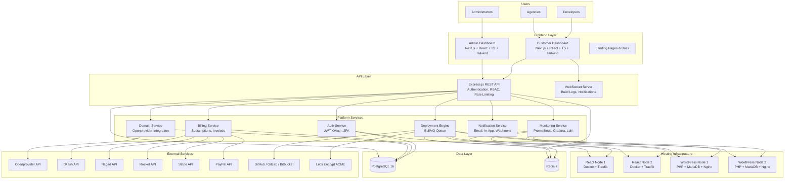
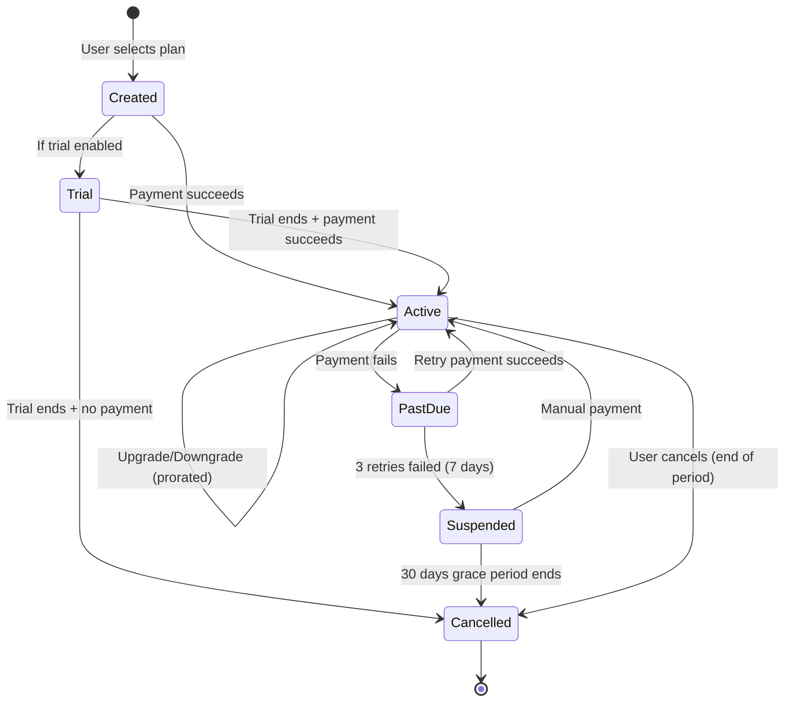
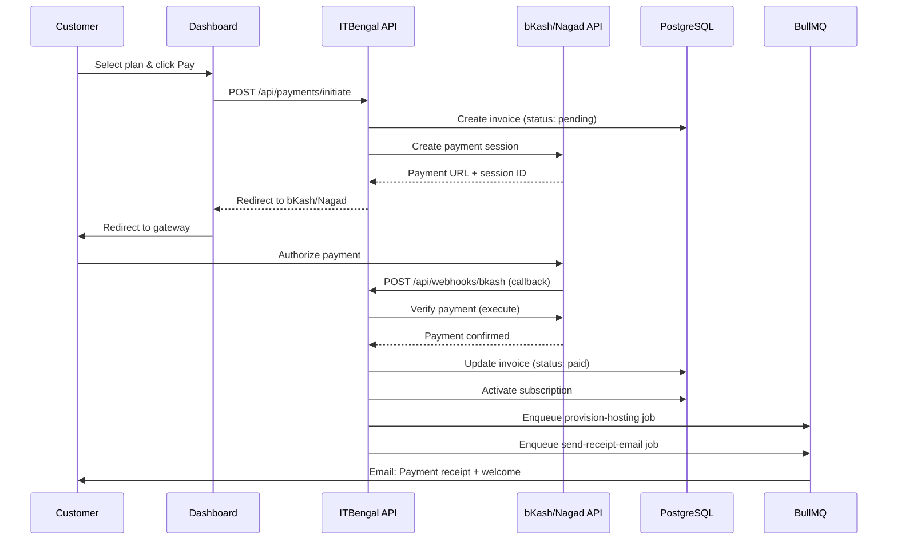
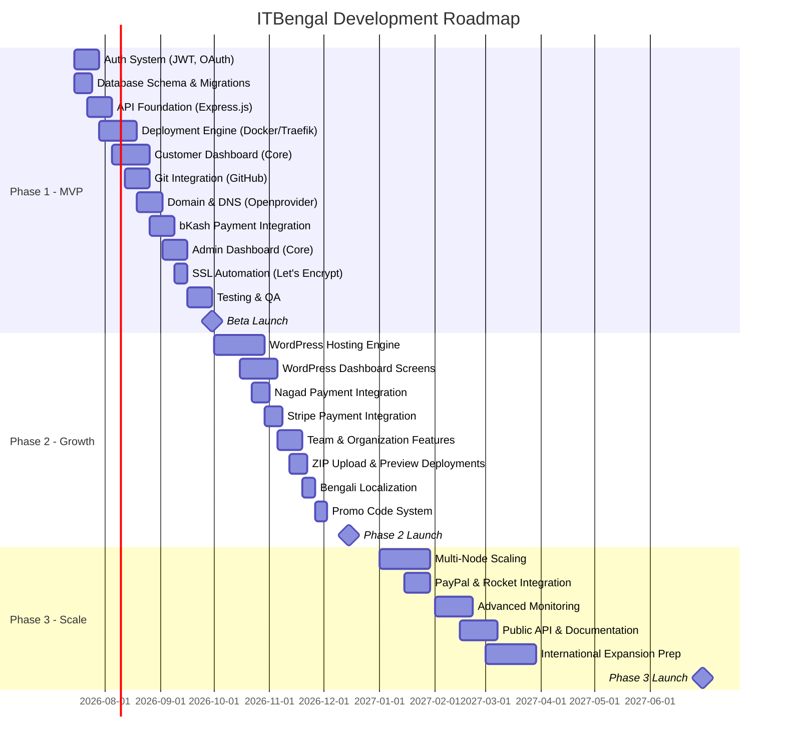

# Product Requirements Document — ITBengal Hosting Platform

> **Version:** 1.0  
> **Date:** July 4, 2026  
> **Status:** Draft  
> **Author:** ITBengal Product Team  
> **Classification:** Internal — Confidential  

---

## Table of Contents

1. [Executive Summary & Vision](#1-executive-summary--vision)
2. [Company Overview](#2-company-overview)
3. [Problem Statement](#3-problem-statement)
4. [Target Market & User Personas](#4-target-market--user-personas)
5. [Product Principles](#5-product-principles)
6. [Feature Matrix — All Products](#6-feature-matrix--all-products)
7. [Payment System](#7-payment-system)
8. [Pricing Tiers](#8-pricing-tiers)
9. [Customer Dashboard Screens](#9-customer-dashboard-screens)
10. [Admin Dashboard Screens](#10-admin-dashboard-screens)
11. [Success Metrics & KPIs](#11-success-metrics--kpis)
12. [MVP Scope Definition](#12-mvp-scope-definition)
13. [Competitive Analysis](#13-competitive-analysis)
14. [Risk Analysis](#14-risk-analysis)
15. [Appendix](#15-appendix)

---

## 1. Executive Summary & Vision

### 1.1 What ITBengal Is

ITBengal is a modern, all-in-one hosting platform purpose-built for the Bangladeshi market and designed for global expansion. It combines the developer-centric deployment experience of **Vercel** and **Netlify**, the managed WordPress power of **Cloudways** and **Hostinger**, and a first-class domain management system — all unified under a single dashboard with native Bangladeshi payment support (bKash, Nagad, Rocket).

### 1.2 Vision

> *Democratize modern hosting for Bangladesh and beyond — making world-class deployment, hosting, and domain management accessible to every developer, agency, startup, and enterprise regardless of geography or payment method.*

### 1.3 Key Differentiators

| Differentiator | Description | Rationale |
|---|---|---|
| **Bangladesh-First Payments** | Native bKash, Nagad, and Rocket integration — no credit card required | 95%+ of BD developers lack international cards; mobile wallets are universal |
| **Unified Platform** | React hosting, WordPress hosting, and domains in one dashboard | Competitors force users to juggle 3-4 separate platforms |
| **Self-Managed Infrastructure** | Runs on own VPS fleet — no AWS/Azure/GCP dependency | Controls costs, latency, and data sovereignty; avoids vendor lock-in |
| **Local-Language Support** | Bengali UI and support team in Dhaka | No global competitor offers Bengali-language customer service |
| **Developer Experience** | Git-push deployments, instant rollbacks, build log streaming | Matches Vercel/Netlify DX that BD developers see but can't easily pay for |
| **Transparent BDT Pricing** | All plans priced in Taka with no hidden FX fees | Eliminates the 3-5% currency conversion surcharge on foreign platforms |

### 1.4 Product Architecture Overview

---

## 2. Company Overview

### 2.1 About ITBengal

ITBengal is a Dhaka-based technology company building Bangladesh's first modern hosting platform. Founded in 2026, the company's mission is to eliminate the barriers that prevent Bangladeshi developers and businesses from accessing world-class hosting infrastructure.

### 2.2 Mission

> *To empower every developer in Bangladesh with hosting infrastructure that is as powerful, beautiful, and easy to use as what Silicon Valley builds for itself — and to make it payable with bKash.*

### 2.3 Core Values

| Value | Description |
|---|---|
| **Developer Obsession** | Every feature starts from the question: "Does this make the developer's life easier?" |
| **Local Roots, Global Standards** | Built for Bangladesh first, but engineered to international quality benchmarks |
| **Radical Simplicity** | If a feature needs a manual to understand, it needs to be redesigned |
| **Infrastructure Independence** | We own our stack — no single cloud vendor can shut us down or change our pricing |
| **Transparency** | Public pricing, public status page, public incident reports |

### 2.4 Why Bangladesh Needs This

Bangladesh's tech ecosystem is growing rapidly:

- **700,000+ registered freelancers** on international platforms (Upwork, Fiverr, Freelancer)
- **$1.3B+ in IT exports** annually (FY 2024-25)
- **10,000+ software companies** registered with BASIS
- **50+ tech hubs and accelerators** across Dhaka, Chattogram, and Sylhet
- **120M+ mobile internet users** — the potential customer base for BD-hosted websites

Yet the hosting landscape remains stuck:

- **No local Vercel/Netlify equivalent** — modern frontend deployment requires foreign services
- **Payment friction** — 90%+ of developers can't pay Vercel/AWS with bKash
- **cPanel dominance** — most BD hosting providers offer 2005-era interfaces
- **No managed WordPress** at Cloudways quality with local payment
- **Limited local support** — English-only ticketing systems for a Bengali-speaking market

---

## 3. Problem Statement

### 3.1 Current Pain Points

| Pain Point | Affected Persona | Severity | Current Workaround |
|---|---|---|---|
| Cannot pay Vercel/Netlify with bKash/Nagad | Freelancers, Students | **Critical** | Ask a friend with a credit card, or use free tiers only |
| cPanel-based hosting is complex and dated | Freelancers, Agencies | **High** | Spend hours in tutorials, accept poor UX |
| No git-push deployment locally | Developers, Startups | **High** | Manual FTP upload or use foreign service |
| WordPress hosting lacks staging/cloning | Agencies | **High** | Test changes on production (risky) |
| High latency to Singapore/US servers | All | **Medium** | Accept slow dashboard and API response times |
| No Bengali-language support | All | **Medium** | Struggle with English-only documentation |
| Domain + Hosting + Billing are separate platforms | Agencies, Enterprise | **Medium** | Maintain 3-4 vendor relationships |
| No proactive security (malware scan, hardening) | WordPress users | **Medium** | Install third-party security plugins |

### 3.2 Market Gap

There is a clear gap in the Bangladeshi market for a platform that:

1. **Accepts bKash, Nagad, and Rocket** as first-class payment methods
2. **Provides Vercel-quality deployment experience** (git push → live in seconds)
3. **Offers managed WordPress hosting** with staging, backups, and security — not just cPanel
4. **Integrates domain management** so users don't need a separate registrar
5. **Delivers a premium, modern UI** inspired by Linear, Vercel, and GitHub
6. **Provides local support** in Bengali with Dhaka-based engineers

---

## 4. Target Market & User Personas

### 4.1 Total Addressable Market (TAM)

| Segment | Estimated Size (Bangladesh) | Avg. Monthly Spend |
|---|---|---|
| Freelance Web Developers | 300,000+ | ৳300-1,500/mo |
| Digital Agencies | 5,000+ | ৳5,000-50,000/mo |
| Startups | 3,000+ | ৳2,000-30,000/mo |
| SME Websites | 50,000+ | ৳500-5,000/mo |
| Enterprise / Government | 1,000+ | ৳50,000+/mo |

### 4.2 Persona 1 — Freelance Developer

| Attribute | Detail |
|---|---|
| **Name** | Rahim Uddin |
| **Age** | 24 |
| **Location** | Mirpur, Dhaka |
| **Role** | Freelance Full-Stack Developer |
| **Experience** | 3 years (React, Next.js, WordPress) |
| **Current Setup** | Free Vercel tier + cheap BD shared hosting for WordPress clients |
| **Monthly Hosting Budget** | ৳500-1,500 |
| **Payment Methods** | bKash, Nagad (no credit card) |
| **Pain Points** | Can't deploy Next.js SSR apps (free Vercel has limits); cPanel is painful; can't pay for Vercel Pro; manages domains at a separate registrar |
| **Goals** | One platform for all client projects; professional deployment URLs to show clients; quick deployments without FTP |
| **Desired Features** | Git-push deploy, custom domains, SSL, bKash payment, affordable starter plan |
| **Willingness to Pay** | ৳299-599/mo per project |

### 4.3 Persona 2 — Digital Agency

| Attribute | Detail |
|---|---|
| **Name** | TechBD Agency |
| **Size** | 15-person team |
| **Location** | Banani, Dhaka |
| **Portfolio** | 50+ active client websites (30 WordPress, 20 React/Next.js) |
| **Current Setup** | Cloudways for WordPress ($50/mo), Vercel Team for React ($20/mo), Namecheap for domains |
| **Monthly Hosting Budget** | ৳15,000-50,000 |
| **Payment Methods** | Company bank transfer, bKash (Stripe for Cloudways via CEO's personal card) |
| **Pain Points** | Managing 3 separate platforms; can't give junior devs limited access; no Bengali invoices for clients; staging environments cost extra on Cloudways |
| **Goals** | Unified dashboard for all projects; team access control; white-label billing for clients; staging environments included |
| **Desired Features** | Organization/team management, role-based access, bulk domain management, WordPress staging, deployment rollbacks, invoices in BDT |
| **Willingness to Pay** | ৳2,999-5,000/mo for a Business plan |

### 4.4 Persona 3 — Startup

| Attribute | Detail |
|---|---|
| **Name** | ShopLocal |
| **Type** | Seed-funded e-commerce startup |
| **Location** | Gulshan, Dhaka |
| **Team** | 8 engineers, 2 designers |
| **Current Setup** | AWS (managed by one senior DevOps who is expensive) |
| **Monthly Hosting Budget** | ৳30,000-100,000 |
| **Payment Methods** | Company credit card, bank transfer |
| **Pain Points** | AWS is overly complex; paying $3,000/mo for a DevOps engineer to manage infrastructure; deployment pipeline took 2 months to build; no easy rollbacks |
| **Goals** | Reduce DevOps overhead; deploy frontend via git push; focus engineering time on product, not infrastructure |
| **Desired Features** | Auto-scaling (future), git deployments, environment variables, build log streaming, team collaboration, API for CI/CD integration |
| **Willingness to Pay** | ৳5,000-30,000/mo |

### 4.5 Persona 4 — Enterprise

| Attribute | Detail |
|---|---|
| **Name** | BanglaBank Ltd. |
| **Type** | Leading financial institution |
| **Location** | Motijheel, Dhaka |
| **Web Presence** | Corporate website, 5 microsite campaigns, internal knowledge base |
| **Current Setup** | On-premise server room with aging hardware |
| **Monthly Hosting Budget** | ৳100,000+ |
| **Payment Methods** | Bank transfer, company purchase order |
| **Pain Points** | On-premise hardware failing; no automatic backups; security vulnerabilities in outdated WordPress; no staging; IT team stretched thin |
| **Goals** | Managed WordPress with enterprise SLA; automatic security updates; daily backups with fast restore; compliance-friendly audit logs |
| **Desired Features** | Enterprise plan with dedicated resources, malware scanning, security hardening, backup/restore, audit logs, dedicated account manager, SLA guarantee |
| **Willingness to Pay** | ৳50,000-200,000/mo |

---

## 5. Product Principles

### 5.1 Simplicity First

Every interaction should be completable in the fewest possible clicks. If a user needs documentation to perform a basic task, the UI has failed.

**Decision Rationale:** Our primary market (freelancers) has limited time and patience for complex interfaces. Vercel proved that "git push to deploy" is the gold standard — we must match or exceed that simplicity.

### 5.2 Bangladesh-First, Globally Capable

Every default — currency, language, payment method, server location, support hours — should be optimized for Bangladesh. But the architecture must support international expansion without re-engineering.

**Decision Rationale:** Launching globally from day one dilutes focus. Winning Bangladesh first creates a defensible home market and a template for other emerging markets (Pakistan, Nigeria, Vietnam).

### 5.3 Developer Experience as a Priority

The CLI, API, and dashboard must feel like tools built *by* developers *for* developers. No marketing fluff in the UI. No unnecessary modals. Fast, keyboard-navigable, dark-mode-default.

**Decision Rationale:** Developers are our initial adopters. Their word-of-mouth drives agency and startup adoption. DX is the product.

### 5.4 Self-Managed Infrastructure Independence

We run our own VPS infrastructure. No AWS, Azure, or GCP. This gives us cost control, data sovereignty, and freedom from vendor lock-in.

**Decision Rationale:** Cloud provider bills scale non-linearly. At 10,000 customers, self-managed infrastructure costs 40-60% less than equivalent cloud services. It also ensures Bangladesh data residency compliance.

### 5.5 Transparent Pricing

All pricing is public, in BDT, with no hidden fees. Bandwidth overages are warned, not surprise-billed. Plan comparisons are clear.

**Decision Rationale:** Trust is the #1 barrier for new hosting customers in Bangladesh. Transparent pricing builds trust faster than any marketing campaign.

### 5.6 Security by Default

SSL is automatic. Firewalls are pre-configured. WordPress hardening is on by default. Container isolation is mandatory. There is no "insecure" option.

**Decision Rationale:** Most BD WordPress sites run without basic security. Making security opt-out (rather than opt-in) protects our customers and our platform's reputation.

---

## 6. Feature Matrix — All Products

### 6.1 React Hosting (Modern App Hosting)

> **Naming Note:** We call this "React Hosting" for marketing simplicity, but it supports all modern frontend frameworks. The internal system name is `app_hosting`.

#### 6.1.1 Supported Frameworks

| Framework | Build Command (Default) | Output Directory (Default) | Server Type | Status |
|---|---|---|---|---|
| React (CRA) | `npm run build` | `build/` | Static | MVP |
| Next.js | `npm run build` | `.next/` | SSR (Docker) | MVP |
| Vue.js | `npm run build` | `dist/` | Static | MVP |
| Angular | `ng build` | `dist/<project>/` | Static | MVP |
| Svelte / SvelteKit | `npm run build` | `build/` | Static / SSR | Phase 2 |
| Astro | `npm run build` | `dist/` | Static / SSR | Phase 2 |
| Vite (Generic) | `npm run build` | `dist/` | Static | MVP |
| Static HTML | N/A (no build) | `/` | Static | MVP |

**Design Decision:** We auto-detect the framework from `package.json` and pre-fill build settings. Users can override. This mirrors Vercel's framework detection but with manual override always available.

#### 6.1.2 Deployment Methods

| Method | Description | Use Case | MVP? |
|---|---|---|---|
| **Git Push (GitHub)** | Connect GitHub repo → auto-deploy on push to branch | Primary workflow for developers | ✅ Yes |
| **Git Push (GitLab)** | Connect GitLab repo → auto-deploy on push | GitLab users | ✅ Yes |
| **Git Push (Bitbucket)** | Connect Bitbucket repo → auto-deploy on push | Bitbucket users | ✅ Yes |
| **ZIP Upload** | Upload a ZIP file of built assets or source code | Non-Git users, quick demos | ✅ Yes |
| **Docker Image** | Push a pre-built Docker image | Advanced users, custom runtimes | Phase 2 |

#### 6.1.3 Complete Feature List

| Feature | Description | MVP? |
|---|---|---|
| **Automatic Builds** | Clone → install dependencies → build → containerize → deploy | ✅ |
| **Build Log Streaming** | Real-time WebSocket streaming of build output to dashboard | ✅ |
| **Automatic Deployment on Push** | Webhook triggers deployment on git push to configured branch | ✅ |
| **Automatic SSL** | Let's Encrypt certificate provisioned automatically for custom domains | ✅ |
| **Custom Domain Management** | Add custom domains, verify via DNS, configure routing | ✅ |
| **Environment Variables** | Encrypted at rest (AES-256), injected at build time and runtime | ✅ |
| **Deployment Logs** | Full build and runtime logs stored and searchable | ✅ |
| **Instant Rollback** | One-click rollback to any previous deployment (keeps last N containers) | ✅ |
| **Application Restart** | Restart the running container without redeploying | ✅ |
| **Usage Analytics** | Bandwidth, request count, build minutes consumed | ✅ |
| **Build Minutes Tracking** | Track and enforce build minute limits per plan | ✅ |
| **Deployment Queue** | BullMQ-based queue with priority levels per plan | ✅ |
| **Preview Deployments** | Deploy PRs to unique URLs for review | Phase 2 |
| **Custom Dockerfiles** | User provides their own Dockerfile | Phase 2 |
| **Cron Jobs** | Scheduled task execution within the container | Phase 3 |

### 6.2 WordPress Hosting (Managed WordPress)

#### 6.2.1 Complete Feature List

| Feature | Description | MVP? |
|---|---|---|
| **One-Click Install** | Select WP version, set admin credentials, site title → provisioned in < 2 minutes | ✅ |
| **Automatic SSL** | Let's Encrypt certificate provisioned and renewed automatically | ✅ |
| **Automatic Daily Backups** | Full-site backup (files + database) every 24 hours; retention per plan | ✅ |
| **One-Click Restore** | Restore from any backup point — full, database-only, or files-only | ✅ |
| **Staging Environment** | One-click clone of production → make changes → push to production | ✅ |
| **Clone Website** | Clone an existing WP site to a new project (different domain) | Phase 2 |
| **Web File Manager** | Browser-based file explorer: browse, upload, download, edit, delete, change permissions | ✅ |
| **Web Database Manager** | Custom DB manager (not phpMyAdmin): view tables, run queries, import/export SQL | ✅ |
| **Malware Scanning** | Scheduled daily scan + on-demand scan for known malware signatures | ✅ |
| **Malware Removal** | Automated quarantine and removal of detected malware | Phase 2 |
| **Auto WP Core Updates** | Automatic minor version updates (e.g., 6.4.1 → 6.4.2); major version configurable | ✅ |
| **Auto Plugin Updates** | Configurable per-plugin: auto-update or manual | ✅ |
| **Auto Theme Updates** | Configurable per-theme: auto-update or manual | ✅ |
| **Redis Object Cache** | Server-level Redis caching for WordPress object cache | ✅ |
| **Page Cache** | Full-page caching with automatic cache invalidation on content change | ✅ |
| **OPcache** | PHP OPcache pre-configured and optimized | ✅ |
| **Security Hardening** | Disable XML-RPC, disable file editing, hide WP version, directory listing off, force HTTPS, security headers, login URL customization, brute force protection (fail2ban) | ✅ |
| **PHP Version Management** | Switch between PHP 8.1, 8.2, 8.3 per site | ✅ |
| **Performance Optimization** | GZIP compression, browser caching headers, image optimization (future) | ✅ |
| **Error Logs** | PHP error logs viewable from dashboard | ✅ |
| **Resource Monitoring** | CPU, RAM, disk, bandwidth usage per site | ✅ |
| **WP-CLI Access** | Run WP-CLI commands from dashboard (future) | Phase 3 |

### 6.3 Domain Management (via Openprovider)

> **Design Decision:** We chose Openprovider as our registrar backend because they offer competitive pricing, a robust REST API, support for 1000+ TLDs, and a reseller program that lets us set our own margins.

#### 6.3.1 Complete Feature List

| Feature | Description | MVP? |
|---|---|---|
| **Domain Search** | Search domain availability across multiple TLDs; show pricing per TLD | ✅ |
| **Domain Registration** | Register domains via Openprovider API; support .com, .net, .org, .bd, .com.bd, and 100+ TLDs | ✅ |
| **Domain Transfer** | Transfer domains in from other registrars with auth/EPP code | ✅ |
| **Domain Renewal** | Manual renewal + auto-renew toggle; renewal reminders at 90, 60, 30, 7, 1 day(s) before expiry | ✅ |
| **DNS Record Management** | Full CRUD for A, AAAA, CNAME, MX, TXT, SRV, NS, CAA records with TTL control | ✅ |
| **WHOIS Privacy** | Toggle WHOIS privacy protection on/off per domain | ✅ |
| **Custom Nameservers** | Set custom nameservers (for users who manage DNS elsewhere) | ✅ |
| **Domain Locking** | Lock/unlock domain to prevent unauthorized transfers | ✅ |
| **Bulk Domain Management** | Register, renew, or update DNS for multiple domains at once | Phase 2 |
| **Domain Status Sync** | Background job syncs domain status with Openprovider every 6 hours | ✅ |
| **Expiry Notifications** | Email + in-app notifications for upcoming domain expirations | ✅ |

---

## 7. Payment System

### 7.1 Payment Gateways

#### 7.1.1 Bangladesh Gateways

| Gateway | Integration Type | Use Case | Status |
|---|---|---|---|
| **bKash** | REST API (Tokenized Checkout) | Most popular — 65M+ users | MVP |
| **Nagad** | REST API (Merchant Payment) | Second most popular — 60M+ users | MVP |
| **Rocket** | REST API (Merchant Payment) | Third option — 20M+ users | Phase 2 |

**Design Decision:** bKash is integrated first because it has the largest user base. Nagad follows immediately. Rocket is Phase 2 because its API documentation is less mature.

#### 7.1.2 International Gateways

| Gateway | Integration Type | Use Case | Status |
|---|---|---|---|
| **Stripe** | Stripe.js + Webhooks | International cards, subscriptions | MVP |
| **PayPal** | REST API + IPN/Webhooks | PayPal balance, international users | Phase 2 |

### 7.2 Subscription Lifecycle

### 7.3 Payment Processing Flow

### 7.4 Invoice System

| Feature | Description |
|---|---|
| **Auto Generation** | Invoice generated automatically on each billing cycle |
| **Manual Generation** | Admins can create manual invoices for custom services |
| **PDF Export** | Download invoice as PDF with ITBengal branding, BDT amounts, VAT breakdown |
| **Tax Handling** | 15% VAT for Bangladesh customers; configurable per region for international |
| **Invoice Numbering** | Sequential: `INV-2026-000001` format |
| **Due Date** | 7 days from generation; configurable |

### 7.5 Refund Processing

| Type | Description | Processing Time |
|---|---|---|
| **Full Refund** | Return full amount to original payment method | 3-7 business days |
| **Partial Refund** | Return prorated amount (e.g., mid-cycle cancellation) | 3-7 business days |
| **Account Credit** | Add credit to customer's ITBengal wallet for future use | Instant |

### 7.6 Promo Code System

| Attribute | Options |
|---|---|
| **Discount Type** | Percentage (e.g., 20% off) or Fixed Amount (e.g., ৳500 off) |
| **Duration** | One-time, N months, or forever |
| **Usage Limits** | Total uses, per-customer uses, minimum spend |
| **Validity** | Start date, end date, active/inactive toggle |
| **Scope** | All plans, specific plans, specific products |

### 7.7 Auto Billing & Dunning

| Event | Timing | Action |
|---|---|---|
| Payment attempt 1 | Day of renewal | Charge payment method on file |
| Payment failed email | Day of renewal | Email: "Payment failed — please update payment method" |
| Payment attempt 2 | Day +3 | Retry charge |
| Payment attempt 3 | Day +7 | Final retry |
| Service suspension | Day +7 (after 3 failures) | Suspend hosting (sites offline, data preserved) |
| Final warning email | Day +21 | Email: "Account will be deleted in 9 days" |
| Account cancellation | Day +30 | Cancel subscription, schedule data deletion (30 more days) |

---

## 8. Pricing Tiers

### 8.1 React Hosting Plans

| Feature | Starter | Basic | Professional | Business | Enterprise |
|---|---|---|---|---|---|
| **Monthly Price** | ৳299 / $3 | ৳599 / $6 | ৳1,499 / $15 | ৳2,999 / $30 | Custom |
| **Annual Price** | ৳2,990 / $30 | ৳5,990 / $60 | ৳14,990 / $150 | ৳29,990 / $300 | Custom |
| **CPU** | 0.5 vCPU | 1 vCPU | 2 vCPU | 4 vCPU | 8+ vCPU |
| **RAM** | 512 MB | 1 GB | 2 GB | 4 GB | 8+ GB |
| **SSD Storage** | 1 GB | 5 GB | 20 GB | 50 GB | 100+ GB |
| **Bandwidth** | 10 GB/mo | 50 GB/mo | 200 GB/mo | 500 GB/mo | 1+ TB/mo |
| **Projects** | 1 | 3 | 10 | 25 | Unlimited |
| **Custom Domains** | 1 | 3 | 10 | 25 | Unlimited |
| **Backups** | None | Daily (7-day retention) | Daily (14-day) | Daily (30-day) | Hourly (90-day) |
| **Build Minutes/mo** | 100 | 300 | 1,000 | 3,000 | Unlimited |
| **Deployments/day** | 10 | 30 | 100 | 300 | Unlimited |
| **Team Members** | 1 | 3 | 10 | 25 | Unlimited |
| **Priority Queue** | No | No | Yes | Yes | Yes |
| **SSL** | Shared | Dedicated | Dedicated | Dedicated | Dedicated |
| **Log Retention** | 1 day | 3 days | 7 days | 30 days | 90 days |
| **Support** | Community | Email (48h) | Priority Email (24h) | Priority + Chat (4h) | Dedicated AM + Phone |

**Pricing Rationale:**
- **Starter at ৳299** ($3): Lower than Vercel's $20 Pro plan. Targets students and freelancers. At scale, each Starter customer costs ~৳100/mo in infrastructure.
- **Annual discount**: ~17% discount incentivizes commitment and reduces churn.
- **Enterprise**: Custom pricing allows negotiation for large accounts.

### 8.2 WordPress Hosting Plans

| Feature | Starter | Basic | Professional | Business | Enterprise |
|---|---|---|---|---|---|
| **Monthly Price** | ৳199 / $2 | ৳499 / $5 | ৳1,299 / $13 | ৳2,499 / $25 | Custom |
| **Annual Price** | ৳1,990 / $20 | ৳4,990 / $50 | ৳12,990 / $130 | ৳24,990 / $250 | Custom |
| **CPU** | 0.5 vCPU | 1 vCPU | 2 vCPU | 4 vCPU | 8+ vCPU |
| **RAM** | 512 MB | 1 GB | 2 GB | 4 GB | 8+ GB |
| **SSD Storage** | 2 GB | 10 GB | 30 GB | 60 GB | 150+ GB |
| **Bandwidth** | 20 GB/mo | 100 GB/mo | 300 GB/mo | 750 GB/mo | 2+ TB/mo |
| **WordPress Sites** | 1 | 3 | 10 | 25 | Unlimited |
| **Custom Domains** | 1 | 3 | 10 | 25 | Unlimited |
| **PHP Workers** | 2 | 4 | 8 | 16 | 32+ |
| **Backups** | Weekly (2 retention) | Daily (7-day) | Daily (14-day) | Daily (30-day) | Hourly (90-day) |
| **Staging** | No | Yes (1) | Yes (3) | Yes (10) | Yes (Unlimited) |
| **Malware Scan** | Weekly | Daily | Daily | Hourly | Real-time |
| **Auto Updates** | Core only | Core + Plugins | Core + Plugins + Themes | All + Custom schedule | All + Managed |
| **Caching** | OPcache | OPcache + Page | OPcache + Page + Redis | Full stack | Full stack + CDN |
| **Team Members** | 1 | 3 | 10 | 25 | Unlimited |
| **Support** | Community | Email (48h) | Priority Email (24h) | Priority + Chat (4h) | Dedicated AM + Phone |

**Pricing Rationale:**
- WordPress Starter at ৳199 is competitive with budget BD hosts (ExonHost ৳150-250) but includes SSL, backups, and caching that they charge extra for.
- WordPress plans have more storage because WP sites (with media uploads) consume more disk than React apps.

---

## 9. Customer Dashboard Screens

### 9.1 Dashboard (Home)

| Attribute | Detail |
|---|---|
| **Purpose** | At-a-glance overview of all hosting activity |
| **Key Components** | Summary cards (active projects, domains, bandwidth used, upcoming renewals), recent deployments timeline, deployment status ring chart, quick-action buttons |
| **Data Displayed** | Active React apps count, active WP sites count, registered domains, total bandwidth used this month (% of limit), next renewal date & amount, last 5 deployments (status + timestamp) |
| **Actions** | Create new project, register domain, view all notifications, quick deploy from last repo |
| **Navigation** | Top nav bar with search (⌘K), sidebar with all sections |

### 9.2 Projects

| Attribute | Detail |
|---|---|
| **Purpose** | Unified view of all hosting projects (React + WordPress) |
| **Key Components** | Grid/list toggle, search bar, filter by type (React/WordPress), sort by name/date/status |
| **Data Displayed** | Project name, type (React/WP badge), framework icon, status (active/deploying/error/suspended), last deployed timestamp, domain |
| **Actions** | Create new project (wizard), search, filter, click to open project detail |

### 9.3 React Apps — List View

| Attribute | Detail |
|---|---|
| **Purpose** | Manage all React/modern app deployments |
| **Key Components** | App cards with status indicator (green dot = live, yellow = deploying, red = failed), framework badge, last deploy time |
| **Data Displayed** | App name, framework (React/Next.js/Vue/etc.), production URL, git repo link, deployment status, last deploy date |
| **Actions** | Create new app, deploy now, view logs, open settings, visit live URL |

### 9.4 React App — Detail View

| Attribute | Detail |
|---|---|
| **Purpose** | Full management interface for a single React app |
| **Tabs** | Overview, Deployments, Domains, Environment Variables, Settings, Analytics |
| **Overview Tab** | Production URL, current deployment hash, uptime %, bandwidth used, last 10 deployments mini-list |
| **Deployments Tab** | Full deployment history with status, commit hash, duration, triggered by (push/manual), build logs (expandable), rollback button per deployment |
| **Domains Tab** | List of custom domains, DNS verification status, SSL status, add domain form |
| **Env Vars Tab** | Key-value list (values masked), add/edit/delete, mark as build-time or runtime, bulk import |
| **Settings Tab** | Build command, output dir, Node.js version, root directory, auto-deploy toggle, branch filter, delete project (danger zone) |
| **Analytics Tab** | Bandwidth chart, request count, top paths, geographic distribution (future) |

### 9.5 WordPress Sites — List View

| Attribute | Detail |
|---|---|
| **Purpose** | Manage all WordPress installations |
| **Key Components** | Site cards with WP version badge, PHP version, status indicator, health score |
| **Data Displayed** | Site name, domain, WP version, PHP version, status (active/staging/maintenance), last backup date, health score (security + performance) |
| **Actions** | Create new WP site, manage, visit site, WP admin link |

### 9.6 WordPress Site — Detail View

| Attribute | Detail |
|---|---|
| **Purpose** | Full management interface for a single WordPress site |
| **Tabs** | Overview, File Manager, Database, Backups, Staging, Security, Settings |
| **Overview Tab** | WP version, PHP version, disk usage, bandwidth, active plugins count, health score, quick actions (clear cache, update all, restart PHP) |
| **File Manager Tab** | Tree view file browser, upload/download/edit/delete files, permission editor |
| **Database Tab** | Table list, row count per table, SQL query runner, import/export SQL dumps |
| **Backups Tab** | List of backups with date, size, type (auto/manual), restore button, download button, create manual backup button |
| **Staging Tab** | Create staging (clone production), staging URL, push staging to production (with confirmation modal), delete staging |
| **Security Tab** | Malware scan results, hardening toggles (XML-RPC, file editing, etc.), login URL, brute force protection status, last scan date |
| **Settings Tab** | PHP version selector, WP auto-update preferences, caching toggles, domain settings, delete site (danger zone) |

### 9.7 Domains

| Attribute | Detail |
|---|---|
| **Purpose** | Manage all registered and connected domains |
| **Key Components** | Domain list with status badges, search, filter by status (active/expiring/expired) |
| **Data Displayed** | Domain name, status (active/expiring soon/expired/transferring), expiry date, auto-renew toggle, WHOIS privacy badge, nameservers |
| **Actions** | Register new domain (search modal), transfer domain, manage DNS, toggle auto-renew, toggle WHOIS privacy |

### 9.8 DNS Manager

| Attribute | Detail |
|---|---|
| **Purpose** | Manage DNS records for a specific domain |
| **Key Components** | Record table with type/name/value/TTL columns, add record form, edit inline, delete with confirmation |
| **Data Displayed** | Record type (A, AAAA, CNAME, MX, TXT, SRV, NS, CAA), hostname, value, TTL, priority (for MX/SRV) |
| **Actions** | Add record, edit record, delete record, import zone file, export zone file |

### 9.9 SSL Certificates

| Attribute | Detail |
|---|---|
| **Purpose** | View and manage SSL certificates for all domains |
| **Data Displayed** | Domain, issuer (Let's Encrypt), status (active/pending/expired), expiry date, auto-renew status |
| **Actions** | Request new certificate, force renewal, view certificate details |

### 9.10 Billing Overview

| Attribute | Detail |
|---|---|
| **Purpose** | Financial overview and payment method management |
| **Key Components** | Current plan card, usage bar (% of limits), next billing date + amount, payment methods list, account credit balance |
| **Data Displayed** | Active plan name & price, usage metrics (bandwidth, build minutes, storage), next invoice date, saved payment methods |
| **Actions** | Upgrade/downgrade plan, add payment method, set default payment method, apply promo code, view billing history |

### 9.11 Invoices

| Attribute | Detail |
|---|---|
| **Purpose** | View and download all invoices |
| **Key Components** | Invoice table with status badges (paid ✅, pending ⏳, overdue 🔴) |
| **Data Displayed** | Invoice number, date, amount (BDT), status, payment method used, due date |
| **Actions** | Download PDF, pay now (for pending), view invoice detail |

### 9.12 Subscriptions

| Attribute | Detail |
|---|---|
| **Purpose** | Manage active subscriptions |
| **Data Displayed** | Plan name, product (React/WordPress), billing cycle, next renewal, status |
| **Actions** | Change plan (upgrade/downgrade with prorated preview), cancel subscription (with confirmation and end-of-period option), reactivate cancelled subscription |

### 9.13 Usage Analytics

| Attribute | Detail |
|---|---|
| **Purpose** | Detailed resource consumption tracking |
| **Key Components** | Time-series charts (daily/weekly/monthly), usage bars per resource |
| **Data Displayed** | Bandwidth used vs. limit, build minutes used vs. limit, storage used vs. limit, deployments count, API requests count |
| **Actions** | Change time range, export CSV, set usage alerts |

### 9.14 Deployment Logs

| Attribute | Detail |
|---|---|
| **Purpose** | Searchable log viewer for all deployments |
| **Key Components** | Log stream with ANSI color support, search bar, filters (project, status, date range) |
| **Data Displayed** | Timestamp, log level, message, project name, deployment ID |
| **Actions** | Search logs, filter by project/status/date, real-time streaming for active builds (WebSocket), download logs |

### 9.15 Backups

| Attribute | Detail |
|---|---|
| **Purpose** | Cross-product backup management |
| **Data Displayed** | Backup date, project name, type (auto/manual), size, status (completed/in-progress/failed) |
| **Actions** | Restore backup, download backup, create manual backup, configure backup schedule |

### 9.16 Support

| Attribute | Detail |
|---|---|
| **Purpose** | Customer support ticket system |
| **Key Components** | Ticket list, create ticket form, ticket detail with message thread |
| **Data Displayed** | Ticket ID, subject, status (open/in-progress/waiting/closed), priority, created date, last update |
| **Actions** | Create ticket (select category, priority, attach files), reply to ticket, close ticket, rate support experience |

### 9.17 Notifications

| Attribute | Detail |
|---|---|
| **Purpose** | In-app notification center |
| **Key Components** | Notification dropdown (bell icon in nav), full notification page, email preference toggles |
| **Data Displayed** | Notification message, timestamp, read/unread status, category (deployment, billing, domain, security, system) |
| **Actions** | Mark as read, mark all as read, configure email notifications per category |

### 9.18 Profile

| Attribute | Detail |
|---|---|
| **Purpose** | Personal account settings |
| **Data Displayed** | Name, email, phone, avatar, account created date, last login |
| **Actions** | Update name/email/phone, upload avatar, change password, delete account |

### 9.19 API Keys

| Attribute | Detail |
|---|---|
| **Purpose** | Manage programmatic API access |
| **Data Displayed** | Key name, prefix (first 8 chars), created date, last used date, permissions |
| **Actions** | Generate new key (shown once), revoke key, set permissions (read/write/admin), set expiry |

### 9.20 Organizations

| Attribute | Detail |
|---|---|
| **Purpose** | Multi-user account management for teams and agencies |
| **Data Displayed** | Org name, member count, plan, billing owner |
| **Actions** | Create organization, invite members (by email), set billing at org level, switch between personal and org context |

### 9.21 Teams

| Attribute | Detail |
|---|---|
| **Purpose** | Fine-grained access control within an organization |
| **Data Displayed** | Team name, members, assigned projects, role |
| **Actions** | Create team, add/remove members, assign projects, set team-level permissions (admin, developer, viewer) |

### 9.22 Security

| Attribute | Detail |
|---|---|
| **Purpose** | Account security management |
| **Key Components** | 2FA setup, active sessions list, login history, security recommendations |
| **Data Displayed** | 2FA status (enabled/disabled), active sessions (device, IP, location, last active), login history (last 30 days), security score |
| **Actions** | Enable/disable 2FA (TOTP), revoke specific session, revoke all other sessions, download recovery codes |

### 9.23 Settings

| Attribute | Detail |
|---|---|
| **Purpose** | Application preferences |
| **Key Components** | Theme toggle, language selector, timezone, notification preferences, danger zone |
| **Data Displayed** | Current theme, language, timezone |
| **Actions** | Switch theme (dark/light/system), set language (English/Bengali), set timezone, configure notification preferences, delete account (danger zone with confirmation) |

---

## 10. Admin Dashboard Screens

### 10.1 Admin Dashboard (Overview)

| Attribute | Detail |
|---|---|
| **Purpose** | Real-time business and infrastructure health overview |
| **KPI Cards** | Total Revenue (this month), Active Customers, Active Projects, Server Load (avg CPU %), Open Support Tickets |
| **Charts** | Revenue trend (30 days), new signups (30 days), deployment volume (30 days), churn rate (12 months) |
| **Actions** | Quick links to customer management, support tickets, server health |

### 10.2 Customer Management

| Attribute | Detail |
|---|---|
| **Purpose** | View and manage all customer accounts |
| **Key Components** | Searchable/filterable customer table, customer detail drawer |
| **Data Displayed** | Customer name, email, plan, signup date, status (active/suspended/deleted), MRR contribution, last login |
| **Actions** | View detail, edit profile, suspend/unsuspend, impersonate (login as customer), reset password, delete account, view activity log |

### 10.3 Orders

| Attribute | Detail |
|---|---|
| **Purpose** | Track all purchase orders |
| **Data Displayed** | Order ID, customer, product, amount, payment method, status (completed/pending/failed/refunded), date |
| **Actions** | View detail, refund, filter by status/product/date, export CSV |

### 10.4 Payments

| Attribute | Detail |
|---|---|
| **Purpose** | Transaction management and reconciliation |
| **Data Displayed** | Transaction ID, customer, amount, gateway (bKash/Nagad/Stripe), status, date, invoice reference |
| **Actions** | Refund (full/partial), filter by gateway/status/date range, export CSV, view payment details |

### 10.5 Domains Management

| Attribute | Detail |
|---|---|
| **Purpose** | Overview of all customer domains |
| **Data Displayed** | Domain name, customer, registrar status, expiry date, auto-renew, WHOIS privacy, nameservers |
| **Actions** | View DNS records, force sync with Openprovider, extend registration, bulk operations |

### 10.6 Hosting Management

| Attribute | Detail |
|---|---|
| **Purpose** | Overview of all hosting accounts and resource allocation |
| **Data Displayed** | Project name, customer, type (React/WP), server node assignment, CPU/RAM/storage used, status |
| **Actions** | Migrate to different node, adjust resource limits, suspend/unsuspend, view logs |

### 10.7 Deployments

| Attribute | Detail |
|---|---|
| **Purpose** | Monitor all deployment activity across the platform |
| **Data Displayed** | Deployment ID, project, customer, status (active/queued/building/failed), node, start time, duration |
| **Actions** | View build logs, retry failed deployment, cancel queued deployment, filter by status |

### 10.8 React Servers

| Attribute | Detail |
|---|---|
| **Purpose** | Manage the fleet of React hosting nodes |
| **Data Displayed** | Server IP, hostname, health status (healthy/degraded/offline), CPU %, RAM %, disk %, container count, last health check |
| **Actions** | Add new server (register VPS), remove server (drain & decommission), view detailed metrics, restart services, SSH access link |

### 10.9 WordPress Servers

| Attribute | Detail |
|---|---|
| **Purpose** | Same as React Servers but for WordPress infrastructure |
| **Data Displayed** | Server IP, hostname, health, CPU/RAM/disk, WP site count, PHP version, MariaDB status |
| **Actions** | Add/remove server, view metrics, restart services, manage PHP/MariaDB |

### 10.10 Server Health

| Attribute | Detail |
|---|---|
| **Purpose** | Real-time infrastructure monitoring dashboard |
| **Key Components** | Live-updating gauges for CPU, RAM, disk, network; alert badges |
| **Data Displayed** | Per-server metrics: CPU usage, RAM usage, disk I/O, network throughput, active containers, uptime |
| **Actions** | Set alert thresholds, acknowledge alerts, view historical metrics |

### 10.11 Monitoring (Grafana Integration)

| Attribute | Detail |
|---|---|
| **Purpose** | Embedded Grafana dashboards for deep metrics |
| **Key Components** | Iframe or reverse-proxy to Grafana with pre-built dashboards |
| **Dashboards** | Server overview, per-node detail, deployment pipeline metrics, database performance, API latency |
| **Actions** | View dashboards, configure alert rules, manage notification channels (email, Slack, webhook) |

### 10.12 Analytics

| Attribute | Detail |
|---|---|
| **Purpose** | Business intelligence and product analytics |
| **Key Components** | Revenue charts, customer lifecycle funnel, product usage heat map |
| **Data Displayed** | MRR/ARR trend, ARPU, churn rate, LTV, CAC, signups by source, popular plans, popular frameworks |
| **Actions** | Filter by date range, export reports, drill down by segment |

### 10.13 Support Tickets

| Attribute | Detail |
|---|---|
| **Purpose** | Manage customer support requests |
| **Data Displayed** | Ticket ID, subject, customer, priority (low/medium/high/urgent), status (open/in-progress/waiting/closed), assigned agent, created date, SLA timer |
| **Actions** | Assign to agent, reply (internal note or customer-visible), escalate, close, merge duplicate tickets, filter/sort |

### 10.14 Coupons & Promo Codes

| Attribute | Detail |
|---|---|
| **Purpose** | Create and manage promotional discounts |
| **Data Displayed** | Code, discount type/value, duration, usage count, usage limit, start/end dates, status (active/expired/disabled) |
| **Actions** | Create new code, edit, disable, delete, view usage report |

### 10.15 Pricing Management

| Attribute | Detail |
|---|---|
| **Purpose** | Manage plan features and pricing without code changes |
| **Data Displayed** | All plans with current features, prices, active subscriber count |
| **Actions** | Edit plan features, change pricing (takes effect for new subscriptions), enable/disable plans, create custom plan |

### 10.16 Announcements

| Attribute | Detail |
|---|---|
| **Purpose** | Communicate with all customers |
| **Key Components** | Rich text editor, scheduling, targeting |
| **Data Displayed** | Announcement title, content, type (banner/modal/notification), status (draft/scheduled/published), date |
| **Actions** | Create announcement, publish immediately or schedule, target all users or by plan, dismiss tracking |

### 10.17 Audit Logs

| Attribute | Detail |
|---|---|
| **Purpose** | Complete audit trail for compliance and debugging |
| **Data Displayed** | Timestamp, actor (user email or system), action (created/updated/deleted), target (resource type + ID), IP address, user agent |
| **Actions** | Search, filter by actor/action/target/date, export CSV, view detail |

### 10.18 Security Dashboard

| Attribute | Detail |
|---|---|
| **Purpose** | Security monitoring and threat management |
| **Data Displayed** | Failed login attempts (last 24h), suspicious activity alerts, blocked IPs, active 2FA adoption rate |
| **Actions** | Block/unblock IP, view failed login details, configure WAF rules, force password reset for user |

### 10.19 System Settings

| Attribute | Detail |
|---|---|
| **Purpose** | Platform-wide configuration |
| **Settings** | SMTP configuration (host, port, credentials), payment gateway API keys, Openprovider credentials, maintenance mode toggle, feature flags, default plans, global rate limits, backup retention defaults |
| **Actions** | Update settings, test SMTP, test payment gateway, enable/disable features |

---

## 11. Success Metrics & KPIs

### 11.1 Business KPIs

| KPI | Definition | Target (Year 1) | Target (Year 2) |
|---|---|---|---|
| **MRR** | Monthly Recurring Revenue | ৳500,000 | ৳5,000,000 |
| **ARR** | Annual Recurring Revenue | ৳6,000,000 | ৳60,000,000 |
| **Churn Rate** | % of customers who cancel per month | < 5% | < 3% |
| **LTV** | Average revenue per customer over lifetime | ৳10,000 | ৳25,000 |
| **CAC** | Cost to acquire one customer | < ৳1,000 | < ৳2,000 |
| **NPS** | Net Promoter Score | > 40 | > 60 |
| **Paying Customers** | Total active paying accounts | 500 | 5,000 |

### 11.2 Technical KPIs

| KPI | Definition | Target |
|---|---|---|
| **Platform Uptime** | % time dashboard/API is available | 99.9% |
| **Hosted App Uptime** | % time customer apps are available | 99.95% |
| **Deployment Success Rate** | % of deployments that complete without error | > 95% |
| **Average Build Time** | Mean build duration across all projects | < 60 seconds |
| **P95 API Response Time** | 95th percentile API latency | < 200ms |
| **Time to First Deploy** | Minutes from signup to first live deployment | < 5 minutes |
| **Mean Time to Recovery** | Average time to restore service after outage | < 30 minutes |

### 11.3 Product KPIs

| KPI | Definition | Target |
|---|---|---|
| **DAU/MAU Ratio** | Daily active users / monthly active users | > 30% |
| **Feature Adoption** | % of users using Git deployments | > 70% |
| **Support Ticket Volume** | Tickets per 100 customers per month | < 10 |
| **CSAT** | Customer satisfaction score (post-ticket survey) | > 4.5/5 |
| **Onboarding Completion** | % of signups that complete first deployment | > 60% |

---

## 12. MVP Scope Definition

### 12.1 Phase 1 — MVP (Months 1-3)

**Goal:** Launch a functional platform that can accept paying customers for React hosting with bKash payment.

**Included:**
- User registration & login (email/password + GitHub OAuth)
- React hosting (Git push deployment for React, Next.js, Vue, Vite, Angular, static HTML)
- Build log streaming
- Custom domains + automatic SSL
- Environment variables
- Instant rollback
- bKash payment integration
- Starter, Basic, Professional plans (React only)
- Customer dashboard (core screens: Dashboard, Projects, React Apps, Domains, DNS, Billing, Invoices, Support, Profile, Settings)
- Admin dashboard (core screens: Dashboard, Customers, Payments, Deployments, Servers, Support Tickets, System Settings)
- Domain registration & DNS management (via Openprovider)
- Email notifications (welcome, deployment status, payment receipt, renewal reminder)

**Excluded from MVP:**
- WordPress hosting (Phase 2)
- Nagad/Rocket payments (Phase 2)
- Stripe/PayPal (Phase 2)
- Organization/team management (Phase 2)
- Preview deployments (Phase 2)
- ZIP upload (Phase 2)
- Bengali language UI (Phase 2)
- API key management (Phase 2)

### 12.2 Phase 2 — Growth (Months 4-6)

**Goal:** Add WordPress hosting, more payment methods, and team features.

- WordPress managed hosting (one-click install, backups, staging, file/DB manager, malware scan, security hardening)
- WordPress pricing plans
- Nagad payment integration
- Stripe payment integration
- ZIP upload deployments
- Organization & team management
- Role-based access control (team level)
- Preview deployments for PRs
- Bengali language UI
- API key management
- Domain transfer
- Bulk domain operations
- Usage analytics dashboard
- Promo code system

### 12.3 Phase 3 — Scale & International (Months 7-12)

**Goal:** Prepare for scale and begin international expansion.

- Rocket payment integration
- PayPal payment integration
- Multi-node scaling (add React/WordPress nodes without downtime)
- CDN integration (future consideration)
- Advanced monitoring & alerting
- Custom Dockerfile support
- WP-CLI access
- Advanced analytics (admin)
- Public API documentation
- Status page
- International marketing & localization
- Svelte, SvelteKit, Astro support
- Image optimization for WordPress
- White-label option for agencies

### 12.4 MVP Gantt Chart

---

## 13. Competitive Analysis

### 13.1 Feature Comparison

| Feature | **ITBengal** | **Vercel** | **Netlify** | **Hostinger** | **Cloudways** | **BD Local Hosts** |
|---|---|---|---|---|---|---|
| **BDT Pricing** | ✅ Native | ❌ USD only | ❌ USD only | ⚠️ Limited | ❌ USD only | ✅ BDT |
| **bKash/Nagad Payment** | ✅ | ❌ | ❌ | ❌ | ❌ | ⚠️ Some |
| **React/Next.js Hosting** | ✅ | ✅ (Best) | ✅ | ❌ | ⚠️ Via Docker | ❌ |
| **WordPress Hosting** | ✅ Managed | ❌ | ❌ | ✅ | ✅ (Best) | ✅ (cPanel) |
| **Domain Registration** | ✅ | ❌ | ❌ | ✅ | ❌ | ✅ |
| **Git Push Deploy** | ✅ | ✅ | ✅ | ❌ | ⚠️ Via SSH | ❌ |
| **Auto SSL** | ✅ | ✅ | ✅ | ✅ | ✅ | ⚠️ Some |
| **Staging (WP)** | ✅ | N/A | N/A | ⚠️ Paid | ✅ | ❌ |
| **Malware Scan** | ✅ | N/A | N/A | ⚠️ Paid | ✅ | ❌ |
| **Bengali Support** | ✅ | ❌ | ❌ | ❌ | ❌ | ✅ |
| **Modern UI** | ✅ (Vercel-quality) | ✅ | ✅ | ⚠️ | ⚠️ | ❌ (cPanel) |
| **Starter Price** | ৳199/mo | $20/mo | $19/mo | $2.99/mo | $14/mo | ৳150-500/mo |
| **Bangladesh Latency** | < 50ms | 150-300ms | 150-300ms | 100-200ms | 100-200ms | 20-50ms |
| **Unified Platform** | ✅ | ❌ (No WP, no domains) | ❌ (No WP, no domains) | ⚠️ (No modern deploy) | ❌ (No domains) | ❌ |

### 13.2 Competitive Positioning

ITBengal's positioning is unique: **the only platform that combines Vercel's deployment experience, Cloudways' WordPress management, and integrated domain registration — all payable with bKash**.

No existing competitor offers this combination, especially not with Bangladesh-native payments and Bengali-language support.

---

## 14. Risk Analysis

### 14.1 Technical Risks

| Risk | Likelihood | Impact | Mitigation Strategy |
|---|---|---|---|
| Docker container security breach | Medium | Critical | Container isolation (namespaces, cgroups, read-only FS), regular security audits, automated vulnerability scanning |
| VPS provider outage | Medium | High | Multi-provider strategy (Hetzner + DigitalOcean), automated failover, geographic distribution |
| Openprovider API downtime | Low | Medium | Queue-based retry with exponential backoff, cache domain data locally, manual fallback for critical operations |
| Database scaling bottleneck | Medium | High | Connection pooling (PgBouncer), read replicas, table partitioning for deployments/logs tables |
| Build system resource exhaustion | Medium | Medium | Resource limits per build (CPU/RAM/time), concurrent build limits, priority queue for paid plans |
| SSL certificate provisioning failure | Low | Medium | Retry logic, fallback to DNS-01 challenge, alert admin on repeated failures |

### 14.2 Market Risks

| Risk | Likelihood | Impact | Mitigation Strategy |
|---|---|---|---|
| Slow adoption in conservative market | Medium | High | Free trial period, community building (meetups, Discord), partnership with BASIS and dev communities |
| Price war with local hosts | Medium | Medium | Differentiate on UX/DX — compete on value, not price |
| Vercel/Netlify adds bKash support | Low | High | Build deep local features (Bengali UI, local support, BD-optimized infra) that can't be easily replicated |
| Economic downturn reduces IT spending | Low | Medium | Maintain affordable Starter tier, offer annual billing discounts |

### 14.3 Financial Risks

| Risk | Likelihood | Impact | Mitigation Strategy |
|---|---|---|---|
| Negative unit economics on Starter plan | High | Medium | Track per-customer costs; Starter is a funnel to higher plans; set resource limits carefully |
| bKash/Nagad API pricing changes | Low | Medium | Maintain multiple payment gateways; negotiate volume discounts |
| Currency fluctuation (BDT/USD) | Medium | Medium | Price infrastructure contracts in USD; adjust BDT pricing quarterly |
| High customer acquisition cost | Medium | Medium | Focus on organic growth (SEO, content, community); keep CAC < LTV/3 |

### 14.4 Operational Risks

| Risk | Likelihood | Impact | Mitigation Strategy |
|---|---|---|---|
| Key person dependency | High | High | Document everything; cross-train team; no single-person bottlenecks |
| Support ticket volume overwhelms team | Medium | Medium | Build comprehensive docs/KB; implement chatbot for common queries; hire support as MRR grows |
| Data loss from backup failure | Low | Critical | Automated backup verification; off-site backup copies; regular disaster recovery drills |
| Compliance violation (BD ICT Act) | Low | High | Legal review of data handling; implement data residency controls; regular compliance audits |

---

## 15. Appendix

### 15.1 Glossary

| Term | Definition |
|---|---|
| **BDT** | Bangladeshi Taka — the official currency of Bangladesh |
| **bKash** | Bangladesh's largest mobile financial services provider |
| **Nagad** | Bangladesh Post Office's mobile financial service |
| **Rocket** | Dutch-Bangla Bank's mobile banking service |
| **VPS** | Virtual Private Server — virtualized server instance |
| **SSL/TLS** | Secure Sockets Layer / Transport Layer Security — encryption protocols |
| **DNS** | Domain Name System — translates domain names to IP addresses |
| **CI/CD** | Continuous Integration / Continuous Deployment |
| **RBAC** | Role-Based Access Control |
| **JWT** | JSON Web Token — stateless authentication token |
| **2FA** | Two-Factor Authentication |
| **TOTP** | Time-based One-Time Password — method for 2FA |
| **SSR** | Server-Side Rendering |
| **SSG** | Static Site Generation |
| **SPA** | Single Page Application |
| **BullMQ** | Redis-based job queue for Node.js |
| **Traefik** | Cloud-native reverse proxy and load balancer |
| **Let's Encrypt** | Free, automated SSL certificate authority |
| **Openprovider** | Domain name registrar and reseller API provider |
| **cPanel** | Legacy web hosting control panel |
| **OPcache** | PHP opcode cache for performance |
| **MRR** | Monthly Recurring Revenue |
| **ARR** | Annual Recurring Revenue |
| **LTV** | Customer Lifetime Value |
| **CAC** | Customer Acquisition Cost |
| **NPS** | Net Promoter Score |
| **CSAT** | Customer Satisfaction Score |
| **SLA** | Service Level Agreement |
| **RTO** | Recovery Time Objective |
| **RPO** | Recovery Point Objective |
| **BASIS** | Bangladesh Association of Software and Information Services |
| **WHOIS** | Protocol for querying domain registration information |
| **EPP** | Extensible Provisioning Protocol — for domain registrar communication |
| **TTL** | Time To Live — DNS record caching duration |

### 15.2 References

1. Openprovider API Documentation — https://docs.openprovider.com
2. bKash Merchant API — https://developer.bka.sh
3. Nagad API Documentation — https://nagad.com.bd/developer
4. Stripe API Reference — https://stripe.com/docs/api
5. PayPal REST API — https://developer.paypal.com/docs/api
6. Docker Documentation — https://docs.docker.com
7. Traefik Documentation — https://doc.traefik.io/traefik
8. Let's Encrypt — https://letsencrypt.org/docs
9. BullMQ — https://docs.bullmq.io
10. Next.js Documentation — https://nextjs.org/docs
11. Vercel — https://vercel.com (competitive reference)
12. Netlify — https://netlify.com (competitive reference)
13. Cloudways — https://cloudways.com (competitive reference)
14. Hostinger — https://hostinger.com (competitive reference)
15. Bangladesh ICT Act 2006 (Amended 2013) — https://ictd.gov.bd

---

*End of Document — ITBengal Product Requirements Document v1.0*
