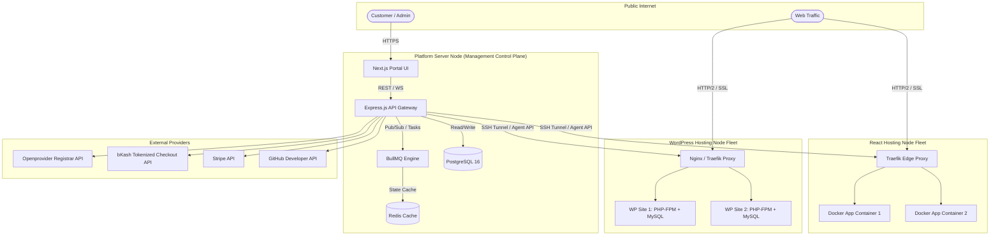

# Software Requirements Specification (SRS) — ITBengal Hosting Platform

> **Version:** 1.0  
> **Date:** July 4, 2026  
> **Status:** Draft  
> **Author:** ITBengal Architecture & Engineering Team  
> **Classification:** Internal — Confidential  

---

## Document Control & Revision History

| Version | Date | Author | Description of Changes |
| :--- | :--- | :--- | :--- |
| 0.1 | July 4, 2026 | ITBengal Architecture Team | Initial outline, glossary, and core system overview |
| 1.0 | July 4, 2026 | ITBengal Engineering | Complete Software Requirements Specification with 16 sub-modules, 8 use cases, external interfaces, and non-functional requirements |

---

## Table of Contents

1. [Introduction](#1-introduction)
   - 1.1 Purpose
   - 1.2 Scope
   - 1.3 System Overview
   - 1.4 Definitions, Acronyms, and Abbreviations
2. [Overall Description](#2-overall-description)
   - 2.1 Product Perspective
     - 2.1.1 Deployment Topology
     - 2.1.2 Micro-Architectural Context
   - 2.2 Product Functions
   - 2.3 User Classes and Characteristics
   - 2.4 Design and Implementation Constraints
   - 2.5 Assumptions and Dependencies
3. [External Interface Requirements](#3-external-interface-requirements)
   - 3.1 User Interfaces
     - 3.1.1 Dashboard Screen Flow
     - 3.1.2 WordPress Installation Flow
     - 3.1.3 Domain Purchase Flow
     - 3.1.4 Design System Standards
     - 3.1.5 Component State Indicators
   - 3.2 Hardware Interfaces
     - 3.2.1 Platform Server Specifications
     - 3.2.2 React & WordPress Node Specifications
     - 3.2.3 Virtualization & CPU Requirements
   - 3.3 Software Interfaces
     - 3.3.1 Operating System & Kernel Interfaces
     - 3.3.2 Container Runtime (Docker Socket)
     - 3.3.3 Reverse Proxy Dynamic Configuration (Traefik)
     - 3.3.4 VCS OAuth Integration Interfaces
   - 3.4 Communication Interfaces
     - 3.4.1 HTTPS/HTTP/2 Specifications
     - 3.4.2 WebSocket Log Streaming Protocol
     - 3.4.3 WordPress SFTP Configuration
     - 3.4.4 Admin SSH Tunneling API
     - 3.4.5 SMTP Configuration
4. [System Features (Deep-Dive for All 16 Modules)](#4-system-features-deep-dive-for-all-16-modules)
   - 4.1 Authentication & Authorization Module
   - 4.2 Organization & Team Management Module
   - 4.3 React / Static App Hosting Engine (app_hosting)
   - 4.4 Managed WordPress Hosting Engine (wp_hosting)
   - 4.5 Domain Registry System (Openprovider Integration)
   - 4.6 DNS Management System
   - 4.7 SSL Certificate Management System
   - 4.8 Payment & Subscription Processing System
   - 4.9 Pricing & Resource Allocation Engine
   - 4.10 Customer Dashboard Frontend System
   - 4.11 Admin Dashboard Frontend System
   - 4.12 Monitoring & Logging Infrastructure
   - 4.13 Backup & Restore Engine
   - 4.14 System Deployment Engine (BullMQ Queue Manager)
   - 4.15 Infrastructure Node Manager (Registration/Discovery/Scheduling/Failover)
   - 4.16 Security Hardening & Malware Scanner
5. [Non-Functional Requirements](#5-non-functional-requirements)
   - 5.1 Performance Benchmarks
   - 5.2 High Availability & Disaster Recovery (RTO/RPO)
   - 5.3 Security Standards
   - 5.4 Maintainability & Extensibility
   - 5.5 Regulatory & Compliance Requirements
6. [Extensive Use Case Descriptions](#6-extensive-use-case-descriptions)
   - 6.1 Use Case 1: Git Repository Auth & Project Import
   - 6.2 Use Case 2: Container Build Failure & Log Streaming
   - 6.3 Use Case 3: WordPress Automated Backup Creation & Offsite Sync
   - 6.4 Use Case 4: Domain Transfer Request & EPP Verification
   - 6.5 Use Case 5: bKash Subscription Payment Failure & Dunning
   - 6.6 Use Case 6: Admin Node Drain Execution & Live Container Migration
   - 6.7 Use Case 7: WordPress Staging Site Creation & Database Sync
   - 6.8 Use Case 8: Custom Domain Mapping & Automatic SSL Provisioning
7. [Glossary & Reference Index](#7-glossary--reference-index)

---

## 1. Introduction

### 1.1 Purpose
This Software Requirements Specification (SRS) defines the formal functional and non-functional requirements for the ITBengal Hosting Platform. It establishes a comprehensive blueprint for the development, testing, and operations teams to implement a production-grade, highly scalable hosting platform. The audience for this document includes software engineers, cloud architects, system administrators, database designers, security officers, and product managers.

The ITBengal platform represents a paradigm shift in web hosting for emerging markets, starting with Bangladesh. By merging the frictionless developer experience (DX) of modern static and SSR application deployers with the robust, turnkey automation of managed CMS engines, ITBengal addresses the historical fragmentation of developer utilities. This document outlines the technical mechanisms that enable these services to operate efficiently on self-managed VPS infrastructure, bypassing hyperscaler dependencies.

### 1.2 Scope
ITBengal is a cloud-independent, multi-node web hosting and domain management platform. The scope of the software system encompasses:

1. **Static and SSR Frontend Application Hosting:** Automatic repository scanning, containerized build engines, persistent routing, and instant deployments.
2. **Managed WordPress Hosting Engine:** Fast provisioning, localized MariaDB instance management, PHP-FPM pool segregation, security hardening, and cache orchestration.
3. **Domain Registry Operations:** Direct domain search, automated checkout, domain registration, DNS record manipulation, and WHOIS privacy adjustments.
4. **Local and International Billing Orchestration:** Mobile financial services (MFS) billing (bKash, Nagad, Rocket) alongside credit cards and PayPal.
5. **Infrastructure Node Agent & Controller Framework:** Dynamic routing, health monitoring, telemetry capture, and node scaling.

The platform specifically excludes building a hypervisor or hardware virtualization layers. Instead, it operates on top of clean Ubuntu Server instances, utilizing Linux cgroups and Docker namespaces for containment.

### 1.3 System Overview
The ITBengal system is designed around a centralized, decoupled management console and a distributed fleet of worker servers. The central control plane, referred to as the **Platform Server**, runs the customer dashboard, admin console, Express.js API gateways, task brokers, database nodes, and primary caches. It acts as the orchestrator.

The workers, divided into **React Hosting Nodes** and **WordPress Hosting Nodes**, are standard Linux servers running a lightweight, secure agent daemon (`itb-agent`). When a user triggers an action (such as deploying a Vite application or restoring a database), the Platform API serializes a command, submits it to a distributed task queue (BullMQ), and a worker consumes the job, returning logs and system states via secure WebSockets.

Traffic routing is handled at the node level by **Traefik**, a modern reverse proxy that integrates dynamically with Docker labels on React Nodes and directory changes on WordPress Nodes, allowing Let's Encrypt certificates to be provisioned on-the-fly.

### 1.4 Definitions, Acronyms, and Abbreviations

- **MFS:** Mobile Financial Services (e.g., bKash, Nagad, Rocket).
- **VCS:** Version Control System (GitHub, GitLab, BitBucket).
- **SSR:** Server-Side Rendering (e.g., Next.js, Nuxt, SvelteKit).
- **ACME:** Automated Certificate Management Environment (Let's Encrypt).
- **cgroups:** Linux Control Groups, used to limit CPU, memory, and I/O usage.
- **Dunning:** The process of methodically communicating with customers to ensure the collection of accounts receivable.
- **Node Drain:** The process of safely evacuating all running application containers from a physical or virtual node to execute maintenance.
- **EPP Code:** Extensible Provisioning Protocol key (auth info) required to transfer domains between registrars.
- **TTFB:** Time to First Byte.
- **RPO:** Recovery Point Objective (maximum allowable data loss measured in time).
- **RTO:** Recovery Time Objective (maximum allowable downtime to restore service).

---

## 2. Overall Description

### 2.1 Product Perspective

ITBengal operates in a decentralized network configuration, utilizing self-managed VPS nodes rather than hyper-scaler infrastructure. This design reduces host overhead while maintaining high resource elasticity. The core Platform Server hosts the control plane, including database instances, caching layers, job queues, and dashboard servers.

#### 2.1.1 Deployment Topology



#### 2.1.2 Micro-Architectural Context
The architecture relies on secure state synchronization. Workers run the `itb-agent` daemon, which establishes a persistent, mutually authenticated gRPC or WebSocket channel back to the Platform Server. The agent does not open incoming ports; instead, it initiates an outbound TLS connection, eliminating firewalled port exposures. When a task requires execution (e.g., compile code, generate configuration), the Platform API pushes the instruction to the command queue, which is retrieved and processed by the worker agent.

### 2.2 Product Functions
The primary functions of the ITBengal hosting ecosystem are categorized as follows:
- **Core Tenant Identity & Authorization:** Identity verification, organization scoping, fine-grained team member invitations, API key management, and multi-factor session validation.
- **Application Deployment Lifecycle:** Dynamic repository fetching, Dockerfile compilation, resource scoping, static asset serving, and instant rollbacks.
- **Managed WordPress Engine:** Micro-site generation, automated DB isolation, PHP versioning, Redis object caching, file manager client, and security hardening.
- **Domain Purchase & DNS Management:** Domain verification, registrar communication, WHOIS privacy toggles, and multi-record DNS configuration.
- **Localized Billing & Collections:** Invoice auto-generation, subscription transitions, tax management, and local/global gateway transaction routing.
- **Telemetry & Monitoring:** Metric aggregation (CPU, RAM, Disk, Net), WebSocket log streaming, and resource exhaust alerts.

### 2.3 User Classes and Characteristics
The platform serves four primary user classes:

1. **Freelance Developers:** Primarily work with individual client accounts. They require fast Git-based deployment workflows, free custom domains mapping, low-cost starter plans, and MFS payment methods. Their technical expertise is high, but their system administration background is low.
2. **Digital & Design Agencies:** Manage dozens of sites simultaneously. They require robust team management, white-label client billing, easy site cloning, staging environments for client reviews, and consolidated billing records. Their administrators have intermediate systems knowledge.
3. **Startups and SME Businesses:** Focus on product stability and security. They require role-based access control, production build reliability, resource analytics, and reliable databases. They typically have dedicated engineers with high technical skill sets.
4. **System Administrators (ITBengal Ops):** Responsible for the health and scaling of the entire node fleet. They require complete visualization of node loads, capacity planning dashboards, payment audit utilities, support ticket routing systems, and manual node-drain functions.

### 2.4 Design and Implementation Constraints
- **Self-Managed Infrastructure Limitation:** The system must run on self-managed VPS node architectures. Hard dependencies on vendor-specific cloud APIs (e.g., AWS IAM, GCP Cloud SQL, Azure App Services) are prohibited.
- **Operating System Constraints:** The primary server OS is Ubuntu 22.04 LTS / 24.04 LTS. All helper daemons, agent packages, and installer scripts must compile and execute on this environment.
- **Storage Constraints:** Shared storage (NFS) is prohibited for application containers to prevent performance bottlenecks. Local NVMe/SSD storage must be utilized, requiring the API to maintain server-to-application affinity.
- **Database Scaling:** PostgreSQL 16 is the single source of truth for the platform control plane. Application worker database management must run localized MariaDB instances per node, with automated daily offsite snapshots.
- **Reverse Proxy Engine:** Traefik must serve as the primary dynamic ingress proxy on React Nodes, dynamically updating certificates and configurations using Docker Socket labels.
- **Payment Compliance:** Integration must comply with Bangladesh Bank payment regulations and PCI-DSS compliance specifications.

### 2.5 Assumptions and Dependencies
- **Domain Registry Upstream:** Openprovider API remains operational, backward compatible, and does not alter core pricing models or EPP transfer mechanisms unexpectedly.
- **Payment Gateway Services:** bKash, Nagad, and Stripe APIs maintain high availability (>99.9%) and do not alter signature generation algorithms without a 90-day notification.
- **VCS Availability:** GitHub, GitLab, and Bitbucket APIs are available for Git authentication, webhook installation, and repository extraction.
- **ACME Protocol Stability:** Let's Encrypt HTTP-01 and DNS-01 validation endpoints continue to operate free of charge and remain compliant with the current ACME RFC specifications.

### 3.1 User Interfaces

The ITBengal user interface is divided into the Customer Dashboard and the Admin Dashboard. Both interfaces are built using Next.js, React, TypeScript, and Tailwind CSS. The design system is optimized for speed, clarity, accessibility, and modern aesthetics, drawing inspiration from industry leaders such as Vercel, Linear, and GitHub.

#### 3.1.1 Dashboard Screen Flow

The platform dashboard enforces a logical flow for key user goals. Below are the sequential screen transitions and routing paths:

```mermaid
graph TD
    Login[Login Page /auth/login] -->|Success| Dashboard[Dashboard Home /dashboard]
    Dashboard -->|Click Create Project| NewProject[Select Hosting Type /projects/new]
    
    NewProject -->|Select React| ImportGit[Git Auth / Import Repo /projects/create/react]
    ImportGit -->|Select Repo & Branch| ConfigReact[Configure Build /projects/create/react/configure]
    ConfigReact -->|Click Deploy| DeployStatus[Build Log Stream /projects/react/[id]/deployments/[id]]
    
    NewProject -->|Select WordPress| ConfigWP[WP Setup Form /projects/create/wordpress]
    ConfigWP -->|Enter Credentials & Deploy| DeployWP[Provisioning Screen /projects/wordpress/[id]/provisioning]
    
    Dashboard -->|Click Domains| DomainSearch[Search Registry /domains]
    DomainSearch -->|Select Available Domain| CheckoutDomain[Domain Checkout & WHOIS /domains/checkout]
    CheckoutDomain -->|MFS / Card Payment| DomainDetail[Domain Management DNS /domains/[name]]
```

1. **User Authentication & Entry:**
   - **Route `/auth/login`:** Accepts email and password. If 2FA is active, transitions to `/auth/2fa`.
   - **Route `/auth/register`:** Sign-up screen requiring name, email, phone number (validated via OTP for Bangladesh numbers), and organization name.
2. **React App Creation Flow:**
   - **Route `/projects/new`:** Card-based selection: "Modern Frontend / Static (React, Next.js, Vite)" or "Managed WordPress Site".
   - **Route `/projects/create/react`:** Connects to GitHub/GitLab/Bitbucket. Lists available repositories with a search/filter input.
   - **Route `/projects/create/react/configure`:** Input fields for:
     - Project Name (auto-generated from repo name).
     - Framework Preset (auto-detected, dropdown containing React, Next.js, Vue, Angular, Svelte, Astro, Vite, Custom).
     - Build Command (default pre-filled based on preset, e.g., `npm run build`).
     - Output Directory (default pre-filled, e.g., `.next` or `dist`).
     - Root Directory (default `./`).
     - Environment Variables (dynamic key-value input with encryption toggle).
3. **WordPress Site Provisioning Flow:**
   - **Route `/projects/create/wordpress`:** Input fields for:
     - Site Name (e.g., "My e-Commerce Shop").
     - Temporary Domain Subdomain (e.g., `myshop.itbhost.com`).
     - WordPress Admin Email, Admin Username, and Admin Password.
     - Database Table Prefix (pre-filled with secure random string).
     - PHP Version (dropdown: PHP 8.1, 8.2, 8.3).
     - Server Location Node (dropdown of active WordPress VPS servers).
4. **Domain Purchase Flow:**
   - **Route `/domains`:** Large search bar with auto-suggestions.
   - **Route `/domains/checkout`:** Form for Registrant WHOIS Contact Details (First Name, Last Name, Organization, Address, City, Post Code, Country, Phone Number, Email Address).

#### 3.1.2 Design System Standards
To deliver a premium interface, the ITBengal frontend conforms to the following specifications:
- **Typography:** Primary font family is **Inter** (sans-serif) imported from Google Fonts, with fallback to system-ui. Code blocks and terminal logs use **JetBrains Mono** to ensure legible character alignment.
- **Color Palette (Sleek Dark Mode Default):**
  - **Background (Primary):** HSL `224, 71%, 4%` (Deep Obsidian Blue-Black).
  - **Background (Secondary/Card):** HSL `224, 71%, 7%` (Dark Slate).
  - **Border / Divider:** HSL `220, 13%, 18%` (Muted Steel).
  - **Foreground (Primary Text):** HSL `210, 20%, 98%` (Off-white).
  - **Foreground (Muted Text):** HSL `215, 20%, 65%` (Slate Grey).
  - **Accent Primary (Action):** HSL `142, 70%, 45%` (ITBengal Emerald Green).
  - **Accent Secondary:** HSL `217, 91%, 60%` (Vibrant Blue).
  - **Danger / Alert:** HSL `346, 84%, 61%` (Crimson).
- **Responsive Layout:** Grid and flex layouts adapt across breakpoints: Mobile (`320px`), Tablet (`768px`), Desktop (`1024px`), and Widescreen (`1440px+`). Sidebars collapse into sliding hamburger menus on mobile.
- **Micro-Animations:** Hovering over dashboard cards triggers a subtle border color transition (duration: `150ms ease-in-out`). Buttons utilize active state scaling (`transform: scale(0.98)`). Loading animations are custom pulsing skeletons matching the card geometry rather than generic spinners.

#### 3.1.3 Component State Indicators

All status elements utilize uniform, color-coded indicators (dot and badge patterns):

| State Name | Color | hex Code | Dashboard Display | Behavior |
| :--- | :--- | :--- | :--- | :--- |
| **Successful / Active** | Emerald Green | `#10b981` | Pulsing Dot + Text | Site is live; ping checks return HTTP 200 OK. |
| **Building / Provisioning** | Amber / Orange | `#f59e0b` | Rotating Ring + Text | Deployment/install script is executing; logs streaming. |
| **Failed / Error** | Rose Red | `#f43f5e` | Static Dot + Warning Badge | Build crashed, or server daemon returned fatal exit code. |
| **Suspended / Unpaid** | Slate Grey | `#64748b` | Lock Icon + Grey Badge | Subscription expired; container stopped; files preserved. |
| **Maintenance Mode** | Deep Blue | `#3b82f6` | Gear Icon + Text | WP site admin enabled maintenance; static warning page shown. |

---

### 3.2 Hardware Interfaces

ITBengal runs on self-managed Virtual Private Servers (VPS) provisioned from local and regional data centers (e.g., Singapore, India, and Dhaka exchange points). The host server nodes must fulfill strict physical and virtual hardware interfaces:

#### 3.2.1 Platform Server Specifications (Control Plane Host)
- **Minimum CPU:** 4 vCPU (Dedicated AMD EPYC or Intel Xeon cores).
- **Minimum RAM:** 8 GB DDR4 ECC.
- **Storage:** 160 GB Enterprise NVMe SSD in RAID 1 configuration.
- **Network Interface Card (NIC):** 1 Gbps redundant uplink, minimum 100 Mbps guaranteed unmetered bandwidth.
- **Required Instruction Set Support:** SSE4.2, AVX2 (required for native encryption libraries and fast indexing within PostgreSQL).

#### 3.2.2 React & WordPress Node Specifications (Worker Fleet Nodes)
- **Minimum CPU:** 2 vCPU per worker node.
- **Minimum RAM:** 4 GB RAM.
- **Storage:** 80 GB NVMe SSD.
- **Network Interface Card:** 1 Gbps port, with public IPv4 address and a /64 IPv6 block.
- **Disk I/O Requirements:** Minimum random read speeds of 50,000 IOPS and random write speeds of 20,000 IOPS to handle massive log writing and database lookups.

#### 3.2.3 Virtualization & CPU Requirements
- **Hypervisor Compatibility:** KVM (Kernel-based Virtual Machine) or Xen virtualization support. LXC/OpenVZ container-based virtualization is prohibited at the host level to ensure proper kernel parameter isolation (necessary for Docker's netfilter/iptables routing).
- **cgroups v2 Enforcement:** CPU nodes must support cgroups v2 at the Linux kernel level. This interface allows the `itb-agent` to apply strict resource ceilings on customer containers:
  - Memory ceiling limit (e.g., `memory.max = 536870912` for Starter plan).
  - CPU weight quota (e.g., `cpu.weight = 100` representing standard relative cycles allocation).

---

### 3.3 Software Interfaces

ITBengal integrates directly with internal and external software systems through defined interfaces.

#### 3.3.1 Operating System & Kernel Interfaces
- **Target OS:** Ubuntu 22.04 LTS / 24.04 LTS (Linux kernel v5.15 or v6.8+).
- **Systemd Interface:** The `itb-agent` manages local system services using systemd DBus APIs. For WordPress servers, the agent executes restarts and status checks on local `php-fpm`, `nginx`, and `mariadb` services via direct DBus method calls rather than calling shell commands.
- **Telemetry Interfaces:** System resource data is extracted directly from kernel pseudofiles:
  - Memory usage via `/proc/meminfo`.
  - CPU metrics via `/proc/stat` and `/proc/loadavg`.
  - Network statistics via `/proc/net/dev`.

#### 3.3.2 Container Runtime (Docker Socket)
- **Interface Path:** `unix:///var/run/docker.sock` on React Hosting Nodes.
- **Access Protocol:** Docker Engine API v1.45.
- **Security Constraint:** The Express.js API does NOT connect to the Docker socket directly. Instead, the local `itb-agent` running on the node interacts with the socket locally over unix domain socket permissions. The socket is owned by `root:docker` and set to file permission `0660`.
- **Operations Supported:**
  - `POST /containers/create`: Create application container from built image.
  - `POST /containers/[id]/start`: Boot the static or Next.js application container.
  - `POST /containers/[id]/stop`: Kill running processes with SIGTERM, falling back to SIGKILL after 10 seconds.
  - `GET /containers/[id]/stats`: Stream real-time CPU/Memory network consumption.

#### 3.3.3 Reverse Proxy Dynamic Configuration (Traefik)
- **Provider Interface:** Traefik file-based dynamic configuration engine and Docker label engine.
- **Dynamic Config Dir:** `/etc/traefik/dynamic/`. The agent creates, edits, and deletes YAML files in this directory to register non-containerized routing (e.g., WordPress Nginx backends).
- **Docker Provider:** Traefik monitors the Docker socket on React Nodes. The agent assigns specific labels during container creation:
  - `traefik.http.routers.[app_id].rule=Host("customdomain.com")`
  - `traefik.http.routers.[app_id].entrypoints=websecure`
  - `traefik.http.routers.[app_id].tls.certresolver=letsencrypt`
  - `traefik.http.services.[app_id].loadbalancer.server.port=3000`

#### 3.3.4 VCS OAuth Integration Interfaces
- **GitHub API:** Integrates via a registered GitHub App. Uses JSON Web Tokens (JWT) signed with a private key (`.pem`) to obtain installation access tokens.
- **GitLab & Bitbucket API:** Integrates via OAuth 2.0 Authorization Code Flow.
- **Endpoints Interfaced:**
  - `GET /user/repos` or `/installations/[inst_id]/repositories`: List user's repositories.
  - `POST /repos/[owner]/[repo]/hooks`: Register webhooks targeting ITBengal API (`https://api.itbengal.net/v1/webhooks/git`) with payload events: `push`, `pull_request`.

---

### 3.4 Communication Interfaces

ITBengal implements strict protocols for network and service communication.

#### 3.4.1 HTTPS/HTTP/2 Specifications
- **Inbound Connections:** All public ingress traffic to dashboards, APIs, and customer sites must run HTTPS over TLS 1.3 (with TLS 1.2 supported for legacy clients with secure ciphers).
- **Cipher Suite Enforcement:**
  - `TLS_AES_256_GCM_SHA384`
  - `TLS_CHACHA20_POLY1305_SHA256`
  - `ECDHE-ECDSA-AES128-GCM-SHA256`
- **HTTP/2 Support:** Enforced via ALPN (Application-Layer Protocol Negotiation) to multiplex static asset downloads and decrease load latency in high-packet-loss environments (common in mobile connections in Bangladesh).

#### 3.4.2 WebSocket Log Streaming Protocol
- **Endpoint:** `wss://api.itbengal.net/v1/deployments/[id]/logs/stream`.
- **Protocol:** RFC 6455.
- **Message Format:** JSON packets:
  ```json
  {
    "timestamp": "2026-07-04T17:12:26.123Z",
    "stream": "stdout",
    "message": "npm run build: Next.js build completed successfully."
  }
  ```
- **Heartbeat Interval:** Ping/pong frames exchanged every 30 seconds to prevent connection drops by intermediate ISPs and mobile network gateways in Bangladesh.

#### 3.4.3 WordPress SFTP Configuration
- **Access Port:** `Port 2222` on WordPress Hosting Nodes (segregated from standard host SSH on port 22).
- **Auth Interface:** SFTP subsystem mapped via a custom Go-based SFTP daemon (`itb-sftpd`) reading authentication credentials from PostgreSQL via API calls.
- **Directory Chroot:** Users are strictly chrooted to their specific site directory: `/var/www/vhosts/[site_id]/public/`.

#### 3.4.4 Admin SSH Tunneling API
- **Transport Layer:** Encrypted SSH Tunneling utilizing OpenSSH with ECDSA-SHA2 keys.
- **Usage:** The Platform Server establishes temporary SSH tunnels to run administrative maintenance scripts on hosting nodes. The private keys are stored securely on the Platform Server in memory and decrypted using secrets managed by environment configurations.

#### 3.4.5 SMTP Configuration
- **Outbound Email Engine:** Integrates with SMTP relays (e.g., Mailgun or Postmark) over Port 587 with STARTTLS encryption.
- **Validation Protocols:** Enforces SPF (Sender Policy Framework), DKIM (DomainKeys Identified Mail), and DMARC (Domain-based Message Authentication, Reporting, and Conformance) to prevent transaction receipts and critical notifications from landing in spam folders.


### 4.1 Authentication & Authorization Module

#### 4.1.1 Description
This module manages user identities, security credentials, multi-tenant workspace mapping, and API key configurations. It enforces strict RBAC (Role-Based Access Control) using JSON Web Tokens (JWT) for stateless requests and maintains stateful tracking of active user sessions and two-factor credentials.

#### 4.1.2 Functional Requirements
- **FR-AUTH-1:** The system shall allow users to register using Name, Email, Password, and Phone Number, generating a verification token sent via email and SMS.
- **FR-AUTH-2:** The system shall issue secure JWT access tokens (15-minute expiration) and encrypted HTTP-only refresh cookies (7-day expiration) upon authentication.
- **FR-AUTH-3:** The system shall support Two-Factor Authentication (2FA) utilizing Time-Based One-Time Passwords (TOTP - RFC 6238).
- **FR-AUTH-4:** The system shall support organization-level RBAC with roles: Owner, Admin, Developer, Billing, and Viewer.
- **FR-AUTH-5:** The system shall allow users to create API keys with selective read/write permissions and custom expiration limits.

#### 4.1.3 Inputs, Processing, and Outputs

##### A. User Registration & Validation
- **Inputs:** JSON payload via `POST /api/v1/auth/register` containing:
  - `email`: Validated via regex `^[a-zA-Z0-9._%+-]+@[a-zA-Z0-9.-]+\.[a-zA-Z]{2,}$`.
  - `password`: String, minimum 12 characters, requiring 1 uppercase, 1 lowercase, 1 number, and 1 special symbol.
  - `phone`: Bangladeshi mobile number matching `^(?:\+88|88)?(01[3-9]\d{8})$`.
  - `fullName`: String, 2-100 characters.
- **Processing Steps:**
  1. Check if email already exists in the `users` database table. If yes, return HTTP 409 Conflict.
  2. Generate a salt value (work factor 12) and hash the password using bcrypt.
  3. Generate a cryptographically secure random 6-digit string for phone verification and a UUIDv4 token for email verification.
  4. Write the user record to the database with state `pending_verification`.
  5. Enqueue an email sending task to BullMQ for the email verification link.
  6. Enqueue an SMS sending task to BullMQ via the local telecommunication gateway provider.
- **Outputs:** HTTP 201 Created with JSON response containing user profile details (except password) and dynamic registration session ID.

##### B. Two-Factor Authentication (2FA) Verification
- **Inputs:** OTP token (6-digit string) via `POST /api/v1/auth/2fa/verify`.
- **Processing Steps:**
  1. Extract the active temporary session token from the `Authorization` header.
  2. Retrieve the user's encrypted 2FA secret from the `user_security` table, decrypting it using the system Master Key.
  3. Validate the token using the TOTP algorithm with a clock drift tolerance of $\pm 1$ step (30 seconds before and after).
  4. If validation succeeds, transition session state to `fully_authenticated` and generate full access/refresh tokens.
  5. If validation fails, increment the failed attempts counter. Lock the user account temporarily if 5 consecutive failures occur.
- **Outputs:** HTTP 200 OK with access token and refresh cookie, or HTTP 401 Unauthorized.

---

### 4.2 Organization & Team Management Module

#### 4.2.1 Description
This module supports multi-tenant segregation. It governs resource ownership, permitting projects, domains, and billing profiles to be scoped to specific Organizations. It enables collaborative workspaces with Team designations.

#### 4.2.2 Functional Requirements
- **FR-ORG-1:** The system shall automatically create a Personal Organization for every registered user during account activation.
- **FR-ORG-2:** Users with Owner/Admin privileges shall be able to create additional Shared Organizations (e.g., for agencies or startups).
- **FR-ORG-3:** The system shall permit Org owners to invite members by email, generating secure, single-use invitation tokens valid for 48 hours.
- **FR-ORG-4:** Admins shall be able to group organization members into Teams and assign specific projects to these teams.

#### 4.2.3 Inputs, Processing, and Outputs

##### A. Member Invitation Flow
- **Inputs:** `POST /api/v1/organizations/[org_id]/invitations` payload:
  - `email`: String (target invitee email).
  - `role`: Enum (`admin`, `developer`, `billing`, `viewer`).
- **Processing Steps:**
  1. Validate the active user's permissions in the organization (`role` must be `owner` or `admin`).
  2. Generate a secure invitation token (UUIDv4) and store it in the `invitations` table with a timestamp.
  3. Format an HTML email containing a clickable accept link: `https://dashboard.itbengal.net/invitations/accept?token=[uuid]`.
  4. Enqueue the email job in BullMQ.
- **Outputs:** HTTP 200 OK with invitation record details.

##### B. Accept Invitation Processing
- **Inputs:** `POST /api/v1/invitations/accept` payload:
  - `token`: UUID string.
- **Processing Steps:**
  1. Retrieve the invitation record from the database. Verify that the token exists, is unused, and the current time is within 48 hours of creation.
  2. If the user is not logged in, prompt redirection to `/auth/register` (pre-filling email).
  3. Insert a record into the `organization_members` table linking the user to the organization with the specified role.
  4. Mark the invitation token as `used`.
- **Outputs:** HTTP 200 OK with dashboard redirection target.

---

### 4.3 React / Static App Hosting Engine (app_hosting)

#### 4.3.1 Description
This is a core engine responsible for compiling, building, and serving modern Javascript applications. It integrates with Git repositories and processes uploads via ZIP files, executing builds in isolated, resource-constrained container environments.

#### 4.3.2 Functional Requirements
- **FR-RCT-1:** The system shall pull code from GitHub, GitLab, or Bitbucket when triggered by a Git push event.
- **FR-RCT-2:** The builder shall inspect the repository's root files (`package.json`, `index.html`) to auto-detect the framework preset and suggest build parameters.
- **FR-RCT-3:** The system shall spin up an ephemeral Docker container using a secure runner image (Node.js/Ubuntu base) to execute dependency installation and static compilation.
- **FR-RCT-4:** If the build compiles successfully, the system shall deploy the static assets to a production folder or launch a persistent SSR container (e.g., for Next.js servers).
- **FR-RCT-5:** The engine shall stream compile logs in real-time over WebSockets and cache them for historical audits.

#### 4.3.3 Inputs, Processing, and Outputs

##### A. Webhook Git Push Trigger
- **Inputs:** HTTP POST request from GitHub/GitLab webhooks containing Git signature header, repository details, branch name, commit hash, and author.
- **Processing Steps:**
  1. Validate webhook signature using the webhook secret stored in the database.
  2. Retrieve project mapping by matching repository SSH clone URL and active branch name.
  3. Verify organization resource limits (e.g., check if monthly build minutes or active projects have been exceeded).
  4. Create a new deployment record with status `queued` in the `deployments` table.
  5. Enqueue a build job with high/standard priority (based on plan tier) into the BullMQ `build-queue`.
- **Outputs:** HTTP 202 Accepted.

##### B. Build & Containerization Execution (Worker Action)
- **Inputs:** BullMQ job containing:
  - `project_id`, `deployment_id`, `git_clone_url`, `branch`, `build_command`, `output_directory`, `env_vars`.
- **Processing Steps:**
  1. Create a workspace directory `/var/tmp/builds/[deployment_id]` on the React node.
  2. Clone the Git repository branch using target deployment SSH key:
     `git clone --depth 50 --branch [branch] [clone_url] .`
  3. Auto-detect framework:
     - If `next.config.js` exists → Preset: `Next.js`.
     - If `vite.config.ts` or `vite.config.js` exists → Preset: `Vite`.
     - If `nuxt.config.js` exists → Preset: `Nuxt`.
  4. Generate a temporary, isolated Docker container with strict volume mappings and a CPU cap.
  5. Inside the container, run dependency installation:
     `npm ci` (or `yarn install --frozen-lockfile` / `pnpm install --frozen-lockfile`).
  6. Execute the build command:
     `npm run build`. Append stdout and stderr directly to a log file on disk and push to a Redis Pub/Sub channel for WebSocket subscribers.
  7. If build fails, kill container, update database deployment status to `failed`, and emit a failure notification.
  8. If build succeeds and is a static site, copy the contents of the output directory to the persistent web server assets path `/var/www/apps/[project_id]/public/` and register Nginx routing configuration.
  9. If build is SSR (Next.js), generate a production Dockerfile, build a persistent image, terminate the old application container, launch the new container mapping a dynamic host port, and label the container for Traefik ingress discovery.
- **Outputs:** Dynamic build logs stream, active container endpoint, and database update to status `success`.

---

### 4.4 Managed WordPress Hosting Engine (wp_hosting)

#### 4.4.1 Description
This engine automates the provisioning, operation, and optimization of WordPress websites on dedicated WordPress worker nodes. It enforces resource limits, isolates user files, and segregates databases.

#### 4.4.2 Functional Requirements
- **FR-WP-1:** The system shall automatically download, unpack, and install the latest stable WordPress core version.
- **FR-WP-2:** The engine shall construct a dedicated PHP-FPM configuration pool with custom resource parameters and limits per site.
- **FR-WP-3:** The system shall generate a secure, isolated database and user credentials on the local MariaDB server.
- **FR-WP-4:** The system shall configure server-side caching (Nginx FastCGI cache and Redis object caching) during installation.
- **FR-WP-5:** The engine shall maintain a dedicated Nginx server block mapping the site domain, custom directories, and security headers.

#### 4.4.3 Inputs, Processing, and Outputs

##### A. WordPress One-Click Installation
- **Inputs:** `POST /api/v1/projects/wordpress` payload:
  - `site_name`: String.
  - `admin_username`: String, alphanumeric.
  - `admin_password`: String, secure.
  - `admin_email`: String, email.
  - `php_version`: Enum (`8.1`, `8.2`, `8.3`).
- **Processing Steps:**
  1. Select the target WordPress worker node based on resource usage.
  2. Submit provisioning payload to the worker agent over task queue.
  3. Worker Agent actions:
     - Generate a new system user `wp_[site_id]` and home directory `/home/wp_[site_id]/`.
     - Download WordPress core using WP-CLI:
       `wp core download --path=/home/wp_[site_id]/public_html --locale=en_US`
     - Create database `db_[site_id]` and user `usr_[site_id]` with a secure, random password in MariaDB.
     - Generate `wp-config.php` injecting MariaDB connection details and unique auth salts.
     - Run the WordPress install command:
       `wp core install --url=[temp_domain] --title=[site_name] --admin_user=[admin_username] --admin_password=[admin_password] --admin_email=[admin_email]`
     - Create a custom PHP-FPM pool configuration file `/etc/php/[version]/fpm/pool.d/[site_id].conf` with settings:
       ```ini
       [wp_site_id]
       user = wp_site_id
       group = wp_site_id
       listen = /run/php/php-fpm-site_id.sock
       pm = dynamic
       pm.max_children = 10
       pm.start_servers = 2
       pm.min_spare_servers = 1
       pm.max_spare_servers = 3
       ```
     - Reload PHP-FPM service.
     - Generate Nginx virtual host configuration mapping `/home/wp_[site_id]/public_html` to `/run/php/php-fpm-site_id.sock` and reload Nginx.
  4. Write configuration state back to the central PostgreSQL database.
- **Outputs:** HTTP 201 Created with administrator credentials, database access credentials, and the active temporary domain.

---

### 4.5 Domain Registry System (Openprovider Integration)

#### 4.5.1 Description
This module provides a unified API interface to search, register, renew, and transfer top-level domains (TLDs) via the Openprovider API. It handles billing verification, manages whois privacy states, and handles background domain sync processes.

#### 4.5.2 Functional Requirements
- **FR-DOM-1:** The system shall support real-time domain availability searching across 100+ TLD extensions.
- **FR-DOM-2:** The system shall execute domain registration requests using registrant contact records.
- **FR-DOM-3:** The system shall support domain renewals and auto-renew toggle operations.
- **FR-DOM-4:** The system shall support domain transfers by validating auth/EPP codes and tracking transfer statuses.
- **FR-DOM-5:** The system shall synchronize domain status flags (e.g., `active`, `pendingTransfer`, `expired`) via background cron schedules.

#### 4.5.3 Inputs, Processing, and Outputs

##### A. Domain Availability Search
- **Inputs:** `GET /api/v1/domains/search?query=myname&tlds=com,net,org,info`.
- **Processing Steps:**
  1. Sanitize the query string to remove invalid characters.
  2. Format and send a registry availability check payload to Openprovider.
  3. Parse the XML/JSON response from Openprovider.
  4. Retrieve regional markup pricing rules from the `pricing_rules` table.
  5. Calculate retail prices in BDT and USD.
- **Outputs:** HTTP 200 OK with list of matching domains, availability status (true/false), and renewal/registration pricing schemas.

##### B. Domain Registration Execution
- **Inputs:** `POST /api/v1/domains/register` containing:
  - `domain_name`: String.
  - `registrant_contact_id`: Integer reference.
  - `billing_cycle`: Integer (years, 1-10).
- **Processing Steps:**
  1. Retrieve WHOIS registry contact data from the `contact_profiles` table.
  2. Verify that the user has successfully completed checkout for the domain purchase (invoice status must be `paid`).
  3. Format the XML-RPC request payload mapping target data fields:
     - `ownerHandle`: Openprovider contact identifier.
     - `domain`: Name and extension.
     - `period`: Number of years.
     - `ns`: Default ITBengal nameservers (`ns1.itbhost.com`, `ns2.itbhost.com`).
  4. Dispatch registry payload to Openprovider.
  5. Catch any registry exceptions (e.g., premium domain restrictions, invalid contact parameters). On failure, queue for admin manual review and pause billing.
  6. On success, store the registration details, expiry timestamp, and domain handle.
- **Outputs:** HTTP 200 OK with domain status marked as `pending_active`.

---

### 4.6 DNS Management System

#### 4.6.1 Description
This module allows customers to manage DNS zone records for domains hosted on ITBengal nameservers. It implements input syntax validation and deploys updates to the authoritative nameserver fleet.

#### 4.6.2 Functional Requirements
- **FR-DNS-1:** The system shall support CRUD operations on A, AAAA, CNAME, MX, TXT, SRV, CAA, and NS records.
- **FR-DNS-2:** The system shall validate DNS record inputs, preventing configuration syntax errors (e.g., validating IP addresses for A records, prioritizing MX values).
- **FR-DNS-3:** The system shall sync DNS updates within 5 minutes to all primary and secondary authoritative nameservers.
- **FR-DNS-4:** The system shall allow users to import and export standard BIND zone files.

#### 4.6.3 Inputs, Processing, and Outputs

##### A. DNS Record Insertion
- **Inputs:** `POST /api/v1/dns/records` payload:
  - `domain_id`: Integer reference.
  - `type`: Enum (`A`, `AAAA`, `CNAME`, `MX`, `TXT`, `SRV`, `CAA`).
  - `name`: Subdomain prefix or `@` for root.
  - `value`: Target value string.
  - `ttl`: Integer (seconds, min 60).
  - `priority`: Integer (optional, MX/SRV only).
- **Processing Steps:**
  1. Retrieve domain details and verify user organization rights.
  2. Run validation scripts based on type:
     - `A`: Validate IPv4 matching `^(?:[0-9]{1,3}\.){3}[0-9]{1,3}$`.
     - `AAAA`: Validate IPv6 format.
     - `CNAME`: Validate fully qualified domain name structure.
     - `MX`: Validate destination name format and enforce priority input between 0 and 65535.
  3. Save the record in the `dns_records` table.
  4. Update the DNS zone serial number: `YYYYMMDDNN` (where NN is incremented daily).
  5. Push the zone update task to BullMQ to rewrite BIND zone files or execute API calls to the dynamic DNS cluster.
- **Outputs:** HTTP 201 Created with the saved record and serial verification info.

---

### 4.7 SSL Certificate Management System

#### 4.7.1 Description
This module manages SSL/TLS certificates for customer applications and WordPress sites, utilizing the ACME protocol via Let's Encrypt. It manages HTTP-01 and DNS-01 verification mechanisms and monitors certificate expirations to handle renewals automatically.

#### 4.7.2 Functional Requirements
- **FR-SSL-1:** The system shall automatically request Let's Encrypt SSL certificates for all newly configured custom domains.
- **FR-SSL-2:** The system shall support ACME HTTP-01 challenge processing by serving challenge tokens from dynamic web directories.
- **FR-SSL-3:** The system shall support wildcard certificate generation using ACME DNS-01 verification via the DNS API.
- **FR-SSL-4:** A background job shall monitor certificates daily and execute renewals for any certificate expiring in less than 30 days.

#### 4.7.3 Inputs, Processing, and Outputs

##### A. Automated SSL Provisioning Trigger
- **Inputs:** Custom Domain registration event containing domain string, project ID, and hosting node reference.
- **Processing Steps:**
  1. Verify that the custom domain points to the hosting node's public IP address using an external DNS lookup query. If the DNS record does not match, queue verification retries every 30 minutes (up to 24 hours) and alert the user dashboard.
  2. If DNS points to the hosting node, trigger the ACME client:
     - Register account keys with Let's Encrypt.
     - Request a certificate signing request (CSR) for the domain.
     - Receive HTTP-01 validation challenge path and token value.
  3. Write the challenge token to `/var/www/challenges/[challenge_path]` so it is publicly accessible at `http://[custom_domain]/.well-known/acme-challenge/[challenge_path]`.
  4. Submit validation status back to Let's Encrypt.
  5. Upon verification, download the signed certificate chain and private key.
  6. Install keys:
     - For React Apps: Write keys to Traefik SSL storage path and trigger configuration hot reload.
     - For WordPress: Write keys to `/etc/nginx/ssl/[domain].crt` and private key to `/etc/nginx/ssl/[domain].key`, then reload Nginx.
- **Outputs:** Active SSL certificate file mappings and database certificate status updated to `active`.

---

### 4.8 Payment & Subscription Processing System

#### 4.8.1 Description
This module processes local payments (bKash, Nagad, Rocket) and international gateways (Stripe, PayPal). It handles subscription lifecycle transitions, generates PDF invoices, calculates local taxes (VAT), and processes refunds.

#### 4.8.2 Functional Requirements
- **FR-BIL-1:** The system shall integrate bKash Tokenized Checkout to support initial and automatic recurring billing.
- **FR-BIL-2:** The system shall support credit card checkout interfaces using Stripe elements and webhooks.
- **FR-BIL-3:** The system shall calculate a 15% VAT rate for all invoice items generated for accounts registered in Bangladesh.
- **FR-BIL-4:** The billing engine shall generate a downloadable PDF invoice for every payment transaction.
- **FR-BIL-5:** The system shall support promotional coupon discounts, recalculating pricing on checkout configurations.
- **FR-BIL-6:** The engine shall execute dunning retry routines when recurring subscription payments fail.

#### 4.8.3 Inputs, Processing, and Outputs

##### A. bKash Payment Initiation
- **Inputs:** `POST /api/v1/billing/payments/initiate` payload:
  - `invoice_id`: Integer reference.
  - `payment_method`: String (`bkash`).
- **Processing Steps:**
  1. Retrieve invoice details. Verify amount and currency.
  2. Call the bKash API gateway to obtain an authorization token using API credentials (App Key, App Secret, Username, Password).
  3. Send a Create Payment request to bKash:
     - `amount`: Invoice amount.
     - `currency`: `BDT`.
     - `intent`: `sale` (or `authorization` for recurring setup).
     - `callbackURL`: `https://api.itbengal.net/v1/billing/payments/bkash/callback`.
  4. Capture payment details from bKash, including `paymentID` and the customer redirect gateway URL.
  5. Log the transition state in the `payment_transactions` database table with status `initiated`.
- **Outputs:** HTTP 200 OK with redirect URL target.

##### B. bKash Payment Callback Execution
- **Inputs:** Query parameters from bKash callback containing `paymentID` and `status`.
- **Processing Steps:**
  1. If status is `success`, verify transaction details:
     - Execute the payment verification request to bKash: `POST /tokenized/checkout/execute` passing the `paymentID`.
     - Read the API response body. Verify that `transactionStatus` is `Completed`.
  2. Retrieve the invoice matching the verified transaction.
  3. Calculate local 15% VAT on base subtotal and update invoice totals.
  4. Update the invoice status to `paid` and record the transaction ID (`trxID`).
  5. Active the user subscription by updating the `subscriptions` table:
     - `status`: `active`.
     - `current_period_start`: Current timestamp.
     - `current_period_end`: Current timestamp + billing cycle length (e.g., 30 days).
  6. Enqueue a BullMQ task to generate the PDF invoice and email it to the user.
  7. Enqueue a provisioning task to enable or resume hosting services.
- **Outputs:** Redirect response directing the customer back to the dashboard billing success screen `/billing/success?invoice=[id]`.

---

### 4.9 Pricing & Resource Allocation Engine

#### 4.9.1 Description
This engine enforces resource limits (vCPU, memory, storage, bandwidth, and build minutes) across all customer environments based on their active subscription plan. It manages dynamic resource limit calculation and applies physical boundaries to containers and processes.

#### 4.9.2 Functional Requirements
- **FR-RSC-1:** The system shall restrict container memory and CPU quotas dynamically according to the customer's plan definitions during container creation.
- **FR-RSC-2:** The system shall monitor network bandwidth consumption hourly and suspend projects that exceed their plan limits.
- **FR-RSC-3:** The system shall track build minutes consumption per calendar month, rejecting new builds when limits are reached.
- **FR-RSC-4:** The system shall audit disk storage usage per WordPress site daily, raising dashboard warning flags when limits are exceeded.

#### 4.9.3 Inputs, Processing, and Outputs
- **Inputs:** Plan code (e.g., `react_starter`, `wp_professional`) and target project identifier.
- **Processing Steps:**
  1. Retrieve active plan specifications from the database:
     - `Starter`: 0.5 vCPU, 512 MB RAM, 1 GB storage, 10 GB bandwidth, 100 build minutes.
     - `Professional`: 2.0 vCPU, 2 GB RAM, 20 GB storage, 200 GB bandwidth, 1000 build minutes.
  2. Map these specs to runner configurations:
     - Convert RAM limit to bytes: `512 MB = 536870912 bytes`.
     - Convert CPU limit to shares: `0.5 vCPU = 50000 cpu.cfs_quota_us` (with a base period of `100000`).
  3. Emit these configurations to the deployment agent.
- **Outputs:** Strict limits applied to the Docker daemon or PHP-FPM configuration pool.

---

### 4.10 Customer Dashboard Frontend System

#### 4.10.1 Description
The Next.js customer portal allows developers and teams to manage projects, verify domains, review billing histories, and configure deployment settings. It integrates WebSockets for real-time telemetry and build logging.

#### 4.10.2 Functional Requirements
- **FR-DASH-1:** The frontend shall dynamically toggle dark and light modes, saving preference to localStorage.
- **FR-DASH-2:** The dashboard shall render a real-time terminal log viewer that auto-scrolls during build execution.
- **FR-DASH-3:** The UI shall incorporate a command bar (⌘K shortcut) to navigate pages and search projects.
- **FR-DASH-4:** The dashboard shall render charts depicting bandwidth, CPU, and RAM consumption.

#### 4.10.3 Inputs, Processing, and Outputs
- **Inputs:** User clicks, navigation events, API responses, and WebSocket streams.
- **Processing Steps:**
  1. Initialize connection to WebSocket endpoints.
  2. Parse incoming log objects, matching ANSI color codes to styled HTML classes.
  3. Render UI components complying with accessibility rules (ARIA labels, keyboard traps in modals).
- **Outputs:** Responsive UI rendering, interactive state tables, and real-time logs display.

---

### 4.11 Admin Dashboard Frontend System

#### 4.11.1 Description
This portal provides the operations team with visibility into infrastructure health, billing transactions, customer management, support tickets, and system settings.

#### 4.11.2 Functional Requirements
- **FR-ADM-1:** The interface shall display real-time CPU, RAM, and Disk metrics across all hosting nodes.
- **FR-ADM-2:** Admins shall be able to drain nodes, migrating active customer deployments to other nodes.
- **FR-ADM-3:** Admins shall be able to create, disable, and modify promo codes and pricing matrices.
- **FR-ADM-4:** The portal shall route support ticket conversations and allow admins to respond directly.

#### 4.11.3 Inputs, Processing, and Outputs
- **Inputs:** Metric events, user account identifiers, support ticket text inputs, and node status payloads.
- **Processing Steps:**
  1. Render system metric charts by polling API metrics endpoints every 5 seconds.
  2. Manage ticket statuses: change from `open` to `in_progress` or `resolved` when replies are submitted.
  3. Handle node state modifications: dispatch node drain requests to the platform controller upon confirmation.
- **Outputs:** Admin dashboard visualization, system state alterations, and ticket response delivery.

---

### 4.12 Monitoring & Logging Infrastructure

#### 4.12.1 Description
This infrastructure collects and aggregates telemetry data (logs and performance metrics) from all servers. It routes logs through Loki and metrics through Prometheus to render dashboards and trigger alerts.

#### 4.12.2 Functional Requirements
- **FR-MON-1:** The system shall collect host metrics (CPU, RAM, Disk, Network) from all nodes at 15-second intervals.
- **FR-MON-2:** The system shall aggregate application logs using Promtail/Loki forwarding, separating logs by organization ID.
- **FR-MON-3:** The system shall expose a WebSocket API allowing customers to query runtime logs.
- **FR-MON-4:** The monitoring engine shall trigger slack and email alerts if node resource consumption exceeds 90% for 5 consecutive minutes.

#### 4.12.3 Inputs, Processing, and Outputs
- **Inputs:** Node sysfs files, Docker container streams, and Nginx/PHP-FPM log channels.
- **Processing Steps:**
  1. The node daemon collects host metrics and exposes them at `/metrics` for Prometheus scraping.
  2. Promtail watches `/var/log/nginx/` and `/var/lib/docker/containers/` log files, pushing additions to the Loki central aggregator.
  3. When an alert threshold is breached, the alerting manager formats a Slack notification payload and posts it to the configured webhook URL.
- **Outputs:** Unified metric dashboards in Grafana, real-time log streams, and system alerts.

---

### 4.13 Backup & Restore Engine

#### 4.13.1 Description
This engine manages site backups (files and database dumps) for WordPress and application configurations. It schedules daily operations, encrypts files, uploads archives to offsite storage, and handles restoration requests.

#### 4.13.2 Functional Requirements
- **FR-BAK-1:** The backup engine shall automatically run daily full backups (files and database) for all active WordPress sites.
- **FR-BAK-2:** Backups shall be compressed using gzip and encrypted via AES-256 before leaving the server.
- **FR-BAK-3:** The system shall copy backups to an offsite S3-compatible object storage server.
- **FR-BAK-4:** The system shall allow users to execute manual on-demand backups.
- **FR-BAK-5:** The engine shall provide one-click restoration, restoring the database state and directory structure.

#### 4.13.3 Inputs, Processing, and Outputs
- **Inputs:** Backup request, database credentials, target destination parameters, and retention requirements.
- **Processing Steps:**
  1. Initiate backup task in worker agent.
  2. Export database using `mysqldump` or PG dump.
  3. Compress public html directories and database dumps into a single `.tar.gz` archive.
  4. Encrypt the file using the project's unique backup key.
  5. Stream the encrypted file to the S3 bucket using S3 multipart upload APIs.
  6. Delete historical backups that exceed the plan's retention period (e.g., 7 days for Basic plan).
- **Outputs:** Encrypted archive in S3 storage and updated database audit record with status `completed`.

---

### 4.14 System Deployment Engine (BullMQ Queue Manager)

#### 4.14.1 Description
This engine manages task distribution across the platform. Built on Redis and BullMQ, it coordinates long-running asynchronous tasks (such as container compilation, WordPress provisioning, and domain registration) using queues.

#### 4.14.2 Functional Requirements
- **FR-Q-1:** The system shall maintain distinct job queues: `build-queue`, `provision-queue`, `backup-queue`, and `dns-queue`.
- **FR-Q-2:** The queue manager shall support priority-based job ordering, placing Enterprise and Professional tasks in priority lanes.
- **FR-Q-3:** The engine shall execute retry logic (up to 3 times) with exponential backoff if a worker task fails.
- **FR-Q-4:** The manager shall support progress reporting, updating job execution percentages in Redis.

#### 4.14.3 Inputs, Processing, and Outputs
- **Inputs:** Task payloads, target worker routes, priority levels, and retry policies.
- **Processing Steps:**
  1. Serialise payload and enqueue task using BullMQ:
     `await queue.add('job-name', data, { priority: 1, attempts: 3, backoff: { type: 'exponential', delay: 1000 } });`
  2. Workers fetch jobs from the Redis-backed queue.
  3. Track execution state: write progress updates (`job.updateProgress(50)`) back to Redis.
  4. If a job fails, check the remaining retry attempts. If attempts are left, re-queue the job with the calculated backoff delay. If all attempts are exhausted, move the job to the failed queue and trigger an alert.
- **Outputs:** Event notifications, task execution state updates, and job progress telemetry.

---

### 4.15 Infrastructure Node Manager

#### 4.15.1 Description
This module handles node operations: registering new worker nodes, tracking capacity, running health checks, scheduling deployments, and orchestrating node drain tasks.

#### 4.15.2 Functional Requirements
- **FR-NOD-1:** The system shall register new hosting servers securely using single-use cluster enrollment tokens.
- **FR-NOD-2:** Worker agents shall submit heartbeat packets containing memory and CPU resource utilization metrics to the Platform Server every 10 seconds.
- **FR-NOD-3:** The scheduling algorithm shall assign new deployments to the node with the lowest resource load.
- **FR-NOD-4:** If a node goes offline (missing 3 consecutive heartbeats), the system shall trigger an automatic failover sequence.
- **FR-NOD-5:** The node manager shall support manual server draining, migrating all active application containers to other nodes.

#### 4.15.3 Inputs, Processing, and Outputs
- **Inputs:** Heartbeat network packages, server registration tokens, and node drain requests.
- **Processing Steps:**
  1. Calculate node score based on memory and CPU:
     $\text{Score} = (W_{cpu} \times \text{CPU}_{\text{free}}) + (W_{mem} \times \text{Mem}_{\text{free}})$
  2. Schedule deployments onto the node with the highest score.
  3. Monitor heartbeats: if a node fails check-ins, transition node state in the DB to `offline` and trigger alerting webhooks.
  4. During node drain, retrieve all active containers assigned to the node, stop them, copy their configuration definitions, recreate them on destination nodes, update routing rules on Traefik, and start the new containers.
- **Outputs:** Node capacity matrix updates, routing tables adjustments, and container relocations.

---

### 4.16 Security Hardening & Malware Scanner

#### 4.16.1 Description
This module secures the hosting environment, protecting WordPress sites and application runtimes. It manages firewall configurations, brute-force protection, WordPress hardening, and daily file scans.

#### 4.16.2 Functional Requirements
- **FR-SEC-1:** The system shall block IP addresses executing brute-force attacks on login endpoints using fail2ban.
- **FR-SEC-2:** The WordPress manager shall disable file editing within the WordPress admin dashboard and block external access to XML-RPC.
- **FR-SEC-3:** The security engine shall execute daily malware scanning across all WordPress files using ClamAV.
- **FR-SEC-4:** The system shall enforce security response headers (`Content-Security-Policy`, `X-Frame-Options`) on Nginx and Traefik routers.

#### 4.16.3 Inputs, Processing, and Outputs
- **Inputs:** Log entry changes, directory file trees, and security policy rules.
- **Processing Steps:**
  1. Monitor authentication logs: if an IP triggers multiple login failures within a 60-second window, write a blocking rule to iptables.
  2. Run daily scans: execute ClamAV scanning commands targeting site directories `/home/wp_*/public_html/`.
  3. Quarantine any files matching known signature definitions, reporting the infection details to the dashboard.
- **Outputs:** Firewall rules updates, security scanning logs, and isolated malware files.

---

## 5. Non-Functional Requirements

### 5.1 Performance Benchmarks

The ITBengal hosting infrastructure enforces performance SLA ceilings across API operations and client hosting layers:

| Performance Metric | Threshold Ceiling | Scope | Verification Method |
| :--- | :--- | :--- | :--- |
| **API Response Time** | $\le 200\text{ ms}$ (95th percentile) | Stateless REST endpoints | Load testing via k6 (1000 concurrent req/sec) |
| **Database Query Exec** | $\le 50\text{ ms}$ | Standard transaction queries | PostgreSQL slow-query log auditing |
| **TTFB (In Bangladesh)** | $\le 50\text{ ms}$ | Static react assets served locally | curl profiling from local Dhaka ISPs |
| **TTFB (International)** | $\le 150\text{ ms}$ | Static assets served via CDN edge | Pingdom external benchmark locations |
| **Build Execution Timeout** | $\le 10\text{ minutes}$ | Application compile runtimes | BullMQ container watchdog timer |
| **Redis Cache Latency**| $\le 2\text{ ms}$ | Shared cache operations | Redis benchmark profiling utilities |
| **WordPress Core Load** | $\le 500\text{ ms}$ (uncached) | Default WP core home index | WP-CLI profile execution bench |

- **Caching Enforcement:** For WordPress hosting, dynamic requests must leverage Redis Object Cache and FastCGI page caching, maintaining a target cache hit ratio of $\ge 90\%$ for anonymous visitor sessions.
- **Payload Compression:** All text-based assets (HTML, CSS, JS, SVG) served by Traefik and Nginx must be compressed using Brotli (levels 4–6 for dynamic assets) or GZIP (level 6 fallback) to optimize network bandwidth on cellular gateways.

---

### 5.2 High Availability & Disaster Recovery (RTO/RPO)

To maintain platform availability, the ITBengal system architecture implements a failover topology:

- **Recovery Objectives:**
  - **Recovery Time Objective (RTO):** $\le 1\text{ hour}$. The system must restore normal platform services and client sites within 60 minutes of a major node outage.
  - **Recovery Point Objective (RPO):** $\le 1\text{ hour}$ for central databases (PostgreSQL) and $\le 24\text{ hours}$ for worker file assets. Backups and transactions must guarantee no more than 1 hour of platform history loss.
- **Failover Mechanisms:**
  - **Platform database redundancy:** The main PostgreSQL database runs in a primary-replica configuration. If the primary node goes offline, the platform controller triggers a replica promotion within 3 minutes, changing connection strings dynamically via Redis sentinel or platform configuration.
  - **Stateless worker container failover:** If a React Node goes offline, the Infrastructure Node Manager detects the loss of heartbeats, marks the node as offline, identifies the containers previously hosted there, and schedules new instances on other active worker nodes. Traefik auto-discovers the changes and updates routing tables within 60 seconds.
- **System Backup Strategy:**
  - Full backups must be synchronized to S3-compatible storage across geographically segregated VPS providers.
  - Backup integrity verifications must execute daily on a random $5\%$ sample of backups by spinning up clean, ephemeral staging sites and verifying their checksums.

---

### 5.3 Security Standards

The platform enforces strict security parameters:

1. **Cryptography & In-Transit Protection:**
   - All network connections require TLS 1.3. Any legacy client fallback to TLS 1.0 or 1.1 must be rejected.
   - SSL certificates are generated using Let's Encrypt with 2048-bit RSA or 256-bit ECDSA keys.
   - Passwords must be hashed using bcrypt with a work factor of 12. Database encryption for API keys and environment variables must utilize AES-256-GCM, with rotation of the Master Key every 180 days.
2. **Container Isolation & Host Security:**
   - Every user application container must run as a non-privileged user (non-root configuration mapping UID/GID `10001:10001`).
   - Containers are isolated using Docker namespaces (IPC, network, mount, PID, user, UTS) and limited by cgroups v2.
   - Host firewalls (ufw/iptables) must block all traffic except ports 80, 443, and 2222 (for SFTP) on worker nodes, and port 22 on the platform management server (restricted to admin IPs).
   - Insecure commands and dangerous PHP functions (`exec`, `passthru`, `shell_exec`, `system`, `proc_open`, `popen`) must be disabled in global PHP configurations.
3. **Audit Trails & Logs Retention:**
   - Write-once audit logs must record every administrative action, payment transaction, and privilege change.
   - Logs must be preserved for a minimum of 90 days.

---

### 5.4 Maintainability & Extensibility

The software engineering lifecycle enforces strict maintainability metrics:

- **API Versioning:** The Express.js API must version endpoints explicitly via path prefixes (e.g., `/api/v1/`). Deprecated APIs must return warnings in HTTP headers (`Warning: 199 - "API deprecated"`) and must be supported for at least 6 months after deprecation.
- **Code Coverage & QA Standards:** All core billing, authentication, and deployment logic must maintain a minimum of $85\%$ unit and integration test coverage.
- **Modularity:** The codebase must maintain separation between the API layer, worker task consumers, and database models. The `itb-agent` daemon must run as a single compiled binary or self-contained package with minimal external dependencies.
- **Infrastructure as Code (IaC):** Server configurations must be managed via Ansible playbooks to ensure that any new VPS node can be registered and configured identically within 10 minutes.

---

### 5.5 Regulatory & Compliance Requirements

ITBengal complies with Bangladeshi and international payment regulations:

- **PCI-DSS Compliance:** The system must not store cardholder details (PAN, CVV, expiry dates) on ITBengal infrastructure. Credit card checkouts must use Stripe's secure frame integration, tokenizing data directly on Stripe's server.
- **Bangladesh Digital Security Act & Data Sovereignty:** User personal profiles, billing histories, and system logs for Bangladeshi organizations must reside on servers physically located within Bangladesh or in low-latency regional nodes under strict local data sovereignty policies.
- **Taxation & VAT Enforcement:** The billing engine must apply the standard 15% VAT rate for all services billed to clients located in Bangladesh, generating invoices containing the company's official Business Identification Number (BIN).
- **MFS Payment Compliance:** Integrations with bKash and Nagad must implement secure checkout tokens, transaction signature validations, and double-entry ledgers to prevent payment double-spend or transaction verification bypasses.


---

### 6.1 Use Case 1: Git Repository Auth & Project Import

- **Use Case ID:** UC-01
- **Actors:** Developer (User)
- **Preconditions:**
  - The Developer is logged into their ITBengal account.
  - The Developer is assigned to an active Organization with remaining project quotas.
- **Main Success Scenario (Flow):**
  1. Developer clicks "New Project" and selects "Import from Git Repository".
  2. The frontend redirects the user to the VCS auth screen (GitHub App installation or GitLab OAuth).
  3. The Developer authorizes ITBengal to access their profile and repositories.
  4. The platform API receives the OAuth access token, encrypts it, and saves it in the database `user_integrations` table.
  5. The Developer is redirected back to `/projects/create/react`, which lists their repositories.
  6. The Developer selects a repository (e.g., `my-nextjs-app`) and chooses a target branch (e.g., `main`).
  7. The system runs framework detection on the repo root structure, proposing default build settings.
  8. The Developer reviews the presets, configures environment variables, and clicks "Deploy".
  9. The platform API generates a new deployment record (status: `queued`), generates an SSH keypair for repository cloning, registers the public key as a deploy key on the VCS provider, and sets up a webhook event trigger.
  10. The build task is added to BullMQ.
- **Alternative Flows:**
  - **AF-1.1: Alternative VCS Provider:** The developer selects GitLab or Bitbucket. The authentication steps switch to the respective OAuth 2.0 grant flow, but the project setup interface remains unchanged.
- **Exception Flows:**
  - **EF-1.1: OAuth Token Expired/Revoked:** During step 5, if the VCS API returns an authentication error, the dashboard invalidates the integration token and redirects the Developer to re-authenticate.
  - **EF-1.2: Organization Resource Exceeded:** During step 8, if the organization's active project count has reached its limit, the API blocks the request and prompts the user to upgrade their plan.
- **Postconditions:** The project is created in the database, the SSH deploy keys are configured, the webhooks are active, and the initial build task is queued.

---

### 6.2 Use Case 2: Container Build Failure & Log Streaming

- **Use Case ID:** UC-02
- **Actors:** Developer, Build Agent
- **Preconditions:**
  - A project deployment job has been picked up by a React Hosting Node worker.
  - The Developer is viewing the deployment logs page `/projects/react/[id]/deployments/[id]` with a live WebSocket connection.
- **Main Success Scenario (Flow):**
  1. The worker agent clones the repository and launches an ephemeral runner container.
  2. The agent initiates WebSocket log streaming, sending stdout/stderr messages to Redis.
  3. The platform API receives the Redis pub/sub messages and pushes them to the client's WebSocket connection in real-time.
  4. The runner container executes `npm install` and begins the compilation command.
  5. The compiler encounters a syntax or type error, and the build script terminates with an exit code of `1`.
  6. The worker agent intercepts the exit code, captures the remaining build errors, and writes them to the persistent log file on disk.
  7. The agent updates the database deployment status to `failed` and terminates the runner container.
  8. The frontend console displays the build logs up to the failure point, renders a "Build Failed" badge in crimson red, and prompts options to "Re-deploy" or edit settings.
  9. The system enqueues email and slack notifications detailing the build failure.
- **Alternative Flows:**
  - **AF-2.1: Manual ZIP Upload:** The build is triggered by a manual ZIP upload instead of a Git push. The agent unzips the file locally before running the container build, but the compilation error and log streaming steps remain identical.
- **Exception Flows:**
  - **EF-2.1: WebSocket Disconnection:** If the client's network drops during the build, log streaming pauses. The build process continues on the worker node. When the client reconnects, the dashboard fetches the historical logs from the API and displays the final build state.
- **Postconditions:** The runner container is cleaned up, resources are released, the deployment status is set to `failed`, and notification events are dispatched.

---

### 6.3 Use Case 3: WordPress Automated Backup Creation & Offsite Sync

- **Use Case ID:** UC-03
- **Actors:** System Scheduler (Cron), Backup Agent
- **Preconditions:**
  - The WordPress site is active, and daily backups are enabled in the project plan.
  - Offsite S3 storage credentials are configured.
- **Main Success Scenario (Flow):**
  1. The platform database cron runner triggers a daily backup task at 03:00 AM (Dhaka time) and adds it to the `backup-queue` in BullMQ.
  2. A WordPress worker agent picks up the task.
  3. The agent puts Nginx and MariaDB into a read-only lock state to ensure file and table consistency.
  4. The agent dumps the MariaDB database to a SQL file using `mysqldump`.
  5. The agent compresses the database SQL file and the entire `public_html` directory into a single `.tar.gz` archive.
  6. The agent releases database locks, restoring write privileges to Nginx/MariaDB.
  7. The archive is encrypted using AES-256-GCM.
  8. The agent streams the encrypted archive to the offsite S3-compatible storage cluster.
  9. The S3 endpoint returns an MD5 hash of the upload. The agent verifies the checksum against the local archive file.
  10. The agent deletes the local temporary backup file, updates the database backup log to `completed`, and records the file path, file size, and SHA256 checksum.
- **Alternative Flows:**
  - **AF-3.1: Manual On-Demand Backup:** The customer triggers a backup manually from their dashboard settings. The process bypasses cron scheduling, executing immediately, and updates the dashboard progress bar in real-time.
- **Exception Flows:**
  - **EF-3.1: Storage Capacity Exceeded:** If the worker node's local disk runs out of space during compression, the agent halts the backup, logs a "Local disk full" exception, and sends a critical alert to the operations team.
  - **EF-3.2: S3 Upload Failure:** If the S3 storage endpoint is unreachable, the agent retries the upload 3 times with exponential backoff. If all retries fail, it updates the backup log to `failed` and alerts the user.
- **Postconditions:** An encrypted backup archive is stored in S3, database locks are released, and historical logs are updated.

---

### 6.4 Use Case 4: Domain Transfer Request & EPP Verification

- **Use Case ID:** UC-04
- **Actors:** Customer, Openprovider Registrar
- **Preconditions:**
  - The customer is logged in.
  - The customer has paid the domain transfer invoice (status: `paid`).
- **Main Success Scenario (Flow):**
  1. Customer navigates to "Domain Transfer", enters the target domain, and provides the EPP / Authorization code.
  2. The system checks that the domain name is valid and currently eligible for transfer (e.g., registered for at least 60 days, not locked at the registry).
  3. The API formats and sends a transfer request to the Openprovider registrar endpoint.
  4. Openprovider verifies the EPP code and submits the request to the central registry (e.g., Verisign for `.com`).
  5. The registry initiates the transfer process and contacts the current registrar.
  6. The platform updates the domain record status to `pendingTransfer` and schedules a status check job to run every 6 hours.
  7. Once the transfer is approved by the registry and the current registrar, the domain status changes to `active` in Openprovider.
  8. The background cron job detects the status change, updates the domain state to `active` in the local database, sends an email notification to the customer, and sets the nameservers to ITBengal default dns.
- **Alternative Flows:**
  - **AF-4.1: Transfer of .bd Domains:** The customer requests a transfer for a `.com.bd` or `.bd` domain. Because `.bd` domains are managed by BTCL, the system prompts the user to download and sign BTCL transfer authorization forms, routing the request to an administrator for manual processing instead of Openprovider.
- **Exception Flows:**
  - **EF-4.1: Invalid EPP Code:** If Openprovider returns an error stating the authorization code is invalid, the platform sets the domain status to `rejected`, emails the customer to verify the code, and prompts them to resubmit.
  - **EF-4.2: Domain Locked at Current Registrar:** If the domain is locked, the transfer fails. The system notifies the customer to log into their previous registrar, unlock the domain, and retry the transfer.
- **Postconditions:** The domain name is transferred, nameservers are updated, and the customer is notified.

---

### 6.5 Use Case 5: bKash Subscription Payment Failure & Dunning

- **Use Case ID:** UC-05
- **Actors:** Subscription Engine, bKash MFS Gateway, Customer
- **Preconditions:**
  - The customer has an active subscription linked to a bKash Tokenized checkout profile.
  - The current date matches the billing renewal date.
- **Main Success Scenario (Flow):**
  1. The billing engine runs a cron job to process daily renewals and generates a renewal invoice.
  2. The engine calls the bKash checkout endpoint `/tokenized/checkout/charge` using the saved bKash Agreement ID.
  3. The gateway returns a `declined` status with an error code indicating "insufficient balance".
  4. The billing engine flags the invoice as `unpaid` and changes the subscription status to `past_due`.
  5. The engine schedules three retry attempts: Day +3, Day +5, and Day +7.
  6. The system sends an email and SMS to the customer: "Payment failed — please check your bKash wallet balance before our next attempt."
  7. On Day 7, if the final payment attempt fails, the platform suspends the customer's hosting services: Nginx routing is disabled (showing a payment suspended page), and containers are stopped.
  8. If the invoice remains unpaid after 30 days of suspension, the system changes the subscription status to `cancelled` and marks the files for deletion.
- **Alternative Flows:**
  - **AF-5.1: Manual Wallet Update:** The customer logs in during the suspension period, updates their payment method, and pays the outstanding invoice. The billing engine immediately changes the status to `paid`, reactivates the subscription, and provisions the containers.
- **Exception Flows:**
  - **EF-5.1: bKash API Timeout/503 Service:** If the bKash API fails to respond due to a network outage, the system does not count it as a payment failure. The billing engine pauses the dunning sequence, logs a gateway error, and retries the payment request 6 hours later.
- **Postconditions:** The subscription state is modified, notifications are sent, and services are either suspended or restored.

---

### 6.6 Use Case 6: Admin Node Drain Execution & Live Container Migration

- **Use Case ID:** UC-06
- **Actors:** Platform Administrator, Node Controller
- **Preconditions:**
  - The Administrator is logged into the Admin Dashboard with SuperAdmin privileges.
  - The target worker node is active and hosting client containers.
- **Main Success Scenario (Flow):**
  1. Admin navigates to "Server Fleet", selects a node, and clicks "Drain Node".
  2. The platform controller updates the node's status to `draining` in the database, preventing it from accepting new deployments.
  3. The controller queries active containers on the draining node.
  4. For each container:
     - The scheduler selects a healthy target node with the lowest resource load.
     - The agent on the target node pulls the application's Docker image and prepares configurations.
     - The target node spins up the new application container and verifies that its health check endpoint returns HTTP 200.
     - The platform controller updates the Traefik router configuration to point incoming traffic to the new container's host IP and port.
     - The controller notifies the source node agent to stop the old container.
  5. The controller monitors progress. Once all containers are migrated and health checks pass, it updates the source node status to `maintenance` (drained).
- **Alternative Flows:**
  - **AF-6.1: Cancel Node Draining:** Admin cancels the drain operation mid-process. The controller stops migrations, resets the node status back to `active`, and leaves remaining containers on the original host.
- **Exception Flows:**
  - **EF-6.1: Target Node Build Failure:** If a container fails to start on the target node, the controller aborts the drain operation, restores traffic routing to the original container, marks the target node as unhealthy, and alerts the admin.
- **Postconditions:** All containers are migrated to healthy nodes with zero downtime, and the source node is placed in a maintenance state.

---

### 6.7 Use Case 7: WordPress Staging Site Creation & Database Sync

- **Use Case ID:** UC-07
- **Actors:** Developer, WordPress Agent
- **Preconditions:**
  - The production WordPress site is active.
  - The user's hosting plan supports staging environments.
- **Main Success Scenario (Flow):**
  1. Developer logs in, selects their WordPress site, navigates to the "Staging" tab, and clicks "Create Staging Site".
  2. The system checks available disk space and PHP limits.
  3. The API assigns the staging setup task to the node hosting the production site.
  4. The worker agent creates a staging directory `/home/wp_[site_id]/staging/` and copies all production files into it.
  5. The agent creates a database table clone (prefixed with `stg_`) in the local MariaDB instance and copies all production data.
  6. The agent updates `wp-config.php` in the staging folder to use the staging database prefix and staging database user.
  7. The agent uses WP-CLI to run a search-and-replace command, updating production URLs to the staging domain:
     `wp search-replace "https://production.com" "https://staging.itbhost.com" --path=/home/wp_[site_id]/staging/`
  8. The agent creates a new Nginx virtual host configuration block mapping the staging domain to the staging path, provisions a Let's Encrypt SSL certificate, and reloads Nginx.
  9. The dashboard displays the staging site URL: `https://staging.itbhost.com` and its status.
- **Alternative Flows:**
  - **AF-7.1: Push Staging to Production:** The developer edits staging files and clicks "Push to Production". The agent backs up the production database, copies staging files back to the production folder, runs WP-CLI search-and-replace to update URLs back to the production domain, and flushes caches.
- **Exception Flows:**
  - **EF-7.1: Serialized Data Corruptions:** If the WP-CLI search-and-replace command encounters malformed serialized PHP strings, it aborts the operation. The agent restores the staging folder to its original state, flags the search-and-replace failure, and returns an error to the dashboard.
- **Postconditions:** Staging files and databases are configured, Nginx routing is active, and a Let's Encrypt certificate is provisioned.

---

### 6.8 Use Case 8: Custom Domain Mapping & Automatic SSL Provisioning

- **Use Case ID:** UC-08
- **Actors:** Developer, SSL Agent
- **Preconditions:**
  - An application (React or WordPress) is active on the platform.
  - The customer has purchased or pointed their domain to ITBengal.
- **Main Success Scenario (Flow):**
  1. Developer selects their project, navigates to "Domains", enters a domain (e.g., `www.myapp.com`), and clicks "Add Domain".
  2. The system queries DNS records (A/CNAME) for the domain.
  3. If DNS records are correctly pointed, the system triggers the Let's Encrypt ACME client.
  4. The client generates an HTTP-01 validation challenge token and saves it to the node's challenge path: `/var/www/challenges/[token]`.
  5. The system requests Let's Encrypt to verify the challenge at `http://www.myapp.com/.well-known/acme-challenge/[token]`.
  6. Once verified, the system downloads the SSL certificate chain and private key, installing them on Nginx or Traefik.
  7. Traefik reloads its configuration, activating the custom domain and HTTPS routing.
  8. The dashboard displays the domain status as `active` and secure.
- **Alternative Flows:**
  - **AF-8.1: DNS Verification Loop:** If DNS checks fail during step 2 (e.g., because propagation is incomplete), the system displays a "Pending DNS propagation" warning and schedules automated DNS checks every 15 minutes, pausing the SSL request until validation passes.
- **Exception Flows:**
  - **EF-8.1: Let's Encrypt Rate Limits:** If Let's Encrypt returns a rate limit error, the system records the exception, falls back to a temporary self-signed SSL certificate to prevent browser crashes, and schedules a certificate request retry 12 hours later.
- **Postconditions:** The domain is mapped, SSL certificates are installed, and HTTPS traffic is active.


---

## 7. Glossary & Reference Index

- **ACME Protocol:** Automated Certificate Management Environment, an internet protocol for automating the issuance and verification of SSL/TLS certificates.
- **bKash Tokenized Checkout:** A secure integration method allowing customers to save their bKash wallet details on ITBengal for automated subscription renewals.
- **cgroups v2:** The second version of the Linux control groups kernel feature, providing resource isolation and limit enforcement for containers.
- **Docker Socket:** `/var/run/docker.sock`, the unix socket that the Docker daemon listens on, allowing local and remote communication with the Docker API.
- **Dunning Process:** The automated logic used to handle declined payments, involving sequential retries and customer notifications.
- **EPP Code / Auth Info:** An encrypted key generated by a registrar to authorize the transfer of a domain name to another registrar.
- **Node Drain:** Placing a worker node into a state where it accepts no new deployments and migrates existing active containers to other active worker nodes.
- **Openprovider:** A wholesale domain registrar and security services provider used as the primary registry layer for ITBengal.
- **RPO (Recovery Point Objective):** The maximum age of files that must be recovered from backup storage for normal operations to resume after a disaster.
- **RTO (Recovery Time Objective):** The maximum duration of time within which a business process must be restored after a service disruption.
- **Traefik:** A modern, cloud-native HTTP reverse proxy and load balancer designed to deploy microservices easily.
- **VCS OAuth:** Version Control System Open Authorization, permitting ITBengal to read, write, and register webhooks on user repositories securely.
