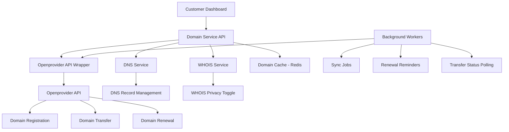
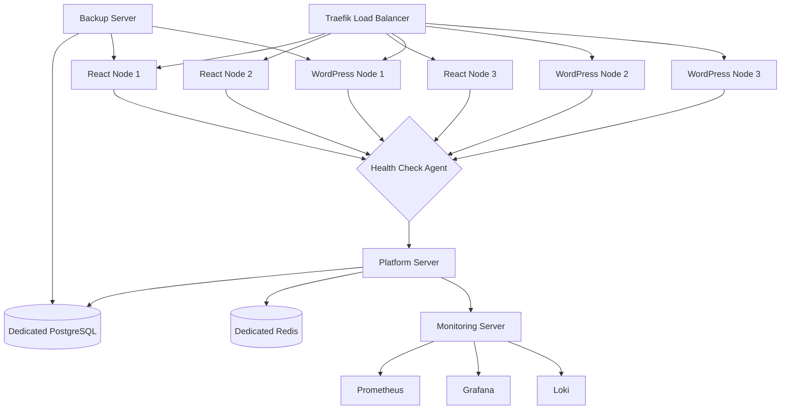
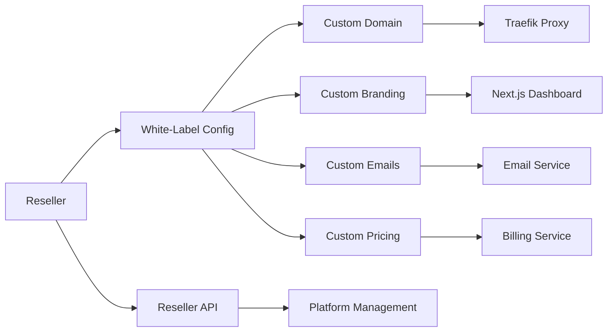
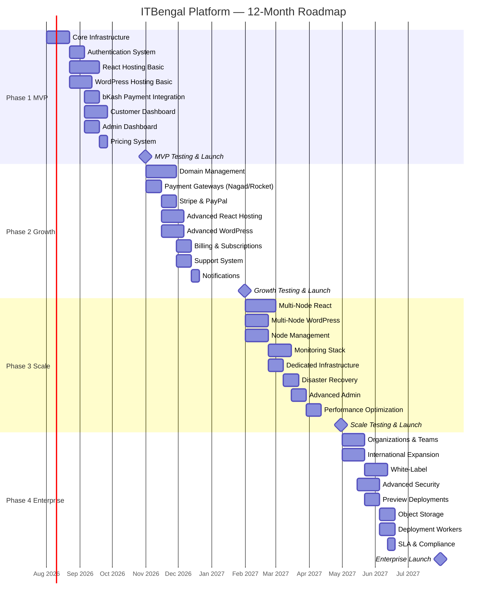
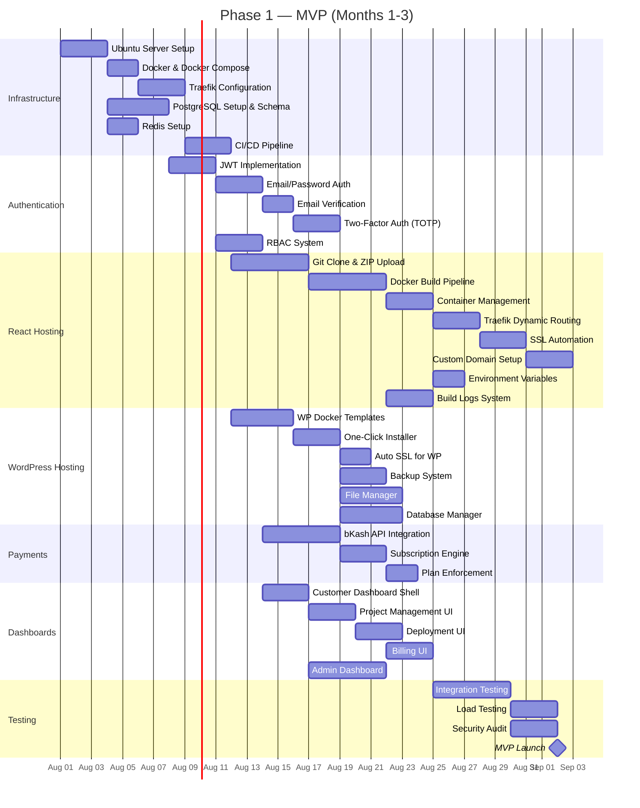
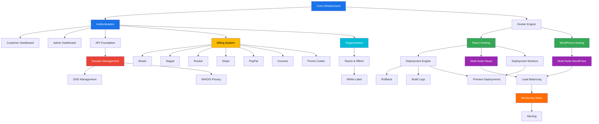
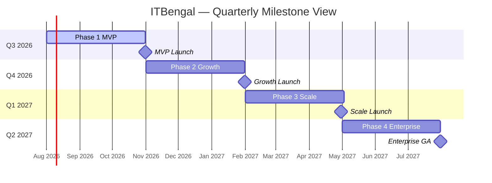

# ITBengal Hosting Platform — Product Roadmap

| Field | Value |
|---|---|
| **Document ID** | ITB-DOC-003 |
| **Version** | 1.0 |
| **Date** | July 4, 2026 |
| **Authors** | Product Management Team, Engineering Leadership |
| **Classification** | Internal — Confidential |

## Revision History

| Version | Date | Author | Changes |
|---|---|---|---|
| 0.1 | 2026-07-01 | Product Team | Initial draft |
| 0.5 | 2026-07-02 | Engineering | Technical feasibility review |
| 0.9 | 2026-07-03 | Leadership | Executive review & approval |
| 1.0 | 2026-07-04 | All | Final release |

---

## 1. Executive Summary

ITBengal is a Bangladesh-first hosting platform that combines the simplicity of Vercel, Netlify, Hostinger, and Cloudways. Built entirely on self-managed VPS infrastructure, the platform delivers React/Modern App Hosting, Managed WordPress Hosting, and Domain Management (via Openprovider) with local payment integration (bKash, Nagad, Rocket) and international gateways (Stripe, PayPal).

This roadmap spans **12 months** across **4 phases**, taking the platform from MVP to enterprise-grade. Each phase builds upon the previous, with clear dependencies, success metrics, and go/no-go criteria.

### Roadmap At-a-Glance

| Phase | Timeline | Focus | Key Deliverables |
|---|---|---|---|
| **Phase 1: MVP** | Months 1–3 | Core platform & basic hosting | Auth, React hosting, WordPress hosting, bKash payments, dashboards |
| **Phase 2: Growth** | Months 4–6 | Feature expansion & revenue | Domain management, full payments, advanced features, support system |
| **Phase 3: Scale** | Months 7–9 | Infrastructure & operations | Multi-node, monitoring, admin tools, disaster recovery |
| **Phase 4: Enterprise** | Months 10–12 | Enterprise & internationalization | Orgs/Teams, white-label, international expansion, advanced security |

---

## 2. Phase 1 — MVP (Months 1–3)

### 2.1 Objective

Deliver a functional hosting platform with core React and WordPress hosting capabilities, bKash payment integration, and essential customer/admin dashboards. Achieve first paying customer.

### 2.2 Feature Breakdown

| Feature Area | Deliverables | Priority | Effort (Weeks) |
|---|---|---|---|
| **Core Infrastructure** | Docker setup, Traefik reverse proxy, PostgreSQL, Redis, CI/CD pipeline | P0 | 3 |
| **Authentication** | JWT-based auth, email/password login, email verification, 2FA (TOTP), RBAC (admin/customer) | P0 | 2 |
| **React Hosting — Basic** | Git deployment (GitHub), ZIP upload, automatic builds (Docker), auto SSL (Let's Encrypt), custom domains, environment variables, build logs | P0 | 4 |
| **WordPress Hosting — Basic** | One-click WP installation, PHP/MariaDB containers, auto SSL, automatic backups, file manager, database manager | P0 | 3 |
| **bKash Payment** | bKash payment gateway integration, subscription creation, plan enforcement | P0 | 2 |
| **Customer Dashboard** | Dashboard overview, project list, deployment logs, billing, profile, settings | P0 | 3 |
| **Admin Dashboard** | Customer management, server overview, order management, basic analytics | P0 | 2 |
| **Pricing System** | 5-tier plans (Starter→Enterprise) for React and WordPress, resource limits per plan | P0 | 1 |

### 2.3 Technical Architecture (Phase 1)

```
Platform Server (Single VPS)
├── Next.js Dashboard (Customer + Admin)
├── Express.js API
├── PostgreSQL Database
├── Redis Cache & Queue
├── Traefik Reverse Proxy
├── Let's Encrypt SSL
├── BullMQ Workers
└── Docker Engine

React Hosting Server (Single VPS)
├── Docker Engine
├── Traefik Routing
├── Build Pipeline (Docker-based)
├── Container Management
└── SSL Automation

WordPress Hosting Server (Single VPS)
├── Docker Engine
├── PHP-FPM Containers
├── MariaDB Containers
├── Nginx (per-site)
├── Backup Agent
└── SSL Automation
```

### 2.4 Phase 1 Success Criteria

| Metric | Target |
|---|---|
| Platform uptime | ≥ 99% |
| Deploy success rate | ≥ 95% |
| First paying customer | ✅ Within Month 3 |
| React project deployment time | < 5 minutes |
| WordPress installation time | < 3 minutes |
| bKash payment success rate | ≥ 98% |
| Customer dashboard page load | < 2 seconds |

### 2.5 Phase 1 Risks

| Risk | Likelihood | Impact | Mitigation |
|---|---|---|---|
| Docker build failures for diverse frameworks | High | High | Pre-built Dockerfiles for each framework; comprehensive testing |
| bKash API instability | Medium | High | Retry logic with exponential backoff; manual payment fallback |
| Single-server bottleneck | Medium | Medium | Vertical scaling ready; Phase 3 horizontal scaling planned |
| SSL provisioning failures | Low | High | Fallback to shared SSL; Let's Encrypt rate limit monitoring |
| Database performance under load | Medium | High | Connection pooling; query optimization; Redis caching layer |

---

## 3. Phase 2 — Growth (Months 4–6)

### 3.1 Objective

Expand the platform with domain management, complete payment coverage, advanced hosting features, and customer support infrastructure. Achieve product-market fit and 100+ active customers.

### 3.2 Feature Breakdown

| Feature Area | Deliverables | Priority | Effort (Weeks) |
|---|---|---|---|
| **Domain Management** | Openprovider API integration, domain search, registration, transfer, renewal, DNS record management (A/AAAA/CNAME/MX/TXT/NS), WHOIS privacy, nameserver management | P0 | 4 |
| **Full Payment Integration** | Nagad gateway, Rocket gateway, Stripe integration, PayPal integration, multi-currency support | P0 | 3 |
| **Advanced React Hosting** | Rollback deployments, deployment history, application restart, GitLab/Bitbucket integration, enhanced build logs with real-time streaming | P1 | 3 |
| **Advanced WordPress** | Staging environments, website clone, malware scanning, automatic updates (core/plugins/themes), caching layer, security hardening | P1 | 3 |
| **Billing & Subscriptions** | Invoice generation (PDF), subscription management, upgrade/downgrade, promo codes/coupons, auto-renewal, refund processing | P0 | 2 |
| **Support System** | Ticket creation, ticket assignment, priority levels, email notifications, status tracking | P1 | 2 |
| **Notifications** | Email notifications, in-app notifications, notification preferences, deployment alerts, billing alerts | P2 | 1 |

### 3.3 Domain Management Architecture



### 3.4 Payment Gateway Architecture

| Gateway | Region | Features | Settlement |
|---|---|---|---|
| **bKash** | Bangladesh | Mobile payments, subscriptions, refunds | T+1 BDT |
| **Nagad** | Bangladesh | Mobile payments, QR, refunds | T+1 BDT |
| **Rocket** | Bangladesh | Mobile payments, refunds | T+2 BDT |
| **Stripe** | International | Cards, subscriptions, invoices, refunds | T+2 USD/EUR |
| **PayPal** | International | PayPal balance, cards, refunds | T+1 USD |

### 3.5 Phase 2 Success Criteria

| Metric | Target |
|---|---|
| Active paying customers | ≥ 100 |
| Domain registrations/month | ≥ 50 |
| Payment success rate (all gateways) | ≥ 97% |
| Support ticket first response time | < 4 hours |
| Staging environment creation time | < 2 minutes |
| Monthly recurring revenue (MRR) | ≥ ৳200,000 |

### 3.6 Phase 2 Risks

| Risk | Likelihood | Impact | Mitigation |
|---|---|---|---|
| Openprovider API rate limits | Medium | High | Request caching; bulk operations; queue-based processing |
| Payment gateway downtime | Medium | High | Multi-gateway fallback; payment retry queue |
| Malware scanning false positives | High | Medium | Whitelist system; manual review queue |
| Domain transfer failures | Medium | Medium | Transfer status monitoring; automated retry; customer notification |
| Feature scope creep | High | Medium | Strict sprint planning; feature flags for gradual rollout |

---

## 4. Phase 3 — Scale (Months 7–9)

### 4.1 Objective

Build multi-node infrastructure for horizontal scaling, implement comprehensive monitoring, and deliver advanced admin tools. Support 500+ concurrent customers with high availability.

### 4.2 Feature Breakdown

| Feature Area | Deliverables | Priority | Effort (Weeks) |
|---|---|---|---|
| **Multi-Node React** | React Node 1–N, node registration API, health checks, auto server selection, deployment queue | P0 | 4 |
| **Multi-Node WordPress** | WordPress Node 1–N, site migration between nodes, load balancing | P0 | 3 |
| **Node Management** | Node registration, discovery, health monitoring, automatic failover, capacity planning | P0 | 3 |
| **Monitoring Stack** | Prometheus metrics, Grafana dashboards, Loki log aggregation, alerting (PagerDuty/email/SMS) | P0 | 3 |
| **Dedicated Infrastructure** | Dedicated PostgreSQL server, dedicated Redis server, backup server | P1 | 2 |
| **Disaster Recovery** | Automated backups, cross-server replication, recovery runbooks, RTO/RPO targets | P0 | 2 |
| **Advanced Admin** | Analytics dashboard, audit logs, server health views, customer insights, resource usage reports | P1 | 2 |
| **Performance Optimization** | CDN integration, database query optimization, caching strategy, container resource tuning | P1 | 2 |

### 4.3 Multi-Node Architecture



### 4.4 Node Registration & Discovery

| Component | Description |
|---|---|
| **Node Agent** | Lightweight agent on each node reporting CPU, RAM, disk, container count every 30s |
| **Registry Service** | Central registry on platform server; maintains node status, capacity, capabilities |
| **Health Check** | HTTP health endpoint on each node; 3 consecutive failures → mark unhealthy |
| **Selection Algorithm** | Weighted scoring: CPU availability (40%), RAM availability (30%), disk (20%), active containers (10%) |
| **Failover** | Unhealthy node triggers migration queue; containers redistributed to healthy nodes |
| **Scheduling** | BullMQ-based deployment queue with priority tiers matching customer plan level |

### 4.5 Phase 3 Success Criteria

| Metric | Target |
|---|---|
| Platform uptime | ≥ 99.9% |
| Active paying customers | ≥ 500 |
| Node failover time | < 5 minutes |
| Monitoring alert response | < 15 minutes |
| Database query P95 latency | < 100ms |
| Backup completion (daily) | 100% |
| Recovery Point Objective (RPO) | ≤ 1 hour |
| Recovery Time Objective (RTO) | ≤ 30 minutes |

### 4.6 Phase 3 Risks

| Risk | Likelihood | Impact | Mitigation |
|---|---|---|---|
| Data loss during migration | Low | Critical | Pre-migration snapshots; validated restore procedures |
| Monitoring overhead on nodes | Medium | Medium | Lightweight agents; sampling for high-volume metrics |
| Network partitioning | Low | High | Heartbeat-based detection; split-brain resolution protocols |
| Database migration downtime | Medium | High | Blue-green database migration; read replicas |
| Cost overrun (new servers) | Medium | Medium | Capacity forecasting; gradual node addition based on demand |

---

## 5. Phase 4 — Enterprise (Months 10–12)

### 5.1 Objective

Deliver enterprise-grade features, prepare for international expansion, and enable white-label hosting. Target 1,000+ customers and establish ITBengal as a premium hosting brand.

### 5.2 Feature Breakdown

| Feature Area | Deliverables | Priority | Effort (Weeks) |
|---|---|---|---|
| **Organizations & Teams** | Organization creation, team management, member invitations, role-based permissions (Owner/Admin/Developer/Billing/Viewer) | P0 | 3 |
| **API Keys** | API key generation, scoped permissions, rate limiting per key, usage analytics | P1 | 1 |
| **International Expansion** | Multi-currency pricing (BDT, USD, EUR, GBP), multi-language UI (Bengali, English), regional payment optimization | P0 | 3 |
| **White-Label** | Custom branding, custom domain for control panel, branded emails, reseller API | P1 | 3 |
| **Advanced Security** | Web Application Firewall (WAF), DDoS protection, IP whitelisting/blacklisting, security hardening automation, vulnerability scanning | P0 | 3 |
| **Preview Deployments** | PR-based preview URLs, automatic cleanup, branch-based deployments | P1 | 2 |
| **Object Storage** | Dedicated object storage server, CDN integration, static asset hosting | P2 | 2 |
| **Deployment Workers** | Dedicated build/deploy worker nodes, parallel builds, build caching | P1 | 2 |
| **SLA & Compliance** | SLA guarantees (99.9% uptime), SLA credit system, compliance documentation | P0 | 1 |

### 5.3 Organization & Team RBAC Model

| Role | Projects | Deployments | Billing | Team Mgmt | Admin |
|---|---|---|---|---|---|
| **Owner** | Full | Full | Full | Full | Full |
| **Admin** | Full | Full | View | Add/Remove | Limited |
| **Developer** | Create/Edit | Deploy/Rollback | None | None | None |
| **Billing** | View | None | Full | None | None |
| **Viewer** | View | View | View | None | None |

### 5.4 White-Label Architecture



### 5.5 Phase 4 Success Criteria

| Metric | Target |
|---|---|
| Active paying customers | ≥ 1,000 |
| Enterprise customers | ≥ 20 |
| International customers | ≥ 50 |
| White-label partners | ≥ 5 |
| Platform uptime (SLA) | ≥ 99.9% |
| Monthly recurring revenue | ≥ ৳1,000,000 |
| API adoption rate | ≥ 15% of customers |
| Customer NPS score | ≥ 50 |

### 5.6 Phase 4 Risks

| Risk | Likelihood | Impact | Mitigation |
|---|---|---|---|
| International compliance requirements | High | High | Legal review; GDPR compliance; data residency planning |
| White-label complexity | High | Medium | Modular architecture; extensive configuration over customization |
| WAF false positives | Medium | Medium | Learning mode; customer-specific rule tuning |
| Multi-currency pricing complexity | Medium | Medium | Currency conversion service; fixed monthly rate locks |
| Enterprise customer SLA violations | Low | Critical | Redundant infrastructure; automated incident response |

---

## 6. Overall Project Gantt Chart



---

## 7. Phase 1 Gantt Chart (Detailed)



---

## 8. Feature Rollout Timeline with Dependencies

### 8.1 Dependency Map



### 8.2 Feature Dependency Matrix

| Feature | Depends On | Blocks | Phase |
|---|---|---|---|
| Core Infrastructure | — | All features | 1 |
| Authentication | Core Infrastructure | Dashboard, Admin, Billing, API | 1 |
| React Hosting | Docker Engine, Traefik | Deployment Engine, Multi-Node React | 1 |
| WordPress Hosting | Docker Engine | Multi-Node WordPress, Staging, Clone | 1 |
| bKash Payment | Authentication, Billing System | — | 1 |
| Customer Dashboard | Authentication | — | 1 |
| Admin Dashboard | Authentication | — | 1 |
| Domain Management | API Foundation | DNS, WHOIS | 2 |
| Nagad/Rocket | Billing System | — | 2 |
| Stripe/PayPal | Billing System | International Expansion | 2 |
| Rollback | Deployment Engine | — | 2 |
| WordPress Staging | WordPress Hosting | — | 2 |
| WordPress Clone | WordPress Hosting | — | 2 |
| Malware Scan | WordPress Hosting | — | 2 |
| Support System | Authentication | — | 2 |
| Multi-Node React | React Hosting | Load Balancing | 3 |
| Multi-Node WordPress | WordPress Hosting | Load Balancing | 3 |
| Monitoring Stack | Multi-Node Infrastructure | Alerting, SLA | 3 |
| Disaster Recovery | Dedicated Infrastructure | SLA | 3 |
| Organizations | Authentication | Teams, White-Label | 4 |
| Teams & RBAC | Organizations | White-Label | 4 |
| White-Label | Teams, Dashboard | — | 4 |
| International Expansion | Stripe/PayPal | — | 4 |
| Preview Deployments | Deployment Workers, React Hosting | — | 4 |
| Advanced Security (WAF) | Traefik | SLA | 4 |

---

## 9. Technical Debt Management

### 9.1 Strategy

Technical debt is managed through a structured approach:

1. **Debt Identification** — Engineers flag tech debt items during code reviews and retrospectives
2. **Debt Classification** — Each item classified by type, severity, and estimated cost to fix
3. **Debt Budget** — 20% of each sprint allocated to tech debt reduction
4. **Debt Review** — Monthly tech debt review by engineering leadership
5. **Debt Tracking** — All items tracked in the project management tool with `tech-debt` label

### 9.2 Anticipated Technical Debt Items

| Phase | Debt Item | Type | Severity | Planned Resolution |
|---|---|---|---|---|
| 1 | Monolithic API structure | Architecture | Medium | Refactor to modular services in Phase 2 |
| 1 | Hardcoded configuration values | Code Quality | Low | Migrate to centralized config service in Phase 2 |
| 1 | Single database without read replicas | Performance | High | Dedicated DB server in Phase 3 |
| 1 | Basic error handling in deployment pipeline | Reliability | Medium | Comprehensive error handling in Phase 2 |
| 1 | Inline CSS in dashboard components | Code Quality | Low | Design system implementation in Phase 2 |
| 2 | Synchronous Openprovider API calls | Performance | Medium | Async queue-based processing in Phase 3 |
| 2 | Limited test coverage for payment flows | Quality | High | Comprehensive payment testing suite in Phase 3 |
| 2 | Basic caching strategy | Performance | Medium | Multi-layer caching in Phase 3 |
| 3 | Manual node provisioning | Operations | Medium | Automated provisioning scripts in Phase 4 |
| 3 | Basic alerting rules | Operations | Medium | ML-based anomaly detection in Phase 4 |
| 3 | Single-region deployment | Availability | High | Multi-region support post-Phase 4 |

### 9.3 Debt Reduction Schedule

| Sprint | Debt Budget (%) | Focus Area |
|---|---|---|
| Sprints 1–6 | 10% | Minimal — focus on delivery |
| Sprints 7–10 | 15% | Phase 1 debt items |
| Sprints 11–16 | 20% | Phase 1 + 2 debt items |
| Sprints 17–21 | 20% | Phase 2 + 3 debt items |
| Sprints 22–26 | 25% | All accumulated debt |

---

## 10. Resource Requirements per Phase

### 10.1 Team Composition

| Role | Phase 1 | Phase 2 | Phase 3 | Phase 4 |
|---|---|---|---|---|
| **Product Manager** | 1 | 1 | 1 | 1 |
| **Frontend Engineer (Next.js/React)** | 2 | 2 | 2 | 3 |
| **Backend Engineer (Node.js/Express)** | 2 | 3 | 3 | 3 |
| **DevOps Engineer** | 1 | 1 | 2 | 2 |
| **QA Engineer** | 1 | 1 | 2 | 2 |
| **UI/UX Designer** | 1 | 1 | 0.5 | 1 |
| **Database Engineer** | 0.5 | 0.5 | 1 | 0.5 |
| **Security Engineer** | 0.5 | 0.5 | 0.5 | 1 |
| **Technical Writer** | 0 | 0.5 | 0.5 | 1 |
| **Total Headcount** | **9** | **10.5** | **12.5** | **14.5** |

### 10.2 Infrastructure Requirements

| Resource | Phase 1 | Phase 2 | Phase 3 | Phase 4 |
|---|---|---|---|---|
| **Platform Server** | 1× (8 CPU, 16GB RAM, 200GB SSD) | 1× (16 CPU, 32GB RAM, 500GB SSD) | 1× (16 CPU, 32GB RAM, 500GB SSD) | 2× (HA pair) |
| **React Nodes** | 1× (4 CPU, 8GB RAM, 100GB SSD) | 1× (8 CPU, 16GB RAM, 200GB SSD) | 3× (8 CPU, 16GB RAM, 200GB SSD) | 5× (8 CPU, 16GB RAM, 200GB SSD) |
| **WordPress Nodes** | 1× (4 CPU, 8GB RAM, 100GB SSD) | 1× (8 CPU, 16GB RAM, 200GB SSD) | 3× (8 CPU, 16GB RAM, 200GB SSD) | 5× (8 CPU, 16GB RAM, 200GB SSD) |
| **Database Server** | Shared on platform | Shared on platform | 1× Dedicated (8 CPU, 32GB RAM, 500GB NVMe) | 2× (Primary + Replica) |
| **Redis Server** | Shared on platform | Shared on platform | 1× Dedicated (4 CPU, 16GB RAM) | 1× (with Sentinel) |
| **Monitoring Server** | — | — | 1× (4 CPU, 8GB RAM, 200GB SSD) | 1× (8 CPU, 16GB RAM, 500GB SSD) |
| **Backup Server** | — | — | 1× (2 CPU, 4GB RAM, 1TB HDD) | 1× (4 CPU, 8GB RAM, 2TB HDD) |
| **Object Storage** | — | — | — | 1× (2 CPU, 4GB RAM, 2TB HDD) |
| **Estimated Monthly Cost** | ~$200 | ~$400 | ~$1,200 | ~$2,500 |

---

## 11. KPIs and Success Metrics per Phase

### 11.1 Business KPIs

| KPI | Phase 1 Target | Phase 2 Target | Phase 3 Target | Phase 4 Target |
|---|---|---|---|---|
| Registered Users | 50 | 300 | 800 | 2,000 |
| Paying Customers | 10 | 100 | 500 | 1,000 |
| MRR (Monthly Recurring Revenue) | ৳50,000 | ৳200,000 | ৳600,000 | ৳1,500,000 |
| Customer Churn Rate | < 15% | < 10% | < 7% | < 5% |
| Customer Acquisition Cost | ৳500 | ৳400 | ৳300 | ৳250 |
| Net Promoter Score (NPS) | 30 | 40 | 45 | 50+ |
| Domains Under Management | — | 200 | 800 | 2,000 |

### 11.2 Technical KPIs

| KPI | Phase 1 Target | Phase 2 Target | Phase 3 Target | Phase 4 Target |
|---|---|---|---|---|
| Platform Uptime | 99.0% | 99.5% | 99.9% | 99.95% |
| Deploy Success Rate | 95% | 97% | 99% | 99.5% |
| Average Deploy Time | < 5 min | < 4 min | < 3 min | < 2 min |
| API Response Time (P95) | < 500ms | < 300ms | < 200ms | < 150ms |
| Page Load Time (Dashboard) | < 3s | < 2s | < 1.5s | < 1s |
| Error Rate | < 2% | < 1% | < 0.5% | < 0.1% |
| Test Coverage | 60% | 70% | 80% | 85% |
| Incident Response Time | < 1 hour | < 30 min | < 15 min | < 10 min |

### 11.3 Operational KPIs

| KPI | Phase 1 Target | Phase 2 Target | Phase 3 Target | Phase 4 Target |
|---|---|---|---|---|
| Support Ticket Volume | < 50/month | < 200/month | < 500/month | < 800/month |
| First Response Time | < 24h | < 4h | < 2h | < 1h |
| Ticket Resolution Time | < 48h | < 24h | < 12h | < 8h |
| Customer Self-Service Rate | 40% | 55% | 65% | 75% |
| Documentation Coverage | 50% | 70% | 85% | 95% |
| Deployment Frequency | Weekly | Bi-weekly | Continuous | Continuous |
| Mean Time to Recovery (MTTR) | < 4h | < 2h | < 30min | < 15min |

---

## 12. Roadmap Summary

### 12.1 Quarterly Milestones



### 12.2 Release Strategy

| Release | Phase | Date | Type | Audience |
|---|---|---|---|---|
| **Alpha 1.0** | Phase 1 | Month 2 | Internal | Engineering team + 5 beta testers |
| **Beta 1.0** | Phase 1 | Month 3 | Limited Public | 50 early adopters |
| **GA 1.0** | Phase 1 | End of Month 3 | Public | Bangladesh market |
| **GA 1.5** | Phase 2 | End of Month 6 | Public | Full feature set |
| **GA 2.0** | Phase 3 | End of Month 9 | Public | High-availability release |
| **GA 3.0 Enterprise** | Phase 4 | End of Month 12 | Public | Enterprise + International |

---

## Appendix A: Glossary

| Term | Definition |
|---|---|
| **VPS** | Virtual Private Server — self-managed virtual machine |
| **MRR** | Monthly Recurring Revenue |
| **NPS** | Net Promoter Score — customer satisfaction metric |
| **RTO** | Recovery Time Objective — max acceptable downtime |
| **RPO** | Recovery Point Objective — max acceptable data loss |
| **WAF** | Web Application Firewall |
| **RBAC** | Role-Based Access Control |
| **SLA** | Service Level Agreement |
| **GA** | General Availability |

---

*End of Document — ITB-DOC-003 v1.0*
