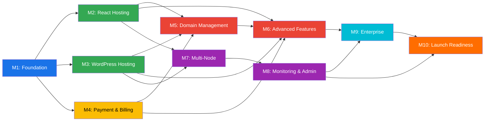
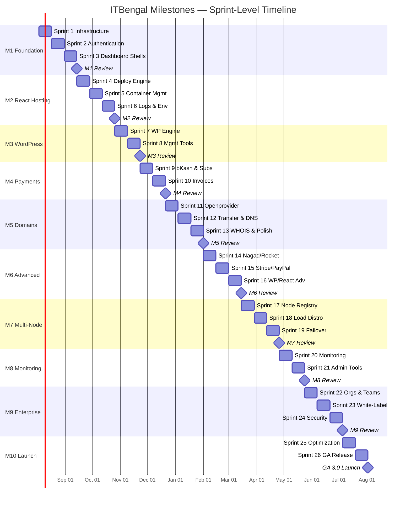

# ITBengal Hosting Platform — Milestones & Sprint Plan

| Field | Value |
|---|---|
| **Document ID** | ITB-DOC-004 |
| **Version** | 1.0 |
| **Date** | July 4, 2026 |
| **Authors** | Engineering Leadership, Product Management |
| **Classification** | Internal — Confidential |

## Revision History

| Version | Date | Author | Changes |
|---|---|---|---|
| 0.1 | 2026-07-01 | PM Team | Initial sprint planning |
| 0.5 | 2026-07-02 | Engineering | Technical feasibility & effort estimates |
| 0.9 | 2026-07-03 | QA Team | Success criteria & go/no-go review |
| 1.0 | 2026-07-04 | All | Final release |

---

## 1. Executive Summary

This document defines the sprint-level execution plan for the ITBengal hosting platform across a 12-month timeline. The plan is organized into **10 milestones** comprising **26 two-week sprints**, each with specific deliverables, success criteria, and go/no-go checkpoints.

The milestone structure ensures incremental delivery of value while maintaining technical quality and operational readiness. Each milestone concludes with a formal review and go/no-go decision before proceeding.

---

## 2. Sprint Methodology

### 2.1 Sprint Parameters

| Parameter | Value |
|---|---|
| **Sprint Duration** | 2 weeks (10 working days) |
| **Sprint Cadence** | Monday start, Friday end |
| **Total Sprints** | 26 (across 12 months) |
| **Buffer Sprints** | Built into milestone boundaries |
| **Story Point Scale** | Fibonacci (1, 2, 3, 5, 8, 13) |
| **Velocity Target** | 40–60 points per sprint (full team) |

### 2.2 Sprint Ceremonies

| Ceremony | When | Duration | Participants |
|---|---|---|---|
| **Sprint Planning** | Monday, Sprint Day 1 | 2 hours | Full team |
| **Daily Standup** | Daily, 10:00 AM BST | 15 minutes | Full team |
| **Backlog Refinement** | Wednesday, Week 1 | 1 hour | PM, Tech Lead, Seniors |
| **Sprint Review/Demo** | Friday, Sprint Day 10 | 1 hour | Full team + stakeholders |
| **Sprint Retrospective** | Friday, Sprint Day 10 | 45 minutes | Full team |

### 2.3 Definition of Done (DoD)

A story/task is considered "Done" when ALL of the following are met:

- [ ] Code written and self-reviewed
- [ ] Unit tests written with ≥ 80% coverage for new code
- [ ] Integration tests passing
- [ ] Code review approved by at least 1 peer
- [ ] No critical or high-severity linting errors
- [ ] API documentation updated (if applicable)
- [ ] Database migrations tested (if applicable)
- [ ] Docker container builds successfully
- [ ] Feature deployed to staging environment
- [ ] QA testing completed and approved
- [ ] No open P0/P1 bugs related to the feature
- [ ] Product Manager acceptance sign-off

---

## 3. Milestone Summary Dashboard

| # | Milestone | Sprints | Weeks | Start | End | Phase | Release |
|---|---|---|---|---|---|---|---|
| M1 | Foundation | S1–S3 | W1–W6 | Week 1 | Week 6 | Phase 1 | — |
| M2 | React Hosting MVP | S4–S6 | W7–W12 | Week 7 | Week 12 | Phase 1 | Alpha |
| M3 | WordPress Hosting MVP | S7–S8 | W13–W16 | Week 13 | Week 16 | Phase 1 | Beta |
| M4 | Payment & Billing | S9–S10 | W17–W20 | Week 17 | Week 20 | Phase 1 | Beta |
| M5 | Domain Management | S11–S13 | W21–W26 | Week 21 | Week 26 | Phase 2 | GA 1.0 |
| M6 | Full Payment & Advanced Features | S14–S16 | W27–W32 | Week 27 | Week 32 | Phase 2 | GA 1.5 |
| M7 | Multi-Node Infrastructure | S17–S19 | W33–W38 | Week 33 | Week 38 | Phase 3 | GA 2.0-alpha |
| M8 | Monitoring & Admin | S20–S21 | W39–W42 | Week 39 | Week 42 | Phase 3 | GA 2.0 |
| M9 | Enterprise Features | S22–S24 | W43–W48 | Week 43 | Week 48 | Phase 4 | GA 3.0-beta |
| M10 | Launch Readiness | S25–S26 | W49–W52 | Week 49 | Week 52 | Phase 4 | GA 3.0 |

---

## 4. Milestone Details

### Milestone 1: Foundation (Sprints 1–3, Weeks 1–6)

> **Goal:** Establish core infrastructure, authentication, and dashboard shells that all subsequent features build upon.

#### Sprint 1 (Weeks 1–2): Infrastructure Setup

| Task | Description | Effort (SP) | Owner |
|---|---|---|---|
| S1-01 | Ubuntu server provisioning (Platform, React, WordPress servers) | 3 | DevOps |
| S1-02 | Docker & Docker Compose setup on all servers | 3 | DevOps |
| S1-03 | Traefik reverse proxy configuration with SSL termination | 5 | DevOps |
| S1-04 | PostgreSQL database setup, initial schema design & migrations | 8 | Backend + DB |
| S1-05 | Redis setup (caching, session store, BullMQ queue) | 3 | Backend |
| S1-06 | CI/CD pipeline (GitHub Actions → Docker build → deploy) | 5 | DevOps |
| S1-07 | Express.js API boilerplate (error handling, logging, CORS, rate limiting) | 5 | Backend |
| S1-08 | Next.js dashboard boilerplate (routing, layout, theming) | 5 | Frontend |
| S1-09 | Development environment documentation | 2 | All |
| S1-10 | Git repository structure & branching strategy | 2 | DevOps |

**Sprint 1 Total:** ~41 SP

#### Sprint 2 (Weeks 3–4): Authentication System

| Task | Description | Effort (SP) | Owner |
|---|---|---|---|
| S2-01 | User registration (email/password) with input validation | 5 | Backend |
| S2-02 | Email verification flow (token generation, verification endpoint) | 3 | Backend |
| S2-03 | JWT implementation (access token + refresh token) | 5 | Backend |
| S2-04 | Login/logout flow with session management | 3 | Backend |
| S2-05 | Two-Factor Authentication (TOTP with QR code) | 5 | Backend |
| S2-06 | Password reset flow (email link, token expiry) | 3 | Backend |
| S2-07 | RBAC system (Admin, Customer roles; middleware enforcement) | 8 | Backend |
| S2-08 | User profile management API (update name, email, avatar) | 3 | Backend |
| S2-09 | Registration/Login/Profile UI pages | 5 | Frontend |
| S2-10 | Auth state management (Next.js context, token storage) | 3 | Frontend |
| S2-11 | Rate limiting for auth endpoints | 2 | Backend |
| S2-12 | Security headers (CSP, HSTS, X-Frame-Options) | 2 | Backend |

**Sprint 2 Total:** ~47 SP

#### Sprint 3 (Weeks 5–6): Dashboard Shells & API Foundation

| Task | Description | Effort (SP) | Owner |
|---|---|---|---|
| S3-01 | Customer dashboard layout (sidebar, header, navigation) | 5 | Frontend |
| S3-02 | Admin dashboard layout (sidebar, header, navigation) | 5 | Frontend |
| S3-03 | Dashboard overview page (placeholder widgets) | 3 | Frontend |
| S3-04 | RESTful API structure (versioning, pagination, filtering, sorting) | 5 | Backend |
| S3-05 | API error handling (standardized error responses, error codes) | 3 | Backend |
| S3-06 | API request validation middleware (Joi/Zod schemas) | 3 | Backend |
| S3-07 | User management API (CRUD, search, filter) | 5 | Backend |
| S3-08 | Admin user management UI (list, search, detail view) | 5 | Frontend |
| S3-09 | Design system foundation (colors, typography, components) | 5 | Frontend |
| S3-10 | Responsive design implementation (mobile, tablet, desktop) | 3 | Frontend |
| S3-11 | Dark mode / light mode toggle | 3 | Frontend |
| S3-12 | End-to-end integration testing setup (Jest, Supertest) | 3 | QA |

**Sprint 3 Total:** ~48 SP

#### Milestone 1 Deliverables

| Deliverable | Acceptance Criteria |
|---|---|
| Running infrastructure | All 3 servers operational with Docker, Traefik, PostgreSQL, Redis |
| Authentication system | Users can register, verify email, login, 2FA, reset password |
| RBAC enforcement | Admin and customer roles enforce access control across all endpoints |
| Dashboard shells | Customer and admin dashboards render with navigation, auth-protected |
| API foundation | RESTful API with versioning, pagination, validation, error handling |
| CI/CD pipeline | Code push → build → test → deploy to staging (automated) |

#### Milestone 1 Go/No-Go Criteria

| Criteria | Requirement | Status |
|---|---|---|
| Infrastructure stability | All servers running 48h+ without restart | ☐ |
| Auth test coverage | ≥ 80% unit test coverage for auth module | ☐ |
| API response time | P95 < 500ms for all endpoints | ☐ |
| Zero critical bugs | No P0/P1 bugs open | ☐ |
| CI/CD pipeline green | 3 consecutive successful deployments | ☐ |
| Security review | Auth flow reviewed by security engineer | ☐ |

---

### Milestone 2: React Hosting MVP (Sprints 4–6, Weeks 7–12)

> **Goal:** Enable customers to deploy React/Next.js/Vue/Angular/Svelte/Astro/Vite/HTML applications via Git or ZIP upload with automatic builds, SSL, and custom domains.

#### Sprint 4 (Weeks 7–8): Deployment Engine Core

| Task | Description | Effort (SP) | Owner |
|---|---|---|---|
| S4-01 | Git clone service (GitHub OAuth, repository access, clone to workspace) | 8 | Backend |
| S4-02 | ZIP upload service (file upload, extraction, validation) | 5 | Backend |
| S4-03 | Framework detection (auto-detect React/Next.js/Vue/Angular/Svelte/Astro/Vite/HTML) | 5 | Backend |
| S4-04 | Dockerfile templates per framework (build & serve stages) | 8 | DevOps |
| S4-05 | Docker image build pipeline (BullMQ job → build → tag → store) | 8 | Backend + DevOps |
| S4-06 | Build workspace management (temp directories, cleanup) | 3 | Backend |
| S4-07 | Project creation API & UI (name, framework, Git URL or ZIP, build settings) | 5 | Full Stack |
| S4-08 | Deployment database schema (projects, deployments, builds) | 3 | Backend |
| S4-09 | Deployment status tracking (queued → building → deploying → live → failed) | 3 | Backend |

**Sprint 4 Total:** ~48 SP

#### Sprint 5 (Weeks 9–10): Container Management & Networking

| Task | Description | Effort (SP) | Owner |
|---|---|---|---|
| S5-01 | Docker container creation from built images | 5 | DevOps |
| S5-02 | Container lifecycle management (start, stop, restart, remove) | 5 | Backend |
| S5-03 | Traefik dynamic routing configuration (labels-based) | 5 | DevOps |
| S5-04 | Automatic subdomain assignment (project-name.itbengal.com) | 3 | Backend |
| S5-05 | Custom domain configuration (CNAME verification) | 5 | Backend |
| S5-06 | Let's Encrypt SSL automation (ACME, auto-renewal) | 5 | DevOps |
| S5-07 | Health check system (HTTP health probes per container) | 3 | Backend |
| S5-08 | Container resource limits (CPU, RAM per plan) | 3 | DevOps |
| S5-09 | Domain management UI (add domain, verify DNS, SSL status) | 5 | Frontend |
| S5-10 | Deployment detail page UI (status, URL, domain, SSL) | 3 | Frontend |

**Sprint 5 Total:** ~42 SP

#### Sprint 6 (Weeks 11–12): Logs, Env Vars & Polish

| Task | Description | Effort (SP) | Owner |
|---|---|---|---|
| S6-01 | Build log capture (stream Docker build output to database) | 5 | Backend |
| S6-02 | Real-time build log streaming (WebSocket to dashboard) | 5 | Full Stack |
| S6-03 | Deployment log viewer (historical logs per deployment) | 3 | Frontend |
| S6-04 | Environment variables API (CRUD, encrypted storage) | 5 | Backend |
| S6-05 | Environment variables UI (add, edit, delete, show/hide values) | 3 | Frontend |
| S6-06 | Env var injection into Docker build & runtime | 3 | DevOps |
| S6-07 | Application restart functionality (container restart) | 2 | Backend |
| S6-08 | Deployment list page (all deployments, status, timestamps) | 3 | Frontend |
| S6-09 | Project settings page (build command, output dir, env vars, domain) | 5 | Frontend |
| S6-10 | React hosting end-to-end testing | 5 | QA |
| S6-11 | Framework-specific build testing (all 8 frameworks) | 8 | QA |
| S6-12 | Documentation: React hosting user guide | 3 | Tech Writer |

**Sprint 6 Total:** ~50 SP

#### Milestone 2 Deliverables

| Deliverable | Acceptance Criteria |
|---|---|
| Git deployment pipeline | User connects GitHub → push triggers build → container deployed |
| ZIP upload deployment | User uploads ZIP → build → deploy → live URL |
| Framework support | All 8 frameworks build and deploy successfully |
| Custom domains | User adds domain → verifies DNS → HTTPS active |
| SSL automation | Let's Encrypt certificates provisioned within 2 minutes |
| Build logs | Real-time streaming during build; historical logs accessible |
| Environment variables | Securely stored; injected at build and runtime |
| Application restart | One-click restart from dashboard |

#### Milestone 2 Go/No-Go Criteria

| Criteria | Requirement | Status |
|---|---|---|
| All 8 frameworks deploy | Successful build & deploy for each framework | ☐ |
| Deploy time | < 5 minutes for standard React app | ☐ |
| SSL provisioning | Auto-SSL works for custom domains | ☐ |
| Build log streaming | Real-time logs visible in dashboard | ☐ |
| Zero data loss | Env vars persist across deploys | ☐ |
| Load test | 20 concurrent deployments without failure | ☐ |

---

### Milestone 3: WordPress Hosting MVP (Sprints 7–8, Weeks 13–16)

> **Goal:** Deliver managed WordPress hosting with one-click installation, auto SSL, automatic backups, file manager, and database manager.

#### Sprint 7 (Weeks 13–14): WordPress Installation Engine

| Task | Description | Effort (SP) | Owner |
|---|---|---|---|
| S7-01 | WordPress Docker template (PHP-FPM, Nginx, MariaDB) | 8 | DevOps |
| S7-02 | One-click WordPress installer (wp-cli based provisioning) | 8 | Backend |
| S7-03 | WordPress version selection (latest, LTS, specific versions) | 3 | Backend |
| S7-04 | Admin credentials configuration during install | 3 | Backend |
| S7-05 | Auto SSL for WordPress sites (Traefik/Let's Encrypt) | 3 | DevOps |
| S7-06 | Custom domain support for WordPress | 3 | Backend |
| S7-07 | WordPress site management API (create, delete, status) | 5 | Backend |
| S7-08 | WordPress site listing & detail UI | 5 | Frontend |
| S7-09 | WordPress creation wizard UI | 5 | Frontend |
| S7-10 | Per-site resource isolation (CPU, RAM, storage limits) | 3 | DevOps |

**Sprint 7 Total:** ~46 SP

#### Sprint 8 (Weeks 15–16): Management Tools & Backups

| Task | Description | Effort (SP) | Owner |
|---|---|---|---|
| S8-01 | File manager backend (browse, upload, download, edit, delete) | 8 | Backend |
| S8-02 | File manager UI (tree view, editor, upload dialog) | 8 | Frontend |
| S8-03 | Database manager backend (list tables, run queries, export/import) | 8 | Backend |
| S8-04 | Database manager UI (table browser, SQL editor, export button) | 5 | Frontend |
| S8-05 | Automatic backup system (daily, configurable schedule) | 5 | Backend |
| S8-06 | Backup storage management (retention policy, storage quotas) | 3 | Backend |
| S8-07 | Backup restore functionality | 5 | Backend |
| S8-08 | Backup management UI (list, create, restore, delete) | 3 | Frontend |
| S8-09 | WordPress hosting end-to-end testing | 5 | QA |
| S8-10 | Documentation: WordPress hosting user guide | 3 | Tech Writer |

**Sprint 8 Total:** ~53 SP

#### Milestone 3 Deliverables

| Deliverable | Acceptance Criteria |
|---|---|
| One-click WordPress install | WP site live with admin access within 3 minutes |
| Auto SSL | HTTPS active for all WordPress sites |
| File manager | Browse, upload, download, edit, delete files via dashboard |
| Database manager | View tables, run SQL, export/import databases |
| Automatic backups | Daily backups running per configured schedule |
| Backup restore | Restore from any backup point successfully |

#### Milestone 3 Go/No-Go Criteria

| Criteria | Requirement | Status |
|---|---|---|
| WordPress install time | < 3 minutes end-to-end | ☐ |
| File manager operations | All CRUD operations working without errors | ☐ |
| Database export/import | Export and re-import without data loss | ☐ |
| Backup restore | Full restore completes and site is functional | ☐ |
| Resource isolation | One site crash doesn't affect others | ☐ |
| Security | No directory traversal in file manager | ☐ |

---

### Milestone 4: Payment & Billing (Sprints 9–10, Weeks 17–20)

> **Goal:** Integrate bKash payment gateway, implement subscription management, plan enforcement, and invoice generation.

#### Sprint 9 (Weeks 17–18): bKash & Subscriptions

| Task | Description | Effort (SP) | Owner |
|---|---|---|---|
| S9-01 | bKash payment gateway integration (create payment, execute, query) | 8 | Backend |
| S9-02 | Payment webhook handler (IPN callbacks, status updates) | 5 | Backend |
| S9-03 | Subscription database schema (plans, subscriptions, payments) | 5 | Backend |
| S9-04 | Subscription creation flow (select plan → pay → activate) | 5 | Backend |
| S9-05 | Plan enforcement middleware (check resource limits per plan) | 5 | Backend |
| S9-06 | Pricing page UI (5 tiers, feature comparison table) | 5 | Frontend |
| S9-07 | Checkout flow UI (plan selection → payment → confirmation) | 5 | Frontend |
| S9-08 | Payment retry logic (exponential backoff, max 3 retries) | 3 | Backend |
| S9-09 | Payment error handling (timeout, insufficient funds, gateway error) | 3 | Backend |
| S9-10 | Subscription status management (active, past_due, cancelled, expired) | 3 | Backend |

**Sprint 9 Total:** ~47 SP

#### Sprint 10 (Weeks 19–20): Invoices & Billing Dashboard

| Task | Description | Effort (SP) | Owner |
|---|---|---|---|
| S10-01 | Invoice generation service (auto-generate on payment) | 5 | Backend |
| S10-02 | Invoice PDF generation (professional template, download) | 5 | Backend |
| S10-03 | Invoice email delivery (send on generation) | 3 | Backend |
| S10-04 | Billing dashboard UI (current plan, usage, payment history) | 5 | Frontend |
| S10-05 | Invoice list & detail UI (view, download PDF) | 3 | Frontend |
| S10-06 | Plan upgrade/downgrade flow | 5 | Full Stack |
| S10-07 | Subscription auto-renewal (BullMQ scheduled job) | 3 | Backend |
| S10-08 | Renewal reminder emails (7 days, 3 days, 1 day before) | 3 | Backend |
| S10-09 | Admin payment management UI (view payments, refund) | 5 | Frontend |
| S10-10 | Admin order management UI (list orders, status) | 3 | Frontend |
| S10-11 | Payment integration testing (bKash sandbox) | 5 | QA |
| S10-12 | Billing documentation | 2 | Tech Writer |

**Sprint 10 Total:** ~47 SP

#### Milestone 4 Deliverables

| Deliverable | Acceptance Criteria |
|---|---|
| bKash payment | Customers pay via bKash; payment confirmed within 30 seconds |
| Subscriptions | Create, upgrade, downgrade, cancel subscriptions |
| Plan enforcement | Resource limits enforced per plan tier |
| Invoices | Auto-generated PDF invoices; downloadable; emailed |
| Auto-renewal | Subscriptions auto-renew; reminders sent before expiry |
| Admin billing | Admin can view payments, process refunds |

#### Milestone 4 Go/No-Go Criteria

| Criteria | Requirement | Status |
|---|---|---|
| bKash payment success | ≥ 98% success rate in sandbox | ☐ |
| Invoice accuracy | All invoices match payment amounts | ☐ |
| Plan enforcement | Exceeding plan limits blocked with clear error | ☐ |
| Upgrade/downgrade | Prorated billing calculated correctly | ☐ |
| Auto-renewal | Renewals process without manual intervention | ☐ |
| Security | Payment data encrypted; no PII in logs | ☐ |

---

### Milestone 5: Domain Management (Sprints 11–13, Weeks 21–26)

> **Goal:** Full domain lifecycle management via Openprovider API — search, register, transfer, renew, DNS, WHOIS privacy.

#### Sprint 11 (Weeks 21–22): Openprovider Integration & Registration

| Task | Description | Effort (SP) | Owner |
|---|---|---|---|
| S11-01 | Openprovider API client (authentication, request wrapper, error handling) | 8 | Backend |
| S11-02 | Domain availability search (single + bulk, pricing, TLD support) | 5 | Backend |
| S11-03 | Domain registration flow (WHOIS data, nameservers, payment) | 8 | Backend |
| S11-04 | Domain search UI (search bar, results, pricing, cart) | 5 | Frontend |
| S11-05 | Domain registration wizard UI | 5 | Frontend |
| S11-06 | Domain database schema (domains, registrations, DNS records) | 3 | Backend |
| S11-07 | Openprovider webhook handler (registration status, transfer events) | 3 | Backend |
| S11-08 | Domain registration background job (async processing) | 3 | Backend |
| S11-09 | Error handling for Openprovider API failures | 3 | Backend |
| S11-10 | Domain caching layer (Redis — TLD pricing, availability results) | 2 | Backend |

**Sprint 11 Total:** ~45 SP

#### Sprint 12 (Weeks 23–24): Transfers, Renewals & DNS

| Task | Description | Effort (SP) | Owner |
|---|---|---|---|
| S12-01 | Domain transfer initiation (auth code validation, Openprovider API) | 5 | Backend |
| S12-02 | Transfer status tracking (polling + webhooks) | 3 | Backend |
| S12-03 | Domain renewal (manual + auto-renewal configuration) | 5 | Backend |
| S12-04 | Renewal reminder system (email notifications) | 3 | Backend |
| S12-05 | DNS record management API (A, AAAA, CNAME, MX, TXT, NS records) | 8 | Backend |
| S12-06 | DNS record validation (format, conflict detection) | 3 | Backend |
| S12-07 | DNS management UI (record list, add/edit/delete forms) | 5 | Frontend |
| S12-08 | Domain transfer UI (initiation, status tracking) | 3 | Frontend |
| S12-09 | Domain renewal UI (manual renew, auto-renew toggle) | 3 | Frontend |
| S12-10 | Expired domain handling (grace period, redemption) | 3 | Backend |

**Sprint 12 Total:** ~41 SP

#### Sprint 13 (Weeks 25–26): WHOIS, Nameservers & Dashboard

| Task | Description | Effort (SP) | Owner |
|---|---|---|---|
| S13-01 | WHOIS privacy toggle (Openprovider API integration) | 3 | Backend |
| S13-02 | Custom nameserver configuration | 3 | Backend |
| S13-03 | Domain dashboard page (list all domains, status, quick actions) | 5 | Frontend |
| S13-04 | Domain detail page (DNS, WHOIS, nameservers, renewal info) | 5 | Frontend |
| S13-05 | WHOIS privacy UI (enable/disable toggle) | 2 | Frontend |
| S13-06 | Domain synchronization job (sync with Openprovider every 6 hours) | 3 | Backend |
| S13-07 | Domain integration with hosting (link domain to React/WP project) | 5 | Backend |
| S13-08 | Domain management admin UI (all domains, customer domains) | 5 | Frontend |
| S13-09 | Domain management end-to-end testing | 5 | QA |
| S13-10 | Domain management documentation | 3 | Tech Writer |

**Sprint 13 Total:** ~39 SP

#### Milestone 5 Deliverables

| Deliverable | Acceptance Criteria |
|---|---|
| Domain search | Search available domains with pricing across TLDs |
| Domain registration | Register domain via Openprovider; active within expected timeframe |
| Domain transfer | Transfer domain with auth code; track status to completion |
| Domain renewal | Manual and auto-renewal working; reminders sent |
| DNS management | Full CRUD for A, AAAA, CNAME, MX, TXT, NS records |
| WHOIS privacy | Enable/disable privacy protection |
| Domain-hosting link | Connect registered domain to React/WordPress project |

#### Milestone 5 Go/No-Go Criteria

| Criteria | Requirement | Status |
|---|---|---|
| Domain registration | Successfully register in Openprovider sandbox | ☐ |
| DNS propagation | Records propagate within expected timeframe | ☐ |
| Transfer flow | Complete transfer lifecycle in sandbox | ☐ |
| WHOIS privacy | WHOIS data masked when enabled | ☐ |
| Error recovery | Graceful handling of Openprovider API failures | ☐ |
| Domain sync | Sync job correctly reconciles local vs Openprovider state | ☐ |

---

### Milestone 6: Full Payment & Advanced Features (Sprints 14–16, Weeks 27–32)

> **Goal:** Complete payment gateway integration (Nagad, Rocket, Stripe, PayPal), deliver WordPress staging/clone/malware scan, and enhance React deployment features.

#### Sprint 14 (Weeks 27–28): Nagad & Rocket Integration

| Task | Description | Effort (SP) | Owner |
|---|---|---|---|
| S14-01 | Nagad payment gateway integration (API, webhook) | 8 | Backend |
| S14-02 | Rocket payment gateway integration (API, webhook) | 8 | Backend |
| S14-03 | Payment gateway abstraction layer (unified interface) | 5 | Backend |
| S14-04 | Payment method selection UI (bKash, Nagad, Rocket) | 3 | Frontend |
| S14-05 | Payment method management (saved payment methods) | 3 | Backend |
| S14-06 | Gateway health monitoring (availability checks, fallback) | 3 | Backend |
| S14-07 | Payment reconciliation (cross-reference with gateway reports) | 5 | Backend |
| S14-08 | Payment testing (Nagad + Rocket sandboxes) | 5 | QA |

**Sprint 14 Total:** ~40 SP

#### Sprint 15 (Weeks 29–30): Stripe, PayPal & Multi-Currency

| Task | Description | Effort (SP) | Owner |
|---|---|---|---|
| S15-01 | Stripe payment integration (Checkout, subscriptions, webhooks) | 8 | Backend |
| S15-02 | PayPal payment integration (Orders API, webhooks) | 8 | Backend |
| S15-03 | Multi-currency support (BDT, USD, EUR, GBP pricing) | 5 | Backend |
| S15-04 | Currency conversion service (fixed monthly rates) | 3 | Backend |
| S15-05 | International payment method UI (card, PayPal) | 3 | Frontend |
| S15-06 | Promo code system (create, validate, apply, usage limits) | 5 | Backend |
| S15-07 | Promo code admin UI (create, manage, statistics) | 3 | Frontend |
| S15-08 | Promo code checkout integration | 2 | Frontend |
| S15-09 | Refund processing (full + partial, via original gateway) | 5 | Backend |
| S15-10 | Refund admin UI | 3 | Frontend |

**Sprint 15 Total:** ~45 SP

#### Sprint 16 (Weeks 31–32): Advanced WordPress & React Features

| Task | Description | Effort (SP) | Owner |
|---|---|---|---|
| S16-01 | WordPress staging environment (clone production to staging) | 8 | Backend |
| S16-02 | Push staging to production (swap with confirmation) | 5 | Backend |
| S16-03 | WordPress site clone (to new site with different domain) | 5 | Backend |
| S16-04 | Malware scanning engine (ClamAV integration, scheduled scans) | 5 | Backend |
| S16-05 | Malware scan UI (trigger, results, quarantine) | 3 | Frontend |
| S16-06 | WordPress automatic updates (core, plugins, themes via wp-cli) | 5 | Backend |
| S16-07 | Update management UI (enable/disable per component) | 3 | Frontend |
| S16-08 | React deployment rollback (revert to previous deployment) | 5 | Backend |
| S16-09 | Rollback UI (deployment history, one-click rollback) | 3 | Frontend |
| S16-10 | Staging/Clone/Malware/Rollback testing | 5 | QA |

**Sprint 16 Total:** ~47 SP

#### Milestone 6 Deliverables

| Deliverable | Acceptance Criteria |
|---|---|
| Nagad/Rocket payments | Successful payments through both gateways |
| Stripe/PayPal | International payments processing |
| Multi-currency | Prices displayed in customer's currency |
| Promo codes | Apply valid promo codes at checkout with correct discount |
| Refunds | Process full/partial refunds to original payment method |
| WordPress staging | Create staging, push to production |
| WordPress clone | Clone site to new domain |
| Malware scan | Scan WordPress site, report threats, quarantine files |
| Auto updates | WordPress core/plugins/themes auto-update |
| React rollback | One-click rollback to any previous deployment |

#### Milestone 6 Go/No-Go Criteria

| Criteria | Requirement | Status |
|---|---|---|
| All 5 gateways functional | End-to-end payment in sandbox for each | ☐ |
| Promo codes | Percentage and fixed discounts calculated correctly | ☐ |
| Refund accuracy | Refund amount matches original payment | ☐ |
| Staging isolation | Staging changes don't affect production | ☐ |
| Malware detection | Known test malware detected | ☐ |
| Rollback integrity | Rollback restores exact previous state | ☐ |

---

### Milestone 7: Multi-Node Infrastructure (Sprints 17–19, Weeks 33–38)

> **Goal:** Transition from single-server to multi-node architecture with automatic node management, health checks, and failover.

#### Sprint 17 (Weeks 33–34): Node Registration & Discovery

| Task | Description | Effort (SP) | Owner |
|---|---|---|---|
| S17-01 | Node agent service (health reporting, metrics collection) | 8 | DevOps |
| S17-02 | Node registry API (register, deregister, update status) | 5 | Backend |
| S17-03 | Node discovery service (available nodes, capabilities) | 5 | Backend |
| S17-04 | Health check system (HTTP probes, 3-strike rule) | 5 | Backend |
| S17-05 | Node database schema (nodes, health_checks, capacity) | 3 | Backend |
| S17-06 | Node provisioning scripts (automated server setup) | 5 | DevOps |
| S17-07 | React Node 2 & 3 setup | 3 | DevOps |
| S17-08 | WordPress Node 2 & 3 setup | 3 | DevOps |
| S17-09 | Node management admin UI (list nodes, health status) | 5 | Frontend |

**Sprint 17 Total:** ~42 SP

#### Sprint 18 (Weeks 35–36): Load Distribution & Scheduling

| Task | Description | Effort (SP) | Owner |
|---|---|---|---|
| S18-01 | Server selection algorithm (weighted scoring: CPU/RAM/disk/containers) | 8 | Backend |
| S18-02 | Deployment queue with priority levels (plan-based) | 5 | Backend |
| S18-03 | Load distribution across nodes (round-robin + weighted) | 5 | Backend |
| S18-04 | Container migration between nodes | 8 | DevOps |
| S18-05 | Deployment scheduling (queue management, concurrency limits) | 3 | Backend |
| S18-06 | Node capacity alerts (80% threshold warnings) | 3 | Backend |
| S18-07 | Load distribution admin dashboard | 5 | Frontend |
| S18-08 | Multi-node deployment testing | 5 | QA |

**Sprint 18 Total:** ~42 SP

#### Sprint 19 (Weeks 37–38): Dedicated Services & Failover

| Task | Description | Effort (SP) | Owner |
|---|---|---|---|
| S19-01 | Dedicated PostgreSQL server setup (migration from shared) | 8 | DevOps + DB |
| S19-02 | PostgreSQL read replica configuration | 5 | DB |
| S19-03 | Dedicated Redis server setup (with Sentinel for HA) | 5 | DevOps |
| S19-04 | Automatic failover for unhealthy nodes | 8 | Backend |
| S19-05 | Container redistribution on node failure | 5 | Backend |
| S19-06 | Database connection failover (app-level retry) | 3 | Backend |
| S19-07 | Failover testing & chaos engineering | 5 | QA |
| S19-08 | Infrastructure documentation update | 3 | DevOps |

**Sprint 19 Total:** ~42 SP

#### Milestone 7 Deliverables

| Deliverable | Acceptance Criteria |
|---|---|
| Multi-node React hosting | Deployments distributed across 3+ React nodes |
| Multi-node WordPress | WordPress sites distributed across 3+ WP nodes |
| Node health monitoring | All nodes report health every 30 seconds |
| Auto server selection | New deployments placed on optimal node automatically |
| Failover | Unhealthy node's containers migrate within 5 minutes |
| Dedicated PostgreSQL | Database on dedicated server with read replica |
| Dedicated Redis | Redis on dedicated server with Sentinel HA |

#### Milestone 7 Go/No-Go Criteria

| Criteria | Requirement | Status |
|---|---|---|
| Node discovery | All nodes visible in admin with real-time health | ☐ |
| Load distribution | Deployments spread evenly across nodes | ☐ |
| Failover time | Container migration < 5 minutes on node failure | ☐ |
| Database migration | Zero downtime during DB server migration | ☐ |
| Redis failover | Sentinel promotes replica < 30 seconds | ☐ |
| No data loss | All customer data intact after migration | ☐ |

---

### Milestone 8: Monitoring & Admin (Sprints 20–21, Weeks 39–42)

> **Goal:** Implement comprehensive monitoring stack and advanced admin dashboard features.

#### Sprint 20 (Weeks 39–40): Monitoring Stack

| Task | Description | Effort (SP) | Owner |
|---|---|---|---|
| S20-01 | Prometheus server setup (metrics collection, retention) | 5 | DevOps |
| S20-02 | Grafana dashboards (system health, per-node, per-customer) | 8 | DevOps |
| S20-03 | Loki setup (centralized log aggregation) | 5 | DevOps |
| S20-04 | Node exporters on all servers (CPU, RAM, disk, network) | 3 | DevOps |
| S20-05 | Custom application metrics (deploy count, build time, errors) | 5 | Backend |
| S20-06 | Alerting rules (server down, disk full, high CPU, deploy failures) | 5 | DevOps |
| S20-07 | Alert notification channels (email, SMS, webhook) | 3 | Backend |
| S20-08 | Monitoring admin page (embedded Grafana dashboards) | 5 | Frontend |
| S20-09 | Server health overview admin page | 3 | Frontend |

**Sprint 20 Total:** ~42 SP

#### Sprint 21 (Weeks 41–42): Advanced Admin Features

| Task | Description | Effort (SP) | Owner |
|---|---|---|---|
| S21-01 | Analytics dashboard (revenue, signups, deployments, churn) | 8 | Full Stack |
| S21-02 | Audit log system (track all admin/user actions) | 5 | Backend |
| S21-03 | Audit log viewer UI (filter by action, user, date, export CSV) | 5 | Frontend |
| S21-04 | Announcement system (create, publish, target audience) | 3 | Backend |
| S21-05 | Announcement management UI | 3 | Frontend |
| S21-06 | Coupon management admin (create, edit, deactivate, statistics) | 5 | Full Stack |
| S21-07 | Pricing management admin (update plan prices, features) | 3 | Full Stack |
| S21-08 | Support ticket system (create, assign, respond, close) | 5 | Full Stack |
| S21-09 | Support ticket management admin UI | 5 | Frontend |
| S21-10 | Admin dashboard testing | 3 | QA |

**Sprint 21 Total:** ~45 SP

#### Milestone 8 Go/No-Go Criteria

| Criteria | Requirement | Status |
|---|---|---|
| Monitoring coverage | All servers and services have Prometheus metrics | ☐ |
| Grafana dashboards | At least 5 dashboards (system, nodes, apps, billing, errors) | ☐ |
| Alert delivery | Alerts delivered within 2 minutes of trigger | ☐ |
| Audit log completeness | All admin actions logged with user, timestamp, details | ☐ |
| Analytics accuracy | Revenue metrics match actual payment data | ☐ |

---

### Milestone 9: Enterprise Features (Sprints 22–24, Weeks 43–48)

> **Goal:** Deliver organization/team management, white-label capabilities, international expansion prep, and advanced security.

#### Sprint 22 (Weeks 43–44): Organizations & Teams

| Task | Description | Effort (SP) | Owner |
|---|---|---|---|
| S22-01 | Organization model (create, settings, billing, members) | 8 | Backend |
| S22-02 | Team management (create teams, assign projects) | 5 | Backend |
| S22-03 | Member invitation system (email invite, accept/reject) | 5 | Backend |
| S22-04 | Role-based permissions (Owner, Admin, Developer, Billing, Viewer) | 8 | Backend |
| S22-05 | Organization dashboard UI | 5 | Frontend |
| S22-06 | Team management UI | 3 | Frontend |
| S22-07 | API key generation (scoped permissions, rate limits) | 5 | Backend |
| S22-08 | API key management UI | 3 | Frontend |
| S22-09 | Organization billing (centralized billing for team) | 5 | Backend |

**Sprint 22 Total:** ~47 SP

#### Sprint 23 (Weeks 45–46): White-Label & Internationalization

| Task | Description | Effort (SP) | Owner |
|---|---|---|---|
| S23-01 | White-label configuration system (branding, domain, colors, logo) | 8 | Backend |
| S23-02 | Custom domain for reseller dashboard (Traefik routing) | 5 | DevOps |
| S23-03 | Branded email templates (configurable sender, logo, colors) | 3 | Backend |
| S23-04 | Reseller API (customer management, provisioning) | 5 | Backend |
| S23-05 | Multi-language support (i18n framework, Bengali + English) | 5 | Frontend |
| S23-06 | Language selection UI | 2 | Frontend |
| S23-07 | Multi-currency pricing admin (set prices per currency) | 3 | Backend |
| S23-08 | White-label admin configuration UI | 5 | Frontend |
| S23-09 | White-label testing | 5 | QA |

**Sprint 23 Total:** ~41 SP

#### Sprint 24 (Weeks 47–48): Security & Preview Deployments

| Task | Description | Effort (SP) | Owner |
|---|---|---|---|
| S24-01 | Web Application Firewall (WAF) via Traefik middleware | 8 | DevOps |
| S24-02 | DDoS protection (rate limiting, IP reputation, geo-blocking) | 5 | DevOps |
| S24-03 | IP whitelist/blacklist management | 3 | Backend |
| S24-04 | Security hardening automation (server-level) | 5 | DevOps |
| S24-05 | Vulnerability scanning (automated, scheduled) | 3 | DevOps |
| S24-06 | Preview deployments (PR-based preview URLs) | 8 | Backend |
| S24-07 | Preview deployment UI (PR list, preview URLs) | 3 | Frontend |
| S24-08 | SLA guarantee system (uptime tracking, credit calculation) | 5 | Backend |
| S24-09 | Security & enterprise testing | 5 | QA |

**Sprint 24 Total:** ~45 SP

#### Milestone 9 Go/No-Go Criteria

| Criteria | Requirement | Status |
|---|---|---|
| Organization RBAC | All 5 roles enforce correct permissions | ☐ |
| Team isolation | Team members only see assigned projects | ☐ |
| API keys | Scoped keys work with correct permissions | ☐ |
| White-label | Reseller sees custom branding, no ITBengal references | ☐ |
| WAF | Common attack vectors blocked (SQL injection, XSS) | ☐ |
| Preview deployments | PR creates preview URL; merge cleans up | ☐ |
| Multi-language | Full UI available in Bengali and English | ☐ |

---

### Milestone 10: Launch Readiness (Sprints 25–26, Weeks 49–52)

> **Goal:** Performance optimization, comprehensive testing, security audit, and GA 3.0 release preparation.

#### Sprint 25 (Weeks 49–50): Optimization & Testing

| Task | Description | Effort (SP) | Owner |
|---|---|---|---|
| S25-01 | Performance profiling (API bottlenecks, DB query optimization) | 8 | Backend |
| S25-02 | Frontend performance optimization (bundle size, lazy loading, caching) | 5 | Frontend |
| S25-03 | Database query optimization (indexes, query plans, connection pooling) | 5 | DB |
| S25-04 | Load testing (simulated 1000+ concurrent users) | 8 | QA |
| S25-05 | Stress testing (node failure, DB failover, gateway outage) | 5 | QA |
| S25-06 | Security penetration testing (OWASP Top 10) | 8 | Security |
| S25-07 | Accessibility audit (WCAG 2.1 AA compliance) | 3 | Frontend |
| S25-08 | Performance baseline documentation | 2 | All |

**Sprint 25 Total:** ~44 SP

#### Sprint 26 (Weeks 51–52): Documentation & GA Release

| Task | Description | Effort (SP) | Owner |
|---|---|---|---|
| S26-01 | User documentation (complete guides for all features) | 8 | Tech Writer |
| S26-02 | API documentation (OpenAPI/Swagger, code examples) | 5 | Backend |
| S26-03 | Admin operations manual (runbooks, troubleshooting) | 5 | DevOps |
| S26-04 | Video tutorials (key workflows) | 3 | Marketing |
| S26-05 | Marketing website updates (feature pages, pricing) | 3 | Frontend |
| S26-06 | GA release preparation (feature flags, rollout plan) | 3 | PM |
| S26-07 | Team training (support team, sales team) | 3 | All |
| S26-08 | GA launch execution | 2 | All |
| S26-09 | Post-launch monitoring plan | 2 | DevOps |
| S26-10 | Retrospective & roadmap update for next year | 2 | All |

**Sprint 26 Total:** ~36 SP

#### Milestone 10 Go/No-Go Criteria

| Criteria | Requirement | Status |
|---|---|---|
| Load test pass | System handles 1000+ concurrent users | ☐ |
| Security audit pass | No critical/high vulnerabilities | ☐ |
| API documentation | 100% endpoint coverage | ☐ |
| User documentation | All features documented with screenshots | ☐ |
| Uptime (last 30 days) | ≥ 99.9% | ☐ |
| Zero P0 bugs | No critical bugs open | ☐ |
| Stakeholder sign-off | PM, Engineering, Security, Legal approved | ☐ |

---

## 5. Dependencies Between Milestones

### 5.1 Dependency Diagram

### 5.2 Dependency Matrix

| Milestone | Depends On | Blocks |
|---|---|---|
| M1: Foundation | — | M2, M3, M4 |
| M2: React Hosting | M1 | M5, M6, M7 |
| M3: WordPress Hosting | M1 | M5, M6, M7 |
| M4: Payment & Billing | M1 | M5, M6 |
| M5: Domain Management | M2, M3, M4 | M6 |
| M6: Advanced Features | M2, M3, M4, M5 | M9 |
| M7: Multi-Node | M2, M3 | M8 |
| M8: Monitoring & Admin | M7 | M9, M10 |
| M9: Enterprise | M6, M8 | M10 |
| M10: Launch Readiness | M8, M9 | — |

---

## 6. Resource Allocation Per Milestone

| Role | M1 | M2 | M3 | M4 | M5 | M6 | M7 | M8 | M9 | M10 |
|---|---|---|---|---|---|---|---|---|---|---|
| **PM** | 1 | 1 | 1 | 1 | 1 | 1 | 1 | 1 | 1 | 1 |
| **Frontend** | 2 | 2 | 2 | 1 | 2 | 2 | 1 | 2 | 3 | 2 |
| **Backend** | 2 | 3 | 2 | 3 | 3 | 3 | 3 | 2 | 3 | 2 |
| **DevOps** | 2 | 2 | 1 | 0 | 0 | 1 | 3 | 2 | 2 | 1 |
| **QA** | 1 | 1 | 1 | 1 | 1 | 1 | 1 | 1 | 1 | 2 |
| **DB/Security** | 1 | 0 | 0 | 0 | 0 | 0 | 1 | 0 | 1 | 1 |
| **Total** | **9** | **9** | **7** | **6** | **7** | **8** | **10** | **8** | **11** | **9** |

---

## 7. Release Planning

### 7.1 Release Schedule

| Release | Milestone | Target Date | Type | Feature Flags |
|---|---|---|---|---|
| **Alpha 0.1** | M1 complete | Week 6 | Internal | All features behind flags |
| **Alpha 0.5** | M2 complete | Week 12 | Internal + 5 testers | React hosting enabled |
| **Beta 1.0** | M3 + M4 complete | Week 20 | Limited public (50 users) | React + WP + bKash |
| **GA 1.0** | M5 complete | Week 26 | Public launch | + Domains |
| **GA 1.5** | M6 complete | Week 32 | Public | + All payments + advanced features |
| **GA 2.0-alpha** | M7 complete | Week 38 | Internal | Multi-node (canary) |
| **GA 2.0** | M8 complete | Week 42 | Public | + Monitoring + admin |
| **GA 3.0-beta** | M9 complete | Week 48 | Enterprise beta | + Orgs + white-label |
| **GA 3.0** | M10 complete | Week 52 | Full GA | All features |

### 7.2 Feature Flag Strategy

| Feature | Flag Name | Default | Enabled For |
|---|---|---|---|
| React Hosting | `FF_REACT_HOSTING` | ON (from Beta 1.0) | All users |
| WordPress Hosting | `FF_WP_HOSTING` | ON (from Beta 1.0) | All users |
| Domain Management | `FF_DOMAINS` | ON (from GA 1.0) | All users |
| Stripe/PayPal | `FF_INTL_PAYMENTS` | ON (from GA 1.5) | International users |
| Multi-Node | `FF_MULTI_NODE` | OFF (canary GA 2.0) | Internal → gradual rollout |
| Organizations | `FF_ORGANIZATIONS` | OFF (from GA 3.0-beta) | Enterprise plan users |
| White-Label | `FF_WHITE_LABEL` | OFF (from GA 3.0) | Approved resellers |
| Preview Deployments | `FF_PREVIEW_DEPLOYS` | OFF (from GA 3.0) | Professional+ plans |
| WAF | `FF_WAF` | OFF (from GA 3.0) | Business+ plans |

---

## 8. Risk Register Per Milestone

| Milestone | Risk | Likelihood | Impact | Mitigation |
|---|---|---|---|---|
| M1 | Infrastructure setup delays | Medium | High | Pre-provision servers; documented setup scripts |
| M1 | Auth security vulnerabilities | Low | Critical | Security review; OWASP checklist |
| M2 | Framework build failures | High | High | Pre-built Dockerfile per framework; extensive testing |
| M2 | SSL rate limiting (Let's Encrypt) | Medium | Medium | Staging certs for testing; production cert monitoring |
| M3 | WordPress container resource contention | Medium | High | Per-site resource limits; monitoring |
| M3 | File manager security (directory traversal) | Low | Critical | Path sanitization; chroot jails |
| M4 | bKash API instability | Medium | High | Retry queue; manual payment fallback |
| M4 | Payment data breach | Low | Critical | PCI compliance; tokenization; no raw card storage |
| M5 | Openprovider API changes | Low | Medium | Version pinning; abstraction layer |
| M5 | DNS propagation delays | Medium | Low | User education; TTL management |
| M6 | Multi-gateway complexity | High | Medium | Unified payment interface; per-gateway testing |
| M6 | Malware scanner performance | Medium | Medium | Async scanning; resource limits |
| M7 | Data loss during node migration | Low | Critical | Pre-migration snapshots; validation |
| M7 | Network partitioning | Low | High | Heartbeat detection; split-brain resolution |
| M8 | Monitoring overhead | Medium | Medium | Lightweight agents; sampling |
| M8 | Alert fatigue | High | Medium | Tiered alerting; alert grouping |
| M9 | White-label complexity | High | Medium | Modular config; extensive testing |
| M9 | RBAC permission bugs | Medium | High | Comprehensive permission testing matrix |
| M10 | Performance regression | Medium | High | Automated benchmarks; continuous profiling |
| M10 | Launch day traffic spike | Medium | High | Load testing; auto-scaling preparation |

---

## 9. Milestone Timeline (Gantt)

---

*End of Document — ITB-DOC-004 v1.0*
