# ITBengal — System Architecture

| Field          | Value                                        |
|----------------|----------------------------------------------|
| **Document**   | 06 — System Architecture                     |
| **Version**    | 1.0                                          |
| **Date**       | 2026-07-04                                   |
| **Status**     | Approved                                     |
| **Classification** | Internal — Engineering                   |

### Authors

| Role                      | Responsibility                                |
|---------------------------|-----------------------------------------------|
| Senior Software Architect | Service decomposition, communication patterns |
| Senior Cloud Architect    | Infrastructure integration, data flows        |
| Senior DevOps Engineer    | Docker, Traefik, CI/CD pipeline design        |
| Senior Security Engineer  | Auth flows, RBAC, container isolation          |
| Senior Database Architect | Caching strategy, data layer design            |

---

## Table of Contents

1. [High-Level Architecture Overview](#1-high-level-architecture-overview)
2. [Service Decomposition](#2-service-decomposition)
3. [Communication Patterns](#3-communication-patterns)
4. [Data Flow Diagrams](#4-data-flow-diagrams)
5. [Technology Decisions](#5-technology-decisions)
6. [Service Boundaries & Responsibilities](#6-service-boundaries--responsibilities)
7. [Inter-Service Communication](#7-inter-service-communication)
8. [Caching Strategy](#8-caching-strategy)
9. [Background Job Architecture](#9-background-job-architecture)
10. [Event-Driven Patterns](#10-event-driven-patterns)
11. [Error Handling Strategy](#11-error-handling-strategy)
12. [Security Architecture](#12-security-architecture)

---

## 1. High-Level Architecture Overview

ITBengal is decomposed into three physical server roles and eight logical services. Every customer request flows through the Platform Server, which orchestrates work on specialised hosting nodes.

### 1.1 Platform Component Diagram

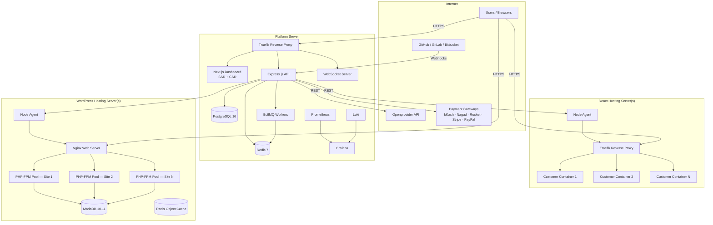
```mermaid
graph TB
    subgraph Internet
        U[Users / Browsers]
        GH[GitHub / GitLab / Bitbucket]
        OP[Openprovider API]
        PG_EXT[Payment Gateways<br/>bKash · Nagad · Rocket · Stripe · PayPal]
    end

    subgraph PlatformServer["Platform Server"]
        direction TB
        TRAEFIK_P[Traefik Reverse Proxy]
        DASH[Next.js Dashboard<br/>SSR + CSR]
        API[Express.js API]
        WS[WebSocket Server]
        PG[(PostgreSQL 16)]
        RD[(Redis 7)]
        BQ[BullMQ Workers]
        PROM[Prometheus]
        GRAF[Grafana]
        LOKI[Loki]
    end

    subgraph ReactNode["React Hosting Server(s)"]
        direction TB
        TRAEFIK_R[Traefik Reverse Proxy]
        AGENT_R[Node Agent]
        C1[Customer Container 1]
        C2[Customer Container 2]
        CN[Customer Container N]
    end

    subgraph WPNode["WordPress Hosting Server(s)"]
        direction TB
        NGINX_W[Nginx Web Server]
        AGENT_W[Node Agent]
        PHP1[PHP-FPM Pool — Site 1]
        PHP2[PHP-FPM Pool — Site 2]
        PHPN[PHP-FPM Pool — Site N]
        MDB[(MariaDB 10.11)]
        RD_W[(Redis Object Cache)]
    end

    U -->|HTTPS| TRAEFIK_P
    TRAEFIK_P --> DASH
    TRAEFIK_P --> API
    TRAEFIK_P --> WS
    API --> PG
    API --> RD
    API --> BQ
    BQ --> RD
    API --> AGENT_R
    API --> AGENT_W
    AGENT_R --> TRAEFIK_R
    TRAEFIK_R --> C1
    TRAEFIK_R --> C2
    TRAEFIK_R --> CN
    GH -->|Webhooks| API
    API -->|REST| OP
    API -->|REST| PG_EXT
    PROM --> GRAF
    LOKI --> GRAF
    AGENT_W --> NGINX_W
    NGINX_W --> PHP1
    NGINX_W --> PHP2
    NGINX_W --> PHPN
    PHP1 --> MDB
    PHP2 --> MDB
    PHPN --> MDB
    U -->|HTTPS| TRAEFIK_R
    U -->|HTTPS| NGINX_W
```

### 1.2 Design Principles

| Principle                | Description |
|--------------------------|-------------|
| **Service Isolation**    | Each logical service owns its data and exposes a well-defined API. No shared mutable state between services. |
| **Async-First**          | Long-running operations (builds, deployments, domain registration) are processed via BullMQ queues. The API returns immediately with a job ID. |
| **Horizontal Scalability** | Hosting nodes are stateless workers. Adding a new VPS node requires only registration with the Platform API. |
| **Observability**        | Every service emits structured logs (Loki), metrics (Prometheus), and traces. Grafana provides unified dashboards. |
| **Security by Default**  | JWT + refresh tokens, RBAC, container isolation, encrypted secrets, and TLS everywhere. |

---

## 2. Service Decomposition

### 2.1 Platform API Service

**Runtime:** Express.js on Node.js 20 LTS  
**Protocol:** REST (JSON) + WebSocket  
**Port:** 4000 (internal)

#### Responsibilities

| Responsibility              | Description |
|-----------------------------|-------------|
| Authentication & Authorization | JWT issuance, refresh tokens, RBAC enforcement |
| Route Handling              | RESTful endpoints for all platform resources |
| Input Validation            | Zod schemas on every request body and query param |
| Rate Limiting               | Token-bucket per user, per IP, per API key |
| Request Logging             | Structured JSON logs shipped to Loki |
| Error Handling              | Centralised error middleware with error codes |
| WebSocket Management        | Real-time deployment logs, notifications |

#### Middleware Chain

```
Request
  → CORS
  → Helmet (security headers)
  → Rate Limiter (express-rate-limit + Redis store)
  → Body Parser (JSON, max 10 MB)
  → Request Logger (pino)
  → Auth Middleware (JWT verification)
  → RBAC Middleware (role/permission check)
  → Validation Middleware (Zod schema)
  → Route Handler
  → Error Handler
  → Response
```

#### Route Structure

| Route Prefix         | Module               | Auth Required |
|----------------------|----------------------|---------------|
| `/api/v1/auth`       | Authentication       | Partial       |
| `/api/v1/users`      | User Management      | Yes           |
| `/api/v1/projects`   | Project Management   | Yes           |
| `/api/v1/deployments`| Deployment Engine    | Yes           |
| `/api/v1/domains`    | Domain Service       | Yes           |
| `/api/v1/dns`        | DNS Management       | Yes           |
| `/api/v1/billing`    | Billing & Payments   | Yes           |
| `/api/v1/wordpress`  | WordPress Management | Yes           |
| `/api/v1/servers`    | Server/Node Admin    | Admin         |
| `/api/v1/notifications` | Notifications     | Yes           |
| `/api/v1/support`    | Support Tickets      | Yes           |
| `/api/v1/admin`      | Admin Operations     | Admin         |

#### Dependencies

| Dependency  | Purpose |
|-------------|---------|
| PostgreSQL  | Primary data store |
| Redis       | Sessions, caching, rate-limit counters, BullMQ backing |
| BullMQ      | Async job dispatch |
| Openprovider | Domain registration API |
| Payment SDKs | bKash, Nagad, Rocket, Stripe, PayPal |

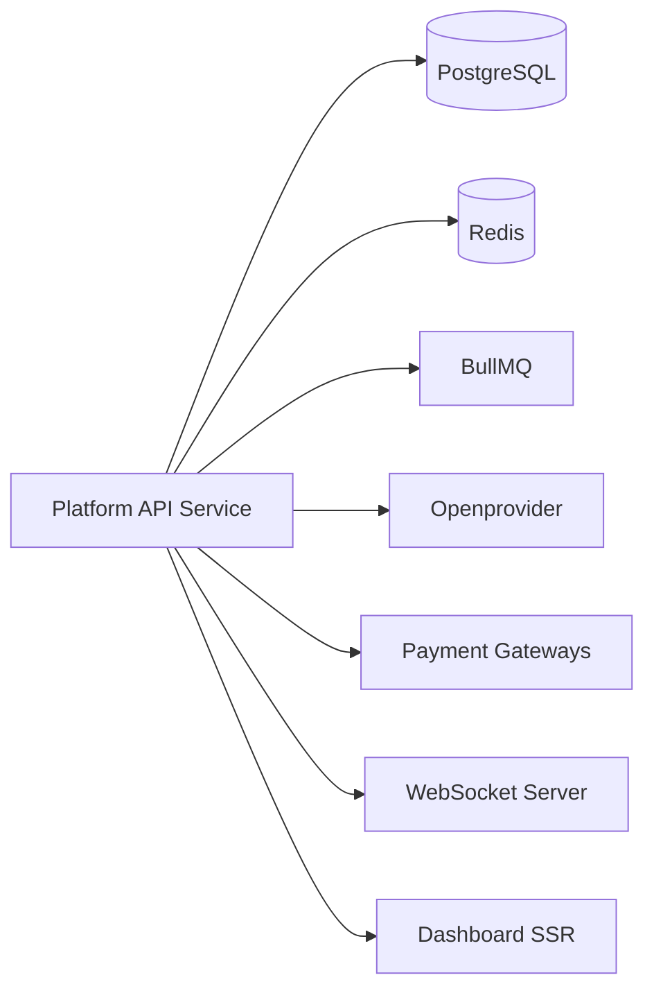
```mermaid
graph LR
    API[Platform API Service]
    API --> PG[(PostgreSQL)]
    API --> RD[(Redis)]
    API --> BQ[BullMQ]
    API --> OP[Openprovider]
    API --> PAY[Payment Gateways]
    API --> WS[WebSocket Server]
    API --> DASH[Dashboard SSR]
```

---

### 2.2 Dashboard Service

**Runtime:** Next.js 14+ (App Router)  
**Rendering:** SSR for initial load, CSR for interactivity  
**Port:** 3000 (internal)

#### Responsibilities

| Responsibility          | Description |
|-------------------------|-------------|
| Server-Side Rendering   | SEO-friendly initial page loads |
| Client-Side Interactivity | React state management (Zustand) |
| Real-Time Updates       | WebSocket connection for live deployment logs, notifications |
| Theme Support           | Dark mode / light mode with system preference detection |
| Responsive Design       | Mobile-first, optimised for all breakpoints |

#### Page Structure

| Page Group       | Pages |
|------------------|-------|
| **Auth**         | Login, Register, Forgot Password, Reset Password, 2FA Setup |
| **Dashboard**    | Overview, Usage Analytics, Quick Actions |
| **Projects**     | List, Create, Detail, Settings |
| **Deployments**  | List, Detail, Logs (live stream), Rollback |
| **Domains**      | List, Register, Transfer, DNS Records, WHOIS |
| **WordPress**    | List, Create, Detail, File Manager, DB Manager, Staging |
| **Billing**      | Subscriptions, Invoices, Payment Methods, Usage |
| **Support**      | Tickets, Knowledge Base |
| **Settings**     | Profile, Security, API Keys, Teams, Organisations |
| **Admin**        | Customers, Servers, Monitoring, Audit Logs, System Config |

#### Real-Time Architecture

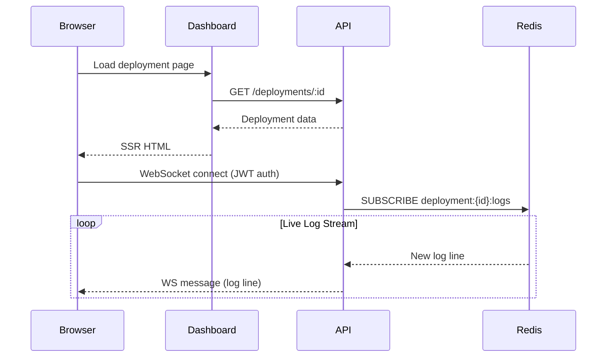
```mermaid
sequenceDiagram
    participant Browser
    participant Dashboard
    participant API
    participant Redis

    Browser->>Dashboard: Load deployment page
    Dashboard->>API: GET /deployments/:id
    API-->>Dashboard: Deployment data
    Dashboard-->>Browser: SSR HTML
    Browser->>API: WebSocket connect (JWT auth)
    API->>Redis: SUBSCRIBE deployment:{id}:logs
    loop Live Log Stream
        Redis-->>API: New log line
        API-->>Browser: WS message (log line)
    end
```

---

### 2.3 Deployment Engine Service

**Runtime:** BullMQ workers on Node.js  
**Queue:** `deployment-queue`

The Deployment Engine is the core differentiator. It handles the full lifecycle from source code to running container.

#### Responsibilities

| Responsibility          | Description |
|-------------------------|-------------|
| Source Acquisition       | Git clone (GitHub, GitLab, Bitbucket) or ZIP upload extraction |
| Framework Detection      | Auto-detect React, Next.js, Vue, Angular, Svelte, Astro, Vite, static HTML |
| Build Execution          | Install dependencies, run build command inside Docker build container |
| Docker Image Creation    | Generate optimised multi-stage Dockerfile, build image |
| Container Orchestration  | Start container on target hosting node with resource limits |
| Traefik Routing          | Configure dynamic routing labels for the new deployment |
| SSL Provisioning         | Trigger Let's Encrypt certificate generation via Traefik |
| Health Checking          | Verify container is healthy before marking deployment as live |
| Rollback                 | Revert to previous deployment (keep last N images) |
| Log Streaming            | Stream build + runtime logs to Redis pub/sub → WebSocket |

#### Deployment Pipeline

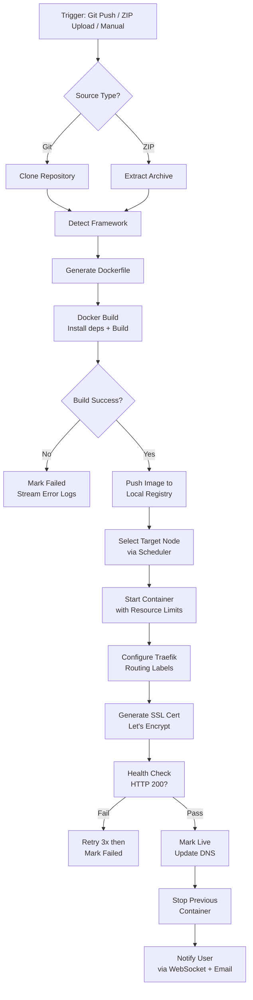
```mermaid
graph TD
    A[Trigger: Git Push / ZIP Upload / Manual] --> B{Source Type?}
    B -->|Git| C[Clone Repository]
    B -->|ZIP| D[Extract Archive]
    C --> E[Detect Framework]
    D --> E
    E --> F[Generate Dockerfile]
    F --> G[Docker Build<br/>Install deps + Build]
    G --> H{Build Success?}
    H -->|No| I[Mark Failed<br/>Stream Error Logs]
    H -->|Yes| J[Push Image to<br/>Local Registry]
    J --> K[Select Target Node<br/>via Scheduler]
    K --> L[Start Container<br/>with Resource Limits]
    L --> M[Configure Traefik<br/>Routing Labels]
    M --> N[Generate SSL Cert<br/>Let's Encrypt]
    N --> O[Health Check<br/>HTTP 200?]
    O -->|Fail| P[Retry 3x then<br/>Mark Failed]
    O -->|Pass| Q[Mark Live<br/>Update DNS]
    Q --> R[Stop Previous<br/>Container]
    R --> S[Notify User<br/>via WebSocket + Email]
```

#### Framework Detection Rules

| Framework | Detection Signal | Default Build Command | Output Directory |
|-----------|-----------------|----------------------|-----------------|
| Next.js   | `next` in dependencies | `npm run build` | `.next/` |
| React (CRA) | `react-scripts` in dependencies | `npm run build` | `build/` |
| Vite      | `vite` in dependencies | `npm run build` | `dist/` |
| Vue       | `vue` in dependencies + `vite` | `npm run build` | `dist/` |
| Angular   | `@angular/core` in dependencies | `ng build` | `dist/` |
| Svelte    | `svelte` in dependencies | `npm run build` | `build/` |
| Astro     | `astro` in dependencies | `npm run build` | `dist/` |
| Static HTML | `index.html` in root | None | `/` |

---

### 2.4 WordPress Manager Service

**Runtime:** BullMQ workers + Node agent on WordPress servers  
**Communication:** Platform API ↔ Node Agent (REST over WireGuard VPN)

#### Responsibilities

| Responsibility          | Description |
|-------------------------|-------------|
| WordPress Installation  | Automated WP-CLI install with admin credentials |
| PHP-FPM Management      | Per-site PHP-FPM pool creation and configuration |
| Database Management      | Per-site MariaDB database + user creation |
| Nginx Configuration     | Per-site virtual host generation |
| SSL Provisioning        | Let's Encrypt certificate via Certbot |
| Backup Management       | Scheduled full backups (files + DB), on-demand snapshots |
| Staging Environment     | Clone production to staging subdomain |
| Malware Scanning        | ClamAV + custom WordPress signature scanning |
| Auto-Updates            | WordPress core, theme, and plugin updates via WP-CLI |
| Performance Tuning      | Redis object cache, OPcache, Gzip compression |

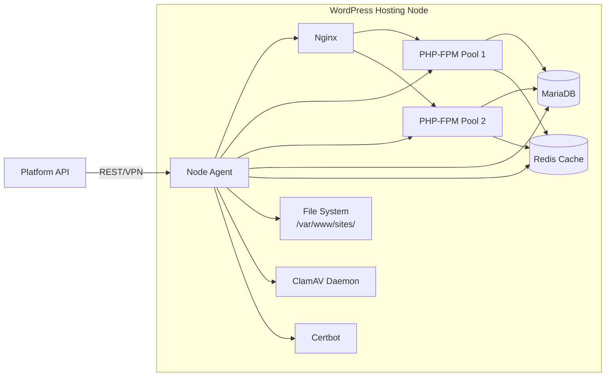
```mermaid
graph LR
    subgraph WordPressNode["WordPress Hosting Node"]
        NA[Node Agent]
        NG[Nginx]
        P1[PHP-FPM Pool 1]
        P2[PHP-FPM Pool 2]
        MDB[(MariaDB)]
        RC[(Redis Cache)]
        FS[File System<br/>/var/www/sites/]
        CLM[ClamAV Daemon]
        CERT[Certbot]
    end

    API[Platform API] -->|REST/VPN| NA
    NA --> NG
    NA --> P1
    NA --> P2
    NA --> MDB
    NA --> RC
    NA --> FS
    NA --> CLM
    NA --> CERT
    NG --> P1
    NG --> P2
    P1 --> MDB
    P2 --> MDB
    P1 --> RC
    P2 --> RC
```

---

### 2.5 Domain Service

**External API:** Openprovider REST API v1  
**Queue:** `domain-queue`

#### Responsibilities

| Responsibility          | Description |
|-------------------------|-------------|
| Availability Search     | Check domain availability across TLDs via Openprovider |
| Registration            | Register domains with WHOIS contact data |
| Transfer In             | EPP/auth-code-based domain transfer |
| Renewal                 | Auto-renewal based on subscription billing |
| DNS Management          | Create/update/delete DNS records (A, AAAA, CNAME, MX, TXT, SRV, NS) |
| Nameserver Management   | Set custom nameservers |
| WHOIS Privacy           | Enable/disable WHOIS privacy protection |
| Webhook Processing      | Handle Openprovider status change webhooks |
| Synchronisation         | Periodic sync of domain status with Openprovider |
| Caching                 | Cache availability results (TTL: 5 min), DNS records (TTL: 60 s) |

#### Domain Registration Flow

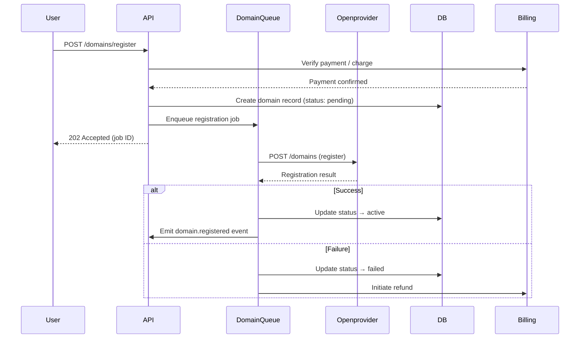
```mermaid
sequenceDiagram
    participant User
    participant API
    participant DomainQueue
    participant Openprovider
    participant DB
    participant Billing

    User->>API: POST /domains/register
    API->>Billing: Verify payment / charge
    Billing-->>API: Payment confirmed
    API->>DB: Create domain record (status: pending)
    API->>DomainQueue: Enqueue registration job
    API-->>User: 202 Accepted (job ID)
    DomainQueue->>Openprovider: POST /domains (register)
    Openprovider-->>DomainQueue: Registration result
    alt Success
        DomainQueue->>DB: Update status → active
        DomainQueue->>API: Emit domain.registered event
    else Failure
        DomainQueue->>DB: Update status → failed
        DomainQueue->>Billing: Initiate refund
    end
```

---

### 2.6 Billing Service

**Queue:** `billing-queue`  
**Payment Gateways:** bKash, Nagad, Rocket (Bangladesh MFS), Stripe, PayPal (International)

#### Responsibilities

| Responsibility          | Description |
|-------------------------|-------------|
| Subscription Management | Create, upgrade, downgrade, cancel subscriptions |
| Invoice Generation      | Automatic invoice creation on billing cycle |
| Payment Processing      | Multi-gateway payment with failover |
| Renewal Handling        | Auto-renewal with retry on failure |
| Refund Processing       | Full and partial refunds |
| Tax Calculation         | Bangladesh VAT (15%), international tax rules |
| Promo Codes & Discounts | Percentage and fixed-amount discounts |
| Dunning Management      | Payment failure email sequences before suspension |
| Revenue Reporting       | MRR, ARR, churn metrics |

#### Payment Gateway Selection

| Gateway | Region        | Type          | Use Case |
|---------|---------------|---------------|----------|
| bKash   | Bangladesh    | Mobile Money  | Primary BD payment |
| Nagad   | Bangladesh    | Mobile Money  | Secondary BD payment |
| Rocket  | Bangladesh    | Mobile Money  | Tertiary BD payment |
| Stripe  | International | Card/Bank     | Primary international |
| PayPal  | International | Wallet/Card   | Secondary international |

#### Billing Flow

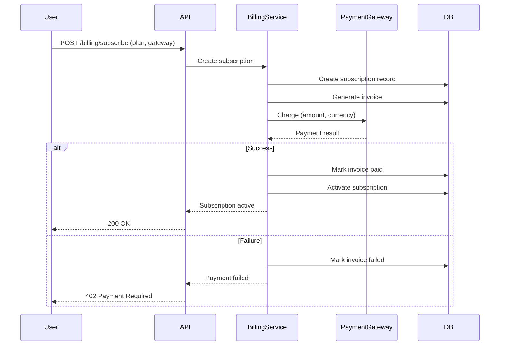
```mermaid
sequenceDiagram
    participant User
    participant API
    participant BillingService
    participant PaymentGateway
    participant DB

    User->>API: POST /billing/subscribe (plan, gateway)
    API->>BillingService: Create subscription
    BillingService->>DB: Create subscription record
    BillingService->>DB: Generate invoice
    BillingService->>PaymentGateway: Charge (amount, currency)
    PaymentGateway-->>BillingService: Payment result
    alt Success
        BillingService->>DB: Mark invoice paid
        BillingService->>DB: Activate subscription
        BillingService-->>API: Subscription active
        API-->>User: 200 OK
    else Failure
        BillingService->>DB: Mark invoice failed
        BillingService-->>API: Payment failed
        API-->>User: 402 Payment Required
    end
```

---

### 2.7 Notification Service

**Queue:** `notification-queue`  
**Channels:** Email (SMTP/Resend), SMS (Twilio/local gateway), In-App (DB + WebSocket), Push (WebSocket)

#### Responsibilities

| Responsibility          | Description |
|-------------------------|-------------|
| Email Notifications     | Transactional emails via SMTP or Resend API |
| SMS Notifications       | Critical alerts via Twilio or local BD SMS gateway |
| In-App Notifications    | Stored in DB, delivered via WebSocket |
| WebSocket Push          | Real-time events pushed to connected clients |
| Template Management     | Handlebars templates for all notification types |
| Delivery Tracking       | Track sent/delivered/failed status per notification |
| Preferences             | User-configurable notification preferences per channel |

#### Notification Types

| Event                     | Email | SMS | In-App | WebSocket |
|---------------------------|-------|-----|--------|-----------|
| Deployment Started        | ✗     | ✗   | ✓      | ✓         |
| Deployment Succeeded      | ✓     | ✗   | ✓      | ✓         |
| Deployment Failed         | ✓     | ✗   | ✓      | ✓         |
| Domain Registered         | ✓     | ✗   | ✓      | ✗         |
| Domain Expiring (30d)     | ✓     | ✓   | ✓      | ✗         |
| Invoice Generated         | ✓     | ✗   | ✓      | ✗         |
| Payment Successful        | ✓     | ✗   | ✓      | ✗         |
| Payment Failed            | ✓     | ✓   | ✓      | ✗         |
| SSL Cert Expiring (14d)   | ✓     | ✗   | ✓      | ✗         |
| Security Alert            | ✓     | ✓   | ✓      | ✓         |
| Backup Completed          | ✗     | ✗   | ✓      | ✗         |
| Server Health Alert       | ✓     | ✓   | ✓      | ✓         |

---

### 2.8 Monitoring Service

**Stack:** Prometheus (metrics) + Grafana (dashboards) + Loki (logs)

#### Responsibilities

| Responsibility          | Description |
|-------------------------|-------------|
| Metrics Collection      | Prometheus scrapes from all services and nodes |
| Log Aggregation         | Loki receives structured JSON logs from all services |
| Dashboard Provisioning  | Pre-built Grafana dashboards for platform ops |
| Alert Rules             | Prometheus alerting rules → Alertmanager → Notification Service |
| Health Monitoring       | Node health checks, container status, service availability |
| Capacity Tracking       | CPU, RAM, disk, network metrics per node |
| SLA Reporting           | Uptime, response time, error rate dashboards |

#### Alerting Rules

| Alert Name               | Condition                     | Severity | Action |
|--------------------------|-------------------------------|----------|--------|
| NodeDown                 | Node unreachable > 2 min      | Critical | Page on-call, initiate failover |
| HighCPU                  | CPU > 85% for > 5 min         | Warning  | Notify admin |
| HighMemory               | Memory > 90% for > 5 min      | Warning  | Notify admin |
| DiskSpaceLow             | Disk > 85%                    | Warning  | Notify admin |
| DiskSpaceCritical         | Disk > 95%                    | Critical | Trigger cleanup, page on-call |
| DeploymentQueueBacklog   | Queue depth > 50 for > 10 min | Warning  | Scale workers |
| APIHighLatency           | P95 > 2 s for > 5 min         | Warning  | Investigate |
| SSLCertExpiringSoon       | Cert expires < 14 days        | Warning  | Trigger renewal |
| DatabaseConnectionHigh   | Connections > 80% max          | Warning  | Scale connections |
| ContainerOOM             | Container killed by OOM        | Critical | Restart, notify user |

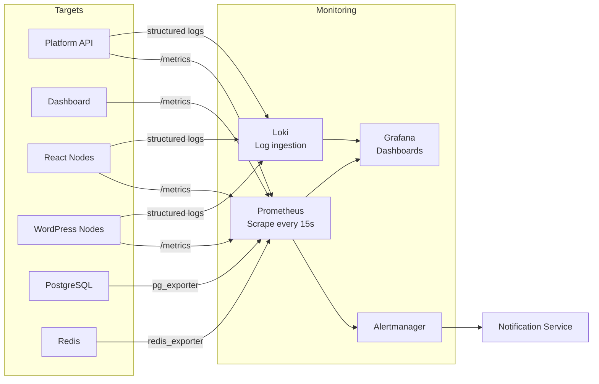
```mermaid
graph LR
    subgraph Targets
        API_M[Platform API]
        DASH_M[Dashboard]
        RN[React Nodes]
        WN[WordPress Nodes]
        PG_M[PostgreSQL]
        RD_M[Redis]
    end

    subgraph Monitoring
        PROM[Prometheus<br/>Scrape every 15s]
        LOKI[Loki<br/>Log ingestion]
        AM[Alertmanager]
        GRAF[Grafana<br/>Dashboards]
    end

    NS[Notification Service]

    API_M -->|/metrics| PROM
    DASH_M -->|/metrics| PROM
    RN -->|/metrics| PROM
    WN -->|/metrics| PROM
    PG_M -->|pg_exporter| PROM
    RD_M -->|redis_exporter| PROM
    PROM --> AM
    AM --> NS
    PROM --> GRAF
    LOKI --> GRAF
    API_M -->|structured logs| LOKI
    RN -->|structured logs| LOKI
    WN -->|structured logs| LOKI
```

---

## 3. Communication Patterns

### 3.1 Synchronous — REST API

All client-facing operations use REST/JSON over HTTPS. The API follows standard REST conventions.

| Method | Convention | Example |
|--------|-----------|---------|
| `GET`    | List / Read   | `GET /api/v1/projects` |
| `POST`   | Create        | `POST /api/v1/projects` |
| `PUT`    | Full Update   | `PUT /api/v1/projects/:id` |
| `PATCH`  | Partial Update | `PATCH /api/v1/projects/:id` |
| `DELETE` | Soft Delete   | `DELETE /api/v1/projects/:id` |

**Response Envelope:**

```json
{
  "success": true,
  "data": { ... },
  "meta": {
    "page": 1,
    "perPage": 20,
    "total": 142,
    "totalPages": 8
  },
  "requestId": "req_abc123"
}
```

### 3.2 Real-Time — WebSocket

WebSocket connections are authenticated via JWT sent in the first message after connection. Used for:

- **Deployment log streaming** — build output lines in real-time
- **Notification push** — instant in-app notifications
- **Server status updates** — live node health changes

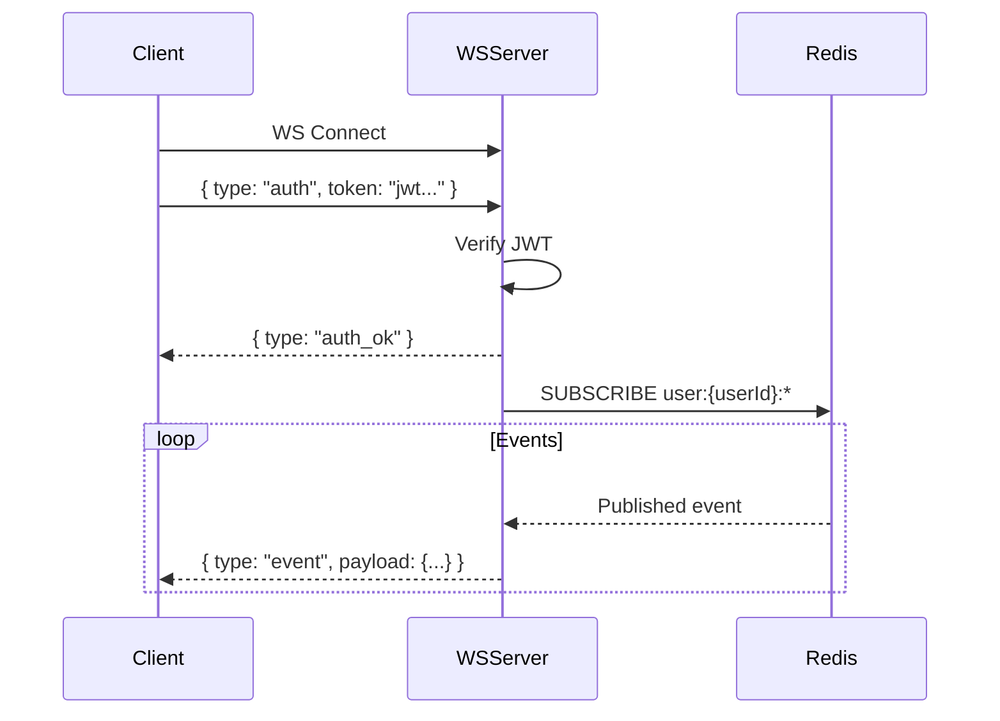
```mermaid
sequenceDiagram
    participant Client
    participant WSServer
    participant Redis

    Client->>WSServer: WS Connect
    Client->>WSServer: { type: "auth", token: "jwt..." }
    WSServer->>WSServer: Verify JWT
    WSServer-->>Client: { type: "auth_ok" }
    WSServer->>Redis: SUBSCRIBE user:{userId}:*
    loop Events
        Redis-->>WSServer: Published event
        WSServer-->>Client: { type: "event", payload: {...} }
    end
```

### 3.3 Asynchronous — BullMQ

All long-running operations are dispatched as BullMQ jobs. The API creates the job and returns a job ID immediately (HTTP 202 Accepted). Clients poll or subscribe via WebSocket for status updates.

**Rationale for BullMQ over alternatives:**
- Redis-backed — no additional infrastructure (we already run Redis)
- Priority queues — paid tier customers get higher priority
- Delayed jobs — schedule future operations (renewal reminders)
- Retry with backoff — automatic retry for transient failures
- Dead letter queues — capture permanently failed jobs for investigation
- Rate limiting — prevent overloading external APIs (Openprovider)
- Dashboard — Bull Board for queue monitoring

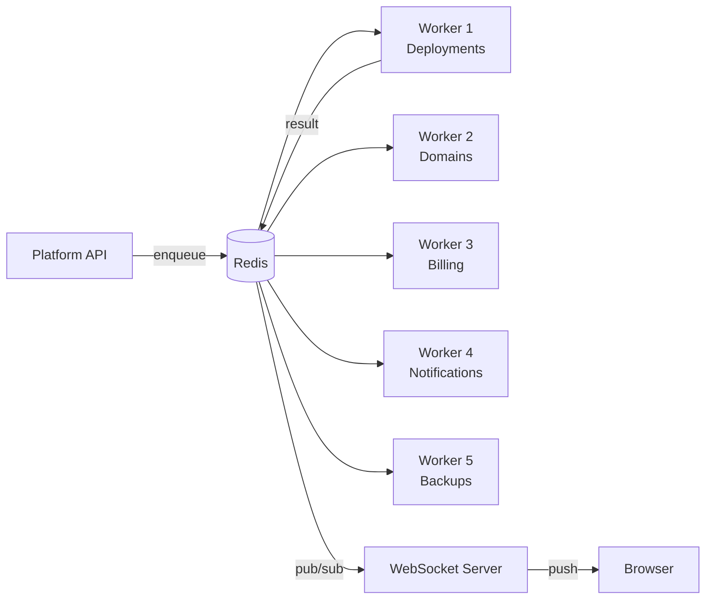
```mermaid
graph LR
    API[Platform API] -->|enqueue| REDIS[(Redis)]
    REDIS --> W1[Worker 1<br/>Deployments]
    REDIS --> W2[Worker 2<br/>Domains]
    REDIS --> W3[Worker 3<br/>Billing]
    REDIS --> W4[Worker 4<br/>Notifications]
    REDIS --> W5[Worker 5<br/>Backups]
    W1 -->|result| REDIS
    REDIS -->|pub/sub| WS[WebSocket Server]
    WS -->|push| CLIENT[Browser]
```

---

## 4. Data Flow Diagrams

### 4.1 React App Deployment (Git Push to Live)

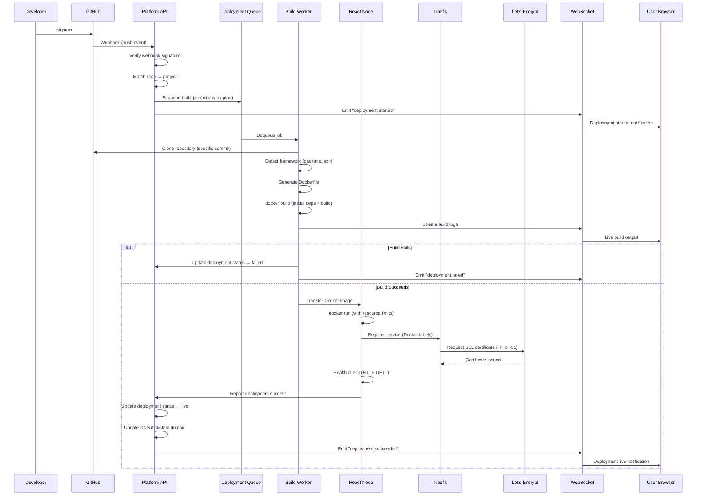
```mermaid
sequenceDiagram
    participant Dev as Developer
    participant GH as GitHub
    participant API as Platform API
    participant Q as Deployment Queue
    participant W as Build Worker
    participant Node as React Node
    participant TRF as Traefik
    participant LE as Let's Encrypt
    participant WS as WebSocket
    participant User as User Browser

    Dev->>GH: git push
    GH->>API: Webhook (push event)
    API->>API: Verify webhook signature
    API->>API: Match repo → project
    API->>Q: Enqueue build job (priority by plan)
    API->>WS: Emit "deployment.started"
    WS->>User: Deployment started notification

    Q->>W: Dequeue job
    W->>GH: Clone repository (specific commit)
    W->>W: Detect framework (package.json)
    W->>W: Generate Dockerfile
    W->>W: docker build (install deps + build)
    W->>WS: Stream build logs
    WS->>User: Live build output

    alt Build Fails
        W->>API: Update deployment status → failed
        W->>WS: Emit "deployment.failed"
    else Build Succeeds
        W->>Node: Transfer Docker image
        Node->>Node: docker run (with resource limits)
        Node->>TRF: Register service (Docker labels)
        TRF->>LE: Request SSL certificate (HTTP-01)
        LE-->>TRF: Certificate issued
        Node->>Node: Health check (HTTP GET /)
        Node->>API: Report deployment success
        API->>API: Update deployment status → live
        API->>API: Update DNS if custom domain
        API->>WS: Emit "deployment.succeeded"
        WS->>User: Deployment live notification
    end
```

### 4.2 WordPress Site Creation

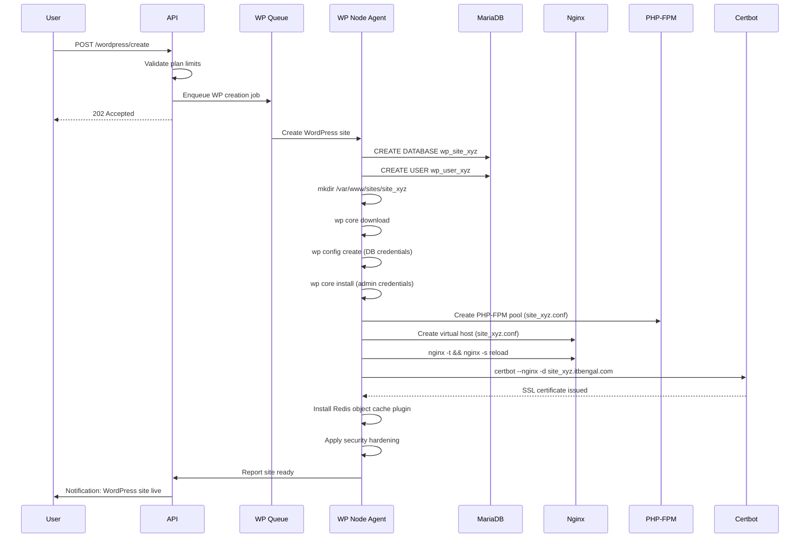
```mermaid
sequenceDiagram
    participant User
    participant API
    participant Q as WP Queue
    participant Agent as WP Node Agent
    participant MariaDB
    participant Nginx
    participant PHP as PHP-FPM
    participant Certbot

    User->>API: POST /wordpress/create
    API->>API: Validate plan limits
    API->>Q: Enqueue WP creation job
    API-->>User: 202 Accepted

    Q->>Agent: Create WordPress site
    Agent->>MariaDB: CREATE DATABASE wp_site_xyz
    Agent->>MariaDB: CREATE USER wp_user_xyz
    Agent->>Agent: mkdir /var/www/sites/site_xyz
    Agent->>Agent: wp core download
    Agent->>Agent: wp config create (DB credentials)
    Agent->>Agent: wp core install (admin credentials)
    Agent->>PHP: Create PHP-FPM pool (site_xyz.conf)
    Agent->>Nginx: Create virtual host (site_xyz.conf)
    Agent->>Nginx: nginx -t && nginx -s reload
    Agent->>Certbot: certbot --nginx -d site_xyz.itbengal.com
    Certbot-->>Agent: SSL certificate issued
    Agent->>Agent: Install Redis object cache plugin
    Agent->>Agent: Apply security hardening
    Agent->>API: Report site ready
    API->>User: Notification: WordPress site live
```

### 4.3 Domain Registration

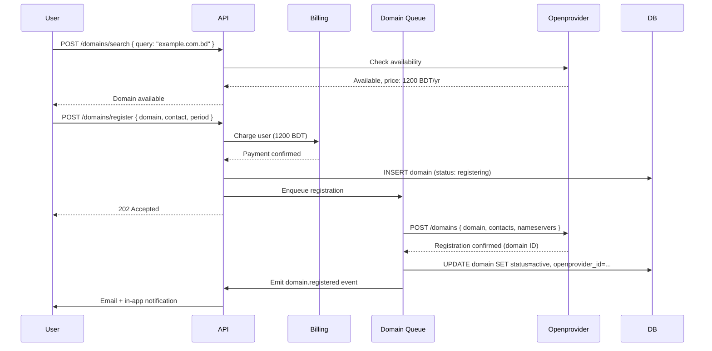
```mermaid
sequenceDiagram
    participant User
    participant API
    participant Billing
    participant Q as Domain Queue
    participant OP as Openprovider
    participant DB

    User->>API: POST /domains/search { query: "example.com.bd" }
    API->>OP: Check availability
    OP-->>API: Available, price: 1200 BDT/yr
    API-->>User: Domain available

    User->>API: POST /domains/register { domain, contact, period }
    API->>Billing: Charge user (1200 BDT)
    Billing-->>API: Payment confirmed
    API->>DB: INSERT domain (status: registering)
    API->>Q: Enqueue registration
    API-->>User: 202 Accepted

    Q->>OP: POST /domains { domain, contacts, nameservers }
    OP-->>Q: Registration confirmed (domain ID)
    Q->>DB: UPDATE domain SET status=active, openprovider_id=...
    Q->>API: Emit domain.registered event
    API->>User: Email + in-app notification
```

### 4.4 Billing / Payment Flow

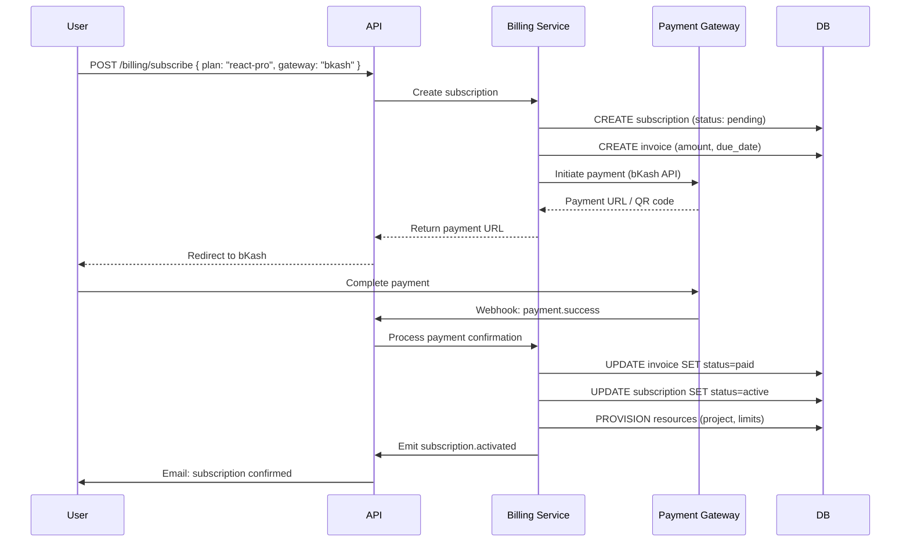
```mermaid
sequenceDiagram
    participant User
    participant API
    participant Billing as Billing Service
    participant Gateway as Payment Gateway
    participant DB

    User->>API: POST /billing/subscribe { plan: "react-pro", gateway: "bkash" }
    API->>Billing: Create subscription
    Billing->>DB: CREATE subscription (status: pending)
    Billing->>DB: CREATE invoice (amount, due_date)
    Billing->>Gateway: Initiate payment (bKash API)
    Gateway-->>Billing: Payment URL / QR code
    Billing-->>API: Return payment URL
    API-->>User: Redirect to bKash

    User->>Gateway: Complete payment
    Gateway->>API: Webhook: payment.success
    API->>Billing: Process payment confirmation
    Billing->>DB: UPDATE invoice SET status=paid
    Billing->>DB: UPDATE subscription SET status=active
    Billing->>DB: PROVISION resources (project, limits)
    Billing->>API: Emit subscription.activated
    API->>User: Email: subscription confirmed
```

### 4.5 SSL Certificate Generation

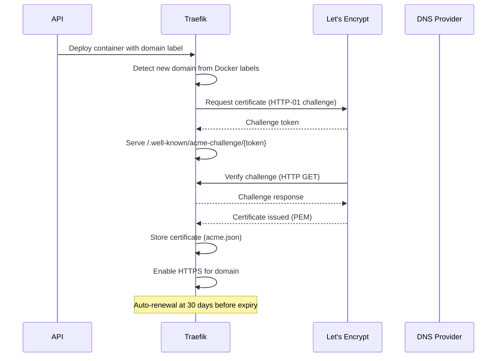
```mermaid
sequenceDiagram
    participant API
    participant TRF as Traefik
    participant LE as Let's Encrypt
    participant DNS as DNS Provider

    API->>TRF: Deploy container with domain label
    TRF->>TRF: Detect new domain from Docker labels
    TRF->>LE: Request certificate (HTTP-01 challenge)
    LE-->>TRF: Challenge token
    TRF->>TRF: Serve /.well-known/acme-challenge/{token}
    LE->>TRF: Verify challenge (HTTP GET)
    TRF-->>LE: Challenge response
    LE-->>TRF: Certificate issued (PEM)
    TRF->>TRF: Store certificate (acme.json)
    TRF->>TRF: Enable HTTPS for domain
    Note over TRF: Auto-renewal at 30 days before expiry
```

---

## 5. Technology Decisions

| Technology | Purpose | Alternatives Considered | Rationale |
|-----------|---------|------------------------|-----------|
| **Next.js 14+** | Dashboard frontend | Remix, SvelteKit, plain React | SSR for SEO, App Router for modern patterns, massive ecosystem, TypeScript-first |
| **Express.js** | API framework | Fastify, NestJS, Hapi | Simplest and most battle-tested Node.js framework; large middleware ecosystem; team familiarity |
| **PostgreSQL 16** | Primary database | MySQL, MongoDB, CockroachDB | ACID compliance, advanced JSON support, CTEs, full-text search, excellent extension ecosystem (pgvector future), proven at scale |
| **Redis 7** | Cache, sessions, queues | Memcached, KeyDB, Valkey | Multi-purpose (cache + pub/sub + BullMQ backing store), data structures, Sentinel for HA, Cluster for scaling |
| **Docker** | Containerisation | Podman, LXC | Industry standard, excellent ecosystem, Docker Compose for orchestration, Docker labels for Traefik integration |
| **Traefik v3** | Reverse proxy + LB | Nginx, HAProxy, Caddy | Native Docker integration (auto-discovery via labels), automatic Let's Encrypt, dynamic configuration without restarts, built-in dashboard |
| **Nginx** | WordPress web server | Apache, Caddy, LiteSpeed | Best performance for PHP-FPM, proven WordPress stack, fine-grained configuration |
| **BullMQ** | Job queue | RabbitMQ, Kafka, Bee-Queue | Redis-backed (no extra infrastructure), excellent Node.js integration, priorities, delays, rate limiting, retries, dead-letter queues |
| **Prometheus** | Metrics collection | InfluxDB, Datadog, VictoriaMetrics | Pull-based (works behind firewalls), excellent query language (PromQL), massive exporter ecosystem, open-source |
| **Grafana** | Dashboards & visualisation | Kibana, Chronograf | Multi-datasource (Prometheus + Loki), beautiful dashboards, alerting, open-source |
| **Loki** | Log aggregation | ELK Stack, Fluentd + ES | Designed for Grafana, label-based indexing (low storage cost), simple deployment, works like Prometheus for logs |
| **Let's Encrypt** | SSL certificates | ZeroSSL, Buypass, commercial CA | Free, automated, industry standard, 90-day certs with auto-renewal via Traefik |
| **WireGuard** | VPN (inter-server) | OpenVPN, IPSec, Tailscale | Fastest VPN protocol, minimal overhead, simple configuration, kernel-level performance |
| **TypeScript** | Language (full-stack) | JavaScript, Go, Rust | Type safety, better DX, shared types between frontend and backend, excellent tooling |
| **Tailwind CSS** | Dashboard styling | Bootstrap, Material UI, Chakra UI | Utility-first (rapid prototyping), design consistency, purging unused CSS, excellent DX with VS Code |
| **Openprovider** | Domain registrar API | Namecheap, GoDaddy Reseller, ResellerClub | Competitive pricing, good API documentation, bulk pricing for resellers, supports .com.bd and BD TLDs |

---

## 6. Service Boundaries & Responsibilities

### Ownership Matrix

| Resource / Concern       | Owner Service         | Collaborators |
|--------------------------|-----------------------|---------------|
| User accounts            | Platform API          | Dashboard |
| Authentication / JWT     | Platform API          | All services |
| Projects                 | Platform API          | Deployment Engine |
| React deployments        | Deployment Engine     | React Node Agent, Traefik |
| WordPress sites          | WordPress Manager     | WP Node Agent, Nginx |
| Domain registration      | Domain Service        | Openprovider, Billing |
| DNS records              | Domain Service        | Openprovider |
| Subscriptions            | Billing Service       | Payment Gateways |
| Invoices & payments      | Billing Service       | Payment Gateways |
| Email notifications      | Notification Service  | SMTP provider |
| In-app notifications     | Notification Service  | WebSocket Server |
| Metrics & alerts         | Monitoring Service    | Prometheus, Alertmanager |
| Logs                     | Monitoring Service    | Loki |
| SSL certificates         | Traefik (React) / Certbot (WP) | Let's Encrypt |
| Container orchestration  | Deployment Engine     | Docker, React Node Agent |
| Backup scheduling        | Backup Worker         | Node Agents |

### Boundary Rules

1. **No direct database access across service boundaries.** Services communicate via API calls or BullMQ jobs.
2. **Each service owns its database tables.** Cross-service queries go through the owning service's API.
3. **Events are the primary mechanism for cross-service side effects.** When a deployment succeeds, the Deployment Engine emits an event; the Notification Service reacts to it.
4. **Shared data is accessed through Redis cache.** Session data, deployment status, and feature flags live in Redis and are accessible to all services.

---

## 7. Inter-Service Communication

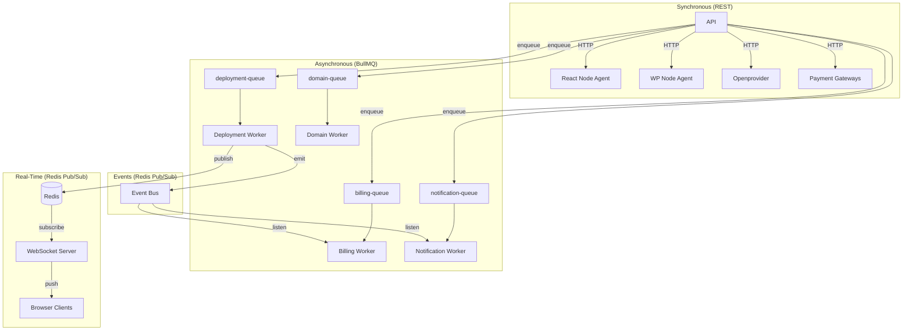
```mermaid
graph TB
    subgraph Synchronous["Synchronous (REST)"]
        API -->|HTTP| NodeAgent_R[React Node Agent]
        API -->|HTTP| NodeAgent_W[WP Node Agent]
        API -->|HTTP| Openprovider
        API -->|HTTP| PaymentGW[Payment Gateways]
    end

    subgraph Async["Asynchronous (BullMQ)"]
        API -->|enqueue| DQ[deployment-queue]
        API -->|enqueue| DMQ[domain-queue]
        API -->|enqueue| BQ[billing-queue]
        API -->|enqueue| NQ[notification-queue]
        DQ --> DW[Deployment Worker]
        DMQ --> DomW[Domain Worker]
        BQ --> BilW[Billing Worker]
        NQ --> NotW[Notification Worker]
    end

    subgraph PubSub["Real-Time (Redis Pub/Sub)"]
        DW -->|publish| Redis[(Redis)]
        Redis -->|subscribe| WSS[WebSocket Server]
        WSS -->|push| Clients[Browser Clients]
    end

    subgraph Events["Events (Redis Pub/Sub)"]
        DW -->|emit| EventBus[Event Bus]
        EventBus -->|listen| NotW
        EventBus -->|listen| BilW
    end
```

### Communication Protocol Matrix

| From → To               | Protocol          | Purpose |
|--------------------------|-------------------|---------|
| Dashboard → API          | REST/HTTPS        | All CRUD operations |
| Dashboard → API          | WebSocket/WSS     | Real-time updates |
| API → Node Agent (React) | REST/HTTP (VPN)  | Deploy, health check, logs |
| API → Node Agent (WP)   | REST/HTTP (VPN)   | Install, backup, configure |
| API → Openprovider       | REST/HTTPS        | Domain operations |
| API → Payment Gateway    | REST/HTTPS        | Payment operations |
| API → BullMQ             | Redis protocol     | Job dispatch |
| BullMQ → Workers         | Redis protocol     | Job consumption |
| Workers → Redis          | Redis pub/sub      | Status updates, log streaming |
| Redis → WebSocket Server | Redis pub/sub      | Event forwarding |
| Prometheus → Services    | HTTP (pull)        | Metrics scraping |
| Services → Loki          | HTTP (push)        | Log shipping |

---

## 8. Caching Strategy

### 8.1 Redis Cache Architecture

All caching uses Redis 7 with logical databases or key prefixes for namespace isolation.

| Cache Layer              | Key Pattern                      | TTL      | Invalidation Strategy |
|--------------------------|----------------------------------|----------|-----------------------|
| **Session Store**        | `session:{sessionId}`            | 24 hours | Explicit on logout / password change |
| **API Response Cache**   | `cache:api:{method}:{path}:{hash}` | 60 s  | Cache-aside; invalidate on write |
| **User Profile Cache**   | `cache:user:{userId}`            | 5 min    | Invalidate on profile update |
| **Plan/Pricing Cache**   | `cache:plans:{region}`           | 1 hour   | Invalidate on admin pricing change |
| **DNS Record Cache**     | `cache:dns:{domainId}`           | 60 s     | Invalidate on DNS record change |
| **Domain Availability**  | `cache:domain:avail:{domain}`    | 5 min    | TTL expiry only (external data) |
| **Deployment Status**    | `deploy:status:{deploymentId}`   | 30 min   | Update on status change, TTL fallback |
| **Node Health**          | `node:health:{nodeId}`           | 30 s     | Updated by heartbeat |
| **Rate Limit Counters**  | `ratelimit:{ip}:{window}`        | Window size | Sliding window expiry |
| **Feature Flags**        | `flags:{flagName}`               | 5 min    | Invalidate on admin change |

### 8.2 Cache-Aside Pattern

```
Client Request → API
  → Check Redis cache (GET key)
    → Cache HIT → Return cached data
    → Cache MISS → Query PostgreSQL
      → Store in Redis (SET key value EX ttl)
      → Return data
```

### 8.3 Write-Through Invalidation

When data is modified:

1. Write to PostgreSQL (source of truth)
2. Delete the corresponding Redis key (invalidation)
3. Next read will populate the cache (lazy loading)

**Rationale:** Write-through invalidation (delete on write, repopulate on next read) is simpler than write-through caching (write to cache and DB simultaneously) and avoids cache-DB inconsistency windows.

### 8.4 Redis Memory Policy

```
maxmemory 512mb
maxmemory-policy allkeys-lru
```

**Rationale:** `allkeys-lru` ensures that when memory is full, the least recently used key is evicted. This is safe because Redis is a cache, and the source of truth is PostgreSQL.

---

## 9. Background Job Architecture

### 9.1 Queue Definitions

| Queue Name            | Purpose                                   | Concurrency | Priority Levels | Max Retries | Backoff      |
|-----------------------|-------------------------------------------|-------------|-----------------|-------------|--------------|
| `deployment-queue`    | React/static app builds & deployments     | 3           | 3 (Enterprise, Pro, Free) | 3 | Exponential (30s, 60s, 120s) |
| `domain-queue`        | Domain registration, transfer, renewal     | 2           | 2 (Paid, Free)  | 5           | Exponential (60s base) |
| `billing-queue`       | Invoice generation, payment processing     | 2           | 1               | 5           | Exponential (30s base) |
| `backup-queue`        | Scheduled & on-demand backups             | 2           | 2               | 3           | Fixed (300s)  |
| `notification-queue`  | Email, SMS, push notifications            | 5           | 2 (Critical, Normal) | 3    | Exponential (10s base) |
| `monitoring-queue`    | Health checks, metrics aggregation        | 3           | 1               | 2           | Fixed (30s)   |
| `cleanup-queue`       | Expired sessions, old deployments, logs   | 1           | 1               | 2           | Fixed (60s)   |
| `wordpress-queue`     | WP installation, staging, cloning         | 2           | 2               | 3           | Exponential (60s base) |

### 9.2 Dead Letter Queue (DLQ)

Every queue has a corresponding DLQ: `{queueName}-dlq`. Jobs moved to DLQ after exhausting all retries.

**DLQ Processing:**
1. Admin dashboard displays DLQ jobs
2. Jobs can be manually retried or discarded
3. DLQ alert fires when DLQ depth > 10 (configurable)
4. Stale DLQ jobs auto-purged after 30 days

### 9.3 Job Priority

```
Priority 1 (Highest): Enterprise tier customers
Priority 2 (Medium):  Professional / Business tier
Priority 3 (Lowest):  Starter / Free tier

Within each priority level, jobs are FIFO.
```

### 9.4 Queue Architecture Diagram

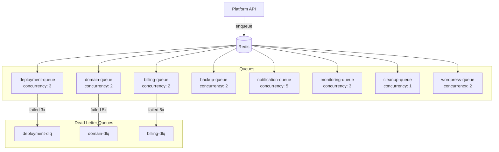
```mermaid
graph TB
    API[Platform API] -->|enqueue| Redis[(Redis)]

    subgraph Queues
        DQ[deployment-queue<br/>concurrency: 3]
        DMQ[domain-queue<br/>concurrency: 2]
        BQ[billing-queue<br/>concurrency: 2]
        BAQ[backup-queue<br/>concurrency: 2]
        NQ[notification-queue<br/>concurrency: 5]
        MQ[monitoring-queue<br/>concurrency: 3]
        CQ[cleanup-queue<br/>concurrency: 1]
        WPQ[wordpress-queue<br/>concurrency: 2]
    end

    subgraph DLQs["Dead Letter Queues"]
        DQ_DLQ[deployment-dlq]
        DMQ_DLQ[domain-dlq]
        BQ_DLQ[billing-dlq]
    end

    Redis --> DQ
    Redis --> DMQ
    Redis --> BQ
    Redis --> BAQ
    Redis --> NQ
    Redis --> MQ
    Redis --> CQ
    Redis --> WPQ

    DQ -->|failed 3x| DQ_DLQ
    DMQ -->|failed 5x| DMQ_DLQ
    BQ -->|failed 5x| BQ_DLQ
```

### 9.5 Scheduled (Cron) Jobs

| Job                        | Schedule        | Queue             | Description |
|----------------------------|-----------------|-------------------|-------------|
| SSL renewal check          | Every 12 hours  | monitoring-queue  | Check cert expiry, trigger renewal |
| Domain sync                | Every 6 hours   | domain-queue      | Sync domain status with Openprovider |
| Backup execution           | Daily 02:00 UTC | backup-queue      | Run scheduled backups for all sites |
| Invoice generation         | Monthly 1st     | billing-queue     | Generate invoices for active subscriptions |
| Dunning emails             | Daily 09:00 UTC | notification-queue | Send payment reminder emails |
| Cleanup old deployments    | Daily 03:00 UTC | cleanup-queue     | Remove deployments older than retention |
| Health check sweep         | Every 30 seconds | monitoring-queue  | Check all node health endpoints |
| Metrics aggregation        | Every 5 minutes | monitoring-queue  | Aggregate and store usage metrics |
| WordPress auto-updates     | Weekly Sun 03:00 | wordpress-queue  | Update WP core, themes, plugins |
| Malware scan               | Daily 04:00 UTC | wordpress-queue   | ClamAV scan all WordPress sites |

---

## 10. Event-Driven Patterns

### 10.1 Event Bus Design

The event bus uses Redis pub/sub for real-time events and BullMQ for durable event processing.

**Event Channels (Redis Pub/Sub):**

| Channel Pattern                  | Publisher            | Subscribers |
|----------------------------------|----------------------|-------------|
| `deployment:{id}:status`         | Deployment Engine    | WebSocket Server, Dashboard |
| `deployment:{id}:logs`           | Deployment Engine    | WebSocket Server |
| `user:{userId}:notifications`    | Notification Service | WebSocket Server |
| `node:{nodeId}:health`           | Node Agents          | Monitoring Service |
| `system:events`                  | All services         | Audit Logger |

### 10.2 Domain Events

| Event Name                  | Payload | Emitted By | Consumed By |
|-----------------------------|---------|------------|-------------|
| `deployment.created`        | deploymentId, projectId, userId | API | Notification |
| `deployment.build.started`  | deploymentId | Deployment Engine | WebSocket |
| `deployment.build.completed`| deploymentId, imageId | Deployment Engine | WebSocket |
| `deployment.build.failed`   | deploymentId, error | Deployment Engine | WebSocket, Notification |
| `deployment.live`           | deploymentId, url | Deployment Engine | Notification, Analytics |
| `domain.registered`         | domainId, domain | Domain Worker | Notification |
| `domain.expiring`           | domainId, expiryDate | Cron Job | Notification, Billing |
| `subscription.created`      | subscriptionId, userId, plan | Billing | Notification, Provisioning |
| `subscription.cancelled`    | subscriptionId | Billing | Notification, Deprovisioning |
| `payment.succeeded`         | paymentId, invoiceId | Billing | Notification |
| `payment.failed`            | paymentId, invoiceId | Billing | Notification, Dunning |
| `wordpress.created`         | siteId, domain | WP Manager | Notification |
| `backup.completed`          | backupId, siteId, size | Backup Worker | Notification |
| `node.registered`           | nodeId, type, capabilities | Node Agent | Scheduler |
| `node.unhealthy`            | nodeId, reason | Monitoring | Failover Manager |
| `ssl.expiring`              | certId, domain, expiryDate | Monitoring | SSL Renewal Worker |

### 10.3 Event Processing Pattern

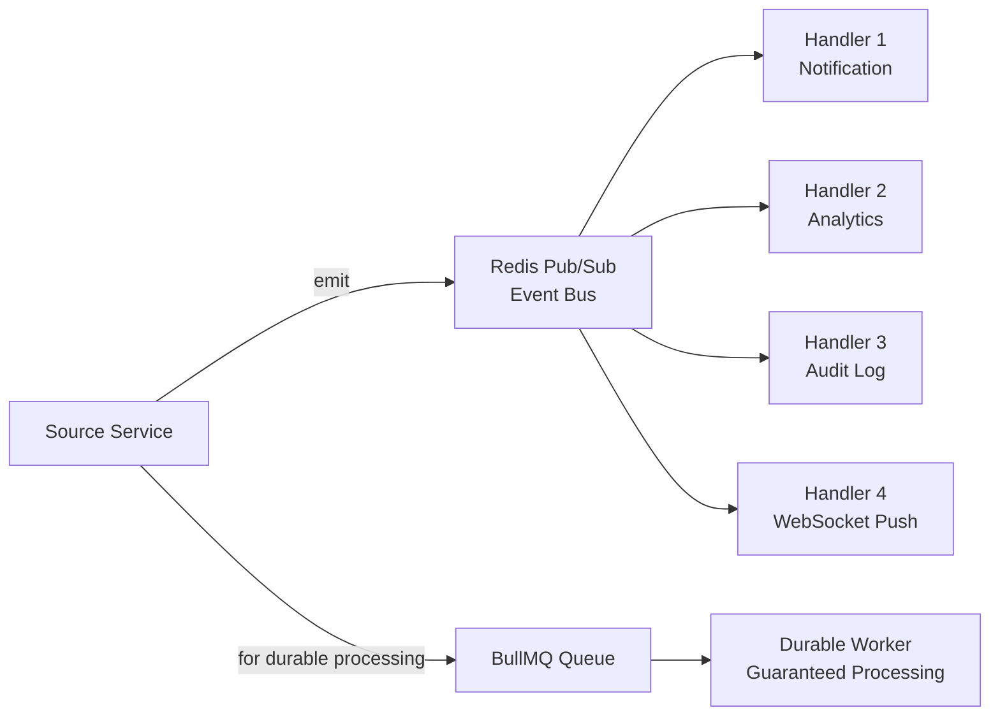
```mermaid
graph LR
    S[Source Service] -->|emit| EB[Redis Pub/Sub<br/>Event Bus]
    EB --> H1[Handler 1<br/>Notification]
    EB --> H2[Handler 2<br/>Analytics]
    EB --> H3[Handler 3<br/>Audit Log]
    EB --> H4[Handler 4<br/>WebSocket Push]

    S -->|for durable processing| BQ[BullMQ Queue]
    BQ --> DW[Durable Worker<br/>Guaranteed Processing]
```

**Design Decision:** We use Redis pub/sub for fire-and-forget real-time events (logs, status updates) and BullMQ for events that must be processed at least once (billing, domain operations). This dual approach gives us both low latency and durability.

---

## 11. Error Handling Strategy

### 11.1 Error Classification

| Category      | Examples | Retry? | Action |
|---------------|----------|--------|--------|
| **Transient** | Network timeout, DB connection reset, rate limited | Yes (exponential backoff) | Retry up to N times |
| **Permanent** | Invalid input, resource not found, auth failure | No | Return error immediately |
| **Critical**  | Disk full, OOM, DB corruption | No | Alert on-call, circuit break |

### 11.2 Error Response Format

```json
{
  "success": false,
  "error": {
    "code": "DEPLOYMENT_BUILD_FAILED",
    "message": "Build failed: npm install exited with code 1",
    "details": {
      "exitCode": 1,
      "log": "npm ERR! peer dep missing: react@^18.0.0"
    },
    "requestId": "req_abc123",
    "timestamp": "2026-07-04T10:30:00Z"
  }
}
```

### 11.3 Error Codes

| Code | HTTP Status | Description |
|------|------------|-------------|
| `AUTH_INVALID_CREDENTIALS` | 401 | Email or password incorrect |
| `AUTH_TOKEN_EXPIRED` | 401 | JWT has expired |
| `AUTH_INSUFFICIENT_PERMISSIONS` | 403 | User lacks required role/permission |
| `RESOURCE_NOT_FOUND` | 404 | Requested resource does not exist |
| `VALIDATION_FAILED` | 400 | Request body failed Zod validation |
| `RATE_LIMIT_EXCEEDED` | 429 | Too many requests |
| `PLAN_LIMIT_EXCEEDED` | 403 | User has reached plan resource limits |
| `DEPLOYMENT_BUILD_FAILED` | 500 | Build process exited with non-zero code |
| `DEPLOYMENT_HEALTH_CHECK_FAILED` | 500 | Container failed health check after deploy |
| `DOMAIN_UNAVAILABLE` | 409 | Domain is already registered |
| `DOMAIN_REGISTRATION_FAILED` | 500 | Openprovider returned an error |
| `PAYMENT_FAILED` | 402 | Payment gateway rejected the charge |
| `PAYMENT_GATEWAY_ERROR` | 502 | Payment gateway is unreachable |
| `NODE_UNAVAILABLE` | 503 | No healthy hosting node available |
| `INTERNAL_ERROR` | 500 | Unexpected server error |

### 11.4 Circuit Breaker Pattern

Used for external API calls (Openprovider, payment gateways) to prevent cascading failures.

| Parameter         | Value |
|-------------------|-------|
| Failure Threshold | 5 failures in 60 seconds |
| Open Duration     | 30 seconds |
| Half-Open Probes  | 1 request allowed |
| Success Threshold | 3 consecutive successes to close |

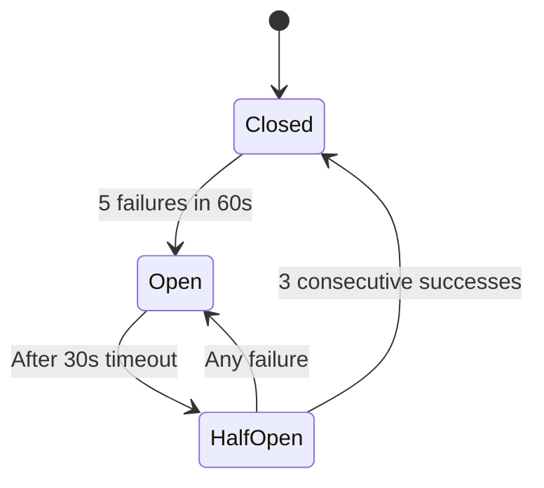
```mermaid
stateDiagram-v2
    [*] --> Closed
    Closed --> Open: 5 failures in 60s
    Open --> HalfOpen: After 30s timeout
    HalfOpen --> Closed: 3 consecutive successes
    HalfOpen --> Open: Any failure
```

### 11.5 Logging Strategy

| Level | Usage | Example |
|-------|-------|---------|
| `error` | Unrecoverable errors, exceptions | DB connection failed, OOM |
| `warn` | Recoverable issues, degradation | Retry attempt, slow query |
| `info` | Business events, state changes | Deployment created, payment received |
| `debug` | Detailed execution flow | Query executed, cache hit/miss |

**Log Format (Structured JSON):**

```json
{
  "timestamp": "2026-07-04T10:30:00.123Z",
  "level": "info",
  "service": "deployment-engine",
  "requestId": "req_abc123",
  "userId": "usr_xyz",
  "message": "Deployment build completed",
  "data": {
    "deploymentId": "dep_456",
    "duration": 45200,
    "imageSize": "142MB"
  }
}
```

---

## 12. Security Architecture

### 12.1 Authentication Flow

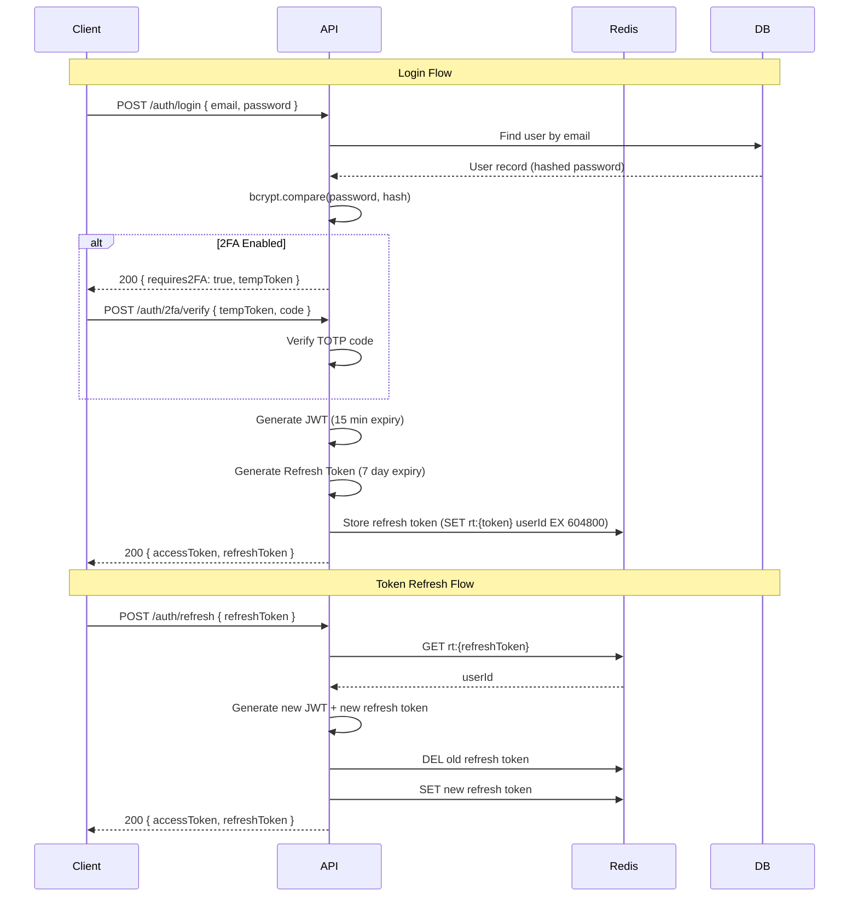
```mermaid
sequenceDiagram
    participant Client
    participant API
    participant Redis
    participant DB

    Note over Client, DB: Login Flow
    Client->>API: POST /auth/login { email, password }
    API->>DB: Find user by email
    DB-->>API: User record (hashed password)
    API->>API: bcrypt.compare(password, hash)
    alt 2FA Enabled
        API-->>Client: 200 { requires2FA: true, tempToken }
        Client->>API: POST /auth/2fa/verify { tempToken, code }
        API->>API: Verify TOTP code
    end
    API->>API: Generate JWT (15 min expiry)
    API->>API: Generate Refresh Token (7 day expiry)
    API->>Redis: Store refresh token (SET rt:{token} userId EX 604800)
    API-->>Client: 200 { accessToken, refreshToken }

    Note over Client, DB: Token Refresh Flow
    Client->>API: POST /auth/refresh { refreshToken }
    API->>Redis: GET rt:{refreshToken}
    Redis-->>API: userId
    API->>API: Generate new JWT + new refresh token
    API->>Redis: DEL old refresh token
    API->>Redis: SET new refresh token
    API-->>Client: 200 { accessToken, refreshToken }
```

### 12.2 JWT Structure

```json
{
  "header": {
    "alg": "RS256",
    "typ": "JWT"
  },
  "payload": {
    "sub": "usr_abc123",
    "email": "user@example.com",
    "role": "customer",
    "orgId": "org_xyz",
    "permissions": ["project:read", "project:write", "deployment:create"],
    "iat": 1720089000,
    "exp": 1720089900
  }
}
```

**Rationale for RS256:** Asymmetric signing allows the API to verify tokens without knowing the private key. This is important for a future microservices split where services can verify tokens independently.

### 12.3 RBAC Model

| Role              | Permissions |
|-------------------|-------------|
| **Super Admin**   | All permissions |
| **Admin**         | User management, server management, billing management, support management |
| **Customer (Owner)** | Full access to own projects, billing, domains |
| **Customer (Member)** | Read/write access to assigned projects, no billing |
| **Customer (Viewer)** | Read-only access to assigned projects |
| **Support Agent** | Read access to customer data, ticket management |

#### Permission Hierarchy

```mermaid
graph TD
    SA[Super Admin] --> A[Admin]
    A --> CO[Customer Owner]
    CO --> CM[Customer Member]
    CM --> CV[Customer Viewer]
    A --> SUP[Support Agent]

    SA -->|all:*| ALL[All Resources]
    A -->|users:*, servers:*, billing:admin| ADMIN_RES[Admin Resources]
    CO -->|projects:*, domains:*, billing:own| OWNER_RES[Own Resources]
    CM -->|projects:read, projects:write, deployments:create| MEMBER_RES[Assigned Projects]
    CV -->|projects:read, deployments:read| VIEWER_RES[Read Only]
```

### 12.4 API Key Management

- API keys are hashed (SHA-256) before storage
- Keys have configurable scopes (e.g., `deployments:create` only)
- Keys can be rotated without downtime (allow both old + new for 24 hours)
- Each key is associated with a user and organisation
- API key requests are rate-limited separately from session-based requests

### 12.5 Container Isolation (React Hosting)

| Isolation Layer     | Mechanism |
|---------------------|-----------|
| **Network**         | Each customer gets a dedicated Docker network; no inter-container communication |
| **Resources**       | CPU and memory limits via Docker `--cpus` and `--memory` |
| **Filesystem**      | Read-only root filesystem; writable `/tmp` only |
| **Process**         | PID namespace isolation; containers cannot see host processes |
| **User**            | Non-root user inside container (UID 1000) |
| **Capabilities**    | All Linux capabilities dropped; only `NET_BIND_SERVICE` if needed |
| **Seccomp**         | Default Docker seccomp profile applied |

### 12.6 Secrets Management

| Secret Type            | Storage Location | Encryption |
|------------------------|------------------|------------|
| Database credentials   | Environment variables (Docker secrets in production) | Encrypted .env, not in Git |
| API keys (Openprovider, Payment) | PostgreSQL (encrypted column) | AES-256-GCM |
| JWT signing keys       | File system (mounted volume) | File permissions (600) |
| Customer env variables | PostgreSQL (encrypted column) | AES-256-GCM |
| SSH keys (for nodes)   | File system | File permissions (600) |
| WireGuard keys         | File system | File permissions (600) |

### 12.7 Security Headers

Applied by Traefik middleware on all responses:

```
Strict-Transport-Security: max-age=31536000; includeSubDomains; preload
X-Content-Type-Options: nosniff
X-Frame-Options: DENY
X-XSS-Protection: 1; mode=block
Content-Security-Policy: default-src 'self'; script-src 'self' 'unsafe-inline';
Referrer-Policy: strict-origin-when-cross-origin
Permissions-Policy: camera=(), microphone=(), geolocation=()
```

---

## Appendix A: Service Port Map

| Service              | Internal Port | External Port | Protocol |
|----------------------|---------------|---------------|----------|
| Traefik (Platform)   | 80, 443       | 80, 443       | HTTP/S   |
| Traefik Dashboard    | 8080          | —              | HTTP     |
| Next.js Dashboard    | 3000          | —              | HTTP     |
| Express.js API       | 4000          | —              | HTTP     |
| WebSocket Server     | 4001          | —              | WS       |
| PostgreSQL           | 5432          | —              | TCP      |
| Redis                | 6379          | —              | TCP      |
| Prometheus           | 9090          | —              | HTTP     |
| Grafana              | 3001          | —              | HTTP     |
| Loki                 | 3100          | —              | HTTP     |
| Node Agent (React)   | 5000          | —              | HTTP     |
| Node Agent (WP)      | 5001          | —              | HTTP     |
| Bull Board           | 4002          | —              | HTTP     |

---

## Appendix B: Glossary

| Term | Definition |
|------|-----------|
| **Node** | A VPS server registered with the platform to host customer applications |
| **Node Agent** | A lightweight service running on each hosting node that communicates with the Platform API |
| **Deployment** | A specific version of a customer's application running in a container |
| **Project** | A logical grouping of deployments; one project per application |
| **Build** | The process of compiling source code into a runnable Docker image |
| **Rollback** | Reverting a deployment to a previous version by starting the previous container |
| **DLQ** | Dead Letter Queue — where failed jobs go after exhausting retries |
| **Circuit Breaker** | Pattern that stops calling a failing service to prevent cascading failures |
| **Heartbeat** | Periodic signal from a node to the platform to confirm it is healthy |

---

*End of Document — 06 System Architecture*
