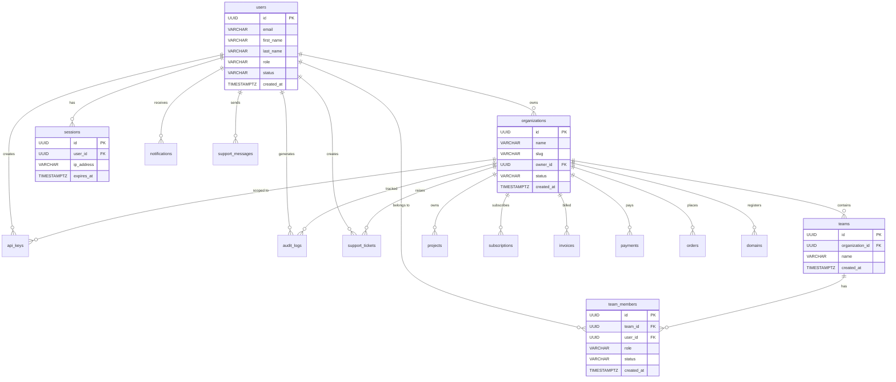
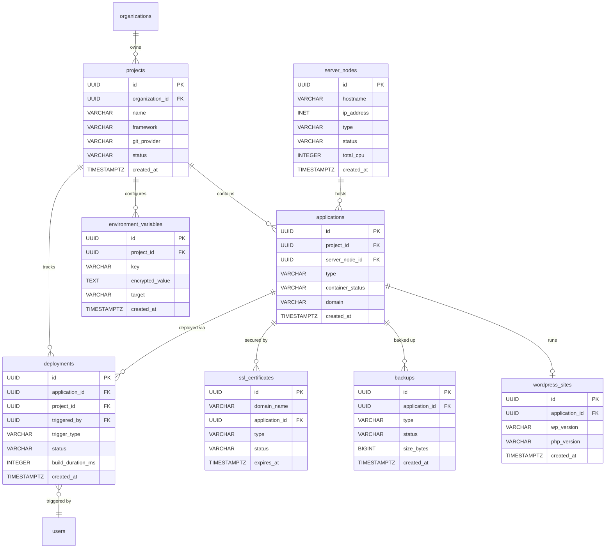
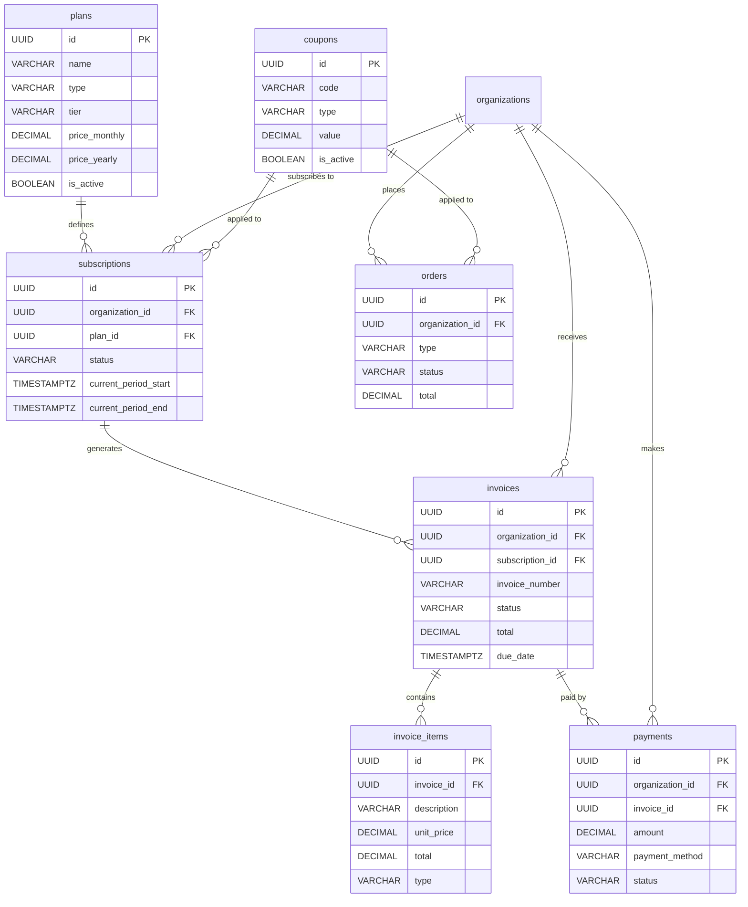
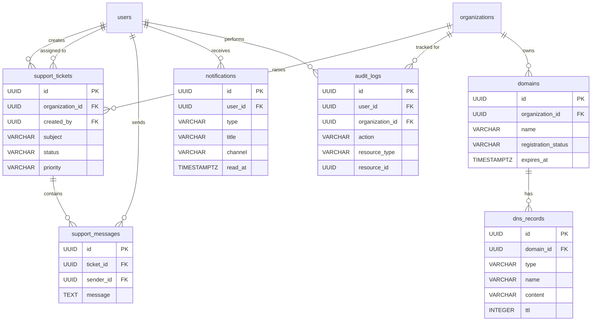

# 09 — Database Design

> **ITBengal Hosting Platform — Engineering Specification**
> Version 1.0 · July 2026
> Classification: Internal — Engineering Team

---

## Table of Contents

1. [Executive Overview](#1-executive-overview)
2. [Entity Relationship Diagrams](#2-entity-relationship-diagrams)
3. [Schema Design — All Tables](#3-schema-design--all-tables)
4. [Indexes](#4-indexes)
5. [Migration Strategy](#5-migration-strategy)
6. [Seed Data](#6-seed-data)
7. [Database Maintenance](#7-database-maintenance)
8. [Redis Schema](#8-redis-schema)

---

## 1. Executive Overview

### 1.1 Database Philosophy

ITBengal uses **PostgreSQL 16** as its primary relational database. The schema is designed around the following principles:

| Principle | Implementation |
|---|---|
| **UUID primary keys** | All tables use `UUID` (v4) as primary key for global uniqueness and safe distributed generation |
| **Timestamps everywhere** | Every table includes `created_at` and `updated_at` (auto-managed) |
| **Soft deletes** | Core entities use `deleted_at` (nullable timestamp) instead of physical deletion |
| **Snake case naming** | All tables, columns, and indexes use `snake_case` |
| **Plural table names** | Tables are named in plural form: `users`, `projects`, `deployments` |
| **Enum via CHECK** | Enumerated types are enforced via `CHECK` constraints on `VARCHAR` columns |
| **JSONB for flexibility** | Semi-structured data stored as `JSONB` with GIN indexes |
| **Referential integrity** | All relationships enforced via foreign keys with appropriate `ON DELETE` actions |
| **Index discipline** | Every foreign key column and common query filter is indexed |

### 1.2 PostgreSQL Configuration

| Parameter | Value | Rationale |
|---|---|---|
| `shared_buffers` | 25% of RAM | Standard recommendation |
| `effective_cache_size` | 75% of RAM | Helps query planner |
| `work_mem` | 64 MB | Sufficient for sorting/hashing |
| `maintenance_work_mem` | 512 MB | Speeds up VACUUM/CREATE INDEX |
| `max_connections` | 200 | Via PgBouncer pool |
| `wal_level` | `replica` | Enables point-in-time recovery |
| `max_wal_size` | 2 GB | Reduces checkpoint frequency |
| `checkpoint_completion_target` | 0.9 | Spreads checkpoint I/O |
| `random_page_cost` | 1.1 | SSD-optimized |
| `effective_io_concurrency` | 200 | SSD-optimized |
| `default_text_search_config` | `pg_catalog.english` | Full-text search default |

### 1.3 Naming Conventions

| Element | Convention | Example |
|---|---|---|
| Table | Plural snake_case | `team_members` |
| Column | Singular snake_case | `created_at` |
| Primary key | `id` | `id UUID` |
| Foreign key column | `{referenced_table_singular}_id` | `user_id`, `project_id` |
| Index | `idx_{table}_{columns}` | `idx_users_email` |
| Unique index | `uniq_{table}_{columns}` | `uniq_users_email` |
| Check constraint | `chk_{table}_{column}` | `chk_users_role` |
| Foreign key constraint | `fk_{table}_{referenced_table}` | `fk_projects_organization` |

### 1.4 Common Column Patterns

```sql
-- UUID primary key
id UUID PRIMARY KEY DEFAULT gen_random_uuid()

-- Timestamps
created_at TIMESTAMPTZ NOT NULL DEFAULT NOW()
updated_at TIMESTAMPTZ NOT NULL DEFAULT NOW()

-- Soft delete
deleted_at TIMESTAMPTZ NULL DEFAULT NULL

-- Auto-update trigger for updated_at
CREATE OR REPLACE FUNCTION update_updated_at_column()
RETURNS TRIGGER AS $$
BEGIN
    NEW.updated_at = NOW();
    RETURN NEW;
END;
$$ LANGUAGE plpgsql;
```

---

## 2. Entity Relationship Diagrams

### 2.1 Core Domain ER Diagram



### 2.2 Hosting Domain ER Diagram



### 2.3 Billing Domain ER Diagram



### 2.4 Support & System ER Diagram



---

## 3. Schema Design — All Tables

### 3.1 `users`

**Purpose:** Stores all registered user accounts (customers, admins, super admins).

```sql
CREATE TABLE users (
    id                   UUID PRIMARY KEY DEFAULT gen_random_uuid(),
    email                VARCHAR(255) NOT NULL,
    password_hash        VARCHAR(255) NOT NULL,
    first_name           VARCHAR(100) NOT NULL,
    last_name            VARCHAR(100) NOT NULL,
    avatar_url           VARCHAR(512) NULL,
    phone                VARCHAR(20) NULL,
    email_verified       BOOLEAN NOT NULL DEFAULT FALSE,
    phone_verified       BOOLEAN NOT NULL DEFAULT FALSE,
    two_factor_enabled   BOOLEAN NOT NULL DEFAULT FALSE,
    two_factor_secret    VARCHAR(255) NULL,
    role                 VARCHAR(20) NOT NULL DEFAULT 'customer',
    status               VARCHAR(20) NOT NULL DEFAULT 'pending',
    last_login_at        TIMESTAMPTZ NULL,
    login_count          INTEGER NOT NULL DEFAULT 0,
    timezone             VARCHAR(50) NULL DEFAULT 'Asia/Dhaka',
    language             VARCHAR(10) NULL DEFAULT 'en',
    country              VARCHAR(2) NULL DEFAULT 'BD',
    created_at           TIMESTAMPTZ NOT NULL DEFAULT NOW(),
    updated_at           TIMESTAMPTZ NOT NULL DEFAULT NOW(),
    deleted_at           TIMESTAMPTZ NULL,

    CONSTRAINT uniq_users_email UNIQUE (email),
    CONSTRAINT chk_users_role CHECK (role IN ('customer', 'admin', 'super_admin')),
    CONSTRAINT chk_users_status CHECK (status IN ('active', 'suspended', 'banned', 'pending'))
);

CREATE INDEX idx_users_email ON users (email) WHERE deleted_at IS NULL;
CREATE INDEX idx_users_status ON users (status) WHERE deleted_at IS NULL;
CREATE INDEX idx_users_role ON users (role) WHERE deleted_at IS NULL;
CREATE INDEX idx_users_created_at ON users (created_at);

CREATE TRIGGER trg_users_updated_at
    BEFORE UPDATE ON users
    FOR EACH ROW EXECUTE FUNCTION update_updated_at_column();
```

| Column | Type | Nullable | Default | Description |
|---|---|---|---|---|
| `id` | UUID | No | `gen_random_uuid()` | Primary key |
| `email` | VARCHAR(255) | No | — | Unique email address |
| `password_hash` | VARCHAR(255) | No | — | bcrypt hashed password |
| `first_name` | VARCHAR(100) | No | — | User's first name |
| `last_name` | VARCHAR(100) | No | — | User's last name |
| `avatar_url` | VARCHAR(512) | Yes | `NULL` | Profile picture URL |
| `phone` | VARCHAR(20) | Yes | `NULL` | Phone number with country code |
| `email_verified` | BOOLEAN | No | `FALSE` | Whether email has been verified |
| `phone_verified` | BOOLEAN | No | `FALSE` | Whether phone has been verified |
| `two_factor_enabled` | BOOLEAN | No | `FALSE` | Whether 2FA is enabled |
| `two_factor_secret` | VARCHAR(255) | Yes | `NULL` | Encrypted TOTP secret |
| `role` | VARCHAR(20) | No | `'customer'` | User role: `customer`, `admin`, `super_admin` |
| `status` | VARCHAR(20) | No | `'pending'` | Account status: `active`, `suspended`, `banned`, `pending` |
| `last_login_at` | TIMESTAMPTZ | Yes | `NULL` | Timestamp of last successful login |
| `login_count` | INTEGER | No | `0` | Total number of successful logins |
| `timezone` | VARCHAR(50) | Yes | `'Asia/Dhaka'` | User's timezone (IANA format) |
| `language` | VARCHAR(10) | Yes | `'en'` | Preferred language code |
| `country` | VARCHAR(2) | Yes | `'BD'` | ISO 3166-1 alpha-2 country code |
| `created_at` | TIMESTAMPTZ | No | `NOW()` | Record creation timestamp |
| `updated_at` | TIMESTAMPTZ | No | `NOW()` | Last modification timestamp |
| `deleted_at` | TIMESTAMPTZ | Yes | `NULL` | Soft delete timestamp |

---

### 3.2 `organizations`

**Purpose:** Multi-tenant container for projects, billing, and team management.

```sql
CREATE TABLE organizations (
    id                UUID PRIMARY KEY DEFAULT gen_random_uuid(),
    name              VARCHAR(100) NOT NULL,
    slug              VARCHAR(100) NOT NULL,
    logo_url          VARCHAR(512) NULL,
    owner_id          UUID NOT NULL REFERENCES users(id) ON DELETE RESTRICT,
    billing_email     VARCHAR(255) NULL,
    tax_id            VARCHAR(50) NULL,
    address_line1     VARCHAR(255) NULL,
    address_line2     VARCHAR(255) NULL,
    city              VARCHAR(100) NULL,
    state             VARCHAR(100) NULL,
    postal_code       VARCHAR(20) NULL,
    country           VARCHAR(2) NULL DEFAULT 'BD',
    plan_id           UUID NULL,
    status            VARCHAR(20) NOT NULL DEFAULT 'active',
    created_at        TIMESTAMPTZ NOT NULL DEFAULT NOW(),
    updated_at        TIMESTAMPTZ NOT NULL DEFAULT NOW(),
    deleted_at        TIMESTAMPTZ NULL,

    CONSTRAINT uniq_organizations_slug UNIQUE (slug),
    CONSTRAINT chk_organizations_status CHECK (status IN ('active', 'suspended', 'cancelled'))
);

CREATE INDEX idx_organizations_owner_id ON organizations (owner_id);
CREATE INDEX idx_organizations_slug ON organizations (slug) WHERE deleted_at IS NULL;
CREATE INDEX idx_organizations_status ON organizations (status) WHERE deleted_at IS NULL;

CREATE TRIGGER trg_organizations_updated_at
    BEFORE UPDATE ON organizations
    FOR EACH ROW EXECUTE FUNCTION update_updated_at_column();
```

| Column | Type | Nullable | Default | Description |
|---|---|---|---|---|
| `id` | UUID | No | `gen_random_uuid()` | Primary key |
| `name` | VARCHAR(100) | No | — | Organization display name |
| `slug` | VARCHAR(100) | No | — | URL-safe unique identifier |
| `logo_url` | VARCHAR(512) | Yes | `NULL` | Organization logo URL |
| `owner_id` | UUID | No | — | FK to `users.id` — organization owner |
| `billing_email` | VARCHAR(255) | Yes | `NULL` | Email for invoices and billing notifications |
| `tax_id` | VARCHAR(50) | Yes | `NULL` | Tax identification number (TIN/VAT) |
| `address_line1` | VARCHAR(255) | Yes | `NULL` | Billing address line 1 |
| `address_line2` | VARCHAR(255) | Yes | `NULL` | Billing address line 2 |
| `city` | VARCHAR(100) | Yes | `NULL` | City |
| `state` | VARCHAR(100) | Yes | `NULL` | State/Division |
| `postal_code` | VARCHAR(20) | Yes | `NULL` | Postal/ZIP code |
| `country` | VARCHAR(2) | Yes | `'BD'` | ISO 3166-1 alpha-2 country code |
| `plan_id` | UUID | Yes | `NULL` | FK to `plans.id` — current active plan |
| `status` | VARCHAR(20) | No | `'active'` | Status: `active`, `suspended`, `cancelled` |
| `created_at` | TIMESTAMPTZ | No | `NOW()` | Record creation timestamp |
| `updated_at` | TIMESTAMPTZ | No | `NOW()` | Last modification timestamp |
| `deleted_at` | TIMESTAMPTZ | Yes | `NULL` | Soft delete timestamp |

---

### 3.3 `teams`

**Purpose:** Logical grouping of members within an organization for access control.

```sql
CREATE TABLE teams (
    id                UUID PRIMARY KEY DEFAULT gen_random_uuid(),
    organization_id   UUID NOT NULL REFERENCES organizations(id) ON DELETE CASCADE,
    name              VARCHAR(100) NOT NULL,
    description       TEXT NULL,
    created_at        TIMESTAMPTZ NOT NULL DEFAULT NOW(),
    updated_at        TIMESTAMPTZ NOT NULL DEFAULT NOW(),

    CONSTRAINT uniq_teams_org_name UNIQUE (organization_id, name)
);

CREATE INDEX idx_teams_organization_id ON teams (organization_id);

CREATE TRIGGER trg_teams_updated_at
    BEFORE UPDATE ON teams
    FOR EACH ROW EXECUTE FUNCTION update_updated_at_column();
```

| Column | Type | Nullable | Default | Description |
|---|---|---|---|---|
| `id` | UUID | No | `gen_random_uuid()` | Primary key |
| `organization_id` | UUID | No | — | FK to `organizations.id` |
| `name` | VARCHAR(100) | No | — | Team name (unique within org) |
| `description` | TEXT | Yes | `NULL` | Team description |
| `created_at` | TIMESTAMPTZ | No | `NOW()` | Record creation timestamp |
| `updated_at` | TIMESTAMPTZ | No | `NOW()` | Last modification timestamp |

---

### 3.4 `team_members`

**Purpose:** Junction table mapping users to teams with role-based permissions.

```sql
CREATE TABLE team_members (
    id            UUID PRIMARY KEY DEFAULT gen_random_uuid(),
    team_id       UUID NOT NULL REFERENCES teams(id) ON DELETE CASCADE,
    user_id       UUID NOT NULL REFERENCES users(id) ON DELETE CASCADE,
    role          VARCHAR(20) NOT NULL DEFAULT 'member',
    invited_by    UUID NULL REFERENCES users(id) ON DELETE SET NULL,
    invited_at    TIMESTAMPTZ NULL,
    accepted_at   TIMESTAMPTZ NULL,
    status        VARCHAR(20) NOT NULL DEFAULT 'invited',
    created_at    TIMESTAMPTZ NOT NULL DEFAULT NOW(),
    updated_at    TIMESTAMPTZ NOT NULL DEFAULT NOW(),

    CONSTRAINT uniq_team_members_team_user UNIQUE (team_id, user_id),
    CONSTRAINT chk_team_members_role CHECK (role IN ('owner', 'admin', 'member', 'viewer')),
    CONSTRAINT chk_team_members_status CHECK (status IN ('active', 'invited', 'removed'))
);

CREATE INDEX idx_team_members_team_id ON team_members (team_id);
CREATE INDEX idx_team_members_user_id ON team_members (user_id);
CREATE INDEX idx_team_members_status ON team_members (status);

CREATE TRIGGER trg_team_members_updated_at
    BEFORE UPDATE ON team_members
    FOR EACH ROW EXECUTE FUNCTION update_updated_at_column();
```

| Column | Type | Nullable | Default | Description |
|---|---|---|---|---|
| `id` | UUID | No | `gen_random_uuid()` | Primary key |
| `team_id` | UUID | No | — | FK to `teams.id` |
| `user_id` | UUID | No | — | FK to `users.id` |
| `role` | VARCHAR(20) | No | `'member'` | Role: `owner`, `admin`, `member`, `viewer` |
| `invited_by` | UUID | Yes | `NULL` | FK to `users.id` — who sent the invitation |
| `invited_at` | TIMESTAMPTZ | Yes | `NULL` | When the invitation was sent |
| `accepted_at` | TIMESTAMPTZ | Yes | `NULL` | When the invitation was accepted |
| `status` | VARCHAR(20) | No | `'invited'` | Status: `active`, `invited`, `removed` |
| `created_at` | TIMESTAMPTZ | No | `NOW()` | Record creation timestamp |
| `updated_at` | TIMESTAMPTZ | No | `NOW()` | Last modification timestamp |

---

### 3.5 `sessions`

**Purpose:** Active user sessions for authentication and device tracking.

```sql
CREATE TABLE sessions (
    id              UUID PRIMARY KEY DEFAULT gen_random_uuid(),
    user_id         UUID NOT NULL REFERENCES users(id) ON DELETE CASCADE,
    token_hash      VARCHAR(255) NOT NULL,
    ip_address      INET NULL,
    user_agent      TEXT NULL,
    device_type     VARCHAR(20) NULL,
    location        VARCHAR(255) NULL,
    expires_at      TIMESTAMPTZ NOT NULL,
    last_active_at  TIMESTAMPTZ NOT NULL DEFAULT NOW(),
    created_at      TIMESTAMPTZ NOT NULL DEFAULT NOW(),

    CONSTRAINT uniq_sessions_token_hash UNIQUE (token_hash),
    CONSTRAINT chk_sessions_device_type CHECK (device_type IS NULL OR device_type IN ('desktop', 'mobile', 'tablet', 'api', 'unknown'))
);

CREATE INDEX idx_sessions_user_id ON sessions (user_id);
CREATE INDEX idx_sessions_token_hash ON sessions (token_hash);
CREATE INDEX idx_sessions_expires_at ON sessions (expires_at);
```

| Column | Type | Nullable | Default | Description |
|---|---|---|---|---|
| `id` | UUID | No | `gen_random_uuid()` | Primary key |
| `user_id` | UUID | No | — | FK to `users.id` |
| `token_hash` | VARCHAR(255) | No | — | SHA-256 hash of session token |
| `ip_address` | INET | Yes | `NULL` | Client IP address |
| `user_agent` | TEXT | Yes | `NULL` | Browser/client user agent string |
| `device_type` | VARCHAR(20) | Yes | `NULL` | Detected device: `desktop`, `mobile`, `tablet`, `api`, `unknown` |
| `location` | VARCHAR(255) | Yes | `NULL` | Geo-derived location (city, country) |
| `expires_at` | TIMESTAMPTZ | No | — | Session expiration timestamp |
| `last_active_at` | TIMESTAMPTZ | No | `NOW()` | Last activity timestamp |
| `created_at` | TIMESTAMPTZ | No | `NOW()` | Session creation timestamp |

---

### 3.6 `projects`

**Purpose:** A project represents a deployable application codebase linked to a Git repository.

```sql
CREATE TABLE projects (
    id                UUID PRIMARY KEY DEFAULT gen_random_uuid(),
    organization_id   UUID NOT NULL REFERENCES organizations(id) ON DELETE CASCADE,
    name              VARCHAR(100) NOT NULL,
    slug              VARCHAR(100) NOT NULL,
    description       TEXT NULL,
    framework         VARCHAR(30) NULL,
    git_provider      VARCHAR(20) NULL,
    git_repo_url      VARCHAR(512) NULL,
    git_branch        VARCHAR(100) NULL DEFAULT 'main',
    git_auto_deploy   BOOLEAN NOT NULL DEFAULT TRUE,
    root_directory    VARCHAR(255) NULL DEFAULT '.',
    build_command     VARCHAR(500) NULL,
    output_directory  VARCHAR(255) NULL,
    install_command   VARCHAR(500) NULL,
    node_version      VARCHAR(10) NULL DEFAULT '20',
    status            VARCHAR(20) NOT NULL DEFAULT 'active',
    created_at        TIMESTAMPTZ NOT NULL DEFAULT NOW(),
    updated_at        TIMESTAMPTZ NOT NULL DEFAULT NOW(),
    deleted_at        TIMESTAMPTZ NULL,

    CONSTRAINT uniq_projects_org_slug UNIQUE (organization_id, slug),
    CONSTRAINT chk_projects_framework CHECK (
        framework IS NULL OR framework IN (
            'nextjs', 'react', 'react_vite', 'vue', 'vue_vite',
            'angular', 'svelte', 'sveltekit', 'astro', 'nuxtjs',
            'vite', 'static_html', 'wordpress', 'nodejs'
        )
    ),
    CONSTRAINT chk_projects_git_provider CHECK (
        git_provider IS NULL OR git_provider IN ('github', 'gitlab', 'bitbucket', 'none')
    ),
    CONSTRAINT chk_projects_status CHECK (status IN ('active', 'archived', 'suspended'))
);

CREATE INDEX idx_projects_organization_id ON projects (organization_id) WHERE deleted_at IS NULL;
CREATE INDEX idx_projects_slug ON projects (slug) WHERE deleted_at IS NULL;
CREATE INDEX idx_projects_framework ON projects (framework) WHERE deleted_at IS NULL;
CREATE INDEX idx_projects_status ON projects (status) WHERE deleted_at IS NULL;

CREATE TRIGGER trg_projects_updated_at
    BEFORE UPDATE ON projects
    FOR EACH ROW EXECUTE FUNCTION update_updated_at_column();
```

| Column | Type | Nullable | Default | Description |
|---|---|---|---|---|
| `id` | UUID | No | `gen_random_uuid()` | Primary key |
| `organization_id` | UUID | No | — | FK to `organizations.id` |
| `name` | VARCHAR(100) | No | — | Project display name |
| `slug` | VARCHAR(100) | No | — | URL-safe identifier (unique within org) |
| `description` | TEXT | Yes | `NULL` | Project description |
| `framework` | VARCHAR(30) | Yes | `NULL` | Detected or manually set framework |
| `git_provider` | VARCHAR(20) | Yes | `NULL` | Git provider: `github`, `gitlab`, `bitbucket`, `none` |
| `git_repo_url` | VARCHAR(512) | Yes | `NULL` | Full repository clone URL |
| `git_branch` | VARCHAR(100) | Yes | `'main'` | Default branch for deployments |
| `git_auto_deploy` | BOOLEAN | No | `TRUE` | Whether pushes auto-trigger deployments |
| `root_directory` | VARCHAR(255) | Yes | `'.'` | Subdirectory containing the app (monorepo support) |
| `build_command` | VARCHAR(500) | Yes | `NULL` | Custom build command override |
| `output_directory` | VARCHAR(255) | Yes | `NULL` | Custom output directory override |
| `install_command` | VARCHAR(500) | Yes | `NULL` | Custom install command override |
| `node_version` | VARCHAR(10) | Yes | `'20'` | Node.js version for builds |
| `status` | VARCHAR(20) | No | `'active'` | Status: `active`, `archived`, `suspended` |
| `created_at` | TIMESTAMPTZ | No | `NOW()` | Record creation timestamp |
| `updated_at` | TIMESTAMPTZ | No | `NOW()` | Last modification timestamp |
| `deleted_at` | TIMESTAMPTZ | Yes | `NULL` | Soft delete timestamp |

---

### 3.7 `applications`

**Purpose:** Runtime representation of a deployed application instance on a specific server node.

```sql
CREATE TABLE applications (
    id                     UUID PRIMARY KEY DEFAULT gen_random_uuid(),
    project_id             UUID NOT NULL REFERENCES projects(id) ON DELETE CASCADE,
    name                   VARCHAR(100) NOT NULL,
    slug                   VARCHAR(100) NOT NULL,
    type                   VARCHAR(20) NOT NULL,
    server_node_id         UUID NULL REFERENCES server_nodes(id) ON DELETE SET NULL,
    container_id           VARCHAR(100) NULL,
    container_status       VARCHAR(20) NULL DEFAULT 'none',
    image_tag              VARCHAR(255) NULL,
    port                   INTEGER NULL DEFAULT 3000,
    cpu_limit              VARCHAR(20) NULL,
    memory_limit           VARCHAR(20) NULL,
    storage_limit          VARCHAR(20) NULL,
    current_deployment_id  UUID NULL,
    domain                 VARCHAR(255) NULL,
    custom_domain          VARCHAR(255) NULL,
    ssl_status             VARCHAR(20) NULL DEFAULT 'none',
    environment            VARCHAR(20) NOT NULL DEFAULT 'production',
    auto_deploy            BOOLEAN NOT NULL DEFAULT TRUE,
    created_at             TIMESTAMPTZ NOT NULL DEFAULT NOW(),
    updated_at             TIMESTAMPTZ NOT NULL DEFAULT NOW(),
    deleted_at             TIMESTAMPTZ NULL,

    CONSTRAINT uniq_applications_slug UNIQUE (slug),
    CONSTRAINT chk_applications_type CHECK (type IN ('react', 'wordpress')),
    CONSTRAINT chk_applications_container_status CHECK (
        container_status IS NULL OR container_status IN (
            'none', 'creating', 'starting', 'running', 'stopping',
            'stopped', 'restarting', 'failed', 'removed'
        )
    ),
    CONSTRAINT chk_applications_ssl_status CHECK (
        ssl_status IS NULL OR ssl_status IN ('none', 'pending', 'active', 'expired', 'failed')
    ),
    CONSTRAINT chk_applications_environment CHECK (
        environment IN ('production', 'staging', 'development')
    )
);

CREATE INDEX idx_applications_project_id ON applications (project_id) WHERE deleted_at IS NULL;
CREATE INDEX idx_applications_server_node_id ON applications (server_node_id);
CREATE INDEX idx_applications_domain ON applications (domain) WHERE deleted_at IS NULL;
CREATE INDEX idx_applications_custom_domain ON applications (custom_domain) WHERE deleted_at IS NULL AND custom_domain IS NOT NULL;
CREATE INDEX idx_applications_type ON applications (type) WHERE deleted_at IS NULL;
CREATE INDEX idx_applications_container_status ON applications (container_status);

CREATE TRIGGER trg_applications_updated_at
    BEFORE UPDATE ON applications
    FOR EACH ROW EXECUTE FUNCTION update_updated_at_column();
```

| Column | Type | Nullable | Default | Description |
|---|---|---|---|---|
| `id` | UUID | No | `gen_random_uuid()` | Primary key |
| `project_id` | UUID | No | — | FK to `projects.id` |
| `name` | VARCHAR(100) | No | — | Application display name |
| `slug` | VARCHAR(100) | No | — | Globally unique URL-safe identifier |
| `type` | VARCHAR(20) | No | — | Application type: `react`, `wordpress` |
| `server_node_id` | UUID | Yes | `NULL` | FK to `server_nodes.id` — assigned hosting node |
| `container_id` | VARCHAR(100) | Yes | `NULL` | Docker container ID |
| `container_status` | VARCHAR(20) | Yes | `'none'` | Current container status |
| `image_tag` | VARCHAR(255) | Yes | `NULL` | Docker image tag of current deployment |
| `port` | INTEGER | Yes | `3000` | Port the application listens on |
| `cpu_limit` | VARCHAR(20) | Yes | `NULL` | CPU limit (e.g., `'1.0'`) |
| `memory_limit` | VARCHAR(20) | Yes | `NULL` | Memory limit (e.g., `'1073741824'` bytes) |
| `storage_limit` | VARCHAR(20) | Yes | `NULL` | Storage limit (e.g., `'10737418240'` bytes) |
| `current_deployment_id` | UUID | Yes | `NULL` | FK to `deployments.id` — current live deployment |
| `domain` | VARCHAR(255) | Yes | `NULL` | Platform-assigned subdomain |
| `custom_domain` | VARCHAR(255) | Yes | `NULL` | User's custom domain |
| `ssl_status` | VARCHAR(20) | Yes | `'none'` | SSL certificate status |
| `environment` | VARCHAR(20) | No | `'production'` | Deployment environment |
| `auto_deploy` | BOOLEAN | No | `TRUE` | Whether git pushes auto-deploy |
| `created_at` | TIMESTAMPTZ | No | `NOW()` | Record creation timestamp |
| `updated_at` | TIMESTAMPTZ | No | `NOW()` | Last modification timestamp |
| `deleted_at` | TIMESTAMPTZ | Yes | `NULL` | Soft delete timestamp |

---

### 3.8 `deployments`

**Purpose:** Tracks every deployment attempt with full lifecycle metadata.

```sql
CREATE TABLE deployments (
    id                    UUID PRIMARY KEY DEFAULT gen_random_uuid(),
    application_id        UUID NOT NULL REFERENCES applications(id) ON DELETE CASCADE,
    project_id            UUID NOT NULL REFERENCES projects(id) ON DELETE CASCADE,
    triggered_by          UUID NULL REFERENCES users(id) ON DELETE SET NULL,
    trigger_type          VARCHAR(20) NOT NULL,
    git_commit_sha        VARCHAR(40) NULL,
    git_commit_message    TEXT NULL,
    git_branch            VARCHAR(100) NULL,
    source_type           VARCHAR(10) NOT NULL DEFAULT 'git',
    status                VARCHAR(20) NOT NULL DEFAULT 'queued',
    build_duration_ms     INTEGER NULL,
    deploy_duration_ms    INTEGER NULL,
    image_tag             VARCHAR(255) NULL,
    container_id          VARCHAR(100) NULL,
    build_logs_url        VARCHAR(512) NULL,
    deploy_logs_url       VARCHAR(512) NULL,
    error_message         TEXT NULL,
    error_code            VARCHAR(20) NULL,
    metadata              JSONB NULL DEFAULT '{}',
    environment_snapshot  JSONB NULL DEFAULT '{}',
    rollback_from_id      UUID NULL REFERENCES deployments(id) ON DELETE SET NULL,
    created_at            TIMESTAMPTZ NOT NULL DEFAULT NOW(),
    started_at            TIMESTAMPTZ NULL,
    completed_at          TIMESTAMPTZ NULL,

    CONSTRAINT chk_deployments_trigger_type CHECK (
        trigger_type IN ('git_push', 'manual', 'rollback', 'scheduled', 'api')
    ),
    CONSTRAINT chk_deployments_source_type CHECK (source_type IN ('git', 'zip')),
    CONSTRAINT chk_deployments_status CHECK (
        status IN ('queued', 'building', 'deploying', 'live', 'failed',
                   'cancelled', 'rolled_back', 'superseded')
    )
);

CREATE INDEX idx_deployments_application_id ON deployments (application_id);
CREATE INDEX idx_deployments_project_id ON deployments (project_id);
CREATE INDEX idx_deployments_triggered_by ON deployments (triggered_by);
CREATE INDEX idx_deployments_status ON deployments (status);
CREATE INDEX idx_deployments_created_at ON deployments (created_at DESC);
CREATE INDEX idx_deployments_application_status ON deployments (application_id, status);
CREATE INDEX idx_deployments_git_commit_sha ON deployments (git_commit_sha) WHERE git_commit_sha IS NOT NULL;
CREATE INDEX idx_deployments_metadata ON deployments USING GIN (metadata);

CREATE TRIGGER trg_deployments_updated_at_noop
    BEFORE UPDATE ON deployments
    FOR EACH ROW EXECUTE FUNCTION update_updated_at_column();
```

| Column | Type | Nullable | Default | Description |
|---|---|---|---|---|
| `id` | UUID | No | `gen_random_uuid()` | Primary key |
| `application_id` | UUID | No | — | FK to `applications.id` |
| `project_id` | UUID | No | — | FK to `projects.id` |
| `triggered_by` | UUID | Yes | `NULL` | FK to `users.id` — who triggered the deploy |
| `trigger_type` | VARCHAR(20) | No | — | How it was triggered: `git_push`, `manual`, `rollback`, `scheduled`, `api` |
| `git_commit_sha` | VARCHAR(40) | Yes | `NULL` | Full Git commit SHA |
| `git_commit_message` | TEXT | Yes | `NULL` | Git commit message |
| `git_branch` | VARCHAR(100) | Yes | `NULL` | Branch that was deployed |
| `source_type` | VARCHAR(10) | No | `'git'` | Source type: `git`, `zip` |
| `status` | VARCHAR(20) | No | `'queued'` | Deployment status |
| `build_duration_ms` | INTEGER | Yes | `NULL` | Build phase duration in milliseconds |
| `deploy_duration_ms` | INTEGER | Yes | `NULL` | Deploy phase duration in milliseconds |
| `image_tag` | VARCHAR(255) | Yes | `NULL` | Docker image tag produced |
| `container_id` | VARCHAR(100) | Yes | `NULL` | Docker container ID created |
| `build_logs_url` | VARCHAR(512) | Yes | `NULL` | URL to stored build logs |
| `deploy_logs_url` | VARCHAR(512) | Yes | `NULL` | URL to stored deploy logs |
| `error_message` | TEXT | Yes | `NULL` | Error message if failed |
| `error_code` | VARCHAR(20) | Yes | `NULL` | Structured error code (e.g., `BUILD_002`) |
| `metadata` | JSONB | Yes | `'{}'` | Framework, node version, image sizes, etc. |
| `environment_snapshot` | JSONB | Yes | `'{}'` | Encrypted snapshot of env vars used |
| `rollback_from_id` | UUID | Yes | `NULL` | FK to `deployments.id` — rollback source |
| `created_at` | TIMESTAMPTZ | No | `NOW()` | When deployment was queued |
| `started_at` | TIMESTAMPTZ | Yes | `NULL` | When build started |
| `completed_at` | TIMESTAMPTZ | Yes | `NULL` | When deployment reached terminal status |

---

### 3.9 `environment_variables`

**Purpose:** Stores encrypted environment variables scoped to projects and deployment targets.

```sql
CREATE TABLE environment_variables (
    id               UUID PRIMARY KEY DEFAULT gen_random_uuid(),
    project_id       UUID NOT NULL REFERENCES projects(id) ON DELETE CASCADE,
    key              VARCHAR(255) NOT NULL,
    encrypted_value  TEXT NOT NULL,
    target           VARCHAR(20) NOT NULL DEFAULT 'all',
    is_secret        BOOLEAN NOT NULL DEFAULT FALSE,
    created_by       UUID NULL REFERENCES users(id) ON DELETE SET NULL,
    created_at       TIMESTAMPTZ NOT NULL DEFAULT NOW(),
    updated_at       TIMESTAMPTZ NOT NULL DEFAULT NOW(),

    CONSTRAINT uniq_env_vars_project_key_target UNIQUE (project_id, key, target),
    CONSTRAINT chk_env_vars_target CHECK (target IN ('production', 'preview', 'development', 'all'))
);

CREATE INDEX idx_env_vars_project_id ON environment_variables (project_id);
CREATE INDEX idx_env_vars_target ON environment_variables (project_id, target);

CREATE TRIGGER trg_env_vars_updated_at
    BEFORE UPDATE ON environment_variables
    FOR EACH ROW EXECUTE FUNCTION update_updated_at_column();
```

| Column | Type | Nullable | Default | Description |
|---|---|---|---|---|
| `id` | UUID | No | `gen_random_uuid()` | Primary key |
| `project_id` | UUID | No | — | FK to `projects.id` |
| `key` | VARCHAR(255) | No | — | Variable name (e.g., `DATABASE_URL`) |
| `encrypted_value` | TEXT | No | — | AES-256-GCM encrypted value |
| `target` | VARCHAR(20) | No | `'all'` | Target env: `production`, `preview`, `development`, `all` |
| `is_secret` | BOOLEAN | No | `FALSE` | Whether to mask in UI and logs |
| `created_by` | UUID | Yes | `NULL` | FK to `users.id` — who created it |
| `created_at` | TIMESTAMPTZ | No | `NOW()` | Record creation timestamp |
| `updated_at` | TIMESTAMPTZ | No | `NOW()` | Last modification timestamp |

---

### 3.10 `domains`

**Purpose:** Domains registered through the platform via Openprovider.

```sql
CREATE TABLE domains (
    id                    UUID PRIMARY KEY DEFAULT gen_random_uuid(),
    organization_id       UUID NOT NULL REFERENCES organizations(id) ON DELETE CASCADE,
    name                  VARCHAR(255) NOT NULL,
    tld                   VARCHAR(20) NOT NULL,
    registrar             VARCHAR(50) NOT NULL DEFAULT 'openprovider',
    registration_status   VARCHAR(30) NOT NULL DEFAULT 'pending',
    whois_privacy         BOOLEAN NOT NULL DEFAULT TRUE,
    auto_renew            BOOLEAN NOT NULL DEFAULT TRUE,
    nameservers           JSONB NULL DEFAULT '[]',
    expires_at            TIMESTAMPTZ NULL,
    registered_at         TIMESTAMPTZ NULL,
    transfer_lock         BOOLEAN NOT NULL DEFAULT TRUE,
    auth_code_hash        VARCHAR(255) NULL,
    dns_zone_id           VARCHAR(100) NULL,
    created_at            TIMESTAMPTZ NOT NULL DEFAULT NOW(),
    updated_at            TIMESTAMPTZ NOT NULL DEFAULT NOW(),

    CONSTRAINT uniq_domains_name UNIQUE (name),
    CONSTRAINT chk_domains_registration_status CHECK (
        registration_status IN (
            'pending', 'active', 'expired', 'transferring', 'transfer_pending',
            'redemption', 'deleted', 'suspended', 'failed'
        )
    )
);

CREATE INDEX idx_domains_organization_id ON domains (organization_id);
CREATE INDEX idx_domains_name ON domains (name);
CREATE INDEX idx_domains_registration_status ON domains (registration_status);
CREATE INDEX idx_domains_expires_at ON domains (expires_at);

CREATE TRIGGER trg_domains_updated_at
    BEFORE UPDATE ON domains
    FOR EACH ROW EXECUTE FUNCTION update_updated_at_column();
```

| Column | Type | Nullable | Default | Description |
|---|---|---|---|---|
| `id` | UUID | No | `gen_random_uuid()` | Primary key |
| `organization_id` | UUID | No | — | FK to `organizations.id` |
| `name` | VARCHAR(255) | No | — | Full domain name (e.g., `example.com`) |
| `tld` | VARCHAR(20) | No | — | Top-level domain (e.g., `com`, `net`, `bd`) |
| `registrar` | VARCHAR(50) | No | `'openprovider'` | Domain registrar |
| `registration_status` | VARCHAR(30) | No | `'pending'` | Current registration status |
| `whois_privacy` | BOOLEAN | No | `TRUE` | Whether WHOIS privacy is enabled |
| `auto_renew` | BOOLEAN | No | `TRUE` | Whether domain auto-renews |
| `nameservers` | JSONB | Yes | `'[]'` | Array of nameserver hostnames |
| `expires_at` | TIMESTAMPTZ | Yes | `NULL` | Domain expiration date |
| `registered_at` | TIMESTAMPTZ | Yes | `NULL` | Domain registration date |
| `transfer_lock` | BOOLEAN | No | `TRUE` | Whether transfer lock is enabled |
| `auth_code_hash` | VARCHAR(255) | Yes | `NULL` | Hashed domain auth/EPP code |
| `dns_zone_id` | VARCHAR(100) | Yes | `NULL` | DNS zone identifier at registrar |
| `created_at` | TIMESTAMPTZ | No | `NOW()` | Record creation timestamp |
| `updated_at` | TIMESTAMPTZ | No | `NOW()` | Last modification timestamp |

---

### 3.11 `dns_records`

**Purpose:** DNS records managed for domains.

```sql
CREATE TABLE dns_records (
    id          UUID PRIMARY KEY DEFAULT gen_random_uuid(),
    domain_id   UUID NOT NULL REFERENCES domains(id) ON DELETE CASCADE,
    type        VARCHAR(10) NOT NULL,
    name        VARCHAR(255) NOT NULL,
    content     VARCHAR(1024) NOT NULL,
    ttl         INTEGER NOT NULL DEFAULT 3600,
    priority    INTEGER NULL,
    proxied     BOOLEAN NOT NULL DEFAULT FALSE,
    status      VARCHAR(20) NOT NULL DEFAULT 'active',
    created_at  TIMESTAMPTZ NOT NULL DEFAULT NOW(),
    updated_at  TIMESTAMPTZ NOT NULL DEFAULT NOW(),

    CONSTRAINT chk_dns_records_type CHECK (
        type IN ('A', 'AAAA', 'CNAME', 'MX', 'TXT', 'NS', 'SRV', 'CAA')
    ),
    CONSTRAINT chk_dns_records_status CHECK (status IN ('active', 'pending', 'deleted'))
);

CREATE INDEX idx_dns_records_domain_id ON dns_records (domain_id);
CREATE INDEX idx_dns_records_type ON dns_records (domain_id, type);
CREATE INDEX idx_dns_records_name ON dns_records (name);

CREATE TRIGGER trg_dns_records_updated_at
    BEFORE UPDATE ON dns_records
    FOR EACH ROW EXECUTE FUNCTION update_updated_at_column();
```

| Column | Type | Nullable | Default | Description |
|---|---|---|---|---|
| `id` | UUID | No | `gen_random_uuid()` | Primary key |
| `domain_id` | UUID | No | — | FK to `domains.id` |
| `type` | VARCHAR(10) | No | — | Record type: `A`, `AAAA`, `CNAME`, `MX`, `TXT`, `NS`, `SRV`, `CAA` |
| `name` | VARCHAR(255) | No | — | Record name (e.g., `@`, `www`, `mail`) |
| `content` | VARCHAR(1024) | No | — | Record value |
| `ttl` | INTEGER | No | `3600` | Time to live in seconds |
| `priority` | INTEGER | Yes | `NULL` | Priority (MX and SRV records) |
| `proxied` | BOOLEAN | No | `FALSE` | Whether traffic is proxied |
| `status` | VARCHAR(20) | No | `'active'` | Record status |
| `created_at` | TIMESTAMPTZ | No | `NOW()` | Record creation timestamp |
| `updated_at` | TIMESTAMPTZ | No | `NOW()` | Last modification timestamp |

---

### 3.12 `ssl_certificates`

**Purpose:** SSL/TLS certificate tracking for all domains and applications.

```sql
CREATE TABLE ssl_certificates (
    id               UUID PRIMARY KEY DEFAULT gen_random_uuid(),
    domain_name      VARCHAR(255) NOT NULL,
    application_id   UUID NULL REFERENCES applications(id) ON DELETE SET NULL,
    type             VARCHAR(20) NOT NULL,
    status           VARCHAR(20) NOT NULL DEFAULT 'pending',
    issued_at        TIMESTAMPTZ NULL,
    expires_at       TIMESTAMPTZ NULL,
    auto_renew       BOOLEAN NOT NULL DEFAULT TRUE,
    last_renewal_at  TIMESTAMPTZ NULL,
    certificate_path VARCHAR(512) NULL,
    private_key_path VARCHAR(512) NULL,
    chain_path       VARCHAR(512) NULL,
    issuer           VARCHAR(255) NULL DEFAULT 'Let''s Encrypt',
    created_at       TIMESTAMPTZ NOT NULL DEFAULT NOW(),
    updated_at       TIMESTAMPTZ NOT NULL DEFAULT NOW(),

    CONSTRAINT chk_ssl_certs_type CHECK (type IN ('lets_encrypt', 'custom', 'wildcard')),
    CONSTRAINT chk_ssl_certs_status CHECK (
        status IN ('pending', 'active', 'expired', 'revoked', 'failed')
    )
);

CREATE INDEX idx_ssl_certs_domain_name ON ssl_certificates (domain_name);
CREATE INDEX idx_ssl_certs_application_id ON ssl_certificates (application_id);
CREATE INDEX idx_ssl_certs_status ON ssl_certificates (status);
CREATE INDEX idx_ssl_certs_expires_at ON ssl_certificates (expires_at);

CREATE TRIGGER trg_ssl_certs_updated_at
    BEFORE UPDATE ON ssl_certificates
    FOR EACH ROW EXECUTE FUNCTION update_updated_at_column();
```

| Column | Type | Nullable | Default | Description |
|---|---|---|---|---|
| `id` | UUID | No | `gen_random_uuid()` | Primary key |
| `domain_name` | VARCHAR(255) | No | — | Domain name the cert covers |
| `application_id` | UUID | Yes | `NULL` | FK to `applications.id` (if bound to app) |
| `type` | VARCHAR(20) | No | — | Certificate type: `lets_encrypt`, `custom`, `wildcard` |
| `status` | VARCHAR(20) | No | `'pending'` | Status: `pending`, `active`, `expired`, `revoked`, `failed` |
| `issued_at` | TIMESTAMPTZ | Yes | `NULL` | When the certificate was issued |
| `expires_at` | TIMESTAMPTZ | Yes | `NULL` | Certificate expiration date |
| `auto_renew` | BOOLEAN | No | `TRUE` | Whether auto-renewal is enabled |
| `last_renewal_at` | TIMESTAMPTZ | Yes | `NULL` | Last successful renewal timestamp |
| `certificate_path` | VARCHAR(512) | Yes | `NULL` | Filesystem path to certificate file |
| `private_key_path` | VARCHAR(512) | Yes | `NULL` | Filesystem path to private key file |
| `chain_path` | VARCHAR(512) | Yes | `NULL` | Filesystem path to certificate chain file |
| `issuer` | VARCHAR(255) | Yes | `'Let''s Encrypt'` | Certificate authority name |
| `created_at` | TIMESTAMPTZ | No | `NOW()` | Record creation timestamp |
| `updated_at` | TIMESTAMPTZ | No | `NOW()` | Last modification timestamp |

---

### 3.13 `server_nodes`

**Purpose:** Registry of all VPS hosting nodes in the infrastructure.

```sql
CREATE TABLE server_nodes (
    id                UUID PRIMARY KEY DEFAULT gen_random_uuid(),
    hostname          VARCHAR(100) NOT NULL,
    ip_address        INET NOT NULL,
    type              VARCHAR(20) NOT NULL,
    region            VARCHAR(50) NULL DEFAULT 'bd-dhaka',
    datacenter        VARCHAR(100) NULL,
    status            VARCHAR(20) NOT NULL DEFAULT 'active',
    total_cpu         INTEGER NOT NULL,
    total_memory_mb   INTEGER NOT NULL,
    total_storage_gb  INTEGER NOT NULL,
    used_cpu          REAL NOT NULL DEFAULT 0,
    used_memory_mb    INTEGER NOT NULL DEFAULT 0,
    used_storage_gb   INTEGER NOT NULL DEFAULT 0,
    container_count   INTEGER NOT NULL DEFAULT 0,
    max_containers    INTEGER NOT NULL DEFAULT 100,
    docker_version    VARCHAR(20) NULL,
    os_version        VARCHAR(100) NULL,
    last_heartbeat_at TIMESTAMPTZ NULL,
    health_score      REAL NOT NULL DEFAULT 100.0,
    metadata          JSONB NULL DEFAULT '{}',
    created_at        TIMESTAMPTZ NOT NULL DEFAULT NOW(),
    updated_at        TIMESTAMPTZ NOT NULL DEFAULT NOW(),

    CONSTRAINT uniq_server_nodes_hostname UNIQUE (hostname),
    CONSTRAINT uniq_server_nodes_ip UNIQUE (ip_address),
    CONSTRAINT chk_server_nodes_type CHECK (
        type IN ('react', 'wordpress', 'platform', 'worker', 'database', 'redis', 'monitoring', 'backup')
    ),
    CONSTRAINT chk_server_nodes_status CHECK (
        status IN ('active', 'maintenance', 'draining', 'offline')
    ),
    CONSTRAINT chk_server_nodes_health_score CHECK (health_score >= 0 AND health_score <= 100)
);

CREATE INDEX idx_server_nodes_type ON server_nodes (type);
CREATE INDEX idx_server_nodes_status ON server_nodes (status);
CREATE INDEX idx_server_nodes_type_status ON server_nodes (type, status);
CREATE INDEX idx_server_nodes_health_score ON server_nodes (health_score DESC);
CREATE INDEX idx_server_nodes_last_heartbeat ON server_nodes (last_heartbeat_at);
CREATE INDEX idx_server_nodes_metadata ON server_nodes USING GIN (metadata);

CREATE TRIGGER trg_server_nodes_updated_at
    BEFORE UPDATE ON server_nodes
    FOR EACH ROW EXECUTE FUNCTION update_updated_at_column();
```

| Column | Type | Nullable | Default | Description |
|---|---|---|---|---|
| `id` | UUID | No | `gen_random_uuid()` | Primary key |
| `hostname` | VARCHAR(100) | No | — | Unique hostname (e.g., `react-node-01`) |
| `ip_address` | INET | No | — | IPv4 or IPv6 address |
| `type` | VARCHAR(20) | No | — | Node type: `react`, `wordpress`, `platform`, `worker`, etc. |
| `region` | VARCHAR(50) | Yes | `'bd-dhaka'` | Geographic region identifier |
| `datacenter` | VARCHAR(100) | Yes | `NULL` | Datacenter or provider name |
| `status` | VARCHAR(20) | No | `'active'` | Status: `active`, `maintenance`, `draining`, `offline` |
| `total_cpu` | INTEGER | No | — | Total CPU cores |
| `total_memory_mb` | INTEGER | No | — | Total RAM in megabytes |
| `total_storage_gb` | INTEGER | No | — | Total disk in gigabytes |
| `used_cpu` | REAL | No | `0` | Currently used CPU (cores, can be fractional) |
| `used_memory_mb` | INTEGER | No | `0` | Currently used RAM in MB |
| `used_storage_gb` | INTEGER | No | `0` | Currently used storage in GB |
| `container_count` | INTEGER | No | `0` | Number of running containers |
| `max_containers` | INTEGER | No | `100` | Maximum containers this node supports |
| `docker_version` | VARCHAR(20) | Yes | `NULL` | Docker engine version |
| `os_version` | VARCHAR(100) | Yes | `NULL` | OS version (e.g., `Ubuntu 24.04 LTS`) |
| `last_heartbeat_at` | TIMESTAMPTZ | Yes | `NULL` | Last heartbeat timestamp |
| `health_score` | REAL | No | `100.0` | Composite health score (0–100) |
| `metadata` | JSONB | Yes | `'{}'` | Additional node metadata |
| `created_at` | TIMESTAMPTZ | No | `NOW()` | Record creation timestamp |
| `updated_at` | TIMESTAMPTZ | No | `NOW()` | Last modification timestamp |

---

### 3.14 `wordpress_sites`

**Purpose:** WordPress-specific configuration and metadata for managed WordPress hosting.

```sql
CREATE TABLE wordpress_sites (
    id                     UUID PRIMARY KEY DEFAULT gen_random_uuid(),
    application_id         UUID NOT NULL REFERENCES applications(id) ON DELETE CASCADE,
    wp_version             VARCHAR(20) NULL DEFAULT 'latest',
    php_version            VARCHAR(10) NULL DEFAULT '8.2',
    db_name                VARCHAR(100) NOT NULL,
    db_user                VARCHAR(100) NOT NULL,
    db_password_encrypted  TEXT NOT NULL,
    db_host                VARCHAR(255) NOT NULL,
    db_port                INTEGER NOT NULL DEFAULT 3306,
    admin_user             VARCHAR(100) NOT NULL,
    admin_email            VARCHAR(255) NOT NULL,
    admin_password_encrypted TEXT NOT NULL,
    site_title             VARCHAR(255) NULL,
    site_url               VARCHAR(512) NULL,
    multisite              BOOLEAN NOT NULL DEFAULT FALSE,
    auto_update_core       BOOLEAN NOT NULL DEFAULT TRUE,
    auto_update_plugins    BOOLEAN NOT NULL DEFAULT FALSE,
    auto_update_themes     BOOLEAN NOT NULL DEFAULT FALSE,
    cache_enabled          BOOLEAN NOT NULL DEFAULT TRUE,
    cache_type             VARCHAR(20) NULL DEFAULT 'opcache',
    security_scan_enabled  BOOLEAN NOT NULL DEFAULT TRUE,
    last_scan_at           TIMESTAMPTZ NULL,
    malware_status         VARCHAR(20) NULL DEFAULT 'clean',
    created_at             TIMESTAMPTZ NOT NULL DEFAULT NOW(),
    updated_at             TIMESTAMPTZ NOT NULL DEFAULT NOW(),

    CONSTRAINT uniq_wp_sites_application UNIQUE (application_id),
    CONSTRAINT chk_wp_sites_cache_type CHECK (
        cache_type IS NULL OR cache_type IN ('opcache', 'redis', 'memcached', 'none')
    ),
    CONSTRAINT chk_wp_sites_malware_status CHECK (
        malware_status IS NULL OR malware_status IN ('clean', 'infected', 'scanning', 'quarantined')
    )
);

CREATE INDEX idx_wp_sites_application_id ON wordpress_sites (application_id);
CREATE INDEX idx_wp_sites_malware_status ON wordpress_sites (malware_status);

CREATE TRIGGER trg_wp_sites_updated_at
    BEFORE UPDATE ON wordpress_sites
    FOR EACH ROW EXECUTE FUNCTION update_updated_at_column();
```

| Column | Type | Nullable | Default | Description |
|---|---|---|---|---|
| `id` | UUID | No | `gen_random_uuid()` | Primary key |
| `application_id` | UUID | No | — | FK to `applications.id` (one-to-one) |
| `wp_version` | VARCHAR(20) | Yes | `'latest'` | WordPress core version |
| `php_version` | VARCHAR(10) | Yes | `'8.2'` | PHP version |
| `db_name` | VARCHAR(100) | No | — | MariaDB database name |
| `db_user` | VARCHAR(100) | No | — | MariaDB user |
| `db_password_encrypted` | TEXT | No | — | AES-256-GCM encrypted DB password |
| `db_host` | VARCHAR(255) | No | — | MariaDB host (container name or IP) |
| `db_port` | INTEGER | No | `3306` | MariaDB port |
| `admin_user` | VARCHAR(100) | No | — | WordPress admin username |
| `admin_email` | VARCHAR(255) | No | — | WordPress admin email |
| `admin_password_encrypted` | TEXT | No | — | Encrypted initial admin password |
| `site_title` | VARCHAR(255) | Yes | `NULL` | WordPress site title |
| `site_url` | VARCHAR(512) | Yes | `NULL` | WordPress site URL |
| `multisite` | BOOLEAN | No | `FALSE` | Whether WordPress multisite is enabled |
| `auto_update_core` | BOOLEAN | No | `TRUE` | Auto-update WordPress core |
| `auto_update_plugins` | BOOLEAN | No | `FALSE` | Auto-update plugins |
| `auto_update_themes` | BOOLEAN | No | `FALSE` | Auto-update themes |
| `cache_enabled` | BOOLEAN | No | `TRUE` | Whether caching is enabled |
| `cache_type` | VARCHAR(20) | Yes | `'opcache'` | Cache type: `opcache`, `redis`, `memcached`, `none` |
| `security_scan_enabled` | BOOLEAN | No | `TRUE` | Whether malware scanning is enabled |
| `last_scan_at` | TIMESTAMPTZ | Yes | `NULL` | Last security scan timestamp |
| `malware_status` | VARCHAR(20) | Yes | `'clean'` | Malware status: `clean`, `infected`, `scanning`, `quarantined` |
| `created_at` | TIMESTAMPTZ | No | `NOW()` | Record creation timestamp |
| `updated_at` | TIMESTAMPTZ | No | `NOW()` | Last modification timestamp |

---

### 3.15 `backups`

**Purpose:** Backup records for all application types.

```sql
CREATE TABLE backups (
    id                UUID PRIMARY KEY DEFAULT gen_random_uuid(),
    application_id    UUID NOT NULL REFERENCES applications(id) ON DELETE CASCADE,
    type              VARCHAR(20) NOT NULL,
    status            VARCHAR(20) NOT NULL DEFAULT 'pending',
    size_bytes        BIGINT NULL,
    storage_path      VARCHAR(512) NULL,
    storage_provider  VARCHAR(20) NULL DEFAULT 'local',
    retention_days    INTEGER NOT NULL DEFAULT 7,
    triggered_by      VARCHAR(20) NOT NULL DEFAULT 'scheduled',
    notes             TEXT NULL,
    started_at        TIMESTAMPTZ NULL,
    completed_at      TIMESTAMPTZ NULL,
    expires_at        TIMESTAMPTZ NULL,
    created_at        TIMESTAMPTZ NOT NULL DEFAULT NOW(),

    CONSTRAINT chk_backups_type CHECK (type IN ('full', 'database', 'files', 'incremental')),
    CONSTRAINT chk_backups_status CHECK (
        status IN ('pending', 'running', 'completed', 'failed', 'expired', 'deleted')
    ),
    CONSTRAINT chk_backups_triggered_by CHECK (triggered_by IN ('scheduled', 'manual', 'pre_deploy'))
);

CREATE INDEX idx_backups_application_id ON backups (application_id);
CREATE INDEX idx_backups_status ON backups (status);
CREATE INDEX idx_backups_expires_at ON backups (expires_at) WHERE status = 'completed';
CREATE INDEX idx_backups_created_at ON backups (created_at DESC);

-- No updated_at trigger needed — backups are append-only once created
```

| Column | Type | Nullable | Default | Description |
|---|---|---|---|---|
| `id` | UUID | No | `gen_random_uuid()` | Primary key |
| `application_id` | UUID | No | — | FK to `applications.id` |
| `type` | VARCHAR(20) | No | — | Backup type: `full`, `database`, `files`, `incremental` |
| `status` | VARCHAR(20) | No | `'pending'` | Status: `pending`, `running`, `completed`, `failed`, `expired`, `deleted` |
| `size_bytes` | BIGINT | Yes | `NULL` | Backup file size in bytes |
| `storage_path` | VARCHAR(512) | Yes | `NULL` | Path or URL to backup file |
| `storage_provider` | VARCHAR(20) | Yes | `'local'` | Where backup is stored |
| `retention_days` | INTEGER | No | `7` | How long to keep the backup |
| `triggered_by` | VARCHAR(20) | No | `'scheduled'` | Trigger: `scheduled`, `manual`, `pre_deploy` |
| `notes` | TEXT | Yes | `NULL` | Optional notes |
| `started_at` | TIMESTAMPTZ | Yes | `NULL` | When backup started |
| `completed_at` | TIMESTAMPTZ | Yes | `NULL` | When backup completed |
| `expires_at` | TIMESTAMPTZ | Yes | `NULL` | When backup should be deleted |
| `created_at` | TIMESTAMPTZ | No | `NOW()` | Record creation timestamp |

---

### 3.16 `plans`

**Purpose:** Defines all hosting plans with resource limits and pricing.

```sql
CREATE TABLE plans (
    id                      UUID PRIMARY KEY DEFAULT gen_random_uuid(),
    name                    VARCHAR(50) NOT NULL,
    slug                    VARCHAR(50) NOT NULL,
    type                    VARCHAR(30) NOT NULL,
    tier                    VARCHAR(20) NOT NULL,
    price_monthly           DECIMAL(10, 2) NOT NULL,
    price_yearly            DECIMAL(10, 2) NOT NULL,
    currency                VARCHAR(3) NOT NULL DEFAULT 'BDT',
    cpu_limit               VARCHAR(10) NOT NULL,
    memory_limit_mb         INTEGER NOT NULL,
    storage_limit_gb        INTEGER NOT NULL,
    bandwidth_limit_gb      INTEGER NOT NULL,
    max_projects            INTEGER NOT NULL,
    max_domains             INTEGER NOT NULL,
    max_team_members        INTEGER NOT NULL,
    max_deployments_per_day INTEGER NOT NULL,
    max_build_minutes       INTEGER NOT NULL,
    backup_retention_days   INTEGER NOT NULL,
    priority_queue_level    INTEGER NOT NULL DEFAULT 5,
    ssl_type                VARCHAR(20) NOT NULL DEFAULT 'lets_encrypt',
    log_retention_days      INTEGER NOT NULL DEFAULT 7,
    support_level           VARCHAR(20) NOT NULL DEFAULT 'community',
    features                JSONB NULL DEFAULT '{}',
    is_active               BOOLEAN NOT NULL DEFAULT TRUE,
    sort_order              INTEGER NOT NULL DEFAULT 0,
    created_at              TIMESTAMPTZ NOT NULL DEFAULT NOW(),
    updated_at              TIMESTAMPTZ NOT NULL DEFAULT NOW(),

    CONSTRAINT uniq_plans_slug UNIQUE (slug),
    CONSTRAINT chk_plans_type CHECK (type IN ('react_hosting', 'wordpress_hosting')),
    CONSTRAINT chk_plans_tier CHECK (
        tier IN ('starter', 'basic', 'professional', 'business', 'enterprise')
    ),
    CONSTRAINT chk_plans_support_level CHECK (
        support_level IN ('community', 'email', 'priority', 'dedicated')
    )
);

CREATE INDEX idx_plans_type ON plans (type);
CREATE INDEX idx_plans_tier ON plans (tier);
CREATE INDEX idx_plans_is_active ON plans (is_active);
CREATE INDEX idx_plans_sort_order ON plans (sort_order);

CREATE TRIGGER trg_plans_updated_at
    BEFORE UPDATE ON plans
    FOR EACH ROW EXECUTE FUNCTION update_updated_at_column();
```

| Column | Type | Nullable | Default | Description |
|---|---|---|---|---|
| `id` | UUID | No | `gen_random_uuid()` | Primary key |
| `name` | VARCHAR(50) | No | — | Plan display name (e.g., "React Professional") |
| `slug` | VARCHAR(50) | No | — | URL-safe identifier (e.g., `react-professional`) |
| `type` | VARCHAR(30) | No | — | Plan type: `react_hosting`, `wordpress_hosting` |
| `tier` | VARCHAR(20) | No | — | Tier level: `starter`, `basic`, `professional`, `business`, `enterprise` |
| `price_monthly` | DECIMAL(10,2) | No | — | Monthly price |
| `price_yearly` | DECIMAL(10,2) | No | — | Yearly price (discounted) |
| `currency` | VARCHAR(3) | No | `'BDT'` | Currency code |
| `cpu_limit` | VARCHAR(10) | No | — | CPU cores limit (e.g., `'0.25'`, `'4.0'`) |
| `memory_limit_mb` | INTEGER | No | — | Memory limit in MB |
| `storage_limit_gb` | INTEGER | No | — | Storage limit in GB |
| `bandwidth_limit_gb` | INTEGER | No | — | Monthly bandwidth in GB |
| `max_projects` | INTEGER | No | — | Maximum number of projects |
| `max_domains` | INTEGER | No | — | Maximum custom domains |
| `max_team_members` | INTEGER | No | — | Maximum team members |
| `max_deployments_per_day` | INTEGER | No | — | Max deployments per day |
| `max_build_minutes` | INTEGER | No | — | Monthly build minutes quota |
| `backup_retention_days` | INTEGER | No | — | Days to keep backups |
| `priority_queue_level` | INTEGER | No | `5` | Queue priority (1=highest, 5=lowest) |
| `ssl_type` | VARCHAR(20) | No | `'lets_encrypt'` | SSL type included |
| `log_retention_days` | INTEGER | No | `7` | Days to keep deployment logs |
| `support_level` | VARCHAR(20) | No | `'community'` | Support tier: `community`, `email`, `priority`, `dedicated` |
| `features` | JSONB | Yes | `'{}'` | Additional feature flags |
| `is_active` | BOOLEAN | No | `TRUE` | Whether plan is available for purchase |
| `sort_order` | INTEGER | No | `0` | Display order in pricing page |
| `created_at` | TIMESTAMPTZ | No | `NOW()` | Record creation timestamp |
| `updated_at` | TIMESTAMPTZ | No | `NOW()` | Last modification timestamp |

---

### 3.17 `subscriptions`

**Purpose:** Active subscriptions linking organizations to plans.

```sql
CREATE TABLE subscriptions (
    id                    UUID PRIMARY KEY DEFAULT gen_random_uuid(),
    organization_id       UUID NOT NULL REFERENCES organizations(id) ON DELETE CASCADE,
    plan_id               UUID NOT NULL REFERENCES plans(id) ON DELETE RESTRICT,
    status                VARCHAR(20) NOT NULL DEFAULT 'active',
    current_period_start  TIMESTAMPTZ NOT NULL,
    current_period_end    TIMESTAMPTZ NOT NULL,
    trial_start           TIMESTAMPTZ NULL,
    trial_end             TIMESTAMPTZ NULL,
    cancel_at             TIMESTAMPTZ NULL,
    cancelled_at          TIMESTAMPTZ NULL,
    cancel_reason         TEXT NULL,
    payment_method_id     VARCHAR(100) NULL,
    auto_renew            BOOLEAN NOT NULL DEFAULT TRUE,
    coupon_id             UUID NULL REFERENCES coupons(id) ON DELETE SET NULL,
    discount_amount       DECIMAL(10, 2) NULL DEFAULT 0.00,
    created_at            TIMESTAMPTZ NOT NULL DEFAULT NOW(),
    updated_at            TIMESTAMPTZ NOT NULL DEFAULT NOW(),

    CONSTRAINT chk_subscriptions_status CHECK (
        status IN ('active', 'past_due', 'cancelled', 'trialing', 'paused', 'expired')
    )
);

CREATE INDEX idx_subscriptions_organization_id ON subscriptions (organization_id);
CREATE INDEX idx_subscriptions_plan_id ON subscriptions (plan_id);
CREATE INDEX idx_subscriptions_status ON subscriptions (status);
CREATE INDEX idx_subscriptions_current_period_end ON subscriptions (current_period_end);
CREATE INDEX idx_subscriptions_coupon_id ON subscriptions (coupon_id) WHERE coupon_id IS NOT NULL;

CREATE TRIGGER trg_subscriptions_updated_at
    BEFORE UPDATE ON subscriptions
    FOR EACH ROW EXECUTE FUNCTION update_updated_at_column();
```

| Column | Type | Nullable | Default | Description |
|---|---|---|---|---|
| `id` | UUID | No | `gen_random_uuid()` | Primary key |
| `organization_id` | UUID | No | — | FK to `organizations.id` |
| `plan_id` | UUID | No | — | FK to `plans.id` |
| `status` | VARCHAR(20) | No | `'active'` | Status: `active`, `past_due`, `cancelled`, `trialing`, `paused`, `expired` |
| `current_period_start` | TIMESTAMPTZ | No | — | Start of current billing period |
| `current_period_end` | TIMESTAMPTZ | No | — | End of current billing period |
| `trial_start` | TIMESTAMPTZ | Yes | `NULL` | Trial start date |
| `trial_end` | TIMESTAMPTZ | Yes | `NULL` | Trial end date |
| `cancel_at` | TIMESTAMPTZ | Yes | `NULL` | Scheduled cancellation date |
| `cancelled_at` | TIMESTAMPTZ | Yes | `NULL` | Actual cancellation timestamp |
| `cancel_reason` | TEXT | Yes | `NULL` | Reason for cancellation |
| `payment_method_id` | VARCHAR(100) | Yes | `NULL` | Stored payment method reference |
| `auto_renew` | BOOLEAN | No | `TRUE` | Whether subscription auto-renews |
| `coupon_id` | UUID | Yes | `NULL` | FK to `coupons.id` — applied coupon |
| `discount_amount` | DECIMAL(10,2) | Yes | `0.00` | Discount amount from coupon |
| `created_at` | TIMESTAMPTZ | No | `NOW()` | Record creation timestamp |
| `updated_at` | TIMESTAMPTZ | No | `NOW()` | Last modification timestamp |

---

### 3.18 `invoices`

**Purpose:** Billing invoices generated for organizations.

```sql
CREATE TABLE invoices (
    id                    UUID PRIMARY KEY DEFAULT gen_random_uuid(),
    organization_id       UUID NOT NULL REFERENCES organizations(id) ON DELETE CASCADE,
    subscription_id       UUID NULL REFERENCES subscriptions(id) ON DELETE SET NULL,
    invoice_number        VARCHAR(30) NOT NULL,
    status                VARCHAR(20) NOT NULL DEFAULT 'draft',
    subtotal              DECIMAL(12, 2) NOT NULL DEFAULT 0.00,
    discount              DECIMAL(12, 2) NOT NULL DEFAULT 0.00,
    tax_rate              DECIMAL(5, 2) NOT NULL DEFAULT 0.00,
    tax_amount            DECIMAL(12, 2) NOT NULL DEFAULT 0.00,
    total                 DECIMAL(12, 2) NOT NULL DEFAULT 0.00,
    currency              VARCHAR(3) NOT NULL DEFAULT 'BDT',
    due_date              TIMESTAMPTZ NOT NULL,
    paid_at               TIMESTAMPTZ NULL,
    payment_method        VARCHAR(30) NULL,
    billing_period_start  TIMESTAMPTZ NULL,
    billing_period_end    TIMESTAMPTZ NULL,
    notes                 TEXT NULL,
    pdf_url               VARCHAR(512) NULL,
    created_at            TIMESTAMPTZ NOT NULL DEFAULT NOW(),
    updated_at            TIMESTAMPTZ NOT NULL DEFAULT NOW(),

    CONSTRAINT uniq_invoices_number UNIQUE (invoice_number),
    CONSTRAINT chk_invoices_status CHECK (
        status IN ('draft', 'pending', 'paid', 'overdue', 'cancelled', 'refunded')
    )
);

CREATE INDEX idx_invoices_organization_id ON invoices (organization_id);
CREATE INDEX idx_invoices_subscription_id ON invoices (subscription_id);
CREATE INDEX idx_invoices_status ON invoices (status);
CREATE INDEX idx_invoices_invoice_number ON invoices (invoice_number);
CREATE INDEX idx_invoices_due_date ON invoices (due_date);
CREATE INDEX idx_invoices_created_at ON invoices (created_at DESC);

CREATE TRIGGER trg_invoices_updated_at
    BEFORE UPDATE ON invoices
    FOR EACH ROW EXECUTE FUNCTION update_updated_at_column();
```

| Column | Type | Nullable | Default | Description |
|---|---|---|---|---|
| `id` | UUID | No | `gen_random_uuid()` | Primary key |
| `organization_id` | UUID | No | — | FK to `organizations.id` |
| `subscription_id` | UUID | Yes | `NULL` | FK to `subscriptions.id` (NULL for one-off invoices) |
| `invoice_number` | VARCHAR(30) | No | — | Unique sequential number (e.g., `INV-2026-000001`) |
| `status` | VARCHAR(20) | No | `'draft'` | Status: `draft`, `pending`, `paid`, `overdue`, `cancelled`, `refunded` |
| `subtotal` | DECIMAL(12,2) | No | `0.00` | Subtotal before discount and tax |
| `discount` | DECIMAL(12,2) | No | `0.00` | Total discount amount |
| `tax_rate` | DECIMAL(5,2) | No | `0.00` | Tax rate percentage |
| `tax_amount` | DECIMAL(12,2) | No | `0.00` | Calculated tax amount |
| `total` | DECIMAL(12,2) | No | `0.00` | Final total (subtotal - discount + tax) |
| `currency` | VARCHAR(3) | No | `'BDT'` | Currency code |
| `due_date` | TIMESTAMPTZ | No | — | Payment due date |
| `paid_at` | TIMESTAMPTZ | Yes | `NULL` | When invoice was paid |
| `payment_method` | VARCHAR(30) | Yes | `NULL` | Payment method used |
| `billing_period_start` | TIMESTAMPTZ | Yes | `NULL` | Billing period start |
| `billing_period_end` | TIMESTAMPTZ | Yes | `NULL` | Billing period end |
| `notes` | TEXT | Yes | `NULL` | Invoice notes or memo |
| `pdf_url` | VARCHAR(512) | Yes | `NULL` | URL to generated PDF invoice |
| `created_at` | TIMESTAMPTZ | No | `NOW()` | Record creation timestamp |
| `updated_at` | TIMESTAMPTZ | No | `NOW()` | Last modification timestamp |

---

### 3.19 `invoice_items`

**Purpose:** Line items within an invoice.

```sql
CREATE TABLE invoice_items (
    id          UUID PRIMARY KEY DEFAULT gen_random_uuid(),
    invoice_id  UUID NOT NULL REFERENCES invoices(id) ON DELETE CASCADE,
    description VARCHAR(500) NOT NULL,
    quantity    INTEGER NOT NULL DEFAULT 1,
    unit_price  DECIMAL(12, 2) NOT NULL,
    total       DECIMAL(12, 2) NOT NULL,
    plan_id     UUID NULL REFERENCES plans(id) ON DELETE SET NULL,
    type        VARCHAR(20) NOT NULL,
    created_at  TIMESTAMPTZ NOT NULL DEFAULT NOW(),

    CONSTRAINT chk_invoice_items_type CHECK (
        type IN ('subscription', 'addon', 'overage', 'domain', 'one_time')
    )
);

CREATE INDEX idx_invoice_items_invoice_id ON invoice_items (invoice_id);
CREATE INDEX idx_invoice_items_plan_id ON invoice_items (plan_id) WHERE plan_id IS NOT NULL;
```

| Column | Type | Nullable | Default | Description |
|---|---|---|---|---|
| `id` | UUID | No | `gen_random_uuid()` | Primary key |
| `invoice_id` | UUID | No | — | FK to `invoices.id` |
| `description` | VARCHAR(500) | No | — | Line item description |
| `quantity` | INTEGER | No | `1` | Quantity |
| `unit_price` | DECIMAL(12,2) | No | — | Price per unit |
| `total` | DECIMAL(12,2) | No | — | Line total (quantity × unit_price) |
| `plan_id` | UUID | Yes | `NULL` | FK to `plans.id` (if subscription-related) |
| `type` | VARCHAR(20) | No | — | Item type: `subscription`, `addon`, `overage`, `domain`, `one_time` |
| `created_at` | TIMESTAMPTZ | No | `NOW()` | Record creation timestamp |

---

### 3.20 `payments`

**Purpose:** Payment transactions for invoices.

```sql
CREATE TABLE payments (
    id                      UUID PRIMARY KEY DEFAULT gen_random_uuid(),
    organization_id         UUID NOT NULL REFERENCES organizations(id) ON DELETE CASCADE,
    invoice_id              UUID NOT NULL REFERENCES invoices(id) ON DELETE CASCADE,
    amount                  DECIMAL(12, 2) NOT NULL,
    currency                VARCHAR(3) NOT NULL DEFAULT 'BDT',
    payment_method          VARCHAR(20) NOT NULL,
    payment_gateway         VARCHAR(30) NULL,
    gateway_transaction_id  VARCHAR(255) NULL,
    gateway_response        JSONB NULL DEFAULT '{}',
    status                  VARCHAR(30) NOT NULL DEFAULT 'pending',
    refund_amount           DECIMAL(12, 2) NULL DEFAULT 0.00,
    refund_reason           TEXT NULL,
    refund_at               TIMESTAMPTZ NULL,
    paid_at                 TIMESTAMPTZ NULL,
    created_at              TIMESTAMPTZ NOT NULL DEFAULT NOW(),
    updated_at              TIMESTAMPTZ NOT NULL DEFAULT NOW(),

    CONSTRAINT uniq_payments_gateway_txn UNIQUE (gateway_transaction_id),
    CONSTRAINT chk_payments_method CHECK (
        payment_method IN ('bkash', 'nagad', 'rocket', 'stripe', 'paypal', 'bank_transfer')
    ),
    CONSTRAINT chk_payments_status CHECK (
        status IN ('pending', 'processing', 'completed', 'failed', 'refunded', 'partially_refunded')
    )
);

CREATE INDEX idx_payments_organization_id ON payments (organization_id);
CREATE INDEX idx_payments_invoice_id ON payments (invoice_id);
CREATE INDEX idx_payments_status ON payments (status);
CREATE INDEX idx_payments_payment_method ON payments (payment_method);
CREATE INDEX idx_payments_gateway_txn ON payments (gateway_transaction_id) WHERE gateway_transaction_id IS NOT NULL;
CREATE INDEX idx_payments_paid_at ON payments (paid_at DESC);
CREATE INDEX idx_payments_gateway_response ON payments USING GIN (gateway_response);

CREATE TRIGGER trg_payments_updated_at
    BEFORE UPDATE ON payments
    FOR EACH ROW EXECUTE FUNCTION update_updated_at_column();
```

| Column | Type | Nullable | Default | Description |
|---|---|---|---|---|
| `id` | UUID | No | `gen_random_uuid()` | Primary key |
| `organization_id` | UUID | No | — | FK to `organizations.id` |
| `invoice_id` | UUID | No | — | FK to `invoices.id` |
| `amount` | DECIMAL(12,2) | No | — | Payment amount |
| `currency` | VARCHAR(3) | No | `'BDT'` | Currency code |
| `payment_method` | VARCHAR(20) | No | — | Method: `bkash`, `nagad`, `rocket`, `stripe`, `paypal`, `bank_transfer` |
| `payment_gateway` | VARCHAR(30) | Yes | `NULL` | Gateway identifier |
| `gateway_transaction_id` | VARCHAR(255) | Yes | `NULL` | External transaction ID (unique) |
| `gateway_response` | JSONB | Yes | `'{}'` | Full response from payment gateway |
| `status` | VARCHAR(30) | No | `'pending'` | Status: `pending`, `processing`, `completed`, `failed`, `refunded`, `partially_refunded` |
| `refund_amount` | DECIMAL(12,2) | Yes | `0.00` | Amount refunded |
| `refund_reason` | TEXT | Yes | `NULL` | Reason for refund |
| `refund_at` | TIMESTAMPTZ | Yes | `NULL` | When refund was processed |
| `paid_at` | TIMESTAMPTZ | Yes | `NULL` | When payment was confirmed |
| `created_at` | TIMESTAMPTZ | No | `NOW()` | Record creation timestamp |
| `updated_at` | TIMESTAMPTZ | No | `NOW()` | Last modification timestamp |

---

### 3.21 `orders`

**Purpose:** Tracks orders for domains, hosting signups, upgrades, and add-ons.

```sql
CREATE TABLE orders (
    id                UUID PRIMARY KEY DEFAULT gen_random_uuid(),
    organization_id   UUID NOT NULL REFERENCES organizations(id) ON DELETE CASCADE,
    type              VARCHAR(30) NOT NULL,
    status            VARCHAR(20) NOT NULL DEFAULT 'pending',
    items             JSONB NOT NULL DEFAULT '[]',
    subtotal          DECIMAL(12, 2) NOT NULL DEFAULT 0.00,
    discount          DECIMAL(12, 2) NOT NULL DEFAULT 0.00,
    tax               DECIMAL(12, 2) NOT NULL DEFAULT 0.00,
    total             DECIMAL(12, 2) NOT NULL DEFAULT 0.00,
    currency          VARCHAR(3) NOT NULL DEFAULT 'BDT',
    coupon_id         UUID NULL REFERENCES coupons(id) ON DELETE SET NULL,
    payment_id        UUID NULL REFERENCES payments(id) ON DELETE SET NULL,
    notes             TEXT NULL,
    completed_at      TIMESTAMPTZ NULL,
    created_at        TIMESTAMPTZ NOT NULL DEFAULT NOW(),
    updated_at        TIMESTAMPTZ NOT NULL DEFAULT NOW(),

    CONSTRAINT chk_orders_type CHECK (
        type IN ('domain_registration', 'domain_transfer', 'domain_renewal',
                 'hosting_signup', 'hosting_upgrade', 'hosting_downgrade', 'addon')
    ),
    CONSTRAINT chk_orders_status CHECK (
        status IN ('pending', 'processing', 'completed', 'failed', 'cancelled', 'refunded')
    )
);

CREATE INDEX idx_orders_organization_id ON orders (organization_id);
CREATE INDEX idx_orders_status ON orders (status);
CREATE INDEX idx_orders_type ON orders (type);
CREATE INDEX idx_orders_created_at ON orders (created_at DESC);
CREATE INDEX idx_orders_coupon_id ON orders (coupon_id) WHERE coupon_id IS NOT NULL;
CREATE INDEX idx_orders_items ON orders USING GIN (items);

CREATE TRIGGER trg_orders_updated_at
    BEFORE UPDATE ON orders
    FOR EACH ROW EXECUTE FUNCTION update_updated_at_column();
```

| Column | Type | Nullable | Default | Description |
|---|---|---|---|---|
| `id` | UUID | No | `gen_random_uuid()` | Primary key |
| `organization_id` | UUID | No | — | FK to `organizations.id` |
| `type` | VARCHAR(30) | No | — | Order type |
| `status` | VARCHAR(20) | No | `'pending'` | Order status |
| `items` | JSONB | No | `'[]'` | Ordered items with details |
| `subtotal` | DECIMAL(12,2) | No | `0.00` | Subtotal |
| `discount` | DECIMAL(12,2) | No | `0.00` | Discount amount |
| `tax` | DECIMAL(12,2) | No | `0.00` | Tax amount |
| `total` | DECIMAL(12,2) | No | `0.00` | Final total |
| `currency` | VARCHAR(3) | No | `'BDT'` | Currency code |
| `coupon_id` | UUID | Yes | `NULL` | FK to `coupons.id` |
| `payment_id` | UUID | Yes | `NULL` | FK to `payments.id` |
| `notes` | TEXT | Yes | `NULL` | Order notes |
| `completed_at` | TIMESTAMPTZ | Yes | `NULL` | When order was fulfilled |
| `created_at` | TIMESTAMPTZ | No | `NOW()` | Record creation timestamp |
| `updated_at` | TIMESTAMPTZ | No | `NOW()` | Last modification timestamp |

---

### 3.22 `coupons`

**Purpose:** Promotional discount codes.

```sql
CREATE TABLE coupons (
    id               UUID PRIMARY KEY DEFAULT gen_random_uuid(),
    code             VARCHAR(50) NOT NULL,
    description      TEXT NULL,
    type             VARCHAR(20) NOT NULL,
    value            DECIMAL(10, 2) NOT NULL,
    currency         VARCHAR(3) NULL DEFAULT 'BDT',
    min_purchase     DECIMAL(10, 2) NULL DEFAULT 0.00,
    max_discount     DECIMAL(10, 2) NULL,
    applicable_plans JSONB NULL DEFAULT '[]',
    usage_limit      INTEGER NULL,
    used_count       INTEGER NOT NULL DEFAULT 0,
    starts_at        TIMESTAMPTZ NULL,
    expires_at       TIMESTAMPTZ NULL,
    is_active        BOOLEAN NOT NULL DEFAULT TRUE,
    created_by       UUID NULL REFERENCES users(id) ON DELETE SET NULL,
    created_at       TIMESTAMPTZ NOT NULL DEFAULT NOW(),
    updated_at       TIMESTAMPTZ NOT NULL DEFAULT NOW(),

    CONSTRAINT uniq_coupons_code UNIQUE (code),
    CONSTRAINT chk_coupons_type CHECK (type IN ('percentage', 'fixed_amount'))
);

CREATE INDEX idx_coupons_code ON coupons (code);
CREATE INDEX idx_coupons_is_active ON coupons (is_active);
CREATE INDEX idx_coupons_expires_at ON coupons (expires_at);
CREATE INDEX idx_coupons_applicable_plans ON coupons USING GIN (applicable_plans);

CREATE TRIGGER trg_coupons_updated_at
    BEFORE UPDATE ON coupons
    FOR EACH ROW EXECUTE FUNCTION update_updated_at_column();
```

| Column | Type | Nullable | Default | Description |
|---|---|---|---|---|
| `id` | UUID | No | `gen_random_uuid()` | Primary key |
| `code` | VARCHAR(50) | No | — | Unique coupon code (e.g., `LAUNCH2026`) |
| `description` | TEXT | Yes | `NULL` | Description of the coupon |
| `type` | VARCHAR(20) | No | — | Discount type: `percentage`, `fixed_amount` |
| `value` | DECIMAL(10,2) | No | — | Discount value (percentage or fixed) |
| `currency` | VARCHAR(3) | Yes | `'BDT'` | Currency (for fixed_amount type) |
| `min_purchase` | DECIMAL(10,2) | Yes | `0.00` | Minimum purchase amount required |
| `max_discount` | DECIMAL(10,2) | Yes | `NULL` | Maximum discount cap (for percentage type) |
| `applicable_plans` | JSONB | Yes | `'[]'` | Array of plan slugs this coupon applies to |
| `usage_limit` | INTEGER | Yes | `NULL` | Max total uses (NULL = unlimited) |
| `used_count` | INTEGER | No | `0` | Current usage count |
| `starts_at` | TIMESTAMPTZ | Yes | `NULL` | When coupon becomes valid |
| `expires_at` | TIMESTAMPTZ | Yes | `NULL` | When coupon expires |
| `is_active` | BOOLEAN | No | `TRUE` | Whether coupon is active |
| `created_by` | UUID | Yes | `NULL` | FK to `users.id` — admin who created it |
| `created_at` | TIMESTAMPTZ | No | `NOW()` | Record creation timestamp |
| `updated_at` | TIMESTAMPTZ | No | `NOW()` | Last modification timestamp |

---

### 3.23 `notifications`

**Purpose:** In-app, email, SMS, and push notifications to users.

```sql
CREATE TABLE notifications (
    id         UUID PRIMARY KEY DEFAULT gen_random_uuid(),
    user_id    UUID NOT NULL REFERENCES users(id) ON DELETE CASCADE,
    type       VARCHAR(20) NOT NULL,
    title      VARCHAR(255) NOT NULL,
    message    TEXT NOT NULL,
    data       JSONB NULL DEFAULT '{}',
    channel    VARCHAR(10) NOT NULL DEFAULT 'in_app',
    read_at    TIMESTAMPTZ NULL,
    sent_at    TIMESTAMPTZ NULL,
    created_at TIMESTAMPTZ NOT NULL DEFAULT NOW(),

    CONSTRAINT chk_notifications_type CHECK (
        type IN ('deployment', 'billing', 'security', 'system', 'support', 'domain')
    ),
    CONSTRAINT chk_notifications_channel CHECK (
        channel IN ('in_app', 'email', 'sms', 'push')
    )
);

CREATE INDEX idx_notifications_user_id ON notifications (user_id);
CREATE INDEX idx_notifications_user_read ON notifications (user_id, read_at) WHERE read_at IS NULL;
CREATE INDEX idx_notifications_type ON notifications (type);
CREATE INDEX idx_notifications_created_at ON notifications (created_at DESC);
CREATE INDEX idx_notifications_data ON notifications USING GIN (data);
```

| Column | Type | Nullable | Default | Description |
|---|---|---|---|---|
| `id` | UUID | No | `gen_random_uuid()` | Primary key |
| `user_id` | UUID | No | — | FK to `users.id` |
| `type` | VARCHAR(20) | No | — | Category: `deployment`, `billing`, `security`, `system`, `support`, `domain` |
| `title` | VARCHAR(255) | No | — | Notification title |
| `message` | TEXT | No | — | Notification body |
| `data` | JSONB | Yes | `'{}'` | Contextual data (links, IDs, etc.) |
| `channel` | VARCHAR(10) | No | `'in_app'` | Delivery channel: `in_app`, `email`, `sms`, `push` |
| `read_at` | TIMESTAMPTZ | Yes | `NULL` | When the user read the notification |
| `sent_at` | TIMESTAMPTZ | Yes | `NULL` | When it was sent (for async channels) |
| `created_at` | TIMESTAMPTZ | No | `NOW()` | Record creation timestamp |

---

### 3.24 `support_tickets`

**Purpose:** Customer support ticket system.

```sql
CREATE TABLE support_tickets (
    id                    UUID PRIMARY KEY DEFAULT gen_random_uuid(),
    organization_id       UUID NOT NULL REFERENCES organizations(id) ON DELETE CASCADE,
    created_by            UUID NOT NULL REFERENCES users(id) ON DELETE CASCADE,
    assigned_to           UUID NULL REFERENCES users(id) ON DELETE SET NULL,
    subject               VARCHAR(255) NOT NULL,
    category              VARCHAR(20) NOT NULL,
    priority              VARCHAR(10) NOT NULL DEFAULT 'medium',
    status                VARCHAR(30) NOT NULL DEFAULT 'open',
    tags                  JSONB NULL DEFAULT '[]',
    first_response_at     TIMESTAMPTZ NULL,
    resolved_at           TIMESTAMPTZ NULL,
    satisfaction_rating   INTEGER NULL,
    satisfaction_comment  TEXT NULL,
    created_at            TIMESTAMPTZ NOT NULL DEFAULT NOW(),
    updated_at            TIMESTAMPTZ NOT NULL DEFAULT NOW(),

    CONSTRAINT chk_tickets_category CHECK (
        category IN ('billing', 'technical', 'domain', 'security', 'general')
    ),
    CONSTRAINT chk_tickets_priority CHECK (
        priority IN ('low', 'medium', 'high', 'urgent')
    ),
    CONSTRAINT chk_tickets_status CHECK (
        status IN ('open', 'in_progress', 'waiting_customer', 'waiting_staff', 'resolved', 'closed')
    ),
    CONSTRAINT chk_tickets_satisfaction CHECK (
        satisfaction_rating IS NULL OR (satisfaction_rating >= 1 AND satisfaction_rating <= 5)
    )
);

CREATE INDEX idx_tickets_organization_id ON support_tickets (organization_id);
CREATE INDEX idx_tickets_created_by ON support_tickets (created_by);
CREATE INDEX idx_tickets_assigned_to ON support_tickets (assigned_to) WHERE assigned_to IS NOT NULL;
CREATE INDEX idx_tickets_status ON support_tickets (status);
CREATE INDEX idx_tickets_priority ON support_tickets (priority);
CREATE INDEX idx_tickets_category ON support_tickets (category);
CREATE INDEX idx_tickets_created_at ON support_tickets (created_at DESC);
CREATE INDEX idx_tickets_tags ON support_tickets USING GIN (tags);

CREATE TRIGGER trg_tickets_updated_at
    BEFORE UPDATE ON support_tickets
    FOR EACH ROW EXECUTE FUNCTION update_updated_at_column();
```

| Column | Type | Nullable | Default | Description |
|---|---|---|---|---|
| `id` | UUID | No | `gen_random_uuid()` | Primary key |
| `organization_id` | UUID | No | — | FK to `organizations.id` |
| `created_by` | UUID | No | — | FK to `users.id` — ticket creator |
| `assigned_to` | UUID | Yes | `NULL` | FK to `users.id` — assigned support agent |
| `subject` | VARCHAR(255) | No | — | Ticket subject line |
| `category` | VARCHAR(20) | No | — | Category: `billing`, `technical`, `domain`, `security`, `general` |
| `priority` | VARCHAR(10) | No | `'medium'` | Priority: `low`, `medium`, `high`, `urgent` |
| `status` | VARCHAR(30) | No | `'open'` | Status: `open`, `in_progress`, `waiting_customer`, `waiting_staff`, `resolved`, `closed` |
| `tags` | JSONB | Yes | `'[]'` | Array of tag strings |
| `first_response_at` | TIMESTAMPTZ | Yes | `NULL` | When first staff response was sent |
| `resolved_at` | TIMESTAMPTZ | Yes | `NULL` | When ticket was resolved |
| `satisfaction_rating` | INTEGER | Yes | `NULL` | Customer satisfaction (1–5) |
| `satisfaction_comment` | TEXT | Yes | `NULL` | Customer feedback comment |
| `created_at` | TIMESTAMPTZ | No | `NOW()` | Record creation timestamp |
| `updated_at` | TIMESTAMPTZ | No | `NOW()` | Last modification timestamp |

---

### 3.25 `support_messages`

**Purpose:** Messages within a support ticket thread.

```sql
CREATE TABLE support_messages (
    id               UUID PRIMARY KEY DEFAULT gen_random_uuid(),
    ticket_id        UUID NOT NULL REFERENCES support_tickets(id) ON DELETE CASCADE,
    sender_id        UUID NOT NULL REFERENCES users(id) ON DELETE CASCADE,
    message          TEXT NOT NULL,
    attachments      JSONB NULL DEFAULT '[]',
    is_internal_note BOOLEAN NOT NULL DEFAULT FALSE,
    created_at       TIMESTAMPTZ NOT NULL DEFAULT NOW(),
    updated_at       TIMESTAMPTZ NOT NULL DEFAULT NOW(),

    CONSTRAINT chk_support_messages_message_length CHECK (LENGTH(message) > 0)
);

CREATE INDEX idx_support_messages_ticket_id ON support_messages (ticket_id);
CREATE INDEX idx_support_messages_sender_id ON support_messages (sender_id);
CREATE INDEX idx_support_messages_created_at ON support_messages (created_at);

CREATE TRIGGER trg_support_messages_updated_at
    BEFORE UPDATE ON support_messages
    FOR EACH ROW EXECUTE FUNCTION update_updated_at_column();
```

| Column | Type | Nullable | Default | Description |
|---|---|---|---|---|
| `id` | UUID | No | `gen_random_uuid()` | Primary key |
| `ticket_id` | UUID | No | — | FK to `support_tickets.id` |
| `sender_id` | UUID | No | — | FK to `users.id` — message author |
| `message` | TEXT | No | — | Message content |
| `attachments` | JSONB | Yes | `'[]'` | Array of attachment objects (`{url, filename, size}`) |
| `is_internal_note` | BOOLEAN | No | `FALSE` | Whether this is an internal staff note (hidden from customer) |
| `created_at` | TIMESTAMPTZ | No | `NOW()` | Record creation timestamp |
| `updated_at` | TIMESTAMPTZ | No | `NOW()` | Last modification timestamp |

---

### 3.26 `audit_logs`

**Purpose:** Immutable record of all significant actions for compliance and debugging.

```sql
CREATE TABLE audit_logs (
    id               UUID PRIMARY KEY DEFAULT gen_random_uuid(),
    user_id          UUID NULL REFERENCES users(id) ON DELETE SET NULL,
    organization_id  UUID NULL REFERENCES organizations(id) ON DELETE SET NULL,
    action           VARCHAR(100) NOT NULL,
    resource_type    VARCHAR(50) NOT NULL,
    resource_id      UUID NULL,
    ip_address       INET NULL,
    user_agent       TEXT NULL,
    old_values       JSONB NULL,
    new_values       JSONB NULL,
    metadata         JSONB NULL DEFAULT '{}',
    created_at       TIMESTAMPTZ NOT NULL DEFAULT NOW()
);

-- Partitioned by month for performance (see Section 7.3)
CREATE INDEX idx_audit_logs_user_id ON audit_logs (user_id);
CREATE INDEX idx_audit_logs_organization_id ON audit_logs (organization_id);
CREATE INDEX idx_audit_logs_action ON audit_logs (action);
CREATE INDEX idx_audit_logs_resource ON audit_logs (resource_type, resource_id);
CREATE INDEX idx_audit_logs_created_at ON audit_logs (created_at DESC);
CREATE INDEX idx_audit_logs_old_values ON audit_logs USING GIN (old_values);
CREATE INDEX idx_audit_logs_new_values ON audit_logs USING GIN (new_values);
CREATE INDEX idx_audit_logs_metadata ON audit_logs USING GIN (metadata);
```

| Column | Type | Nullable | Default | Description |
|---|---|---|---|---|
| `id` | UUID | No | `gen_random_uuid()` | Primary key |
| `user_id` | UUID | Yes | `NULL` | FK to `users.id` (NULL for system actions) |
| `organization_id` | UUID | Yes | `NULL` | FK to `organizations.id` (NULL for global actions) |
| `action` | VARCHAR(100) | No | — | Action name (e.g., `user.login`, `deployment.created`, `plan.upgraded`) |
| `resource_type` | VARCHAR(50) | No | — | Type of resource (e.g., `user`, `deployment`, `domain`) |
| `resource_id` | UUID | Yes | `NULL` | ID of the affected resource |
| `ip_address` | INET | Yes | `NULL` | Client IP address |
| `user_agent` | TEXT | Yes | `NULL` | Client user agent string |
| `old_values` | JSONB | Yes | `NULL` | Previous state of changed fields |
| `new_values` | JSONB | Yes | `NULL` | New state of changed fields |
| `metadata` | JSONB | Yes | `'{}'` | Additional context |
| `created_at` | TIMESTAMPTZ | No | `NOW()` | Event timestamp (immutable) |

> **Note:** This table has no `updated_at` — audit logs are immutable. No UPDATE trigger is applied.

---

### 3.27 `api_keys`

**Purpose:** API keys for programmatic access to the platform.

```sql
CREATE TABLE api_keys (
    id               UUID PRIMARY KEY DEFAULT gen_random_uuid(),
    user_id          UUID NOT NULL REFERENCES users(id) ON DELETE CASCADE,
    organization_id  UUID NOT NULL REFERENCES organizations(id) ON DELETE CASCADE,
    name             VARCHAR(100) NOT NULL,
    key_hash         VARCHAR(255) NOT NULL,
    key_prefix       VARCHAR(12) NOT NULL,
    permissions      JSONB NOT NULL DEFAULT '[]',
    rate_limit       INTEGER NOT NULL DEFAULT 100,
    last_used_at     TIMESTAMPTZ NULL,
    expires_at       TIMESTAMPTZ NULL,
    is_active        BOOLEAN NOT NULL DEFAULT TRUE,
    created_at       TIMESTAMPTZ NOT NULL DEFAULT NOW(),
    updated_at       TIMESTAMPTZ NOT NULL DEFAULT NOW(),
    revoked_at       TIMESTAMPTZ NULL,

    CONSTRAINT uniq_api_keys_hash UNIQUE (key_hash)
);

CREATE INDEX idx_api_keys_user_id ON api_keys (user_id);
CREATE INDEX idx_api_keys_organization_id ON api_keys (organization_id);
CREATE INDEX idx_api_keys_key_hash ON api_keys (key_hash);
CREATE INDEX idx_api_keys_key_prefix ON api_keys (key_prefix);
CREATE INDEX idx_api_keys_is_active ON api_keys (is_active);

CREATE TRIGGER trg_api_keys_updated_at
    BEFORE UPDATE ON api_keys
    FOR EACH ROW EXECUTE FUNCTION update_updated_at_column();
```

| Column | Type | Nullable | Default | Description |
|---|---|---|---|---|
| `id` | UUID | No | `gen_random_uuid()` | Primary key |
| `user_id` | UUID | No | — | FK to `users.id` — key owner |
| `organization_id` | UUID | No | — | FK to `organizations.id` — key scope |
| `name` | VARCHAR(100) | No | — | Human-readable key name |
| `key_hash` | VARCHAR(255) | No | — | SHA-256 hash of the API key (unique) |
| `key_prefix` | VARCHAR(12) | No | — | First 8 chars of key for identification (e.g., `itb_sk_a1b2`) |
| `permissions` | JSONB | No | `'[]'` | Array of permission strings |
| `rate_limit` | INTEGER | No | `100` | Requests per minute |
| `last_used_at` | TIMESTAMPTZ | Yes | `NULL` | Last API call timestamp |
| `expires_at` | TIMESTAMPTZ | Yes | `NULL` | Key expiration (NULL = no expiry) |
| `is_active` | BOOLEAN | No | `TRUE` | Whether key is active |
| `created_at` | TIMESTAMPTZ | No | `NOW()` | Record creation timestamp |
| `updated_at` | TIMESTAMPTZ | No | `NOW()` | Last modification timestamp |
| `revoked_at` | TIMESTAMPTZ | Yes | `NULL` | When key was revoked |

---

### 3.28 `settings`

**Purpose:** Platform-wide configuration stored as key-value pairs.

```sql
CREATE TABLE settings (
    id          UUID PRIMARY KEY DEFAULT gen_random_uuid(),
    key         VARCHAR(100) NOT NULL,
    value       JSONB NOT NULL DEFAULT '{}',
    category    VARCHAR(50) NOT NULL DEFAULT 'general',
    description TEXT NULL,
    is_public   BOOLEAN NOT NULL DEFAULT FALSE,
    updated_by  UUID NULL REFERENCES users(id) ON DELETE SET NULL,
    created_at  TIMESTAMPTZ NOT NULL DEFAULT NOW(),
    updated_at  TIMESTAMPTZ NOT NULL DEFAULT NOW(),

    CONSTRAINT uniq_settings_key UNIQUE (key)
);

CREATE INDEX idx_settings_key ON settings (key);
CREATE INDEX idx_settings_category ON settings (category);
CREATE INDEX idx_settings_is_public ON settings (is_public);

CREATE TRIGGER trg_settings_updated_at
    BEFORE UPDATE ON settings
    FOR EACH ROW EXECUTE FUNCTION update_updated_at_column();
```

| Column | Type | Nullable | Default | Description |
|---|---|---|---|---|
| `id` | UUID | No | `gen_random_uuid()` | Primary key |
| `key` | VARCHAR(100) | No | — | Unique setting key (e.g., `platform.maintenance_mode`) |
| `value` | JSONB | No | `'{}'` | Setting value (supports complex types) |
| `category` | VARCHAR(50) | No | `'general'` | Grouping category |
| `description` | TEXT | Yes | `NULL` | Human-readable description |
| `is_public` | BOOLEAN | No | `FALSE` | Whether visible to non-admin users |
| `updated_by` | UUID | Yes | `NULL` | FK to `users.id` — last modifier |
| `created_at` | TIMESTAMPTZ | No | `NOW()` | Record creation timestamp |
| `updated_at` | TIMESTAMPTZ | No | `NOW()` | Last modification timestamp |

---

## 4. Indexes

### 4.1 Performance-Critical Index Summary

| Table | Index | Columns | Type | Rationale |
|---|---|---|---|---|
| `users` | `idx_users_email` | `email` | B-tree (partial: `deleted_at IS NULL`) | Login lookups |
| `users` | `idx_users_status` | `status` | B-tree (partial) | Admin filtering |
| `organizations` | `idx_organizations_slug` | `slug` | B-tree (partial) | URL resolution |
| `projects` | `idx_projects_organization_id` | `organization_id` | B-tree (partial) | List projects per org |
| `applications` | `idx_applications_domain` | `domain` | B-tree (partial) | Reverse proxy lookup |
| `applications` | `idx_applications_custom_domain` | `custom_domain` | B-tree (partial) | Custom domain routing |
| `deployments` | `idx_deployments_application_status` | `application_id, status` | B-tree (composite) | Active deployment queries |
| `deployments` | `idx_deployments_created_at` | `created_at DESC` | B-tree | Deployment history listing |
| `deployments` | `idx_deployments_metadata` | `metadata` | GIN | JSONB queries on framework, etc. |
| `invoices` | `idx_invoices_organization_id` | `organization_id` | B-tree | Billing page listing |
| `invoices` | `idx_invoices_due_date` | `due_date` | B-tree | Overdue invoice detection |
| `payments` | `idx_payments_gateway_txn` | `gateway_transaction_id` | B-tree (partial) | Webhook deduplication |
| `notifications` | `idx_notifications_user_read` | `user_id, read_at` | B-tree (partial: `read_at IS NULL`) | Unread count badge |
| `audit_logs` | `idx_audit_logs_resource` | `resource_type, resource_id` | B-tree (composite) | Audit trail per resource |
| `audit_logs` | `idx_audit_logs_created_at` | `created_at DESC` | B-tree | Chronological browsing |
| `server_nodes` | `idx_server_nodes_type_status` | `type, status` | B-tree (composite) | Node selection algorithm |
| `ssl_certificates` | `idx_ssl_certs_expires_at` | `expires_at` | B-tree | Renewal job scheduling |
| `domains` | `idx_domains_expires_at` | `expires_at` | B-tree | Domain renewal alerts |
| `support_tickets` | `idx_tickets_tags` | `tags` | GIN | Tag-based filtering |
| `backups` | `idx_backups_expires_at` | `expires_at` | B-tree (partial: `status = 'completed'`) | Cleanup job |

### 4.2 Composite Index Design Rationale

```sql
-- Deployments: Most common query is "list deployments for an app, ordered by time"
CREATE INDEX idx_deployments_app_created ON deployments (application_id, created_at DESC);

-- Support tickets: Admin view filters by status + priority
CREATE INDEX idx_tickets_status_priority ON support_tickets (status, priority);

-- Payments: Financial reports filter by method + date range
CREATE INDEX idx_payments_method_paid ON payments (payment_method, paid_at DESC);

-- Notifications: User's notification feed
CREATE INDEX idx_notifications_user_created ON notifications (user_id, created_at DESC);
```

---

## 5. Migration Strategy

### 5.1 Tooling

| Tool | Purpose |
|---|---|
| **node-pg-migrate** | Migration runner (JavaScript/TypeScript) |
| **pg_dump** | Schema snapshots for baseline |

### 5.2 Migration Naming Convention

```
{timestamp}_{description}.{direction}.sql
```

Examples:
```
20260704120000_create_users_table.up.sql
20260704120000_create_users_table.down.sql
20260704120100_create_organizations_table.up.sql
20260704120100_create_organizations_table.down.sql
20260704120200_add_two_factor_to_users.up.sql
20260704120200_add_two_factor_to_users.down.sql
```

### 5.3 Migration Workflow


| Environment | When Migrations Run | Who Runs |
|---|---|---|
| Development | On save / manually | Developer |
| Testing | CI pipeline | Automated |
| Staging | After merge to `staging` | Automated |
| Production | After merge to `main` + manual approval | DevOps engineer |

### 5.4 Up/Down Pattern

Every migration **must** have a corresponding down migration:

```sql
-- UP: 20260704120000_create_users_table.up.sql
CREATE TABLE users (
    id UUID PRIMARY KEY DEFAULT gen_random_uuid(),
    email VARCHAR(255) NOT NULL UNIQUE,
    -- ... all columns
    created_at TIMESTAMPTZ NOT NULL DEFAULT NOW()
);

-- DOWN: 20260704120000_create_users_table.down.sql
DROP TABLE IF EXISTS users CASCADE;
```

### 5.5 Zero-Downtime Migration Practices

| Rule | Implementation |
|---|---|
| **Never drop columns in the same release** | Add `deleted_at` → deploy code that ignores column → next release drops column |
| **Add nullable columns first** | `ALTER TABLE ADD COLUMN ... NULL` → deploy code that writes to it → backfill → set NOT NULL |
| **Create indexes concurrently** | `CREATE INDEX CONCURRENTLY` to avoid table locks |
| **Use transactions wisely** | Wrap DDL in transactions, but avoid long-running ones |
| **Test down migrations** | Every migration's down path must be tested in CI |

### 5.6 Rollback Procedures

1. **Automated:** If deployment fails, run `down` migration for the failed version.
2. **Manual:** `npx node-pg-migrate down --count 1` to undo the last migration.
3. **Emergency:** Restore from point-in-time backup (Section 7.5).

---

## 6. Seed Data

### 6.1 Plans Seed Data

```sql
-- React Hosting Plans (prices in BDT)
INSERT INTO plans (name, slug, type, tier, price_monthly, price_yearly, currency, cpu_limit, memory_limit_mb, storage_limit_gb, bandwidth_limit_gb, max_projects, max_domains, max_team_members, max_deployments_per_day, max_build_minutes, backup_retention_days, priority_queue_level, ssl_type, log_retention_days, support_level, sort_order, is_active) VALUES
('React Starter',       'react-starter',       'react_hosting', 'starter',      199.00,   1999.00,  'BDT', '0.25',  256,    1,   10,   1,  1,  1,   20,   100,  3,  5, 'lets_encrypt', 7,  'community', 1, TRUE),
('React Basic',          'react-basic',          'react_hosting', 'basic',        499.00,   4999.00,  'BDT', '0.5',   512,    5,   50,   3,  3,  2,   50,   300,  7,  4, 'lets_encrypt', 14, 'email',     2, TRUE),
('React Professional',   'react-professional',   'react_hosting', 'professional', 999.00,   9999.00,  'BDT', '1.0',   1024,   10,  200,  10, 10, 5,   100,  1000, 14, 3, 'lets_encrypt', 30, 'email',     3, TRUE),
('React Business',       'react-business',       'react_hosting', 'business',     2499.00,  24999.00, 'BDT', '2.0',   2048,   25,  500,  25, 25, 15,  200,  3000, 30, 2, 'lets_encrypt', 60, 'priority',  4, TRUE),
('React Enterprise',     'react-enterprise',     'react_hosting', 'enterprise',   4999.00,  49999.00, 'BDT', '4.0',   4096,   50,  1000, -1, -1, -1,  -1,   -1,   60, 1, 'lets_encrypt', 90, 'dedicated', 5, TRUE);

-- WordPress Hosting Plans (prices in BDT)
INSERT INTO plans (name, slug, type, tier, price_monthly, price_yearly, currency, cpu_limit, memory_limit_mb, storage_limit_gb, bandwidth_limit_gb, max_projects, max_domains, max_team_members, max_deployments_per_day, max_build_minutes, backup_retention_days, priority_queue_level, ssl_type, log_retention_days, support_level, sort_order, is_active) VALUES
('WordPress Starter',       'wp-starter',       'wordpress_hosting', 'starter',      299.00,   2999.00,  'BDT', '0.5',  512,    5,   25,   1,  1,  1,   5,    0,   3,  5, 'lets_encrypt', 7,  'community', 6,  TRUE),
('WordPress Basic',          'wp-basic',          'wordpress_hosting', 'basic',        699.00,   6999.00,  'BDT', '1.0',  1024,   10,  100,  3,  3,  2,   10,   0,   7,  4, 'lets_encrypt', 14, 'email',     7,  TRUE),
('WordPress Professional',   'wp-professional',   'wordpress_hosting', 'professional', 1499.00,  14999.00, 'BDT', '2.0',  2048,   25,  300,  10, 10, 5,   20,   0,   14, 3, 'lets_encrypt', 30, 'email',     8,  TRUE),
('WordPress Business',       'wp-business',       'wordpress_hosting', 'business',     2999.00,  29999.00, 'BDT', '3.0',  4096,   50,  500,  25, 25, 15,  50,   0,   30, 2, 'lets_encrypt', 60, 'priority',  9,  TRUE),
('WordPress Enterprise',     'wp-enterprise',     'wordpress_hosting', 'enterprise',   5999.00,  59999.00, 'BDT', '4.0',  8192,   100, 1000, -1, -1, -1,  -1,   0,   60, 1, 'lets_encrypt', 90, 'dedicated', 10, TRUE);
```

> **Note:** `-1` represents "unlimited" and is handled in application logic.

### 6.2 Default Settings Seed Data

```sql
INSERT INTO settings (key, value, category, description, is_public) VALUES
('platform.name',                    '"ITBengal"',                                    'general',    'Platform name',                                 TRUE),
('platform.url',                     '"https://itbengal.com"',                         'general',    'Platform base URL',                             TRUE),
('platform.support_email',           '"support@itbengal.com"',                         'general',    'Support email address',                         TRUE),
('platform.maintenance_mode',        'false',                                          'system',     'Enable/disable maintenance mode',               FALSE),
('platform.registration_enabled',    'true',                                           'system',     'Allow new user registrations',                  FALSE),
('platform.default_timezone',        '"Asia/Dhaka"',                                   'general',    'Default timezone for new users',                 TRUE),
('platform.default_currency',        '"BDT"',                                          'billing',    'Default currency for new organizations',         TRUE),
('billing.tax_rate',                 '0',                                              'billing',    'Tax rate percentage (0 = no tax)',               FALSE),
('billing.trial_days',              '7',                                              'billing',    'Free trial duration in days',                    FALSE),
('billing.grace_period_days',        '3',                                              'billing',    'Grace period after payment due date',            FALSE),
('deployment.max_build_timeout',     '2700',                                           'deployment', 'Maximum build timeout in seconds (45 min)',      FALSE),
('deployment.default_node_version',  '"20"',                                           'deployment', 'Default Node.js version for builds',            FALSE),
('deployment.auto_rollback',         'true',                                           'deployment', 'Auto rollback on deployment failure',            FALSE),
('security.session_ttl_hours',       '72',                                             'security',   'Session TTL in hours',                          FALSE),
('security.max_sessions_per_user',   '10',                                             'security',   'Max concurrent sessions per user',              FALSE),
('security.password_min_length',     '8',                                              'security',   'Minimum password length',                       FALSE),
('security.max_login_attempts',      '5',                                              'security',   'Max login attempts before lockout',             FALSE),
('security.lockout_duration_min',    '15',                                             'security',   'Account lockout duration in minutes',            FALSE),
('notifications.email_enabled',      'true',                                           'notifications', 'Enable email notifications',                 FALSE),
('notifications.sms_enabled',        'false',                                          'notifications', 'Enable SMS notifications',                   FALSE);
```

### 6.3 Default Admin User Seed

```sql
INSERT INTO users (email, password_hash, first_name, last_name, role, status, email_verified)
VALUES (
    'admin@itbengal.com',
    '$2b$12$LJ3m4ks9Qx8VZKMv5ZmXa.PLACEHOLDER_HASH_REPLACE_ON_FIRST_RUN',
    'System',
    'Administrator',
    'super_admin',
    'active',
    TRUE
);
```

> **Security:** The admin password hash must be regenerated on first deployment. The seed only creates a placeholder that forces a password reset.

---

## 7. Database Maintenance

### 7.1 VACUUM and ANALYZE Schedules

| Operation | Frequency | Target | Configuration |
|---|---|---|---|
| `autovacuum` | Continuous | All tables | `autovacuum_vacuum_scale_factor = 0.1` |
| Manual `VACUUM ANALYZE` | Weekly (Sunday 04:00 UTC+6) | High-churn tables | `deployments`, `audit_logs`, `notifications` |
| `VACUUM FULL` | Monthly (1st Sunday 04:00) | Large tables with heavy updates | `deployments`, `sessions` |

```sql
-- Autovacuum tuning for high-churn tables
ALTER TABLE deployments SET (autovacuum_vacuum_scale_factor = 0.05);
ALTER TABLE audit_logs SET (autovacuum_vacuum_scale_factor = 0.05);
ALTER TABLE notifications SET (autovacuum_vacuum_scale_factor = 0.05);
ALTER TABLE sessions SET (autovacuum_vacuum_scale_factor = 0.02);
```

### 7.2 Index Maintenance

```sql
-- Reindex high-write tables monthly
REINDEX TABLE CONCURRENTLY deployments;
REINDEX TABLE CONCURRENTLY audit_logs;
REINDEX TABLE CONCURRENTLY notifications;

-- Check for unused indexes
SELECT
    schemaname, tablename, indexname, idx_scan,
    pg_size_pretty(pg_relation_size(indexrelid)) AS index_size
FROM pg_stat_user_indexes
WHERE idx_scan = 0
ORDER BY pg_relation_size(indexrelid) DESC;

-- Check for bloated indexes
SELECT
    tablename, indexname,
    pg_size_pretty(pg_relation_size(indexrelid)) AS index_size,
    idx_scan AS scans
FROM pg_stat_user_indexes
ORDER BY pg_relation_size(indexrelid) DESC
LIMIT 20;
```

### 7.3 Partitioning Strategy

For tables expected to grow beyond millions of rows, use **range partitioning** by `created_at`:

```sql
-- Audit logs: partition by month
CREATE TABLE audit_logs (
    id               UUID NOT NULL DEFAULT gen_random_uuid(),
    user_id          UUID NULL,
    organization_id  UUID NULL,
    action           VARCHAR(100) NOT NULL,
    resource_type    VARCHAR(50) NOT NULL,
    resource_id      UUID NULL,
    ip_address       INET NULL,
    user_agent       TEXT NULL,
    old_values       JSONB NULL,
    new_values       JSONB NULL,
    metadata         JSONB NULL DEFAULT '{}',
    created_at       TIMESTAMPTZ NOT NULL DEFAULT NOW(),
    PRIMARY KEY (id, created_at)
) PARTITION BY RANGE (created_at);

-- Create partitions for each month
CREATE TABLE audit_logs_2026_07 PARTITION OF audit_logs
    FOR VALUES FROM ('2026-07-01') TO ('2026-08-01');
CREATE TABLE audit_logs_2026_08 PARTITION OF audit_logs
    FOR VALUES FROM ('2026-08-01') TO ('2026-09-01');
-- ... (automate via cron job that creates next month's partition)
```

**Tables to partition:**

| Table | Partition Key | Partition Size | Rationale |
|---|---|---|---|
| `audit_logs` | `created_at` (monthly) | ~100K+ rows/month | High insert rate, time-based queries |
| `notifications` | `created_at` (monthly) | ~50K+ rows/month | High volume, time-based cleanup |
| `deployments` | `created_at` (quarterly) | ~10K+ rows/quarter | Growing over time, history queries |

### 7.4 Archival Strategy

| Table | Archive After | Archive To | Method |
|---|---|---|---|
| `audit_logs` | 12 months | Cold storage (compressed CSV) | `COPY ... TO` + gzip |
| `notifications` | 6 months (read) / 3 months (unread expired) | Delete | Cron job |
| `sessions` | Expired | Delete | Cron job (hourly) |
| `deployments` | Per plan retention | Mark `status = 'archived'` | Cron job |
| `backups` | Per `expires_at` | Delete record + storage file | Cron job (daily) |

### 7.5 Backup Procedures

#### 7.5.1 Logical Backups (pg_dump)

```bash
# Daily logical backup at 02:00 UTC+6
pg_dump \
  --host=localhost \
  --port=5432 \
  --username=itbengal \
  --format=custom \
  --compress=9 \
  --file=/backups/pg/itbengal_$(date +%Y%m%d_%H%M%S).dump \
  itbengal

# Retention: 30 days
find /backups/pg -name "*.dump" -mtime +30 -delete
```

#### 7.5.2 WAL Archiving (Point-in-Time Recovery)

```ini
# postgresql.conf
wal_level = replica
archive_mode = on
archive_command = 'cp %p /backups/wal/%f'
max_wal_senders = 5
wal_keep_size = 1GB
```

#### 7.5.3 Backup Schedule

| Type | Frequency | Retention | Storage |
|---|---|---|---|
| WAL archive | Continuous | 7 days | Backup server |
| pg_dump (full) | Daily at 02:00 | 30 days | Backup server |
| pg_dump (weekly) | Sunday 02:00 | 90 days | Backup server + off-site |

#### 7.5.4 Restore Procedure

```bash
# Restore from logical backup
pg_restore \
  --host=localhost \
  --port=5432 \
  --username=itbengal \
  --dbname=itbengal_restore \
  --clean \
  /backups/pg/itbengal_20260704_020000.dump

# Point-in-time recovery (to a specific timestamp)
# 1. Stop PostgreSQL
# 2. Restore base backup
# 3. Set recovery target in recovery.conf:
restore_command = 'cp /backups/wal/%f %p'
recovery_target_time = '2026-07-04 10:30:00+06'
recovery_target_action = 'promote'
# 4. Start PostgreSQL — it will replay WAL to the target time
```

### 7.6 Connection Pooling (PgBouncer)

```ini
# /etc/pgbouncer/pgbouncer.ini
[databases]
itbengal = host=127.0.0.1 port=5432 dbname=itbengal

[pgbouncer]
listen_addr = 0.0.0.0
listen_port = 6432
auth_type = scram-sha-256
auth_file = /etc/pgbouncer/userlist.txt

pool_mode = transaction
default_pool_size = 25
max_client_conn = 200
min_pool_size = 5
reserve_pool_size = 5
reserve_pool_timeout = 3

# Logging
log_connections = 0
log_disconnections = 0
log_pooler_errors = 1

# Timeouts
server_idle_timeout = 600
client_idle_timeout = 300
query_timeout = 30
```

| Parameter | Value | Rationale |
|---|---|---|
| `pool_mode` | `transaction` | Return connection after each transaction for high concurrency |
| `default_pool_size` | 25 | Connections per database per user |
| `max_client_conn` | 200 | Total client connections to PgBouncer |
| `server_idle_timeout` | 600s | Close idle server connections after 10 min |

### 7.7 Monitoring Queries

```sql
-- Active connections
SELECT count(*), state FROM pg_stat_activity GROUP BY state;

-- Long-running queries (> 30 seconds)
SELECT pid, now() - pg_stat_activity.query_start AS duration, query, state
FROM pg_stat_activity
WHERE (now() - pg_stat_activity.query_start) > interval '30 seconds'
  AND state != 'idle'
ORDER BY duration DESC;

-- Table sizes
SELECT
    tablename,
    pg_size_pretty(pg_total_relation_size(schemaname || '.' || tablename)) AS total_size,
    pg_size_pretty(pg_relation_size(schemaname || '.' || tablename)) AS table_size,
    pg_size_pretty(pg_indexes_size(schemaname || '.' || tablename::regclass)) AS index_size
FROM pg_tables
WHERE schemaname = 'public'
ORDER BY pg_total_relation_size(schemaname || '.' || tablename) DESC;

-- Index hit rate (should be > 99%)
SELECT
    sum(idx_blks_hit) / nullif(sum(idx_blks_hit + idx_blks_read), 0) AS index_hit_rate
FROM pg_statio_user_indexes;

-- Cache hit rate (should be > 99%)
SELECT
    sum(heap_blks_hit) / nullif(sum(heap_blks_hit + heap_blks_read), 0) AS cache_hit_rate
FROM pg_statio_user_tables;

-- Dead tuples (needing vacuum)
SELECT
    relname, n_dead_tup, n_live_tup,
    round(n_dead_tup::numeric / nullif(n_live_tup, 0) * 100, 2) AS dead_pct,
    last_vacuum, last_autovacuum
FROM pg_stat_user_tables
WHERE n_dead_tup > 1000
ORDER BY n_dead_tup DESC;

-- Slow queries (requires pg_stat_statements extension)
SELECT
    queryid, calls, mean_exec_time, total_exec_time,
    rows, query
FROM pg_stat_statements
ORDER BY mean_exec_time DESC
LIMIT 20;
```

---

## 8. Redis Schema

### 8.1 Overview

Redis serves as the caching, session, queue, and real-time data layer alongside PostgreSQL.

| Use Case | Redis Data Structure | Key Pattern |
|---|---|---|
| Session storage | Hash | `session:{token_hash}` |
| Cache | String (JSON) | `cache:{resource}:{id}` |
| Rate limiting | Sorted Set | `ratelimit:{user_id}:{endpoint}` |
| Deployment locks | String (with TTL) | `deployment:lock:{app_id}` |
| BullMQ queues | Multiple structures | `bull:{queue_name}:*` |
| Real-time metrics | Hash | `metrics:node:{node_id}` |
| WebSocket channels | Pub/Sub | `deployment:{id}:logs` |
| User online status | Hash | `online:{user_id}` |
| Build cache flags | String | `build:cache:{project_id}` |

### 8.2 Session Storage

```
Key:    session:{token_hash_prefix}
Type:   Hash
TTL:    72 hours (configurable)
Fields:
  user_id       → UUID
  ip_address    → string
  device_type   → string
  created_at    → ISO timestamp
  last_active   → ISO timestamp
```

```redis
HSET session:abc123def456 user_id "usr_xxx" ip_address "103.1.2.3" device_type "desktop" created_at "2026-07-04T10:00:00Z" last_active "2026-07-04T16:00:00Z"
EXPIRE session:abc123def456 259200
```

### 8.3 Cache Patterns

```
# User profile cache
Key:    cache:user:{user_id}
Type:   String (JSON)
TTL:    15 minutes

# Plan details cache
Key:    cache:plan:{plan_slug}
Type:   String (JSON)
TTL:    1 hour

# Application status cache
Key:    cache:app:{app_id}:status
Type:   String (JSON)
TTL:    30 seconds

# DNS resolution cache
Key:    cache:dns:{domain}
Type:   String (JSON)
TTL:    5 minutes

# Organization limits cache
Key:    cache:org:{org_id}:limits
Type:   Hash
TTL:    5 minutes
Fields:
  projects_used     → integer
  deployments_today → integer
  build_minutes     → integer
  storage_used      → integer
```

### 8.4 Rate Limiting

Using the sliding window counter pattern:

```
Key:    ratelimit:{user_id}:{endpoint}
Type:   Sorted Set (ZSET)
TTL:    Window duration
Score:  Unix timestamp (ms)
Member: Random UUID per request
```

```redis
# Add request to window
ZADD ratelimit:usr_xxx:/api/v1/deploy 1720090800123 "req_abc"
# Remove expired entries (older than 1 minute)
ZREMRANGEBYSCORE ratelimit:usr_xxx:/api/v1/deploy 0 1720090740000
# Count requests in window
ZCARD ratelimit:usr_xxx:/api/v1/deploy
```

### 8.5 BullMQ Queue Keys

BullMQ uses Redis internally with the following key patterns:

```
bull:{queue_name}:id         → Job counter
bull:{queue_name}:wait       → Waiting jobs (List)
bull:{queue_name}:active     → Active jobs (List)
bull:{queue_name}:completed  → Completed jobs (Set)
bull:{queue_name}:failed     → Failed jobs (Set)
bull:{queue_name}:delayed    → Delayed jobs (Sorted Set)
bull:{queue_name}:priority   → Priority jobs (Sorted Set)
bull:{queue_name}:{job_id}   → Job data (Hash)
```

### 8.6 Real-Time Node Metrics

```
Key:    metrics:node:{node_id}
Type:   Hash
TTL:    5 minutes (refreshed by heartbeat)
Fields:
  cpu_used_pct      → float
  memory_used_pct   → float
  disk_used_pct     → float
  container_count   → integer
  network_in_mbps   → float
  network_out_mbps  → float
  uptime_seconds    → integer
  last_heartbeat    → ISO timestamp
```

### 8.7 Redis Configuration

| Parameter | Value | Rationale |
|---|---|---|
| `maxmemory` | 25% of server RAM | Prevent OOM |
| `maxmemory-policy` | `allkeys-lru` | Evict least recently used when full |
| `save` | `900 1 300 10 60 10000` | RDB snapshots |
| `appendonly` | `yes` | AOF persistence |
| `appendfsync` | `everysec` | Balance durability and performance |

---

*Document generated for ITBengal Engineering Team — July 2026*
*This document is part of the ITBengal Platform Engineering Specification series.*
