# ITBengal Hosting Platform: Scalability Strategy & Production Cluster Specification

This document details the architectural specifications, operational protocols, and system design criteria required to scale the ITBengal Hosting Platform from its initial minimum viable product (MVP) co-located architecture to an enterprise-grade distributed hosting infrastructure. 

Designed exclusively for self-managed Virtual Private Servers (VPS) without reliance on vendor-locked cloud providers (AWS, Azure, GCP), this strategy describes how ITBengal maintains high availability, fault tolerance, and predictable performance across thousands of nodes and clients.

For overall platform context, refer to the [full_requirements.md](file:///e:/itbengal/full_reuirements.md). This specification directly extends [06-system-architecture.md](file:///e:/itbengal/documents/06-system-architecture.md), [07-infrastructure-design.md](file:///e:/itbengal/documents/07-infrastructure-design.md), [08-deployment-architecture.md](file:///e:/itbengal/documents/08-deployment-architecture.md), and [09-database-design.md](file:///e:/itbengal/documents/09-database-design.md).

---

## 1. Horizontal Scaling Architecture & Topology Evolution

The ITBengal platform scales through rigid phase transitions, gradually separating monolithic components into dedicated, horizontally scaleable node groups.

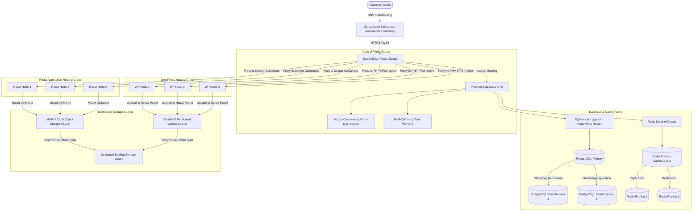

### 1.1 Server Topology Phases

#### Phase 1: Co-located MVP (1 to 100 Customers)
A single high-specification bare-metal VPS server hosts all services: Next.js frontend dashboard, Express.js API, PostgreSQL database instance, Redis server, and a limited set of local Docker containers (React sites) and local PHP-FPM pools (WordPress sites). System resources are shared, partition constraints are local, and failover is manual.

#### Phase 2: Dedicated Node Groups (100 to 1,000 Customers)
The platform server is isolated from the customer workloads. Dedicated VPS instances are added to act as specialized agents:
- **React Node Group:** Hosting client React/Vite/Next.js applications inside isolated Docker containers.
- **WordPress Node Group:** Hosting client WordPress sites with localized Nginx, PHP-FPM, and MariaDB containers.
- **Central Core:** The Platform API, main PostgreSQL database, and Redis instances remain co-located on a dedicated system management server.

#### Phase 3: Fully Distributed Elastic Fabric (1,000+ Customers)
Every layer is fully decoupled and clustered. All state and cache are separated from the execution nodes. Shared physical storage utilizes replicated filesystems, database replication is continuous, and load balancing occurs at the hardware edge or network edge via BGP Anycast and Keepalived.

---

### 1.2 React Hosting Node Group Architecture

React nodes serve client static web content and Node.js SSR (Next.js/Astro) applications. 

#### React Node Topology:
- **Execution Environment:** Ubuntu Minimal 24.04 LTS.
- **Runtime Engine:** Docker Daemon running with `systemd` driver.
- **Proxy Layer:** Local Traefik edge instance listening on ports 80/443. Traefik interfaces directly with the local Docker daemon socket via the Docker provider. It watches container labels to dynamically build routing tables:
  ```yaml
  # Sample dynamic docker labels for a customer Next.js deployment
  labels:
    - "traefik.enable=true"
    - "traefik.http.routers.custapp-123.rule=Host(`clientdomain.com`)"
    - "traefik.http.routers.custapp-123.entrypoints=websecure"
    - "traefik.http.routers.custapp-123.tls.certresolver=openprovider"
    - "traefik.http.services.custapp-123.loadbalancer.server.port=3000"
  ```
- **Local Cache:** Nginx acts as an edge asset cache for static images and styles on each React node to minimize application container hits.

#### Traefik Dynamic Configuration Sample (`/etc/traefik/dynamic_config.yml`):
```yaml
http:
  routers:
    platform-router:
      rule: "Host(`dashboard.itbengal.com`)"
      entryPoints:
        - "websecure"
      service: "platform-api-service"
      tls:
        certResolver: "openprovider-dns"
      middlewares:
        - "rate-limiter"
        - "security-headers"

  services:
    platform-api-service:
      loadBalancer:
        servers:
          - url: "http://10.100.1.2:8000"
          - url: "http://10.100.1.3:8000"
        healthCheck:
          path: "/health"
          interval: "10s"
          timeout: "3s"

  middlewares:
    rate-limiter:
      rateLimit:
        average: 100
        burst: 200
    security-headers:
      headers:
        sslRedirect: true
        forceSTSHeader: true
        stsSeconds: 31536000
        contentTypeNosniff: true
        browserXssFilter: true
        referrerPolicy: "same-origin"
        contentSecurityPolicy: "default-src 'self' 'unsafe-inline' https://fonts.googleapis.com"
```

---

### 1.3 WordPress Hosting Node Group Architecture

WordPress nodes host PHP, Nginx, and MariaDB. Unlike static React apps, WordPress relies on database persistence and local directory structure modifications (`wp-content/uploads`).

#### WordPress Node Topology:
- **Local Isolation Model:** Each WordPress site operates in its own dedicated Linux Namespace/Docker container context.
- **Engine Components:**
  - **Nginx Container:** Handles static assets, enforces security rules, and proxies dynamic requests to PHP-FPM.
  - **PHP-FPM Container:** Isolated execution pool running under a non-privileged Linux user, limited via cgroups.
  - **Local Helper Database Container (MariaDB):** Running inside the same bridge network as Nginx and PHP-FPM.
- **Dynamic Configuration Mapping:** The platform core dynamically pushes Nginx virtual host files and database configurations to the active agent.

#### Nginx WordPress Virtual Host Configuration Template:
```nginx
# /etc/nginx/sites-available/wp-template.conf
server {
    listen 80;
    server_name client-domain.com;
    root /var/www/html/wordpress;
    index index.php index.html index.htm;

    client_max_body_size 64M;

    # FastCGI caching parameters
    set $skip_cache 0;
    if ($request_method = POST) { set $skip_cache 1; }
    if ($query_string != "") { set $skip_cache 1; }
    if ($request_uri ~* "/wp-admin/|/xmlrpc.php|wp-.*.php|/feed/|index.php|sitemap(_index)?.xml") { set $skip_cache 1; }
    if ($http_cookie ~* "comment_author|wordpress_[a-f0-9]+|wp-postpass|wordpress_no_cache|wordpress_logged_in") { set $skip_cache 1; }

    location / {
        try_files $uri $uri/ /index.php?$args;
    }

    location ~ \.php$ {
        try_files $uri =404;
        fastcgi_split_path_info ^(.+\.php)(/.+)$;
        fastcgi_pass unix:/var/run/php/php8.3-fpm-client.sock;
        fastcgi_index index.php;
        include fastcgi_params;
        fastcgi_param SCRIPT_FILENAME $document_root$fastcgi_script_name;
        fastcgi_param PATH_INFO $fastcgi_path_info;
        
        # Caching logic
        fastcgi_cache WORDPRESS;
        fastcgi_cache_bypass $skip_cache;
        fastcgi_no_cache $skip_cache;
        fastcgi_cache_valid 200 301 302 1h;
        fastcgi_cache_use_stale error timeout invalid_header http_500;
        add_header X-FastCGI-Cache $upstream_cache_status;
    }

    location ~* \.(js|css|png|jpg|jpeg|gif|ico|svg|woff|woff2)$ {
        expires max;
        log_not_found off;
        access_log off;
    }

    # Security rules
    location ~* \.(bak|conf|dist|fla|in[ci]|log|psd|sh|sql|sw[op])$ {
        deny all;
    }
}
```

---

### 1.4 Dedicated Primary-Replica PostgreSQL Clusters

To handle tens of thousands of platform operations, API calls, and audit logs, the system database uses a highly available, replicated architecture.

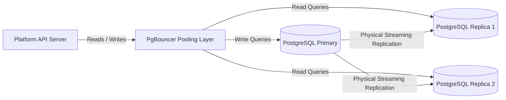

- **PgBouncer Connection Pooling:** PgBouncer is deployed on each API server instance using **Transaction Pooling Mode** to minimize connection overhead.
  ```ini
  # /etc/pgbouncer/pgbouncer.ini
  [databases]
  itbengal_primary = host=10.10.1.10 port=5432 dbname=itbengal auth_user=bouncerpool
  itbengal_replica = host=10.10.1.11 port=5432 dbname=itbengal auth_user=bouncerpool

  [pgbouncer]
  logfile = /var/log/postgresql/pgbouncer.log
  pidfile = /var/run/postgresql/pgbouncer.pid
  listen_addr = *
  listen_port = 6432
  auth_type = scram-sha-256
  auth_file = /etc/pgbouncer/userlist.txt
  pool_mode = transaction
  max_client_conn = 10000
  default_pool_size = 50
  reserve_pool_size = 5
  reserve_pool_timeout = 5
  ```
  
  ```
  # /etc/pgbouncer/userlist.txt
  "bouncerpool" "SCRAM-SHA-256$4096:7x...=="
  "itbengal_app" "SCRAM-SHA-256$4096:1y...=="
  ```
- **Replication Strategy:** Physical streaming replication (asynchronous) with a maximum lag threshold of 10MB data generation.
- **Promotion & Cluster Management:** Managed by Patroni utilizing a Consul-backed Distributed Consensus Store (DCS) to monitor primary server health and coordinate failovers without split-brain issues.

---

### 1.5 Redis Sentinel Cache and Queue Architecture

Redis manages cache, session stores, rate-limiting, and BullMQ background queues.

#### Deployment Topology:
- Three dedicated Redis VPS instances running Redis Sentinel.
- Sentinel instances monitor the master Redis server and coordinate automatic failover.

#### Redis Sentinel Configuration:
```ini
# /etc/redis/sentinel.conf
port 26379
daemonize yes
pidfile /var/run/redis-sentinel.pid
logfile /var/log/redis/sentinel.log
dir /var/lib/redis/sentinel
sentinel monitor itbengal-redis-master 10.10.2.10 6379 2
sentinel auth-pass itbengal-redis-master SuperSecureRedisPassword123!
sentinel down-after-milliseconds itbengal-redis-master 5000
sentinel failover-timeout itbengal-redis-master 10000
sentinel parallel-syncs itbengal-redis-master 1
```

---

### 1.6 Distributed Storage (GlusterFS & Ceph) Topology

To achieve seamless failover of WordPress nodes without losing uploaded media files, a distributed replicated filesystem is used.

- **GlusterFS Replicated Volume:** Deployed across all WordPress nodes.
  - Three brick storage servers form a `replica 3` volume, preventing split-brain states.
  - **Volume Mount Path:** `/mnt/wp-storage/`
  - All WordPress containers map `/mnt/wp-storage/<site_uuid>/wp-content/uploads` inside the container.
  
  ```
  # /etc/fstab entry on WordPress Nodes for auto-mounting GlusterFS
  10.100.3.10:/wp-volume /mnt/wp-storage glusterfs defaults,_netdev,backup-volfile-servers=10.100.3.11:10.100.3.12 0 0
  ```
- **Ceph Object Storage Cluster:** Serves build caches and deployment ZIP bundles for React application nodes. Deployed on dedicated storage nodes running Ceph OSD, Ceph Monitor, and Ceph RGW (RADOS Gateway) exposing an S3-compatible API.

---

### 1.7 Backup Storage Vaults

A dedicated cluster of high-capacity storage servers act as backup vaults.
- **Access Protocol:** MinIO S3 API over wire-encrypted TLS.
- **Replication:** Offsite backup servers run continuous `rclone` sync jobs every night, transporting encrypted backup archives from the main vault to a separate physical data center.
- **Retention Rules:** GFS (Grandfather-Father-Son) backup retention policy (7 daily, 4 weekly, 12 monthly).

---

## 2. Node Registration, Security Handshakes & Discovery

Adding a new VPS to the ITBengal hosting network must be automated, secure, and auditable.

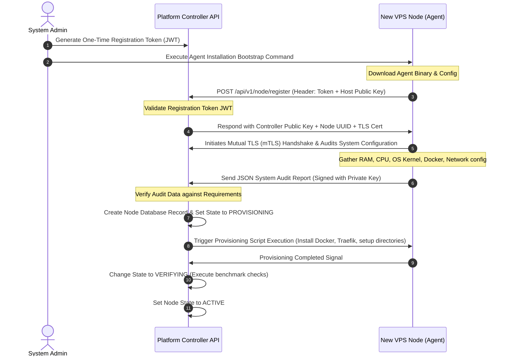

### 2.1 Multi-Step Node Registration Protocol

1. **Token Generation:** The platform administrator generates an ephemeral, cryptographically signed JWT via the Admin Dashboard. The token contains the target node group assignment (`node_group: react` or `node_group: wordpress`) and an expiration limit of 1 hour.
2. **Bootstrap Script:** The admin runs the bootstrap script on the clean VPS instance:
   ```bash
   curl -sSL https://get.itbengal.com/install-agent.sh | bash -s -- \
     --controller https://api.itbengal.com \
     --token eyJhbGciOiJIUzI1NiIsInR5cCI6IkpXVCJ9...
   ```
3. **Cryptographic Exchange:** The agent generates an Ed25519 keypair for identity. It sends its public key to the Platform Controller.
4. **Mutual TLS (mTLS) Establishment:** The controller verifies the registration token, issues a node-specific TLS client certificate signed by the platform’s private Root CA, and establishes a secure gRPC control channel.

#### Node Bootstrap Script (`install-agent.sh`):
```bash
#!/usr/bin/env bash
set -eo pipefail

CONTROLLER_URL=""
REG_TOKEN=""
NODE_GROUP=""

while [[ "$#" -gt 0 ]]; do
    case $1 in
        --controller) CONTROLLER_URL="$2"; shift ;;
        --token) REG_TOKEN="$2"; shift ;;
        --group) NODE_GROUP="$2"; shift ;;
        *) echo "Unknown parameter passed: $1"; exit 1 ;;
    esac
    shift
done

if [[ -z "$CONTROLLER_URL" || -z "$REG_TOKEN" || -z "$NODE_GROUP" ]]; then
    echo "Usage: install-agent.sh --controller <url> --token <token> --group <react|wordpress>"
    exit 1
fi

echo "==> Initiating ITBengal Agent Bootstrap..."

# 1. System checks
if [[ "$EUID" -ne 0 ]]; then
   echo "Error: Please run as root."
   exit 1
fi

# 2. Key Generation
mkdir -p /etc/itbengal-agent/keys
mkdir -p /etc/itbengal-agent/certs
if [ ! -f /etc/itbengal-agent/keys/node_identity ]; then
    ssh-keygen -t ed25519 -N "" -f /etc/itbengal-agent/keys/node_identity
fi
PUB_KEY=$(cat /etc/itbengal-agent/keys/node_identity.pub)

# 3. Request registration to controller API
payload=$(cat <<EOF
{
  "node_group": "$NODE_GROUP",
  "public_key": "$PUB_KEY"
}
EOF
)

echo "==> Registering with Controller..."
response=$(curl -s -X POST \
  -H "Content-Type: application/json" \
  -H "Authorization: Bearer $REG_TOKEN" \
  -d "$payload" \
  "$CONTROLLER_URL/api/v1/nodes/register")

NODE_UUID=$(echo "$response" | grep -oP '"node_uuid":"\K[^"]+')
CA_CERT=$(echo "$response" | grep -oP '"ca_cert":"\K[^"]+')
CLIENT_CERT=$(echo "$response" | grep -oP '"client_cert":"\K[^"]+')

echo "$CA_CERT" | sed 's/\\n/\n/g' > /etc/itbengal-agent/certs/ca.crt
echo "$CLIENT_CERT" | sed 's/\\n/\n/g' > /etc/itbengal-agent/certs/agent.crt

# Save core configuration
cat <<EOF > /etc/itbengal-agent/agent-config.yaml
controller_url: "$CONTROLLER_URL"
node_uuid: "$NODE_UUID"
node_group: "$NODE_GROUP"
private_key_path: "/etc/itbengal-agent/keys/node_identity"
EOF

# 4. Install Service
echo "==> Creating Systemd Service File..."
cat <<EOF > /etc/systemd/system/itbengal-agent.service
[Unit]
Description=ITBengal Node Agent Daemon
After=network.target

[Service]
Type=simple
User=root
WorkingDirectory=/etc/itbengal-agent
ExecStart=/usr/local/bin/itbengal-agent-daemon
Restart=always
RestartSec=5
LimitNOFILE=65536

[Install]
WantedBy=multi-user.target
EOF

systemctl daemon-reload
systemctl enable itbengal-agent.service
echo "==> Registration Complete. Node UUID: $NODE_UUID"
```

---

### 2.2 Cryptographic Security Key Exchange

The agent configuration directory holds the cryptographic keys:

```
/etc/itbengal-agent/
├── certs/
│   ├── ca.crt          # Platform Root Certificate
│   ├── agent.crt       # Node-specific Certificate signed by Root CA
│   └── agent.key       # Node-specific Private Key (chmod 600)
├── keys/
│   ├── node_identity   # Ed25519 Private Key
│   └── node_identity.pub
└── agent-config.yaml   # Contains Node UUID, controller endpoint, metadata
```

All payloads sent between the Agent and the Platform Controller must be signed using the Agent's private key (`node_identity`) and verified using the corresponding public key registered in the platform database.

---

### 2.3 Automated System Configuration & Security Audit Checklist

Before transitioning a node from `PROVISIONING` to `VERIFYING`, the Agent executes a system audit script to ensure compliance with the following baselines:

| Audit Parameter | Required Baseline | Verification Command | Action on Failure |
| :--- | :--- | :--- | :--- |
| **Operating System** | Ubuntu Server 24.04 LTS | `lsb_release -rs` | Reject registration |
| **Kernel Version** | Linux >= 6.8.0 | `uname -r` | Log warning; attempt update |
| **Docker Engine** | Docker CE >= 26.0 | `docker --version` | Install dynamically |
| **RAM Capacity** | Minimum 4GB (WordPress) / 8GB (React) | `free -b` | Flag node as `DEGRADED` |
| **Storage Allocation** | Minimum 100GB SSD/NVMe | `df --output=target,size /var` | Flag node as `DEGRADED` |
| **Firewall Rules** | UFW active; Port 22, 80, 443, 26379 open | `ufw status` | Apply standard firewall profile |
| **File Descriptors** | `nofile` limit set to 65535 | `ulimit -n` | Append limits to `/etc/security/limits.conf` |

---

### 2.4 Network, NAT, and Private Subnet Allocation

To keep client databases secure and isolated, all nodes exist in a dual-network configuration:
1. **Public Interface (`eth0`):** Exposes ports 80/443 for public web traffic routing, and port 22 (restricted by IP whitelist) for remote ssh.
2. **Private Interface (`eth1`):** Connected to a secure, isolated Virtual Private Network (WireGuard mesh network managed by the controller). This private network runs on the `10.100.0.0/16` range.
   - Platform API is bound to `10.100.1.1`.
   - Node agent gRPC service binds strictly to `eth1`.
   - All internal node-to-node and node-to-database communication bypasses the public internet completely.

---

### 2.5 Node State Machine & Lifecycle Transitions

Nodes transition through defined lifecycle states to prevent scheduling workloads on unstable hardware.

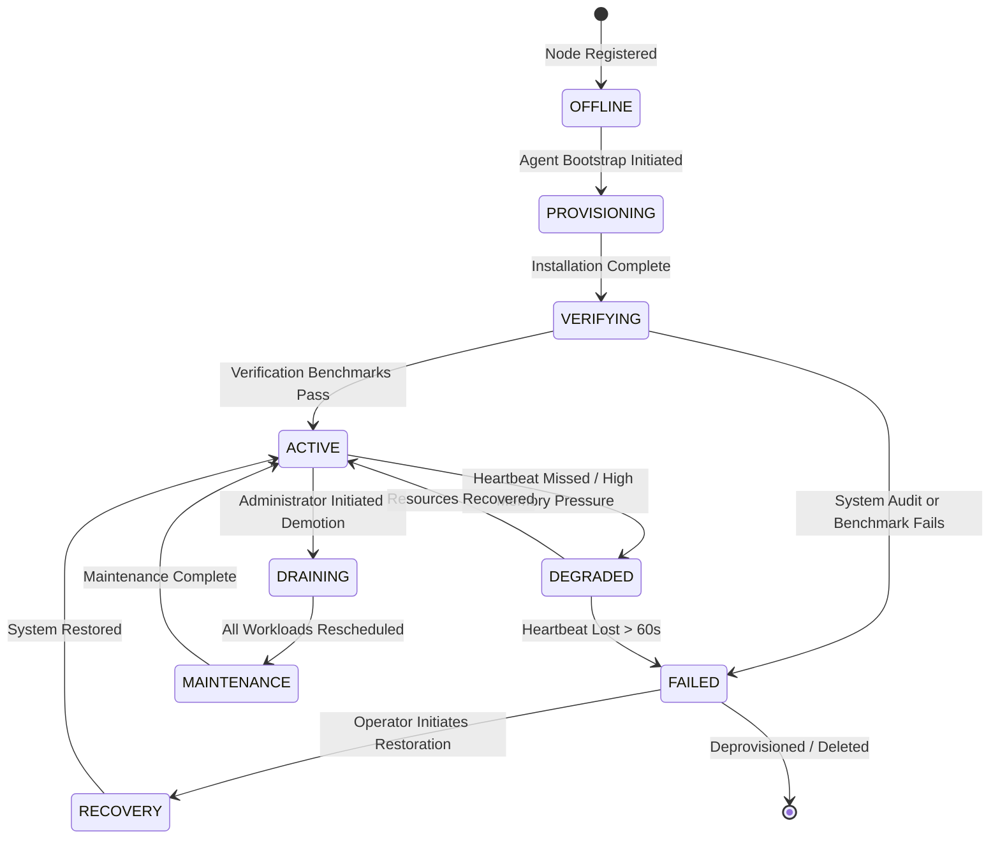

- **Transitions Trigger Details:**
  - `ACTIVE` -> `DEGRADED`: Occurs when CPU load average exceeds $4 \times \text{Core Count}$ for 5 minutes, or disk usage exceeds 85%. No new containers scheduled.
  - `ACTIVE` -> `DRAINING`: Prevents new container deployments on the node. The scheduler begins gracefully migrating existing workloads to alternate nodes in the cluster.
  - `DEGRADED` -> `FAILED`: Occurs if the health checks fail repeatedly or if the agent loses communication for more than 60 seconds. Triggering automatic failover workflows.

---

## 3. Node Agent Heartbeats & Metrics Collection Specification

A lightweight daemon (`itbengal-agent`) runs on every node, collecting system health, metrics, and state details. It operates on a push model, pushing data over a persistent HTTP/2 (gRPC) connection to the Platform Controller.

### 3.1 Heartbeat Protocol and Payload Specification

Heartbeats occur every **10 seconds** for high-resolution health tracking.

#### Sample JSON Heartbeat Payload:
```json
{
  "node_uuid": "f81d4fae-7dec-11d0-a765-00a0c91e6bf6",
  "agent_version": "v1.4.2-stable",
  "timestamp": "2026-07-04T11:15:30.402Z",
  "sequence_id": 94821,
  "system_state": {
    "status": "HEALTHY",
    "uptime_seconds": 1209600,
    "load_average": [1.42, 0.98, 0.75]
  },
  "metrics": {
    "cpu": {
      "user_percent": 18.2,
      "system_percent": 4.1,
      "idle_percent": 76.9,
      "iowait_percent": 0.8
    },
    "memory": {
      "total_bytes": 17179869184,
      "used_bytes": 6871947673,
      "free_bytes": 2147483648,
      "cached_bytes": 8160437863
    },
    "disk": {
      "total_bytes": 214748364800,
      "used_bytes": 107374182400,
      "write_iops": 450,
      "read_iops": 120,
      "write_latency_ms": 1.2
    },
    "network": {
      "interface": "eth0",
      "rx_bytes_per_sec": 4194304,
      "tx_bytes_per_sec": 8388608,
      "active_connections": 1420
    }
  },
  "containers": {
    "total_running": 14,
    "total_stopped": 2,
    "details": [
      {
        "container_id": "c39a38f328fa",
        "app_uuid": "app-react-9003",
        "cpu_usage_percent": 2.4,
        "memory_usage_bytes": 157286400,
        "network_rx_bytes": 838860,
        "network_tx_bytes": 1258291,
        "status": "running"
      },
      {
        "container_id": "a92b87f223cd",
        "app_uuid": "app-wp-5502",
        "cpu_usage_percent": 0.1,
        "memory_usage_bytes": 268435456,
        "network_rx_bytes": 1048576,
        "network_tx_bytes": 4194304,
        "status": "running"
      }
    ]
  },
  "signature": "MEQCIF98dG...[cryptographic signature verifying payload identity]"
}
```

#### JSON Schema Definition for Validate Heartbeat Payload (`heartbeat-schema.json`):
```json
{
  "$schema": "http://json-schema.org/draft-07/schema#",
  "title": "NodeHeartbeat",
  "type": "OBJECT",
  "properties": {
    "node_uuid": { "type": "STRING", "format": "uuid" },
    "agent_version": { "type": "STRING" },
    "timestamp": { "type": "STRING", "format": "date-time" },
    "sequence_id": { "type": "INTEGER", "minimum": 0 },
    "system_state": {
      "type": "OBJECT",
      "properties": {
        "status": { "type": "STRING", "enum": ["HEALTHY", "DEGRADED", "FAILED", "MAINTENANCE"] },
        "uptime_seconds": { "type": "INTEGER" },
        "load_average": {
          "type": "ARRAY",
          "items": { "type": "NUMBER" },
          "minItems": 3,
          "maxItems": 3
        }
      },
      "required": ["status", "uptime_seconds", "load_average"]
    },
    "metrics": {
      "type": "OBJECT",
      "properties": {
        "cpu": {
          "type": "OBJECT",
          "properties": {
            "user_percent": { "type": "NUMBER" },
            "system_percent": { "type": "NUMBER" },
            "idle_percent": { "type": "NUMBER" },
            "iowait_percent": { "type": "NUMBER" }
          },
          "required": ["user_percent", "system_percent", "idle_percent"]
        },
        "memory": {
          "type": "OBJECT",
          "properties": {
            "total_bytes": { "type": "INTEGER" },
            "used_bytes": { "type": "INTEGER" },
            "free_bytes": { "type": "INTEGER" },
            "cached_bytes": { "type": "INTEGER" }
          },
          "required": ["total_bytes", "used_bytes"]
        },
        "disk": {
          "type": "OBJECT",
          "properties": {
            "total_bytes": { "type": "INTEGER" },
            "used_bytes": { "type": "INTEGER" },
            "write_iops": { "type": "INTEGER" },
            "read_iops": { "type": "INTEGER" }
          },
          "required": ["total_bytes", "used_bytes"]
        }
      },
      "required": ["cpu", "memory", "disk"]
    },
    "signature": { "type": "STRING" }
  },
  "required": ["node_uuid", "timestamp", "sequence_id", "system_state", "metrics", "signature"]
}
```

---

### 3.2 Telemetry Metrics Frequencies & Resolution

- **System Heartbeats (State & Basic Load):** 10-second intervals.
- **Detailed Resource Telemetry (CPU/RAM details, Disk IOPS, Network Interfaces):** 30-second intervals.
- **Log Buffering & Shipping:** Logs from client applications are buffered locally and shipped in chunks every 5 seconds (or immediately when the buffer reaches 64KB).

---

### 3.3 Aggregation & Ingestion Engine

To store metrics without degrading dashboard performance, the platform routes telemetry data away from the main PostgreSQL database.

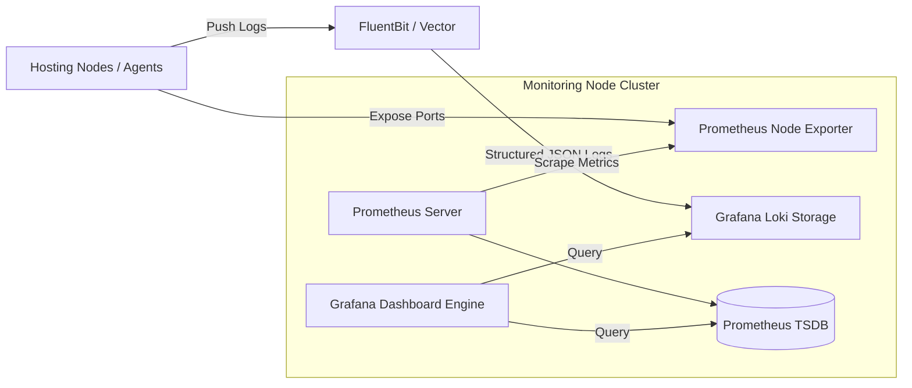

- **Logs Pipeline:** A lightweight agent runs Vector to forward Docker container log files to a central **Grafana Loki** cluster.
- **Metrics Pipeline:** Central Prometheus servers scrape metrics from `node_exporter` endpoints on the private network interfaces of the agents.
- **Alerting Engine:** Prometheus Alertmanager handles threshold alerts (e.g., node out of disk space) and routes payload webhooks directly to the Platform Controller API to trigger scaling or notification procedures.

#### Vector Log Shipping Configuration (`/etc/vector/vector.yaml`):
```yaml
sources:
  docker_logs:
    type: "docker_logs"
    exclude_containers:
      - "vector"
      - "node-exporter"

transforms:
  parse_json:
    type: "remap"
    inputs:
      - "docker_logs"
    source: |
      .parsed, err = parse_json(.message)
      if err == null {
        . = merge(., .parsed)
      }
      .node_uuid = "${NODE_UUID}"

sinks:
  loki_sink:
    type: "loki"
    inputs:
      - "parse_json"
    endpoint: "http://10.100.4.10:3100"
    labels:
      node_uuid: "{{ node_uuid }}"
      container_name: "{{ container_name }}"
      app_uuid: "{{ app_uuid }}"
    encoding:
      codec: "json"
```

---

## 4. Advanced Scheduling, Resource Allocation & Load Distribution

When a user triggers a deployment, the scheduler selects the target hosting node. To prevent server saturation and optimize server costs, ITBengal uses a scoring scheduling system.

### 4.1 Multi-Variable Server Selection Scoring Algorithm

The scheduler selects the node that scores the highest for the specific application type.

#### The Score Formulation:
$$Score_n = (w_{cpu} \times CPU^{free}_{n}) + (w_{ram} \times RAM^{free}_{n}) + (w_{disk} \times Disk^{free}_{n}) - (w_{density} \times \frac{C^{active}_{n}}{C^{max}_{n}}) - P_{app} + G_{latency}$$

Where:
- $Score_n$: Final score of Node $n$. The scheduler deploys the site on the node with the highest score.
- $CPU^{free}_{n}$: Normalized available CPU power on Node $n$ (percentage of idle CPU capacity).
- $RAM^{free}_{n}$: Normalized available RAM capacity on Node $n$ (free bytes divided by total bytes).
- $Disk^{free}_{n}$: Normalized free disk space ratio.
- $C^{active}_{n} / C^{max}_{n}$: Container density factor. $C^{active}_{n}$ is the count of currently running containers on the node; $C^{max}_{n}$ is the maximum container density configuration for the node’s hardware class.
- $P_{app}$: App-specific density penalty. If the node already hosts a resource-intensive app belonging to the same organization, a penalty is applied to avoid placing a customer's entire stack on a single server.
- $G_{latency}$: Geographic latency weight. Priority is given to nodes geographically closer to the target end-users or with better connectivity interfaces.

#### Scheduling Weights Matrix:
| Parameter | React Deployment Weight | WordPress Deployment Weight | Description |
| :--- | :--- | :--- | :--- |
| $w_{cpu}$ | 0.35 | 0.20 | React node builds require CPU burst power; WordPress requires stable but lower baseline CPU. |
| $w_{ram}$ | 0.25 | 0.45 | PHP processes are memory-intensive. Memory allocation is critical for WordPress stability. |
| $w_{disk}$ | 0.10 | 0.20 | WordPress writes dynamic media uploads to disk; React relies on external object storage. |
| $w_{density}$ | 0.30 | 0.15 | Penalizes nodes with too many active containers to prevent port exhaustion and context-switching overhead. |

#### Complete TypeScript Schedular Implementation (`NodeScheduler.ts`):
```typescript
import { Client } from 'pg';
import Redis from 'ioredis';

interface ServerNode {
  uuid: string;
  ip_address: string;
  node_group: 'react' | 'wordpress';
  cpu_cores: number;
  max_container_density: number;
}

interface NodeMetrics {
  cpuPercentFree: number;
  ramPercentFree: number;
  diskPercentFree: number;
  activeContainersCount: number;
}

export class NodeScheduler {
  private db: Client;
  private redis: Redis;

  constructor(dbClient: Client, redisClient: Redis) {
    this.db = dbClient;
    this.redis = redisClient;
  }

  public async selectOptimalNode(appType: 'react' | 'wordpress', orgId: string): Promise<ServerNode> {
    // 1. Fetch eligible active nodes
    const query = `
      SELECT uuid, ip_address, node_group, cpu_cores, max_container_density 
      FROM server_nodes 
      WHERE status = 'ACTIVE' AND node_group = $1;
    `;
    const res = await this.db.query(query, [appType]);
    const eligibleNodes: ServerNode[] = res.rows;

    if (eligibleNodes.length === 0) {
      throw new Error(`No active nodes available for group: ${appType}`);
    }

    let optimalNode: ServerNode | null = null;
    let highestScore = -Infinity;

    // Define weights based on app type
    const weights = {
      cpu: appType === 'react' ? 0.35 : 0.20,
      ram: appType === 'react' ? 0.25 : 0.45,
      disk: appType === 'react' ? 0.10 : 0.20,
      density: appType === 'react' ? 0.30 : 0.15,
    };

    for (const node of eligibleNodes) {
      // 2. Fetch runtime metrics from Redis Cache (populated by Agent heartbeats)
      const metricKey = `node:metrics:${node.uuid}`;
      const metricsData = await this.redis.hgetall(metricKey);

      if (!metricsData || Object.keys(metricsData).length === 0) {
        continue; // Skip node if heartbeat missing
      }

      const cpuUsed = parseFloat(metricsData.cpuUsedPercent || '0');
      const ramTotal = parseInt(metricsData.ramTotalBytes || '1', 10);
      const ramUsed = parseInt(metricsData.ramUsedBytes || '0', 10);
      const diskTotal = parseInt(metricsData.diskTotalBytes || '1', 10);
      const diskUsed = parseInt(metricsData.diskUsedBytes || '0', 10);
      const activeContainers = parseInt(metricsData.containerCount || '0', 10);

      // Safeguard: Check hard OOM limits
      const ramFreePercent = (ramTotal - ramUsed) / ramTotal;
      if (ramFreePercent < 0.15) continue; // Exclude node if < 15% RAM free

      const diskFreePercent = (diskTotal - diskUsed) / diskTotal;
      if (diskFreePercent < 0.10) continue; // Exclude node if < 10% disk free

      const cpuFreePercent = (100 - cpuUsed) / 100;

      // 3. Compute target organization node clustering penalty
      const checkCoLocationQuery = `
        SELECT COUNT(*) as count 
        FROM applications 
        WHERE node_uuid = $1 AND organization_id = $2;
      `;
      const coLocCheck = await this.db.query(checkCoLocationQuery, [node.uuid, orgId]);
      const coLocatedCount = parseInt(coLocCheck.rows[0].count, 10);
      const colocationPenalty = coLocatedCount * 0.15; // 15% score deduction per local client service

      // 4. Scoring Logic
      const score = 
        (weights.cpu * cpuFreePercent) +
        (weights.ram * ramFreePercent) +
        (weights.disk * diskFreePercent) -
        (weights.density * (activeContainers / node.max_container_density)) -
        colocationPenalty;

      if (score > highestScore) {
        highestScore = score;
        optimalNode = node;
      }
    }

    if (!optimalNode) {
      throw new Error("No node met the deployment threshold requirements.");
    }

    return optimalNode;
  }
}
```

---

### 4.2 RAM/CPU Thresholds, Hard/Soft Limits, and CGroups Throttling

To prevent a single user application from crashing a shared VPS, strict isolation limits are enforced at the Linux container level.

#### Limits Schema by Pricing Plan:

```yaml
plans:
  react:
    starter:
      cpu_shares: 256             # Equivalent to 0.25 vCPU limit
      cpu_quota_us: 25000         # 25ms run time limit out of 100ms
      memory_limit_bytes: 268435456 # 256MB Hard Limit
      memory_reservation: 134217728 # 128MB Soft Limit (guaranteed allocation)
      io_weight: 100              # Low I/O priority
    business:
      cpu_shares: 2048            # 2.0 vCPU limit
      cpu_quota_us: 200000        # Max execution time
      memory_limit_bytes: 2147483648 # 2GB Hard Limit
      memory_reservation: 1073741824 # 1GB Soft Limit
      io_weight: 500              # Standard I/O priority
```

- **Hard Limits (Memory Limit):** If the application exceeds the hard memory limit, the Linux kernel Out-Of-Memory (OOM) killer terminates the specific process, and the agent restarts the container, logging an `OOMKilled` state.
- **Soft Limits (Memory Reservation):** Allows the system to run densely populated nodes. If free memory becomes scarce, the system reclaims memory from containers exceeding their reservation values.

---

### 4.3 Connection Pooling & Middleware

At thousands of clients, handling database connections without pooling leads to file descriptor limits and high memory usage.

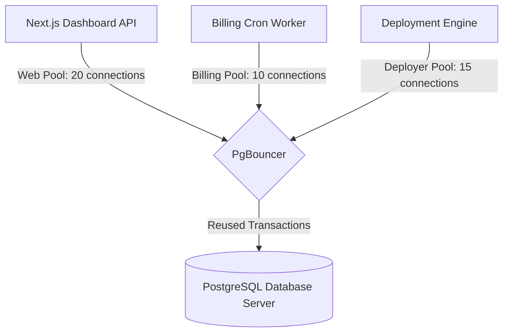

- **PgBouncer Implementation Details:**
  - Deployed in transaction mode to allow many client connections to be multiplexed over a few persistent server connections.
  - Set `max_client_conn` to `10000`.
  - Set `default_pool_size` to `50` per database instance on the target server.
- **Express.js Client Connection Pool:**
  - Utilizing `pg` library connection settings:
    ```javascript
    const pool = new Pool({
      connectionString: process.env.DATABASE_URL,
      max: 20,                       // Match pool sizing allocations
      idleTimeoutMillis: 30000,
      connectionTimeoutMillis: 2000,
    });
    ```

---

### 4.4 Queue Architecture & Job Routing (BullMQ)

Platform jobs (deployments, backups, SSL registrations, domain syncs) are managed using BullMQ, backed by Redis.

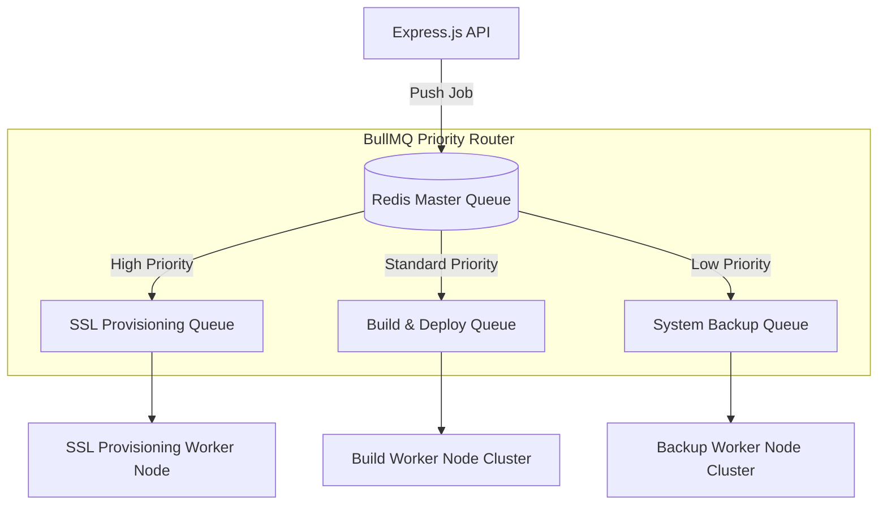

- **Queue Isolation:** Distinct worker processes run in separate namespaces, ensuring a large backup task does not block a customer's urgent web deployment.
- **Priority Rules:**
  - Priority 1: User-initiated instant SSL generation / Application Restart commands.
  - Priority 2: Git push deployment builds.
  - Priority 3: Automated nightly database and file backups.

#### Job Queues Sizing & Configuration Parameters:
| Queue Name | Concurrency Limit | Max Retries | Backoff Strategy | Job Retention Time |
| :--- | :--- | :--- | :--- | :--- |
| **ssl-generation** | 20 jobs/worker | 5 | Exponential (1000ms delay) | 24 Hours |
| **deployment-build** | 2 jobs/worker | 2 | Fixed (5000ms delay) | 7 Days |
| **system-backup** | 1 job/worker | 3 | Exponential (30000ms delay)| 30 Days |
| **domain-sync** | 5 jobs/worker | 10 | Exponential (5000ms delay) | 3 Days |

---

## 5. Automatic Failover Procedures & Disaster Recovery Workflows

To ensure high availability, ITBengal implements automated recovery protocols for individual service and node failures.

### 5.1 Platform Master Failover

The Platform Master Server hosts the system database and core API endpoints. High availability is achieved using active-passive hot standbys.

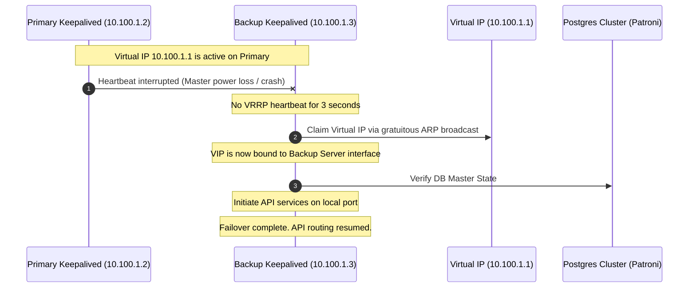

- **Dynamic IP Takeover (Keepalived & VRRP):**
  - Two master controller nodes share a Virtual IP address (`10.100.1.1`).
  - Keepalived running on both nodes broadcasts VRRP packets every 1 second.
  - If the primary master misses three heartbeats, the backup node binds the virtual IP to its network card and broadcasts a gratuitous ARP message to update network switches.

#### Keepalived Configuration for Platform Master (`/etc/keepalived/keepalived.conf`):
```ini
# Keepalived Master Node Configuration
vrrp_script check_platform_api {
    script "/usr/local/bin/check_api_health.sh"
    interval 2
    weight 2
}

vrrp_instance VI_1 {
    state MASTER
    interface eth1
    virtual_router_id 51
    priority 101
    advert_int 1
    authentication {
        auth_type PASS
        auth_pass ITBengVPSTrustSecretKey
    }
    virtual_ipaddress {
        10.100.1.1/24 dev eth1
    }
    track_script {
        check_platform_api
    }
}
```

#### Keepalived Configuration for Platform Backup Node:
```ini
vrrp_script check_platform_api {
    script "/usr/local/bin/check_api_health.sh"
    interval 2
    weight 2
}

vrrp_instance VI_1 {
    state BACKUP
    interface eth1
    virtual_router_id 51
    priority 100
    advert_int 1
    authentication {
        auth_type PASS
        auth_pass ITBengVPSTrustSecretKey
    }
    virtual_ipaddress {
        10.100.1.1/24 dev eth1
    }
    track_script {
        check_platform_api
    }
}
```

---

### 5.2 Database Master Crash Recovery & Promotion

When a PostgreSQL master server crashes, Patroni coordinates failover to prevent database corruption.

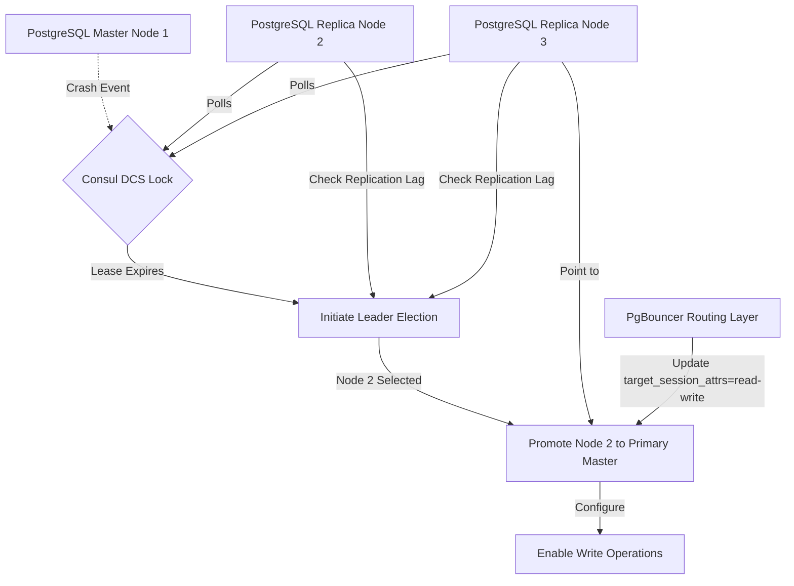

1. **Detection:** The primary Patroni daemon fails to renew its lease lock in the Consul DCS within the configured timeout (e.g., 10 seconds).
2. **Lock Expiry:** The leader key in Consul expires, triggering leader election among the remaining healthy read-replicas.
3. **Evaluation:** The replicas verify their replication lag. The replica with the smallest transaction log (WAL) lag is selected.
4. **Promotion:** Patroni promotes the selected replica by executing:
   ```sql
   SELECT pg_promote();
   ```
5. **Re-routing:** PgBouncer automatically detects the promotion using the dynamic connection parameter `target_session_attrs=read-write` and routes write transactions to the new master.

#### CLI Output Example of Patroni Cluster Promotion:
```
+ Cluster: itbengal-pg-cluster (74829374028) +----+-----------+
| Member    | Instance | Role    | State   | TL | Lag in MB |
+-----------+----------+---------+---------+----+-----------+
| pg-node-1 | 10.10.1.1| Replica | running |  1 |         0 |
| pg-node-2 | 10.10.1.2| Replica | running |  1 |         0 |
+-----------+----------+---------+---------+----+-----------+
INFO: Leader key /service/itbengal-pg-cluster/leader does not exist
INFO: Promoted member pg-node-1 to master (State: promoted)
```

---

### 5.3 React Node Crash & Container Rescheduling

If a React hosting node goes offline, its workloads are redeployed to other active nodes in the cluster.

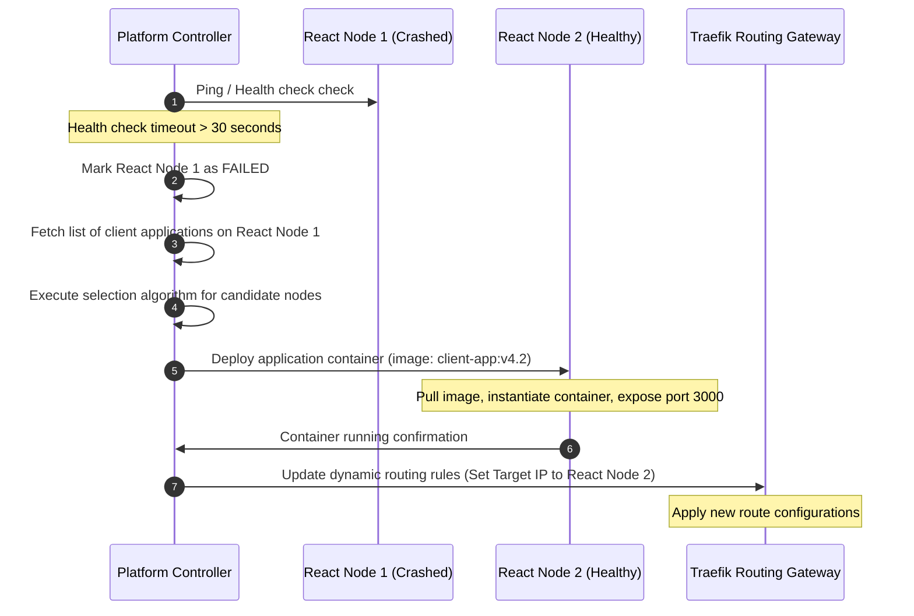

1. **State Isolation:** The controller marks the failed node as `FAILED`.
2. **Workload Rescheduling:** The controller queries the database for all apps on the failed node and identifies healthy candidate nodes using the scheduling algorithm.
3. **Container Creation:** The controller issues gRPC deployment orders to the target nodes, pulling the cached Docker images and environment configurations.
4. **Dynamic Routing Updates:** The controller pushes updated routing tables to the Traefik gateways, directing incoming HTTP requests to the new host IPs.

---

### 5.4 WordPress Node Crash & Dynamic Recovery

Because WordPress sites write dynamic files locally, recovering from a node failure requires restoring database states and file volumes.

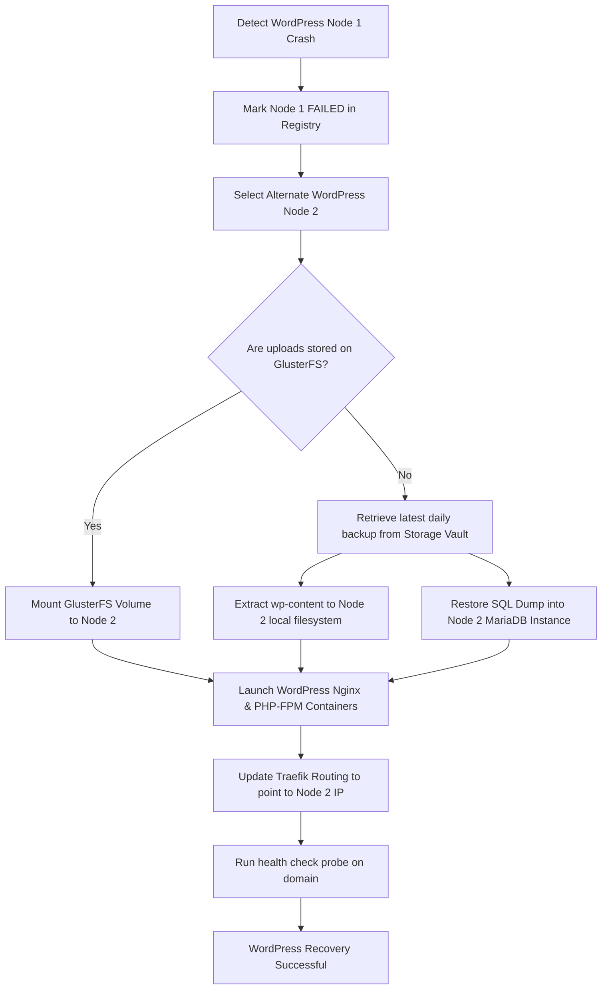

- **Replicated Directory Path Recovery:**
  - If GlusterFS is active, Node 2 mounts the site's network volume `/mnt/wp-storage/<site_uuid>`. No file downloads are needed.
  - If GlusterFS is unavailable, the agent downloads the latest daily backup archive (`wp-content-backup.tar.gz` and `db-backup.sql`) from the MinIO backup vault. It extracts the files and imports the SQL schema into the local MariaDB container.
- **Dynamic Routing:** Traefik is updated to route the customer’s domain to Node 2’s proxy port.

---

### 5.5 Network Partitions & Split-Brain Fencing

To prevent two nodes from acting as the active master database, the platform enforces network partitioning safety checks.

- **DCS Quorum Monitoring:** If a network partition divides the cluster, nodes on the minority side cannot verify consensus locks and automatically transition to read-only mode.
- **Hardware Fencing (Watchdog / STONITH):**
  - Node agents run a system daemon connected to the Linux kernel watchdog timer device `/dev/watchdog`.
  - If the agent loses network connectivity to the controller and the DCS cluster for over 30 seconds, it stops resetting the watchdog timer.
  - The kernel watchdog then resets the hardware, fencing the node and preventing write conflicts.

#### Watchdog Daemon Configuration (`/etc/watchdog.conf`):
```ini
# /etc/watchdog.conf configuration parameters
watchdog-device = /dev/watchdog
max-load-1 = 24
interface = eth1
ping = 10.100.1.1
realtime = yes
priority = 1
```

---

## 6. Capacity Planning, Benchmarking & Sharding Roadmap

To maintain platform stability as the client base grows, ITBengal monitors resource utilization metrics and plans system capacity upgrades in advance.

### 6.1 Saturation Indicators & Resource KPIs

The system monitoring stack continuously evaluates these metrics:

| Metric | Target Threshold | Critical Warning | System Action on Critical |
| :--- | :--- | :--- | :--- |
| **CPU Load Average** | $< 0.70 \times \text{Cores}$ | $> 0.90 \times \text{Cores}$ | Lock scheduling; scale CPU limits on containers |
| **Memory Pressure** | $< 70\%$ Used | $> 85\%$ Used | Evict non-essential caches; halt new deployments |
| **Disk I/O Latency** | $< 5\text{ms}$ | $> 20\text{ms}$ | Throttle container I/O weights; alert storage team |
| **TCP Connection Backlog**| $< 200$ | $> 1000$ | Trigger Traefik rate limit protection |
| **Disk Space Usage** | $< 75\%$ | $> 88\%$ | Initiate log cleaning; trigger storage expansion |

---

### 6.2 Automated Autoscaling Triggers & Benchmarks

When total resource utilization across a node group exceeds safety thresholds, the platform alerts administrators or initiates VPS provisioning API calls.

```
+-------------------------------------------------------------------+
|                   CLUSTER RESOURCE CONTROLLER                     |
+-------------------------------------------------------------------+
                                  |
            Scrapes total capacity metrics every 60s
                                  |
                                  v
                  +-------------------------------+
                  |  Memory / CPU Capacity Check  |
                  +-------------------------------+
                                  |
            Is average group memory usage > 80% for 15m?
                  |                               |
                 Yes                             No
                  |                               |
                  v                               v
    +---------------------------+   +---------------------------+
    | Provision New VPS Node    |   |    Maintain Current       |
    | Via VPS Provider API      |   |      Cluster State        |
    +---------------------------+   +---------------------------+
                  |
    +---------------------------+
    | Execute Bootstrap Agent   |
    | Script & Run System Audits|
    +---------------------------+
                  |
    +---------------------------+
    | Set New Node State: ACTIVE|
    +---------------------------+
```

- **React Cluster Scaling Rules:**
  - Trigger: Average CPU load across the React Node Group exceeds 75% for 15 consecutive minutes, or average memory usage exceeds 80%.
  - Action: Provision a new VPS node, run the bootstrap script, register the node, and add it to the active scheduler pool.
- **WordPress Cluster Scaling Rules:**
  - Trigger: Free space on the GlusterFS shared storage volume falls below 20%.
  - Action: Provision an additional storage brick server and extend the GlusterFS volume dynamically.

---

### 6.3 Load Testing & Benchmarking Protocols

Before adding any new node hardware template to production, it must pass a load test pipeline:
- **CPU & Memory Test (sysbench):**
  ```bash
  sysbench cpu --cpu-max-prime=20000 run
  sysbench memory --memory-block-size=1M --memory-total-size=10G run
  ```
- **Disk Performance Test (fio):** Test IOPS on the storage layer:
  ```bash
  fio --name=random-write --ioengine=posixaio --rw=randwrite --bs=4k --size=2g --numjobs=4 --iodepth=64 --runtime=60 --time_based --end_fsync=1
  ```
- **Network Interface Test (iperf3):** Verify network speeds to the database master and client proxies.
- **Platform Verification Benchmarks:** A test suite on the controller deploys a test React and WordPress application to the new node, runs HTTP request benchmarks using `k6`, and verifies routing updates. If the benchmark performance falls below the hardware baseline, the node registration is rejected.

#### Automated K6 Load Testing Script (`benchmark-app.js`):
```javascript
import http from 'k6/http';
import { check, sleep } from 'k6';

export const options = {
  stages: [
    { duration: '30s', target: 50 },  // Ramp up to 50 concurrent virtual users
    { duration: '1m', target: 100 },  // Hold at 100 users for 1 minute
    { duration: '30s', target: 0 },    // Ramp down to 0 users
  ],
  thresholds: {
    http_req_failed: ['rate<0.01'],    // Under 1% failures allowed
    http_req_duration: ['p(95)<250'],  // 95% of requests must complete under 250ms
  },
};

export default function () {
  const url = 'http://' + __ENV.TARGET_NODE_IP + '/health';
  const params = {
    headers: {
      'Host': 'benchmark-target.itbengal.local',
    },
  };
  const res = http.get(url, params);
  check(res, {
    'status is 200': (r) => r.status === 200,
    'body contains OK': (r) => r.body.includes('OK'),
  });
  sleep(0.5);
}
```

---

### 6.4 Database Sharding & Partitioning Roadmap

As the customer base grows past 10,000 active projects, a single database instance will bottleneck. ITBengal implements database partitioning and sharding.

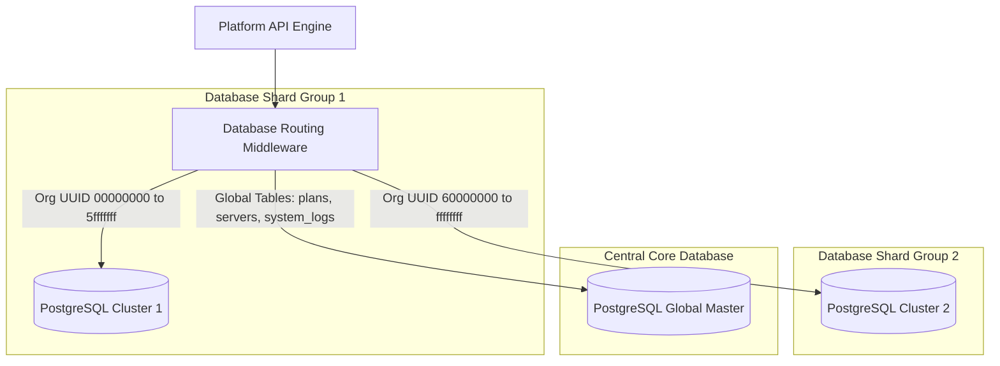

#### Step 1: Time-Based Table Partitioning (1,000 to 5,000 Projects)
- Tables that accumulate large volumes of historical logs (e.g., `audit_logs`, `deployment_logs`, `metrics_history`) are partitioned by time intervals using PostgreSQL declarative partitioning.
- Partition intervals are set to 7 days, managed automatically by `pg_partman`.
  ```sql
  -- Example partition creation script for deployment_logs
  CREATE TABLE deployment_logs (
      id BIGSERIAL,
      deployment_id VARCHAR(36) NOT NULL,
      log_content TEXT NOT NULL,
      created_at TIMESTAMP WITH TIME ZONE DEFAULT CURRENT_TIMESTAMP
  ) PARTITION BY RANGE (created_at);
  
  -- Create partition schemas for July 2026
  CREATE TABLE deployment_logs_2026_w27 PARTITION OF deployment_logs
      FOR VALUES FROM ('2026-06-29 00:00:00+00') TO ('2026-07-06 00:00:00+00');
      
  CREATE TABLE deployment_logs_2026_w28 PARTITION OF deployment_logs
      FOR VALUES FROM ('2026-07-06 00:00:00+00') TO ('2026-07-13 00:00:00+00');
  ```

#### Step 2: Database Sharding by Organization (5,000+ Projects)
- The main platform database is sharded using **Citus Data** or custom application-level routing.
- The routing key is the `organization_id` UUID.
- All organization-specific tables (`projects`, `applications`, `domains`, `invoices`) are distributed across database shards.
- The global database master handles shared data tables like billing plans, global server node registry, and system configurations.

#### Citus Table Distribution SQL Commands:
```sql
-- Enable Citus extension
CREATE EXTENSION IF NOT EXISTS citus;

-- Mark node locations in Citus metadata
SELECT citus_add_node('10.10.3.20', 5432);
SELECT citus_add_node('10.10.3.21', 5432);

-- Distribute core tables based on tenant UUID
SELECT create_distributed_table('organizations', 'id');
SELECT create_distributed_table('projects', 'organization_id');
SELECT create_distributed_table('applications', 'organization_id');
SELECT create_distributed_table('invoices', 'organization_id');
```
