# ITBengal — Security Specification

> **Version:** 1.0.0
> **Date:** 2026-07-04
> **Status:** Approved
> **Classification:** Internal — Confidential

| Role | Author |
|---|---|
| Security Architect | ITBengal Security Team |
| DevOps Lead | ITBengal Infrastructure Team |
| Backend Lead | ITBengal Engineering Team |
| Technical Writer | ITBengal Documentation Team |

---

## Revision History

| Version | Date | Author | Changes |
|---|---|---|---|
| 0.1.0 | 2026-06-01 | Security Team | Initial draft |
| 0.5.0 | 2026-06-15 | Security Team | Added RBAC, encryption, audit logging |
| 0.9.0 | 2026-06-28 | Security Team | Added incident response, dependency security |
| 1.0.0 | 2026-07-04 | Security Team | Final review and approval |

---

## Table of Contents

1. [Security Overview](#1-security-overview)
2. [Authentication System](#2-authentication-system)
3. [Authorization — RBAC Model](#3-authorization--rbac-model)
4. [Two-Factor Authentication (2FA)](#4-two-factor-authentication-2fa)
5. [Password Security](#5-password-security)
6. [Rate Limiting](#6-rate-limiting)
7. [Input Validation & Injection Protection](#7-input-validation--injection-protection)
8. [Container & Infrastructure Security](#8-container--infrastructure-security)
9. [Secrets Management](#9-secrets-management)
10. [Encryption](#10-encryption)
11. [Firewall & Network Security](#11-firewall--network-security)
12. [Security Headers](#12-security-headers)
13. [Audit Logging](#13-audit-logging)
14. [Incident Response Plan](#14-incident-response-plan)
15. [Dependency Security](#15-dependency-security)
16. [Security Checklist](#16-security-checklist)

---

## 1. Security Overview

### 1.1 Security Philosophy

ITBengal's security architecture is built upon four foundational principles:

1. **Defense in Depth** — Multiple overlapping layers of security controls ensure that no single point of failure can compromise the system. Each layer (network, application, data, physical) independently validates and enforces security policies.

2. **Principle of Least Privilege** — Every user, service, process, and container is granted only the minimum permissions required to perform its designated function. Permissions are never inherited implicitly and must be explicitly granted.

3. **Zero Trust Architecture** — No entity (internal or external) is trusted by default. Every request is authenticated, authorized, and encrypted regardless of its origin. Internal service-to-service communication requires mutual authentication.

4. **Security by Default** — All new features, configurations, and deployments start with the most restrictive security posture. Permissions, network access, and capabilities must be explicitly opened.

### 1.2 Threat Model Summary

| Threat Category | Description | Risk Level | Primary Mitigations |
|---|---|---|---|
| Credential Theft | Phishing, brute-force, credential stuffing | Critical | 2FA, rate limiting, breach detection, bcrypt |
| Injection Attacks | SQL injection, XSS, command injection | Critical | Parameterized queries, CSP, input validation |
| Session Hijacking | Token theft, session fixation | High | HttpOnly cookies, token rotation, fingerprinting |
| Container Escape | Breaking Docker isolation | High | Dropped capabilities, read-only FS, no-privileged |
| Data Breach | Unauthorized data access | Critical | Encryption at rest/transit, RBAC, audit logs |
| DDoS | Service availability attacks | High | Rate limiting, fail2ban, Traefik middleware |
| Supply Chain | Compromised dependencies | Medium | Vulnerability scanning, lock files, SBOM |
| Insider Threat | Malicious admin/employee actions | Medium | Audit logs, RBAC, separation of duties |
| API Abuse | Unauthorized API usage, data scraping | Medium | API key scoping, rate limiting, monitoring |
| DNS Hijacking | Unauthorized DNS modifications | High | DNSSEC, audit logging, 2FA for DNS changes |

### 1.3 Compliance Targets

| Standard | Target | Status |
|---|---|---|
| OWASP Top 10 (2021) | Full compliance | In progress |
| SOC 2 Type I | Readiness by Q4 2026 | Planning |
| SOC 2 Type II | Certification by Q2 2027 | Planning |
| GDPR | Compliance for EU expansion | Design phase |
| PCI DSS Level 4 | For payment processing | Via Stripe/bKash tokenization |
| ISO 27001 | Framework alignment | Design phase |
| Bangladesh ICT Act | Full compliance | Active |

### 1.4 Security Architecture Overview

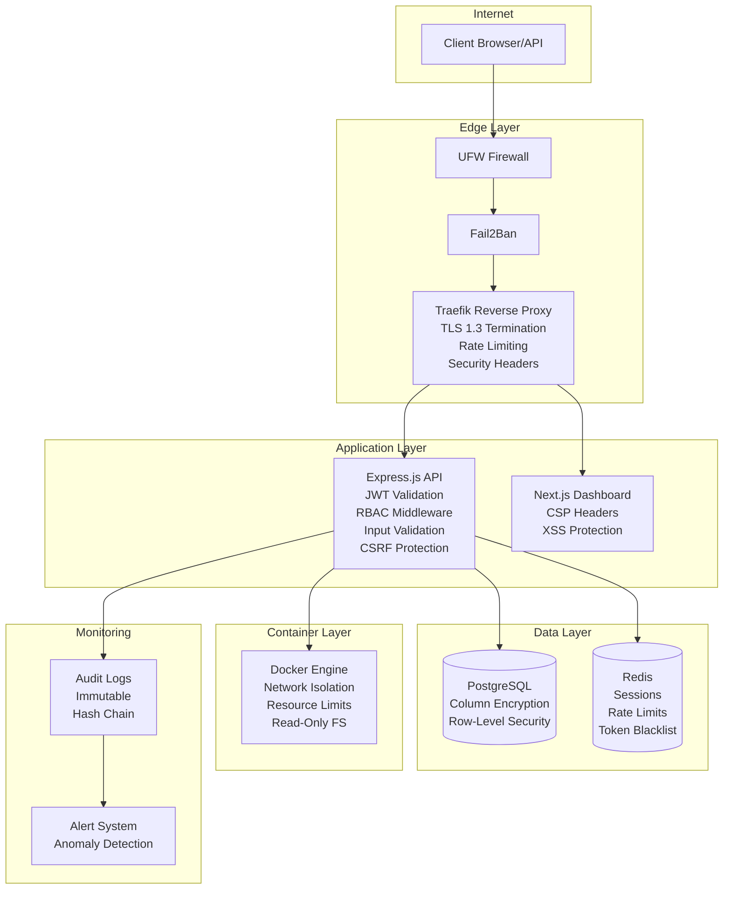

---

## 2. Authentication System

### 2.1 JWT Implementation

ITBengal uses a dual-token JWT strategy with RS256 asymmetric signing for maximum security.

#### Token Types

| Property | Access Token | Refresh Token |
|---|---|---|
| **Purpose** | API request authorization | Obtain new access tokens |
| **Algorithm** | RS256 (RSA + SHA-256) | RS256 (RSA + SHA-256) |
| **Expiry** | 15 minutes | 7 days |
| **Storage** | In-memory (JavaScript variable) | HttpOnly Secure Cookie |
| **Rotation** | Issued on every refresh | Rotated on every use |
| **Revocation** | Blacklist in Redis | Delete from database + Redis |
| **Size** | ~800 bytes | ~200 bytes (opaque reference) |

#### Access Token Claims (JWT Payload)

```json
{
  "sub": "usr_a1b2c3d4e5f6",
  "email": "user@example.com",
  "role": "org_admin",
  "orgId": "org_x7y8z9w0",
  "orgRole": "admin",
  "permissions": ["project:read", "project:write", "deployment:create"],
  "sessionId": "ses_m1n2o3p4",
  "iat": 1719993600,
  "exp": 1719994500,
  "jti": "tok_q5r6s7t8u9v0",
  "iss": "https://api.itbengal.com",
  "aud": "https://itbengal.com"
}
```

#### Token Signing Key Management

| Parameter | Value |
|---|---|
| Algorithm | RS256 |
| Key Size | 4096-bit RSA |
| Key Rotation | Every 90 days |
| Key Versioning | `kid` header in JWT (e.g., `key-2026-q3`) |
| Active Keys | Current + Previous (for graceful rotation) |
| Key Storage | `/etc/itbengal/secrets/jwt/` with `0600` permissions |
| Backup | Encrypted copy in offline vault |

### 2.2 Login Flow

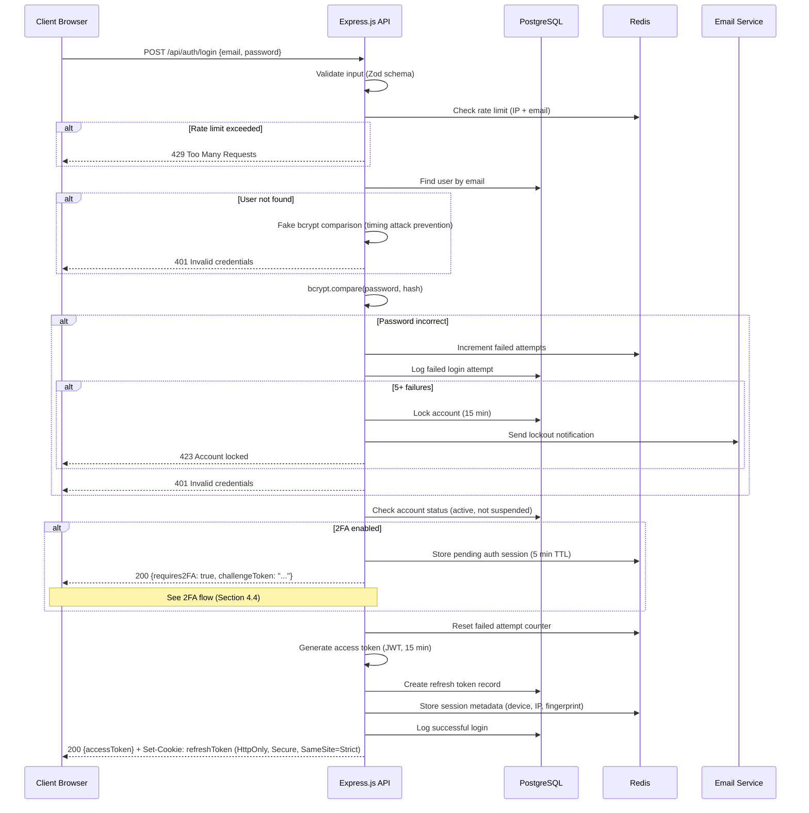

### 2.3 Registration Flow

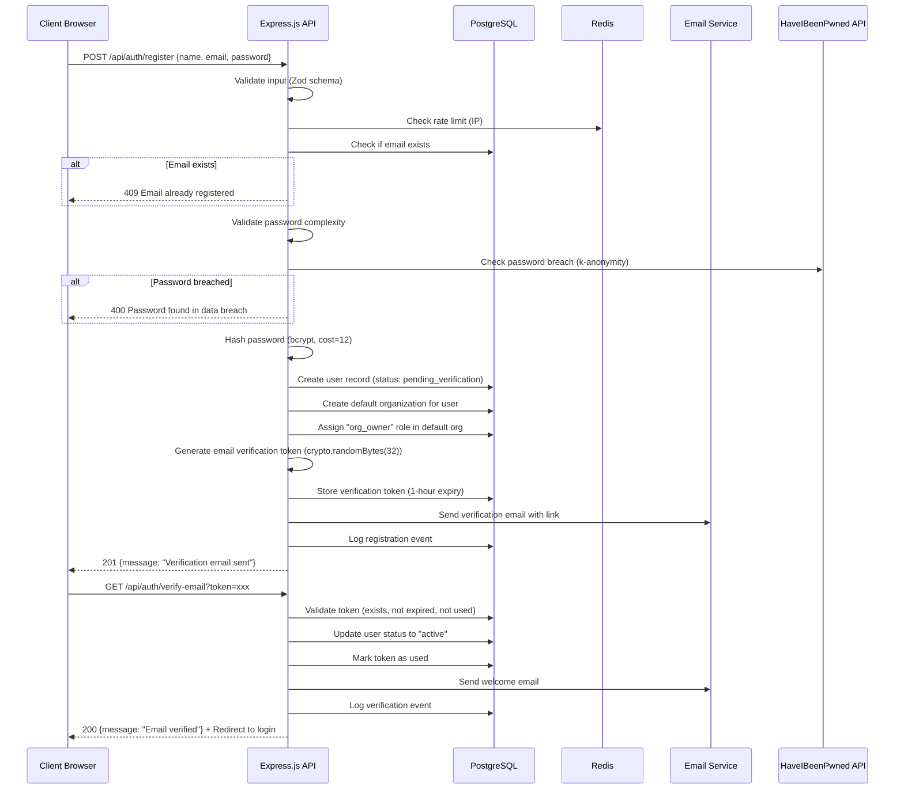

### 2.4 OAuth / SSO Flow

ITBengal supports OAuth 2.0 with PKCE for third-party authentication via GitHub, Google, and GitLab.

#### Supported OAuth Providers

| Provider | Scopes | Use Case |
|---|---|---|
| GitHub | `user:email`, `read:user` | Login + Git repository access |
| Google | `openid`, `email`, `profile` | Login only |
| GitLab | `read_user`, `email` | Login + Git repository access |

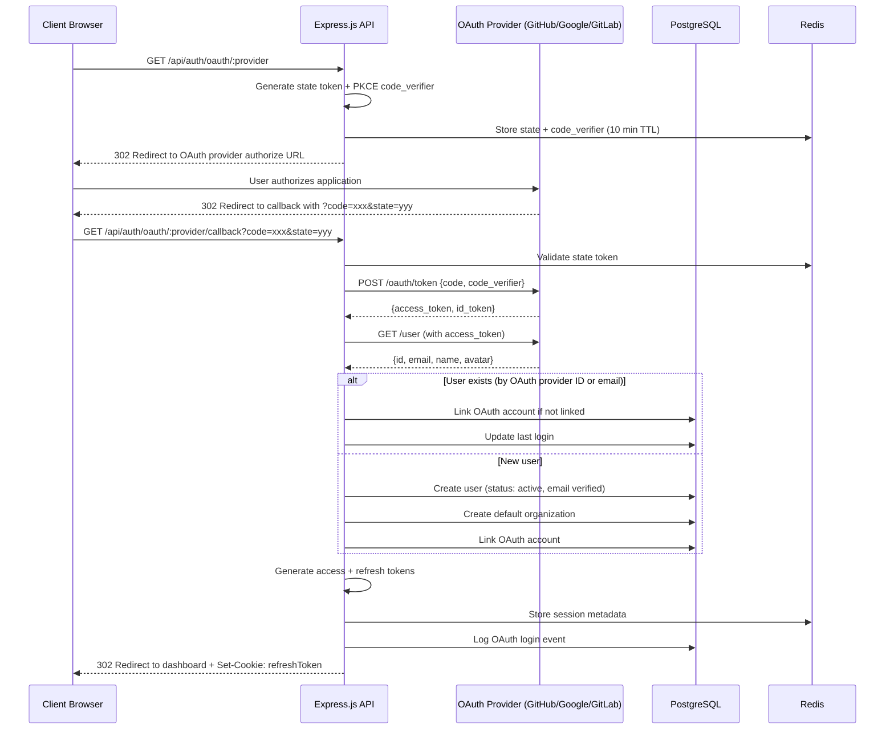

### 2.5 Session Management

#### Session Storage (Redis)

Sessions are stored in Redis with the following structure:

```
Key: session:{userId}:{sessionId}
TTL: 7 days (matches refresh token)
```

```json
{
  "userId": "usr_a1b2c3d4e5f6",
  "sessionId": "ses_m1n2o3p4",
  "deviceFingerprint": "fp_abc123",
  "userAgent": "Mozilla/5.0 ...",
  "ipAddress": "103.100.x.x",
  "country": "BD",
  "city": "Dhaka",
  "createdAt": "2026-07-04T10:00:00Z",
  "lastActiveAt": "2026-07-04T10:30:00Z",
  "refreshTokenHash": "sha256:...",
  "isActive": true
}
```

#### Session Policies

| Policy | Value | Rationale |
|---|---|---|
| Max concurrent sessions | 5 per user | Prevent credential sharing |
| Session timeout (idle) | 30 minutes (configurable) | Reduce attack window |
| Session absolute timeout | 7 days | Force re-authentication |
| Device fingerprinting | Browser + OS + screen + timezone | Detect session hijacking |
| IP change detection | Alert + optional re-auth | Detect token theft |
| Session listing | Available in Security Settings | Transparency for users |
| Remote revocation | Per-session and "revoke all" | Emergency response |

#### Session Listing API

Users can view and manage their active sessions:

```
GET /api/auth/sessions
Response:
[
  {
    "id": "ses_m1n2o3p4",
    "device": "Chrome on macOS",
    "ipAddress": "103.100.x.x",
    "location": "Dhaka, BD",
    "lastActive": "2026-07-04T10:30:00Z",
    "isCurrent": true
  }
]

DELETE /api/auth/sessions/:sessionId    — Revoke specific session
DELETE /api/auth/sessions               — Revoke all other sessions
```

### 2.6 Token Storage Strategy

| Token | Storage Location | Rationale |
|---|---|---|
| Access Token | JavaScript memory (closure/state) | Never persists to disk, cleared on tab close |
| Refresh Token | HttpOnly, Secure, SameSite=Strict cookie | Inaccessible to JavaScript, sent only to same-site |
| CSRF Token | Meta tag + request header | Double-submit cookie pattern |

**Critical Rules:**
- Access tokens are **NEVER** stored in `localStorage`, `sessionStorage`, or any cookie
- Refresh tokens are **NEVER** accessible to client-side JavaScript
- All token-bearing cookies use `Secure` (HTTPS only), `HttpOnly` (no JS access), and `SameSite=Strict`
- Access token is passed via `Authorization: Bearer <token>` header

### 2.7 Token Refresh Flow

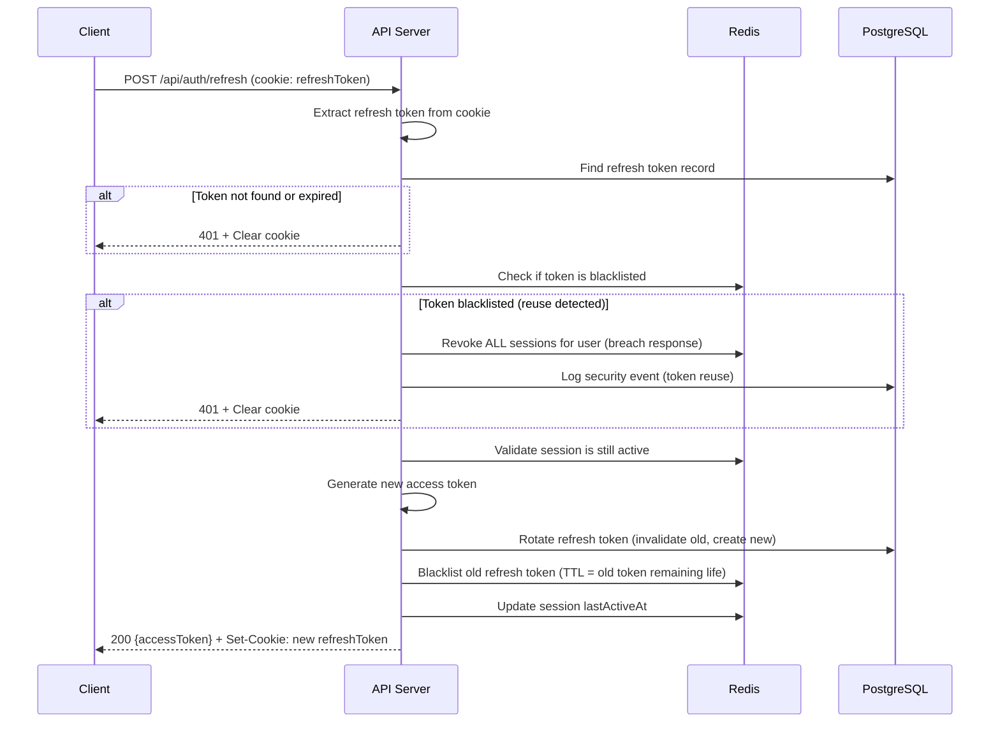

### 2.8 Logout

```
POST /api/auth/logout
```

1. Extract refresh token from cookie
2. Add access token `jti` to Redis blacklist (TTL = remaining token life)
3. Delete refresh token record from database
4. Remove session from Redis
5. Clear refresh token cookie
6. Log logout event in audit log

**Logout from all devices:**
```
POST /api/auth/logout-all
```
1. Blacklist all active refresh tokens for user
2. Remove all sessions from Redis
3. Clear current cookie
4. Log "logout all" event

---

## 3. Authorization — RBAC Model

### 3.1 Role Hierarchy

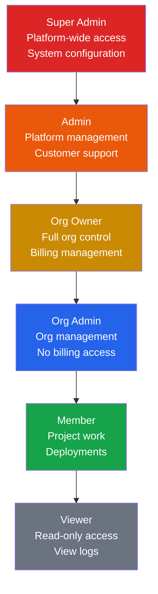

### 3.2 Role Definitions

| Role | Scope | Description | Assignment |
|---|---|---|---|
| **Super Admin** | Platform | Full system access, infrastructure management, can impersonate any user | Manual DB assignment only |
| **Admin** | Platform | Customer support, order management, content management, no system config | Assigned by Super Admin |
| **Org Owner** | Organization | Full control of their organization, billing, members, projects | Created on org creation |
| **Org Admin** | Organization | Manage members, projects, domains within the org (no billing) | Assigned by Org Owner |
| **Member** | Organization | Create/manage projects, deploy, manage assigned domains | Invited by Org Owner/Admin |
| **Viewer** | Organization | Read-only access to projects, logs, domains (no modifications) | Invited by Org Owner/Admin |

### 3.3 Permission Matrix

#### Platform Permissions (Super Admin / Admin only)

| Permission | Super Admin | Admin |
|---|---|---|
| View all customers | ✅ | ✅ |
| Suspend/unsuspend customer | ✅ | ✅ |
| Delete customer account | ✅ | ❌ |
| Impersonate customer | ✅ | ❌ |
| View all orders | ✅ | ✅ |
| Process refunds | ✅ | ✅ |
| Manage servers (add/remove nodes) | ✅ | ❌ |
| View server health | ✅ | ✅ |
| Manage pricing/plans | ✅ | ❌ |
| Create coupons/promos | ✅ | ✅ |
| View audit logs | ✅ | ✅ |
| Export audit logs | ✅ | ❌ |
| System settings | ✅ | ❌ |
| SMTP configuration | ✅ | ❌ |
| Payment gateway config | ✅ | ❌ |
| Feature flags | ✅ | ❌ |
| Maintenance mode | ✅ | ❌ |
| Manage admin users | ✅ | ❌ |
| View all support tickets | ✅ | ✅ |
| Assign support tickets | ✅ | ✅ |
| Create announcements | ✅ | ✅ |
| Manage domain registrar | ✅ | ❌ |
| View monitoring dashboards | ✅ | ✅ |
| View business analytics | ✅ | ✅ |

#### Organization Permissions

| Permission | Org Owner | Org Admin | Member | Viewer |
|---|---|---|---|---|
| **Organization** | | | | |
| View org settings | ✅ | ✅ | ✅ | ✅ |
| Edit org settings (name, avatar) | ✅ | ✅ | ❌ | ❌ |
| Delete organization | ✅ | ❌ | ❌ | ❌ |
| Transfer ownership | ✅ | ❌ | ❌ | ❌ |
| **Members** | | | | |
| View members | ✅ | ✅ | ✅ | ✅ |
| Invite members | ✅ | ✅ | ❌ | ❌ |
| Remove members | ✅ | ✅ | ❌ | ❌ |
| Change member roles | ✅ | ✅ | ❌ | ❌ |
| **Teams** | | | | |
| View teams | ✅ | ✅ | ✅ | ✅ |
| Create teams | ✅ | ✅ | ❌ | ❌ |
| Edit teams | ✅ | ✅ | ❌ | ❌ |
| Delete teams | ✅ | ✅ | ❌ | ❌ |
| **Projects** | | | | |
| View all org projects | ✅ | ✅ | ✅ | ✅ |
| Create projects | ✅ | ✅ | ✅ | ❌ |
| Edit project settings | ✅ | ✅ | ✅ (own) | ❌ |
| Delete projects | ✅ | ✅ | ❌ | ❌ |
| **Deployments** | | | | |
| View deployments | ✅ | ✅ | ✅ | ✅ |
| Create deployments | ✅ | ✅ | ✅ | ❌ |
| Rollback deployments | ✅ | ✅ | ✅ | ❌ |
| Cancel deployments | ✅ | ✅ | ✅ | ❌ |
| View deployment logs | ✅ | ✅ | ✅ | ✅ |
| **Domains** | | | | |
| View domains | ✅ | ✅ | ✅ | ✅ |
| Register domains | ✅ | ✅ | ❌ | ❌ |
| Transfer domains | ✅ | ❌ | ❌ | ❌ |
| Manage DNS records | ✅ | ✅ | ✅ | ❌ |
| Manage SSL | ✅ | ✅ | ✅ | ❌ |
| **Environment Variables** | | | | |
| View env vars (masked) | ✅ | ✅ | ✅ | ❌ |
| Create/edit env vars | ✅ | ✅ | ✅ | ❌ |
| Delete env vars | ✅ | ✅ | ❌ | ❌ |
| View env var values (unmasked) | ✅ | ✅ | ❌ | ❌ |
| **Billing** | | | | |
| View billing overview | ✅ | ❌ | ❌ | ❌ |
| View invoices | ✅ | ❌ | ❌ | ❌ |
| Manage payment methods | ✅ | ❌ | ❌ | ❌ |
| Change subscription plan | ✅ | ❌ | ❌ | ❌ |
| **Backups** | | | | |
| View backups | ✅ | ✅ | ✅ | ✅ |
| Create manual backup | ✅ | ✅ | ✅ | ❌ |
| Restore backup | ✅ | ✅ | ❌ | ❌ |
| Delete backups | ✅ | ✅ | ❌ | ❌ |
| **Support** | | | | |
| View support tickets | ✅ | ✅ | ✅ | ✅ |
| Create support tickets | ✅ | ✅ | ✅ | ✅ |
| **API Keys** | | | | |
| View org API keys | ✅ | ✅ | ❌ | ❌ |
| Create API keys | ✅ | ✅ | ❌ | ❌ |
| Revoke API keys | ✅ | ✅ | ❌ | ❌ |

### 3.4 Permission Enforcement

#### Middleware Chain

Every API request passes through this middleware chain:

```
Request → RateLimit → Authenticate → Authorize → Validate → Handler → AuditLog → Response
```

#### Authentication Middleware

```
1. Extract access token from Authorization header
2. Verify JWT signature (RS256, check kid)
3. Check token expiry
4. Check token not in Redis blacklist
5. Attach user context to request: { userId, role, orgId, permissions, sessionId }
```

#### Authorization Middleware

```
1. Extract required permission from route definition
2. Check user role has required permission
3. For org-scoped resources: verify user belongs to org
4. For resource-level access: verify user owns or has access to resource
5. If denied: return 403 + log audit event
```

#### Organization Scoping

**Critical Rule:** Every database query for organization-scoped data MUST include `org_id` as a filter condition. This is enforced at the ORM/query builder level.

```javascript
// CORRECT — Always scoped
const projects = await db.query(
  'SELECT * FROM projects WHERE org_id = $1 AND deleted_at IS NULL',
  [req.user.orgId]
);

// FORBIDDEN — Never allowed
const projects = await db.query('SELECT * FROM projects WHERE id = $1', [id]);
```

Cross-organization data access is prevented by:
1. Middleware validates `orgId` from JWT matches requested resource's `org_id`
2. Database queries always include `org_id` filter
3. Admin impersonation creates a scoped session with the target org's context
4. API keys are scoped to a single organization

### 3.5 API Key Permissions

API keys provide programmatic access with granular permission scoping.

#### API Key Structure

| Field | Description |
|---|---|
| `id` | Unique identifier (e.g., `key_a1b2c3d4`) |
| `name` | Human-readable name |
| `prefix` | First 8 characters shown in UI (e.g., `itb_a1b2...`) |
| `hash` | SHA-256 hash of full key |
| `orgId` | Scoped organization |
| `permissions` | Array of granted permissions |
| `expiresAt` | Optional expiry date |
| `lastUsedAt` | Timestamp of last use |
| `ipAllowlist` | Optional IP restrictions |
| `createdBy` | User who created the key |
| `rateLimit` | Custom rate limit (default: 60/min) |

#### Key Format

```
itb_live_a1b2c3d4e5f6g7h8i9j0k1l2m3n4o5p6q7r8s9t0
└─prefix─┘└──────────────random (32 bytes hex)──────────────┘
```

- Keys are shown **only once** at creation time
- Only the SHA-256 hash is stored in the database
- The 8-character prefix is stored for identification in the UI

---

## 4. Two-Factor Authentication (2FA)

### 4.1 TOTP Implementation

| Parameter | Value |
|---|---|
| Algorithm | TOTP (RFC 6238) |
| Hash | SHA-1 (for compatibility with all authenticator apps) |
| Digits | 6 |
| Period | 30 seconds |
| Window | ±1 (accepts previous and next code for clock skew) |
| Secret Length | 20 bytes (Base32 encoded) |
| Issuer | `ITBengal` |
| Compatible Apps | Google Authenticator, Authy, 1Password, Bitwarden |

### 4.2 2FA Enrollment Flow

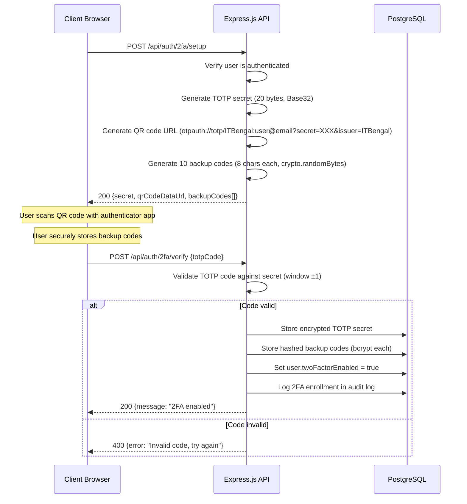

### 4.3 Backup Codes

- **Quantity:** 10 codes generated during enrollment
- **Format:** 8-character alphanumeric (e.g., `A3X9-K7M2`)
- **Storage:** Each code hashed with bcrypt (cost factor 10) before database storage
- **Usage:** Single-use; marked as consumed after successful verification
- **Display:** Shown once during enrollment, user must download/copy
- **Regeneration:** User can regenerate codes (invalidates all previous codes, requires 2FA verification)

### 4.4 Login with 2FA

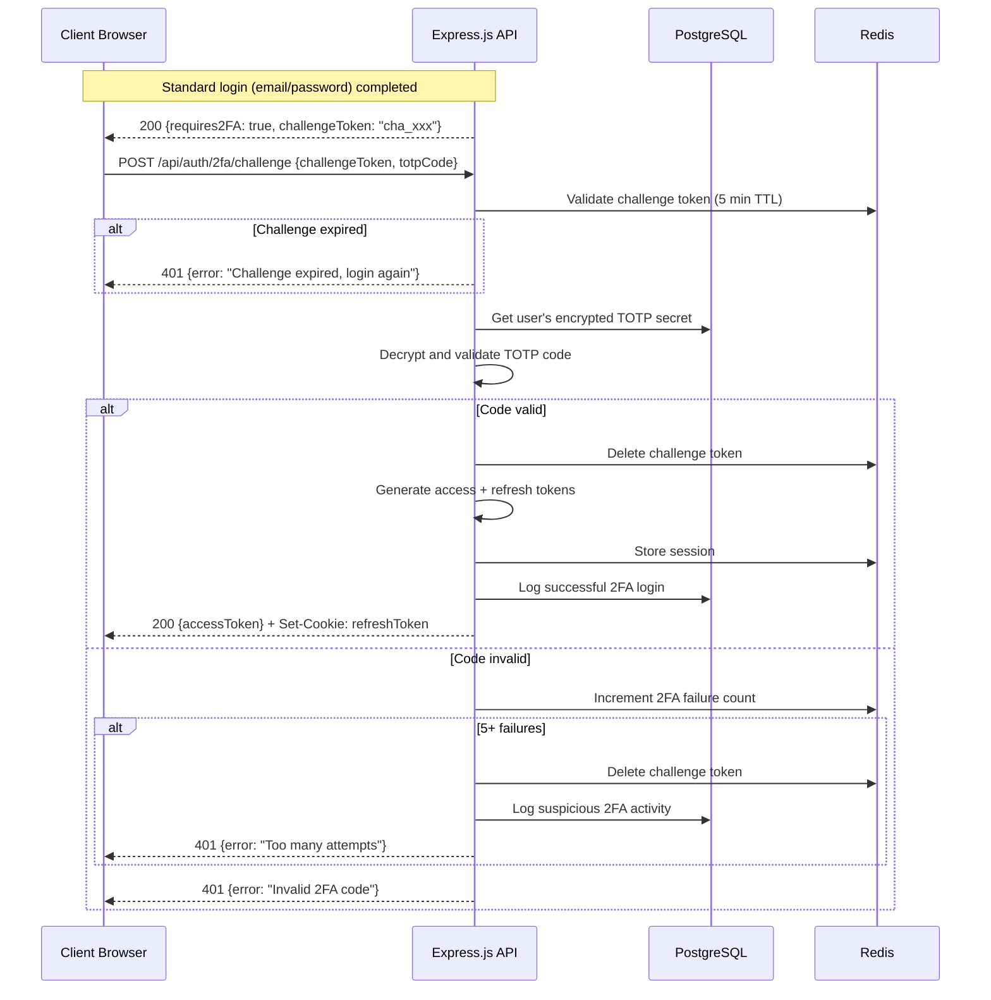

### 4.5 2FA Recovery via Backup Code

```
POST /api/auth/2fa/challenge {challengeToken, backupCode: "A3X9-K7M2"}
```

1. Validate challenge token from Redis
2. Fetch all unused backup code hashes from database
3. Compare provided code against each hash (bcrypt)
4. If match found: mark code as used, complete authentication
5. If no match: increment failure counter
6. Alert user about remaining backup codes

### 4.6 2FA Enforcement Policy

| Role | 2FA Requirement |
|---|---|
| Super Admin | **Mandatory** — Cannot access platform without 2FA |
| Admin | **Mandatory** — Enforced at next login if not enabled |
| Org Owner | **Recommended** — Prompted on login, can dismiss |
| Org Admin | **Recommended** — Prompted on login, can dismiss |
| Member | **Optional** — Available in Security Settings |
| Viewer | **Optional** — Available in Security Settings |

---

## 5. Password Security

### 5.1 Password Hashing

| Parameter | Value | Rationale |
|---|---|---|
| Algorithm | bcrypt | Proven, adaptive, resistant to GPU attacks |
| Cost Factor | 12 | ~250ms on modern hardware; balances security vs. UX |
| Salt | Auto-generated (per-hash) | Built into bcrypt |
| Upgrade Path | Rehash on login if cost factor changes | Future-proof |

### 5.2 Password Complexity Rules

All passwords must satisfy:

| Rule | Requirement | Validation |
|---|---|---|
| Minimum length | 8 characters | Server + client side |
| Maximum length | 128 characters | Prevent bcrypt DoS (72-byte limit handled internally) |
| Uppercase letter | At least 1 | Regex: `/[A-Z]/` |
| Lowercase letter | At least 1 | Regex: `/[a-z]/` |
| Digit | At least 1 | Regex: `/[0-9]/` |
| Special character | At least 1 | Regex: `/[!@#$%^&*()_+\-=\[\]{}|;':",.<>?\/\\~` ]/ |
| Common passwords | Not in top 100,000 list | Checked against bundled dictionary |
| Personal info | Cannot contain email or name | Case-insensitive substring check |
| Consecutive characters | No 3+ identical consecutive | Regex: `/(.)\1{2,}/` |

#### Client-Side Password Strength Indicator

Display a real-time strength meter using zxcvbn library:
- 0: Very Weak (red)
- 1: Weak (orange)
- 2: Fair (yellow)
- 3: Strong (green)
- 4: Very Strong (dark green)

Minimum acceptable strength: **2 (Fair)** for registration.

### 5.3 Breach Detection (HaveIBeenPwned)

Integration with the HaveIBeenPwned Passwords API using the k-anonymity model:

1. Hash password with SHA-1
2. Send first 5 characters of hash to HIBP API (`GET https://api.pwnedpasswords.com/range/{first5}`)
3. Compare remaining hash suffix against returned list
4. If match found with count ≥ 1: reject password with user-friendly message

**When to check:**
- User registration
- Password change
- Password reset

**Error handling:** If HIBP API is unavailable, allow the password but log a warning.

### 5.4 Account Lockout Policy

| Event | Action |
|---|---|
| 1-2 failed login attempts | Standard delay (200ms) |
| 3 failed attempts | Progressive delay (2 seconds) |
| 4 failed attempts | Progressive delay (5 seconds) |
| 5 failed attempts | **Account locked for 15 minutes** |
| 10 failed attempts (cumulative) | **Account locked for 1 hour** + email notification |
| 25 failed attempts (cumulative) | **Account locked indefinitely** + admin notification |

**Lockout storage:** Redis key `lockout:{userId}` with TTL

**Lockout bypass:** Admin can unlock accounts via Admin Dashboard

**CAPTCHA:** After 3 failed attempts, require reCAPTCHA v3 on login form

### 5.5 Password Reset Flow

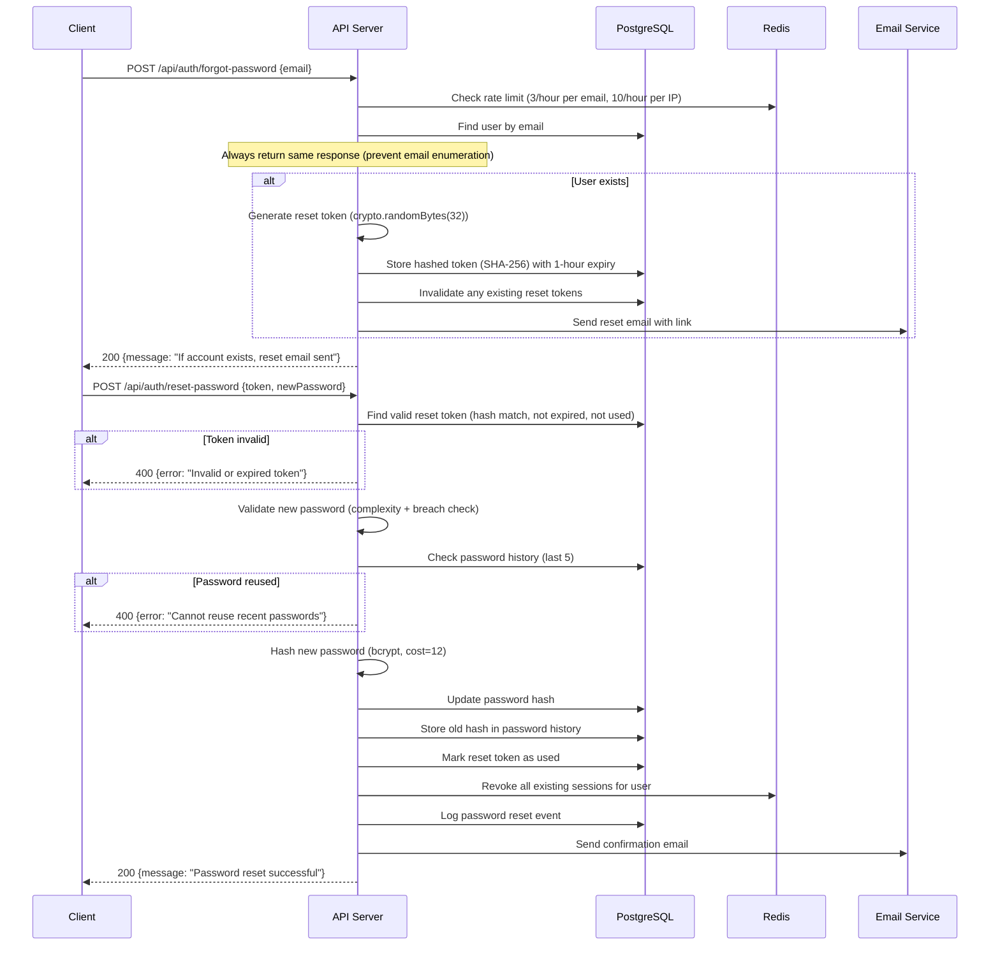

### 5.6 Password History

- Store the last **5** password hashes per user
- On password change/reset, compare new password against all stored hashes
- If any match (bcrypt compare): reject with "Cannot reuse a recent password"
- History entries are stored with timestamp for audit purposes
- Table: `password_history (id, user_id, password_hash, created_at)`

---

## 6. Rate Limiting

### 6.1 Strategy

ITBengal uses a **sliding window** rate limiting algorithm backed by Redis for atomic, distributed enforcement across all API instances.

#### Algorithm: Sliding Window Log

1. Store timestamps of each request in a Redis sorted set
2. On each request, remove entries older than the window
3. Count remaining entries
4. If count ≥ limit: reject with 429

**Redis key format:** `ratelimit:{scope}:{identifier}:{endpoint}`

### 6.2 Per-Endpoint Limits

| Endpoint Category | Endpoint | Rate Limit | Window | Scope |
|---|---|---|---|---|
| **Authentication** | | | | |
| Login | `POST /api/auth/login` | 5 requests | 1 minute | IP + Email |
| Register | `POST /api/auth/register` | 3 requests | 1 minute | IP |
| Password Reset | `POST /api/auth/forgot-password` | 3 requests | 1 hour | IP + Email |
| Email Verification | `GET /api/auth/verify-email` | 5 requests | 1 minute | IP |
| Token Refresh | `POST /api/auth/refresh` | 10 requests | 1 minute | User |
| 2FA Challenge | `POST /api/auth/2fa/challenge` | 5 requests | 5 minutes | IP |
| **API — Read** | | | | |
| General Read | `GET /api/*` | 100 requests | 1 minute | User |
| List endpoints | `GET /api/*/list` | 30 requests | 1 minute | User |
| Search | `GET /api/*/search` | 20 requests | 1 minute | User |
| **API — Write** | | | | |
| General Write | `POST/PUT/DELETE /api/*` | 30 requests | 1 minute | User |
| Deployment Create | `POST /api/deployments` | 10 requests | 1 hour | User |
| DNS Update | `PUT /api/dns/records` | 20 requests | 1 minute | User |
| File Upload | `POST /api/upload` | 5 requests | 1 minute | User |
| **Admin API** | | | | |
| Admin Read | `GET /api/admin/*` | 200 requests | 1 minute | User |
| Admin Write | `POST/PUT/DELETE /api/admin/*` | 50 requests | 1 minute | User |
| **Webhooks** | | | | |
| Git Webhooks | `POST /api/webhooks/git` | 30 requests | 1 minute | IP |
| Payment Webhooks | `POST /api/webhooks/payment` | 50 requests | 1 minute | IP |
| **Public** | | | | |
| Domain Search | `GET /api/domains/search` | 10 requests | 1 minute | IP |
| Pricing | `GET /api/pricing` | 30 requests | 1 minute | IP |

### 6.3 Rate Limit Headers

Every API response includes rate limit information:

| Header | Description | Example |
|---|---|---|
| `X-RateLimit-Limit` | Maximum requests in window | `100` |
| `X-RateLimit-Remaining` | Remaining requests | `87` |
| `X-RateLimit-Reset` | Unix timestamp when window resets | `1719993600` |
| `Retry-After` | Seconds until next request allowed (only on 429) | `30` |

### 6.4 Rate Limit Response (429)

```json
{
  "error": {
    "code": "RATE_LIMIT_EXCEEDED",
    "message": "Too many requests. Please try again later.",
    "retryAfter": 30,
    "limit": 5,
    "window": "1 minute"
  }
}
```

### 6.5 DDoS Mitigation

| Layer | Strategy |
|---|---|
| Network (L3/L4) | UFW connection rate limiting, SYN flood protection |
| Application (L7) | Traefik rate limiting middleware, connection limits |
| API | Sliding window per IP/user, progressive penalties |
| DNS | Short TTL for failover, multiple NS records |
| Monitoring | Automated alerts on traffic anomalies (>10x normal) |
| Response | Automatic IP blocking via Fail2Ban on repeated abuse |

---

## 7. Input Validation & Injection Protection

### 7.1 CSRF Protection

**Strategy:** Double-Submit Cookie Pattern + SameSite Cookie

1. **SameSite Cookie:** All authentication cookies use `SameSite=Strict`, preventing cross-site request inclusion
2. **CSRF Token:** For non-API form submissions, a CSRF token is:
   - Generated server-side and embedded in a `<meta>` tag
   - Sent with requests via `X-CSRF-Token` header
   - Validated server-side against the session-bound token

**CSRF is NOT required for:**
- API requests authenticated via `Authorization: Bearer` header (bearer tokens are not automatically sent by browsers)
- Webhook endpoints (verified via signature)

### 7.2 XSS Protection

| Layer | Mechanism |
|---|---|
| **Output Encoding** | React's default JSX escaping for all dynamic content |
| **Content Security Policy** | Strict CSP header (see Section 12) |
| **DOMPurify** | Sanitize any user-generated HTML/Markdown before rendering |
| **HttpOnly Cookies** | Prevent JavaScript access to authentication tokens |
| **Input Validation** | Strip HTML tags from text inputs where not expected |
| **Trusted Types** | Enforce Trusted Types API where supported |

### 7.3 SQL Injection Protection

| Rule | Implementation |
|---|---|
| **Parameterized Queries** | All database queries use parameterized statements via Knex.js / Prisma |
| **No String Interpolation** | NEVER concatenate user input into SQL strings |
| **ORM Only** | Direct SQL is forbidden; all queries go through the ORM layer |
| **Input Type Validation** | All inputs validated as correct type (string, number, UUID) before use |
| **Stored Procedures** | Complex queries use stored procedures with typed parameters |
| **Database User Permissions** | Application DB user has minimal privileges (no DROP, no schema changes) |

### 7.4 Command Injection Protection

| Rule | Implementation |
|---|---|
| **No `exec()`/`execSync()`** | Never use Node.js `child_process.exec` with user input |
| **Allowlist Commands** | Only pre-defined commands can be executed (e.g., `git clone`, `docker build`) |
| **Argument Sanitization** | Use `child_process.execFile` or `spawn` with argument arrays (no shell interpolation) |
| **Container Isolation** | All build/deploy commands run inside isolated Docker containers |
| **No Shell Access** | Customer containers do not have shell access by default |

### 7.5 Path Traversal Protection

| Rule | Implementation |
|---|---|
| **Input Sanitization** | Strip `..`, `./`, `//`, null bytes from file paths |
| **Path Resolution** | Use `path.resolve()` and verify result is within allowed directory |
| **Chroot** | File operations in customer containers are chroot'd to project directory |
| **Allowlist Extensions** | File uploads accept only allowed extensions |
| **Filename Sanitization** | Generate random filenames for uploads, never use user-provided names |

### 7.6 Request Validation

All API endpoints use Zod schemas for input validation:

| Validation | Tool | Scope |
|---|---|---|
| Request body | Zod | All POST/PUT/PATCH endpoints |
| Query parameters | Zod | All GET endpoints with filters |
| URL parameters | Zod (UUID, slug validation) | All parameterized routes |
| File uploads | Multer + custom validators | Size, type, extension |
| Content-Type | Middleware | Reject unexpected content types |
| Request size | Traefik + Express | Max 10MB body (1MB for JSON, 100MB for file upload) |

---

## 8. Container & Infrastructure Security

### 8.1 Docker Security Configuration

Every customer container runs with the following security constraints:

| Setting | Value | Rationale |
|---|---|---|
| `--privileged` | **Never used** | Prevents container escape |
| `--read-only` | **Enabled** | Prevents filesystem modification |
| `--no-new-privileges` | **Enabled** | Prevents privilege escalation |
| `--security-opt=no-new-privileges:true` | **Enabled** | Kernel-level enforcement |
| `--cap-drop=ALL` | **Drop all capabilities** | Minimal capability set |
| `--cap-add` | Only `NET_BIND_SERVICE` if needed | Allow binding to ports <1024 |
| `--memory` | Per plan (e.g., 256MB–4GB) | Prevent memory exhaustion |
| `--cpus` | Per plan (e.g., 0.25–4.0) | Prevent CPU starvation |
| `--pids-limit` | 100 | Prevent fork bombs |
| `--tmpfs /tmp:rw,noexec,nosuid,size=64m` | Writable temp directory | Controlled writable area |
| `--network` | Customer-specific network | Network isolation |
| `--ulimit nofile=1024:2048` | File descriptor limit | Prevent resource exhaustion |
| `--ulimit nproc=50:100` | Process limit | Prevent fork bombs |

### 8.2 Docker Network Isolation

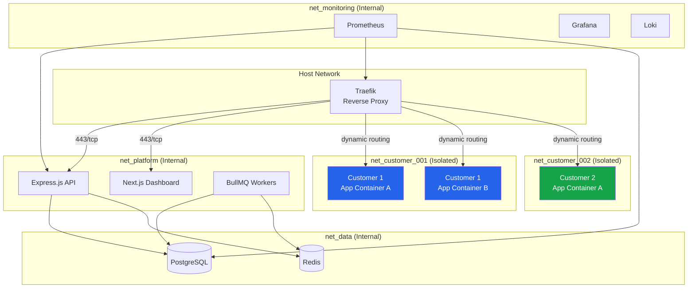

**Network Rules:**
- `net_platform`: API, Dashboard, Workers can communicate with each other
- `net_data`: Only accessible from `net_platform` (PostgreSQL port 5432, Redis port 6379)
- `net_customer_XXX`: Each customer gets an isolated network. No cross-customer communication.
- `net_monitoring`: Access to all networks for metrics scraping (read-only)
- Customer containers can only reach the internet through Traefik (outbound via NAT if needed)

### 8.3 Traefik Security Configuration

| Setting | Value |
|---|---|
| TLS Minimum Version | TLS 1.2 (TLS 1.3 preferred) |
| Cipher Suites | `TLS_AES_128_GCM_SHA256, TLS_AES_256_GCM_SHA384, TLS_CHACHA20_POLY1305_SHA256` |
| HSTS | `max-age=63072000; includeSubDomains; preload` |
| Max Request Body | 100MB (configurable per route) |
| Connection Limit | 500 per IP |
| Rate Limiting | See Section 6 |
| IP Whitelist (Admin) | Only admin IPs can access `/admin/*` and `/api/admin/*` |
| Request Buffering | Enabled (prevents slowloris) |
| Timeout | Read: 30s, Write: 30s, Idle: 120s |

### 8.4 Host Security

| Measure | Implementation |
|---|---|
| Base Image | Alpine Linux (minimal attack surface) |
| Image Updates | Weekly automated rebuild + vulnerability scan |
| Vulnerability Scanning | Trivy scan on every image build (fail on CRITICAL/HIGH) |
| Docker Daemon | Runs as non-root (rootless mode where possible) |
| Docker Socket | Never mounted into customer containers |
| Seccomp Profile | Default Docker seccomp profile (blocks 44+ dangerous syscalls) |
| AppArmor | Enabled with Docker default profile |
| Kernel Updates | Monthly security patches, emergency patches within 24h |
| Logging | All container logs forwarded to Loki (never stored on container filesystem) |

---

## 9. Secrets Management

### 9.1 Customer Environment Variables

Customer environment variables are encrypted before storage and decrypted only at container runtime.

#### Encryption Process

| Step | Detail |
|---|---|
| Algorithm | AES-256-GCM |
| Key Derivation | HKDF from master key + org-specific salt |
| IV/Nonce | 12 bytes, randomly generated per encryption |
| Auth Tag | 16 bytes (GCM authentication tag) |
| Storage Format | `{version}:{iv_base64}:{ciphertext_base64}:{tag_base64}` |
| Master Key | Stored in `/etc/itbengal/secrets/env-encryption-key` (0600) |

#### Security Controls

- Env vars are **encrypted at rest** in PostgreSQL
- Env vars are **decrypted only** in memory during container startup
- Env vars are **never logged** (masked in all log outputs)
- Env vars are **masked in UI** (show only last 4 characters)
- Env var values require **Org Owner or Org Admin role** to view unmasked
- Each organization uses a **derived encryption key** (from master key + org salt)

### 9.2 Platform Secrets

| Secret | Storage | Permissions | Rotation |
|---|---|---|---|
| JWT Private Key | `/etc/itbengal/secrets/jwt/private.pem` | `0600` root | 90 days |
| JWT Public Key | `/etc/itbengal/secrets/jwt/public.pem` | `0644` | 90 days |
| Database Password | `/etc/itbengal/secrets/db-password` | `0600` root | 90 days |
| Redis Password | `/etc/itbengal/secrets/redis-password` | `0600` root | 90 days |
| Env Encryption Key | `/etc/itbengal/secrets/env-encryption-key` | `0600` root | 180 days |
| Stripe Secret Key | `/etc/itbengal/secrets/stripe-secret` | `0600` root | On compromise |
| bKash API Key | `/etc/itbengal/secrets/bkash-api-key` | `0600` root | On compromise |
| Openprovider API Key | `/etc/itbengal/secrets/openprovider-key` | `0600` root | On compromise |
| SMTP Credentials | `/etc/itbengal/secrets/smtp-credentials` | `0600` root | 180 days |
| OAuth Client Secrets | `/etc/itbengal/secrets/oauth/` | `0600` root | On compromise |
| Backup Encryption Key | `/etc/itbengal/secrets/backup-key` | `0600` root | 365 days |

### 9.3 Secret Rotation Procedures

#### JWT Key Rotation (Every 90 Days)

1. Generate new RSA 4096-bit key pair
2. Assign new `kid` (e.g., `key-2026-q4`)
3. Deploy new public key to all API instances
4. Start signing new tokens with the new key
5. Keep previous public key active for validation (grace period = 7 days, matching max refresh token life)
6. After grace period, remove old public key
7. Log key rotation event in audit log

#### Database Password Rotation (Every 90 Days)

1. Generate new password (32 chars, cryptographically random)
2. Create new PostgreSQL user with new password
3. Grant identical permissions to new user
4. Update connection strings in Docker secrets
5. Rolling restart of API instances (zero-downtime)
6. Verify all instances using new credentials
7. Revoke old user credentials
8. Log rotation event

### 9.4 Secrets in Docker

Platform secrets are passed to containers via Docker Secrets (not environment variables):

```yaml
# docker-compose.yml
services:
  api:
    secrets:
      - jwt_private_key
      - db_password
      - redis_password

secrets:
  jwt_private_key:
    file: /etc/itbengal/secrets/jwt/private.pem
  db_password:
    file: /etc/itbengal/secrets/db-password
  redis_password:
    file: /etc/itbengal/secrets/redis-password
```

Secrets are mounted at `/run/secrets/<secret_name>` inside containers (tmpfs, never written to disk).

---

## 10. Encryption

### 10.1 Encryption In Transit

#### TLS Configuration

| Parameter | Value |
|---|---|
| Minimum Version | TLS 1.2 |
| Preferred Version | TLS 1.3 |
| Certificate Provider | Let's Encrypt (automatic via Traefik) |
| Certificate Type | ECDSA P-256 (primary) + RSA 2048 (fallback) |
| OCSP Stapling | Enabled |
| Certificate Renewal | Automatic, 30 days before expiry |

#### Cipher Suites (TLS 1.3)

```
TLS_AES_256_GCM_SHA384
TLS_CHACHA20_POLY1305_SHA256
TLS_AES_128_GCM_SHA256
```

#### Cipher Suites (TLS 1.2 — Fallback Only)

```
ECDHE-ECDSA-AES256-GCM-SHA384
ECDHE-RSA-AES256-GCM-SHA384
ECDHE-ECDSA-CHACHA20-POLY1305
ECDHE-RSA-CHACHA20-POLY1305
ECDHE-ECDSA-AES128-GCM-SHA256
ECDHE-RSA-AES128-GCM-SHA256
```

**Disabled:** All CBC ciphers, RC4, 3DES, MD5-based, SHA1-based MACs, RSA key exchange, DH key exchange.

#### HSTS Configuration

```
Strict-Transport-Security: max-age=63072000; includeSubDomains; preload
```

- `max-age=63072000` — 2 years
- `includeSubDomains` — All subdomains must use HTTPS
- `preload` — Submit to browser preload list

### 10.2 Encryption At Rest

#### Database Column-Level Encryption

| Data Type | Encryption | Key |
|---|---|---|
| Payment tokens (Stripe, bKash) | AES-256-GCM | Master encryption key |
| API key hashes | SHA-256 | N/A (one-way hash) |
| Customer env vars | AES-256-GCM | Org-derived key |
| 2FA TOTP secrets | AES-256-GCM | Master encryption key |
| OAuth tokens | AES-256-GCM | Master encryption key |
| Personal data (phone, address) | AES-256-GCM | Master encryption key |
| Backup encryption keys | AES-256-GCM | Master encryption key |
| Password hashes | bcrypt | N/A (one-way hash) |
| Backup codes | bcrypt | N/A (one-way hash) |

#### Encryption Key Hierarchy

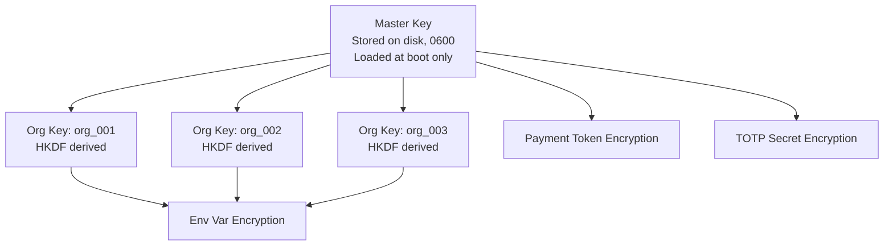

### 10.3 Backup Encryption

| Parameter | Value |
|---|---|
| Algorithm | AES-256-CBC |
| Key | Separate backup encryption key (not master key) |
| Key Storage | `/etc/itbengal/secrets/backup-key` (0600) |
| Key Escrow | Encrypted copy stored with company officers |
| Backup Format | `tar.gz` compressed, then encrypted |
| Verification | SHA-256 checksum of encrypted backup |
| Naming | `backup-{type}-{date}-{sha256_prefix}.enc` |

### 10.4 Internal Service Communication

| Communication | Encryption |
|---|---|
| API ↔ PostgreSQL | TLS (verify-full) |
| API ↔ Redis | TLS + AUTH password |
| API ↔ Docker Engine | Unix socket (local only) |
| Traefik ↔ Backend | Plain HTTP on internal network (TLS terminated at Traefik) |
| Inter-node (future) | WireGuard VPN tunnel |
| Monitoring scraping | HTTPS with client certificates |

---

## 11. Firewall & Network Security

### 11.1 UFW Firewall Rules

#### Platform Server

| Rule | Port | Protocol | Source | Action |
|---|---|---|---|---|
| SSH | 2222 | TCP | Admin VPN IPs only | ALLOW |
| HTTP | 80 | TCP | Anywhere | ALLOW (redirect to 443) |
| HTTPS | 443 | TCP | Anywhere | ALLOW |
| PostgreSQL | 5432 | TCP | Internal subnet (10.0.0.0/24) | ALLOW |
| Redis | 6379 | TCP | Internal subnet (10.0.0.0/24) | ALLOW |
| Prometheus | 9090 | TCP | Internal subnet (10.0.0.0/24) | ALLOW |
| Grafana | 3000 | TCP | Admin VPN IPs only | ALLOW |
| Node Exporter | 9100 | TCP | Internal subnet (10.0.0.0/24) | ALLOW |
| WireGuard | 51820 | UDP | Anywhere | ALLOW |
| Default | All | All | Anywhere | **DENY** |

#### Hosting Nodes (React/WordPress)

| Rule | Port | Protocol | Source | Action |
|---|---|---|---|---|
| SSH | 2222 | TCP | Admin VPN IPs only | ALLOW |
| HTTP | 80 | TCP | Anywhere | ALLOW |
| HTTPS | 443 | TCP | Anywhere | ALLOW |
| Node Agent | 9443 | TCP | Platform Server IP only | ALLOW |
| Node Exporter | 9100 | TCP | Monitoring subnet | ALLOW |
| Docker Metrics | 9323 | TCP | Monitoring subnet | ALLOW |
| WireGuard | 51820 | UDP | Anywhere | ALLOW |
| Default | All | All | Anywhere | **DENY** |

### 11.2 SSH Hardening

**`/etc/ssh/sshd_config`** settings:

| Setting | Value | Rationale |
|---|---|---|
| `Port` | `2222` | Non-standard port |
| `PermitRootLogin` | `no` | Prevent root access |
| `PasswordAuthentication` | `no` | Key-only authentication |
| `PubkeyAuthentication` | `yes` | Enable key auth |
| `AuthorizedKeysFile` | `.ssh/authorized_keys` | Standard location |
| `AllowUsers` | `deploy admin` | Restrict to specific users |
| `MaxAuthTries` | `3` | Limit attempts |
| `LoginGraceTime` | `30` | Short login window |
| `ClientAliveInterval` | `300` | 5-min keepalive |
| `ClientAliveCountMax` | `2` | Disconnect after 10 min idle |
| `X11Forwarding` | `no` | Disable X11 |
| `AllowTcpForwarding` | `no` | Disable TCP forwarding |
| `AllowAgentForwarding` | `no` | Disable agent forwarding |
| `PermitEmptyPasswords` | `no` | No empty passwords |
| `Protocol` | `2` | SSH v2 only |
| `KexAlgorithms` | `curve25519-sha256@libssh.org` | Strong key exchange |
| `MACs` | `hmac-sha2-512-etm@openssh.com,hmac-sha2-256-etm@openssh.com` | Strong MACs |

### 11.3 Fail2Ban Configuration

#### SSH Jail

```ini
[sshd]
enabled = true
port = 2222
filter = sshd
logpath = /var/log/auth.log
maxretry = 3
findtime = 600
bantime = 3600
banaction = ufw
```

#### HTTP Authentication Jail

```ini
[itbengal-auth]
enabled = true
port = 443
filter = itbengal-auth
logpath = /var/log/itbengal/auth.log
maxretry = 10
findtime = 300
bantime = 1800
banaction = ufw
```

#### API Abuse Jail

```ini
[itbengal-api]
enabled = true
port = 443
filter = itbengal-api
logpath = /var/log/itbengal/api.log
maxretry = 100
findtime = 60
bantime = 600
banaction = ufw
```

### 11.4 Network Segmentation

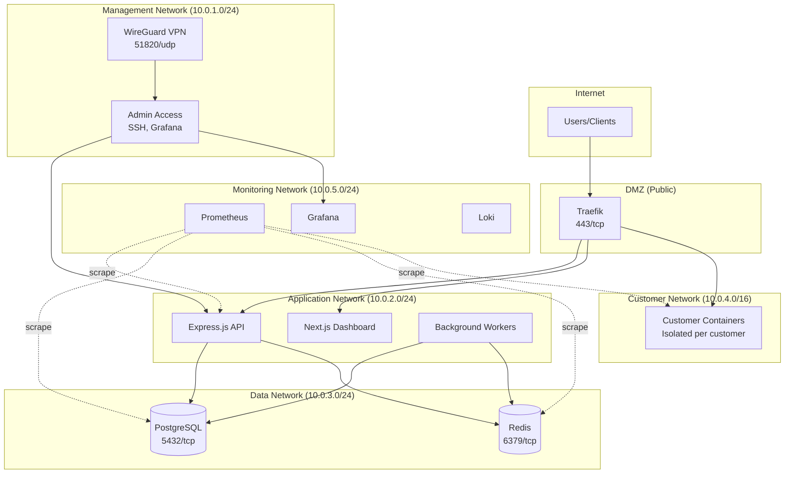

### 11.5 VPN Access (WireGuard)

All administrative access to management interfaces requires WireGuard VPN:

| Parameter | Value |
|---|---|
| Protocol | WireGuard |
| Port | 51820/UDP |
| Subnet | 10.0.100.0/24 |
| DNS | Internal DNS resolver |
| Allowed IPs | Management network subnets |
| Key Rotation | Every 90 days |
| MFA | Required (via 2FA on VPN portal) |
| Logging | All VPN connections logged |

**Services accessible only via VPN:**
- Grafana dashboard
- Prometheus UI
- SSH (can also be restricted to VPN-only)
- Database direct access (for emergencies)
- Redis CLI access

---

## 12. Security Headers

All responses from ITBengal include the following security headers:

| Header | Value | Purpose |
|---|---|---|
| `Strict-Transport-Security` | `max-age=63072000; includeSubDomains; preload` | Force HTTPS for 2 years |
| `Content-Security-Policy` | See detailed policy below | Prevent XSS, data injection |
| `X-Content-Type-Options` | `nosniff` | Prevent MIME-type sniffing |
| `X-Frame-Options` | `DENY` | Prevent clickjacking |
| `X-XSS-Protection` | `0` | Disable (CSP is preferred; legacy XSS filter can cause issues) |
| `Referrer-Policy` | `strict-origin-when-cross-origin` | Control referrer information |
| `Permissions-Policy` | `camera=(), microphone=(), geolocation=(), payment=()` | Disable unnecessary browser features |
| `Cross-Origin-Embedder-Policy` | `require-corp` | Prevent loading cross-origin resources without permission |
| `Cross-Origin-Opener-Policy` | `same-origin` | Isolate browsing context |
| `Cross-Origin-Resource-Policy` | `same-origin` | Prevent cross-origin reads |
| `X-DNS-Prefetch-Control` | `off` | Disable DNS prefetching |
| `X-Permitted-Cross-Domain-Policies` | `none` | Prevent Flash/PDF cross-domain |

### Content Security Policy (Detailed)

```
Content-Security-Policy:
  default-src 'self';
  script-src 'self' 'nonce-{random}' https://challenges.cloudflare.com;
  style-src 'self' 'unsafe-inline' https://fonts.googleapis.com;
  font-src 'self' https://fonts.gstatic.com;
  img-src 'self' data: https: blob:;
  connect-src 'self' https://api.itbengal.com wss://api.itbengal.com https://api.pwnedpasswords.com;
  frame-src 'self' https://challenges.cloudflare.com;
  frame-ancestors 'none';
  base-uri 'self';
  form-action 'self';
  object-src 'none';
  upgrade-insecure-requests;
  block-all-mixed-content;
```

**Key Decisions:**
- `script-src` uses nonce-based approach (not `unsafe-inline`) for maximum XSS protection
- `style-src` allows `unsafe-inline` for CSS-in-JS frameworks (Next.js/styled-components)
- `connect-src` includes WebSocket for real-time log streaming
- `frame-ancestors 'none'` provides stronger clickjacking protection than X-Frame-Options

---

## 13. Audit Logging

### 13.1 Events to Log

#### Authentication Events

| Event | Severity | Data Captured |
|---|---|---|
| Login success | INFO | User ID, IP, device, method (password/OAuth) |
| Login failure | WARN | Email attempted, IP, failure reason |
| Logout | INFO | User ID, session ID |
| Token refresh | INFO | User ID, session ID |
| Password change | WARN | User ID, IP |
| Password reset request | WARN | Email, IP |
| Password reset complete | WARN | User ID, IP |
| 2FA enabled | WARN | User ID |
| 2FA disabled | WARN | User ID |
| 2FA failure | WARN | User ID, IP |
| Account locked | ERROR | User ID, IP, attempt count |
| Account unlocked | WARN | User ID, unlocked by |
| Session revoked | WARN | User ID, session ID, revoked by |
| OAuth linked | INFO | User ID, provider |

#### Authorization Events

| Event | Severity | Data Captured |
|---|---|---|
| Permission denied | WARN | User ID, resource, permission, IP |
| Role changed | WARN | Target user, old role, new role, changed by |
| API key created | WARN | User ID, key prefix, permissions |
| API key revoked | WARN | User ID, key prefix, revoked by |

#### Admin Events

| Event | Severity | Data Captured |
|---|---|---|
| Customer suspended | WARN | Customer ID, reason, admin ID |
| Customer unsuspended | WARN | Customer ID, admin ID |
| Customer deleted | ERROR | Customer ID, admin ID |
| Impersonation started | ERROR | Admin ID, target customer ID |
| Impersonation ended | ERROR | Admin ID, target customer ID |
| Server added | WARN | Server ID, type, admin ID |
| Server removed | ERROR | Server ID, admin ID |
| System settings changed | WARN | Setting key, old value, new value, admin ID |
| Pricing changed | WARN | Plan ID, changes, admin ID |
| Coupon created | INFO | Coupon code, admin ID |
| Announcement published | INFO | Announcement ID, admin ID |

#### Billing Events

| Event | Severity | Data Captured |
|---|---|---|
| Payment successful | INFO | User ID, amount, gateway, transaction ID |
| Payment failed | WARN | User ID, amount, gateway, error |
| Refund issued | WARN | User ID, amount, admin ID, reason |
| Subscription created | INFO | User ID, plan, amount |
| Subscription changed | WARN | User ID, old plan, new plan |
| Subscription cancelled | WARN | User ID, plan, reason |
| Invoice generated | INFO | User ID, invoice ID, amount |

#### Deployment Events

| Event | Severity | Data Captured |
|---|---|---|
| Deployment created | INFO | User ID, project ID, source (git/zip), commit |
| Deployment succeeded | INFO | Project ID, deployment ID, duration |
| Deployment failed | WARN | Project ID, deployment ID, error |
| Deployment rolled back | WARN | Project ID, deployment ID, rolled back by |
| Deployment deleted | WARN | Project ID, deployment ID, deleted by |

#### Domain Events

| Event | Severity | Data Captured |
|---|---|---|
| Domain registered | INFO | User ID, domain, registrar response |
| Domain transferred | WARN | User ID, domain, from/to |
| DNS record created | INFO | User ID, domain, record type, value |
| DNS record updated | INFO | User ID, domain, record type, old/new value |
| DNS record deleted | WARN | User ID, domain, record type |
| SSL certificate issued | INFO | Domain, issuer, expiry |
| SSL certificate expired | ERROR | Domain, expiry date |

#### Security Events

| Event | Severity | Data Captured |
|---|---|---|
| Rate limit hit | WARN | IP, endpoint, limit, window |
| Suspicious activity detected | ERROR | User ID, IP, activity type, details |
| IP blocked (Fail2Ban) | WARN | IP, jail, ban duration |
| CSRF validation failed | WARN | IP, endpoint, user agent |
| Invalid token presented | WARN | IP, token type, error |
| Token reuse detected | ERROR | User ID, token ID |

### 13.2 Audit Log Schema

```sql
CREATE TABLE audit_logs (
    id              UUID PRIMARY KEY DEFAULT gen_random_uuid(),
    timestamp       TIMESTAMPTZ NOT NULL DEFAULT NOW(),
    actor_id        UUID,                          -- User or system ID
    actor_type      VARCHAR(20) NOT NULL,          -- 'user', 'admin', 'system', 'api_key'
    actor_email     VARCHAR(255),                  -- For quick reference
    action          VARCHAR(100) NOT NULL,         -- e.g., 'auth.login.success'
    resource_type   VARCHAR(50),                   -- e.g., 'user', 'project', 'deployment'
    resource_id     UUID,                          -- ID of affected resource
    resource_name   VARCHAR(255),                  -- Human-readable resource name
    org_id          UUID,                          -- Organization scope
    ip_address      INET NOT NULL,
    user_agent      TEXT,
    country         VARCHAR(2),                    -- ISO country code
    severity        VARCHAR(10) NOT NULL,          -- 'INFO', 'WARN', 'ERROR', 'CRITICAL'
    metadata        JSONB,                         -- Additional context
    request_id      UUID,                          -- Correlation with request logs
    previous_hash   VARCHAR(64),                   -- SHA-256 of previous entry (tamper detection)
    hash            VARCHAR(64) NOT NULL           -- SHA-256 of this entry
);

-- Indexes for common queries
CREATE INDEX idx_audit_timestamp ON audit_logs (timestamp DESC);
CREATE INDEX idx_audit_actor ON audit_logs (actor_id, timestamp DESC);
CREATE INDEX idx_audit_action ON audit_logs (action, timestamp DESC);
CREATE INDEX idx_audit_org ON audit_logs (org_id, timestamp DESC);
CREATE INDEX idx_audit_resource ON audit_logs (resource_type, resource_id);
CREATE INDEX idx_audit_severity ON audit_logs (severity, timestamp DESC);
CREATE INDEX idx_audit_ip ON audit_logs (ip_address);

-- Partitioning by month for performance
CREATE TABLE audit_logs_2026_07 PARTITION OF audit_logs
    FOR VALUES FROM ('2026-07-01') TO ('2026-08-01');
```

### 13.3 Hash Chain for Tamper Detection

Each audit log entry includes a SHA-256 hash chain:

```
hash = SHA-256(timestamp + actor_id + action + resource_id + metadata + previous_hash)
```

This creates an immutable chain where any modification to a past entry breaks the chain. A scheduled job verifies chain integrity daily.

### 13.4 Retention Policy

| Tier | Duration | Storage | Format |
|---|---|---|---|
| **Hot** | 90 days | PostgreSQL (partitioned) | Native rows |
| **Warm** | 1 year | Compressed PostgreSQL archive | JSONL, gzip compressed |
| **Cold** | 7 years | Encrypted file storage | JSONL, AES-256 encrypted, gzip |

**Automated Pipeline:**
1. Daily: Verify hash chain integrity
2. Monthly: Move entries >90 days to warm storage (compress + archive)
3. Annually: Move entries >1 year to cold storage (encrypt + transfer)
4. 7 years: Automated deletion of cold storage entries

### 13.5 Immutability

- Audit logs table has **no UPDATE or DELETE grants** for the application database user
- Only a dedicated `audit_readonly` role can query the table
- Only a dedicated `audit_writer` role can INSERT (used by the application)
- Schema changes require Super Admin + documented change request
- All access to audit logs is itself audited

### 13.6 Audit Log Access

| Feature | Description |
|---|---|
| Admin Dashboard | Searchable, filterable UI at `/admin/audit-logs` |
| Filters | By actor, action, resource, date range, severity, org, IP |
| Export | CSV and JSON export (Super Admin only) |
| Real-time | WebSocket stream for live monitoring |
| API | `GET /api/admin/audit-logs` with pagination and filters |
| Alerts | Configurable alerts on CRITICAL severity events |

---

## 14. Incident Response Plan

### 14.1 Severity Classification

| Level | Name | Examples | Response Time | Escalation |
|---|---|---|---|---|
| **P1** | Critical | Data breach, full platform outage, ransomware, credential compromise at scale | **15 minutes** | Immediate: CTO, CEO, Legal |
| **P2** | High | Partial outage, security vulnerability (exploitable), payment system failure | **1 hour** | Within 1 hour: CTO, Security Lead |
| **P3** | Medium | Performance degradation, non-critical vulnerability, single server issue | **4 hours** | Within 4 hours: Team Lead |
| **P4** | Low | Minor bugs, cosmetic issues, informational security findings | **24 hours** | Next business day |

### 14.2 Incident Response Flowchart

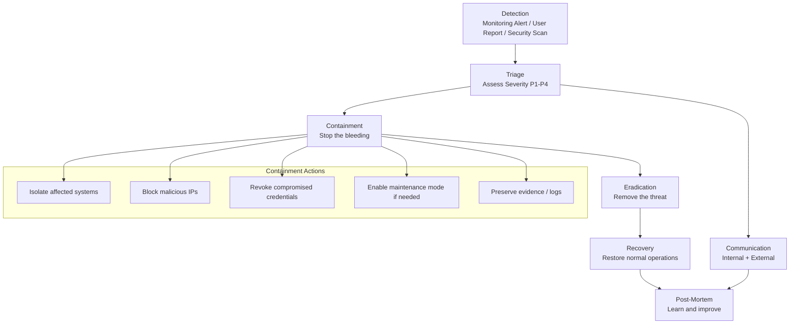

### 14.3 Response Procedures

#### P1 — Critical Incident

1. **Detection** (T+0)
   - Automated monitoring alert or security team notification
   - On-call engineer acknowledges within 15 minutes

2. **Triage** (T+15min)
   - Assess scope and impact
   - Assign incident commander
   - Create incident channel (Slack/Teams)
   - Start incident timeline document

3. **Containment** (T+30min)
   - Isolate affected systems from network if necessary
   - Block attacking IPs/accounts
   - Revoke compromised tokens/credentials
   - Enable maintenance mode if customer-facing impact
   - Preserve all logs and evidence (snapshot)

4. **Communication** (T+1hr)
   - Internal: Brief CTO, CEO, Legal team
   - External: Update status page, prepare customer notification
   - If data breach: Begin legal notification process (72 hours GDPR)

5. **Eradication** (T+2-24hr)
   - Remove attacker access
   - Patch exploited vulnerability
   - Scan for persistence mechanisms
   - Rebuild affected systems from known-good state

6. **Recovery** (T+24-72hr)
   - Restore services from clean backups if needed
   - Verify system integrity
   - Monitor for re-occurrence
   - Gradually remove containment measures

7. **Post-Mortem** (T+1 week)
   - Conduct blameless post-mortem meeting
   - Document timeline, root cause, impact
   - Identify action items and owners
   - Update security controls

### 14.4 Communication Templates

#### Status Page Update

```
Title: [Investigating] Security Incident
Body: We are currently investigating a security incident affecting [service].
      Customer data security is our top priority. We will provide updates
      every 30 minutes. If you have concerns, contact security@itbengal.com.
```

#### Customer Notification (Data Breach)

```
Subject: Important Security Notice from ITBengal

Dear [Customer Name],

We are writing to inform you of a security incident that may have affected
your account. [Description of what happened, when, and what data was
involved].

What we've done:
- [Actions taken to contain and resolve]
- [Steps taken to prevent recurrence]

What you should do:
- [Recommended actions for the customer]

We sincerely apologize for this incident. [Contact information].
```

### 14.5 Post-Mortem Template

```markdown
# Incident Post-Mortem: [Title]

**Date:** YYYY-MM-DD
**Severity:** P1/P2/P3/P4
**Duration:** X hours Y minutes
**Incident Commander:** [Name]

## Timeline
| Time (UTC) | Event |
|---|---|
| HH:MM | [Event description] |

## Root Cause
[Detailed technical description]

## Impact
- **Customers affected:** X
- **Duration of impact:** X hours
- **Data affected:** [Description]
- **Financial impact:** [If applicable]

## Resolution
[What was done to resolve the issue]

## Action Items
| # | Action | Owner | Due Date | Status |
|---|---|---|---|---|
| 1 | [Action] | [Name] | YYYY-MM-DD | Open |

## Lessons Learned
[What went well, what didn't, what can be improved]
```

### 14.6 Escalation Contact Matrix

| Severity | Primary Contact | Secondary Contact | Executive Sponsor |
|---|---|---|---|
| P1 | Security Lead (phone) | CTO (phone) | CEO |
| P2 | Security Lead (phone) | Engineering Lead | CTO |
| P3 | On-call Engineer | Team Lead | Engineering Lead |
| P4 | Assigned Engineer | Team Lead | N/A |

---

## 15. Dependency Security

### 15.1 Vulnerability Scanning

| Tool | Scope | Trigger | Action |
|---|---|---|---|
| `npm audit` | Node.js dependencies | Every CI/CD build | Fail build on HIGH/CRITICAL |
| Dependabot | GitHub repository | Automated PRs | Auto-merge PATCH, review MINOR/MAJOR |
| Snyk | Node.js + Docker | Daily scan | Alert on new vulnerabilities |
| Trivy | Docker images | Every image build | Fail build on CRITICAL |
| OWASP Dependency-Check | All dependencies | Weekly scan | Report to security team |

### 15.2 Update Policy

| Severity | SLA | Process |
|---|---|---|
| **Critical** (CVE 9.0-10.0) | **24 hours** | Emergency patch, expedited review, immediate deploy |
| **High** (CVE 7.0-8.9) | **1 week** | Priority review, standard deploy pipeline |
| **Medium** (CVE 4.0-6.9) | **1 month** | Normal review cycle |
| **Low** (CVE 0.1-3.9) | **Next release** | Bundle with scheduled updates |
| **Informational** | **Optional** | Document and assess |

### 15.3 Supply Chain Security

| Measure | Implementation |
|---|---|
| **Lock Files** | `package-lock.json` committed and enforced (`npm ci`) |
| **Integrity Checks** | npm `--ignore-scripts` during install, verify checksums |
| **Private Registry** | Consider self-hosted npm registry for critical packages |
| **License Audit** | Automated license compatibility check (reject GPL in proprietary code) |
| **Pinned Versions** | Exact versions in `package.json` (no `^` or `~`) for production dependencies |
| **Review Policy** | Manual review of any new dependency before adoption |
| **Minimal Dependencies** | Prefer standard library, avoid micro-packages |

### 15.4 Software Bill of Materials (SBOM)

Generate SBOM on every release:

| Format | Tool | Use |
|---|---|---|
| SPDX | `spdx-sbom-generator` | Compliance and auditing |
| CycloneDX | `@cyclonedx/bom` | Vulnerability management |

SBOM is stored alongside each release artifact and can be provided to customers upon request.

---

## 16. Security Checklist

### 16.1 Pre-Deployment Security Checklist

| # | Category | Check | Status |
|---|---|---|---|
| 1 | **Authentication** | JWT RS256 signing with rotated keys | ☐ |
| 2 | | Access tokens stored in memory only | ☐ |
| 3 | | Refresh tokens in HttpOnly Secure SameSite cookies | ☐ |
| 4 | | Token rotation on refresh | ☐ |
| 5 | | Token blacklisting for logout | ☐ |
| 6 | | Session management with Redis | ☐ |
| 7 | **Authorization** | RBAC middleware on all routes | ☐ |
| 8 | | Organization scoping on all queries | ☐ |
| 9 | | API key permission enforcement | ☐ |
| 10 | **2FA** | TOTP implementation tested | ☐ |
| 11 | | Backup codes generated and hashed | ☐ |
| 12 | | 2FA enforced for admin roles | ☐ |
| 13 | **Passwords** | bcrypt with cost factor 12 | ☐ |
| 14 | | Complexity rules enforced | ☐ |
| 15 | | HaveIBeenPwned integration | ☐ |
| 16 | | Account lockout configured | ☐ |
| 17 | | Password history (last 5) | ☐ |
| 18 | **Rate Limiting** | All endpoints rate limited | ☐ |
| 19 | | Redis-backed sliding window | ☐ |
| 20 | | Rate limit headers in responses | ☐ |
| 21 | **Input Validation** | Zod schemas on all endpoints | ☐ |
| 22 | | Parameterized queries only | ☐ |
| 23 | | CSP headers configured | ☐ |
| 24 | | CSRF protection for forms | ☐ |
| 25 | | XSS protection (DOMPurify) | ☐ |
| 26 | **Infrastructure** | Docker containers: no-privileged, read-only, capability drops | ☐ |
| 27 | | Network isolation per customer | ☐ |
| 28 | | UFW firewall rules configured | ☐ |
| 29 | | SSH key-only, non-root, non-standard port | ☐ |
| 30 | | Fail2Ban jails configured | ☐ |
| 31 | | WireGuard VPN for admin access | ☐ |
| 32 | **Encryption** | TLS 1.3 enforced | ☐ |
| 33 | | HSTS with preload | ☐ |
| 34 | | AES-256-GCM for sensitive data at rest | ☐ |
| 35 | | Backup encryption | ☐ |
| 36 | **Secrets** | All secrets in file system (0600) | ☐ |
| 37 | | No secrets in environment variables or code | ☐ |
| 38 | | Rotation procedures documented | ☐ |
| 39 | **Headers** | All security headers configured | ☐ |
| 40 | | CSP tested and validated | ☐ |
| 41 | **Audit** | All events logged | ☐ |
| 42 | | Hash chain integrity | ☐ |
| 43 | | Retention policy implemented | ☐ |
| 44 | **Dependencies** | All dependencies scanned | ☐ |
| 45 | | No known CRITICAL/HIGH vulnerabilities | ☐ |
| 46 | | Lock file committed | ☐ |
| 47 | | SBOM generated | ☐ |

### 16.2 Periodic Security Review Schedule

| Review | Frequency | Scope | Owner |
|---|---|---|---|
| Dependency vulnerability scan | Daily (automated) | All npm packages, Docker images | CI/CD |
| Audit log integrity check | Daily (automated) | Hash chain verification | System |
| SSL certificate expiry check | Daily (automated) | All certificates | Traefik/Monitoring |
| Penetration testing | Quarterly | Full platform | External vendor |
| Security architecture review | Semi-annually | Architecture, policies | Security team |
| Access review | Quarterly | Admin accounts, API keys, SSH keys | Security team |
| Incident response drill | Semi-annually | Tabletop exercise | All teams |
| Password rotation | Per schedule | All platform secrets | DevOps |
| Firewall rule review | Quarterly | UFW, network segmentation | DevOps |
| Backup restoration test | Monthly | Full restoration drill | DevOps |
| OWASP Top 10 assessment | Annually | Full application | Security team |
| Third-party audit | Annually | SOC 2 readiness | External auditor |

---

## Appendix A: Glossary

| Term | Definition |
|---|---|
| **RBAC** | Role-Based Access Control |
| **JWT** | JSON Web Token |
| **TOTP** | Time-based One-Time Password |
| **CSP** | Content Security Policy |
| **HSTS** | HTTP Strict Transport Security |
| **CSRF** | Cross-Site Request Forgery |
| **XSS** | Cross-Site Scripting |
| **HIBP** | HaveIBeenPwned |
| **SBOM** | Software Bill of Materials |
| **GCM** | Galois/Counter Mode (AES encryption mode) |
| **HKDF** | HMAC-based Key Derivation Function |
| **PKCE** | Proof Key for Code Exchange (OAuth) |

---

## Appendix B: Relevant Standards & References

| Standard | URL |
|---|---|
| OWASP Top 10 (2021) | https://owasp.org/Top10/ |
| OWASP ASVS | https://owasp.org/www-project-application-security-verification-standard/ |
| RFC 7519 (JWT) | https://datatracker.ietf.org/doc/html/rfc7519 |
| RFC 6238 (TOTP) | https://datatracker.ietf.org/doc/html/rfc6238 |
| RFC 6749 (OAuth 2.0) | https://datatracker.ietf.org/doc/html/rfc6749 |
| RFC 7636 (PKCE) | https://datatracker.ietf.org/doc/html/rfc7636 |
| NIST SP 800-63B (Digital Identity) | https://pages.nist.gov/800-63-3/sp800-63b.html |
| CIS Docker Benchmark | https://www.cisecurity.org/benchmark/docker |
| Mozilla Web Security Guidelines | https://infosec.mozilla.org/guidelines/web_security |

---

*This document is the property of ITBengal and is classified as Internal — Confidential. Unauthorized distribution is prohibited.*
