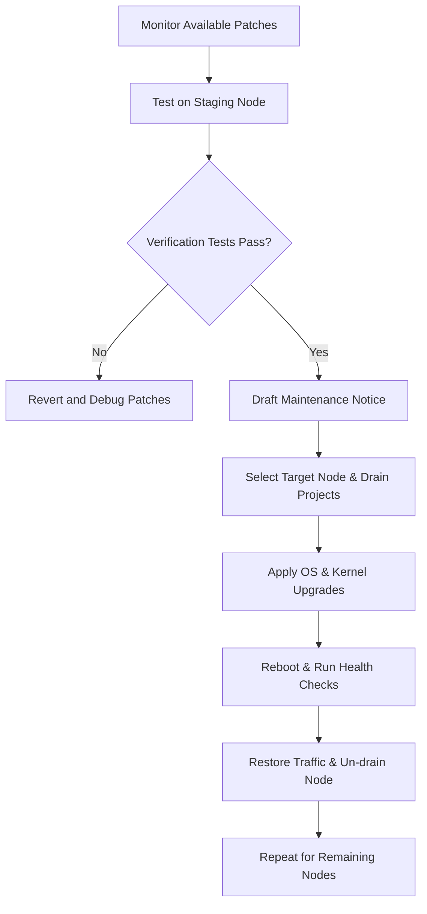
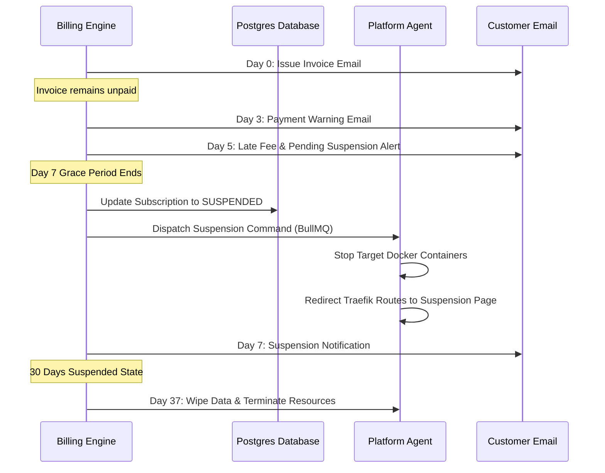
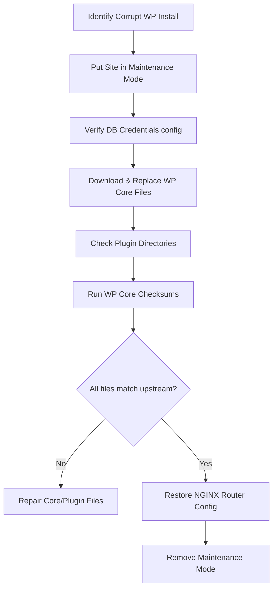

# Operations Manual: ITBengal Hosting Platform
**Document Version:** 2.4.0  
**Target Audience:** DevOps Engineers, System Administrators, Database Administrators, Support Engineers  
**Classification:** Internal Technical Documentation  

---

## Document Overview
This operations manual outlines the end-to-end procedures for provisioning, maintaining, monitoring, troubleshooting, and decommissioning infrastructure, applications, and customer environments within the ITBengal self-managed hosting cluster. Use this document as the single source of truth for standard operating procedures (SOPs) and incident runbooks.

---

## Table of Contents
1. [Server Fleet Operations](#1-server-fleet-operations)
   * [1.1 Onboarding New React Hosting Nodes](#11-onboarding-new-react-hosting-nodes)
   * [1.2 Onboarding WordPress Hosting Nodes](#12-onboarding-wordpress-hosting-nodes)
   * [1.3 Server Upgrade & Patching Lifecycle](#13-server-upgrade--patching-lifecycle)
   * [1.4 Node Drainage & Evacuation Procedure](#14-node-drainage--evacuation-procedure)
   * [1.5 Node Decommission Runbook](#15-node-decommission-runbook)
2. [Customer Lifecycle Operations](#2-customer-lifecycle-operations)
   * [2.1 Tenant Resource & Onboarding Limits](#21-tenant-resource--onboarding-limits)
   * [2.2 Billing Suspension & Inactivity Procedures](#22-billing-suspension--inactivity-procedures)
   * [2.3 Manual Resource Tier Adjustments](#23-manual-resource-tier-adjustments)
   * [2.4 Support Ticket Routing & Escalation Matrices](#24-support-ticket-routing--escalation-matrices)
3. [Backup & Data Integrity Operations](#3-backup--data-integrity-operations)
   * [3.1 Platform & WordPress Database Backup Routines](#31-platform--wordpress-database-backup-routines)
   * [3.2 Write-Ahead Log (WAL) Archiving & Verification](#32-write-ahead-log-wal-archiving--verification)
   * [3.3 File System Compression & Storage Backups](#33-file-system-compression--storage-backups)
   * [3.4 Offsite Backup Synchronization Verification](#34-offsite-backup-synchronization-verification)
   * [3.5 Complete Restoration Runbooks](#35-complete-restoration-runbooks)
4. [Monitoring & Alert Triage](#4-monitoring--alert-triage)
   * [4.1 Incident Categorization Framework](#41-incident-categorization-framework)
   * [4.2 Alertmanager Notification Routing Rules](#42-alertmanager-notification-routing-rules)
   * [4.3 Runbooks for Common System Alerts](#43-runbooks-for-common-system-alerts)
5. [Troubleshooting & Runbooks](#5-troubleshooting--runbooks)
   * [5.1 Comprehensive System Diagnostic Commands](#51-comprehensive-system-diagnostic-commands)
   * [5.2 Fixing Corrupted WordPress Installations](#52-fixing-corrupted-wordpress-installations)
   * [5.3 Resolving Container Restart Loops](#53-resolving-container-restart-loops)
   * [5.4 Troubleshooting DNS Synchronization Failures](#54-troubleshooting-dns-synchronization-failures)
   * [5.5 Resolving SSL ACME Challenge Failures](#55-resolving-ssl-acme-challenge-failures)
6. [Communication Templates](#6-communication-templates)
   * [6.1 Standard Incident Update Notifications](#61-standard-incident-update-notifications)
   * [6.2 Scheduled Maintenance Notifications](#62-scheduled-maintenance-notifications)
   * [6.3 SLA Outage Credit Adjustment Templates](#63-sla-outage-credit-adjustment-templates)

---

## 1. Server Fleet Operations

### 1.1 Onboarding New React Hosting Nodes
React Hosting Nodes run containerized static sites, single-page apps (SPAs), and SSR frameworks (Vite, Next.js, Svelte, etc.) behind a dynamically configured Traefik instance.

#### 1.1.1 Prerequisites
- **Target OS:** Ubuntu 22.04 LTS (Minimal installation).
- **Network:** 1x Public IPv4 Address, 1x Private IPv4 Address (in the private platform subnet).
- **DNS:** Hostname mapped to the public IP (e.g., `react-node-24.itbengal.com`).
- **Hardware Minimums:** 4 vCPUs, 8 GB ECC RAM, 80 GB NVMe Storage.

#### 1.1.2 Step-by-Step Installation Commands
Execute the following commands on the target node via SSH as `root` or a user with passwordless `sudo` privileges:

```bash
# 1. Update OS and Install Base Utilities
sudo apt-get update && sudo apt-get upgrade -y
sudo apt-get install -y curl git ufw jq zip unzip tar fail2ban unattended-upgrades

# 2. Configure UFW Firewall Rules
sudo ufw default deny incoming
sudo ufw default allow outgoing
sudo ufw allow 22/tcp comment 'SSH Port'
sudo ufw allow 80/tcp comment 'HTTP Web'
sudo ufw allow 443/tcp comment 'HTTPS Web'
sudo ufw allow 9100/tcp comment 'Prometheus Node Exporter'
sudo ufw allow 8082/tcp comment 'Traefik Dashboard Internal'
sudo ufw enable
```

#### 1.1.3 Docker Engine Daemon Configuration
Install Docker using the official upstream repository:

```bash
sudo mkdir -p /etc/apt/keyrings
curl -fsSL https://download.docker.com/linux/ubuntu/gpg | sudo gpg --dearmor -o /etc/apt/keyrings/docker.gpg
echo "deb [arch=$(dpkg --print-architecture) signed-by=/etc/apt/keyrings/docker.gpg] https://download.docker.com/linux/ubuntu $(lsb_release -cs) stable" | sudo tee /etc/apt/sources.list.d/docker.list > /dev/null

sudo apt-get update
sudo apt-get install -y docker-ce docker-ce-cli containerd.io docker-compose-plugin
```

Write the following custom log-rotation, IP pool, and security configurations to `/etc/docker/daemon.json`:

```json
{
  "log-driver": "json-file",
  "log-opts": {
    "max-size": "50m",
    "max-file": "3"
  },
  "default-address-pools": [
    {
      "base": "172.20.0.0/16",
      "size": 24
    }
  ],
  "icc": false,
  "live-restore": true,
  "userland-proxy": false
}
```
Restart Docker to apply the daemon configurations:
```bash
sudo systemctl daemon-reload
sudo systemctl restart docker
```

#### 1.1.4 Traefik Node Proxy Deployment
Create the Traefik configuration tree:
```bash
sudo mkdir -p /opt/itbengal/traefik/acme
sudo chmod -R 600 /opt/itbengal/traefik/acme
```

Write the file `/opt/itbengal/traefik/docker-compose.yml`:
```yaml
version: "3.8"

services:
  traefik:
    image: traefik:v2.10
    container_name: itbengal-traefik
    restart: always
    security_opt:
      - no-new-privileges:true
    ports:
      - "80:80"
      - "443:443"
    volumes:
      - /var/run/docker.sock:/var/run/docker.sock:ro
      - /opt/itbengal/traefik/acme:/letsencrypt
    command:
      - "--global.checknewversion=false"
      - "--global.sendanonymoususage=false"
      - "--entryPoints.web.address=:80"
      - "--entryPoints.websecure.address=:443"
      - "--providers.docker=true"
      - "--providers.docker.exposedbydefault=false"
      - "--providers.docker.network=itbengal-public"
      - "--certificatesresolvers.letsencrypt-resolver.acme.httpchallenge=true"
      - "--certificatesresolvers.letsencrypt-resolver.acme.httpchallenge.entrypoint=web"
      - "--certificatesresolvers.letsencrypt-resolver.acme.email=ssl-admin@itbengal.com"
      - "--certificatesresolvers.letsencrypt-resolver.acme.storage=/letsencrypt/acme.json"
      - "--log.level=INFO"
      - "--accesslog=true"
    networks:
      - itbengal-public

networks:
  itbengal-public:
    name: itbengal-public
    external: false
```
Initialize the network and deploy Traefik:
```bash
docker network create itbengal-public
cd /opt/itbengal/traefik
docker compose up -d
```

#### 1.1.5 Platform Server Database Registration
Insert the new node into the PostgreSQL main database using administrative SQL. Access the Platform Database shell:
```sql
INSERT INTO servers (
  id, 
  hostname, 
  ip_address, 
  role, 
  status, 
  cpu_cores, 
  total_ram_bytes, 
  total_disk_bytes, 
  api_token, 
  created_at
) VALUES (
  gen_random_uuid(), 
  'react-node-24.itbengal.com', 
  '192.168.10.124', 
  'REACT_NODE', 
  'ACTIVE', 
  4, 
  8589934592, 
  85899345920, 
  'tok_sec_react_node_24_prod_99f82d', 
  NOW()
);
```

---

### 1.2 Onboarding WordPress Hosting Nodes
WordPress Hosting Nodes host independent, containerized WordPress stacks (NGINX edge proxy, isolated PHP-FPM containers, and isolated or shared MariaDB databases).

#### 1.2.1 Prerequisites
- **Target OS:** Ubuntu 22.04 LTS (Minimal installation).
- **Network:** 1x Public IPv4 Address, 1x Private IPv4 Address.
- **Hardware Minimums:** 8 vCPUs, 16 GB ECC RAM, 200 GB NVMe Storage (optimized for high write-IOPS).

#### 1.2.2 PHP-FPM Base Configuration
Install PHP-FPM version 8.2 on the host machine to serve as a validation mechanism and manage cron tasks:
```bash
sudo apt-get install -y software-properties-common
sudo add-apt-repository ppa:ondrej/php -y
sudo apt-get update
sudo apt-get install -y php8.2-fpm php8.2-mysql php8.2-xml php8.2-gd php8.2-mbstring php8.2-zip php8.2-curl
```

Modify system configuration parameters in `/etc/php/8.2/fpm/pool.d/www.conf` to optimize process allocation:
```ini
pm = dynamic
pm.max_children = 80
pm.start_servers = 10
pm.min_spare_servers = 5
pm.max_spare_servers = 20
pm.max_requests = 1000
```
Restart php8.2-fpm:
```bash
sudo systemctl restart php8.2-fpm
```

#### 1.2.3 Directory Layouts for Multi-Tenant WP Isolation
To prevent cross-directory execution and ensure strict Linux security, all sites are stored under `/var/www/wordpress/`:
```bash
sudo mkdir -p /var/www/wordpress/sites
sudo groupadd wp-tenants
```

For every site onboarded on the node, use the following layout:
```text
/var/www/wordpress/sites/<site_id>/
├── public/                # Document root for WordPress files
│   ├── wp-content/
│   ├── wp-config.php
│   └── index.php
├── logs/                  # Isolated access and error logs
│   ├── nginx_access.log
│   └── nginx_error.log
└── config/                # Environment configuration files
    └── php-fpm.conf
```
Establish directory ownership and permissions constraints:
```bash
sudo chown -R www-data:wp-tenants /var/www/wordpress/sites
sudo chmod -R 750 /var/www/wordpress/sites
```

#### 1.2.4 MariaDB Storage Engine Configurations
Install MariaDB Server:
```bash
sudo apt-get install -y mariadb-server mariadb-client
```
Edit `/etc/mysql/mariadb.conf.d/50-server.cnf` to adjust buffer pools and connection limits for high concurrent workloads:
```ini
[mysqld]
user                    = mysql
pid-file                = /run/mysqld/mysqld.pid
socket                  = /run/mysqld/mysqld.sock
port                    = 3306
basedir                 = /usr
datadir                 = /var/lib/mysql
tmpdir                  = /tmp
lc-messages-dir         = /usr/share/mysql
bind-address            = 127.0.0.1
query_cache_size        = 0
query_cache_type        = 0
max_connections         = 500
key_buffer_size         = 64M
max_allowed_packet      = 64M
thread_stack            = 192K
thread_cache_size       = 8
myisam_recover_options  = BACKUP
innodb_buffer_pool_size = 8G
innodb_log_file_size    = 512M
innodb_flush_log_at_trx_commit = 2
innodb_file_per_table   = 1
innodb_open_files       = 400
```
Restart MariaDB:
```bash
sudo systemctl daemon-reload
sudo systemctl restart mariadb
```

#### 1.2.5 Platform Registration SQL
```sql
INSERT INTO servers (
  id, 
  hostname, 
  ip_address, 
  role, 
  status, 
  cpu_cores, 
  total_ram_bytes, 
  total_disk_bytes, 
  api_token, 
  created_at
) VALUES (
  gen_random_uuid(), 
  'wp-node-08.itbengal.com', 
  '192.168.10.128', 
  'WORDPRESS_NODE', 
  'ACTIVE', 
  8, 
  17179869184, 
  214748364800, 
  'tok_sec_wp_node_08_prod_33c91a', 
  NOW()
);
```

---

### 1.3 Server Upgrade & Patching Lifecycle
To secure servers while ensuring 99.9% uptime, updates must follow a staged lifecycle.



#### 1.3.1 Pre-Upgrade Health Check Script
Before triggering updates, execute `/opt/itbengal/scripts/pre-upgrade-check.sh`:
```bash
#!/bin/bash
set -e

echo "=== System Health Check ==="
echo "Node Name: $(hostname)"
echo "Current Time: $(date)"

# Check CPU Load
LOAD=$(uptime | awk -F'load average:' '{ print $2 }' | cut -d, -f1 | xargs)
echo "Current CPU Load: $LOAD"

# Check Free Memory
FREE_MEM=$(free -m | awk '/Mem:/ { print $4 }')
echo "Free RAM: ${FREE_MEM}MB"
if [ "$FREE_MEM" -lt 500 ]; then
  echo "WARNING: Low free memory."
fi

# Check Disk space
DISK_UTIL=$(df / | awk 'NR==2 {print $5}' | sed 's/%//')
echo "Disk Utilization: ${DISK_UTIL}%"
if [ "$DISK_UTIL" -gt 85 ]; then
  echo "CRITICAL: Disk usage above 85%."
  exit 1
fi

# Check Docker Container status
DOCKER_STATUS=$(systemctl is-active docker)
echo "Docker Daemon Status: $DOCKER_STATUS"
if [ "$DOCKER_STATUS" != "active" ]; then
  echo "CRITICAL: Docker daemon not active."
  exit 1
fi

echo "Pre-upgrade check PASSED."
exit 0
```

#### 1.3.2 Execution Sequence (Rolling Upgrades)
To perform zero-downtime maintenance, upgrade nodes sequentially:
1. **Drain Node:** Set target node's status to `DRAINING` in the platform database (restricting new deployments).
2. **Evacuate Traffic:** Migrate existing stateless containers or change DNS targets for high-availability nodes.
3. **Trigger Updates:**
   ```bash
   sudo apt-get update
   sudo apt-get upgrade -y
   sudo apt-get dist-upgrade -y
   ```
4. **Reboot Host:**
   ```bash
   sudo reboot
   ```
5. **Verify Services:** Confirm all systemd daemons and Docker containers restart automatically.
6. **Activate Node:** Set node status back to `ACTIVE`.

#### 1.3.3 Rollback Plan
If services fail to start after upgrading:
1. Check the system journal for errors:
   ```bash
   journalctl -p 3 -xb
   ```
2. Revert packages using the cached deb packages in `/var/cache/apt/archives/`:
   ```bash
   sudo apt-get install --reinstall <package_name>=<previous_version>
   ```
3. If the kernel was upgraded and causes instability, update GRUB configurations to boot into the previous kernel:
   ```bash
   sudo sed -i 's/GRUB_DEFAULT=0/GRUB_DEFAULT="1>2"/g' /etc/default/grub
   sudo update-grub
   sudo reboot
   ```

---

### 1.4 Node Drainage & Evacuation Procedure
When decommissioning or replacing physical hardware, active workloads must be migrated to another server without breaking user site configurations.

#### 1.4.1 Step 1: Change Node Status
Mark the source node status as `DRAINING` in the PostgreSQL database:
```sql
UPDATE servers SET status = 'DRAINING' WHERE hostname = 'react-node-04.itbengal.com';
```

#### 1.4.2 Step 2: Fetch and Reallocate Apps
Use the command-line utility to pull all active apps assigned to the draining node and queue their migration to other targets:
```bash
# Execute the node evacuation CLI script
node /opt/itbengal/platform-engine/dist/scripts/evacuate-node.js \
  --source-node 'react-node-04.itbengal.com' \
  --strategy 'least-connections' \
  --dry-run false
```

#### 1.4.3 Evacuation Script Flow
Below is the logic executed by the node migration worker:
1. Identify all containers running on `react-node-04.itbengal.com`.
2. Retrieve alternative node with lowest workload pool capacity (`react-node-05`).
3. Rsync user data profiles and directories:
   ```bash
   rsync -azP --delete /var/www/wordpress/sites/site_id/ root@react-node-05.itbengal.com:/var/www/wordpress/sites/site_id/
   ```
4. Start Docker container on `react-node-05` using identical environment variable files.
5. Query Openprovider API wrappers to update the DNS A record of the client domain to point to the new IP.
6. Stop and delete the container on the source node once DNS health check resolves success on the destination node.

---

### 1.5 Node Decommission Runbook
Once drainage reaches 0 active customer websites, execute the cleanup process to isolate the server.

```bash
# 1. Clean local Docker system variables
docker system prune -a --volumes --force

# 2. Stop running agents and services
sudo systemctl stop itbengal-agent || true
sudo systemctl disable itbengal-agent || true

# 3. Clean environment assets and credentials
sudo rm -rf /opt/itbengal/
sudo rm -rf /etc/docker/daemon.json
sudo rm -rf /root/.ssh/authorized_keys_platform

# 4. Remove Docker network hooks and iptables rules
sudo iptables -F
sudo iptables -t nat -F
sudo systemctl restart ufw
```

In the PostgreSQL DB, clean server records:
```sql
DELETE FROM servers WHERE hostname = 'react-node-04.itbengal.com';
```

---

## 2. Customer Lifecycle Operations

### 2.1 Tenant Resource & Onboarding Limits
To protect the VPS cluster from resource starvation, we impose limits enforced at the middleware layer.

| Resource Category | Starter Plan | Basic Plan | Professional Plan | Business Plan | Enterprise Plan |
| :--- | :--- | :--- | :--- | :--- | :--- |
| **Max React Projects** | 2 | 5 | 15 | 50 | Unlimited |
| **Max WordPress Sites**| 1 | 2 | 8 | 20 | Custom |
| **CPU Limit per Container**| 0.5 Cores | 1.0 Cores | 2.0 Cores | 4.0 Cores | Dedicated (up to 16) |
| **RAM Limit per Container**| 512 MB | 1024 MB | 2048 MB | 4096 MB | Dedicated (up to 32GB) |
| **Storage Quota (NVMe)** | 5 GB | 15 GB | 50 GB | 150 GB | 500 GB |
| **Bandwidth (Monthly)** | 100 GB | 500 GB | 2000 GB | 5000 GB | Uncapped |
| **Max DB Connections** | 20 | 50 | 150 | 300 | 1000 |

#### 2.1.1 Enforcement Implementation
The application router limits access via a Express.js validation middleware:
```javascript
// middleware/quotaEnforcer.js
async function checkQuotas(req, res, next) {
  const { tenantId } = req.user;
  const currentUsage = await db.getCurrentResourceUsage(tenantId);
  const activePlan = await db.getUserPlan(tenantId);

  if (currentUsage.storageBytes >= activePlan.max_storage_bytes) {
    return res.status(403).json({
      error: "STORAGE_LIMIT_EXCEEDED",
      message: "You have exceeded your plan's NVMe storage capacity. Please upgrade or delete old backups."
    });
  }
  
  if (currentUsage.activeProjects >= activePlan.max_projects) {
    return res.status(403).json({
      error: "PROJECT_LIMIT_EXCEEDED",
      message: "Max active projects limit reached for this tier."
    });
  }
  
  next();
}
```

---

### 2.2 Billing Suspension & Inactivity Procedures
When a customer fails to settle an invoice, the system follows a 30-day grace and termination sequence.



#### 2.2.1 Suspension Script Example
The node agent executes `suspend-site.sh` when a tenant's billing status transitions to `suspended`:
```bash
#!/bin/bash
# Usage: ./suspend-site.sh <site_id> <tenant_domain>

SITE_ID=$1
DOMAIN=$2

if [ -z "$SITE_ID" ] || [ -z "$DOMAIN" ]; then
  echo "Usage: ./suspend-site.sh <site_id> <tenant_domain>"
  exit 1
fi

echo "Suspending Site ID: $SITE_ID (Domain: $DOMAIN)"

# Stop running container if exists
docker stop "app-${SITE_ID}" || true

# Apply the suspended template routing inside Traefik config
cat <<EOF > /opt/itbengal/traefik/dynamic/suspended-${SITE_ID}.toml
[http.routers.suspended-${SITE_ID}]
  rule = "Host(\`${DOMAIN}\`) || Host(\`www.${DOMAIN}\`)"
  service = "suspended-landing-page-service"
  entryPoints = ["web", "websecure"]
  [http.routers.suspended-${SITE_ID}.tls]
    certResolver = "letsencrypt-resolver"

[http.services.suspended-landing-page-service.loadBalancer]
  [[http.services.suspended-landing-page-service.loadBalancer.servers]]
    url = "http://192.168.10.10:8080" # Platform suspended message endpoint
EOF

# Reload Traefik config dynamically
echo "Suspension routing applied."
```

---

### 2.3 Manual Resource Tier Adjustments
Occasionally, Enterprise clients or customers experiencing traffic spikes require ad-hoc overrides of default resource quotas.

#### 2.3.1 Database Query to Update Limits
Use Postgres console access to manually increase CPU cores, RAM limits, and disk space constraints:
```sql
UPDATE subscriptions 
SET 
  custom_limits_enabled = TRUE,
  max_cpu_cores = 8.0,
  max_ram_bytes = 17179869184,   -- 16 GB
  max_storage_bytes = 107374182400 -- 100 GB
WHERE organization_id = (
  SELECT id FROM organizations WHERE slug = 'customer-enterprise-slug'
);
```

#### 2.3.2 Applying Limits Dynamically to Docker Containers
Once updated in the DB, trigger a live rebuild on the node host:
```bash
# Retrieve container ID and execute dynamic Docker resource update
docker update \
  --cpus 8 \
  --memory 16g \
  --memory-swap 16g \
  app-enterprise-container-hash
```

---

### 2.4 Support Ticket Routing & Escalation Matrices
Support queries must adhere to strict target response and resolution times (SLAs) based on priority:

| Ticket Severity | Target Response | Target Resolution | Assigned Group | Escalate To |
| :--- | :--- | :--- | :--- | :--- |
| **Severity 1 (Critical Outage)** | 15 mins | 2 hours | L3 DevOps Operations | Director of Infrastructure |
| **Severity 2 (Performance Issue)**| 1 hour | 6 hours | L2 Systems Specialists | Lead DevOps Engineer |
| **Severity 3 (General Query)** | 4 hours | 24 hours | L1 Customer Support | L2 Support Specialist |
| **Billing Issues** | 2 hours | 12 hours | Billing Ops Queue | Financial Auditor |

#### 2.4.1 Escalation Routing Rules (BullMQ Worker)
When a ticket is created, it passes through the platform router:
```javascript
// workers/ticketRouter.js
function routeTicket(ticket) {
  if (ticket.priority === 'P1' && ticket.isSystemDown === true) {
    // Escalate instantly to PagerDuty & Slack DevOps Channels
    pagerduty.triggerAlert({
      summary: `P1 Outage Alert: ${ticket.title}`,
      severity: 'critical',
      source: 'User Ticket Portal'
    });
    slack.notifyChannel('#ops-p1-alerts', `<!here> P1 SLA Critical Ticket: ${ticket.id}`);
    return 'L3_DEVOPS_QUEUE';
  }
  
  if (ticket.category === 'billing') {
    return 'BILLING_QUEUE';
  }
  
  return 'L1_GENERAL_SUPPORT';
}
```

---

## 3. Backup & Data Integrity Operations

### 3.1 Platform & WordPress Database Backup Routines
ITBengal enforces a dual-backup strategy: transactional WAL archiving for disaster recovery, combined with daily logical schema snapshots.

#### 3.1.1 PostgreSQL Hot Backup Script
This script running on the Platform Database Server executes every night at 02:00 BDT:
```bash
#!/bin/bash
# /opt/itbengal/scripts/postgres-backup.sh
set -eo pipefail

BACKUP_DIR="/opt/itbengal/backups/postgres"
TIMESTAMP=$(date +%F_%H%M%S)
EXPORT_FILE="${BACKUP_DIR}/db_itbengal_${TIMESTAMP}.sql.zst"
S3_BUCKET="s3://itbengal-backups-prod/database/postgres/"

mkdir -p "$BACKUP_DIR"

echo "Starting logical PG dump..."
pg_dump -U itbengal_admin -h 127.0.0.1 -d itbengal_prod -F c | zstd -o "$EXPORT_FILE"

# Calculate checksum
sha256sum "$EXPORT_FILE" > "${EXPORT_FILE}.sha256"

echo "Encrypting backup archive with GPG..."
gpg --encrypt --recipient "backup-admin@itbengal.com" --output "${EXPORT_FILE}.gpg" "$EXPORT_FILE"

echo "Uploading encrypted backup to offsite storage..."
aws s3 cp "${EXPORT_FILE}.gpg" "${S3_BUCKET}db_itbengal_${TIMESTAMP}.sql.zst.gpg"
aws s3 cp "${EXPORT_FILE}.sha256" "${S3_BUCKET}db_itbengal_${TIMESTAMP}.sql.zst.sha256"

# Cleanup local temp files
rm -f "$EXPORT_FILE" "${EXPORT_FILE}.gpg" "${EXPORT_FILE}.sha256"
echo "PG Backup successfully shipped."
```

#### 3.1.2 MariaDB/MySQL Hot Backup (WordPress Sites)
For WordPress databases, execute dumps with transactional parameters to avoid lockups:
```bash
mysqldump \
  --single-transaction \
  --quick \
  --add-drop-table \
  --routines \
  --triggers \
  -u wp_db_user \
  -p"wp_db_pass" \
  -h localhost \
  wp_db_name | zstd > /tmp/wp_db_backup.sql.zst
```

---

### 3.2 Write-Ahead Log (WAL) Archiving & Verification
For zero-data-loss database protection, configure WAL shipping to S3 object storage.

#### 3.2.1 PostgreSQL Configurations (`/etc/postgresql/15/main/postgresql.conf`)
```ini
wal_level = replica
archive_mode = on
archive_command = 'test ! -f /mnt/wal_archive/%f && cp %p /mnt/wal_archive/%f'
archive_timeout = 60
```

#### 3.2.2 Archiving Health Check Script
Run `/opt/itbengal/scripts/verify-wal-shipping.sh` as a cron job every 30 minutes:
```bash
#!/bin/bash
set -e

ALERT_WEBHOOK="https://discord.com/api/webhooks/dummy-webhook-url"
WAL_DIR="/mnt/wal_archive"
LATEST_WAL=$(ls -t $WAL_DIR | head -n 1)
LATEST_TIME=$(stat -c %Y "${WAL_DIR}/${LATEST_WAL}")
CURRENT_TIME=$(date +%s)
DIFF=$((CURRENT_TIME - LATEST_TIME))

# Max acceptable delay is 10 minutes (600 seconds)
if [ "$DIFF" -gt 600 ]; then
  PAYLOAD="{\"content\": \"CRITICAL: WAL log archiving has stalled. Last archived file is $DIFF seconds old. Check archive disk space instantly!\"}"
  curl -H "Content-Type: application/json" -X POST -d "$PAYLOAD" "$ALERT_WEBHOOK"
  exit 1
fi

echo "WAL shipping is healthy. Lag is $DIFF seconds."
```

---

### 3.3 File System Compression & Storage Backups
Customer file uploads, static React builds, and WordPress media directories (`wp-content/uploads`) are zipped and archived using Zstandard compression.

#### 3.3.1 Exclusions Configuration file (`/etc/itbengal/backup-exclude.lst`)
```text
node_modules/
.cache/
.git/
*.log
*.tmp
wp-content/cache/
```

#### 3.3.2 Compression Routine Command
```bash
tar --exclude-from=/etc/itbengal/backup-exclude.lst -I 'zstd -T4' -cf \
  /opt/itbengal/backups/files/site_files_${SITE_ID}_$(date +%F).tar.zst \
  /var/www/wordpress/sites/${SITE_ID}/
```

---

### 3.4 Offsite Backup Synchronization Verification
Verify that uploaded backups match local sources and are not corrupted.

```bash
#!/bin/bash
# /opt/itbengal/scripts/verify-backup-sync.sh
set -eo pipefail

BUCKET="s3://itbengal-backups-prod/database/postgres"
LOCAL_CHECKSUM_FILE="/opt/itbengal/backups/last_export.sha256"

# 1. Download SHA256 file from remote store
aws s3 cp "${BUCKET}/latest.sha256" /tmp/remote.sha256

# 2. Extract hashes
LOCAL_HASH=$(cat "$LOCAL_CHECKSUM_FILE" | awk '{print $1}')
REMOTE_HASH=$(cat /tmp/remote.sha256 | awk '{print $1}')

# 3. Compare values
if [ "$LOCAL_HASH" != "$REMOTE_HASH" ]; then
  echo "CRITICAL: Checksum mismatch. Remote backup file corrupted!"
  exit 1
else
  echo "SUCCESS: Checksums match ($LOCAL_HASH). Backup matches local source."
fi
```

---

### 3.5 Complete Restoration Runbooks
Follow these guides step-by-step to restore services during catastrophic failures.

#### 3.5.1 WordPress Site File and Database Restore Runbook
1. **Locate Identifiers:** Get the target `<site_id>` and `<backup_timestamp>` from the user dashboard ticket or PostgreSQL audit logging.
2. **Download Archives:** Retrieve database and file backups from remote S3 store:
   ```bash
   aws s3 cp s3://itbengal-backups-prod/wp-content/files_wp_${SITE_ID}_2026-07-04.tar.zst /tmp/
   aws s3 cp s3://itbengal-backups-prod/database/db_wp_${SITE_ID}_2026-07-04.sql.zst /tmp/
   ```
3. **Place Site in Maintenance Mode:** Replace the current site nginx configuration with the maintenance redirect to present users with a maintenance screen:
   ```bash
   sudo cp /opt/itbengal/templates/maintenance.conf /var/www/wordpress/sites/${SITE_ID}/config/nginx.conf
   docker restart "nginx-app-${SITE_ID}"
   ```
4. **Wipe Existing Directory Files:** Remove corrupted user code files:
   ```bash
   rm -rf /var/www/wordpress/sites/${SITE_ID}/public/*
   ```
5. **Extract Web Archive:** Extract the compressed archive back into the target folder:
   ```bash
   tar -I zstd -xf /tmp/files_wp_${SITE_ID}_2026-07-04.tar.zst -C /var/www/wordpress/sites/${SITE_ID}/public/
   sudo chown -R www-data:wp-tenants /var/www/wordpress/sites/${SITE_ID}/public
   sudo chmod -R 755 /var/www/wordpress/sites/${SITE_ID}/public
   ```
6. **Drop & Recreate Database:** Clean active tables from DB:
   ```bash
   mysql -u root -p -e "DROP DATABASE IF EXISTS wp_${SITE_ID}; CREATE DATABASE wp_${SITE_ID};"
   ```
7. **Import Data:** Decompress and load the SQL backup dump:
   ```bash
   zstd -dc /tmp/db_wp_${SITE_ID}_2026-07-04.sql.zst | mysql -u root -p wp_${SITE_ID}
   ```
8. **Verify Configs:** Confirm database credentials in `wp-config.php` match:
   ```bash
   grep DB_PASSWORD /var/www/wordpress/sites/${SITE_ID}/public/wp-config.php
   ```
9. **Remove Maintenance Mode:** Restore the production nginx routing and restart the web container:
   ```bash
   sudo cp /opt/itbengal/templates/wp-production.conf /var/www/wordpress/sites/${SITE_ID}/config/nginx.conf
   docker restart "nginx-app-${SITE_ID}"
   ```
10. **Flush Redis Cache:** Remove outdated page fragments:
    ```bash
    redis-cli -h 127.0.0.1 -p 6379 "KEYS" "wp_${SITE_ID}:*" | xargs redis-cli -h 127.0.0.1 -p 6379 "DEL"
    ```
11. **Run Fallback Check:** If the restoration process encounters errors (e.g., checksum mismatch or disk space failure), revert immediately to the previous state using the local snapshot created before starting:
    ```bash
    tar -I zstd -xf /tmp/pre_restore_backup_${SITE_ID}.tar.zst -C /var/www/wordpress/sites/${SITE_ID}/public/
    ```

---

## 4. Monitoring & Alert Triage

### 4.1 Incident Categorization Framework
Incidents are categorized by severity. This ensures engineers respond immediately to critical outages while leaving non-blocking issues for business hours.

| Incident Level | Description / Trigger Criteria | Target SLA (MTTR) | PagerDuty Call Escalation? |
| :--- | :--- | :--- | :--- |
| **P1 - Critical** | Platform-wide failure. Customer websites offline on multiple hosting nodes. PostgreSQL main database unreachable. Global DNS resolves fail. Billing gateways timeout. | **< 30 Minutes** | **Immediate** (24/7/365 pager call) |
| **P2 - Major** | Single React or WordPress hosting node offline. Resource exhaustion on host servers causing slow responses. Let's Encrypt renewal pipeline down. | **< 2 Hours** | **Daytime/Scheduled Ops Call** (08:00 - 22:00 BDT) |
| **P3 - Minor** | Dashboard interface bugs. Support tickets delay. Documentation adjustments. Manual resource billing limits adjustment requests. | **< 24 Hours** | **No** (Ticket Queue only) |

---

### 4.2 Alertmanager Notification Routing Rules
Configure Alertmanager to dispatch high-priority notifications to Slack/PagerDuty and low-priority tasks to Email.

#### `/etc/prometheus/alertmanager.yml` Configuration:
```yaml
global:
  resolve_timeout: 5m
  pagerduty_url: 'https://events.pagerduty.com/v2/enqueue'

route:
  group_by: ['alertname', 'cluster', 'service']
  group_wait: 30s
  group_interval: 5m
  repeat_interval: 4h
  receiver: 'slack-default'
  routes:
    - match:
        severity: critical
      receiver: 'pagerduty-ops-team'
      continue: true
    - match:
        severity: warning
      receiver: 'slack-warnings'

receivers:
- name: 'slack-default'
  slack_configs:
  - api_url: 'https://example.com/slack-webhook-placeholder-1'
    channel: '#ops-alerts'
    send_resolved: true

- name: 'slack-warnings'
  slack_configs:
  - api_url: 'https://example.com/slack-webhook-placeholder-2'
    channel: '#ops-warnings'
    send_resolved: true

- name: 'pagerduty-ops-team'
  pagerduty_configs:
  - service_key: 'pd-integration-service-key-prod'
    send_resolved: true
```

---

### 4.3 Runbooks for Common System Alerts

#### 4.3.1 Disk Space Exhausted Alert (Disk Utilization > 85%)
- **Condition:** Alert `DiskSpaceRunningLow` fires on Prometheus.
- **Triage and Execution Steps:**
  1. SSH into the reporting host and locate directories consuming the most disk space:
     ```bash
     df -h
     sudo ncdu / --exclude /proc --exclude /sys
     ```
  2. Clean build caches and unused packages:
     ```bash
     sudo apt-get autoremove -y && sudo apt-get clean
     ```
  3. Prune unused Docker builds, networks, and containers:
     ```bash
     docker system prune -a --volumes --force
     ```
  4. Find and remove log files larger than 1GB:
     ```bash
     find /var/log -type f -size +1G
     # Clear log content without deleting files to avoid process locks:
     sudo truncate -s 0 /var/log/nginx/access.log
     sudo truncate -s 0 /var/log/syslog
     ```

#### 4.3.2 Node CPU Utilization High Alert (CPU Usage > 90% for 5 minutes)
- **Condition:** Alert `HostHighCpuLoad` triggered.
- **Triage and Execution Steps:**
  1. Print processes sorted by CPU load:
     ```bash
     top -b -n 1 | head -n 20
     ```
  2. Display active Docker container statistics:
     ```bash
     docker stats --no-stream --format "table {{.Name}}\t{{.CPUPerc}}\t{{.MemUsage}}" | sort -k 2 -h -r | head -n 10
     ```
  3. Inspect container logs if an application is looped:
     ```bash
     docker logs --tail 200 "app-container-name"
     ```
  4. Throttle the container runtime limits dynamically:
     ```bash
     docker update --cpus 0.5 --memory 1g "app-container-name"
     ```
  5. Check for external network flooding using Netstat:
     ```bash
     netstat -pant | grep :80 | awk '{print $5}' | cut -d: -f1 | sort | uniq -c | sort -rn | head -n 10
     # If an IP has over 500 open requests, block it in UFW:
     sudo ufw insert 1 deny from <malicious_ip> to any
     ```

#### 4.3.3 Database Connection Limits Reached Alert (Active DB Connections > 85%)
- **Condition:** Postgres main database or WordPress node database throws too many open connections error.
- **Triage and Execution Steps:**
  1. Query active PostgreSQL connections using administrative commands:
     ```sql
     SELECT pid, user, client_addr, state, query 
     FROM pg_stat_activity 
     WHERE state != 'idle';
     ```
  2. Terminate rogue query PIDs that are blocking locks:
     ```sql
     SELECT pg_terminate_backend(pid) FROM pg_stat_activity WHERE pid = <pid>;
     ```
  3. Adjust PgBouncer connection pools to manage routing safely:
     ```bash
     sudo systemctl status pgbouncer
     # Restart if hung
     sudo systemctl restart pgbouncer
     ```

#### 4.3.4 Traefik SSL Certificate Validation Failure Alert
- **Condition:** Customer custom domain fails HTTPS access handshake.
- **Triage and Execution Steps:**
  1. Check certificate logs on the target node:
     ```bash
     docker logs itbengal-traefik 2>&1 | grep -iE "acme|ssl|letsencrypt" | tail -n 100
     ```
  2. Confirm public DNS resolving matches:
     ```bash
     dig +short A target-domain.com
     ```
  3. Force Traefik to request the certificate validation target again by clearing ACME cache entries and restarting:
     ```bash
     # Back up acme.json first
     cp /opt/itbengal/traefik/acme/acme.json /opt/itbengal/traefik/acme/acme.json.bak
     # Force restart to trigger resolver
     docker restart itbengal-traefik
     ```

#### 4.3.5 MFS Billing Callback Timeout Alert
- **Condition:** Callback endpoints for bKash, Nagad, or Rocket fail to confirm transaction status.
- **Triage and Execution Steps:**
  1. Search backend payment worker errors in logs:
     ```bash
     docker logs itbengal-api-server | grep -E "bkash|nagad|payment_timeout"
     ```
  2. Query payment system configuration API endpoints to confirm keys and certificates are valid:
     ```bash
     curl -i -X GET https://api.itbengal.com/v1/payments/health-check
     ```
  3. Run reconciliation script to recover missing webhook data from payments providers:
     ```bash
     node /opt/itbengal/platform-engine/dist/scripts/reconcile-mfs.js --provider bKash --hours 2
     ```

---

## 5. Troubleshooting & Runbooks

### 5.1 Comprehensive System Diagnostic Commands
Below is a lookup table of commands for engineers diagnosing infrastructure issues.

| Command Syntax | Operational Purpose |
| :--- | :--- |
| `journalctl -u docker.service --since "1 hour ago"` | View Docker daemon logs for the last hour. |
| `docker inspect --format='{{.State.ExitCode}}' <container_id>` | Return the exit code of a crashed container. |
| `docker network inspect itbengal-public` | Check network bridge interfaces and container IPs. |
| `ss -tulpn` | Print all listening TCP and UDP sockets with system PIDs. |
| `dig @8.8.8.8 ns-1.openprovider.nl` | Perform external lookup on Openprovider DNS nameservers. |
| `openssl s_client -connect itbengal.com:443 -servername itbengal.com` | Run handshake audit to inspect active TLS certificate chain. |
| `iotop -o -b -n 1` | Identify processes consuming storage read/write bandwidth. |
| `strace -p <pid> -c` | Trace system calls of a hanging application process. |
| `pg_isready -h localhost -p 5432` | Verify PostgreSQL server connection status. |
| `wp core verify-checksums --allow-root` | Scan WordPress directory structure against official release. |

---

### 5.2 Fixing Corrupted WordPress Installations
Corrupt site files usually result from insecure plugins, failed core updates, or filesystem write failures.



#### 5.2.1 Core Reinstall Procedure
1. Navigate to the user directory:
   ```bash
   cd /var/www/wordpress/sites/${SITE_ID}/public
   ```
2. Reinstall core WordPress files without modifying `wp-content`:
   ```bash
   wp core download --version=$(wp core version --allow-root) --force --allow-root
   ```
3. Verify WordPress core integrity:
   ```bash
   wp core verify-checksums --allow-root
   ```
4. If a plugin is throwing fatal errors, search PHP-FPM logs for the path of the error, then disable it:
   ```bash
   wp plugin deactivate <bad-plugin> --allow-root
   ```
5. Check file ownerships:
   ```bash
   chown -R www-data:wp-tenants /var/www/wordpress/sites/${SITE_ID}/public
   find /var/www/wordpress/sites/${SITE_ID}/public -type d -exec chmod 755 {} \;
   find /var/www/wordpress/sites/${SITE_ID}/public -type f -exec chmod 644 {} \;
   ```

---

### 5.3 Resolving Container Restart Loops
Containers repeatedly starting and crashing (with status `restarting`) are usually caused by bad environment variables, config syntax errors, or resource limits.

#### 5.3.1 Step 1: Query Logs & Exit Codes
Find the exit code of the failing container:
```bash
docker ps -a --filter "status=exited"
# Retrieve the exit status code
docker inspect --format '{{.State.Status}} [ExitCode: {{.State.ExitCode}}] [OOMKilled: {{.State.OOMKilled}}]' app-container-hash
```

#### 5.3.2 Exit Code Meanings
- **Exit Code `137`:** Container was terminated by the Linux Out-Of-Memory (OOM) killer. You must increase the memory limit in the dashboard or optimize the user's application memory footprint.
- **Exit Code `127`:** Command or executable not found. Check the user's build command or entrypoint configuration.
- **Exit Code `1`:** Runtime application failure. Run:
  ```bash
  docker logs --tail 200 app-container-hash
  ```
  to read the stack trace.

---

### 5.4 Troubleshooting DNS Synchronization Failures
ITBengal uses Openprovider API webhooks to synchronize custom domain records. If synchronization fails, domains will not point to client nodes correctly.

#### 5.4.1 Script to Manually Synchronize DNS
If the database and Openprovider nameservers drift, execute `/opt/itbengal/scripts/sync-dns-records.js`:
```javascript
#!/usr/bin/env node
// /opt/itbengal/scripts/sync-dns-records.js
const axios = require('axios');
const db = require('../dist/db');

const OPENPROVIDER_API = 'https://api.openprovider.eu/v1/dns';
const API_TOKEN = process.env.OPENPROVIDER_API_TOKEN;

async function syncDomain(domainName) {
  console.log(`Syncing DNS Records for domain: ${domainName}`);
  
  // 1. Get database DNS state
  const records = await db.query('SELECT * FROM dns_records WHERE domain_name = $1', [domainName]);
  
  // 2. Format structure to match Openprovider API payload
  const formattedRecords = records.rows.map(rec => ({
    type: rec.type,
    name: rec.subdomain === '@' ? '' : rec.subdomain,
    value: rec.value,
    ttl: rec.ttl || 3600
  }));

  const payload = {
    domain: {
      name: domainName.split('.')[0],
      extension: domainName.split('.').slice(1).join('.')
    },
    records: formattedRecords
  };

  // 3. Dispatch HTTP request
  try {
    const res = await axios.put(`${OPENPROVIDER_API}/zones`, payload, {
      headers: { 'Authorization': `Bearer ${API_TOKEN}`, 'Content-Type': 'application/json' }
    });
    console.log(`DNS Sync Completed successfully: ${res.data.status}`);
  } catch (err) {
    console.error(`DNS Sync failed for ${domainName}:`, err.response ? err.response.data : err.message);
    process.exit(1);
  }
}

const targetDomain = process.argv[2];
if (!targetDomain) {
  console.error("Usage: node sync-dns-records.js <domain_name>");
  process.exit(1);
}
syncDomain(targetDomain);
```

---

### 5.5 Resolving SSL ACME Challenge Failures
Traefik generates Let's Encrypt certificates using HTTP-01 challenges. If validation fails, check for these issues:

1. **Incorrect A Record:** The domain's public DNS record must point directly to the public IP of the hosting node. Confirm with:
   ```bash
   dig +short A target-domain.com
   ```
2. **Blocked Port 80:** The HTTP-01 challenge requires Let's Encrypt servers to access `http://<domain>/.well-known/acme-challenge/`. Confirm that UFW does not block port 80 traffic:
   ```bash
   sudo ufw status | grep "80/tcp"
   ```
3. **Cloudflare Proxy Conflict:** If the client's domain is configured with Cloudflare's SSL proxy (orange cloud icon enabled), Let's Encrypt HTTP challenges will fail. The client must change their Cloudflare settings from "Flexible" or "Off" to "Full (Strict)", or use DNS-01 validation.
4. **CAA Records Restriction:** Confirm the domain's DNS provider does not restrict certificate issuance via CAA records:
   ```bash
   dig CAA target-domain.com
   ```
   If a CAA record exists, it must explicitly allow `letsencrypt.org`.

---

## 6. Communication Templates

### 6.1 Standard Incident Update Notifications
During outages, communications must follow these templates. Do not change the placeholders inside templates when generating messages.

#### 6.1.1 P1 Outage: Initial Declaration Email
```text
Subject: [CRITICAL OUTAGE ALERT] ITBengal Infrastructure Issues - Investigating

Dear Customer,

We are currently investigating a P1 level network connectivity outage affecting our hosting servers in our Dhaka datacenter.

Impact: During this time, some WordPress and React applications may experience slow response times or display 502/504 gateway timeout errors.

Our engineering team is actively diagnosing the issue. We will post updates to our status page (https://status.itbengal.com) and send further updates by email every 30 minutes until resolution.

We apologize for the interruption.

Sincerely,
ITBengal Infrastructure Operations Team
```

#### 6.1.2 P1 Outage: Progress Update Notification
```text
Subject: [UPDATE] ITBengal Infrastructure Outage - Diagnostic Progress

Dear Customer,

This is an update regarding the network issues reported at 14:00 BDT.

Our engineers have isolated the issue to a hardware network switch failure on Node Group 3. We are configuring routing redirects to bring affected instances back online on alternative systems.

Estimated Resolution Time (ETR): 45 Minutes.

We will send another update as soon as migration is complete or within 30 minutes.

Sincerely,
ITBengal Infrastructure Operations Team
```

#### 6.1.3 P1 Outage: Resolution and Post-Mortem Report
```text
Subject: [RESOLVED] ITBengal Infrastructure Outage - Incident Summary

Dear Customer,

We are pleased to report that the network connectivity issues affecting Node Group 3 have been fully resolved. All client websites and databases are online and operating normally.

Incident Summary:
- Incident Start: 2026-07-04 14:00 BDT
- Incident End: 2026-07-04 15:45 BDT
- Duration: 1 Hour, 45 Minutes
- Root Cause: Hardware failure on datacenter switch port.

We will process SLA uptime audits automatically. If your site's availability fell below our 99.9% uptime guarantee during this billing period, your account will receive credit in accordance with our terms of service.

Thank you for your patience.

Sincerely,
ITBengal Infrastructure Operations Team
```

---

### 6.2 Scheduled Maintenance Notifications

#### 6.2.1 7 Days Prior Maintenance Warning
```text
Subject: [MAINTENANCE NOTICE] Scheduled Upgrades - ITBengal Node Cluster

Dear Customer,

ITBengal will perform scheduled infrastructure maintenance on our hosting servers to apply critical kernel security patches.

Maintenance Window Details:
- Start Time: 2026-07-11 02:00 BDT
- End Time: 2026-07-11 05:00 BDT
- Target Area: React Node Pools

Expected Impact: During this 3-hour maintenance window, individual nodes will be restarted sequentially. Your application may experience a brief interruption of up to 2 minutes as your container is re-routed.

If you have any questions or require adjustments to your migration schedule, please open a ticket in your customer dashboard.

Sincerely,
ITBengal Infrastructure Operations Team
```

#### 6.2.2 24 Hours Prior Maintenance Reminder
```text
Subject: [REMINDER] Scheduled Upgrades Starting in 24 Hours - ITBengal

Dear Customer,

This is a reminder that the scheduled maintenance announced last week is starting tomorrow.

Maintenance Window Details:
- Start Time: 2026-07-11 02:00 BDT
- End Time: 2026-07-11 05:00 BDT

Impact: A brief container restart window of 1 to 2 minutes. Uptime during this window is protected under our scheduled maintenance exemption policy.

Status updates will be published live at https://status.itbengal.com.

Sincerely,
ITBengal Infrastructure Operations Team
```

#### 6.2.3 Maintenance Complete Notice
```text
Subject: [COMPLETED] Scheduled Upgrades - ITBengal System Maintenance

Dear Customer,

The scheduled maintenance on our React Node Pools is now complete. All systems are online and functioning normally.

Summary of Work:
- All server nodes upgraded to the latest security patch versions.
- All Docker container runtimes successfully validated.

Thank you for your cooperation as we work to keep our hosting infrastructure secure and reliable.

Sincerely,
ITBengal Infrastructure Operations Team
```

---

### 6.3 SLA Outage Credit Adjustment Templates

#### 6.3.1 Notification of Automatic Credit Issuance
```text
Subject: SLA Outage Credit Applied to Your ITBengal Account

Dear Customer,

Following the infrastructure outage on 2026-07-04, we conducted an availability audit of your hosted applications.

Because your service fell below our 99.9% uptime guarantee during the billing cycle, we have applied a service credit to your account:

- Affected Project: [Project_Name]
- Measured Monthly Availability: 99.78%
- SLA Credit Percentage Applied: 10%
- Credit Amount Applied: BDT [Amount_Value] / USD [Amount_Value]

This balance has been automatically credited to your account and will be applied to your next monthly invoice.

Thank you for hosting with ITBengal.

Sincerely,
ITBengal Customer Billing Department
```

#### 6.3.2 Credit Application Response (Approved Request)
```text
Subject: SLA Outage Credit Claim Approved - Ticket #[Ticket_Number]

Dear Customer,

We have reviewed your request for SLA credit regarding ticket #[Ticket_Number].

Based on our system logs and internal monitoring, we confirmed your application experienced an unscheduled outage of 45 minutes on 2026-07-04.

Your claim has been approved. A service credit of BDT [Amount_Value] has been credited to your account profile. This will be automatically applied to your invoice on [Next_Billing_Date].

We value your partnership and apologize for the inconvenience this outage caused.

Sincerely,
ITBengal Customer Billing Department
```
