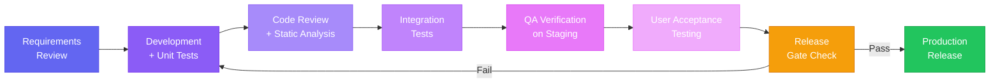
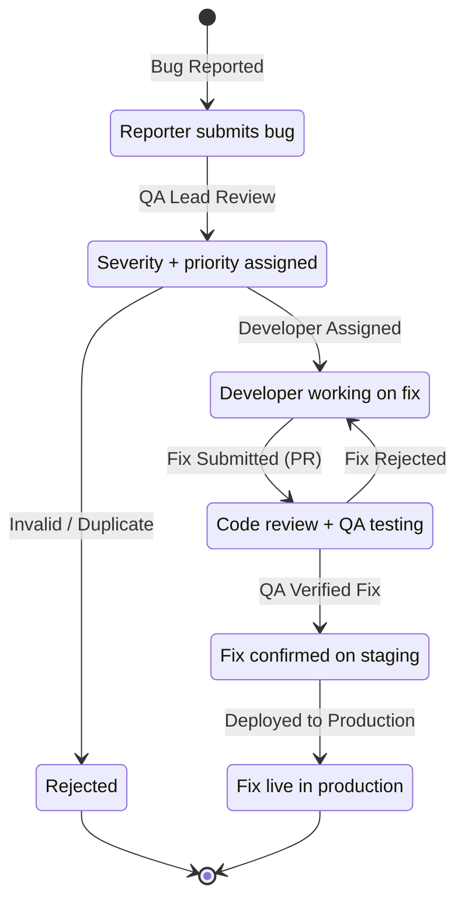
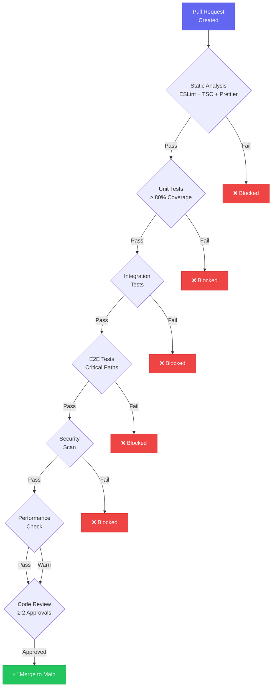
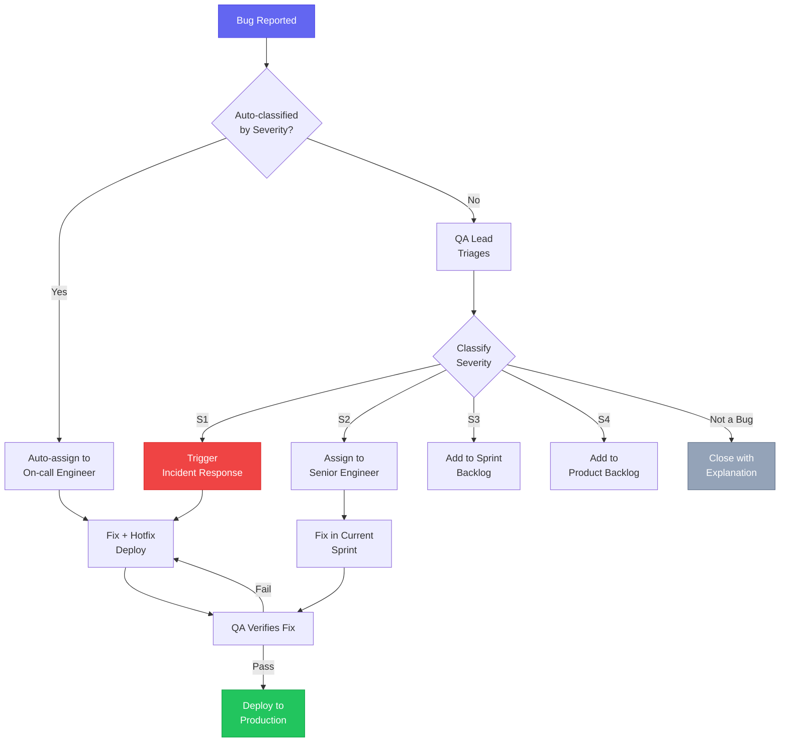
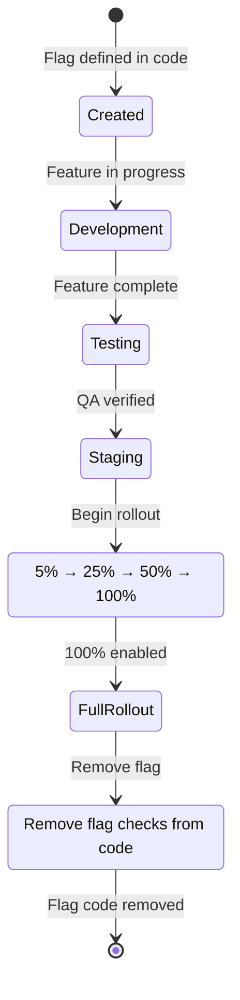

# Quality Assurance Plan

| Field       | Value                                      |
| ----------- | ------------------------------------------ |
| **Document**    | Quality Assurance Plan                 |
| **Version**     | 1.0                                    |
| **Date**        | 2026-07-04                             |
| **Status**      | Approved                               |
| **Owner**       | QA Lead / Engineering Manager          |
| **Applies To**  | All ITBengal platform services         |

---

## Table of Contents

- [1. QA Philosophy & Objectives](#1-qa-philosophy--objectives)
- [2. QA Processes](#2-qa-processes)
- [3. Code Review Standards](#3-code-review-standards)
- [4. Pull Request Template](#4-pull-request-template)
- [5. Release Gates](#5-release-gates)
- [6. Bug Triage](#6-bug-triage)
- [7. Regression Testing](#7-regression-testing)
- [8. Performance Benchmarks](#8-performance-benchmarks)
- [9. Security Review Checklist](#9-security-review-checklist)
- [10. Accessibility Testing](#10-accessibility-testing)
- [11. Cross-Browser & Device Testing Matrix](#11-cross-browser--device-testing-matrix)
- [12. Feature Flags](#12-feature-flags)
- [13. Rollback Criteria](#13-rollback-criteria)
- [14. Quality Metrics & KPIs](#14-quality-metrics--kpis)
- [15. Release Checklist](#15-release-checklist)

---

## 1. QA Philosophy & Objectives

### 1.1 Quality as a Shared Responsibility

Quality is not the QA team's responsibility alone — it belongs to every engineer, designer, and product manager. Every team member is accountable for the quality of their contributions. QA engineers serve as quality advocates, enablers, and automation experts rather than gatekeepers.

### 1.2 Continuous Quality Improvement

Quality is not a checkpoint — it is a continuous feedback loop. We:

- Conduct **blameless retrospectives** on every escaped defect.
- Track **quality metrics** weekly and act on negative trends.
- Invest in **test automation** to replace manual repetitive checks.
- Perform **root cause analysis** for every S1/S2 incident.

### 1.3 Measurable Quality Goals

| Goal                                     | Target            | Measurement                      |
| ---------------------------------------- | ----------------- | -------------------------------- |
| Defect escape rate                       | < 2%              | Bugs found in production / total |
| Customer-reported bugs per release       | < 3               | Support ticket analysis          |
| Test coverage                            | ≥ 80%             | Istanbul/Jest coverage reports   |
| Build success rate                       | ≥ 95%             | CI pipeline metrics              |
| Mean time to detection (MTTD)            | < 10 minutes      | Monitoring + alerting systems    |
| Mean time to resolution (MTTR) — S1      | < 4 hours         | Incident tracking                |
| Change failure rate                      | < 5%              | DORA metrics                     |
| Deployment frequency                     | ≥ 5 deploys/week  | CI/CD metrics                    |

---

## 2. QA Processes

### 2.1 QA Workflow



### 2.2 Development Lifecycle Integration

| Phase                  | QA Activities                                                              |
| ---------------------- | -------------------------------------------------------------------------- |
| **Requirements**       | Review acceptance criteria, identify testability gaps, define test scope   |
| **Design**             | Review API contracts, validate security design, assess performance impact  |
| **Implementation**     | Write unit tests (TDD), static analysis, peer review                       |
| **Integration**        | Automated integration tests, API contract verification                    |
| **QA Verification**    | Exploratory testing, regression suite execution, accessibility audit       |
| **Pre-Release**        | Release gate verification, performance validation, security scan          |
| **Post-Release**       | Production monitoring, smoke tests, customer feedback analysis             |

### 2.3 QA Team Structure

| Role                   | Responsibilities                                                           |
| ---------------------- | -------------------------------------------------------------------------- |
| **QA Lead**            | QA strategy, process improvement, team coordination, release sign-off      |
| **QA Engineer**        | Test plan creation, manual/exploratory testing, bug reporting              |
| **SDET**               | Test automation framework, CI/CD test pipeline, performance test scripts  |
| **Security QA**        | Security testing, vulnerability scanning, pen-test coordination           |
| **All Developers**     | Unit tests, integration tests, code review, fixing defects                |

### 2.4 Defect Lifecycle



---

## 3. Code Review Standards

### 3.1 Code Review Checklist

| Category                | Check                                                                   | Required |
| ----------------------- | ----------------------------------------------------------------------- | -------- |
| **Correctness**         | Logic is correct and handles edge cases                                 | ✅       |
| **Correctness**         | No off-by-one errors, null pointer issues, or race conditions           | ✅       |
| **Security**            | No SQL injection, XSS, CSRF, or insecure deserialization                | ✅       |
| **Security**            | Sensitive data is not logged or exposed in responses                    | ✅       |
| **Security**            | Authentication and authorization checks are present                     | ✅       |
| **Security**            | Input validation with Zod schemas on all endpoints                     | ✅       |
| **Performance**         | No N+1 queries; database queries are indexed                           | ✅       |
| **Performance**         | No unnecessary re-renders in React components                          | ✅       |
| **Performance**         | Large data sets use pagination                                          | ✅       |
| **Readability**         | Code follows naming conventions and project structure                   | ✅       |
| **Readability**         | Complex logic has explanatory comments                                  | ✅       |
| **Readability**         | Functions are small, focused, and have single responsibility           | ✅       |
| **Test Coverage**       | Unit tests cover new/modified logic                                    | ✅       |
| **Test Coverage**       | Integration tests cover new API endpoints                              | ✅       |
| **Test Coverage**       | Edge cases and error scenarios are tested                              | ✅       |
| **Documentation**       | JSDoc for public APIs and complex functions                            | ✅       |
| **Documentation**       | README updated if architecture or setup changes                         | ✅       |
| **Error Handling**      | Errors are caught, logged, and returned with proper status codes        | ✅       |
| **Error Handling**      | No empty catch blocks                                                   | ✅       |
| **TypeScript**          | No `any` types; strict mode passes                                     | ✅       |
| **TypeScript**          | Proper use of interfaces/types, no type assertions without justification | ✅       |

### 3.2 Review SLAs

| Priority       | Description                               | Review SLA         |
| -------------- | ----------------------------------------- | ------------------ |
| **P0 / Critical** | Security fix, production outage fix    | 2 hours            |
| **P1 / High**     | Bug fix, critical feature              | 4 hours            |
| **P2 / Medium**   | Standard feature, improvement          | 1 business day     |
| **P3 / Low**      | Refactor, documentation, chore         | 2 business days    |

### 3.3 Review Requirements

| Requirement                        | Value                                              |
| ---------------------------------- | -------------------------------------------------- |
| Minimum approvals                  | 2 reviewers                                        |
| Mandatory reviewer for auth changes| Security Lead                                      |
| Mandatory reviewer for DB changes  | Backend Lead                                       |
| Mandatory reviewer for infra       | DevOps Lead                                        |
| Maximum PR size                    | 400 lines (recommended), 600 lines (hard limit)   |
| Stale review timeout               | 48 hours → auto-reassign                          |

### 3.4 Automated Review Tools

| Tool               | Purpose                                   | CI Stage  | Blocking |
| ------------------- | ----------------------------------------- | --------- | -------- |
| ESLint              | Code style, best practices               | Lint      | ✅       |
| Prettier            | Code formatting consistency               | Lint      | ✅       |
| TypeScript Compiler | Type checking (`tsc --noEmit`)            | Lint      | ✅       |
| SonarQube           | Code quality, complexity, duplication     | Analysis  | ⚠️ Warning |
| Snyk                | Dependency vulnerabilities                | Security  | ✅ (High+)|
| Codecov             | Coverage diff reporting                   | Tests     | ⚠️ Warning |

---

## 4. Pull Request Template

All pull requests must use the following template:

```markdown
## Description

<!-- Provide a concise summary of the changes and the motivation behind them. -->

## Type of Change

- [ ] 🐛 Bug fix (non-breaking change that fixes an issue)
- [ ] ✨ New feature (non-breaking change that adds functionality)
- [ ] 💥 Breaking change (fix or feature that would cause existing functionality to change)
- [ ] 📝 Documentation update
- [ ] 🔧 Refactor (no functional changes)
- [ ] ⚡ Performance improvement
- [ ] 🔒 Security fix

## Related Issues

<!-- Link related issues: Fixes #123, Closes #456 -->

## Changes Made

<!-- List the key changes in bullet points -->

-
-
-

## Screenshots / Recordings

<!-- Required for UI changes. Delete this section if not applicable. -->

| Before | After |
| ------ | ----- |
|        |       |

## Testing

### Tests Added/Modified

- [ ] Unit tests
- [ ] Integration tests
- [ ] E2E tests

### Manual Testing Steps

1.
2.
3.

## Checklist

### Code Quality
- [ ] My code follows the project's coding standards
- [ ] I have performed a self-review of my code
- [ ] I have added JSDoc for public APIs / complex functions
- [ ] No `any` types are used
- [ ] ESLint and Prettier pass without errors

### Testing
- [ ] I have added tests that cover my changes
- [ ] All existing tests pass
- [ ] Test coverage meets minimum thresholds (≥ 80% lines)

### Database
- [ ] N/A — No database changes
- [ ] Migration file created and tested (up + down)
- [ ] Migration is backwards-compatible
- [ ] Indexes added for new query patterns

### Security
- [ ] Input validation added (Zod schemas)
- [ ] Authentication/authorization checks present
- [ ] No sensitive data in logs or error responses
- [ ] No new dependencies with known vulnerabilities

### Deployment
- [ ] No new environment variables required
- [ ] New environment variables documented in `.env.example`
- [ ] Feature flag configured (if applicable)
- [ ] Rollback plan identified
- [ ] No breaking API changes (or versioned appropriately)

## Deployment Notes

<!-- Any special instructions for deploying this change. -->

## Security Considerations

<!-- Describe any security implications of this change. -->
```

---

## 5. Release Gates

### 5.1 Gate Criteria

| # | Gate                    | Criteria                                          | Tool(s)                    | Required | Blocking |
|---|-------------------------|---------------------------------------------------|----------------------------|----------|----------|
| 1 | Code Review             | ≥ 2 approvals, all conversations resolved         | GitHub                     | ✅       | ✅       |
| 2 | Static Analysis         | Zero ESLint errors, Prettier formatted, `tsc` passes | ESLint, Prettier, TypeScript | ✅       | ✅       |
| 3 | Unit Tests              | All pass, coverage ≥ 80%                          | Jest                       | ✅       | ✅       |
| 4 | Integration Tests       | All pass                                          | Jest + Supertest           | ✅       | ✅       |
| 5 | E2E Tests               | All critical path tests pass                      | Playwright                 | ✅       | ✅       |
| 6 | Security Scan           | No critical/high vulnerabilities                  | npm audit, Snyk, gitleaks  | ✅       | ✅       |
| 7 | Performance Check       | Performance budgets met                           | k6, Lighthouse             | ✅       | ⚠️       |
| 8 | Accessibility Check     | WCAG 2.1 AA compliant, Lighthouse ≥ 90            | axe-core, Lighthouse       | ✅       | ⚠️       |
| 9 | Documentation           | README, API docs, changelog updated               | Manual review              | ✅       | ⚠️       |
| 10| Database Migration      | Tested up/down, backwards compatible              | Manual + CI                | If applicable | ✅ |
| 11| Stakeholder Sign-off    | Product owner approval for feature releases       | Linear / GitHub            | For features | ⚠️ |

### 5.2 Release Gate Flow



---

## 6. Bug Triage

### 6.1 Severity Levels

| Severity | Label        | Definition                                                          | Response Time | Resolution Time | Examples                                                  |
| -------- | ------------ | ------------------------------------------------------------------- | ------------- | --------------- | --------------------------------------------------------- |
| **S1**   | 🔴 Critical  | Platform down, data loss, security breach, payment processing failure | 15 minutes    | 4 hours         | API completely down, database corruption, credentials leak |
| **S2**   | 🟠 High      | Major feature broken, significant user impact, no workaround         | 1 hour        | 8 hours         | Deployments failing, billing errors, login broken          |
| **S3**   | 🟡 Medium    | Feature degraded, workaround available, moderate user impact         | 4 hours       | 48 hours        | Slow dashboard loading, email delays, minor data display   |
| **S4**   | 🟢 Low       | Minor UI issues, cosmetic bugs, minimal user impact                  | 1 business day| 1 sprint        | Alignment issues, typos, tooltip not showing               |

### 6.2 Bug Report Template

```markdown
## Bug Report

**Severity:** S1 / S2 / S3 / S4
**Environment:** Production / Staging / Development
**Browser/Device:** Chrome 125 / macOS Sonoma
**Reporter:** [name]
**Date:** [date]

### Summary
<!-- One-line description of the bug -->

### Steps to Reproduce
1.
2.
3.

### Expected Behavior
<!-- What should happen -->

### Actual Behavior
<!-- What actually happens -->

### Screenshots / Recordings
<!-- Attach screenshots or screen recordings -->

### Console Errors
<!-- Paste any relevant console or log errors -->

```
[paste errors here]
```

### Additional Context
<!-- Any other relevant information (user ID, project ID, deployment ID) -->

### Impact Assessment
- **Users affected:** All / Subset / Single
- **Data integrity:** Compromised / Not affected
- **Workaround available:** Yes (describe) / No
```

### 6.3 Triage Process Flow



### 6.4 Escalation Procedures

| Condition                                   | Action                                              | Escalation Target     |
| ------------------------------------------- | --------------------------------------------------- | --------------------- |
| S1 not acknowledged in 15 minutes           | Page on-call + backup engineer                      | Engineering Manager    |
| S1 not resolved in 4 hours                  | Escalate to CTO                                     | CTO                   |
| S2 not assigned in 1 hour                   | Notify Engineering Manager                          | Engineering Manager    |
| S2 not resolved in 8 hours                  | Reassign to senior engineer                         | QA Lead               |
| Same bug reoccurs after fix                 | Root cause analysis required                        | Engineering Manager    |
| 3+ S3 bugs in same module in one sprint     | Module quality review required                      | QA Lead + Tech Lead   |

---

## 7. Regression Testing

### 7.1 Regression Suite Composition

| Category                     | Test Count | Automation | Run Time  |
| ---------------------------- | ---------- | ---------- | --------- |
| **Smoke Tests**              | 15         | 100%       | < 2 min   |
| **Critical Path Tests**      | 45         | 100%       | < 10 min  |
| **Full Regression Suite**    | 200+       | 95%        | < 30 min  |
| **Visual Regression**        | 30         | 100%       | < 5 min   |
| **Exploratory (Manual)**     | —          | 0%         | 2-4 hours |

### 7.2 Automated Regression Schedule

| Trigger                         | Suite                    | Environment      |
| ------------------------------- | ------------------------ | ---------------- |
| Every pull request              | Smoke + critical path    | CI               |
| Merge to `develop`              | Full regression          | CI               |
| Nightly (2 AM UTC)              | Full regression + visual | Staging          |
| Pre-release                     | Full regression + perf   | Staging          |
| Post-deploy (production)        | Smoke                    | Production       |
| Weekly (Sunday)                 | Full + security scan     | Staging          |

### 7.3 Smoke Test Suite

| # | Test                                    | Endpoint / Flow                      |
|---|-----------------------------------------|--------------------------------------|
| 1 | API health check                        | `GET /api/v1/health`                 |
| 2 | Homepage loads                          | `GET /`                              |
| 3 | Login page renders                      | `GET /login`                         |
| 4 | User can log in                         | `POST /api/v1/auth/login`            |
| 5 | Dashboard loads after login             | `GET /dashboard`                     |
| 6 | Projects list loads                     | `GET /api/v1/projects`               |
| 7 | Create project endpoint responds        | `POST /api/v1/projects`              |
| 8 | Domain search works                     | `GET /api/v1/domains/search`         |
| 9 | Billing page loads                      | `GET /billing`                       |
| 10| Admin login works                       | `POST /api/v1/admin/auth/login`      |
| 11| WebSocket connection established        | `WS /api/v1/ws`                      |
| 12| Static assets load (CSS, JS)            | Bundle files                         |
| 13| Database connectivity                   | Internal health check                |
| 14| Redis connectivity                      | Internal health check                |
| 15| Background worker responding            | BullMQ dashboard health              |

### 7.4 Critical Path Tests

| # | Critical Path                                    | Steps                                           | Priority |
|---|--------------------------------------------------|--------------------------------------------------|----------|
| 1 | User Registration → Verification → Login          | Register, verify email, login, access dashboard  | P0       |
| 2 | Create React Project → Deploy → Verify Live       | Create, connect Git, build, deploy, access URL   | P0       |
| 3 | Custom Domain → DNS → SSL → Verify HTTPS          | Add domain, configure DNS, issue SSL, verify     | P0       |
| 4 | Subscribe → Pay with bKash → Invoice Generated    | Select plan, pay, verify subscription, invoice   | P0       |
| 5 | Subscribe → Pay with Stripe → Invoice Generated   | Select plan, pay, verify subscription, invoice   | P0       |
| 6 | Deployment Rollback → Verify Previous Version     | Deploy, rollback, verify old version is live     | P0       |
| 7 | WordPress One-Click Install → Access Site         | Install, configure, access WordPress admin       | P1       |
| 8 | Domain Purchase → DNS Setup → Verify Resolution   | Search, purchase, configure DNS, verify          | P1       |
| 9 | Team Member Invite → Accept → Access Project      | Invite, accept, verify permissions               | P1       |
| 10| Admin Customer Management → Suspend → Notify      | Admin suspends user, verify access revoked       | P1       |

---

## 8. Performance Benchmarks

### 8.1 Frontend Performance Benchmarks

| Metric                         | Target        | Warning       | Critical      | Tool          |
| ------------------------------ | ------------- | ------------- | ------------- | ------------- |
| Largest Contentful Paint (LCP) | < 2.5 s       | > 3.0 s       | > 4.0 s       | Lighthouse    |
| First Input Delay (FID)        | < 100 ms      | > 150 ms      | > 300 ms      | Web Vitals    |
| Cumulative Layout Shift (CLS)  | < 0.1         | > 0.15        | > 0.25        | Lighthouse    |
| Time to Interactive (TTI)      | < 3.0 s       | > 4.0 s       | > 5.0 s       | Lighthouse    |
| First Contentful Paint (FCP)   | < 1.8 s       | > 2.5 s       | > 3.0 s       | Lighthouse    |
| Total Blocking Time (TBT)      | < 200 ms      | > 400 ms      | > 600 ms      | Lighthouse    |
| JS Bundle Size (gzipped)       | < 200 KB      | > 250 KB      | > 350 KB      | Webpack       |
| CSS Bundle Size (gzipped)      | < 50 KB       | > 75 KB       | > 100 KB      | Webpack       |
| Lighthouse Performance Score   | ≥ 90          | < 85          | < 75          | Lighthouse    |

### 8.2 Backend Performance Benchmarks

| Metric                              | Target        | Warning       | Critical      |
| ------------------------------------ | ------------- | ------------- | ------------- |
| API Response Time (p50)              | < 100 ms      | > 150 ms      | > 300 ms      |
| API Response Time (p95)              | < 200 ms      | > 350 ms      | > 500 ms      |
| API Response Time (p99)              | < 500 ms      | > 800 ms      | > 1500 ms     |
| Database Query (p95)                 | < 50 ms       | > 100 ms      | > 250 ms      |
| Redis Operation (p95)               | < 5 ms        | > 10 ms       | > 25 ms       |
| Deployment Trigger to Queue          | < 5 s         | > 8 s         | > 15 s        |
| Deployment Build Time (avg)          | < 120 s       | > 180 s       | > 300 s       |
| WebSocket Message Delivery           | < 100 ms      | > 250 ms      | > 500 ms      |
| Background Job Processing (p95)      | < 30 s        | > 60 s        | > 120 s       |
| Authentication Endpoint (p95)        | < 150 ms      | > 300 ms      | > 500 ms      |
| File Upload (10 MB)                  | < 5 s         | > 10 s        | > 20 s        |

### 8.3 Infrastructure Benchmarks

| Metric                              | Target        | Warning       | Critical      | Alert Action          |
| ------------------------------------ | ------------- | ------------- | ------------- | --------------------- |
| Server CPU Usage                     | < 70%         | > 80%         | > 90%         | Scale / investigate   |
| Server Memory Usage                  | < 80%         | > 85%         | > 95%         | Scale / investigate   |
| Disk Usage                           | < 75%         | > 85%         | > 95%         | Expand / cleanup      |
| Docker Container Startup             | < 30 s        | > 45 s        | > 60 s        | Investigate image     |
| SSL Certificate Generation           | < 60 s        | > 90 s        | > 120 s       | Check Let's Encrypt   |
| DNS Propagation (internal)           | < 5 min       | > 10 min      | > 30 min      | Check DNS infra       |
| Database Connection Pool             | < 80% used    | > 85% used    | > 95% used    | Increase pool size    |
| Redis Memory Usage                   | < 70%         | > 80%         | > 90%         | Eviction / scale      |
| Network Latency (inter-node)         | < 2 ms        | > 5 ms        | > 10 ms       | Network investigation |

### 8.4 Monitoring & Alerting Thresholds

Alerting is configured in **Prometheus + Grafana** with the following escalation:

| Alert Level  | Notification Channel        | Response Expectation              |
| ------------ | --------------------------- | --------------------------------- |
| **Info**     | Grafana dashboard only      | Awareness, no action required     |
| **Warning**  | Slack #alerts channel       | Investigate within 30 minutes     |
| **Critical** | Slack + PagerDuty + SMS     | Immediate response (< 15 min)    |

---

## 9. Security Review Checklist

### 9.1 Pre-Release Security Checklist

| #  | Category                | Check                                                              | Status |
|----|-------------------------|--------------------------------------------------------------------|--------|
| 1  | **OWASP Top 10**        | A01: Broken Access Control — verified for all endpoints            | ☐      |
| 2  | **OWASP Top 10**        | A02: Cryptographic Failures — proper encryption at rest/transit    | ☐      |
| 3  | **OWASP Top 10**        | A03: Injection — parameterized queries, no raw SQL                 | ☐      |
| 4  | **OWASP Top 10**        | A04: Insecure Design — threat model reviewed                      | ☐      |
| 5  | **OWASP Top 10**        | A05: Security Misconfiguration — headers, CORS, error pages       | ☐      |
| 6  | **OWASP Top 10**        | A06: Vulnerable Components — `npm audit` clean                    | ☐      |
| 7  | **OWASP Top 10**        | A07: Auth Failures — brute force protection, session management   | ☐      |
| 8  | **OWASP Top 10**        | A08: Data Integrity — signed deployments, verified sources        | ☐      |
| 9  | **OWASP Top 10**        | A09: Logging Failures — security events logged, no sensitive data | ☐      |
| 10 | **OWASP Top 10**        | A10: SSRF — internal network access restricted                    | ☐      |
| 11 | **Authentication**      | JWT tokens properly signed and validated                           | ☐      |
| 12 | **Authentication**      | Refresh token rotation implemented                                 | ☐      |
| 13 | **Authentication**      | 2FA enforcement for admin accounts                                 | ☐      |
| 14 | **Authentication**      | Password complexity requirements enforced                          | ☐      |
| 15 | **Authorization**       | RBAC policies tested for every role × endpoint                     | ☐      |
| 16 | **Authorization**       | No privilege escalation paths identified                           | ☐      |
| 17 | **Input Validation**    | All API inputs validated with Zod schemas                          | ☐      |
| 18 | **Input Validation**    | File uploads validated (type, size, content)                       | ☐      |
| 19 | **XSS Prevention**      | Content Security Policy headers configured                        | ☐      |
| 20 | **XSS Prevention**      | User-generated content sanitized on output                         | ☐      |
| 21 | **CSRF Protection**     | CSRF tokens for state-changing operations                          | ☐      |
| 22 | **CSRF Protection**     | SameSite cookie attributes set                                     | ☐      |
| 23 | **Rate Limiting**       | Rate limiting on all public endpoints                              | ☐      |
| 24 | **Rate Limiting**       | Stricter limits on auth/payment endpoints                          | ☐      |
| 25 | **Secrets**             | No secrets in code, environment variables, or logs                 | ☐      |
| 26 | **Secrets**             | API keys and tokens properly encrypted at rest                     | ☐      |
| 27 | **Dependencies**        | `npm audit` returns zero high/critical vulnerabilities             | ☐      |
| 28 | **Dependencies**        | Snyk scan passes                                                    | ☐      |
| 29 | **Container Security**  | Docker images scanned with Trivy                                   | ☐      |
| 30 | **Container Security**  | Containers run as non-root user                                    | ☐      |
| 31 | **Container Security**  | Read-only filesystem where possible                                 | ☐      |
| 32 | **Network**             | Internal services not exposed to public network                    | ☐      |
| 33 | **Network**             | TLS 1.2+ enforced for all connections                              | ☐      |
| 34 | **Encryption**          | Database encryption at rest enabled                                | ☐      |
| 35 | **Encryption**          | Backups encrypted with AES-256                                     | ☐      |
| 36 | **Logging**             | Security events logged (login, permission changes, admin actions)  | ☐      |
| 37 | **Logging**             | No PII or credentials in log output                                | ☐      |

---

## 10. Accessibility Testing

### 10.1 WCAG 2.1 AA Compliance Requirements

ITBengal targets **WCAG 2.1 Level AA** compliance across all customer-facing interfaces (customer dashboard, admin dashboard, marketing pages).

### 10.2 Automated Testing

| Tool                 | Integration         | Scope                            |
| -------------------- | ------------------- | -------------------------------- |
| **axe-core**         | Jest + RTL          | Component-level accessibility    |
| **Lighthouse**       | CI pipeline         | Page-level accessibility audit   |
| **Playwright**       | E2E test suite      | Full-flow accessibility checks   |
| **eslint-plugin-jsx-a11y** | ESLint        | Static analysis in editor/CI     |

```typescript
// Example: axe-core integration in component tests
import { render } from '@testing-library/react';
import { axe, toHaveNoViolations } from 'jest-axe';
import { ProjectCard } from './ProjectCard';

expect.extend(toHaveNoViolations);

describe('ProjectCard Accessibility', () => {
  it('should have no accessibility violations', async () => {
    const { container } = render(
      <ProjectCard project={mockProject} />
    );
    const results = await axe(container);
    expect(results).toHaveNoViolations();
  });
});
```

### 10.3 Manual Testing Checklist

| # | Check                                    | Tool / Method                              |
|---|------------------------------------------|--------------------------------------------|
| 1 | Full keyboard navigation                 | Tab through all interactive elements       |
| 2 | Screen reader compatibility              | NVDA (Windows), VoiceOver (macOS/iOS)      |
| 3 | Color contrast ratios ≥ 4.5:1            | Browser DevTools, Colour Contrast Analyzer |
| 4 | Focus indicators visible                 | Visual inspection during keyboard nav      |
| 5 | Focus trap in modals/dialogs             | Open modal, verify focus doesn't escape    |
| 6 | ARIA labels on icons and buttons         | Screen reader + code review                |
| 7 | Form labels associated with inputs       | Screen reader + code review                |
| 8 | Error messages announced to screen reader | Submit invalid form, check announcement    |
| 9 | Images have alt text                     | Code review + automated scan               |
| 10| Skip navigation link present             | Tab from page top, verify skip link        |
| 11| Responsive text (no fixed font sizes)    | Zoom to 200%, verify readability           |
| 12| Motion reduction respected               | Enable "Reduce Motion" OS setting          |

### 10.4 CI Pipeline Integration

```yaml
# Accessibility testing stage in CI
accessibility:
  runs-on: ubuntu-latest
  needs: [e2e-tests]
  steps:
    - uses: actions/checkout@v4
    - uses: actions/setup-node@v4
      with:
        node-version: "20"
        cache: "npm"
    - run: npm ci
    - name: Run Lighthouse CI
      uses: treosh/lighthouse-ci-action@v11
      with:
        configPath: "./lighthouserc.json"
        urls: |
          http://localhost:3000/
          http://localhost:3000/login
          http://localhost:3000/dashboard
        budgetPath: "./lighthouse-budget.json"
```

---

## 11. Cross-Browser & Device Testing Matrix

### 11.1 Browser Support Matrix

| Browser         | Engine   | Minimum Version | Testing Priority | Automation Tool |
| --------------- | -------- | --------------- | ---------------- | --------------- |
| Chrome          | Chromium | 120+            | P0               | Playwright      |
| Firefox         | Gecko    | 120+            | P1               | Playwright      |
| Safari          | WebKit   | 17+             | P1               | Playwright      |
| Edge            | Chromium | 120+            | P2               | Playwright      |
| Samsung Internet| Chromium | Latest          | P2               | BrowserStack    |
| Opera           | Chromium | Latest          | P3               | BrowserStack    |

### 11.2 Device Testing Matrix

| Category  | Device                   | Resolution    | OS              | Priority |
| --------- | ------------------------ | ------------- | --------------- | -------- |
| Desktop   | —                        | 1920 × 1080   | Windows 11      | P0       |
| Desktop   | —                        | 1440 × 900    | macOS Sonoma    | P0       |
| Desktop   | —                        | 1366 × 768    | Ubuntu 22.04    | P1       |
| Desktop   | —                        | 2560 × 1440   | Any             | P2       |
| Tablet    | iPad Air (5th gen)       | 820 × 1180    | iPadOS 17       | P1       |
| Tablet    | iPad Pro 12.9"           | 1024 × 1366   | iPadOS 17       | P2       |
| Mobile    | iPhone 14                | 390 × 844     | iOS 17          | P1       |
| Mobile    | iPhone 15 Pro Max        | 430 × 932     | iOS 17          | P2       |
| Mobile    | Samsung Galaxy S23       | 360 × 780     | Android 14      | P1       |
| Mobile    | Pixel 7                  | 412 × 915     | Android 14      | P2       |

### 11.3 OS Testing Matrix

| OS             | Version      | Browsers                       | Priority |
| -------------- | ------------ | ------------------------------ | -------- |
| Windows        | 11           | Chrome, Firefox, Edge          | P0       |
| macOS          | Sonoma (14)  | Chrome, Safari, Firefox        | P0       |
| Ubuntu         | 22.04        | Chrome, Firefox                | P1       |
| iOS            | 17           | Safari, Chrome                 | P1       |
| Android        | 14           | Chrome, Samsung Internet       | P1       |

### 11.4 Testing Tools

| Tool                | Purpose                                    | Usage               |
| ------------------- | ------------------------------------------ | -------------------- |
| **Playwright**      | Cross-browser E2E automation (local + CI)  | All PR/merge tests   |
| **BrowserStack**    | Real device cloud testing                  | Weekly regression    |
| **Chrome DevTools** | Responsive design mode, throttling         | Local development    |

---

## 12. Feature Flags

### 12.1 Strategy

ITBengal uses a **custom feature flag service** backed by Redis for high-performance flag evaluation, with PostgreSQL for flag configuration persistence. For larger-scale needs, migration to **Unleash** (self-hosted) is planned.

### 12.2 Flag Types

| Type            | Purpose                                          | Example                          | Lifetime      |
| --------------- | ------------------------------------------------ | -------------------------------- | ------------- |
| **Release**     | Gate incomplete features behind a flag            | `enable_preview_deployments`     | Until GA       |
| **Experiment**  | A/B testing for UX or pricing                    | `experiment_new_pricing_page`    | Until concluded|
| **Operational** | Circuit breakers, kill switches                  | `enable_openprovider_sync`       | Permanent      |
| **Permission**  | Role-based feature access                        | `enable_enterprise_features`     | Permanent      |

### 12.3 Feature Flag Lifecycle



### 12.4 Naming Convention

```
<type>_<feature_area>_<description>
```

| Example                              | Type       | Area          |
| ------------------------------------ | ---------- | ------------- |
| `release_deploy_preview_environments` | Release    | Deploy        |
| `experiment_billing_annual_discount`  | Experiment | Billing       |
| `ops_domain_openprovider_sync`        | Operational| Domain        |
| `perm_admin_bulk_operations`          | Permission | Admin         |

### 12.5 Code Examples

**React (Frontend):**

```typescript
// apps/web/src/hooks/useFeatureFlag.ts
import { useQuery } from '@tanstack/react-query';
import { apiClient } from '@/lib/apiClient';

export function useFeatureFlag(flagName: string): boolean {
  const { data } = useQuery({
    queryKey: ['feature-flags', flagName],
    queryFn: () => apiClient.get<{ enabled: boolean }>(`/api/v1/flags/${flagName}`),
    staleTime: 5 * 60 * 1000, // 5 minutes
    gcTime: 10 * 60 * 1000,
  });

  return data?.enabled ?? false;
}

// Usage in a component
function DeploymentPanel({ projectId }: { projectId: string }) {
  const previewEnabled = useFeatureFlag('release_deploy_preview_environments');

  return (
    <div>
      <DeployButton projectId={projectId} />
      {previewEnabled && <PreviewDeployButton projectId={projectId} />}
    </div>
  );
}
```

**Express (Backend):**

```typescript
// apps/api/src/services/featureFlagService.ts
import { redis } from '@/lib/redis';
import { prisma } from '@/lib/prisma';

export class FeatureFlagService {
  async isEnabled(
    flagName: string,
    context?: { userId?: string; orgId?: string; percentage?: number },
  ): Promise<boolean> {
    // Check Redis cache first
    const cached = await redis.get(`flag:${flagName}`);
    if (cached !== null) {
      const flag = JSON.parse(cached);
      return this.evaluateFlag(flag, context);
    }

    // Fallback to database
    const flag = await prisma.featureFlag.findUnique({
      where: { name: flagName },
    });

    if (!flag) return false;

    // Cache for 5 minutes
    await redis.set(`flag:${flagName}`, JSON.stringify(flag), 'EX', 300);

    return this.evaluateFlag(flag, context);
  }

  private evaluateFlag(
    flag: { enabled: boolean; rolloutPercentage: number; allowedUserIds: string[] },
    context?: { userId?: string },
  ): boolean {
    if (!flag.enabled) return false;

    // Check user-specific allowlist
    if (context?.userId && flag.allowedUserIds.includes(context.userId)) {
      return true;
    }

    // Percentage-based rollout
    if (flag.rolloutPercentage < 100 && context?.userId) {
      const hash = this.hashUserId(context.userId);
      return hash % 100 < flag.rolloutPercentage;
    }

    return flag.enabled;
  }

  private hashUserId(userId: string): number {
    let hash = 0;
    for (let i = 0; i < userId.length; i++) {
      hash = (hash * 31 + userId.charCodeAt(i)) | 0;
    }
    return Math.abs(hash);
  }
}

// Usage in a controller
async function createDeployment(req: Request, res: Response) {
  const flagService = new FeatureFlagService();
  const previewEnabled = await flagService.isEnabled(
    'release_deploy_preview_environments',
    { userId: req.user.id },
  );

  if (req.body.isPreview && !previewEnabled) {
    throw new ForbiddenError('Preview deployments are not available for your account');
  }

  // ... continue with deployment creation
}
```

### 12.6 Flag Cleanup Policy

| Rule                                                     | Enforcement              |
| -------------------------------------------------------- | ------------------------ |
| Release flags must be removed within 2 sprints of GA     | Sprint review checklist  |
| Experiment flags must be concluded within 4 weeks         | Automated reminder       |
| Stale flags (not evaluated in 30 days) are auto-flagged  | Automated weekly report  |
| Flag removal requires a PR that removes all related code | Code review              |

### 12.7 Gradual Rollout Strategies

| Strategy        | Use Case                              | Implementation               |
| --------------- | ------------------------------------- | ---------------------------- |
| **Percentage**  | General feature rollout               | Hash user ID, modulo check   |
| **User-based**  | Beta users, internal testing          | Allowlist of user IDs        |
| **Region-based**| Bangladesh-first, then international  | Check user's region attribute|
| **Plan-based**  | Enterprise-first features             | Check subscription plan      |
| **Time-based**  | Scheduled feature launch              | Check current time vs. target|

---

## 13. Rollback Criteria

### 13.1 Automatic Rollback Triggers

| Trigger                                 | Threshold                        | Response                          |
| --------------------------------------- | -------------------------------- | --------------------------------- |
| Error rate increase                     | > 5% of requests returning 5xx  | Automatic rollback                |
| API latency spike                       | p95 > 2× baseline               | Automatic rollback                |
| Health check failures                   | > 3 consecutive failures        | Automatic rollback                |
| Payment processing failure              | Any payment endpoint failure     | Automatic rollback + incident     |
| Security vulnerability detected         | Critical CVE in dependencies     | Manual rollback + patch           |
| Database migration failure              | Migration errors in logs         | Automatic rollback                |
| Memory leak detected                    | Container memory > 90%          | Automatic container restart       |

### 13.2 Rollback Procedure

**Step-by-Step:**

1. **Detect** — Automated monitoring triggers alert OR engineer identifies issue.
2. **Decide** — On-call engineer confirms rollback is needed (< 5 minutes).
3. **Communicate** — Post in `#incidents` Slack channel with rollback notification.
4. **Execute** — Run rollback command:
   ```bash
   # Rollback to previous Docker image
   docker service update --image itbengal/api:<previous-tag> api
   docker service update --image itbengal/web:<previous-tag> web

   # Or: Rollback database migration (if applicable)
   npx prisma migrate resolve --rolled-back <migration-name>
   ```
5. **Verify** — Run smoke tests against production.
6. **Monitor** — Watch metrics for 30 minutes to confirm stability.
7. **Notify** — Update `#incidents` channel and affected customers.
8. **Post-mortem** — Schedule blameless post-mortem within 48 hours.

### 13.3 Rollback Verification Checklist

| # | Check                                        | Status |
|---|----------------------------------------------|--------|
| 1 | Previous version is running (verify image tag)| ☐      |
| 2 | Health check endpoints return 200             | ☐      |
| 3 | Smoke test suite passes                       | ☐      |
| 4 | Error rate returned to baseline               | ☐      |
| 5 | API latency returned to baseline              | ☐      |
| 6 | No new errors in log aggregation (Loki)       | ☐      |
| 7 | Customer-facing features operational          | ☐      |
| 8 | Payment processing verified                   | ☐      |
| 9 | Database connections stable                   | ☐      |
| 10| WebSocket connections re-established          | ☐      |

### 13.4 Post-Rollback Analysis Template

```markdown
## Post-Rollback Analysis

**Date:** [YYYY-MM-DD]
**Duration of issue:** [start time → rollback time]
**Rollback trigger:** [Automatic / Manual]
**Severity:** S1 / S2

### Timeline
| Time (UTC) | Event                                     |
|------------|-------------------------------------------|
| HH:MM      | Deployment to production started           |
| HH:MM      | First error detected by monitoring         |
| HH:MM      | Alert triggered                            |
| HH:MM      | On-call engineer acknowledged              |
| HH:MM      | Rollback decision made                     |
| HH:MM      | Rollback executed                          |
| HH:MM      | Smoke tests passed, system stable          |

### Root Cause
<!-- Describe the root cause of the failure -->

### Impact
- **Users affected:** [number or percentage]
- **Revenue impact:** [estimated]
- **Data impact:** [none / describe]

### Lessons Learned
1.
2.
3.

### Action Items
| # | Action                             | Owner    | Due Date   |
|---|------------------------------------|----------|------------|
| 1 |                                    |          |            |
| 2 |                                    |          |            |
```

---

## 14. Quality Metrics & KPIs

### 14.1 Quality KPIs Dashboard

| KPI                              | Target         | Warning        | Critical       | Measurement Source     |
| -------------------------------- | -------------- | -------------- | -------------- | ---------------------- |
| Defect escape rate               | < 2%           | > 3%           | > 5%           | Bug tracker            |
| Test coverage (lines)            | ≥ 80%          | < 75%          | < 65%          | Istanbul/Jest          |
| Test coverage (branches)         | ≥ 75%          | < 70%          | < 60%          | Istanbul/Jest          |
| Build success rate               | ≥ 95%          | < 90%          | < 80%          | GitHub Actions         |
| Mean time to detection (MTTD)    | < 10 min       | > 15 min       | > 30 min       | Prometheus/Grafana     |
| MTTR — S1 incidents              | < 4 hours      | > 6 hours      | > 8 hours      | Incident tracker       |
| MTTR — S2 incidents              | < 8 hours      | > 12 hours     | > 24 hours     | Incident tracker       |
| Customer-reported bugs / release | < 3            | > 5            | > 10           | Support tickets        |
| Deployment frequency             | ≥ 5/week       | < 3/week       | < 1/week       | CI/CD metrics          |
| Change failure rate              | < 5%           | > 10%          | > 20%          | DORA metrics           |
| Lead time for changes            | < 2 days       | > 5 days       | > 10 days      | PR lifecycle           |
| Flaky test rate                  | < 2%           | > 5%           | > 10%          | CI test results        |
| Security vulnerabilities (open)  | 0 critical/high| > 1 high       | > 1 critical   | Snyk/npm audit         |
| Accessibility score (Lighthouse) | ≥ 95           | < 90           | < 80           | Lighthouse CI          |
| E2E test pass rate               | ≥ 98%          | < 95%          | < 90%          | Playwright reports     |

### 14.2 Quality Dashboard Components

The quality dashboard is built in **Grafana** and includes:

| Panel                          | Visualization | Data Source          |
| ------------------------------ | ------------- | -------------------- |
| Build success rate (7-day)     | Time series   | GitHub Actions API   |
| Test coverage trend            | Time series   | SonarQube            |
| Open bugs by severity          | Bar chart     | Linear / GitHub      |
| Defect escape rate (monthly)   | Gauge         | Bug tracker          |
| MTTR by severity               | Bar chart     | Incident tracker     |
| Deployment frequency           | Time series   | CI/CD metrics        |
| E2E test pass rate             | Gauge         | Playwright           |
| Performance budget compliance  | Table         | k6 + Lighthouse      |
| Active security vulnerabilities| Table         | Snyk                 |
| Flaky test leaderboard         | Table         | CI test results      |

### 14.3 Reporting Cadence

| Report                         | Frequency   | Audience                       | Contents                                      |
| ------------------------------ | ----------- | ------------------------------ | --------------------------------------------- |
| **Daily Quality Standup**      | Daily       | Engineering team               | CI failures, blockers, critical bugs           |
| **Sprint Quality Report**      | Bi-weekly   | Engineering + Product          | KPIs, bug stats, test coverage, improvements   |
| **Monthly Quality Review**     | Monthly     | Engineering + Leadership       | Trends, incident analysis, process improvements|
| **Quarterly Quality Report**   | Quarterly   | Executive team                 | Strategic quality goals, DORA metrics, roadmap |

---

## 15. Release Checklist

### 15.1 Pre-Release Checklist

| #  | Category              | Check                                                    | Owner              | Status |
|----|-----------------------|----------------------------------------------------------|--------------------| -------|
| 1  | **Code Freeze**       | Code freeze announced and enforced                       | Engineering Lead   | ☐      |
| 2  | **Code Freeze**       | All feature PRs merged or deferred                       | Engineering Lead   | ☐      |
| 3  | **Tests**             | All unit tests passing                                   | All developers     | ☐      |
| 4  | **Tests**             | All integration tests passing                            | All developers     | ☐      |
| 5  | **Tests**             | All E2E critical path tests passing                      | QA Engineer        | ☐      |
| 6  | **Tests**             | Test coverage ≥ 80%                                      | QA Lead            | ☐      |
| 7  | **Tests**             | No flaky tests in critical path                          | QA Lead            | ☐      |
| 8  | **Security**          | Security scan clean (no critical/high)                   | Security Engineer  | ☐      |
| 9  | **Security**          | Dependency audit clean                                   | Security Engineer  | ☐      |
| 10 | **Security**          | Security review checklist completed                      | Security Engineer  | ☐      |
| 11 | **Performance**       | Performance benchmarks met                               | SDET               | ☐      |
| 12 | **Performance**       | No performance regressions detected                      | SDET               | ☐      |
| 13 | **Database**          | Migrations tested (up + down) on staging                 | Backend Lead       | ☐      |
| 14 | **Database**          | Migration is backwards-compatible                        | Backend Lead       | ☐      |
| 15 | **Database**          | Database backup completed before release                 | DevOps             | ☐      |
| 16 | **Infrastructure**    | Container images built and tagged                        | DevOps             | ☐      |
| 17 | **Infrastructure**    | Docker images scanned (Trivy)                            | DevOps             | ☐      |
| 18 | **Infrastructure**    | Load balancer / Traefik configuration verified           | DevOps             | ☐      |
| 19 | **Infrastructure**    | SSL certificates valid and not expiring soon             | DevOps             | ☐      |
| 20 | **Infrastructure**    | DNS records verified                                     | DevOps             | ☐      |
| 21 | **Rollback**          | Rollback plan documented and tested                      | DevOps             | ☐      |
| 22 | **Rollback**          | Previous image available for quick rollback              | DevOps             | ☐      |
| 23 | **Monitoring**        | Monitoring dashboards updated                            | DevOps             | ☐      |
| 24 | **Monitoring**        | Alert thresholds reviewed and configured                 | DevOps             | ☐      |
| 25 | **Documentation**     | Changelog updated                                        | Engineering Lead   | ☐      |
| 26 | **Documentation**     | API documentation updated                                | Backend Lead       | ☐      |
| 27 | **Documentation**     | README updated (if setup changed)                        | Engineering Lead   | ☐      |
| 28 | **Feature Flags**     | New feature flags configured for rollout                 | Engineering Lead   | ☐      |
| 29 | **Feature Flags**     | Old feature flags cleaned up                             | Engineering Lead   | ☐      |
| 30 | **Environment**       | Environment variables verified on production             | DevOps             | ☐      |
| 31 | **Environment**       | `.env.example` updated with new variables                | Backend Lead       | ☐      |
| 32 | **Communication**     | Release notes prepared for stakeholders                  | Product Manager    | ☐      |
| 33 | **Communication**     | Customer-facing changelog prepared (if applicable)       | Product Manager    | ☐      |
| 34 | **Communication**     | Downtime notice sent (if applicable)                     | Support Lead       | ☐      |
| 35 | **Operations**        | On-call engineer identified and available                | Engineering Manager| ☐      |
| 36 | **Operations**        | Deployment runbook reviewed                              | DevOps             | ☐      |
| 37 | **Sign-off**          | QA Lead sign-off                                         | QA Lead            | ☐      |
| 38 | **Sign-off**          | Engineering Lead sign-off                                | Engineering Lead   | ☐      |
| 39 | **Sign-off**          | Product Owner sign-off                                   | Product Manager    | ☐      |

### 15.2 Post-Release Checklist

| #  | Check                                              | Owner              | Status |
|----|----------------------------------------------------|--------------------|--------|
| 1  | Smoke tests pass on production                     | QA Engineer        | ☐      |
| 2  | Monitoring dashboards show normal metrics           | DevOps             | ☐      |
| 3  | No new errors in Loki logs                         | DevOps             | ☐      |
| 4  | Payment processing verified                        | QA Engineer        | ☐      |
| 5  | Customer support notified of release               | Support Lead       | ☐      |
| 6  | Release announcement published (if applicable)     | Product Manager    | ☐      |
| 7  | Monitor for 30 minutes post-deploy                 | On-call Engineer   | ☐      |
| 8  | Update deployment tracking (Linear/Jira)           | Engineering Lead   | ☐      |

---

*This document is maintained by the ITBengal QA and Engineering teams. Last updated: 2026-07-04.*
