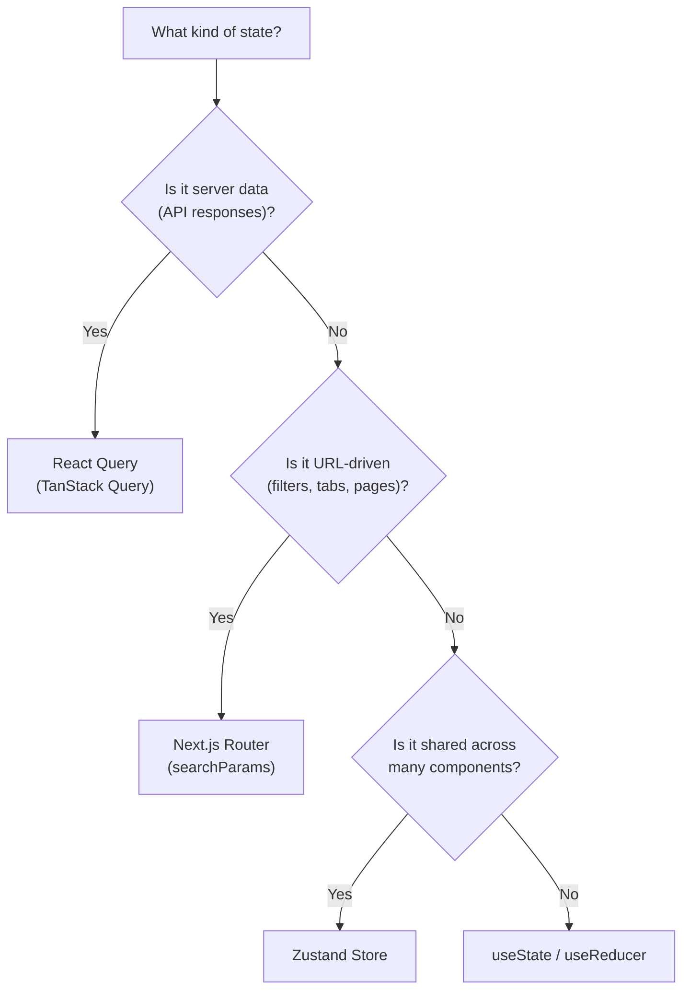
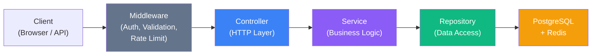
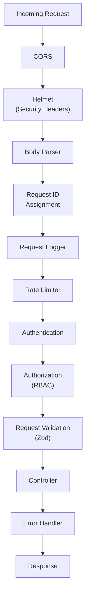

# Coding Standards & Conventions

## ITBengal Hosting Platform

| Field       | Value                              |
| ----------- | ---------------------------------- |
| **Version** | 1.0.0                             |
| **Date**    | 2026-07-04                         |
| **Status**  | Approved                           |
| **Owner**   | ITBengal Engineering Team          |
| **Stack**   | Next.js · Express · TypeScript · PostgreSQL · Docker |

---

## Table of Contents

- [1. General Principles](#1-general-principles)
- [2. TypeScript / JavaScript Standards](#2-typescript--javascript-standards)
  - [2.1 TypeScript Configuration](#21-typescript-configuration)
  - [2.2 ESLint Configuration](#22-eslint-configuration)
  - [2.3 Prettier Configuration](#23-prettier-configuration)
  - [2.4 Naming Conventions](#24-naming-conventions)
  - [2.5 Import Organization](#25-import-organization)
  - [2.6 Error Handling](#26-error-handling)
  - [2.7 No `any` Type Policy](#27-no-any-type-policy)
- [3. React / Next.js Standards](#3-react--nextjs-standards)
  - [3.1 Functional Components Only](#31-functional-components-only)
  - [3.2 Custom Hooks](#32-custom-hooks)
  - [3.3 Component Structure](#33-component-structure)
  - [3.4 State Management](#34-state-management)
  - [3.5 Performance Optimization](#35-performance-optimization)
- [4. Express.js / Backend Standards](#4-expressjs--backend-standards)
  - [4.1 Controller → Service → Repository Pattern](#41-controller--service--repository-pattern)
  - [4.2 Middleware Standards](#42-middleware-standards)
  - [4.3 Zod Validation](#43-zod-validation)
  - [4.4 API Response Formatting](#44-api-response-formatting)
  - [4.5 Logging Standards](#45-logging-standards)
- [5. Database Standards](#5-database-standards)
  - [5.1 Migration Naming](#51-migration-naming)
  - [5.2 Query Builder](#52-query-builder)
  - [5.3 Transactions](#53-transactions)
- [6. Git Standards](#6-git-standards)
  - [6.1 Conventional Commits](#61-conventional-commits)
  - [6.2 Branch Naming](#62-branch-naming)
  - [6.3 PR Guidelines](#63-pr-guidelines)
  - [6.4 Squash Merge Policy](#64-squash-merge-policy)
- [7. Documentation Standards](#7-documentation-standards)
  - [7.1 JSDoc Standards](#71-jsdoc-standards)
  - [7.2 README Per Package](#72-readme-per-package)
- [8. Environment Variables](#8-environment-variables)
- [9. Code Quality Tools Summary](#9-code-quality-tools-summary)

---

## 1. General Principles

These principles form the philosophical foundation of all code written for ITBengal. Every engineer on the team must internalize and apply them consistently.

### Code Readability Over Cleverness

Code is read far more often than it is written. Always prefer clear, explicit code over clever one-liners or obscure patterns.

```typescript
// ❌ Clever but unreadable
const s = d.reduce((a, c) => (c.s === 'active' ? a + c.r : a), 0);

// ✅ Readable and self-documenting
const totalActiveRevenue = deployments
  .filter((deployment) => deployment.status === 'active')
  .reduce((sum, deployment) => sum + deployment.revenue, 0);
```

### Consistency Across the Codebase

Every file should look like it was written by the same person. Consistent naming, formatting, and patterns reduce cognitive load and speed up onboarding.

### Self-Documenting Code with Strategic Comments

Write code that explains *what* it does through naming. Use comments only to explain *why* a particular approach was chosen — especially when it's non-obvious.

```typescript
// ❌ Redundant comment
// Increment the counter by 1
counter += 1;

// ✅ Strategic comment explaining WHY
// Openprovider API requires a 3-second cooldown between domain transfer requests
// to prevent rate limiting. See: https://docs.openprovider.com/rate-limits
await sleep(3000);
```

### DRY, SOLID, KISS

| Principle | Meaning | Application at ITBengal |
| --------- | ------- | ----------------------- |
| **DRY** | Don't Repeat Yourself | Extract shared logic into utilities and services. Never copy-paste business logic. |
| **SRP** | Single Responsibility | Each module, class, and function should do exactly one thing. A deployment service should not handle billing. |
| **OCP** | Open/Closed | Extend behavior through composition, plugins, and strategy patterns — not by modifying existing code. |
| **LSP** | Liskov Substitution | Subtypes must be substitutable for their base types without altering correctness. |
| **ISP** | Interface Segregation | Keep interfaces small and focused. Prefer many small interfaces over one large one. |
| **DIP** | Dependency Inversion | Depend on abstractions (interfaces), not on concrete implementations. Inject dependencies. |
| **KISS** | Keep It Simple, Stupid | Choose the simplest solution that meets the requirements. Premature abstraction is as harmful as duplication. |

### Security-First Development

Security is not a feature — it is a baseline requirement. Every developer must:

- **Never** trust user input. Validate and sanitize everything.
- **Never** commit secrets, API keys, or credentials.
- **Always** use parameterized queries — never interpolate user input into SQL.
- **Always** implement proper authentication and authorization checks.
- **Always** apply rate limiting to public endpoints.
- **Always** encrypt sensitive data at rest and in transit.
- **Always** follow the principle of least privilege for service accounts and RBAC.

---

## 2. TypeScript / JavaScript Standards

### 2.1 TypeScript Configuration

All projects must use TypeScript with strict mode enabled. The following `tsconfig.json` serves as the base configuration:

```json
{
  "compilerOptions": {
    // Strictness
    "strict": true,
    "noImplicitAny": true,
    "strictNullChecks": true,
    "strictFunctionTypes": true,
    "strictBindCallApply": true,
    "strictPropertyInitialization": true,
    "noImplicitThis": true,
    "alwaysStrict": true,
    "exactOptionalPropertyTypes": true,

    // Code quality
    "noUnusedLocals": true,
    "noUnusedParameters": true,
    "noImplicitReturns": true,
    "noFallthroughCasesInSwitch": true,
    "noUncheckedIndexedAccess": true,
    "forceConsistentCasingInFileNames": true,

    // Module resolution
    "module": "esnext",
    "moduleResolution": "bundler",
    "resolveJsonModule": true,
    "isolatedModules": true,
    "esModuleInterop": true,

    // Output
    "target": "es2022",
    "lib": ["dom", "dom.iterable", "esnext"],
    "jsx": "react-jsx",
    "declaration": true,
    "declarationMap": true,
    "sourceMap": true,
    "outDir": "./dist",

    // Path aliases
    "baseUrl": ".",
    "paths": {
      "@/*": ["./src/*"],
      "@/components/*": ["./src/components/*"],
      "@/lib/*": ["./src/lib/*"],
      "@/services/*": ["./src/services/*"],
      "@/hooks/*": ["./src/hooks/*"],
      "@/types/*": ["./src/types/*"],
      "@/utils/*": ["./src/utils/*"],
      "@/config/*": ["./src/config/*"],
      "@/middleware/*": ["./src/middleware/*"],
      "@/repositories/*": ["./src/repositories/*"],
      "@/schemas/*": ["./src/schemas/*"]
    },

    "skipLibCheck": true
  },
  "include": ["src/**/*.ts", "src/**/*.tsx"],
  "exclude": ["node_modules", "dist", "coverage", "**/*.test.ts"]
}
```

### 2.2 ESLint Configuration

Every project must use the following ESLint configuration. This file is enforced in CI — no code with ESLint errors may be merged.

```javascript
// .eslintrc.js
module.exports = {
  root: true,
  parser: '@typescript-eslint/parser',
  parserOptions: {
    project: './tsconfig.json',
    ecmaVersion: 2022,
    sourceType: 'module',
    ecmaFeatures: { jsx: true },
  },
  plugins: [
    '@typescript-eslint',
    'import',
    'react',
    'react-hooks',
    'security',
    'prettier',
  ],
  extends: [
    'eslint:recommended',
    'plugin:@typescript-eslint/strict',
    'plugin:@typescript-eslint/stylistic',
    'plugin:react/recommended',
    'plugin:react/jsx-runtime',
    'plugin:react-hooks/recommended',
    'plugin:import/recommended',
    'plugin:import/typescript',
    'plugin:security/recommended-legacy',
    'prettier',
  ],
  settings: {
    react: { version: 'detect' },
    'import/resolver': {
      typescript: { project: './tsconfig.json' },
    },
  },
  rules: {
    // TypeScript strict rules
    '@typescript-eslint/no-explicit-any': 'error',
    '@typescript-eslint/no-unused-vars': [
      'error',
      { argsIgnorePattern: '^_', varsIgnorePattern: '^_' },
    ],
    '@typescript-eslint/explicit-function-return-type': [
      'warn',
      { allowExpressions: true, allowTypedFunctionExpressions: true },
    ],
    '@typescript-eslint/no-non-null-assertion': 'error',
    '@typescript-eslint/no-floating-promises': 'error',
    '@typescript-eslint/await-thenable': 'error',
    '@typescript-eslint/consistent-type-imports': [
      'error',
      { prefer: 'type-imports', fixStyle: 'inline-type-imports' },
    ],
    '@typescript-eslint/consistent-type-definitions': ['error', 'interface'],
    '@typescript-eslint/no-misused-promises': 'error',

    // General rules
    'no-console': ['warn', { allow: ['warn', 'error'] }],
    'consistent-return': 'error',
    'no-param-reassign': ['error', { props: false }],
    eqeqeq: ['error', 'always'],
    curly: ['error', 'all'],

    // Import rules
    'import/order': [
      'error',
      {
        groups: [
          'builtin',
          'external',
          'internal',
          'parent',
          'sibling',
          'index',
          'type',
        ],
        'newlines-between': 'always',
        alphabetize: { order: 'asc', caseInsensitive: true },
      },
    ],
    'import/no-duplicates': 'error',
    'import/no-cycle': 'error',
    'import/no-unresolved': 'error',

    // React hooks
    'react-hooks/rules-of-hooks': 'error',
    'react-hooks/exhaustive-deps': 'warn',

    // Security
    'security/detect-object-injection': 'warn',
    'security/detect-non-literal-regexp': 'warn',
    'security/detect-possible-timing-attacks': 'warn',
  },
  overrides: [
    {
      files: ['**/*.test.ts', '**/*.test.tsx', '**/*.spec.ts'],
      rules: {
        '@typescript-eslint/no-explicit-any': 'off',
        'security/detect-object-injection': 'off',
      },
    },
  ],
};
```

### 2.3 Prettier Configuration

All code formatting is handled exclusively by Prettier. Do not fight Prettier — configure it once and forget it.

```json
{
  "printWidth": 100,
  "tabWidth": 2,
  "useTabs": false,
  "semi": true,
  "singleQuote": true,
  "quoteProps": "as-needed",
  "jsxSingleQuote": false,
  "trailingComma": "all",
  "bracketSpacing": true,
  "bracketSameLine": false,
  "arrowParens": "always",
  "endOfLine": "lf",
  "plugins": ["prettier-plugin-tailwindcss"]
}
```

### 2.4 Naming Conventions

Consistent naming is non-negotiable. Follow this table precisely:

| Type | Convention | Example | Notes |
| ---- | ---------- | ------- | ----- |
| Variables | `camelCase` | `deploymentStatus` | Descriptive, no abbreviations |
| Constants | `UPPER_SNAKE_CASE` | `MAX_RETRY_COUNT` | Module-level immutable values |
| Functions | `camelCase` | `createDeployment()` | Verb-first: `get`, `set`, `create`, `update`, `delete`, `is`, `has` |
| Classes | `PascalCase` | `DeploymentService` | Noun or noun-phrase |
| Interfaces | `PascalCase` | `DeploymentConfig` | **No `I` prefix.** `DeploymentConfig`, not `IDeploymentConfig` |
| Type aliases | `PascalCase` | `ServerStatus` | Describe the shape or union |
| Enums | `PascalCase` | `DeploymentStatus.Building` | Both the enum and its members are PascalCase |
| Generic types | Single uppercase letter | `T`, `K`, `V` | Or descriptive: `TData`, `TError` |
| Files (components) | `PascalCase` | `ProjectCard.tsx` | One component per file |
| Files (utilities) | `camelCase` | `formatDate.ts` | Pure functions and helpers |
| Files (tests) | Same + `.test.ts` | `deploymentService.test.ts` | Co-located or in `__tests__/` |
| Files (hooks) | `camelCase` with `use` | `useDeployment.ts` | Must start with `use` |
| Directories | `kebab-case` | `deployment-logs/` | Lowercase, hyphenated |
| Database columns | `snake_case` | `created_at` | PostgreSQL convention |
| Database tables | `snake_case` (plural) | `deployment_logs` | Plural nouns |
| API routes | `kebab-case` | `/api/v1/deployment-logs` | RESTful, versioned |
| Environment variables | `UPPER_SNAKE_CASE` | `DATABASE_URL` | Prefixed by service category |
| CSS classes | `kebab-case` | `deployment-card` | BEM optional: `deployment-card__header` |

### 2.5 Import Organization

Imports must be organized in a strict order with blank lines separating each group. ESLint's `import/order` rule enforces this automatically.

```typescript
// 1. Node.js built-in modules
import { readFile } from 'node:fs/promises';
import path from 'node:path';

// 2. External packages
import express, { type Router } from 'express';
import { z } from 'zod';

// 3. Internal packages (path aliases)
import { db } from '@/lib/database';
import { DeploymentService } from '@/services/deploymentService';
import { logger } from '@/lib/logger';

// 4. Relative imports
import { validateRequest } from '../middleware/validate';
import { deploymentRoutes } from './routes';

// 5. Type-only imports
import { type DeploymentConfig } from '@/types/deployment';
import { type RequestContext } from '@/types/context';

// 6. Style imports (frontend only)
import styles from './DeploymentCard.module.css';
```

**Rules:**

- Always use `type` keyword for type-only imports: `import { type Foo }` or `import type { Foo }`.
- Always use path aliases (`@/...`) for internal imports — never use deep relative paths like `../../../lib/database`.
- Never mix default and named imports from the same module across multiple import statements.

### 2.6 Error Handling

#### Custom Error Hierarchy

All application errors must extend a base `AppError` class. This provides consistent error typing, HTTP status codes, and error categorization.

```typescript
// src/lib/errors.ts

export class AppError extends Error {
  public readonly statusCode: number;
  public readonly code: string;
  public readonly isOperational: boolean;
  public readonly details?: Record<string, unknown>;

  constructor(params: {
    message: string;
    statusCode: number;
    code: string;
    isOperational?: boolean;
    details?: Record<string, unknown>;
  }) {
    super(params.message);
    this.name = this.constructor.name;
    this.statusCode = params.statusCode;
    this.code = params.code;
    this.isOperational = params.isOperational ?? true;
    this.details = params.details;
    Error.captureStackTrace(this, this.constructor);
  }
}

export class ValidationError extends AppError {
  constructor(message: string, details?: Record<string, unknown>) {
    super({
      message,
      statusCode: 400,
      code: 'VALIDATION_ERROR',
      details,
    });
  }
}

export class AuthenticationError extends AppError {
  constructor(message = 'Authentication required') {
    super({
      message,
      statusCode: 401,
      code: 'AUTHENTICATION_ERROR',
    });
  }
}

export class AuthorizationError extends AppError {
  constructor(message = 'Insufficient permissions') {
    super({
      message,
      statusCode: 403,
      code: 'AUTHORIZATION_ERROR',
    });
  }
}

export class NotFoundError extends AppError {
  constructor(resource: string, identifier?: string) {
    const message = identifier
      ? `${resource} with identifier '${identifier}' not found`
      : `${resource} not found`;
    super({
      message,
      statusCode: 404,
      code: 'NOT_FOUND',
    });
  }
}

export class ConflictError extends AppError {
  constructor(message: string) {
    super({
      message,
      statusCode: 409,
      code: 'CONFLICT',
    });
  }
}

export class RateLimitError extends AppError {
  constructor(retryAfter?: number) {
    super({
      message: 'Rate limit exceeded. Please try again later.',
      statusCode: 429,
      code: 'RATE_LIMIT_EXCEEDED',
      details: retryAfter ? { retryAfter } : undefined,
    });
  }
}

export class ExternalServiceError extends AppError {
  constructor(service: string, originalError?: Error) {
    super({
      message: `External service '${service}' is unavailable`,
      statusCode: 502,
      code: 'EXTERNAL_SERVICE_ERROR',
      isOperational: true,
      details: originalError ? { originalMessage: originalError.message } : undefined,
    });
  }
}
```

#### Async/Await Error Handling Patterns

```typescript
// ❌ NEVER: empty catch block
try {
  await deploymentService.deploy(projectId);
} catch (error) {
  // swallowed — no one will ever know this failed
}

// ❌ NEVER: untyped error
try {
  await deploymentService.deploy(projectId);
} catch (error) {
  console.log(error.message); // 'error' is 'unknown' in strict mode
}

// ✅ ALWAYS: properly typed error handling
try {
  await deploymentService.deploy(projectId);
} catch (error: unknown) {
  if (error instanceof AppError) {
    logger.warn('Deployment failed', {
      code: error.code,
      message: error.message,
      projectId,
    });
    throw error; // re-throw operational errors
  }

  // Unexpected error — wrap it
  logger.error('Unexpected deployment error', {
    error: error instanceof Error ? error.message : String(error),
    projectId,
  });
  throw new AppError({
    message: 'An unexpected error occurred during deployment',
    statusCode: 500,
    code: 'INTERNAL_ERROR',
    isOperational: false,
  });
}
```

#### Global Error Handler Middleware

```typescript
// src/middleware/errorHandler.ts
import { type ErrorRequestHandler } from 'express';

import { AppError } from '@/lib/errors';
import { logger } from '@/lib/logger';

export const errorHandler: ErrorRequestHandler = (err, req, res, _next) => {
  // Structured log entry
  const logContext = {
    requestId: req.id,
    method: req.method,
    path: req.path,
    ip: req.ip,
    userId: req.user?.id,
  };

  if (err instanceof AppError) {
    // Operational error — expected, safe to expose
    if (err.statusCode >= 500) {
      logger.error(err.message, { ...logContext, code: err.code, stack: err.stack });
    } else {
      logger.warn(err.message, { ...logContext, code: err.code });
    }

    res.status(err.statusCode).json({
      success: false,
      error: {
        code: err.code,
        message: err.message,
        ...(err.details && { details: err.details }),
      },
    });
    return;
  }

  // Unknown / programmer error — never expose details
  logger.error('Unhandled error', {
    ...logContext,
    error: err instanceof Error ? err.message : String(err),
    stack: err instanceof Error ? err.stack : undefined,
  });

  res.status(500).json({
    success: false,
    error: {
      code: 'INTERNAL_ERROR',
      message: 'An unexpected error occurred. Please try again later.',
    },
  });
};
```

### 2.7 No `any` Type Policy

**`any` is forbidden across the entire codebase.** It disables TypeScript's type system and introduces silent bugs. The ESLint rule `@typescript-eslint/no-explicit-any` is set to `error`.

#### Alternatives to `any`

| Instead of `any` | Use | When |
| ----------------- | --- | ---- |
| `unknown` | For values whose type you don't know | Parsing external data, catch blocks |
| Generics `<T>` | For functions that work with multiple types | Utility functions, data transformers |
| Type guards | To narrow `unknown` to a specific type | Runtime type checking |
| Union types | For values that can be one of several types | Config options, API responses |
| `Record<string, unknown>` | For dynamic key-value objects | JSON parsing, metadata |

#### Code Examples

```typescript
// ❌ WRONG: using `any`
function parseConfig(data: any): any {
  return data.settings;
}

// ✅ RIGHT: using generics and proper types
function parseConfig<T extends Record<string, unknown>>(data: T): T {
  return data;
}

// ❌ WRONG: any in event handlers
function handleEvent(event: any) {
  console.log(event.target.value);
}

// ✅ RIGHT: proper DOM typing
function handleEvent(event: React.ChangeEvent<HTMLInputElement>) {
  console.log(event.target.value);
}

// ❌ WRONG: any for API responses
async function fetchDeployments(): Promise<any[]> {
  const response = await fetch('/api/v1/deployments');
  return response.json();
}

// ✅ RIGHT: typed API responses
interface Deployment {
  id: string;
  projectId: string;
  status: DeploymentStatus;
  createdAt: string;
  completedAt: string | null;
}

async function fetchDeployments(): Promise<Deployment[]> {
  const response = await fetch('/api/v1/deployments');
  const data: unknown = await response.json();
  return deploymentArraySchema.parse(data); // Zod validation
}

// ✅ RIGHT: type guard for unknown values
function isDeployment(value: unknown): value is Deployment {
  return (
    typeof value === 'object' &&
    value !== null &&
    'id' in value &&
    'status' in value &&
    typeof (value as Record<string, unknown>).id === 'string'
  );
}
```

---

## 3. React / Next.js Standards

### 3.1 Functional Components Only

Class components are not permitted. All React components must be functional components with properly typed props using TypeScript interfaces.

```typescript
// src/components/features/DeploymentCard.tsx
import { formatDistanceToNow } from 'date-fns';

import { Badge } from '@/components/ui/Badge';
import { Card } from '@/components/ui/Card';

import { type DeploymentStatus } from '@/types/deployment';

interface DeploymentCardProps {
  /** Unique deployment identifier */
  id: string;
  /** Name of the project being deployed */
  projectName: string;
  /** Current deployment status */
  status: DeploymentStatus;
  /** ISO 8601 timestamp of deployment creation */
  createdAt: string;
  /** Git commit SHA (first 7 characters) */
  commitSha: string;
  /** Callback when the user clicks "View Logs" */
  onViewLogs: (deploymentId: string) => void;
  /** Optional: deployment duration in seconds */
  duration?: number;
}

export function DeploymentCard({
  id,
  projectName,
  status,
  createdAt,
  commitSha,
  onViewLogs,
  duration,
}: DeploymentCardProps) {
  const statusColorMap: Record<DeploymentStatus, string> = {
    queued: 'gray',
    building: 'blue',
    deploying: 'yellow',
    ready: 'green',
    failed: 'red',
    cancelled: 'orange',
  };

  return (
    <Card className="deployment-card">
      <div className="deployment-card__header">
        <h3>{projectName}</h3>
        <Badge color={statusColorMap[status]}>{status}</Badge>
      </div>
      <div className="deployment-card__meta">
        <span>Commit: {commitSha}</span>
        <span>{formatDistanceToNow(new Date(createdAt), { addSuffix: true })}</span>
        {duration !== undefined && <span>Duration: {duration}s</span>}
      </div>
      <button
        className="deployment-card__logs-btn"
        onClick={() => onViewLogs(id)}
        type="button"
      >
        View Logs
      </button>
    </Card>
  );
}
```

**Rules:**
- One component per file.
- The file name must match the component name: `DeploymentCard.tsx` exports `DeploymentCard`.
- Always define a named `interface` for props — never use inline object types.
- Use `export function` (named export), not `export default`.

### 3.2 Custom Hooks

Custom hooks encapsulate reusable stateful logic. They must start with the `use` prefix.

```typescript
// src/hooks/useDeployment.ts
import { useMutation, useQuery, useQueryClient } from '@tanstack/react-query';

import { apiClient } from '@/lib/apiClient';

import { type Deployment, type CreateDeploymentInput } from '@/types/deployment';

/**
 * Hook to fetch a single deployment by ID.
 */
export function useDeployment(deploymentId: string) {
  return useQuery({
    queryKey: ['deployments', deploymentId],
    queryFn: () => apiClient.get<Deployment>(`/api/v1/deployments/${deploymentId}`),
    enabled: Boolean(deploymentId),
    staleTime: 10_000, // 10 seconds — deployments update frequently
  });
}

/**
 * Hook to fetch paginated deployments for a project.
 */
export function useProjectDeployments(projectId: string, page = 1, limit = 20) {
  return useQuery({
    queryKey: ['projects', projectId, 'deployments', { page, limit }],
    queryFn: () =>
      apiClient.get<PaginatedResponse<Deployment>>(
        `/api/v1/projects/${projectId}/deployments`,
        { params: { page, limit } },
      ),
    keepPreviousData: true,
  });
}

/**
 * Hook to trigger a new deployment.
 */
export function useCreateDeployment(projectId: string) {
  const queryClient = useQueryClient();

  return useMutation({
    mutationFn: (input: CreateDeploymentInput) =>
      apiClient.post<Deployment>(`/api/v1/projects/${projectId}/deployments`, input),
    onSuccess: () => {
      // Invalidate deployment list cache
      void queryClient.invalidateQueries({
        queryKey: ['projects', projectId, 'deployments'],
      });
    },
  });
}
```

**Rules:**
- Always clean up side effects (event listeners, subscriptions, timers) in the hook's cleanup function.
- Provide complete and correct dependency arrays — never suppress `exhaustive-deps` warnings without a documented reason.
- Do not perform data fetching in `useEffect` — use React Query instead.

### 3.3 Component Structure

#### File Template

Every component file should follow this internal structure:

```typescript
// ────────────────────────────────────────────
// 1. Imports (following import order rules)
// ────────────────────────────────────────────
import { useState } from 'react';

import { Button } from '@/components/ui/Button';

import { type ProjectStatus } from '@/types/project';

// ────────────────────────────────────────────
// 2. Types & Interfaces
// ────────────────────────────────────────────
interface ProjectCardProps {
  name: string;
  status: ProjectStatus;
  onSelect: (id: string) => void;
}

// ────────────────────────────────────────────
// 3. Constants (component-scoped)
// ────────────────────────────────────────────
const STATUS_LABELS: Record<ProjectStatus, string> = {
  active: 'Active',
  suspended: 'Suspended',
  deploying: 'Deploying',
};

// ────────────────────────────────────────────
// 4. Component
// ────────────────────────────────────────────
export function ProjectCard({ name, status, onSelect }: ProjectCardProps) {
  const [isHovered, setIsHovered] = useState(false);

  return (
    <div
      className="project-card"
      onMouseEnter={() => setIsHovered(true)}
      onMouseLeave={() => setIsHovered(false)}
    >
      <h3>{name}</h3>
      <span>{STATUS_LABELS[status]}</span>
    </div>
  );
}
```

#### Project Directory Organization

```
src/
├── components/
│   ├── ui/                        # Reusable primitives
│   │   ├── Button.tsx
│   │   ├── Input.tsx
│   │   ├── Modal.tsx
│   │   ├── Badge.tsx
│   │   ├── Card.tsx
│   │   ├── Dropdown.tsx
│   │   ├── Spinner.tsx
│   │   ├── Table.tsx
│   │   └── Toast.tsx
│   ├── features/                  # Feature-specific components
│   │   ├── deployments/
│   │   │   ├── DeploymentCard.tsx
│   │   │   ├── DeploymentList.tsx
│   │   │   └── DeploymentLogs.tsx
│   │   ├── projects/
│   │   │   ├── ProjectCard.tsx
│   │   │   ├── ProjectSettings.tsx
│   │   │   └── ProjectDomains.tsx
│   │   ├── billing/
│   │   │   ├── PlanSelector.tsx
│   │   │   ├── PaymentMethodForm.tsx
│   │   │   └── InvoiceTable.tsx
│   │   └── domains/
│   │       ├── DomainSearch.tsx
│   │       ├── DnsManager.tsx
│   │       └── DomainTransfer.tsx
│   └── layouts/                   # Layout components
│       ├── DashboardLayout.tsx
│       ├── AuthLayout.tsx
│       ├── MarketingLayout.tsx
│       └── Sidebar.tsx
├── hooks/                         # Custom hooks
├── lib/                           # Utilities and configurations
├── services/                      # API service layer
├── types/                         # Shared TypeScript types
└── app/                           # Next.js App Router pages
```

### 3.4 State Management

Use the right tool for each type of state:



#### Local State: `useState`

```typescript
// Simple local state — component-level only
const [isModalOpen, setIsModalOpen] = useState(false);
const [selectedTab, setSelectedTab] = useState<'overview' | 'logs' | 'settings'>('overview');
```

#### Server State: React Query (TanStack Query)

```typescript
// Fetching and caching server data
import { useQuery, useMutation, useQueryClient } from '@tanstack/react-query';

export function ProjectDashboard({ projectId }: { projectId: string }) {
  const { data: project, isLoading, error } = useQuery({
    queryKey: ['projects', projectId],
    queryFn: () => apiClient.get<Project>(`/api/v1/projects/${projectId}`),
    staleTime: 30_000,
  });

  if (isLoading) return <ProjectSkeleton />;
  if (error) return <ErrorState error={error} />;

  return <ProjectDetails project={project} />;
}
```

#### Global UI State: Zustand

```typescript
// src/stores/uiStore.ts
import { create } from 'zustand';

interface UIState {
  sidebarOpen: boolean;
  theme: 'light' | 'dark' | 'system';
  toggleSidebar: () => void;
  setTheme: (theme: UIState['theme']) => void;
}

export const useUIStore = create<UIState>((set) => ({
  sidebarOpen: true,
  theme: 'system',
  toggleSidebar: () => set((state) => ({ sidebarOpen: !state.sidebarOpen })),
  setTheme: (theme) => set({ theme }),
}));
```

#### URL State: Next.js Router

```typescript
// URL-driven state for filters, pagination, search
'use client';

import { useSearchParams, useRouter, usePathname } from 'next/navigation';

export function DeploymentFilters() {
  const searchParams = useSearchParams();
  const router = useRouter();
  const pathname = usePathname();

  const currentStatus = searchParams.get('status') ?? 'all';
  const currentPage = Number(searchParams.get('page') ?? '1');

  function updateFilter(key: string, value: string) {
    const params = new URLSearchParams(searchParams.toString());
    params.set(key, value);
    params.set('page', '1'); // Reset page on filter change
    router.push(`${pathname}?${params.toString()}`);
  }

  return (
    <select
      value={currentStatus}
      onChange={(e) => updateFilter('status', e.target.value)}
    >
      <option value="all">All</option>
      <option value="ready">Ready</option>
      <option value="failed">Failed</option>
      <option value="building">Building</option>
    </select>
  );
}
```

### 3.5 Performance Optimization

#### `React.memo` — Use Sparingly

Only use `React.memo` when you have **measured** a performance problem. Do not wrap every component.

```typescript
// ✅ Good use: expensive list item rendered hundreds of times
import { memo } from 'react';

interface LogLineProps {
  timestamp: string;
  level: string;
  message: string;
}

export const LogLine = memo(function LogLine({ timestamp, level, message }: LogLineProps) {
  return (
    <div className={`log-line log-line--${level}`}>
      <span className="log-line__time">{timestamp}</span>
      <span className="log-line__level">{level}</span>
      <span className="log-line__message">{message}</span>
    </div>
  );
});
```

#### `useMemo` / `useCallback` Guidelines

| Use `useMemo` / `useCallback` when | Do **NOT** use when |
| ----------------------------------- | ------------------- |
| Expensive computations (sorting, filtering large arrays) | Simple value derivations (`const name = first + last`) |
| Preventing re-renders of memoized children | Premature optimization without measurements |
| Stable references for dependency arrays | Wrapping every single function |
| Complex objects passed as props to memoized components | Primitive values |

```typescript
// ✅ Appropriate: filtering a large deployment list
const filteredDeployments = useMemo(
  () =>
    deployments.filter(
      (d) => d.status === selectedStatus && d.projectId === projectId,
    ),
  [deployments, selectedStatus, projectId],
);

// ✅ Appropriate: stable callback for memoized child
const handleDeploymentSelect = useCallback(
  (deploymentId: string) => {
    router.push(`/dashboard/deployments/${deploymentId}`);
  },
  [router],
);
```

#### Dynamic Imports (Code Splitting)

```typescript
import dynamic from 'next/dynamic';

// Lazy-load heavy components
const DeploymentLogs = dynamic(() => import('@/components/features/deployments/DeploymentLogs'), {
  loading: () => <LogsSkeleton />,
  ssr: false, // Logs viewer doesn't need SSR
});

const MonacoEditor = dynamic(() => import('@/components/features/editor/MonacoEditor'), {
  loading: () => <EditorSkeleton />,
  ssr: false,
});
```

#### Image Optimization

```typescript
import Image from 'next/image';

// Always use next/image for optimized delivery
<Image
  src="/images/hosting-hero.webp"
  alt="ITBengal hosting dashboard"
  width={1200}
  height={630}
  priority // Above-the-fold images
  placeholder="blur"
  blurDataURL={shimmer(1200, 630)}
/>
```

---

## 4. Express.js / Backend Standards

### 4.1 Controller → Service → Repository Pattern

All backend code must follow a strict three-layer architecture. This separation ensures testability, maintainability, and clear responsibility boundaries.



#### Controller Layer

Controllers handle HTTP concerns only: extracting data from the request, calling the appropriate service, and formatting the response.

```typescript
// src/controllers/deploymentController.ts
import { type Request, type Response, type NextFunction } from 'express';

import { DeploymentService } from '@/services/deploymentService';
import { successResponse, paginatedResponse } from '@/lib/response';

import { type AuthenticatedRequest } from '@/types/auth';

export class DeploymentController {
  constructor(private readonly deploymentService: DeploymentService) {}

  createDeployment = async (req: AuthenticatedRequest, res: Response, next: NextFunction) => {
    try {
      const deployment = await this.deploymentService.create({
        projectId: req.params.projectId,
        userId: req.user.id,
        branch: req.body.branch,
        commitSha: req.body.commitSha,
      });

      return successResponse(res, deployment, 201);
    } catch (error) {
      next(error);
    }
  };

  listDeployments = async (req: AuthenticatedRequest, res: Response, next: NextFunction) => {
    try {
      const { page, limit, status } = req.query;

      const result = await this.deploymentService.listByProject({
        projectId: req.params.projectId,
        userId: req.user.id,
        page: Number(page) || 1,
        limit: Number(limit) || 20,
        status: status as string | undefined,
      });

      return paginatedResponse(res, result);
    } catch (error) {
      next(error);
    }
  };

  getDeploymentLogs = async (req: AuthenticatedRequest, res: Response, next: NextFunction) => {
    try {
      const logs = await this.deploymentService.getLogs({
        deploymentId: req.params.deploymentId,
        userId: req.user.id,
      });

      return successResponse(res, logs);
    } catch (error) {
      next(error);
    }
  };
}
```

#### Service Layer

Services contain all business logic. They orchestrate operations, enforce business rules, and coordinate between repositories and external services.

```typescript
// src/services/deploymentService.ts
import { DeploymentRepository } from '@/repositories/deploymentRepository';
import { ProjectRepository } from '@/repositories/projectRepository';
import { BuildQueue } from '@/queues/buildQueue';
import { NotFoundError, AuthorizationError, ValidationError } from '@/lib/errors';
import { logger } from '@/lib/logger';

import { type CreateDeploymentInput, type Deployment } from '@/types/deployment';

export class DeploymentService {
  constructor(
    private readonly deploymentRepo: DeploymentRepository,
    private readonly projectRepo: ProjectRepository,
    private readonly buildQueue: BuildQueue,
  ) {}

  async create(input: CreateDeploymentInput): Promise<Deployment> {
    // 1. Verify project exists and user has access
    const project = await this.projectRepo.findById(input.projectId);
    if (!project) {
      throw new NotFoundError('Project', input.projectId);
    }
    if (project.ownerId !== input.userId) {
      throw new AuthorizationError('You do not have access to this project');
    }

    // 2. Check for active deployments (business rule: max 1 concurrent)
    const activeDeployment = await this.deploymentRepo.findActiveByProject(input.projectId);
    if (activeDeployment) {
      throw new ValidationError('A deployment is already in progress for this project');
    }

    // 3. Create deployment record
    const deployment = await this.deploymentRepo.create({
      projectId: input.projectId,
      branch: input.branch,
      commitSha: input.commitSha,
      status: 'queued',
      triggeredBy: input.userId,
    });

    // 4. Enqueue build job
    await this.buildQueue.add('build', {
      deploymentId: deployment.id,
      projectId: input.projectId,
      branch: input.branch,
      commitSha: input.commitSha,
    });

    logger.info('Deployment created', {
      deploymentId: deployment.id,
      projectId: input.projectId,
    });

    return deployment;
  }
}
```

#### Repository Layer

Repositories handle all database operations. They use Knex.js for query building and expose clean, typed methods.

```typescript
// src/repositories/deploymentRepository.ts
import { type Knex } from 'knex';

import { type Deployment, type CreateDeploymentData } from '@/types/deployment';

export class DeploymentRepository {
  constructor(private readonly db: Knex) {}

  async findById(id: string): Promise<Deployment | null> {
    const row = await this.db('deployments').where({ id }).first();
    return row ?? null;
  }

  async findActiveByProject(projectId: string): Promise<Deployment | null> {
    const row = await this.db('deployments')
      .where({ project_id: projectId })
      .whereIn('status', ['queued', 'building', 'deploying'])
      .first();
    return row ? this.toDomain(row) : null;
  }

  async create(data: CreateDeploymentData): Promise<Deployment> {
    const [row] = await this.db('deployments')
      .insert({
        project_id: data.projectId,
        branch: data.branch,
        commit_sha: data.commitSha,
        status: data.status,
        triggered_by: data.triggeredBy,
      })
      .returning('*');
    return this.toDomain(row);
  }

  /**
   * Maps a database row (snake_case) to a domain object (camelCase).
   */
  private toDomain(row: Record<string, unknown>): Deployment {
    return {
      id: row.id as string,
      projectId: row.project_id as string,
      branch: row.branch as string,
      commitSha: row.commit_sha as string,
      status: row.status as Deployment['status'],
      triggeredBy: row.triggered_by as string,
      createdAt: row.created_at as string,
      updatedAt: row.updated_at as string,
    };
  }
}
```

#### Dependency Injection

Wire dependencies together at the composition root — never instantiate dependencies inside classes.

```typescript
// src/container.ts
import knex from 'knex';

import { DeploymentRepository } from '@/repositories/deploymentRepository';
import { ProjectRepository } from '@/repositories/projectRepository';
import { DeploymentService } from '@/services/deploymentService';
import { DeploymentController } from '@/controllers/deploymentController';
import { BuildQueue } from '@/queues/buildQueue';
import { dbConfig } from '@/config/database';

// Database connection
const db = knex(dbConfig);

// Repositories
const deploymentRepo = new DeploymentRepository(db);
const projectRepo = new ProjectRepository(db);

// Queues
const buildQueue = new BuildQueue();

// Services
const deploymentService = new DeploymentService(deploymentRepo, projectRepo, buildQueue);

// Controllers
export const deploymentController = new DeploymentController(deploymentService);
```

### 4.2 Middleware Standards

Middleware must be applied in a specific order. Each middleware has a single responsibility.



#### Authentication Middleware

```typescript
// src/middleware/authenticate.ts
import { type Response, type NextFunction } from 'express';
import jwt from 'jsonwebtoken';

import { AuthenticationError } from '@/lib/errors';
import { env } from '@/config/env';

import { type AuthenticatedRequest, type JwtPayload } from '@/types/auth';

export function authenticate(req: AuthenticatedRequest, _res: Response, next: NextFunction) {
  const authHeader = req.headers.authorization;

  if (!authHeader?.startsWith('Bearer ')) {
    return next(new AuthenticationError('Missing or invalid authorization header'));
  }

  const token = authHeader.slice(7);

  try {
    const payload = jwt.verify(token, env.JWT_SECRET) as JwtPayload;
    req.user = {
      id: payload.sub,
      email: payload.email,
      role: payload.role,
    };
    next();
  } catch {
    next(new AuthenticationError('Invalid or expired token'));
  }
}
```

#### Authorization / RBAC Middleware

```typescript
// src/middleware/authorize.ts
import { type Response, type NextFunction } from 'express';

import { AuthorizationError } from '@/lib/errors';

import { type AuthenticatedRequest, type Role } from '@/types/auth';

/**
 * Creates middleware that restricts access to users with the specified roles.
 */
export function authorize(...allowedRoles: Role[]) {
  return (req: AuthenticatedRequest, _res: Response, next: NextFunction) => {
    if (!req.user) {
      return next(new AuthorizationError('Authentication required'));
    }

    if (!allowedRoles.includes(req.user.role)) {
      return next(new AuthorizationError('Insufficient permissions for this action'));
    }

    next();
  };
}

// Usage in routes:
// router.delete('/projects/:id', authenticate, authorize('admin', 'owner'), controller.delete);
```

#### Request Validation Middleware

```typescript
// src/middleware/validate.ts
import { type Request, type Response, type NextFunction } from 'express';
import { type ZodSchema, ZodError } from 'zod';

import { ValidationError } from '@/lib/errors';

interface ValidationSchemas {
  body?: ZodSchema;
  query?: ZodSchema;
  params?: ZodSchema;
}

export function validate(schemas: ValidationSchemas) {
  return (req: Request, _res: Response, next: NextFunction) => {
    try {
      if (schemas.body) {
        req.body = schemas.body.parse(req.body);
      }
      if (schemas.query) {
        req.query = schemas.query.parse(req.query);
      }
      if (schemas.params) {
        req.params = schemas.params.parse(req.params);
      }
      next();
    } catch (error) {
      if (error instanceof ZodError) {
        const details = error.errors.map((e) => ({
          field: e.path.join('.'),
          message: e.message,
          code: e.code,
        }));
        next(new ValidationError('Request validation failed', { errors: details }));
      } else {
        next(error);
      }
    }
  };
}
```

#### Rate Limiting Middleware

```typescript
// src/middleware/rateLimit.ts
import rateLimit from 'express-rate-limit';
import RedisStore from 'rate-limit-redis';

import { redisClient } from '@/lib/redis';

/**
 * General API rate limiter: 100 requests per 15-minute window.
 */
export const apiLimiter = rateLimit({
  store: new RedisStore({
    sendCommand: (...args: string[]) => redisClient.sendCommand(args),
  }),
  windowMs: 15 * 60 * 1000,
  max: 100,
  standardHeaders: true,
  legacyHeaders: false,
  message: {
    success: false,
    error: {
      code: 'RATE_LIMIT_EXCEEDED',
      message: 'Too many requests. Please try again later.',
    },
  },
});

/**
 * Auth rate limiter: 10 attempts per 15-minute window.
 */
export const authLimiter = rateLimit({
  store: new RedisStore({
    sendCommand: (...args: string[]) => redisClient.sendCommand(args),
  }),
  windowMs: 15 * 60 * 1000,
  max: 10,
  standardHeaders: true,
  legacyHeaders: false,
  keyGenerator: (req) => req.ip ?? 'unknown',
  message: {
    success: false,
    error: {
      code: 'RATE_LIMIT_EXCEEDED',
      message: 'Too many authentication attempts. Please try again later.',
    },
  },
});
```

#### Request Logging Middleware

```typescript
// src/middleware/requestLogger.ts
import { type Request, type Response, type NextFunction } from 'express';

import { logger } from '@/lib/logger';

export function requestLogger(req: Request, res: Response, next: NextFunction) {
  const startTime = Date.now();

  res.on('finish', () => {
    const duration = Date.now() - startTime;
    const logData = {
      requestId: req.id,
      method: req.method,
      path: req.path,
      statusCode: res.statusCode,
      duration: `${duration}ms`,
      ip: req.ip,
      userAgent: req.get('user-agent'),
      contentLength: res.get('content-length'),
    };

    if (res.statusCode >= 500) {
      logger.error('Request completed with server error', logData);
    } else if (res.statusCode >= 400) {
      logger.warn('Request completed with client error', logData);
    } else {
      logger.info('Request completed', logData);
    }
  });

  next();
}
```

### 4.3 Zod Validation

All incoming request data must be validated with Zod schemas. **Never trust client input.**

#### Request Body Validation

```typescript
// src/schemas/deploymentSchemas.ts
import { z } from 'zod';

export const createDeploymentSchema = z.object({
  branch: z
    .string()
    .min(1, 'Branch name is required')
    .max(255, 'Branch name too long')
    .regex(/^[a-zA-Z0-9\-_/]+$/, 'Invalid branch name format'),
  commitSha: z
    .string()
    .length(40, 'Commit SHA must be exactly 40 characters')
    .regex(/^[a-f0-9]+$/, 'Invalid commit SHA format'),
  environment: z.enum(['production', 'staging', 'preview']).default('production'),
  force: z.boolean().default(false),
});

export type CreateDeploymentInput = z.infer<typeof createDeploymentSchema>;
```

#### Query Parameter Validation

```typescript
export const listDeploymentsQuerySchema = z.object({
  page: z.coerce.number().int().positive().default(1),
  limit: z.coerce.number().int().min(1).max(100).default(20),
  status: z
    .enum(['queued', 'building', 'deploying', 'ready', 'failed', 'cancelled'])
    .optional(),
  sortBy: z.enum(['createdAt', 'updatedAt', 'status']).default('createdAt'),
  sortOrder: z.enum(['asc', 'desc']).default('desc'),
});
```

#### Path Parameter Validation

```typescript
export const deploymentParamsSchema = z.object({
  projectId: z.string().uuid('Invalid project ID format'),
  deploymentId: z.string().uuid('Invalid deployment ID format'),
});
```

#### Reusable Schema Composition

```typescript
// src/schemas/common.ts
import { z } from 'zod';

/** Reusable pagination query schema */
export const paginationSchema = z.object({
  page: z.coerce.number().int().positive().default(1),
  limit: z.coerce.number().int().min(1).max(100).default(20),
});

/** Reusable UUID param */
export const uuidParamSchema = z.object({
  id: z.string().uuid('Invalid ID format'),
});

/** Reusable date range query */
export const dateRangeSchema = z.object({
  from: z.coerce.date().optional(),
  to: z.coerce.date().optional(),
}).refine(
  (data) => {
    if (data.from && data.to) {
      return data.from <= data.to;
    }
    return true;
  },
  { message: '"from" date must be before "to" date' },
);

// Composing schemas
export const listDeploymentsQuerySchema = paginationSchema.merge(
  z.object({
    status: z.enum(['queued', 'building', 'deploying', 'ready', 'failed']).optional(),
  }),
).merge(dateRangeSchema);
```

#### Route Integration

```typescript
// src/routes/deploymentRoutes.ts
import { Router } from 'express';

import { deploymentController } from '@/container';
import { authenticate } from '@/middleware/authenticate';
import { authorize } from '@/middleware/authorize';
import { validate } from '@/middleware/validate';
import {
  createDeploymentSchema,
  listDeploymentsQuerySchema,
  deploymentParamsSchema,
} from '@/schemas/deploymentSchemas';

const router = Router();

router.post(
  '/projects/:projectId/deployments',
  authenticate,
  validate({
    params: deploymentParamsSchema.pick({ projectId: true }),
    body: createDeploymentSchema,
  }),
  deploymentController.createDeployment,
);

router.get(
  '/projects/:projectId/deployments',
  authenticate,
  validate({
    params: deploymentParamsSchema.pick({ projectId: true }),
    query: listDeploymentsQuerySchema,
  }),
  deploymentController.listDeployments,
);

export { router as deploymentRoutes };
```

### 4.4 API Response Formatting

All API responses must use a consistent format. This is enforced via response helper utilities.

#### Standard Success Response

```typescript
{
  "success": true,
  "data": {
    "id": "dep_abc123",
    "projectId": "proj_xyz789",
    "status": "building",
    "branch": "main",
    "commitSha": "a1b2c3d4e5f6...",
    "createdAt": "2026-07-04T10:00:00.000Z"
  }
}
```

#### Standard Error Response

```typescript
{
  "success": false,
  "error": {
    "code": "VALIDATION_ERROR",
    "message": "Request validation failed",
    "details": {
      "errors": [
        {
          "field": "branch",
          "message": "Branch name is required",
          "code": "too_small"
        }
      ]
    }
  }
}
```

#### Paginated Response

```typescript
{
  "success": true,
  "data": [
    { "id": "dep_001", "status": "ready" },
    { "id": "dep_002", "status": "failed" }
  ],
  "pagination": {
    "page": 1,
    "limit": 20,
    "totalItems": 142,
    "totalPages": 8,
    "hasNextPage": true,
    "hasPreviousPage": false
  }
}
```

#### Response Helper Utility

```typescript
// src/lib/response.ts
import { type Response } from 'express';

interface PaginationMeta {
  page: number;
  limit: number;
  totalItems: number;
}

interface PaginatedResult<T> {
  data: T[];
  pagination: PaginationMeta;
}

export function successResponse<T>(res: Response, data: T, statusCode = 200): Response {
  return res.status(statusCode).json({
    success: true,
    data,
  });
}

export function paginatedResponse<T>(res: Response, result: PaginatedResult<T>): Response {
  const { data, pagination } = result;
  const totalPages = Math.ceil(pagination.totalItems / pagination.limit);

  return res.status(200).json({
    success: true,
    data,
    pagination: {
      page: pagination.page,
      limit: pagination.limit,
      totalItems: pagination.totalItems,
      totalPages,
      hasNextPage: pagination.page < totalPages,
      hasPreviousPage: pagination.page > 1,
    },
  });
}

export function noContentResponse(res: Response): Response {
  return res.status(204).send();
}
```

### 4.5 Logging Standards

Use **Pino** for structured JSON logging in all backend services. Pino offers the highest performance among Node.js loggers.

#### Log Levels

| Level | When to use | Example |
| ----- | ----------- | ------- |
| `fatal` | Application is crashing | Database connection pool exhausted |
| `error` | Operation failed, requires attention | Payment processing failed, external API timeout |
| `warn` | Unexpected but handled situation | Rate limit approaching, deprecated API used |
| `info` | Significant business events | User registered, deployment completed, payment received |
| `debug` | Diagnostic information for development | SQL query executed, cache hit/miss, request body |

#### What to Log vs. What NOT to Log

| ✅ Always Log | ❌ Never Log |
| ------------- | ------------ |
| Request ID, method, path, status code | Passwords, tokens, API keys |
| User ID (for authenticated requests) | Credit card numbers, CVVs |
| Error messages and stack traces | bKash/Nagad PINs |
| Deployment lifecycle events | Full request bodies with PII |
| Payment event IDs (not amounts if sensitive) | Session cookies |
| Performance metrics (response times) | Internal IP addresses in public logs |

#### Logger Configuration

```typescript
// src/lib/logger.ts
import pino from 'pino';

import { env } from '@/config/env';

export const logger = pino({
  level: env.LOG_LEVEL ?? 'info',
  transport:
    env.NODE_ENV === 'development'
      ? {
          target: 'pino-pretty',
          options: {
            colorize: true,
            translateTime: 'SYS:standard',
            ignore: 'pid,hostname',
          },
        }
      : undefined,
  formatters: {
    level: (label) => ({ level: label }),
    bindings: (bindings) => ({
      service: env.SERVICE_NAME,
      environment: env.NODE_ENV,
      pid: bindings.pid,
      hostname: bindings.hostname,
    }),
  },
  timestamp: pino.stdTimeFunctions.isoTime,
  redact: {
    paths: [
      'req.headers.authorization',
      'req.headers.cookie',
      'body.password',
      'body.token',
      'body.secret',
      'body.apiKey',
      '*.password',
      '*.token',
      '*.secret',
    ],
    censor: '[REDACTED]',
  },
  serializers: {
    err: pino.stdSerializers.err,
    req: pino.stdSerializers.req,
    res: pino.stdSerializers.res,
  },
});

/**
 * Create a child logger with request-scoped context.
 */
export function createRequestLogger(requestId: string, userId?: string) {
  return logger.child({
    requestId,
    ...(userId && { userId }),
  });
}
```

#### Request ID Correlation

Every request must carry a unique request ID for end-to-end tracing across services and logs.

```typescript
// src/middleware/requestId.ts
import { type Request, type Response, type NextFunction } from 'express';
import { randomUUID } from 'node:crypto';

export function assignRequestId(req: Request, _res: Response, next: NextFunction) {
  req.id = (req.headers['x-request-id'] as string) ?? randomUUID();
  next();
}
```

---

## 5. Database Standards

### 5.1 Migration Naming

All database migrations follow a timestamped naming convention for chronological ordering.

**Format:** `YYYYMMDDHHMMSS_descriptive_name.ts`

| Example Migration Filename | Purpose |
| -------------------------- | ------- |
| `20260101120000_create_users_table.ts` | Create the users table |
| `20260101120100_create_projects_table.ts` | Create the projects table |
| `20260115090000_add_index_to_deployments.ts` | Add performance index |
| `20260120140000_add_payment_method_column.ts` | Add column to billing table |
| `20260201100000_create_domain_registrations_table.ts` | New table for domains |

#### Migration Best Practices

1. **Always include both `up` and `down`**: Every migration must be reversible.
2. **Idempotent operations**: Use `IF NOT EXISTS` / `IF EXISTS` to prevent failures on re-runs.
3. **No data loss in `down`**: If a `down` migration would destroy critical data, document the risk and require manual confirmation.
4. **One logical change per migration**: Don't combine unrelated schema changes.
5. **Test migrations**: Run `up` → `down` → `up` in development before committing.

```typescript
// migrations/20260101120000_create_users_table.ts
import { type Knex } from 'knex';

export async function up(knex: Knex): Promise<void> {
  await knex.schema.createTable('users', (table) => {
    table.uuid('id').primary().defaultTo(knex.fn.uuid());
    table.string('email', 255).notNullable().unique();
    table.string('password_hash', 255).notNullable();
    table.string('full_name', 255).notNullable();
    table.enum('role', ['user', 'admin', 'super_admin']).notNullable().defaultTo('user');
    table.enum('status', ['active', 'suspended', 'deleted']).notNullable().defaultTo('active');
    table.boolean('email_verified').notNullable().defaultTo(false);
    table.timestamp('last_login_at');
    table.timestamps(true, true); // created_at, updated_at

    // Indexes
    table.index('email');
    table.index('status');
    table.index('created_at');
  });
}

export async function down(knex: Knex): Promise<void> {
  await knex.schema.dropTableIfExists('users');
}
```

### 5.2 Query Builder

ITBengal uses **Knex.js** as the primary query builder. Knex provides a flexible, SQL-close interface that works well with PostgreSQL.

#### Query Building Patterns

```typescript
// ✅ Use query builder — typed and safe
const users = await db('users')
  .select('id', 'email', 'full_name', 'role')
  .where('status', 'active')
  .orderBy('created_at', 'desc')
  .limit(20)
  .offset(0);

// ✅ Complex queries with joins
const deployments = await db('deployments as d')
  .join('projects as p', 'p.id', 'd.project_id')
  .join('users as u', 'u.id', 'p.owner_id')
  .select(
    'd.id',
    'd.status',
    'd.branch',
    'd.created_at',
    'p.name as project_name',
    'u.email as owner_email',
  )
  .where('d.status', 'failed')
  .andWhere('d.created_at', '>', db.raw("NOW() - INTERVAL '24 hours'"))
  .orderBy('d.created_at', 'desc');
```

#### Raw Query Safety

```typescript
// ❌ NEVER: string interpolation (SQL injection vulnerability!)
const results = await db.raw(`SELECT * FROM users WHERE email = '${email}'`);

// ✅ ALWAYS: parameterized queries
const results = await db.raw('SELECT * FROM users WHERE email = ?', [email]);

// ✅ ALWAYS: use Knex's query builder (parameterized by default)
const results = await db('users').where({ email });
```

#### N+1 Query Prevention

```typescript
// ❌ N+1 problem: 1 query for projects + N queries for deployments
const projects = await db('projects').where('owner_id', userId);
for (const project of projects) {
  project.deployments = await db('deployments').where('project_id', project.id);
}

// ✅ Solution 1: JOIN
const projectsWithDeployments = await db('projects as p')
  .leftJoin('deployments as d', 'd.project_id', 'p.id')
  .where('p.owner_id', userId)
  .select('p.*', 'd.id as deployment_id', 'd.status as deployment_status');

// ✅ Solution 2: Batch query with IN clause
const projects = await db('projects').where('owner_id', userId);
const projectIds = projects.map((p) => p.id);
const deployments = await db('deployments').whereIn('project_id', projectIds);

// Group deployments by project in memory
const deploymentsByProject = new Map<string, Deployment[]>();
for (const d of deployments) {
  const list = deploymentsByProject.get(d.project_id) ?? [];
  list.push(d);
  deploymentsByProject.set(d.project_id, list);
}
```

#### Index Usage Guidelines

| Column/Pattern | Index Type | When |
| -------------- | ---------- | ---- |
| Primary keys | B-tree (automatic) | Always |
| Foreign keys | B-tree | Always — add manually in Knex |
| Email, username (lookups) | B-tree UNIQUE | Unique constraint fields |
| Status fields (enums) | B-tree | When frequently filtered |
| `created_at` (sorting/ranges) | B-tree | When used in `ORDER BY` or `WHERE` |
| Full-text search fields | GIN | Domain search, project search |
| JSONB columns | GIN | When querying JSON paths |

### 5.3 Transactions

#### When to Use Transactions

Use database transactions whenever an operation involves **multiple write operations that must succeed or fail together**.

| Scenario | Use Transaction? |
| -------- | ---------------- |
| Creating a user and their default project | ✅ Yes |
| Recording a payment and updating subscription | ✅ Yes |
| Registering a domain and creating DNS records | ✅ Yes |
| Reading a single record | ❌ No |
| Updating a single column | ❌ No |

#### Transaction Pattern

```typescript
// src/services/billingService.ts

async processPayment(input: ProcessPaymentInput): Promise<PaymentResult> {
  // Use Knex transaction
  return this.db.transaction(async (trx) => {
    // 1. Create payment record
    const [payment] = await trx('payments')
      .insert({
        user_id: input.userId,
        amount: input.amount,
        currency: input.currency,
        method: input.method,
        status: 'pending',
        provider_reference: input.providerReference,
      })
      .returning('*');

    // 2. Update subscription status
    await trx('subscriptions')
      .where({ id: input.subscriptionId, user_id: input.userId })
      .update({
        status: 'active',
        current_period_end: input.periodEnd,
        updated_at: trx.fn.now(),
      });

    // 3. Create billing event for audit trail
    await trx('billing_events').insert({
      payment_id: payment.id,
      user_id: input.userId,
      event_type: 'payment_received',
      metadata: JSON.stringify({
        amount: input.amount,
        method: input.method,
      }),
    });

    // 4. Update payment status to completed
    await trx('payments')
      .where({ id: payment.id })
      .update({ status: 'completed', completed_at: trx.fn.now() });

    return {
      paymentId: payment.id,
      status: 'completed',
    };
  });
}
```

#### Error Handling Within Transactions

Knex automatically rolls back the transaction if any error is thrown inside the callback. Always let errors propagate naturally:

```typescript
return this.db.transaction(async (trx) => {
  // If any of these throw, the entire transaction is rolled back
  await trx('orders').insert(orderData);
  await trx('inventory').decrement('quantity', orderData.quantity);

  // Explicit business logic validation inside transaction
  const remaining = await trx('inventory')
    .where({ product_id: orderData.productId })
    .first();

  if (remaining.quantity < 0) {
    // This throw will trigger automatic rollback
    throw new ValidationError('Insufficient inventory');
  }
});
```

#### Deadlock Prevention Strategies

1. **Consistent ordering**: Always access tables in the same order across all transactions.
2. **Keep transactions short**: Minimize the time locks are held.
3. **Avoid user interaction**: Never wait for user input inside a transaction.
4. **Use `FOR UPDATE SKIP LOCKED`**: For job queue patterns.

```typescript
// ✅ Process next available job without blocking
const [job] = await trx('job_queue')
  .where('status', 'pending')
  .orderBy('created_at', 'asc')
  .limit(1)
  .forUpdate()
  .skipLocked()
  .returning('*');
```

---

## 6. Git Standards

### 6.1 Conventional Commits

All commits must follow the [Conventional Commits](https://www.conventionalcommits.org/) specification. This enables automated changelogs, semantic versioning, and clean history.

**Format:** `type(scope): description`

| Type | Purpose | Example |
| ---- | ------- | ------- |
| `feat` | New feature | `feat(deploy): add rollback to previous deployment` |
| `fix` | Bug fix | `fix(billing): correct bKash webhook signature verification` |
| `docs` | Documentation only | `docs(api): add OpenAPI spec for domain endpoints` |
| `style` | Code style (formatting, no logic change) | `style(dashboard): fix ESLint warnings in ProjectCard` |
| `refactor` | Code change that neither fixes nor adds | `refactor(auth): extract JWT logic into separate module` |
| `perf` | Performance improvement | `perf(db): add composite index for deployment queries` |
| `test` | Adding or updating tests | `test(billing): add integration tests for Stripe webhooks` |
| `build` | Build system or dependencies | `build(docker): upgrade Node.js base image to 22-alpine` |
| `ci` | CI/CD configuration | `ci(github): add deployment preview workflow` |
| `chore` | Maintenance tasks | `chore(deps): update dependencies to latest versions` |
| `revert` | Reverting a previous commit | `revert: revert "feat(deploy): add rollback"` |

#### Scopes

| Scope | Area |
| ----- | ---- |
| `auth` | Authentication & authorization |
| `billing` | Payments, subscriptions, invoices |
| `deploy` | Deployment pipeline |
| `domain` | Domain management (Openprovider) |
| `wordpress` | WordPress hosting features |
| `admin` | Admin panel |
| `api` | API endpoints |
| `db` | Database migrations, queries |
| `infra` | Docker, Traefik, Nginx |
| `monitor` | Prometheus, Grafana, Loki |
| `ui` | Frontend UI components |
| `queue` | BullMQ job processing |

#### Good vs. Bad Commit Messages

```bash
# ❌ BAD: vague, no type, no scope
git commit -m "fixed stuff"
git commit -m "update"
git commit -m "WIP"
git commit -m "changes"

# ✅ GOOD: descriptive, follows convention
git commit -m "feat(deploy): add automatic SSL certificate provisioning via Traefik"
git commit -m "fix(billing): handle Nagad webhook timeout with 3-retry mechanism"
git commit -m "refactor(auth): migrate session storage from memory to Redis"
git commit -m "perf(db): add partial index on deployments for active status queries"
```

### 6.2 Branch Naming

**Format:** `type/ticket-id-short-description`

| Branch | Purpose |
| ------ | ------- |
| `feat/ITB-123-add-deployment-rollback` | Feature development |
| `fix/ITB-456-payment-webhook-retry` | Bug fix |
| `refactor/ITB-789-extract-billing-service` | Refactoring |
| `docs/ITB-012-api-documentation` | Documentation |
| `hotfix/ITB-999-critical-auth-bypass` | Critical production fix |

#### Protected Branches

| Branch | Purpose | Merge Strategy | Deploy Target |
| ------ | ------- | -------------- | ------------- |
| `main` | Production-ready code | Squash merge only | Production |
| `develop` | Integration branch | Merge commit | Staging |
| `staging` | Pre-production testing | Merge commit | Staging environment |

**Rules:**
- Never commit directly to `main` or `develop`.
- All changes go through pull requests.
- `main` requires at least 1 approval + passing CI.
- Delete feature branches after merge.

### 6.3 PR Guidelines

#### Size Limits

| Lines Changed | Classification | Action |
| ------------- | -------------- | ------ |
| < 200 | Small | Ideal — fast reviews |
| 200–400 | Medium | Acceptable |
| 400–800 | Large | Split if possible |
| > 800 | Too large | **Must** be split into smaller PRs |

#### PR Requirements

1. **Title**: Same format as conventional commits → `feat(deploy): add deployment rollback feature`
2. **Description**: Must include:
   - Summary of changes
   - Motivation / context
   - Testing instructions
   - Screenshots (for UI changes)
   - Breaking changes (if any)
3. **Tests**: All new code must have corresponding tests. PRs without tests will be rejected.
4. **Reviewer**: At least one reviewer must be assigned.
5. **CI**: All checks must pass before merge.

#### Draft PRs

Use draft PRs for work-in-progress:
- Early feedback on approach
- Collaboration on complex features
- Documenting progress on multi-day tasks

### 6.4 Squash Merge Policy

**Always squash merge to `main`.** Every feature/fix should appear as a single, clean commit in the main branch history.

**Rationale:**
- Clean, linear history on `main`
- Each commit represents a complete, deployable change
- Easy to revert entire features
- Automated changelog generation

**Merge commit format:**
```
feat(deploy): add deployment rollback feature (#142)

- Add rollback API endpoint
- Implement container snapshot restoration
- Add rollback UI in deployment details page
- Add integration tests for rollback flow
```

---

## 7. Documentation Standards

### 7.1 JSDoc Standards

Use JSDoc for:
- All **public API functions** (exported functions)
- **Complex algorithms** that require explanation
- **Utility functions** used across the codebase
- **Interface definitions** with non-obvious properties

```typescript
/**
 * Provisions a new SSL certificate for a custom domain using Traefik's ACME resolver.
 *
 * This function orchestrates the full certificate lifecycle:
 * 1. Validates domain ownership via DNS TXT record
 * 2. Submits a certificate request to Let's Encrypt
 * 3. Configures Traefik dynamic routing for the domain
 * 4. Verifies certificate deployment
 *
 * @param domain - The fully qualified domain name (e.g., "app.example.com")
 * @param projectId - The ITBengal project ID to associate the certificate with
 * @param options - Optional configuration for certificate provisioning
 * @param options.forceRenewal - Force renewal even if certificate is still valid
 * @param options.staging - Use Let's Encrypt staging environment for testing
 *
 * @returns The provisioned certificate metadata including expiration date
 *
 * @throws {ValidationError} If the domain format is invalid
 * @throws {NotFoundError} If the project does not exist
 * @throws {ExternalServiceError} If Let's Encrypt or Traefik is unreachable
 *
 * @example
 * ```typescript
 * const cert = await provisionCertificate('app.example.com', 'proj_abc123');
 * console.log(cert.expiresAt); // 2026-10-04T00:00:00.000Z
 * ```
 */
export async function provisionCertificate(
  domain: string,
  projectId: string,
  options?: CertificateOptions,
): Promise<CertificateMetadata> {
  // implementation...
}
```

#### Interface Documentation

```typescript
/**
 * Configuration for a hosting project deployment.
 * Controls how the application is built, deployed, and served.
 */
interface DeploymentConfig {
  /** Docker image tag to deploy (e.g., "registry.itbengal.com/app:v1.2.3") */
  image: string;

  /** Number of container replicas to run (1–10) */
  replicas: number;

  /**
   * Resource limits for each container.
   * Exceeding these limits will trigger OOM kills.
   */
  resources: {
    /** CPU limit in millicores (e.g., 500 = 0.5 CPU) */
    cpuMillis: number;
    /** Memory limit in megabytes */
    memoryMb: number;
  };

  /**
   * Health check configuration.
   * The container must respond to this endpoint within the timeout
   * to be considered healthy.
   */
  healthCheck: {
    /** HTTP path to probe (e.g., "/api/health") */
    path: string;
    /** Probe interval in seconds */
    intervalSeconds: number;
    /** Maximum time to wait for a response in seconds */
    timeoutSeconds: number;
    /** Number of consecutive failures before marking unhealthy */
    failureThreshold: number;
  };

  /** Environment variables injected into the container at runtime */
  env: Record<string, string>;
}
```

### 7.2 README Per Package

Every package, service, and module in the monorepo must have its own `README.md` following this template:

```markdown
# Package Name

Brief description of what this package/service does.

## Setup

### Prerequisites
- Node.js >= 22
- PostgreSQL >= 16
- Redis >= 7

### Installation
\```bash
npm install
cp .env.example .env
npm run db:migrate
\```

## Environment Variables

| Variable | Description | Required | Default |
| -------- | ----------- | -------- | ------- |
| `DATABASE_URL` | PostgreSQL connection string | Yes | — |
| `REDIS_URL` | Redis connection string | Yes | — |
| `JWT_SECRET` | Secret for JWT signing | Yes | — |
| `LOG_LEVEL` | Logging level | No | `info` |

## Scripts

| Script | Description |
| ------ | ----------- |
| `npm run dev` | Start development server with hot reload |
| `npm run build` | Build for production |
| `npm run test` | Run test suite |
| `npm run test:watch` | Run tests in watch mode |
| `npm run lint` | Run ESLint |
| `npm run db:migrate` | Run database migrations |
| `npm run db:seed` | Seed database with sample data |

## Architecture

Brief description of the architecture and key design decisions.

## API Endpoints (if applicable)

| Method | Path | Description | Auth |
| ------ | ---- | ----------- | ---- |
| `POST` | `/api/v1/deployments` | Create deployment | Bearer |
| `GET` | `/api/v1/deployments` | List deployments | Bearer |
| `GET` | `/api/v1/deployments/:id` | Get deployment | Bearer |

## Testing

\```bash
# Run all tests
npm run test

# Run with coverage
npm run test:coverage

# Run specific test file
npm run test -- deploymentService.test.ts
\```
```

---

## 8. Environment Variables

### Naming Convention

Environment variables follow the pattern: `SERVICE_CATEGORY_NAME`

| Prefix | Category | Examples |
| ------ | -------- | -------- |
| `DATABASE_` | PostgreSQL configuration | `DATABASE_HOST`, `DATABASE_PORT`, `DATABASE_NAME`, `DATABASE_URL` |
| `REDIS_` | Redis configuration | `REDIS_HOST`, `REDIS_PORT`, `REDIS_URL` |
| `JWT_` | JSON Web Token settings | `JWT_SECRET`, `JWT_EXPIRES_IN`, `JWT_REFRESH_EXPIRES_IN` |
| `SMTP_` | Email service | `SMTP_HOST`, `SMTP_PORT`, `SMTP_USER`, `SMTP_PASSWORD` |
| `OPENPROVIDER_` | Domain registrar API | `OPENPROVIDER_API_URL`, `OPENPROVIDER_API_KEY`, `OPENPROVIDER_API_SECRET` |
| `BKASH_` | bKash payment gateway | `BKASH_APP_KEY`, `BKASH_APP_SECRET`, `BKASH_SANDBOX` |
| `NAGAD_` | Nagad payment gateway | `NAGAD_MERCHANT_ID`, `NAGAD_PUBLIC_KEY`, `NAGAD_PRIVATE_KEY` |
| `STRIPE_` | Stripe payment gateway | `STRIPE_SECRET_KEY`, `STRIPE_WEBHOOK_SECRET`, `STRIPE_PUBLISHABLE_KEY` |
| `PAYPAL_` | PayPal payment gateway | `PAYPAL_CLIENT_ID`, `PAYPAL_CLIENT_SECRET`, `PAYPAL_SANDBOX` |
| `DOCKER_` | Docker registry / daemon | `DOCKER_REGISTRY_URL`, `DOCKER_REGISTRY_USER` |
| `TRAEFIK_` | Traefik proxy | `TRAEFIK_API_URL`, `TRAEFIK_DASHBOARD_AUTH` |
| `GRAFANA_` | Grafana monitoring | `GRAFANA_URL`, `GRAFANA_API_KEY` |
| `APP_` | Application-level settings | `APP_PORT`, `APP_URL`, `APP_ENV` |

### Required `.env.example`

Every project must include a `.env.example` file with all required variables (without actual values):

```bash
# Application
APP_ENV=development
APP_PORT=3000
APP_URL=http://localhost:3000

# Database
DATABASE_HOST=localhost
DATABASE_PORT=5432
DATABASE_NAME=itbengal_dev
DATABASE_USER=postgres
DATABASE_PASSWORD=
DATABASE_URL=postgresql://postgres:@localhost:5432/itbengal_dev

# Redis
REDIS_HOST=localhost
REDIS_PORT=6379
REDIS_URL=redis://localhost:6379

# Authentication
JWT_SECRET=
JWT_EXPIRES_IN=15m
JWT_REFRESH_EXPIRES_IN=7d

# Payment Gateways
BKASH_APP_KEY=
BKASH_APP_SECRET=
BKASH_SANDBOX=true

NAGAD_MERCHANT_ID=
NAGAD_PUBLIC_KEY=
NAGAD_PRIVATE_KEY=

STRIPE_SECRET_KEY=
STRIPE_WEBHOOK_SECRET=
STRIPE_PUBLISHABLE_KEY=

PAYPAL_CLIENT_ID=
PAYPAL_CLIENT_SECRET=
PAYPAL_SANDBOX=true

# Domain Management
OPENPROVIDER_API_URL=https://api.openprovider.eu/v1
OPENPROVIDER_API_KEY=
OPENPROVIDER_API_SECRET=

# Monitoring
GRAFANA_URL=http://localhost:3001
GRAFANA_API_KEY=
```

### Zod-Based Environment Validation

Validate all environment variables at application startup. The app must **crash immediately** if required variables are missing — never silently fall back to defaults for critical config.

```typescript
// src/config/env.ts
import { z } from 'zod';

const envSchema = z.object({
  // Application
  NODE_ENV: z.enum(['development', 'staging', 'production']).default('development'),
  APP_PORT: z.coerce.number().int().positive().default(3000),
  APP_URL: z.string().url(),
  SERVICE_NAME: z.string().default('itbengal-api'),

  // Database
  DATABASE_URL: z.string().url().startsWith('postgresql://'),
  DATABASE_POOL_MIN: z.coerce.number().int().nonnegative().default(2),
  DATABASE_POOL_MAX: z.coerce.number().int().positive().default(10),

  // Redis
  REDIS_URL: z.string().url().startsWith('redis://'),

  // Authentication
  JWT_SECRET: z.string().min(32, 'JWT_SECRET must be at least 32 characters'),
  JWT_EXPIRES_IN: z.string().default('15m'),
  JWT_REFRESH_EXPIRES_IN: z.string().default('7d'),

  // Payment Gateways
  BKASH_APP_KEY: z.string().optional(),
  BKASH_APP_SECRET: z.string().optional(),
  BKASH_SANDBOX: z.coerce.boolean().default(true),

  STRIPE_SECRET_KEY: z.string().optional(),
  STRIPE_WEBHOOK_SECRET: z.string().optional(),

  // Domain Management
  OPENPROVIDER_API_URL: z.string().url().default('https://api.openprovider.eu/v1'),
  OPENPROVIDER_API_KEY: z.string().optional(),
  OPENPROVIDER_API_SECRET: z.string().optional(),

  // Logging
  LOG_LEVEL: z.enum(['fatal', 'error', 'warn', 'info', 'debug', 'trace']).default('info'),
});

/**
 * Parsed and validated environment variables.
 * If validation fails, the application will crash at startup with a descriptive error.
 */
function validateEnv() {
  const result = envSchema.safeParse(process.env);

  if (!result.success) {
    const formatted = result.error.issues
      .map((issue) => `  ✗ ${issue.path.join('.')}: ${issue.message}`)
      .join('\n');

    console.error('❌ Environment validation failed:\n' + formatted);
    process.exit(1);
  }

  return result.data;
}

export const env = validateEnv();
export type Env = z.infer<typeof envSchema>;
```

### Security Rules

> ⚠️ **Never commit secrets to version control.** The `.gitignore` must include `.env*` (except `.env.example`). CI/CD pipelines must inject secrets from a secure vault (e.g., Docker Secrets, HashiCorp Vault, or CI environment variables).

---

## 9. Code Quality Tools Summary

| Tool | Purpose | Config File | CI Integration |
| ---- | ------- | ----------- | -------------- |
| **ESLint** | Static code analysis & linting | `.eslintrc.js` | ✅ Fails build on errors |
| **Prettier** | Code formatting | `.prettierrc` | ✅ Checked in CI |
| **TypeScript** | Type checking | `tsconfig.json` | ✅ `tsc --noEmit` in CI |
| **Husky** | Git hooks (pre-commit, commit-msg) | `.husky/` | N/A (local only) |
| **lint-staged** | Run linters on staged files only | `.lintstagedrc` | N/A (local only) |
| **commitlint** | Enforce conventional commit messages | `commitlint.config.js` | ✅ Validates commit messages |
| **SonarQube** | Code quality & security analysis | `sonar-project.properties` | ✅ Quality gate in CI |
| **Vitest** | Unit and integration testing | `vitest.config.ts` | ✅ Tests + coverage threshold |

### Husky + lint-staged Configuration

```json
// .lintstagedrc
{
  "*.{ts,tsx}": [
    "eslint --fix --max-warnings 0",
    "prettier --write"
  ],
  "*.{json,md,yml,yaml}": [
    "prettier --write"
  ]
}
```

```javascript
// commitlint.config.js
module.exports = {
  extends: ['@commitlint/config-conventional'],
  rules: {
    'scope-enum': [
      2,
      'always',
      [
        'auth', 'billing', 'deploy', 'domain', 'wordpress',
        'admin', 'api', 'db', 'infra', 'monitor', 'ui', 'queue',
        'deps', 'config', 'ci',
      ],
    ],
    'subject-case': [2, 'never', ['start-case', 'pascal-case', 'upper-case']],
    'header-max-length': [2, 'always', 100],
  },
};
```

### CI Pipeline Quality Gates


All quality gates must pass before a PR can be merged. No exceptions.

---

*This document is a living standard. Propose changes via PR with the `docs(standards)` commit scope.*
