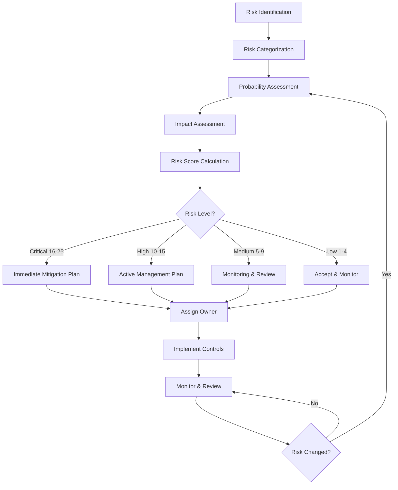
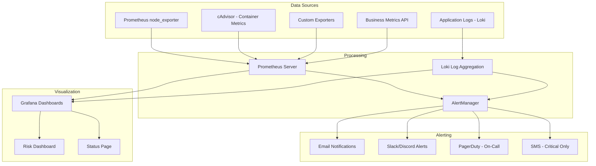
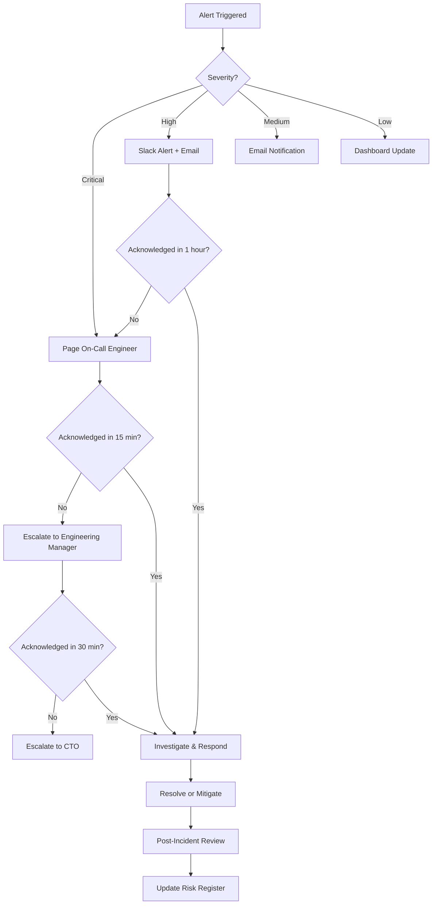
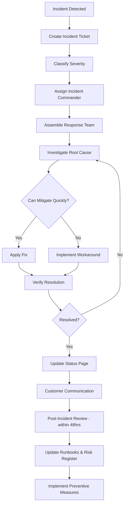
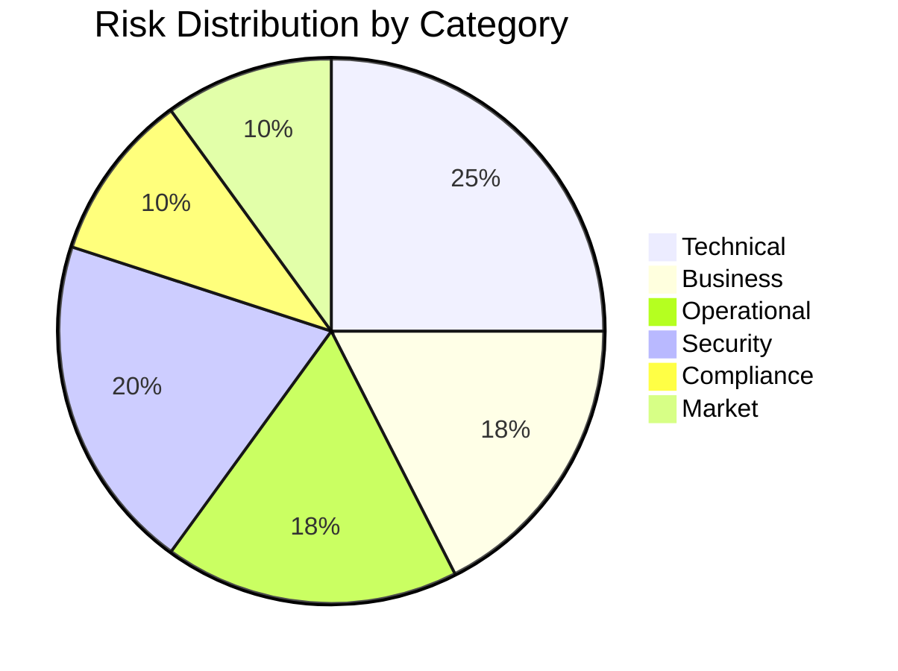
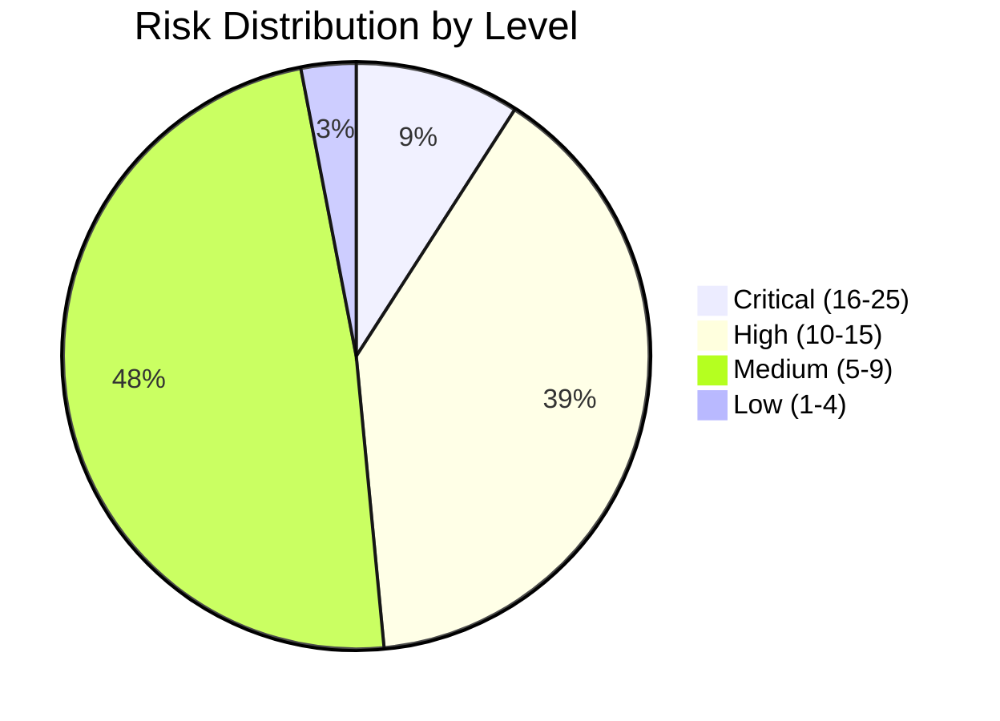

# 26. Risk Analysis

> **ITBengal Hosting Platform — Engineering Specification**
> **Document Version:** 1.0.0
> **Last Updated:** 2026-07-04
> **Status:** Approved
> **Classification:** Internal — Confidential
> **Owner:** CTO / VP Engineering

---

## Table of Contents

- [1. Executive Summary](#1-executive-summary)
- [2. Risk Assessment Methodology](#2-risk-assessment-methodology)
- [3. Technical Risks](#3-technical-risks)
- [4. Business Risks](#4-business-risks)
- [5. Operational Risks](#5-operational-risks)
- [6. Security Risks](#6-security-risks)
- [7. Compliance Risks](#7-compliance-risks)
- [8. Market Risks](#8-market-risks)
- [9. Top 20 Risks Summary](#9-top-20-risks-summary)
- [10. 5×5 Risk Matrix Visualization](#10-5x5-risk-matrix-visualization)
- [11. Detailed Mitigation Strategies](#11-detailed-mitigation-strategies)
- [12. Risk Monitoring Framework](#12-risk-monitoring-framework)
- [13. Risk Ownership Matrix](#13-risk-ownership-matrix)
- [14. Risk Response Procedures](#14-risk-response-procedures)
- [15. Risk Review Schedule](#15-risk-review-schedule)
- [16. Appendices](#16-appendices)

---

## 1. Executive Summary

### 1.1 Purpose

This Risk Analysis document provides a comprehensive assessment of all risks associated with building, launching, and operating the ITBengal hosting platform. It serves as the authoritative risk register for the engineering, operations, business, and leadership teams, enabling proactive risk management throughout the platform lifecycle.

### 1.2 Methodology

The assessment combines **qualitative analysis** (expert judgment, historical data from comparable platforms) with **quantitative analysis** (financial impact modeling, probability estimation) using a **5×5 Probability/Impact matrix**. Risks are categorized across six domains: Technical, Business, Operational, Security, Compliance, and Market.

### 1.3 Key Findings

- **33 risks** identified across 6 categories
- **5 Critical risks** (score 16–25) requiring immediate mitigation
- **8 High risks** (score 10–15) requiring active management
- **12 Medium risks** (score 5–9) requiring monitoring
- **8 Low risks** (score 1–4) accepted with monitoring
- Estimated **risk mitigation budget**: $45,000–$65,000 annually
- Primary risk concentration: **Security** and **Technical** domains

### 1.4 Risk Assessment Workflow



---

## 2. Risk Assessment Methodology

### 2.1 Probability Scale

| Level | Rating | Description | Frequency |
|-------|--------|-------------|-----------|
| 1 | Rare | May occur only in exceptional circumstances | Less than once per year |
| 2 | Unlikely | Could occur but not expected | Once per year |
| 3 | Possible | Might occur at some time | Once per quarter |
| 4 | Likely | Will probably occur in most circumstances | Once per month |
| 5 | Almost Certain | Expected to occur in most circumstances | Weekly or more |

### 2.2 Impact Scale

| Level | Rating | Financial Impact | Operational Impact | Reputational Impact |
|-------|--------|------------------|--------------------|---------------------|
| 1 | Negligible | < $500 | No service disruption | No public awareness |
| 2 | Minor | $500 – $5,000 | < 1 hour downtime | Limited customer complaints |
| 3 | Moderate | $5,000 – $25,000 | 1–4 hours downtime | Social media mentions |
| 4 | Major | $25,000 – $100,000 | 4–24 hours downtime | News coverage, customer exodus |
| 5 | Catastrophic | > $100,000 | > 24 hours downtime | Business-threatening, legal action |

### 2.3 Risk Score Calculation

**Risk Score = Probability × Impact**

| Risk Level | Score Range | Color Code | Action Required |
|------------|------------|------------|-----------------|
| **Low** | 1–4 | 🟢 Green | Accept with periodic monitoring |
| **Medium** | 5–9 | 🟡 Yellow | Monitor actively, implement controls |
| **High** | 10–15 | 🟠 Orange | Active management, mitigation plan required |
| **Critical** | 16–25 | 🔴 Red | Immediate action, executive attention |

---

## 3. Technical Risks

### TR-001: Single Server Failure

| Attribute | Value |
|-----------|-------|
| **Risk ID** | TR-001 |
| **Category** | Technical |
| **Description** | Initial architecture relies on single VPS servers for platform, React hosting, and WordPress hosting. A hardware failure, kernel panic, or hypervisor issue could bring down the entire service. |
| **Probability** | 3 (Possible) |
| **Impact** | 5 (Catastrophic) |
| **Risk Score** | **15 — High** |
| **Affected Systems** | All — Platform, React Nodes, WordPress Nodes |
| **Detection** | Prometheus uptime monitoring, external health checks (UptimeRobot), TCP port monitoring |
| **Mitigation** | (1) Implement automated failover with standby servers. (2) Deploy across 2+ VPS providers for geographic redundancy. (3) Daily full-system snapshots with 4-hour RTO. (4) Ansible playbooks for rapid re-provisioning (target: 30 min). (5) Load balancer health checks with automatic traffic rerouting. |
| **Residual Risk** | Medium (after multi-node deployment) |

### TR-002: Docker Container Vulnerabilities

| Attribute | Value |
|-----------|-------|
| **Risk ID** | TR-002 |
| **Category** | Technical |
| **Description** | Docker base images (node, php, nginx) may contain known CVEs. Customer-uploaded Dockerfiles may introduce vulnerabilities. Container runtime (runc) vulnerabilities could allow privilege escalation. |
| **Probability** | 4 (Likely) |
| **Impact** | 4 (Major) |
| **Risk Score** | **16 — Critical** |
| **Detection** | Trivy weekly scanning, Docker Scout alerts, CVE database monitoring |
| **Mitigation** | (1) Automated Trivy scans on all base images weekly. (2) Maintain curated, hardened base images. (3) Pin Docker Engine + runc versions, test before upgrade. (4) Restrict customer Dockerfiles (no privileged, no host network). (5) Enable Docker Content Trust for image signing. (6) Set container resource limits (cgroups v2). |

### TR-003: Data Loss

| Attribute | Value |
|-----------|-------|
| **Risk ID** | TR-003 |
| **Category** | Technical |
| **Description** | PostgreSQL or MariaDB corruption from disk failure, accidental DELETE/DROP, or failed migration. Customer website data (files, uploads) loss from storage failure. |
| **Probability** | 2 (Unlikely) |
| **Impact** | 5 (Catastrophic) |
| **Risk Score** | **10 — High** |
| **Detection** | Backup verification jobs (daily checksum), pg_stat_activity monitoring, WAL archiving alerts |
| **Mitigation** | (1) PostgreSQL WAL archiving with continuous PITR (15-min RPO). (2) Daily pg_dump + mysqldump with offsite replication. (3) 30-day backup retention with weekly restore tests. (4) RAID-1 on database servers. (5) Read replicas as warm standby. (6) Separate backup server with encrypted storage. |

### TR-004: Performance Degradation Under Load

| Attribute | Value |
|-----------|-------|
| **Risk ID** | TR-004 |
| **Category** | Technical |
| **Description** | Noisy neighbor effect in multi-tenant Docker environments. CPU/RAM contention during build spikes. Slow response times causing customer dissatisfaction. |
| **Probability** | 4 (Likely) |
| **Impact** | 3 (Moderate) |
| **Risk Score** | **12 — High** |
| **Detection** | Per-container CPU/RAM metrics (cAdvisor), response time percentiles (P95, P99), Grafana alerting |
| **Mitigation** | (1) Strict cgroups resource limits per container. (2) CPU overcommit ratios: 4:1 Starter, 2:1 Pro, 1:1 Enterprise. (3) Separate build workers from serving nodes. (4) Auto-scaling build queue with BullMQ priority. (5) Container density limits per node. |

### TR-005: Build Pipeline Failures

| Attribute | Value |
|-----------|-------|
| **Risk ID** | TR-005 |
| **Category** | Technical |
| **Description** | npm/yarn install failures due to registry outages, OOM kills during builds (especially Next.js), timeouts on large repositories, incompatible Node.js versions. |
| **Probability** | 4 (Likely) |
| **Impact** | 2 (Minor) |
| **Risk Score** | **8 — Medium** |
| **Detection** | Build failure rate dashboards, BullMQ dead-letter queue monitoring, OOM kill tracking via dmesg |
| **Mitigation** | (1) npm registry mirror/cache (Verdaccio). (2) Build memory limits per plan tier (512MB–4GB). (3) Build timeouts: 5min Starter, 15min Pro, 30min Enterprise. (4) Docker layer caching for repeat builds. (5) Retry logic with exponential backoff (max 3 retries). (6) Pre-built base images for common frameworks. |

### TR-006: DNS Propagation Issues

| Attribute | Value |
|-----------|-------|
| **Risk ID** | TR-006 |
| **Category** | Technical |
| **Description** | Openprovider API failures preventing domain registration/DNS updates. DNS propagation delays causing customer domains to be unreachable. TTL misconfiguration causing stale records. |
| **Probability** | 3 (Possible) |
| **Impact** | 3 (Moderate) |
| **Risk Score** | **9 — Medium** |
| **Detection** | Openprovider API response time monitoring, DNS resolution checks from multiple locations, TTL audit scripts |
| **Mitigation** | (1) Openprovider API wrapper with retry logic + circuit breaker. (2) DNS change queue with BullMQ for reliable processing. (3) Cache DNS responses locally in Redis (respect TTL). (4) Health checks verifying DNS resolution post-change. (5) Fallback DNS provider integration (future). |

### TR-007: SSL Certificate Renewal Failures

| Attribute | Value |
|-----------|-------|
| **Risk ID** | TR-007 |
| **Category** | Technical |
| **Description** | Let's Encrypt rate limits (50 certs/domain/week, 300 new orders/account/3 hours). ACME challenge validation failures due to DNS/HTTP misconfiguration. Certificate expiry causing browser security warnings. |
| **Probability** | 3 (Possible) |
| **Impact** | 3 (Moderate) |
| **Risk Score** | **9 — Medium** |
| **Detection** | Certificate expiry monitoring (Prometheus ssl_cert_expiry), renewal failure alerts, Let's Encrypt rate limit tracking |
| **Mitigation** | (1) Renew certificates 30 days before expiry. (2) Multiple ACME accounts to distribute rate limits. (3) DNS-01 challenge as fallback to HTTP-01. (4) Certificate inventory with expiry dashboard. (5) Alerting at 30, 14, 7, 3, 1 day before expiry. (6) Wildcard certificates for platform subdomains. |

### TR-008: Database Connection Pool Exhaustion

| Attribute | Value |
|-----------|-------|
| **Risk ID** | TR-008 |
| **Category** | Technical |
| **Description** | PostgreSQL max_connections limit reached during traffic spikes. Connection leaks in application code. PgBouncer pool saturation. |
| **Probability** | 3 (Possible) |
| **Impact** | 4 (Major) |
| **Risk Score** | **12 — High** |
| **Detection** | PgBouncer connection metrics, pg_stat_activity monitoring, connection wait time alerts |
| **Mitigation** | (1) PgBouncer connection pooling (transaction mode). (2) max_connections: 200 (PostgreSQL) → 1000+ effective via PgBouncer. (3) Connection timeout: 30s. (4) Idle connection reaping: 300s. (5) Application-level connection health checks. (6) Read replicas for read-heavy queries. |

### TR-009: Redis Cache Failures

| Attribute | Value |
|-----------|-------|
| **Risk ID** | TR-009 |
| **Category** | Technical |
| **Description** | Redis OOM causing eviction of critical session/cache data. Redis persistence (RDB/AOF) failures causing data loss on restart. Single Redis instance as SPOF. |
| **Probability** | 2 (Unlikely) |
| **Impact** | 3 (Moderate) |
| **Risk Score** | **6 — Medium** |
| **Detection** | Redis memory usage monitoring, eviction rate alerts, persistence status checks |
| **Mitigation** | (1) maxmemory-policy: allkeys-lru for cache, noeviction for sessions. (2) Separate Redis instances for cache vs. sessions vs. BullMQ. (3) AOF persistence with fsync every second. (4) Redis Sentinel for automatic failover (Phase 2). (5) Application graceful degradation when cache unavailable. |

### TR-010: Traefik Routing Misconfigurations

| Attribute | Value |
|-----------|-------|
| **Risk ID** | TR-010 |
| **Category** | Technical |
| **Description** | Traefik dynamic configuration errors routing traffic to wrong containers. Label-based routing conflicts between customer domains. TLS termination failures. |
| **Probability** | 2 (Unlikely) |
| **Impact** | 4 (Major) |
| **Risk Score** | **8 — Medium** |
| **Detection** | Traefik access logs analysis, HTTP status code monitoring (5xx rate), routing validation tests |
| **Mitigation** | (1) Automated routing validation after each deployment. (2) Unique router/service naming convention (customer-id prefix). (3) Traefik configuration backup before changes. (4) Staging environment for routing changes. (5) Rate limiting on Traefik entrypoints. |

---

## 4. Business Risks

### BR-001: Low Initial Adoption in Bangladesh

| Attribute | Value |
|-----------|-------|
| **Risk ID** | BR-001 |
| **Category** | Business |
| **Description** | Bangladesh developers accustomed to cPanel/shared hosting or free tiers (Vercel, Netlify). Price sensitivity in BD market may limit paid conversions. Lack of brand recognition. |
| **Probability** | 4 (Likely) |
| **Impact** | 4 (Major) |
| **Risk Score** | **16 — Critical** |
| **Mitigation** | (1) Generous free tier for Starter plan. (2) Bangla-language onboarding and documentation. (3) University partnership program (free hosting for students). (4) Freelancer community outreach (650K+ BD freelancers). (5) Facebook/YouTube marketing in Bangla. (6) Developer advocacy and meetup sponsorship. |

### BR-002: Pricing Competition

| Attribute | Value |
|-----------|-------|
| **Risk ID** | BR-002 |
| **Category** | Business |
| **Description** | Vercel/Netlify offer generous free tiers. Hostinger offers $1.99/mo shared hosting. Local BD hosts offer even cheaper plans. Price-matching would erode margins. |
| **Probability** | 5 (Almost Certain) |
| **Impact** | 3 (Moderate) |
| **Risk Score** | **15 — High** |
| **Mitigation** | (1) Compete on local payment support (bKash/Nagad), Bangla support, and BD-optimized latency. (2) Differentiate on managed services (auto-backup, staging, clone). (3) Bundle domain + hosting at competitive rates. (4) Annual billing discounts (30-40% savings). (5) Referral program with hosting credits. |

### BR-003: Payment Gateway Failures

| Attribute | Value |
|-----------|-------|
| **Risk ID** | BR-003 |
| **Category** | Business |
| **Description** | bKash/Nagad API downtime preventing payment collection. Payment reconciliation errors. Refund processing delays. Currency conversion issues for international payments. |
| **Probability** | 3 (Possible) |
| **Impact** | 3 (Moderate) |
| **Risk Score** | **9 — Medium** |
| **Mitigation** | (1) Multiple payment gateway fallbacks (bKash → Nagad → Rocket → Stripe). (2) Grace period for failed payments (3 days before suspension). (3) Manual payment verification option. (4) Payment retry with exponential backoff. (5) Real-time payment gateway health monitoring. |

### BR-004: Customer Churn

| Attribute | Value |
|-----------|-------|
| **Risk ID** | BR-004 |
| **Category** | Business |
| **Description** | Customers leaving due to outages, performance issues, better competitor offers, or poor support experience. Target churn rate: < 5% monthly. |
| **Probability** | 3 (Possible) |
| **Impact** | 4 (Major) |
| **Risk Score** | **12 — High** |
| **Mitigation** | (1) SLA commitments with credit compensation. (2) Proactive performance monitoring and outreach. (3) Exit surveys with automated follow-up. (4) Loyalty discounts for annual renewals. (5) Feature roadmap transparency. (6) 24/7 support for Business/Enterprise tiers. |

### BR-005: Support Ticket Overload

| Attribute | Value |
|-----------|-------|
| **Risk ID** | BR-005 |
| **Category** | Business |
| **Description** | Small support team overwhelmed by ticket volume. First response time degradation. Customer frustration from slow resolution. |
| **Probability** | 4 (Likely) |
| **Impact** | 2 (Minor) |
| **Risk Score** | **8 — Medium** |
| **Mitigation** | (1) Comprehensive self-service documentation (Bangla + English). (2) Knowledge base with searchable FAQs. (3) Chatbot for common issues. (4) Tiered support (community → email → priority → dedicated). (5) Support ticket routing by category. (6) Hire support staff proactively at growth milestones. |

### BR-006: Revenue Concentration Risk

| Attribute | Value |
|-----------|-------|
| **Risk ID** | BR-006 |
| **Category** | Business |
| **Description** | Early-stage dependency on a few large customers for majority of revenue. Loss of any single customer significantly impacts financials. |
| **Probability** | 3 (Possible) |
| **Impact** | 3 (Moderate) |
| **Risk Score** | **9 — Medium** |
| **Mitigation** | (1) Target diverse customer segments (freelancers, agencies, SMBs, enterprises). (2) Cap single customer revenue at < 15% of total. (3) Long-term contracts with Enterprise customers. (4) Diversify revenue streams (hosting + domains + marketplace). |

### BR-007: Negative Reviews / Reputation Damage

| Attribute | Value |
|-----------|-------|
| **Risk ID** | BR-007 |
| **Category** | Business |
| **Description** | Public outage, data breach, or poor support experience generating negative social media posts, blog reviews, or forum discussions in Bangladesh tech community. |
| **Probability** | 3 (Possible) |
| **Impact** | 3 (Moderate) |
| **Risk Score** | **9 — Medium** |
| **Mitigation** | (1) Public status page (status.itbengal.com). (2) Transparent incident communication. (3) Post-incident reports (RCA) published publicly. (4) Social media monitoring for brand mentions. (5) Proactive outreach to dissatisfied customers. |

---

## 5. Operational Risks

### OR-001: Provisioning Delays

| Attribute | Value |
|-----------|-------|
| **Risk ID** | OR-001 |
| **Category** | Operational |
| **Description** | Slow container creation, DNS setup, or SSL provisioning causing poor first-experience for new customers. Target: < 60 seconds for React app deployment, < 3 minutes for WordPress. |
| **Probability** | 3 (Possible) |
| **Impact** | 2 (Minor) |
| **Risk Score** | **6 — Medium** |
| **Mitigation** | (1) Pre-warmed container pool for instant provisioning. (2) Parallel execution (DNS + SSL + container in parallel). (3) Async provisioning with real-time status updates. (4) Performance benchmarks for provisioning pipeline. |

### OR-002: SSL Certificate Renewal Failures (Operational)

| Attribute | Value |
|-----------|-------|
| **Risk ID** | OR-002 |
| **Category** | Operational |
| **Description** | Automated SSL renewal failing silently, causing expired certificates and browser warnings for customer sites. |
| **Probability** | 3 (Possible) |
| **Impact** | 3 (Moderate) |
| **Risk Score** | **9 — Medium** |
| **Mitigation** | (1) Daily certificate expiry scan across all domains. (2) Multi-stage alerting (30d, 14d, 7d, 3d, 1d). (3) Automatic retry with fallback challenge type. (4) Manual renewal escalation process. (5) Certificate status dashboard in admin panel. |

### OR-003: Backup Corruption

| Attribute | Value |
|-----------|-------|
| **Risk ID** | OR-003 |
| **Category** | Operational |
| **Description** | Backup files corrupted during creation, transfer, or storage. Discovered only during restore attempt, rendering backups useless. |
| **Probability** | 2 (Unlikely) |
| **Impact** | 5 (Catastrophic) |
| **Risk Score** | **10 — High** |
| **Mitigation** | (1) SHA-256 checksum verification post-backup. (2) Weekly automated restore tests (random sample). (3) Multiple backup destinations (local + offsite). (4) Backup encryption with AES-256. (5) Backup monitoring dashboard with success/failure rates. |

### OR-004: Monitoring Gaps

| Attribute | Value |
|-----------|-------|
| **Risk ID** | OR-004 |
| **Category** | Operational |
| **Description** | Blind spots in observability — issues occurring without triggering alerts. Prometheus scrape failures, Grafana dashboard gaps, missing log collection. |
| **Probability** | 3 (Possible) |
| **Impact** | 3 (Moderate) |
| **Risk Score** | **9 — Medium** |
| **Mitigation** | (1) Monitoring-of-monitoring (dead man's switch alerts). (2) External synthetic monitoring (UptimeRobot, Pingdom). (3) Quarterly monitoring coverage audit. (4) Alert testing (fire drill) monthly. (5) Structured logging with Loki for all services. |

### OR-005: Configuration Drift

| Attribute | Value |
|-----------|-------|
| **Risk ID** | OR-005 |
| **Category** | Operational |
| **Description** | Server configurations diverging from baseline over time due to manual changes, hotfixes, or incomplete automation. |
| **Probability** | 3 (Possible) |
| **Impact** | 2 (Minor) |
| **Risk Score** | **6 — Medium** |
| **Mitigation** | (1) Ansible as single source of truth for all configurations. (2) No manual SSH changes — all via Ansible playbooks. (3) Monthly configuration drift detection. (4) Immutable infrastructure approach for hosting nodes. |

### OR-006: Inadequate Capacity Planning

| Attribute | Value |
|-----------|-------|
| **Risk ID** | OR-006 |
| **Category** | Operational |
| **Description** | Server resources exhausted before new capacity can be provisioned. Disk full, CPU saturated, or memory exhausted causing cascading failures. |
| **Probability** | 3 (Possible) |
| **Impact** | 4 (Major) |
| **Risk Score** | **12 — High** |
| **Mitigation** | (1) Capacity forecasting based on growth trends. (2) Alerts at 70%/80%/90% utilization thresholds. (3) Pre-provisioned standby servers (warm pool). (4) Monthly capacity review with provisioning recommendations. (5) Automated node provisioning playbooks (target: 30 min). |

### OR-007: Manual Process Errors

| Attribute | Value |
|-----------|-------|
| **Risk ID** | OR-007 |
| **Category** | Operational |
| **Description** | Human errors during manual operations — wrong server, wrong customer, accidental data deletion, misconfigured firewall. |
| **Probability** | 3 (Possible) |
| **Impact** | 3 (Moderate) |
| **Risk Score** | **9 — Medium** |
| **Mitigation** | (1) Runbooks for all operational procedures. (2) Four-eyes principle for destructive operations. (3) Audit logging of all administrative actions. (4) Staging environment for testing changes. (5) Automated rollback capabilities. |

---

## 6. Security Risks

### SR-001: DDoS Attacks

| Attribute | Value |
|-----------|-------|
| **Risk ID** | SR-001 |
| **Category** | Security |
| **Description** | Volumetric DDoS attacks saturating network bandwidth. Application-layer DDoS exhausting server resources. Attacks targeting platform or individual customer sites. |
| **Probability** | 4 (Likely) |
| **Impact** | 4 (Major) |
| **Risk Score** | **16 — Critical** |
| **Mitigation** | (1) Cloudflare proxy for platform domains (free tier minimum). (2) Traefik rate limiting per IP (100 req/s default). (3) fail2ban for SSH/API brute force. (4) VPS provider-level DDoS protection (Hetzner includes basic). (5) Traffic anomaly detection with Prometheus. (6) Customer-level rate limiting. (7) Incident response playbook for DDoS scenarios. |

### SR-002: Data Breaches

| Attribute | Value |
|-----------|-------|
| **Risk ID** | SR-002 |
| **Category** | Security |
| **Description** | Unauthorized access to customer data, credentials, payment information, or source code. Could occur via application vulnerability, compromised credentials, or insider threat. |
| **Probability** | 2 (Unlikely) |
| **Impact** | 5 (Catastrophic) |
| **Risk Score** | **10 — High** |
| **Mitigation** | (1) Encryption at rest (AES-256) for all sensitive data. (2) Encryption in transit (TLS 1.3). (3) bcrypt password hashing (cost factor 12). (4) PII access logging and monitoring. (5) Principle of least privilege for all access. (6) Quarterly access reviews. (7) Incident response plan with 72-hour breach notification. |

### SR-003: Container Escape Vulnerabilities

| Attribute | Value |
|-----------|-------|
| **Risk ID** | SR-003 |
| **Category** | Security |
| **Description** | Vulnerability in Docker runtime (runc, containerd) allowing container breakout to host OS. Malicious customer code exploiting kernel vulnerabilities. |
| **Probability** | 1 (Rare) |
| **Impact** | 5 (Catastrophic) |
| **Risk Score** | **5 — Medium** |
| **Mitigation** | (1) Keep Docker Engine and runc at latest stable versions. (2) AppArmor/Seccomp profiles for all containers. (3) Drop all Linux capabilities except required minimum. (4) No privileged containers for customer workloads. (5) User namespace remapping (userns-remap). (6) gVisor/Kata containers evaluation for high-security (future). |

### SR-004: Supply Chain Attacks

| Attribute | Value |
|-----------|-------|
| **Risk ID** | SR-004 |
| **Category** | Security |
| **Description** | Compromised npm packages in platform dependencies. Malicious Docker base images. Typosquatting attacks on popular packages. |
| **Probability** | 3 (Possible) |
| **Impact** | 4 (Major) |
| **Risk Score** | **12 — High** |
| **Mitigation** | (1) npm audit in CI/CD pipeline (fail on critical). (2) Lock file integrity verification (package-lock.json). (3) Private npm registry/mirror (Verdaccio). (4) Docker Content Trust for image verification. (5) Dependency pinning with exact versions. (6) Snyk or Socket.dev for real-time dependency monitoring. |

### SR-005: Insider Threats

| Attribute | Value |
|-----------|-------|
| **Risk ID** | SR-005 |
| **Category** | Security |
| **Description** | Malicious or negligent actions by team members with privileged access. Data exfiltration, sabotage, or unauthorized access to customer data. |
| **Probability** | 1 (Rare) |
| **Impact** | 5 (Catastrophic) |
| **Risk Score** | **5 — Medium** |
| **Mitigation** | (1) RBAC with minimum required permissions. (2) Comprehensive audit logging of all admin actions. (3) SSH access via jump box with session recording. (4) Regular access reviews and deprovisioning. (5) Background checks for engineering staff. (6) Two-person rule for production database access. |

### SR-006: Brute Force Attacks

| Attribute | Value |
|-----------|-------|
| **Risk ID** | SR-006 |
| **Category** | Security |
| **Description** | Automated credential stuffing or brute force attacks against customer/admin login endpoints and SSH. |
| **Probability** | 5 (Almost Certain) |
| **Impact** | 3 (Moderate) |
| **Risk Score** | **15 — High** |
| **Mitigation** | (1) Rate limiting: 5 failed logins → 15-min lockout. (2) CAPTCHA after 3 failed attempts. (3) 2FA mandatory for admin, optional for customers. (4) fail2ban for SSH (ban after 5 failures for 1 hour). (5) Account lockout notifications via email. (6) Password strength requirements (12+ chars, complexity). |

### SR-007: API Key Leakage

| Attribute | Value |
|-----------|-------|
| **Risk ID** | SR-007 |
| **Category** | Security |
| **Description** | Customer or platform API keys exposed in public Git repositories, logs, or browser dev tools. |
| **Probability** | 3 (Possible) |
| **Impact** | 3 (Moderate) |
| **Risk Score** | **9 — Medium** |
| **Mitigation** | (1) API keys prefixed with `itb_` for easy identification. (2) GitHub secret scanning integration. (3) API key rotation capability in dashboard. (4) Key scoping (read-only, deploy-only, full-access). (5) Expiring API keys with configurable TTL. (6) Log scrubbing for API keys. |

### SR-008: Cross-Tenant Data Access

| Attribute | Value |
|-----------|-------|
| **Risk ID** | SR-008 |
| **Category** | Security |
| **Description** | One customer accessing another customer's data, containers, files, or databases due to isolation failures. |
| **Probability** | 1 (Rare) |
| **Impact** | 5 (Catastrophic) |
| **Risk Score** | **5 — Medium** |
| **Mitigation** | (1) Docker network isolation per customer. (2) Unique user namespace per container. (3) Filesystem isolation with separate volumes. (4) Database row-level security (RLS) where shared. (5) Automated tenant isolation testing in CI/CD. (6) Quarterly penetration testing for tenant isolation. |

---

## 7. Compliance Risks

### CR-001: Bangladesh ICT Act / Data Localization

| Attribute | Value |
|-----------|-------|
| **Risk ID** | CR-001 |
| **Category** | Compliance |
| **Description** | Bangladesh ICT Act 2006 (amended 2013) and Digital Security Act 2018 impose data localization and content restrictions. Non-compliance may result in penalties or service shutdown. |
| **Probability** | 3 (Possible) |
| **Impact** | 4 (Major) |
| **Risk Score** | **12 — High** |
| **Mitigation** | (1) Bangladesh-based primary data storage for BD customers. (2) Legal counsel specializing in BD telecom/IT law. (3) Content moderation policies aligned with Digital Security Act. (4) Data residency options in customer dashboard. (5) Regulatory compliance monitoring for policy changes. |

### CR-002: GDPR Compliance

| Attribute | Value |
|-----------|-------|
| **Risk ID** | CR-002 |
| **Category** | Compliance |
| **Description** | Processing personal data of EU customers requires GDPR compliance. Data processing agreements, right to erasure, data portability, breach notification within 72 hours. |
| **Probability** | 2 (Unlikely — initially, BD-focused) |
| **Impact** | 4 (Major) |
| **Risk Score** | **8 — Medium** |
| **Mitigation** | (1) Privacy policy aligned with GDPR. (2) Data Processing Agreement (DPA) template. (3) Right to erasure implementation (data deletion API). (4) Data export capability (JSON/CSV). (5) Cookie consent management. (6) DPO appointment when EU expansion begins. |

### CR-003: PCI DSS Compliance

| Attribute | Value |
|-----------|-------|
| **Risk ID** | CR-003 |
| **Category** | Compliance |
| **Description** | Processing payment card data requires PCI DSS compliance. Non-compliance risks fines and loss of payment processing capability. |
| **Probability** | 2 (Unlikely — using tokenized gateways) |
| **Impact** | 4 (Major) |
| **Risk Score** | **8 — Medium** |
| **Mitigation** | (1) Never store raw card numbers — use Stripe/PayPal tokenization. (2) SAQ A compliance (card data handled entirely by payment provider). (3) HTTPS-only payment pages. (4) Annual PCI self-assessment questionnaire. (5) Payment page isolation from main application. |

### CR-004: WHOIS Data Privacy

| Attribute | Value |
|-----------|-------|
| **Risk ID** | CR-004 |
| **Category** | Compliance |
| **Description** | Domain WHOIS data exposure violating customer privacy expectations. ICANN requirements vs. privacy regulations. |
| **Probability** | 2 (Unlikely) |
| **Impact** | 2 (Minor) |
| **Risk Score** | **4 — Low** |
| **Mitigation** | (1) WHOIS privacy protection enabled by default (via Openprovider). (2) Clear privacy policy for domain data. (3) GDPR-compliant WHOIS redaction for EU customers. |

---

## 8. Market Risks

### MR-001: New Competitor Entry

| Attribute | Value |
|-----------|-------|
| **Risk ID** | MR-001 |
| **Category** | Market |
| **Description** | Well-funded competitor entering Bangladesh hosting market with aggressive pricing or superior technology. International players (Vercel, Railway) adding BD payment support. |
| **Probability** | 3 (Possible) |
| **Impact** | 3 (Moderate) |
| **Risk Score** | **9 — Medium** |
| **Mitigation** | (1) Build strong brand loyalty before competitors arrive. (2) Local-first features that global players can't easily replicate. (3) Community moats (developer relations, university programs). (4) Continuous feature velocity. (5) Switch cost through integrations and data lock-in. |

### MR-002: Technology Shifts

| Attribute | Value |
|-----------|-------|
| **Risk ID** | MR-002 |
| **Category** | Market |
| **Description** | Serverless/edge computing becoming dominant, making traditional container hosting less relevant. WebAssembly or new paradigms disrupting the market. |
| **Probability** | 2 (Unlikely — in BD market timeline) |
| **Impact** | 4 (Major) |
| **Risk Score** | **8 — Medium** |
| **Mitigation** | (1) Monitor technology trends quarterly. (2) Serverless functions product in Year 3 roadmap. (3) Edge computing capabilities via CDN expansion. (4) Architecture designed for extensibility. |

### MR-003: Currency Fluctuation (BDT/USD)

| Attribute | Value |
|-----------|-------|
| **Risk ID** | MR-003 |
| **Category** | Market |
| **Description** | BDT depreciation against USD increasing VPS costs (denominated in USD/EUR) while revenue is in BDT. Significant margin compression if BDT weakens substantially. |
| **Probability** | 4 (Likely) |
| **Impact** | 3 (Moderate) |
| **Risk Score** | **12 — High** |
| **Mitigation** | (1) Price plans with built-in currency buffer (15% margin). (2) Quarterly pricing reviews based on exchange rate. (3) Diversify revenue to include USD-denominated international customers. (4) Long-term VPS contracts locked in at favorable rates. (5) Hedging strategy evaluation when revenue exceeds $100K/yr. |

### MR-004: Economic Downturn

| Attribute | Value |
|-----------|-------|
| **Risk ID** | MR-004 |
| **Category** | Market |
| **Description** | Economic recession in Bangladesh reducing SMB technology spending. Customers downgrading plans or canceling subscriptions. |
| **Probability** | 2 (Unlikely) |
| **Impact** | 3 (Moderate) |
| **Risk Score** | **6 — Medium** |
| **Mitigation** | (1) Maintain affordable Starter tier. (2) Flexible billing (monthly, no long-term commitment required). (3) Cost optimization to maintain margins during downturn. (4) Focus on essential services that businesses can't cut. |

---

## 9. Top 20 Risks Summary

| Rank | Risk ID | Category | Description | P | I | Score | Level | Mitigation Summary | Owner | Status |
|------|---------|----------|-------------|---|---|-------|-------|---------------------|-------|--------|
| 1 | TR-002 | Technical | Docker container vulnerabilities (CVEs) | 4 | 4 | 16 | 🔴 Critical | Trivy scanning, hardened base images, cgroups | DevOps Lead | Active |
| 2 | BR-001 | Business | Low initial adoption in Bangladesh | 4 | 4 | 16 | 🔴 Critical | Free tier, Bangla support, university partnerships | Product Manager | Active |
| 3 | SR-001 | Security | DDoS attacks on platform/customer sites | 4 | 4 | 16 | 🔴 Critical | Cloudflare proxy, rate limiting, fail2ban | Security Engineer | Active |
| 4 | TR-001 | Technical | Single server failure (SPOF) | 3 | 5 | 15 | 🟠 High | Multi-node deployment, automated failover | Infrastructure Lead | Planning |
| 5 | BR-002 | Business | Pricing competition from global players | 5 | 3 | 15 | 🟠 High | Local differentiation, bundles, referral program | Product Manager | Active |
| 6 | SR-006 | Security | Brute force attacks on login endpoints | 5 | 3 | 15 | 🟠 High | Rate limiting, 2FA, fail2ban, CAPTCHA | Security Engineer | Active |
| 7 | TR-004 | Technical | Performance degradation under load | 4 | 3 | 12 | 🟠 High | Cgroups limits, density caps, build isolation | DevOps Lead | Planning |
| 8 | BR-004 | Business | Customer churn from service quality | 3 | 4 | 12 | 🟠 High | SLAs, proactive monitoring, exit surveys | Customer Success | Planning |
| 9 | SR-004 | Security | Supply chain attacks (npm packages) | 3 | 4 | 12 | 🟠 High | npm audit, lock file verification, Verdaccio | Security Engineer | Active |
| 10 | CR-001 | Compliance | Bangladesh ICT Act compliance | 3 | 4 | 12 | 🟠 High | BD data storage, legal counsel, monitoring | Legal / CTO | Active |
| 11 | OR-006 | Operational | Inadequate capacity planning | 3 | 4 | 12 | 🟠 High | Forecasting, utilization alerts, standby servers | Infrastructure Lead | Planning |
| 12 | MR-003 | Market | BDT/USD currency fluctuation | 4 | 3 | 12 | 🟠 High | Currency buffer, quarterly reviews, USD revenue | CFO / Finance | Active |
| 13 | TR-008 | Technical | Database connection pool exhaustion | 3 | 4 | 12 | 🟠 High | PgBouncer, connection limits, read replicas | Database Lead | Planning |
| 14 | TR-003 | Technical | Data loss (DB corruption/deletion) | 2 | 5 | 10 | 🟠 High | WAL archiving, daily backups, restore tests | Database Lead | Active |
| 15 | OR-003 | Operational | Backup corruption | 2 | 5 | 10 | 🟠 High | Checksums, restore tests, multi-destination | DevOps Lead | Active |
| 16 | SR-002 | Security | Data breaches (customer data) | 2 | 5 | 10 | 🟠 High | Encryption, access controls, breach response | Security Engineer | Active |
| 17 | TR-006 | Technical | DNS propagation issues (Openprovider) | 3 | 3 | 9 | 🟡 Medium | API retry logic, DNS health checks | Backend Lead | Planning |
| 18 | TR-007 | Technical | SSL certificate renewal failures | 3 | 3 | 9 | 🟡 Medium | 30-day pre-renewal, multi-stage alerts | DevOps Lead | Planning |
| 19 | MR-001 | Market | New competitor entry in BD market | 3 | 3 | 9 | 🟡 Medium | Brand loyalty, community moats, feature velocity | Product Manager | Monitoring |
| 20 | BR-003 | Business | Payment gateway failures (bKash/Nagad) | 3 | 3 | 9 | 🟡 Medium | Multi-gateway fallback, grace periods | Backend Lead | Planning |

---

## 10. 5×5 Risk Matrix Visualization

|  | **Negligible (1)** | **Minor (2)** | **Major (3)** | **Major (4)** | **Catastrophic (5)** |
|---|---|---|---|---|---|
| **Almost Certain (5)** | | | BR-002, SR-006 | | |
| **Likely (4)** | | BR-005 | TR-004, MR-003 | TR-002, BR-001, SR-001 | |
| **Possible (3)** | | OR-001, OR-005 | TR-006, TR-007, BR-003, BR-006, BR-007, OR-002, OR-004, OR-007, SR-007, MR-001, MR-004 | TR-008, BR-004, SR-004, CR-001, OR-006 | |
| **Unlikely (2)** | | | TR-009, MR-002, CR-002, CR-003 | | TR-003, OR-003, SR-002 |
| **Rare (1)** | | CR-004 | | | SR-003, SR-005, SR-008 |

**Legend:**
- 🔴 **Critical (16–25):** TR-002, BR-001, SR-001
- 🟠 **High (10–15):** TR-001, TR-003, TR-004, TR-008, BR-002, BR-004, SR-002, SR-004, SR-006, CR-001, OR-003, OR-006, MR-003
- 🟡 **Medium (5–9):** TR-005, TR-006, TR-007, TR-009, TR-010, BR-003, BR-005, BR-006, BR-007, OR-001, OR-002, OR-004, OR-005, OR-007, SR-003, SR-005, SR-007, SR-008, CR-002, CR-003, MR-001, MR-002, MR-004
- 🟢 **Low (1–4):** CR-004

---

## 11. Detailed Mitigation Strategies

### 11.1 Critical Risks — Immediate Action Required

#### TR-002: Docker Container Vulnerabilities

| Phase | Action | Timeline | Cost |
|-------|--------|----------|------|
| **Prevention** | Maintain curated base images (node:20-alpine, php:8.2-fpm-alpine). Pin versions. No `latest` tags. | Week 1 | $0 |
| **Detection** | Trivy scanning in CI/CD pipeline. Weekly scheduled scans of all running images. CVE alert subscriptions. | Week 1 | $0 (OSS) |
| **Response** | Critical CVE: rebuild affected images within 24 hours. Block deployments using vulnerable base images. | Ongoing | $0 |
| **Recovery** | Rollback to previous known-good image. Customer notification if data exposed. | Ongoing | $0 |
| **Monitoring** | Grafana dashboard: image age, CVE count, last scan date per image. | Week 2 | $0 |

#### BR-001: Low Initial Adoption

| Phase | Action | Timeline | Cost |
|-------|--------|----------|------|
| **Prevention** | Generous free tier (1 project, 100 build min/mo). Bangla-first UX. University program. | Pre-launch | $2,000/mo opportunity cost |
| **Detection** | Signup funnel analytics. Activation rate monitoring. Cohort analysis. | Launch week | $50/mo (analytics tools) |
| **Response** | If < 50 signups/week after 1 month: increase marketing spend, add Facebook ads, sponsor tech meetups. | Month 2 | $1,000–3,000/mo |
| **Recovery** | Product pivot based on feedback. Price adjustment. Feature prioritization from user surveys. | Quarter 2 | Variable |

#### SR-001: DDoS Attacks

| Phase | Action | Timeline | Cost |
|-------|--------|----------|------|
| **Prevention** | Cloudflare proxy for all platform domains. Traefik rate limiting (100 req/s/IP). iptables SYN flood protection. | Week 1 | $0 (Cloudflare free) |
| **Detection** | Traffic anomaly detection: >5x baseline triggers alert. Prometheus network metrics. | Week 2 | $0 |
| **Response** | Cloudflare Under Attack mode. IP/ASN blocking. Enable additional rate limits. Scale if needed. | Ongoing | $0–200/mo (Cloudflare Pro if needed) |
| **Recovery** | Post-attack analysis. Update WAF rules. Customer communication. | Post-incident | $0 |

### 11.2 High Risks — Active Management

#### TR-001: Single Server Failure

| Phase | Action | Timeline | Cost |
|-------|--------|----------|------|
| **Prevention** | Multi-node architecture with 2+ React nodes, 2+ WP nodes by Q2. Ansible for consistent provisioning. | Q1–Q2 | $100–200/mo per additional server |
| **Detection** | External health checks every 30s. Prometheus node_exporter. TCP port monitoring. | Week 1 | $10/mo (UptimeRobot) |
| **Response** | Automatic traffic rerouting via Traefik health checks. Standby server activation. | Within 5 min | $0 |
| **Recovery** | Ansible re-provision: 30 min target. Backup restore for data. DNS update if needed. | Within 4 hours (RTO) | $0 |

#### BR-002: Pricing Competition

| Phase | Action | Timeline | Cost |
|-------|--------|----------|------|
| **Prevention** | Compete on value (bKash/Nagad, Bangla support, local latency), not price alone. Annual discounts 30-40%. | Pre-launch | $0 |
| **Detection** | Competitor pricing monitoring quarterly. Win/loss analysis on sales. Churn reason tracking. | Ongoing | $0 |
| **Response** | Targeted promotions. Feature differentiation. Bundle discounts (hosting + domain). | As needed | Variable |

#### SR-006: Brute Force Attacks

| Phase | Action | Timeline | Cost |
|-------|--------|----------|------|
| **Prevention** | fail2ban (5 failures → 1hr ban). Rate limit login API (5/min/IP). Password policy (12+ chars). | Week 1 | $0 |
| **Detection** | Failed login dashboards. Geographic anomaly detection. Credential stuffing pattern recognition. | Week 2 | $0 |
| **Response** | Progressive lockout. CAPTCHA injection. 2FA enforcement for targeted accounts. | Automated | $0 |

---

## 12. Risk Monitoring Framework

### 12.1 Key Risk Indicators (KRIs)

| KRI | Metric | Threshold (Warning) | Threshold (Critical) | Tool | Dashboard |
|-----|--------|---------------------|----------------------|------|-----------|
| Server Uptime | % availability | < 99.95% | < 99.9% | Prometheus | Infrastructure |
| Error Rate | 5xx responses/min | > 10/min | > 50/min | Prometheus | Application |
| Response Time | P95 latency | > 500ms | > 2000ms | Prometheus | Application |
| Failed Logins | Failed attempts/hour | > 100/hr | > 500/hr | Application Logs | Security |
| Build Failure Rate | % failed builds | > 15% | > 30% | BullMQ Metrics | Deployment |
| Disk Usage | % utilization | > 80% | > 90% | node_exporter | Infrastructure |
| CPU Usage | % utilization (5min avg) | > 70% | > 90% | node_exporter | Infrastructure |
| Memory Usage | % utilization | > 80% | > 95% | node_exporter | Infrastructure |
| Certificate Expiry | Days until expiry | < 14 days | < 3 days | Custom exporter | SSL |
| Backup Success | % successful backups | < 99% | < 95% | Custom exporter | Operations |
| Customer Churn | Monthly churn rate | > 5% | > 10% | Application DB | Business |
| Payment Failure | % failed payments | > 5% | > 15% | Payment Gateway | Business |

### 12.2 Monitoring Architecture



### 12.3 Escalation Flow



---

## 13. Risk Ownership Matrix

| Risk Category | Primary Owner | Secondary Owner | Escalation Path | Review Frequency |
|---------------|---------------|-----------------|-----------------|------------------|
| **Technical** | CTO / Engineering Lead | DevOps Lead | CTO → CEO | Weekly |
| **Business** | Product Manager / CEO | Marketing Lead | CEO → Board | Monthly |
| **Operational** | DevOps Lead | Infrastructure Engineer | DevOps → CTO | Weekly |
| **Security** | Security Engineer | CTO | Security → CTO → CEO | Weekly |
| **Compliance** | Legal Counsel | CTO | Legal → CEO → Board | Monthly |
| **Market** | CEO / Product Manager | Business Analyst | CEO → Board | Quarterly |

### Individual Risk Ownership

| Risk ID | Primary Owner | Backup Owner |
|---------|---------------|--------------|
| TR-001 – TR-010 | DevOps Lead | Backend Lead |
| BR-001 – BR-007 | Product Manager | CEO |
| OR-001 – OR-007 | DevOps Lead | Infrastructure Engineer |
| SR-001 – SR-008 | Security Engineer | CTO |
| CR-001 – CR-004 | Legal Counsel | CTO |
| MR-001 – MR-004 | CEO | Product Manager |

---

## 14. Risk Response Procedures

### 14.1 Incident Classification

| Severity | Definition | Response Time | Resolution Target | Communication |
|----------|------------|---------------|-------------------|---------------|
| **SEV-1 (Critical)** | Platform-wide outage, data breach, complete service loss | 15 minutes | 4 hours | All-hands, customer email, status page, CEO notified |
| **SEV-2 (Major)** | Partial service degradation, single node failure, payment system down | 30 minutes | 8 hours | On-call team, affected customers, status page |
| **SEV-3 (Moderate)** | Single customer impact, non-critical feature broken, slow performance | 2 hours | 24 hours | Support ticket, affected customer |
| **SEV-4 (Minor)** | Cosmetic issues, documentation errors, non-urgent bugs | 24 hours | 1 week | Internal tracking only |

### 14.2 Incident Response Workflow



### 14.3 Communication Templates

#### SEV-1 — Initial Notification
```
Subject: [ITBengal] Service Disruption — {Service Name}

We are currently experiencing a service disruption affecting {description}.

Impact: {affected services and scope}
Start Time: {timestamp} BST
Status: Investigating

Our team is actively working to resolve this issue. Updates will be posted 
to our status page every 15 minutes: https://status.itbengal.com

We sincerely apologize for the inconvenience.
```

#### SEV-1 — Resolution Notification
```
Subject: [ITBengal] RESOLVED — {Service Name} Disruption

The service disruption affecting {description} has been resolved.

Duration: {start} to {end} ({total duration})
Root Cause: {brief summary}
Affected Customers: {count}

A detailed post-incident report will be published within 48 hours.
We apologize for the inconvenience and are implementing measures 
to prevent recurrence.
```

### 14.4 Post-Incident Review Process

1. **Timeline reconstruction** — Minute-by-minute event log
2. **Root cause analysis** — 5 Whys methodology
3. **Impact assessment** — Customers affected, revenue impact, SLA violation
4. **Action items** — Preventive measures with owners and deadlines
5. **Risk register update** — Adjust probability/impact if needed
6. **Lessons learned** — Share with entire engineering team
7. **Runbook update** — Add/modify procedures based on learnings

---

## 15. Risk Review Schedule

### 15.1 Review Cadence

| Frequency | Scope | Participants | Output |
|-----------|-------|-------------|--------|
| **Weekly** | Critical & High risks status update | Engineering leads, DevOps | Status report, blocker escalation |
| **Monthly** | Full risk register review | All risk owners | Updated risk register, new risks |
| **Quarterly** | Strategic risk assessment | Leadership team + department heads | Board report, budget adjustments |
| **Annually** | Comprehensive reassessment | All stakeholders | New risk analysis document |

### 15.2 Risk Register Update Procedures

1. New risks can be submitted by any team member via internal form
2. Risk owner validates and scores the risk within 48 hours
3. Risks scoring ≥ 10 require mitigation plan within 1 week
4. Risk register changes reviewed in next scheduled review
5. Material changes to Critical risks reported to CEO within 24 hours

### 15.3 Board Reporting

- Quarterly risk summary presented to board/investors
- Include: top 5 risks, mitigation status, new/closed risks, risk trend
- Financial impact estimates for Critical/High risks
- Budget requests for risk mitigation measures

---

## 16. Appendices

### 16.1 Risk Register Template

| Field | Description |
|-------|-------------|
| Risk ID | Unique identifier (e.g., TR-001) |
| Category | Technical / Business / Operational / Security / Compliance / Market |
| Title | Short descriptive title |
| Description | Detailed risk description |
| Probability | 1–5 scale |
| Impact | 1–5 scale |
| Risk Score | Probability × Impact |
| Risk Level | Low / Medium / High / Critical |
| Mitigation Strategy | Summary of controls and actions |
| Primary Owner | Responsible individual |
| Status | Open / Active / Mitigated / Accepted / Closed |
| Detection Method | How is this risk monitored |
| Last Reviewed | Date of last review |
| Notes | Additional context |

### 16.2 Incident Report Template

```markdown
# Incident Report: [INC-YYYY-NNN]

## Summary
- **Date:** YYYY-MM-DD
- **Duration:** HH:MM
- **Severity:** SEV-1/2/3/4
- **Incident Commander:** [Name]
- **Status:** Resolved / Monitoring

## Timeline
| Time (BST) | Event |
|------------|-------|
| HH:MM | [Event description] |

## Impact
- Customers affected: [count]
- Services affected: [list]
- Revenue impact: [estimate]
- SLA violation: [yes/no]

## Root Cause
[Detailed root cause analysis using 5 Whys]

## Resolution
[Steps taken to resolve the incident]

## Action Items
| # | Action | Owner | Deadline | Status |
|---|--------|-------|----------|--------|
| 1 | [Action] | [Name] | [Date] | Open |

## Lessons Learned
[Key takeaways and process improvements]
```

### 16.3 Risk Acceptance Criteria

A risk may be formally accepted (no further mitigation) when:

1. Risk score is ≤ 4 (Low) **OR**
2. Cost of mitigation exceeds potential impact by 3x+ **AND** probability is ≤ 2 **OR**
3. Risk is externally imposed with no practical mitigation **AND** approved by CTO
4. All accepted risks require:
   - Written acceptance by risk owner + CTO
   - Quarterly review to verify acceptance remains appropriate
   - Monitoring controls still in place for early detection

### 16.4 Risk Category Distribution



### 16.5 Risk Level Distribution



---

> **Document End**
> **Next Review:** 2026-10-04 (Quarterly)
> **Approved By:** CTO, CEO
> **Distribution:** Engineering, Operations, Security, Legal, Executive Team
