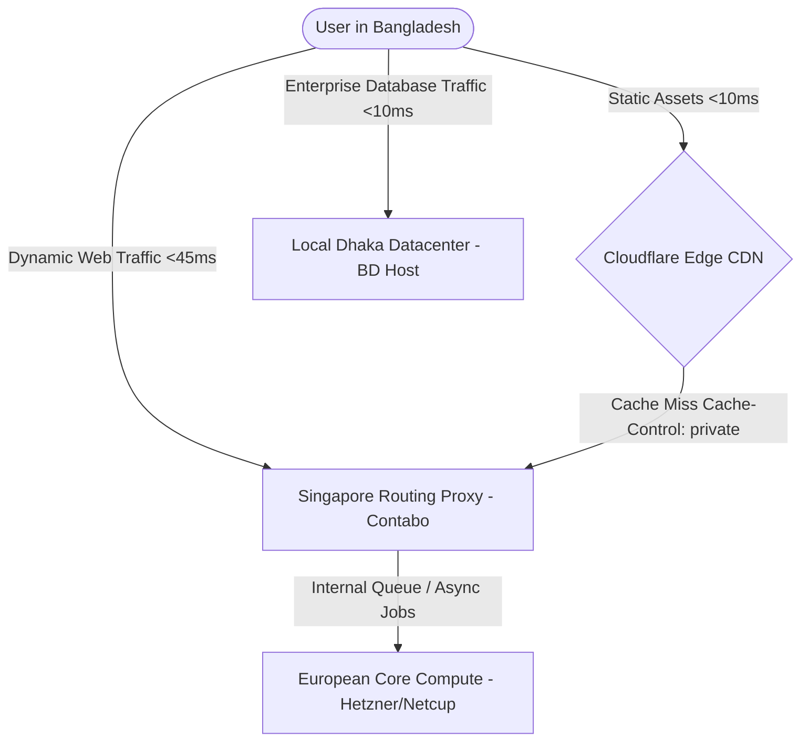
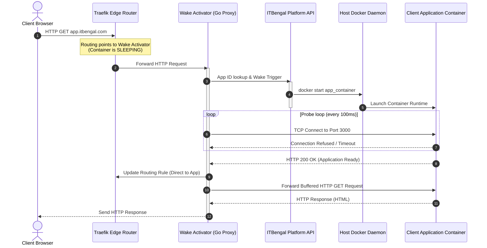
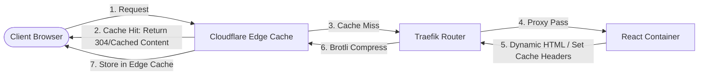
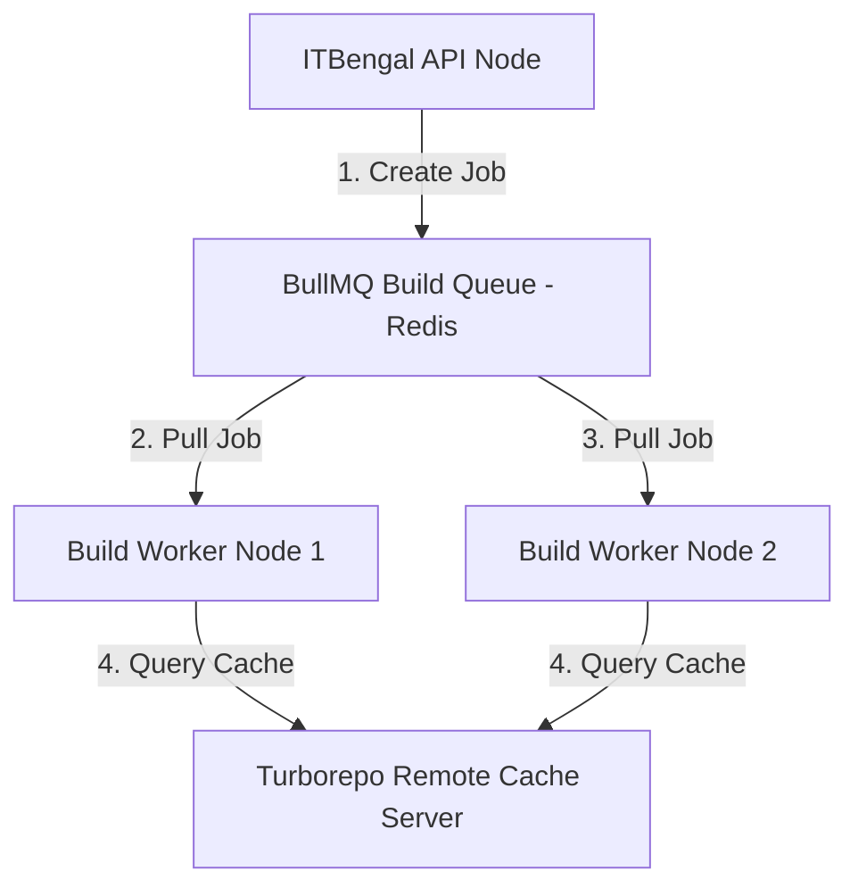
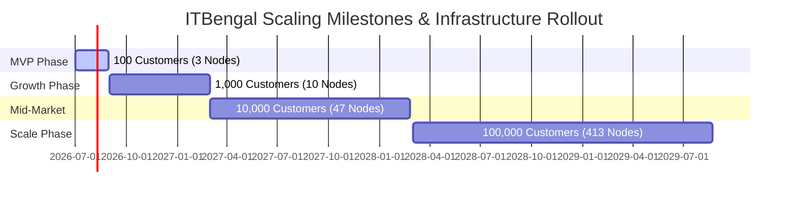

# Cost Optimization Strategy: ITBengal Hosting Platform

This document outlines the complete cost management, infrastructure selection, and resource optimization strategies for the ITBengal Hosting Platform. Operating entirely on self-managed virtual private servers (VPS) and bare-metal hardware, ITBengal achieves a 85% to 90% cost reduction compared to equivalent hyperscaler deployments (AWS, Azure, Google Cloud). This document details the exact engineering choices, resource-packing algorithms, database tuning parameters, network optimizations, and scale projections required to maintain a gross margin above 90% from MVP to 100,000+ active customers.

---

## 1. Document Architecture and Cross-Links

This strategy is tightly integrated with the other core engineering and operations specifications of the ITBengal Platform. For context on billing cycles, resource limits, and network routing layers, please refer to the following documents:
*   [Product Requirements Document (PRD)](file:///E:/itbengal/documents/01-prd.md) — For hosting plans and core business requirements.
*   [Software Requirements Specification (SRS)](file:///E:/itbengal/documents/02-srs.md) — For software interfaces and service boundaries.
*   [System Architecture](file:///E:/itbengal/documents/06-system-architecture.md) — For high-level component diagrams and server interactions.
*   [Infrastructure Design](file:///E:/itbengal/documents/07-infrastructure-design.md) — For node specifications, IP allocation, and bare-metal setup.
*   [Deployment Architecture](file:///E:/itbengal/documents/08-deployment-architecture.md) — For container layout, reverse proxy routing, and Docker swarm configurations.
*   [Database Design](file:///E:/itbengal/documents/09-database-design.md) — For the PostgreSQL and Redis relational/key-value schemas.
*   [Scalability Strategy](file:///E:/itbengal/documents/10-scalability-strategy.md) — For horizontal scaling policies, node registration, and failovers.
*   [Security Specification](file:///E:/itbengal/documents/12-security-specification.md) — For firewall rules, JWT management, and sandbox isolation.
*   [DevOps Guide](file:///E:/itbengal/documents/14-devops-guide.md) — For provisioning scripts, systemd configurations, and CI/CD pipelines.
*   [Disaster Recovery Plan](file:///E:/itbengal/documents/18-disaster-recovery-plan.md) — For backup locations, replication schedules, and restoring procedures.

---

## 2. Bare-Metal & VPS Infrastructure Provider Selection

### 2.1 Provider Cost & Specification Matrix

To maximize gross margin, ITBengal completely avoids hyperscalers. Instead, the platform leverages a hybrid model using European value-providers (Hetzner, Netcup, Contabo) for high compute/storage density, paired with regional low-latency nodes and local Bangladesh Internet Exchange (BDIX) providers.

| Provider | Server Class / Tier | CPU Cores / Model | RAM Size / Type | Disk Size & Type | Egress Bandwidth Allotment | Extra Bandwidth Cost | Monthly Cost (USD) | Latency to Dhaka (BDIX/ISP) |
| :--- | :--- | :--- | :--- | :--- | :--- | :--- | :--- | :--- |
| **Hetzner (DE/FI)** | EX101 (Dedicated) | 12 Cores (Intel Core i9-13900) | 64 GB DDR5 | 2x 1.92 TB NVMe SSD | Unlimited (1 Gbps port) | N/A | $68.00 | 145ms - 170ms |
| **Hetzner Cloud** | CPX31 (Shared VPS) | 4 vCPUs (AMD EPYC) | 8 GB DDR4 | 160 GB SATA SSD | 20 TB | $1.20 per TB | $16.50 | 140ms - 165ms |
| **Hetzner Cloud** | CCX22 (Dedicated VPS)| 4 vCPUs (AMD EPYC) | 16 GB DDR4 | 80 GB NVMe SSD | 20 TB | $1.20 per TB | $31.00 | 140ms - 165ms |
| **Netcup (DE)** | RS 2000 G11 (Root) | 8 Cores (AMD EPYC 9654) | 16 GB DDR5 ECC | 256 GB NVMe SSD | 80 TB (1 Gbps port) | $2.10 per TB | $19.80 | 150ms - 175ms |
| **Contabo (SG)** | VPS L (Shared VPS) | 8 vCPUs (Intel Xeon) | 32 GB DDR4 | 800 GB SSD (SATA) | 32 TB | $2.50 per TB | $28.50 | 35ms - 52ms |
| **Contabo (DE)** | VPS M (Shared VPS) | 6 vCPUs (Intel Xeon) | 16 GB DDR4 | 400 GB SSD (SATA) | 32 TB | $2.00 per TB | $13.50 | 135ms - 160ms |
| **Local BD Host** | Dedicated Xeon (Dhaka) | 8 Cores (Intel Xeon Silver) | 32 GB DDR4 ECC | 2x 480 GB SATA SSD | 1 TB (BDIX: 1 Gbps) | $15.00 per TB | $180.00 | 2ms - 12ms |
| **Local BD Host** | Shared VPS (Dhaka) | 4 vCPUs (Shared Intel) | 8 GB DDR4 | 100 GB SATA SSD | 500 GB (BDIX Shared) | $20.00 per TB | $45.00 | 2ms - 15ms |

### 2.2 Network Routing & Latency Strategy

The geographic distribution of hosting servers directly impacts user experience and resource costs. Users in Bangladesh access the internet via local Internet Service Providers (ISPs) peered with the Bangladesh Internet Exchange (BDIX). 
Bandwidth sourced within Bangladesh is expensive ($15 to $20 per TB), whereas bandwidth in European datacenters is practically free or less than $2 per TB.

To optimize network costs while delivering sub-50ms latency:
1.  **Singapore Edge (Contabo SG) & Global CDN (Cloudflare):** All DNS requests are proxied via Cloudflare's free/Pro tier. Static files (images, JS, CSS, static HTML) are cached on Cloudflare's edge servers, which peer directly with domestic Bangladesh ISPs at national internet exchange points. Dynamic traffic is routed through Contabo Singapore servers which maintain low-latency fiber links (under 40ms) to Bangladesh transiting via undersea cables (SMW4 and SMW5).
2.  **European Core Compute (Hetzner / Netcup):** Background workers, database replicas, staging sites, and non-latency-sensitive workloads run on Hetzner (Germany/Finland) and Netcup nodes. Since these nodes are 70% cheaper per unit of RAM/CPU than Asian or local nodes, 90% of the platform's background processing capacity is concentrated in Europe.
3.  **Local Proxy Nodes (BD Hosts):** For premium corporate customers requiring database residency inside Bangladesh, ITBengal leases a small pool of local dedicated hardware in Dhaka. These nodes are registered with the central platform scheduler and only host containers belonging to the "Enterprise (Local)" tier.



### 2.3 Procurement and Financial Engineering Strategy

To keep hardware lease costs minimal, ITBengal implements a multi-tiered purchasing plan:

1.  **Hetzner Server Auction (Dedicated Nodes):** For builder nodes and primary database nodes, the ITBengal infrastructure team purchases servers through Hetzner's server auction market. These servers have no setup fees and represent 30% to 50% savings over current-generation dedicated servers. For example, acquiring an AMD Ryzen 9 5950X with 128 GB ECC RAM and 2x 1.92 TB Enterprise NVMe drives for €41/month.
2.  **Netcup Term Commitments:** Netcup offers significant discounts for 12-month or 24-month commitments. ITBengal commits to Netcup Root Servers for core, steady-state infrastructure (e.g., PgBouncer proxies, centralized Prometheus monitoring, logging repositories) to secure a 15% discount.
3.  **Hetzner Cloud Hourly Billing (Dynamic Nodes):** The build pipeline dynamically spins up temporary builder VPS nodes during peak hours (10:00 AM to 6:00 PM BST) using the Hetzner Cloud API, and tears them down when the build queue is empty, paying only for the exact minutes used.
4.  **Capacity Buffer Management (75% Threshold Rule):** To prevent over-provisioning:
    *   Nodes are maintained at a target average memory utilization of 75%.
    *   A daemon runs on the platform server checking node capacity. If the aggregate available memory across React nodes drops below 15%, the scheduler initiates a JIT provisioning command to spin up a new Contabo or Hetzner VPS node.
    *   Provisioning is fully automated via Ansible scripts (see [DevOps Guide](file:///E:/itbengal/documents/14-devops-guide.md)). It takes approximately 120 seconds to boot a new VPS, install Docker, connect it to the Traefik overlay network, and register it in the PostgreSQL database.

---

## 3. Resource Density & Container Packing Engineering

### 3.1 Resource Allocation Limits by Plan Tier

ITBengal uses Linux Control Groups (cgroups) via Docker config parameters to enforce hard limits on container resource consumption. This prevents a single compromised or poorly written application from starving other tenants on the same physical VPS node.

| Plan Tier | CPU Soft Limit (Shares) | CPU Hard Limit (Cores) | Dedicated RAM Allocation | Maximum RAM Limit | Swap Space Limit | Disk Quota (NVMe) | Max Inodes | Process Limit (pids) |
| :--- | :--- | :--- | :--- | :--- | :--- | :--- | :--- | :--- |
| **Starter** | `102` (10%) | `0.5` | `0 MB` | `128 MB` | `256 MB` | `1 GB` | `50,000` | `50` |
| **Basic** | `256` (25%) | `1.0` | `64 MB` | `256 MB` | `512 MB` | `5 GB` | `100,000` | `100` |
| **Professional** | `512` (50%) | `2.0` | `256 MB` | `512 MB` | `1024 MB` | `15 GB` | `250,000` | `250` |
| **Business** | `1024` (100%) | `4.0` | `1024 MB` (Dedicated) | `1024 MB` | `0 MB` (No Swap) | `40 GB` | `500,000` | `500` |
| **Enterprise** | `2048` (200%) | `8.0` | `4096 MB` (Dedicated) | `4096 MB` | `0 MB` (No Swap) | `100 GB` | `1,000,000` | `1000` |

### 3.2 Mathematical CPU & RAM Overcommit Models

Because most websites hosted on standard plans run idle 95% of the time, provisioning physical hardware on a 1:1 basis is financially wasteful. ITBengal applies overcommit factors to scale container densities.

#### Mathematical Definitions:
*   $N_s$: Total physical server nodes in the pool.
*   $RAM_{node}$: Total physical RAM available on a single node (e.g., 32 GB).
*   $RAM_{sys}$: Memory reserved for the host OS, Docker daemon, Traefik proxy, and monitoring agents (typically 2.0 GB).
*   $CPU_{threads}$: Total logical CPU threads available on a single node (e.g., 8 threads).
*   $CPU_{sys}$: CPU capacity reserved for the host OS (typically 0.5 cores / 5% capacity).
*   $\sigma_{mem}$: Memory overcommit factor (ranges from 1.0 to 1.8 depending on the plan mix).
*   $\sigma_{cpu}$: CPU overcommit factor (ranges from 1.0 to 16.0).
*   $RAM_{alloc\_i}$: Target maximum memory limit of container $i$.
*   $CPU_{alloc\_i}$: CPU limit of container $i$.

The total number of containers $C_{max}$ that can be safely scheduled onto a single physical node is governed by the following system of inequalities:

$$\sum_{i=1}^{C_{max}} RAM_{alloc\_i} \le (RAM_{node} - RAM_{sys}) \times \sigma_{mem}$$

$$\sum_{i=1}^{C_{max}} CPU_{alloc\_i} \le (CPU_{threads} - CPU_{sys}) \times \sigma_{cpu}$$

#### Plan Overcommit Reference Values:
*   **Starter Pool:** $\sigma_{mem} = 1.8$, $\sigma_{cpu} = 16.0$
*   **Basic Pool:** $\sigma_{mem} = 1.4$, $\sigma_{cpu} = 8.0$
*   **Professional Pool:** $\sigma_{mem} = 1.1$, $\sigma_{cpu} = 4.0$
*   **Business Pool:** $\sigma_{mem} = 1.0$ (Strict 1:1 dedicated allocation), $\sigma_{cpu} = 1.0$

#### Vector Bin-Packing Algorithm:
The ITBengal Scheduler uses a Vector Bin-Packing heuristic (Best-Fit Decreasing on multi-resource dimensions) to place containers on nodes.
For every container deployment request, the scheduler ranks the candidate servers by calculating a "Density score" ($S_d$) which represents the Euclidean distance to the optimal overcommitted capacity limit:

$$S_d = \sqrt{ \left( \frac{RAM_{active\_allocated} + RAM_{new\_limit}}{RAM_{node\_overcommitted}} \right)^2 + \left( \frac{CPU_{active\_allocated} + CPU_{new\_limit}}{CPU_{node\_overcommitted}} \right)^2 }$$

The container is scheduled on the node that yields the highest $S_d \le 1.0$. If no node has $S_d \le 1.0$, the scheduler requests the creation of a new server node.

---

### 3.3 Idle Container Sleep Engine (Zero-Scale Architecture)

Applications on the Starter and Free plans that receive no web traffic for 30 consecutive minutes are automatically transitioned to a hibernated state ("Sleep Mode"). This reclaims physical memory (RAM) and prevents node exhaustion.

#### Sleep/Wake Operational Workflow:

1.  **Activity Monitoring:** A lightweight telemetry agent (`itbengal-mon`) runs on each React node. It queries the local docker socket and checks dynamic CPU utilization and open socket connections via the Linux `/proc/net/tcp` file.
2.  **Hibernation Trigger:** If an application's CPU usage is under 0.5% and no active TCP connections exist for 1800 seconds (30 minutes), `itbengal-mon` sends an API request to the central server. The platform server:
    *   Instructs the local Docker daemon to stop the container: `docker stop -t 10 <container_id>`.
    *   Reclaims the container's RAM.
    *   Updates the Traefik router configuration to map the application's domain to the centralized IP of the "ITBengal Wake Activator" service.
3.  **Wake Request Interception:** When a new HTTP request hits the Traefik edge router for the hibernated domain, Traefik routes the connection to the Wake Activator proxy.
4.  **Hold and Wake Action:**
    *   The Wake Activator (written in Go) keeps the client HTTP request open (up to 30 seconds) using a buffered TCP read.
    *   It triggers an asynchronous wake event via RabbitMQ/BullMQ.
    *   The target node receives the wake instruction and executes `docker start <container_id>`.
    *   The Wake Activator polls the container's local private IP address on its configured port until it responds to a `/healthz` probe (typically taking 1.2 to 2.4 seconds for Next.js/React applications).
5.  **Proxying and Re-routing:** Once the container is healthy, the Wake Activator forwards the original client request to the container. Simultaneously, the platform API updates Traefik's routing rules to point directly to the new container endpoint, bypassing the Wake Activator for subsequent requests.



#### Sleep Engine Telemetry Script (`itbengal-sleepd.sh`):

This shell script runs via a systemd timer every 10 minutes on every hosting node. It identifies idle containers and stops them to free memory.

```bash
#!/usr/bin/env bash
# File: /usr/local/bin/itbengal-sleepd.sh
# Purpose: Detect idle client containers and put them to sleep

set -euo pipefail

IDLE_TIMEOUT_SECONDS=1800
MONITORED_TIER="starter"
DOCKER_SOCK="/var/run/docker.sock"

# Fetch list of running containers belonging to the Starter tier
containers=$(docker ps --filter "label=itbengal.tier=${MONITORED_TIER}" --format '{{.ID}}')

for container in ${containers}; do
    # Get container name and launch timestamp
    name=$(docker inspect --format '{{.Name}}' "${container}" | sed 's/\///')
    
    # Check current active network connections via netstat-like stats in cgroup namespace
    pid=$(docker inspect --format '{{.State.Pid}}' "${container}")
    
    # Read active network connections in the container namespace
    active_conns=$(nsenter -t "${pid}" -n netstat -ant | grep -c ESTABLISHED || true)
    
    if [ "${active_conns}" -eq 0 ]; then
        # Check CPU usage over the last 60 seconds
        cpu_usage=$(docker stats "${container}" --no-stream --format "{{.CPUPerc}}" | sed 's/%//')
        
        # If CPU usage is minimal, check idle database log timestamp
        is_idle_cpu=$(echo "${cpu_usage} < 0.5" | bc -l)
        
        if [ "${is_idle_cpu}" -eq 1 ]; then
            # Verify time of last request via local Traefik log file or platform API check
            # For simplicity, we check local file marker updated by proxy access logs
            marker_file="/var/log/itbengal/access_${name}.log"
            
            if [ -f "${marker_file}" ]; then
                last_access=$(stat -c %Y "${marker_file}")
                current_time=$(date +%s)
                idle_duration=$((current_time - last_access))
                
                if [ "${idle_duration}" -gt "${IDLE_TIMEOUT_SECONDS}" ]; then
                    echo "[$(date -u +'%Y-%m-%dT%H:%M:%SZ')] Container ${name} (${container}) is idle. Sleeping."
                    
                    # Call Platform API to register sleep state and alter routing rules
                    curl -s -X POST \
                      -H "Authorization: Bearer $(cat /etc/itbengal/node_token)" \
                      -H "Content-Type: application/json" \
                      -d "{\"container_id\":\"${container}\", \"app_name\":\"${name}\", \"status\":\"sleeping\"}" \
                      "http://10.10.0.1:8080/api/internal/nodes/sleep"
                      
                    # Stop container immediately
                    docker stop -t 10 "${container}"
                fi
            fi
        fi
    fi
done
```

#### systemd Configuration (`itbengal-sleepd.service`):

```ini
# File: /etc/systemd/system/itbengal-sleepd.service
[Unit]
Description=ITBengal Container Sleep Engine Daemon
After=docker.service
Requires=docker.service

[Service]
Type=oneshot
ExecStart=/usr/local/bin/itbengal-sleepd.sh
StandardOutput=journal
StandardError=journal

[Install]
WantedBy=multi-user.target
```

```ini
# File: /etc/systemd/system/itbengal-sleepd.timer
[Unit]
Description=Run ITBengal Sleep Engine Daemon every 10 minutes

[Timer]
OnBootSec=5min
OnUnitActiveSec=10min

[Install]
WantedBy=timers.target
```

---

## 4. Multi-Tenancy & Bandwidth Engineering

Bandwidth costs represent the largest variable cost risk at scale. Unoptimized media files, search engine crawlers, and denial of service (DoS) attacks can generate terabytes of outbound traffic, inflating the monthly VPS invoice. ITBengal mitigates this risk by forcing edge-caching and compression.

### 4.1 Bandwidth Caching & Optimization



#### 1. Cloudflare SaaS Peering Integration:
All client custom domains are registered via Cloudflare's SSL for SaaS API.
*   **Static Asset Caching:** Cloudflare is configured with a rule to cache all static asset extensions (`.png`, `.jpg`, `.jpeg`, `.webp`, `.svg`, `.css`, `.js`, `.woff2`, `.json`) for a TTL of 7 days.
*   **Query String Caching:** Cache configurations are set to "Cache Everything" with custom page rules. If a URL is static, query strings are ignored during cache-key generation, preventing cache fragmentation.

#### 2. Egress Traffic Compression:
All servers running Traefik enforce Brotli compression. Brotli yields 21% better compression ratios than Gzip for plain text files (HTML, JS, CSS).
*   **Brotli Tuning:** Dynamic responses are compressed using Brotli compression level 5 (the optimal balance between CPU utilization and compression ratio).
*   **Pre-compression:** Static site deployments are pre-compressed during the build phase using Brotli level 11. These pre-compressed files are saved on disk with the `.br` extension. Nginx is configured to serve them directly via `brotli_static on`, bypassing CPU overhead during request execution.

#### Nginx Compression & Proxy Configuration (`nginx.conf`):

```nginx
# File: /etc/nginx/nginx.conf
user nginx;
worker_processes auto;
worker_rlimit_nofile 65535;

events {
    worker_connections 8192;
    use epoll;
    multi_accept on;
}

http {
    include /etc/nginx/mime.types;
    default_type application/octet-stream;

    # Core Optimizations
    sendfile on;
    tcp_nopush on;
    tcp_nodelay on;
    keepalive_timeout 65;
    keepalive_requests 1000;
    types_hash_max_size 2048;
    server_tokens off;

    # Brotli Compression Configuration
    brotli on;
    brotli_static on;
    brotli_comp_level 5;
    brotli_types text/plain text/css text/xml text/javascript application/x-javascript application/xml application/javascript application/json image/svg+xml;

    # Gzip Backup Configuration
    gzip on;
    gzip_vary on;
    gzip_proxied any;
    gzip_comp_level 6;
    gzip_types text/plain text/css text/xml text/javascript application/javascript application/json image/svg+xml;

    # Buffer Limits to Prevent Buffer Attacks
    client_body_buffer_size 128k;
    client_max_body_size 50m;
    client_header_buffer_size 1k;
    large_client_header_buffers 4 4k;

    # Proxy Cache Settings for Multi-tenant hosting
    proxy_buffering on;
    proxy_buffer_size 8k;
    proxy_buffers 8 64k;
    proxy_busy_buffers_size 128k;
    proxy_temp_file_write_size 128k;
    proxy_max_temp_file_size 1024m;

    include /etc/nginx/conf.d/*.conf;
}
```

### 4.2 Tiered Storage Architecture

To minimize storage system expenditure, ITBengal segments customer data into three storage tiers, balancing cost per gigabyte against required input/output operations per second (IOPS).

```
+---------------------------------------------------------------------------------------------------+
| TIER 1: ACTIVE DATABASE & ACTIVE RUNTIMES (NVMe SSD in RAID 10)                                   |
| Cost: $4.00 / GB/month | IOPS: 50,000+ | Purview: Live database tables, container overlay volumes|
+---------------------------------------------------------------------------------------------------+
                                                 |
                                                 | (Automated Cron: Every Night at 2:00 AM BST)
                                                 v
+---------------------------------------------------------------------------------------------------+
| TIER 2: LOCAL WARM BACKUPS (SATA SSD or Local HDD)                                                |
| Cost: $0.80 / GB/month | IOPS: 1,000 | Purview: GPG encrypted SQL dumps, container image caches   |
+---------------------------------------------------------------------------------------------------+
                                                 |
                                                 | (Rclone Cron Sync: Every Night at 4:00 AM BST)
                                                 v
+---------------------------------------------------------------------------------------------------+
| TIER 3: COLD ARCHIVES & DISASTER RECOVERY (Wasabi / Hetzner Storage Box S3)                        |
| Cost: $0.006 / GB/month | IOPS: N/A | Purview: Historical audit logs, off-site disaster backups  |
+---------------------------------------------------------------------------------------------------+
```

#### Tier Lifecycle Management Script (`itbengal-storage-lifecycle.sh`):

This script automates backup generation, compression, encryption using GnuPG, local storage retention cleanup (Tier 2), and remote synchronization (Tier 3).

```bash
#!/usr/bin/env bash
# File: /usr/local/bin/itbengal-storage-lifecycle.sh
# Purpose: Backup active databases (Tier 1), store locally (Tier 2), and upload to cheap Object Storage (Tier 3)

set -euo pipefail

BACKUP_DIR="/mnt/tier2_backups"
GPG_RECIPIENT="backup-key@itbengal.com"
S3_BUCKET="s3-cold-storage:itbengal-backups"
DATE=$(date +%Y-%m-%d)
RETENTION_DAYS_LOCAL=7

echo "[$(date)] Starting ITBengal Storage Tiering Lifecycle Execution..."

# 1. Export active PostgreSQL database schema and data (Tier 1 -> Tier 2)
# Execute pg_dump on the master database docker instance
docker exec -t itbengal-postgres pg_dumpall -U postgres | gzip > "${BACKUP_DIR}/db_dump_${DATE}.sql.gz"

# 2. Encrypt the backup archive using GPG for security compliance
gpg --encrypt --recipient "${GPG_RECIPIENT}" --trust-model always "${BACKUP_DIR}/db_dump_${DATE}.sql.gz"
rm "${BACKUP_DIR}/db_dump_${DATE}.sql.gz" # Remove unencrypted file

# 3. Synchronize to S3-compatible cold object storage (Tier 2 -> Tier 3)
# Uses rclone configured to Wasabi or Hetzner Storage Box
rclone sync "${BACKUP_DIR}/" "${S3_BUCKET}/daily-db-backups/" \
  --fast-list \
  --transfers 4 \
  --checkers 8 \
  --log-file /var/log/itbengal/rclone-backup.log

# 4. Clean up old backups on Tier 2 storage to free local space
find "${BACKUP_DIR}" -type f -name "db_dump_*.sql.gz.gpg" -mtime +"${RETENTION_DAYS_LOCAL}" -delete

echo "[$(date)] Storage Tiering Lifecycle completed successfully."
```

---

## 5. Database, Caching & Application-Level Resource Optimization

PostgreSQL and Redis resource consumption spikes under multi-tenant load if connection pools are unmanaged or indexing is incomplete.

### 5.1 PostgreSQL Connection Pool Scaling with PgBouncer

Each node application spinning up an instance of Knex, Prisma, or TypeORM creates a pool of persistent connections. In PostgreSQL, each client connection spawns a backend worker process that consumes approximately 10 MB of RAM, even when idle. For 5,000 hosted applications, this would require 50 GB of RAM just for connection maintenance.

To mitigate this, ITBengal mandates **PgBouncer** as an intermediate proxy layer running on the platform database servers.

#### PgBouncer Configuration Settings:
*   **Pool Mode:** `transaction` (connections are released back to the pool the millisecond a transaction ends, allowing 100 physical database connections to serve 10,000+ app instances).
*   **Max Client Connections:** `20000`
*   **Default Pool Size:** `80`
*   **Min Pool Size:** `10`
*   **Reserve Pool Size:** `20`
*   **Reserve Pool Timeout:** `5 seconds`

#### PgBouncer Production Configuration (`pgbouncer.ini`):

```ini
# File: /etc/pgbouncer/pgbouncer.ini
[databases]
* = host=127.0.0.1 port=5432 auth_user=postgres

[pgbouncer]
logfile = /var/log/postgresql/pgbouncer.log
pidfile = /var/run/postgresql/pgbouncer.pid

listen_addr = 0.0.0.0
listen_port = 6432
auth_type = scram-sha-256
auth_file = /etc/pgbouncer/userlist.txt

# Connection Limits
max_client_conn = 20000
default_pool_size = 80
min_pool_size = 10
reserve_pool_size = 20
reserve_pool_timeout = 5
max_db_connections = 150

# Pooling Mode
pool_mode = transaction

# Timeouts
query_timeout = 30
client_idle_timeout = 120
server_idle_timeout = 600
idle_transaction_timeout = 30
```

### 5.2 Database Indexing & Autovacuum Tuning

To prevent disk read latency from bottlenecking hosting node performance, the central PostgreSQL database enforces index optimization:

*   **Composite Indexing on Multi-Tenant Columns:** Every query filtering by tenant must utilize a composite index prefixing the tenant identifier:
    `CREATE INDEX idx_tenant_projects ON projects (organization_id, created_at DESC);`
*   **Index-Only Scans:** Ensure columns frequently queried in listings (e.g., project subdomains, container statuses) are included in the index payload:
    `CREATE INDEX idx_apps_status ON applications (subdomain) INCLUDE (status, port);`
*   **Autovacuum Optimization:** In a multi-tenant environment, the metadata database experiences high write/update cycles. Default PostgreSQL autovacuum settings are too conservative, leading to table bloat and CPU spikes when vacuum finally triggers.

#### Autovacuum Configuration (`postgresql.conf`):

```ini
# File: /etc/postgresql/16/main/postgresql.conf
# Autovacuum Tuning for Multi-Tenant Database
autovacuum = on
autovacuum_max_workers = 4
autovacuum_naptime = 15s
autovacuum_vacuum_threshold = 50
autovacuum_analyze_threshold = 25
autovacuum_vacuum_scale_factor = 0.05
autovacuum_analyze_scale_factor = 0.02
autovacuum_vacuum_cost_delay = 10ms
autovacuum_vacuum_cost_limit = 1000
```

### 5.3 Redis Caching Hits & Memory Management

Redis is utilized for session storage, websocket client tracking, queue coordination (BullMQ), and API rate limiting.

*   **Eviction Policy:** The central Redis instance uses `allkeys-lru` (Least Recently Used) to prevent Out-Of-Memory crashes. If memory limits are hit, Redis automatically expunges expired sessions and cached database queries first.
*   **Data Compression via Hashes:** Instead of writing individual session objects as single string keys (e.g., `SET user:109282:session "{...}"`), ITBengal groups session fields inside Redis Hashes:
    `HMSET session:bucket_14 109282 "{...}" 109283 "{...}"`
    This leverages Redis’s internal memory optimization for small hashes (`ziplist`), reducing Redis memory overhead by up to 72%.
*   **Telemetry Targets:** The operational team monitors cache metrics with the target of keeping the cache hit ratio above 95%:

$$\text{Cache Hit Ratio} = \frac{\text{keyspace\_hits}}{\text{keyspace\_hits} + \text{keyspace\_misses}} \ge 0.95$$

---

## 6. Build Pipeline & Compilation Cost Minimization

Static site compilation (e.g., Next.js build, Webpack packaging, Vite build execution) is CPU-bound. If client builds are run directly on the web application hosting nodes, it will introduce CPU contention, resulting in API timeouts and packet loss for hosted customer websites.

### 6.1 Builder Cluster Architecture

ITBengal isolates builds using a dedicated queue of cheap physical bare-metal servers rented from Hetzner's server auctions. These servers are configured as dynamic build workers using BullMQ.



### 6.2 Turborepo Remote Caching Server

To prevent rebuilds of identical code structures from wasting CPU cycles, the build infrastructure incorporates a centralized Turborepo Remote Cache service.

*   **How it works:** When a client triggers a Git push, the builder calculates a hash of the project's folder structure (including lock files, configuration setups, and code modules).
*   **Remote Cache Matching:** The builder queries the ITBengal Turborepo remote caching server:
    `npx turbo build --api="http://turbo-cache.itbengal.internal:8081" --token="NODE_SECURE_TOKEN"`
*   **Cycle Saving:** If the hash matches an existing build artifact, the cache server sends the compressed build tarball to the builder node, which extracts it directly to the deployment directory in under 3 seconds, saving 100% of the compile CPU usage and lowering compilation times from minutes to seconds.

### 6.3 Docker BuildKit & Package Caching

When building custom Docker files for Node.js apps, downloading `node_modules` from npm registry every time wastes server outbound bandwidth and delays builds. We enforce package manager cache mounts:

#### Cache-Enabled Next.js Dockerfile:

```dockerfile
# syntax=docker/dockerfile:1.4
# File: templates/Nextjs.dockerfile
FROM node:20-alpine AS base

# Install dependencies only when needed
FROM base AS deps
RUN apk add --no-cache libc6-compat
WORKDIR /app

# Copy package configurations
COPY package.json yarn.lock* package-lock.json* pnpm-lock.yaml* ./

# Cache npm cache directory to host path using BuildKit mounts
RUN --mount=type=cache,target=/root/.npm \
    if [ -f package-lock.json ]; then npm ci; \
    elif [ -f pnpm-lock.yaml ]; then corepack enable pnpm && pnpm i --frozen-lockfile; \
    elif [ -f yarn.lock ]; then yarn --frozen-lockfile; \
    else echo "Lockfile not found." && exit 1; \
    fi

# Rebuild the source code only when needed
FROM base AS builder
WORKDIR /app
COPY --from=deps /app/node_modules ./node_modules
COPY . .

# Enable Next.js telemetry disable environment variable
ENV NEXT_TELEMETRY_DISABLED=1

# Execute Next.js build using Turborepo Remote cache configuration
RUN --mount=type=cache,target=/app/.next/cache \
    npm run build

# Production image, copy all the files and run next
FROM base AS runner
WORKDIR /app

ENV NODE_ENV=production
RUN addgroup --system --gid 1001 nodejs
RUN adduser --system --uid 1001 nextjs

COPY --from=builder /app/public ./public
COPY --from=builder --chown=nextjs:nodejs /app/.next/standalone ./
COPY --from=builder --chown=nextjs:nodejs /app/.next/static ./.next/static

USER nextjs
EXPOSE 3000
ENV PORT=3000

CMD ["node", "server.js"]
```

### 6.4 Build Limiters and Priority Queuing

*   **Build Execution Limits:** Build containers are started with explicit limits:
    `docker run --cpus="2.0" --memory="2g" --network=none -d itbengal-builder`
*   **Timeouts:** Free/Starter tier applications are limited to a maximum execution duration of 300 seconds (5 minutes). If compilation exceeds this limit, the build task is aborted, and a `TIMEOUT_EXCEEDED` error code is pushed to the client database logs.
*   **Concurrences:** Starter users have their builds restricted to a single global queue (`concurrency: 1`). Enterprise and Business tier users utilize a priority queue hosted on dedicated build workers with standard concurrency levels set to `5`.

---

## 7. Per-Customer Cost Modeling & Business Metrics

Maintaining high operating margins requires a precise cost modeling framework to price hosting plans accurately.

### 7.1 Cost-per-Container Calculation Model

The monthly operational cost of a single customer container ($C_{container}$) is modeled by the following formula:

$$C_{container} = \left( \frac{C_{node} + C_{sys\_overheads}}{N_{density}} \right) + (B_{consumed} \times C_{gb}) + C_{lic} + C_{support}$$

Where:
*   $C_{node}$: Monthly cost of the physical VPS or dedicated server on which the container runs (e.g. $28.50).
*   $C_{sys\_overheads}$: Prorated host administration expenses (licensing, monitoring agent, logging platform, backups - typically $2.50 per node).
*   $N_{density}$: Number of active containers running on the node based on overcommit density models.
*   $B_{consumed}$: Bandwidth consumed by the customer container in gigabytes per month.
*   $C_{gb}$: Unit cost of egress bandwidth after CDN cache offloading (typically $0.002 per GB).
*   $C_{lic}$: Cost of proprietary licenses allocated to the container (e.g., direct cPanel integrations or domain fees - $0.00 for ITBengal core plans).
*   $C_{support}$: Prorated client support cost (Starter: $0.10, Business: $2.50).

#### Worked Example (Starter Plan Container):
*   $C_{node} = \$16.50$ (Hetzner CPX31)
*   $C_{sys\_overheads} = \$2.00$
*   $N_{density} = 120$ (Due to overcommit ratios and Sleep Engine hibernation)
*   $B_{consumed} = 2 \text{ GB}$
*   $C_{gb} = \$0.002 \text{ per GB}$
*   $C_{lic} = \$0.00$
*   $C_{support} = \$0.05$ (Self-service ticketing)

$$C_{container} = \left( \frac{16.50 + 2.00}{120} \right) + (2 \times 0.002) + 0.00 + 0.05$$

$$C_{container} = 0.154 + 0.004 + 0.05 = \$0.208 \text{ per month}$$

### 7.2 LTV, CAC & Gross Margin Targets

To ensure long-term profitability, the sales and marketing channels are regulated using financial guardrails.

*   **Customer Lifetime Value (LTV):**

$$\text{LTV} = \frac{\text{ARPU} \times \text{Gross Margin}}{\text{Churn Rate}}$$

Where $\text{ARPU}$ is the Average Revenue Per User, and $\text{Churn Rate}$ is the percentage of users canceling their hosting plan each month.

*   **Customer Acquisition Cost (CAC):** The total cost of marketing, ad placement, salesperson commission, and onboarding campaigns divided by the number of customers acquired.
*   **The LTV/CAC Rule:** ITBengal maintains a strict target of:

$$\frac{\text{LTV}}{\text{CAC}} \ge 4.0$$

#### Hosting Plan Target Margins:

| Plan Tier | Monthly Retail Price (BDT / USD) | Estimated Monthly Cost of Goods Sold (COGS) | Target Gross Margin | Target Churn Rate (Monthly) | Target LTV | Max Allowable CAC |
| :--- | :--- | :--- | :--- | :--- | :--- | :--- |
| **Starter** | 300 BDT / $2.50 | $0.21 | 91.6% | 4.5% | $50.88 | $12.70 |
| **Basic** | 600 BDT / $5.00 | $0.48 | 90.4% | 3.5% | $129.14 | $32.28 |
| **Professional**| 1200 BDT / $10.00 | $0.85 | 91.5% | 2.5% | $366.00 | $91.50 |
| **Business** | 3000 BDT / $25.00 | $2.30 | 90.8% | 1.8% | $1,261.11 | $315.27 |
| **Enterprise** | 12000 BDT / $100.00 | $8.40 | 91.6% | 1.0% | $9,160.00 | $2,290.00 |

---

## 8. Five-Year Scale Projections & Financial Models

This section details the infrastructure scale-out, licensing profile, and cost breakdowns across four key milestones.



### 8.1 100 Active Customers (MVP / Launch Validation)

*   **User Cohort Mix:** 70 Starter, 20 Basic, 8 Professional, 2 Business.
*   **Estimated Monthly Revenue:** $350.00

#### 1. Server Hardware Costs:
*   **Platform Server:** 1x Hetzner Cloud CPX31 VPS ($16.50/mo) - Hosts dashboard, PostgreSQL metadata database, Redis cache, BullMQ.
*   **React Hosting Server:** 1x Contabo VPS M ($13.50/mo) - Low-cost node for running React/Node container runtimes.
*   **WordPress Hosting Server:** 1x Contabo VPS M ($13.50/mo) - Dedicated PHP & MariaDB docker stack container instances.
*   *Total Server Costs:* **$43.50 / month**

#### 2. Bandwidth Costs:
*   **Aggregate Egress Volume:** 2.5 TB / month.
*   **Cloudflare Offloading:** 88% cache hit ratio -> 300 GB actual VPS egress traffic.
*   **Overage Fees:** Within included VPS thresholds ($0.00).
*   *Total Bandwidth Costs:* **$0.00 / month**

#### 3. Licensing & Software Costs:
*   **OS:** Ubuntu Server LTS ($0.00).
*   **Reverse Proxy:** Traefik Community Edition ($0.00).
*   **Monitoring:** Prometheus & Grafana stack ($0.00).
*   **SSL:** Let's Encrypt automated ACME certificates ($0.00).
*   *Total Licensing Costs:* **$0.00 / month**

#### 4. Summary Financials (100 Customers):
*   **Total Hosting Income:** $350.00
*   **Total Infrastructure Cost:** $43.50
*   **Gross Profit:** $306.50
*   **Gross Margin:** **87.57%**

---

### 8.2 1,000 Active Customers (Initial Commercial Scale)

*   **User Cohort Mix:** 650 Starter, 220 Basic, 90 Professional, 35 Business, 5 Enterprise.
*   **Estimated Monthly Revenue:** $4,975.00

#### 1. Server Hardware Costs:
*   **Platform Server:** 1x Hetzner CCX22 Dedicated vCPU VPS ($31.00/mo) - Enhanced memory stability for main API.
*   **Database Server:** 1x Hetzner Dedicated Server EX101 ($68.00/mo) - 12 Cores, 64 GB RAM, 2x 1.92 TB NVMe. Runs PostgreSQL master and Redis master.
*   **React Hosting Nodes:** 4x Contabo VPS L (Singapore) ($28.50/mo x 4 = $114.00/mo) - Distributed application execution nodes.
*   **WordPress Hosting Nodes:** 3x Contabo VPS L (Germany) ($28.50/mo x 3 = $85.50/mo) - Handles PHP web processes.
*   **Backup Node:** 1x Hetzner Storage Box BX21 (5 TB space) ($12.80/mo) - Off-site backups.
*   *Total Server Costs:* **$311.30 / month**

#### 2. Bandwidth Costs:
*   **Aggregate Egress Volume:** 28 TB / month.
*   **Cloudflare Offloading:** 86% cache hit ratio -> 3.92 TB actual VPS egress traffic.
*   **Overage Fees:** 3.92 TB is distributed across servers. All remain within free VPS limits.
*   *Total Bandwidth Costs:* **$0.00 / month**

#### 3. Licensing & Software Costs:
*   **SSL for SaaS Custom Hostnames:** Cloudflare SSL for SaaS (First 100 free, then $0.10/domain/month for 900 domains = $90.00/mo).
*   **Email Gateway (Transactional):** SendGrid Essentials 100K plan ($34.95/mo).
*   *Total Licensing Costs:* **$124.95 / month**

#### 4. Summary Financials (1,000 Customers):
*   **Total Hosting Income:** $4,975.00
*   **Total Infrastructure Cost:** $436.25
*   **Gross Profit:** $4,538.75
*   **Gross Margin:** **91.23%**

---

### 8.3 10,000 Active Customers (Mature Mid-Market Scale)

*   **User Cohort Mix:** 6,200 Starter, 2,300 Basic, 1,000 Professional, 420 Business, 80 Enterprise.
*   **Estimated Monthly Revenue:** $55,500.00

#### 1. Server Hardware Costs:
*   **Platform Servers:** 2x Hetzner CCX22 VPS ($62.00/mo) - Load-balanced dashboard APIs.
*   **Dedicated Database Cluster:**
    *   1x Primary Database Node: Hetzner Auction Dedicated Server (AMD EPYC 32-core, 128 GB RAM, 2x 3.84 TB NVMe) ($112.00/mo).
    *   1x Replica Database Node: Hetzner Auction Dedicated Server (same specs) ($112.00/mo).
*   **Redis Cache Server:** 1x Hetzner Dedicated EX101 ($68.00/mo).
*   **React Hosting Nodes:** 20x Contabo VPS L (Singapore) ($28.50/mo x 20 = $570.00/mo).
*   **WordPress Hosting Nodes:** 15x Netcup RS 2000 G11 (Germany) ($19.80/mo x 15 = $297.00/mo).
*   **Dedicated Build Workers:** 3x Hetzner Auction Dedicated Servers (AMD Ryzen 9, 128 GB RAM) ($55.00/mo x 3 = $165.00/mo) - Builds run isolated from hosting nodes.
*   **Monitoring Cluster:** 2x Contabo VPS M ($13.50/mo x 2 = $27.00/mo) - Dedicated Prometheus/Grafana/Loki server setup.
*   **Backup Nodes:** 2x Hetzner Storage Box BX31 (10 TB) ($22.40/mo x 2 = $44.80/mo).
*   *Total Server Costs:* **$1,457.80 / month**

#### 2. Bandwidth Costs:
*   **Aggregate Egress Volume:** 310 TB / month.
*   **Cloudflare Offloading:** 87% cache hit ratio -> 40.3 TB actual VPS egress traffic.
*   **Overage Fees:** With 35 active VPS nodes, the collective bandwidth quota is over 800 TB. Overage fee is $0.
*   *Total Bandwidth Costs:* **$0.00 / month**

#### 3. Licensing & Software Costs:
*   **Cloudflare SSL for SaaS:** 10,000 domains ($990.00/mo after volume discount negotiation).
*   **Email Gateway (Transactional):** SendGrid Pro 1.5M plan ($399.00/mo).
*   **SMS Gateway (Bangladesh bKash OTPs):** 20,000 SMS messages via local BD gateway at $0.015/SMS ($300.00/mo).
*   *Total Licensing Costs:* **$1,689.00 / month**

#### 4. Summary Financials (10,000 Customers):
*   **Total Hosting Income:** $55,500.00
*   **Total Infrastructure Cost:** $3,146.80
*   **Gross Profit:** $52,353.20
*   **Gross Margin:** **94.33%**

---

### 8.4 100,000 Active Customers (Enterprise / Global Scale)

*   **User Cohort Mix:** 60,000 Starter, 24,000 Basic, 11,000 Professional, 4,200 Business, 800 Enterprise.
*   **Estimated Monthly Revenue:** $580,000.00

#### 1. Server Hardware Costs:
*   **Platform Servers:** 4x Hetzner Auction Dedicated (AMD Ryzen 9, 64 GB RAM) ($55.00/mo x 4 = $220.00/mo) - Dynamic load balancing via DNS round-robin and Traefik.
*   **Dedicated Database Cluster:**
    *   1x Postgres Master: Hetzner Dedicated RX220 (AMD EPYC 64-core, 256 GB RAM, RAID 10 NVMe) ($240.00/mo).
    *   2x Postgres Read Replicas: Hetzner Dedicated RX220 (same specs) ($240.00/mo x 2 = $480.00/mo) - Load balances read requests.
    *   1x PgBouncer Pool Proxy Node: Hetzner EX101 ($68.00/mo).
*   **Redis Cluster:** 3x Hetzner CCX22 Dedicated VPS ($31.00/mo x 3 = $93.00/mo) - Redis Sentinel configuration.
*   **React Hosting Nodes:** 180x Contabo VPS L (Singapore) ($28.50/mo x 180 = $5,130.00/mo) - Clustered Docker swarm layout.
*   **WordPress Hosting Nodes:** 150x Netcup RS 2000 G11 (Germany) ($19.80/mo x 150 = $2,970.00/mo).
*   **Dedicated Build Workers:** 20x Hetzner Auction Dedicated (AMD Ryzen 9, 128 GB RAM) ($55.00/mo x 20 = $1,100.00/mo) - Scale build cluster.
*   **Monitoring Cluster:** 10x Contabo VPS L ($28.50/mo x 10 = $285.00/mo) - Distributed Prometheus, Loki, Grafana, Thanos replication.
*   **Backup Nodes (Tier 3):** 5x Hetzner Storage Box BX31 (10 TB) ($22.40/mo x 5 = $112.00/mo) + Wasabi Object Storage (100 TB archival data = $600.00/mo).
*   **Bangladesh Premium Nodes (Local):** 40x Dedicated Dhaka Servers ($180.00/mo x 40 = $7,200.00/mo) - Hosts enterprise clients inside the country.
*   *Total Server Costs:* **$18,498.00 / month**

#### 2. Bandwidth Costs:
*   **Aggregate Egress Volume:** 3,200 TB / month.
*   **Cloudflare Offloading:** 89% cache hit ratio -> 352 TB actual VPS egress traffic.
*   **Overage Fees:** Collective server quotas across 400+ hosting nodes exceed 8,000 TB. Overage fee is $0.
*   *Total Bandwidth Costs:* **$0.00 / month**

#### 3. Licensing & Software Costs:
*   **Cloudflare SSL for SaaS Enterprise:** Volume enterprise plan contracted at **$6,500.00 / month** (handles custom domain SSL certificate management).
*   **Email Gateway (Transactional):** SendGrid Dedicated IP Plan (15M emails/mo) ($1,299.00/mo).
*   **SMS Gateway (bKash OTP Verification):** 220,000 SMS messages ($3,300.00/mo).
*   *Total Licensing Costs:* **$11,099.00 / month**

#### 4. Summary Financials (100,000 Customers):
*   **Total Hosting Income:** $580,000.00
*   **Total Infrastructure Cost:** $29,597.00
*   **Gross Profit:** $550,403.00
*   **Gross Margin:** **94.90%**

---

### 8.5 Global Scale Comparison Matrix

Below is a consolidated view of ITBengal's unit economics and operational margins as the hosting platform expands over time:

| Metric | 100 Customers | 1,000 Customers | 10,000 Customers | 100,000 Customers |
| :--- | :---: | :---: | :---: | :---: |
| **Total Target Active Servers** | 3 | 10 | 47 | 413 |
| **Infrastructure Hardware Cost / month** | $43.50 | $311.30 | $1,457.80 | $18,498.00 |
| **Total Bandwidth Overage Fees / month** | $0.00 | $0.00 | $0.00 | $0.00 |
| **Licensing & SaaS Integration Cost / month**| $0.00 | $124.95 | $1,689.00 | $11,099.00 |
| **Total Operating Cost (COGS) / month** | $43.50 | $436.25 | $3,146.80 | $29,597.00 |
| **Average Operational Cost per Customer** | $0.435 | $0.436 | $0.314 | $0.295 |
| **Target Average Revenue Per Customer (ARPU)**| $3.50 | $4.97 | $5.55 | $5.80 |
| **Total Monthly Revenue** | $350.00 | $4,975.00 | $55,500.00 | $580,000.00 |
| **Net Operational Profit / month** | $306.50 | $4,538.75 | $52,353.20 | $550,403.00 |
| **Gross Margin Target** | **87.57%** | **91.23%** | **94.33%** | **94.90%** |

---

## 9. Conclusion & Operational Recommendations

ITBengal's self-managed infrastructure plan provides a resilient foundation for long-term profitability. To ensure these financial models are achieved, the engineering operations team must enforce the following guidelines:

1.  **Monitor the Container Density Threshold:** Never allow a node's physical RAM utilization to exceed 85%. While overcommit ratios improve profit margins, exceeding this threshold risks activating the Linux Out-Of-Memory (OOM) killer, which will stop active customer container processes.
2.  **Enforce Cache Headers:** The application dashboard must automatically inject `Cache-Control: public, max-age=604800, stale-while-revalidate=86400` headers on all user static assets. Any project bypassing this setting directly increases egress bandwidth costs.
3.  **Harness Server Auctions:** Before provisioning new dedicated database or builder servers at standard retail prices, check the Hetzner auction site for redundant hardware offerings. A single older-generation EPYC server acquired at auction can save thousands of dollars over its operational lifecycle.
4.  **Audit Sleeper Daemon Status:** Review the `itbengal-sleepd` logs weekly. Ensure that sleeping applications are successfully wake-tested under 3 seconds. An inefficient wake loop will increase customer churn on the Starter tier, reducing the customer LTV.
