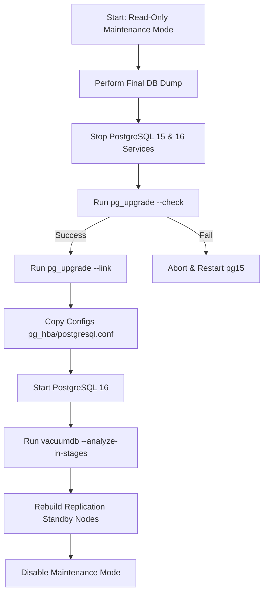
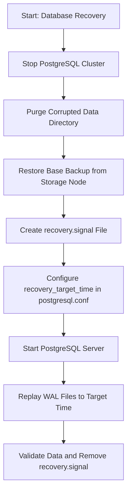

# Maintenance Plan
## ITBengal Hosting Platform
**Document Reference:** ITB-OPS-MP-v1.0.0  
**Effective Date:** July 4, 2026  
**Status:** Approved - Production Ready  

---

## 1. Document Control & Infrastructure Overview

### 1.1 Revision History
This Maintenance Plan is a living document. It governs the ongoing operational stability, security posture, and database health of the ITBengal hosting infrastructure. Reviews are scheduled semi-annually.

| Version | Date | Author | Checked By | Approved By | Description of Changes |
| :--- | :--- | :--- | :--- | :--- | :--- |
| `1.0.0` | 2026-07-04 | Lead Site Reliability Engineer | Director of Security & Compliance | VP of Engineering | Initial publication of the comprehensive production maintenance plan for self-managed VPS node topology. |

### 1.2 Purpose and Scope
This document outlines the standard operating procedures (SOPs), scripts, code blocks, schedules, and rollback strategies required to maintain the ITBengal hosting platform. The scope covers:
*   **Platform Servers:** Next.js Dashboard, Express.js API, Primary/Secondary PostgreSQL clusters, Redis/BullMQ nodes.
*   **React Hosting Nodes:** Custom Node Agents, Traefik edge routers, Docker daemon instances, build/deployment temporary files.
*   **WordPress Hosting Nodes:** MariaDB/MySQL databases, PHP-FPM daemons, Nginx ingress controllers, staging directories, local backups.
*   **Offsite Backup & Storage Nodes:** MinIO clusters, backup servers, and Openprovider DNS interface sync nodes.

---

## 2. Maintenance Window Schedules & Planning Workflows

### 2.1 Schedule Matrix
To minimize customer impact, ITBengal categorizes maintenance into three distinct tiers. All times are defined in **Bangladesh Standard Time (BST, UTC+6)**.

```mermaid
gantt
    title ITBengal Scheduled Maintenance Windows (BST)
    dateFormat  HH:mm
    axisFormat %H:%M
    section Daily
    Log & Backup Verification (Off-peak) :active, 04:00, 04:30
    section Weekly
    Node Patches & Cache Pruning (Sunday) :active, 03:00, 05:00
    section Monthly
    DB Vacuum, Reindex & SSL Audit (2nd Sun) :active, 02:00, 06:00
    section Quarterly
    DR Drills & Dependency Audits (Sat-Sun) :active, 01:00, 06:00
```



| Maintenance Tier | Recurrence | Schedule (BST) | Target Window | Maximum Allowed Downtime | Impact Level / Scope |
| :--- | :--- | :--- | :--- | :--- | :--- |
| **Tier 1: Daily** | Daily | 04:00 – 04:30 | 30 Minutes | `0 Minutes` (Zero-downtime background jobs) | None. Read-only checks. |
| **Tier 2: Weekly** | Every Sunday | 03:00 – 05:00 | 2 Hours | `0 Minutes` (Graceful container migration / rolling node reboots) | Low. Temporary build queue pauses. |
| **Tier 3: Monthly** | 2nd Sunday of month | 02:00 – 06:00 | 4 Hours | `5 Minutes` (Brief platform API connection recycling) | Medium. Brief admin dashboard access pauses. |
| **Tier 4: Quarterly** | Last Saturday of quarter | 01:00 – 06:00 | 5 Hours | `15 Minutes` (Controlled DR replica promotion drill) | High. Staged customer DNS and DB switches. |
| **Tier 5: Annual** | Annually (January) | 01:00 – 07:00 | 6 Hours | `30 Minutes` (PostgreSQL major migration, OS dist-upgrade) | High. Scheduled system maintenance page active. |

### 2.2 Scheduling Policy & Change Management
All scheduled maintenance must follow the ITBengal Change Management Procedure:
1.  **Request for Change (RFC):** Created by SRE team in Jira Service Desk 10 business days prior to scheduled maintenance (except for critical security patching SLAs).
2.  **Impact Analysis:** DevOps, Security, and Database Architects review target packages, scripts, and potential customer service interruptions.
3.  **Approval:** Requires sign-off from VP of Engineering and Lead Security Engineer 5 business days prior to execution.
4.  **Emergency Maintenance:** Triggered by zero-day security threats or hardware failures. Bypasses the 10-day RFC rule, requiring immediate approval from the on-call SRE lead and notification to VP of Engineering.

### 2.3 Customer Notifications Workflow
Notifications are sent across multiple channels according to the timeline below:

```
[T-7 Days: Email & Banner Alert] ---> [T-24 Hours: Reminder Email] ---> [T-2 Hours: Dashboard Sticky Banner] ---> [T-0: Ops Page Active]
```

*   **T-7 Days:** Email broadcast to all affected customers. Admin dashboard displays banner alert.
*   **T-24 Hours:** Final email reminder indicating the exact maintenance window and potential degradation.
*   **T-2 Hours:** High-visibility sticky banner on Admin and Customer dashboards. Status Page (status.itbengal.com) updated with "Scheduled Maintenance" event.
*   **T-0 Hours:** Maintenance begins. Real-time updates posted to Status Page every 20 minutes by the communications lead.
*   **Post-Maintenance:** "Service Restored" notification sent to Status Page, dashboards updated, and verification metrics compiled.

### 2.4 Dashboard Banner and Maintenance Page Display Logic
During scheduled maintenance that affects dashboard APIs, Traefik is configured to route traffic to a static, high-performance maintenance page hosted on an independent lightweight VPS. 

The Platform API checks an active maintenance key in Redis. If `maintenance:active` is set to `true`, the API immediately returns `503 Service Unavailable` with a structured JSON body for dashboard app consumption:

```json
{
  "status": "maintenance",
  "message": "ITBengal Platform is undergoing scheduled maintenance.",
  "estimated_completion": "2026-07-05T06:00:00+06:00",
  "status_page": "https://status.itbengal.com"
}
```

#### Traefik Middleware Configuration (`/etc/traefik/dynamic/maintenance-middleware.yml`):
```yaml
http:
  middlewares:
    platform-maintenance:
      errors:
        status:
          - "503"
        service: maintenance-static-service
        query: "/maintenance.html"

  services:
    maintenance-static-service:
      loadBalancer:
        servers:
          - url: "http://10.0.100.50:80" # Independent Static Maintenance VPS
```

#### HTML Maintenance Page Template (`/var/www/html/maintenance.html`):
```html
<!DOCTYPE html>
<html lang="en">
<head>
    <meta charset="UTF-8">
    <meta name="viewport" content="width=device-width, initial-scale=1.0">
    <title>Scheduled Maintenance - ITBengal</title>
    <style>
        :root {
            --bg-color: #0b0f19;
            --text-color: #f3f4f6;
            --accent-color: #00e5ff;
            --muted-color: #9ca3af;
            --border-color: #1e293b;
        }
        body {
            background-color: var(--bg-color);
            color: var(--text-color);
            font-family: 'Inter', system-ui, -apple-system, sans-serif;
            display: flex;
            align-items: center;
            justify-content: center;
            height: 100vh;
            margin: 0;
            overflow: hidden;
        }
        .container {
            text-align: center;
            border: 1px solid var(--border-color);
            padding: 40px;
            border-radius: 12px;
            background: rgba(15, 23, 42, 0.6);
            backdrop-filter: blur(10px);
            max-width: 500px;
            box-shadow: 0 10px 30px rgba(0, 229, 255, 0.05);
        }
        .logo {
            font-size: 28px;
            font-weight: 800;
            letter-spacing: -0.5px;
            color: var(--text-color);
            margin-bottom: 24px;
        }
        .logo span {
            color: var(--accent-color);
        }
        h1 {
            font-size: 22px;
            margin-bottom: 12px;
        }
        p {
            color: var(--muted-color);
            font-size: 14px;
            line-height: 1.6;
            margin-bottom: 24px;
        }
        .spinner {
            border: 3px solid rgba(0, 229, 255, 0.1);
            width: 36px;
            height: 36px;
            border-radius: 50%;
            border-left-color: var(--accent-color);
            animation: spin 1s linear infinite;
            margin: 0 auto 24px auto;
        }
        .btn {
            background: linear-gradient(135deg, #00b0ff, var(--accent-color));
            color: #0b0f19;
            padding: 10px 20px;
            text-decoration: none;
            border-radius: 6px;
            font-weight: 600;
            font-size: 14px;
            transition: transform 0.2s ease;
            display: inline-block;
        }
        .btn:hover {
            transform: translateY(-2px);
        }
        @keyframes spin {
            0% { transform: rotate(0deg); }
            100% { transform: rotate(360deg); }
        }
    </style>
</head>
<body>
    <div class="container">
        <div class="logo">IT<span>Bengal</span></div>
        <div class="spinner"></div>
        <h1>System Upgrades in Progress</h1>
        <p>We are currently upgrading our platform infrastructure to improve performance and security. Your hosted websites remain active; only the management dashboards and deployments are temporarily offline.</p>
        <a href="https://status.itbengal.com" target="_blank" class="btn">View Live Status</a>
    </div>
</body>
</html>
```

---

## 3. Step-by-Step Maintenance Execution Checklists

### 3.1 Daily Tasks (Execution Time: 04:00 BST)
Daily tasks focus on automated validation of backups, data consistency, replication integrity, and hardware thresholds.

#### Checklist:
1.  [ ] **Backup Integrity Validation:** Verify pg_dump and physical WAL backup files exist on the storage node.
2.  [ ] **Offsite Sync Audit:** Validate Rclone replication to external MinIO target completed with zero errors.
3.  [ ] **Database Log Scan:** Scan PostgreSQL logs for FATAL, ERROR, or PANIC lines.
4.  [ ] **PostgreSQL Replication Lag:** Query `pg_stat_replication` to ensure standby replica lag is under 10MB.
5.  [ ] **Disk Storage Verification:** Confirm no VPS node partitions exceed 80% disk capacity.
6.  [ ] **Inode Consumption:** Confirm inode usage across WordPress and React containers is under 75%.

#### Automated Daily Verification Script (`/usr/local/bin/itbengal-backup-verify.sh`):
```bash
#!/usr/bin/env bash
# ITBengal Daily Backup and Replication Integrity Verification Script
set -euo pipefail

BACKUP_DIR="/var/backups/postgres"
LOG_FILE="/var/log/itbengal/backup-verify.log"
MINIO_MOUNT="/mnt/backup-minio"
DATE_STAMP=$(date +%Y-%m-%d)
SLACK_WEBHOOK="https://hooks.slack.com/services/T00/B00/X00"

log_msg() {
    echo "$(date '+%Y-%m-%d %H:%M:%S') [INFO] - $1" | tee -a "$LOG_FILE"
}

log_err() {
    echo "$(date '+%Y-%m-%d %H:%M:%S') [ERROR] - $1" | tee -a "$LOG_FILE" >&2
    # Alert via Slack webhook
    curl -X POST -H 'Content-type: application/json' \
      --data "{\"text\":\"[CRITICAL] Daily Backup Verification Failed on $(hostname): $1\"}" \
      "$SLACK_WEBHOOK" || true
}

log_msg "Starting daily backup verification check..."

# 1. Verify Local Backup Exists and is Non-Zero
LOCAL_FILE="${BACKUP_DIR}/itbengal-db-${DATE_STAMP}.sql.gz"
if [[ ! -f "$LOCAL_FILE" ]]; then
    log_err "Local backup file $LOCAL_FILE not found."
    exit 1
fi

FILE_SIZE=$(stat -c%s "$LOCAL_FILE")
if [[ "$FILE_SIZE" -lt 104857600 ]]; then # Minimum size 100MB
    log_err "Backup size is less than 100MB ($((FILE_SIZE/1024/1024)) MB). Potential corruption."
    exit 1
fi
log_msg "Local backup file verified: $LOCAL_FILE ($((FILE_SIZE/1024/1024)) MB)"

# 2. Check MD5 Checksum Integrity
CHECKSUM_FILE="${LOCAL_FILE}.md5"
if [[ ! -f "$CHECKSUM_FILE" ]]; then
    log_err "MD5 Checksum file not found."
    exit 1
fi
cd "$BACKUP_DIR"
if ! md5sum -c "itbengal-db-${DATE_STAMP}.sql.gz.md5"; then
    log_err "MD5 validation failed for backup $LOCAL_FILE"
    exit 1
fi
log_msg "MD5 validation successful."

# 3. Verify Remote Sync with MinIO Storage Node
REMOTE_FILE="${MINIO_MOUNT}/postgres/itbengal-db-${DATE_STAMP}.sql.gz"
if [[ ! -f "$REMOTE_FILE" ]]; then
    log_err "Offsite replica of backup not found in MinIO: $REMOTE_FILE"
    exit 1
fi
log_msg "Offsite backup replica verified."

# 4. Check PostgreSQL Replication Lag
LAG_BYTES=$(psql -U postgres -t -c "SELECT pg_wal_lsn_diff(pg_current_wal_lsn(), replay_lsn) FROM pg_stat_replication;")
LAG_MB=$((LAG_BYTES / 1024 / 1024))
if [[ "$LAG_MB" -gt 10 ]]; then
    log_err "Replication lag is exceeding safety limits: ${LAG_MB}MB"
    exit 1
fi
log_msg "Replication lag checked: ${LAG_MB}MB"

log_msg "All daily verification checks completed successfully."
```

---

### 3.2 Weekly Tasks (Execution Time: Sunday 03:00 - 05:00 BST)
Weekly maintenance tasks prioritize system package inventory, minor patches, system resource sweeps, and build cache pruning.

#### Checklist:
1.  [ ] **OS Security Scan:** Run vulnerability checks on Ubuntu OS components (`apt-get update`).
2.  [ ] **Clean Staging Workspaces:** Delete orphan build directories, temporary ZIP extractions, and build files.
3.  [ ] **Docker Image & Volume Purge:** Run builder and image prune commands to free storage on React hosting nodes.
4.  [ ] **Node Agent Status Verification:** Verify agent process metrics, memory usage, and health probe returns.
5.  [ ] **Check failed log-ins:** Run an audit of failed SSH attempts (`/var/log/auth.log`).

#### Weekly Workspace & Docker Clean Script (`/usr/local/bin/itbengal-disk-sweep.sh`):
```bash
#!/usr/bin/env bash
# ITBengal Weekly Storage Pruning & Docker Cache Cleanup Script
set -euo pipefail

LOG_FILE="/var/log/itbengal/disk-sweep.log"
log() { echo "$(date '+%Y-%m-%d %H:%M:%S') $1" | tee -a "$LOG_FILE"; }

log "Starting weekly storage reclamation sweep..."

# 1. Clean Local Temp Workspaces Older than 24 Hours
TEMP_DIR="/var/lib/itbengal/workspace/temp"
if [[ -d "$TEMP_DIR" ]]; then
    log "Pruning old zip uploads and extracted repositories in $TEMP_DIR..."
    find "$TEMP_DIR" -mindepth 1 -maxdepth 1 -mmin +1440 -exec rm -rf {} \;
fi

# 2. Prune Docker Build Caches and Dangling Containers
if command -v docker &> /dev/null; then
    log "Reclaiming space from Docker cache on React hosting node..."
    # Reclaim dangling layers and unused images
    docker container prune -f
    docker image prune -a -f --filter "until=168h" # Remove images older than 7 days
    docker volume prune -f
    docker builder prune -a -f --filter "until=168h" # Reclaim docker build cache
fi

# 3. Clean System Journal Logs older than 14 days
log "Pruning journalctl logs..."
journalctl --vacuum-time=14d

# 4. Check Disk Space Post-Cleanup
FREE_SPACE=$(df -h / | awk 'NR==2 {print $5}' | sed 's/%//')
log "Storage sweep complete. Root partition disk usage is at ${FREE_SPACE}%"

if [[ "$FREE_SPACE" -gt 80 ]]; then
    log "[WARNING] Disk space remains critically high: ${FREE_SPACE}%."
fi
```

---

### 3.3 Monthly Tasks (Execution Time: 2nd Sunday 02:00 - 06:00 BST)
Monthly maintenance focuses on SSL audit validations, database engine cleanups (vacuum/index rebuilds), and structural security validation.

#### Checklist:
1.  [ ] **ACME Certificate Audits:** Scan Let's Encrypt certificates expiration timelines.
2.  [ ] **Database Vacuum & Reindexing:** Run optimization routines on PostgreSQL and MariaDB schemas.
3.  [ ] **System Capacity Analysis:** Export CPU/RAM/Disk IOPS trends from Prometheus to Grafana PDF report.
4.  [ ] **Node Agent Minor Upgrades:** Apply minor patches to the platform node agent daemon service.
5.  [ ] **Audit Log Rotation Verification:** Confirm rotation and archiving parameters of system audit trails.

#### SSL/TLS Expiration Auditing Script (`/usr/local/bin/itbengal-ssl-audit.py`):
```python
#!/usr/bin/env python3
# ITBengal Monthly SSL Certificate Validation and Auditing Tool
import ssl
import socket
import datetime
import smtplib
from email.mime.text import MIMEText

DOMAINS = ["itbengal.com", "dashboard.itbengal.com", "api.itbengal.com"]
ALERT_THRESHOLD_DAYS = 15
SMTP_SERVER = "mail.itbengal.internal"
SMTP_PORT = 587
SMTP_USER = "alerts@itbengal.com"
SMTP_PASS = "InternalSMTPPassPhraseSecured"

def check_cert_expiry(domain):
    context = ssl.create_default_context()
    with socket.create_connection((domain, 443), timeout=5) as sock:
        with context.wrap_socket(sock, server_hostname=domain) as ssock:
            cert = ssock.getpeercert()
            expire_date_str = cert['notAfter']
            expire_date = datetime.datetime.strptime(expire_date_str, "%b %d %H:%M:%S %Y %Z")
            remaining = expire_date - datetime.datetime.utcnow()
            return remaining.days, expire_date

def send_alert(domain, days_left, expiry):
    msg = MIMEText(f"CRITICAL SSL ALERT: Domain {domain} cert is expiring in {days_left} days (Date: {expiry}). ACME renewal failed.")
    msg['Subject'] = f"[SSL ALERT] {domain} Certificate Expiry Warning"
    msg['From'] = SMTP_USER
    msg['To'] = "sre-alerts@itbengal.com"
    
    try:
        with smtplib.SMTP(SMTP_SERVER, SMTP_PORT) as server:
            server.starttls()
            server.login(SMTP_USER, SMTP_PASS)
            server.send_message(msg)
            print(f"Alert email sent for {domain}")
    except Exception as e:
        print(f"Failed to send email alert: {e}")

if __name__ == "__main__":
    for domain in DOMAINS:
        try:
            days, expiry = check_cert_expiry(domain)
            print(f"Domain: {domain} | Days Remaining: {days} | Expiry: {expiry}")
            if days <= ALERT_THRESHOLD_DAYS:
                send_alert(domain, days, expiry)
        except Exception as err:
            print(f"Error checking domain {domain}: {err}")
```

---

### 3.4 Quarterly Tasks (Execution Time: Last Saturday of Quarter 01:00 - 06:00 BST)
Quarterly maintenance tests infrastructure durability through Disaster Recovery failover drills, deep software audits, and firewall validation.

#### Checklist:
1.  [ ] **Disaster Recovery Failover Drill:** Perform mock failover of primary database to standby node Chittagong-1.
2.  [ ] **Infrastructure Access Audit:** Audit authorized SSH keys in `/root/.ssh/authorized_keys` and `/home/admin/.ssh/authorized_keys` on all nodes.
3.  [ ] **Openprovider API Integration Test:** Execute end-to-end sandbox domain renewals, transfers, and sync routines.
4.  [ ] **Third-Party Dependency Audit:** Run NPM Audit on Express.js/Next.js repositories and Trivy scans on production Docker base layers.
5.  [ ] **Firewall Verification:** Audit and check UFW rules on all VPS server clusters.

---

### 3.5 Annual Tasks (Execution Time: January 01:00 - 07:00 BST)
Annual windows perform destructive migrations, OS level dist-upgrades, and architecture restructuring.

#### Checklist:
1.  [ ] **Ubuntu LTS Major System Upgrades:** Migrate production nodes to newer LTS kernel releases (e.g. 22.04 to 24.04).
2.  [ ] **PostgreSQL Major Version Upgrade:** Upgrade production database engine clusters (e.g. pg15 to pg16).
3.  [ ] **PHP Version Life-Cycle Migration:** Deprecate old PHP runtimes on WordPress nodes (upgrade PHP-FPM packages).
4.  [ ] **Audit Logging Cold-Archival:** Archive security log records older than 1 year to local storage tape or immutable cold backup drives.

---

## 4. Step-by-Step Major OS & Database Version Upgrade Playbooks

### 4.1 PostgreSQL Major Version Upgrade Playbook (e.g., PostgreSQL 15 to 16)
This playbook details the migration of the database cluster with minimal downtime using PostgreSQL `pg_upgrade` link-mode utility, avoiding data copies.



#### Step 1: Pre-Upgrade Planning and Verification
1.  Verify the source cluster version is 15 (running on port `5432`) and target postgresql 16 (newly installed packages, not initialized, config on port `5433`).
2.  Verify the target filesystem has at least 15% extra disk space for indexing.
3.  Ensure user-defined functions or custom extensions (e.g., `timescaledb`, `pg_stat_statements`, `pgcrypto`) are installed on the new PostgreSQL 16 cluster.

#### Step 2: Establish Read-Only Window
1.  Verify the Maintenance Mode is turned on via Redis flag:
    ```bash
    redis-cli -h 127.0.0.1 -p 6379 SET maintenance:active "true"
    ```
2.  Terminate existing application backend connections to ensure database transactions are locked:
    ```bash
    psql -U postgres -c "SELECT pg_terminate_backend(pid) FROM pg_stat_activity WHERE datname = 'itbengal_prod' AND pid <> pg_backend_pid();"
    ```

#### Step 3: Create Pre-Upgrade Backup
1.  Run a complete logical schema dump in a separate recovery partition:
    ```bash
    pg_dumpall -U postgres -h localhost --globals-only > /var/backups/postgres/pre-upgrade-globals.sql
    pg_dump -U postgres -h localhost -F c -b -v -f /var/backups/postgres/pre-upgrade-itbengal-prod.dump itbengal_prod
    ```

#### Step 4: Upgrade Execution Steps
1.  Stop both PostgreSQL services:
    ```bash
    sudo systemctl stop postgresql@15-main
    sudo systemctl stop postgresql@16-main
    ```
2.  Run the verification check command under the `postgres` user:
    ```bash
    sudo -i -u postgres /usr/lib/postgresql/16/bin/pg_upgrade \
      --old-datadir /var/lib/postgresql/15/main \
      --new-datadir /var/lib/postgresql/16/main \
      --old-bindir /usr/lib/postgresql/15/bin \
      --new-bindir /usr/lib/postgresql/16/bin \
      --old-options '-c config_file=/etc/postgresql/15/main/postgresql.conf' \
      --new-options '-c config_file=/etc/postgresql/16/main/postgresql.conf' \
      --check
    ```
    *Ensure output displays `*Clusters are compatible*` before proceeding.*
3.  Execute the migration using `--link` mode (shares storage blocks via hard links, reducing migration time to seconds):
    ```bash
    sudo -i -u postgres /usr/lib/postgresql/16/bin/pg_upgrade \
      --old-datadir /var/lib/postgresql/15/main \
      --new-datadir /var/lib/postgresql/16/main \
      --old-bindir /usr/lib/postgresql/15/bin \
      --new-bindir /usr/lib/postgresql/16/bin \
      --old-options '-c config_file=/etc/postgresql/15/main/postgresql.conf' \
      --new-options '-c config_file=/etc/postgresql/16/main/postgresql.conf' \
      --link
    ```

#### Step 5: Update Configuration Files
1.  Copy access configurations from version 15 to version 16:
    ```bash
    cp /etc/postgresql/15/main/pg_hba.conf /etc/postgresql/16/main/pg_hba.conf
    ```
2.  Merge performance optimizations in `/etc/postgresql/16/main/postgresql.conf`. Ensure port is updated back to `5432`.

#### Step 6: Post-Upgrade Verification
1.  Start the new database version:
    ```bash
    sudo systemctl start postgresql@16-main
    ```
2.  Run the optimizer statistics generation script immediately (critical for avoiding poor execution plans post-upgrade):
    ```bash
    sudo -i -u postgres /usr/lib/postgresql/16/bin/vacuumdb --all --analyze-in-stages
    ```
3.  Check connection access via the dashboard API test suite:
    ```bash
    npm run test:db-connection --prefix /var/www/itbengal-api
    ```
4.  Remove the legacy postgresql data directory only after 7 days of verified system stability:
    ```bash
    sudo -i -u postgres ./delete_old_cluster.sh
    ```

#### Step 7: Replication Re-linking
Since `--link` breaks replication standby targets due to WAL timeline deviations, the replica standby VPS nodes must be re-seeded.
1.  On the **Standby VPS Node** (Chittagong-1):
    ```bash
    sudo systemctl stop postgresql@15-main
    sudo rm -rf /var/lib/postgresql/16/main/*
    sudo -i -u postgres pg_basebackup -h 10.0.100.10 -D /var/lib/postgresql/16/main/ -U replication_user -P -R --wal-method=stream
    sudo systemctl start postgresql@16-main
    ```

---

### 4.2 Server OS Security Patching Playbook (Ubuntu LTS)
Operating system patches are applied using rolling updates to ensure customer websites hosted on the target node remain accessible.

```
[Target Production Server] ---> [Set status to DRAINING in Platform API] ---> [Traefik routes traffic to standby servers] ---> [Run apt upgrade & Reboot] ---> [Validate Health Check API] ---> [Set status to ACTIVE]
```

#### Step 1: Traffic Draining on Target Node
Before updating the server hosting React or WordPress containers, drain the node using the Platform CLI:
```bash
# On Platform Server
itbengal-admin node drain node-react-03.itbengal.com
```
*This command communicates with the Traefik load balancer to stop routing new visitor HTTP connections to container instances on `node-react-03` and shifts routing to sibling nodes.*

#### Step 2: System Security Patch Application
Log into target VPS node via SSH:
```bash
# Update local package definitions
sudo apt-get update

# Install all critical security updates and packages non-interactively
sudo DEBIAN_FRONTEND=noninteractive apt-get -y \
  -o Dpkg::Options::="--force-confdef" \
  -o Dpkg::Options::="--force-confold" \
  dist-upgrade
```

#### Step 3: System Reboot (If Kernel Patches are applied)
Check if reboot is required:
```bash
if [ -f /var/run/reboot-required ]; then
    echo "Reboot required by system kernel updates. Rebooting node..."
    sudo reboot
fi
```

#### Step 4: Verification Check
After system reboot completes, verify service daemons:
1.  Check Docker daemon status:
    ```bash
    systemctl is-active docker
    ```
2.  Verify Node Agent daemon health:
    ```bash
    curl -s http://localhost:9000/health | grep '"status":"UP"'
    ```
3.  Re-enable the node for traffic routing:
    ```bash
    itbengal-admin node activate node-react-03.itbengal.com
    ```

---

### 4.3 Node Agent Version Upgrade Playbook
The ITBengal Node Agent runs as a native systemd daemon on each hosting node, communicating deployments and metrics to the Platform Server.

#### Systemd Unit File Configuration (`/etc/systemd/system/itbengal-agent.service`):
```ini
[Unit]
Description=ITBengal Hosting Node Agent Daemon
After=network.target docker.service
Requires=docker.service

[Service]
Type=simple
User=root
WorkingDirectory=/var/lib/itbengal/agent
ExecStart=/var/lib/itbengal/agent/bin/itbengal-agent start
Restart=always
RestartSec=5
Environment=NODE_ENV=production
LimitNOFILE=65535

[Install]
WantedBy=multi-user.target
```

#### Node Agent Upgrade Execution Script (`/usr/local/bin/itbengal-agent-upgrade.sh`):
```bash
#!/usr/bin/env bash
# ITBengal Node Agent Automated Upgrade Script
set -euo pipefail

TARGET_VERSION="${1:-latest}"
AGENT_DIR="/var/lib/itbengal/agent"
BACKUP_DIR="/var/lib/itbengal/backup/agent-releases"
LOG_FILE="/var/log/itbengal/agent-upgrade.log"

log() { echo "$(date '+%Y-%m-%d %H:%M:%S') - $1" | tee -a "$LOG_FILE"; }

log "Initiating agent upgrade task to version: $TARGET_VERSION"

# 1. Create backup of current running binary
mkdir -p "$BACKUP_DIR"
CURRENT_VERSION=$("$AGENT_DIR"/bin/itbengal-agent --version || echo "unknown")
log "Current agent version is: $CURRENT_VERSION"

if [[ -f "$AGENT_DIR/bin/itbengal-agent" ]]; then
    cp "$AGENT_DIR/bin/itbengal-agent" "$BACKUP_DIR/itbengal-agent-$CURRENT_VERSION"
fi

# 2. Retrieve newer version package from Platform Registry
log "Downloading release package..."
wget -q -O "$AGENT_DIR/bin/itbengal-agent.new" \
  "https://registry.itbengal.internal/releases/agent/itbengal-agent-$TARGET_VERSION"

chmod +x "$AGENT_DIR/bin/itbengal-agent.new"

# 3. Perform Graceful Stop and Atomic Binary Replacement
log "Stopping itbengal-agent systemd service..."
sudo systemctl stop itbengal-agent.service

mv "$AGENT_DIR/bin/itbengal-agent.new" "$AGENT_DIR/bin/itbengal-agent"

# 4. Apply Database/Schema Updates (if local SQLite agent state DB exists)
if [[ -f "$AGENT_DIR/db/agent.db" ]]; then
    log "Applying local agent schema migrations..."
    "$AGENT_DIR"/bin/itbengal-agent migrate --db "$AGENT_DIR/db/agent.db"
fi

# 5. Start and Validate Health Status
log "Starting itbengal-agent service..."
sudo systemctl start itbengal-agent.service

# Allow 3 seconds for service boot
sleep 3

SERVICE_STATUS=$(systemctl is-active itbengal-agent.service)
if [[ "$SERVICE_STATUS" != "active" ]]; then
    log "Service failed to start. Rolling back to version $CURRENT_VERSION"
    mv "$BACKUP_DIR/itbengal-agent-$CURRENT_VERSION" "$AGENT_DIR/bin/itbengal-agent"
    sudo systemctl start itbengal-agent.service
    exit 1
fi

AGENT_STATUS_CODE=$(curl -s -o /dev/null -w "%{http_code}" http://localhost:9000/health)
if [[ "$AGENT_STATUS_CODE" -ne 200 ]]; then
    log "Agent health API check failed (Status: $AGENT_STATUS_CODE). Rolling back."
    mv "$BACKUP_DIR/itbengal-agent-$CURRENT_VERSION" "$AGENT_DIR/bin/itbengal-agent"
    sudo systemctl restart itbengal-agent.service
    exit 1
fi

log "Agent upgrade successfully completed and validated."
```

---

## 5. Dependency Management & Security Patching SLAs

ITBengal enforces strict security boundaries on vulnerabilities originating in platform runtimes, framework packages, Docker environments, and open-source system libraries.

### 5.1 CVSS Vulnerability & SLA Matrix
Patches for security vulnerabilities discovered within production scopes are scheduled according to CVSS metrics:

| Vulnerability Severity | CVSS v3.0 Score | Maximum Remediation SLA | Actions & Containment Guidelines |
| :--- | :--- | :--- | :--- |
| **Critical** | `9.0 – 10.0` | **24 Hours** | Immediate emergency patch deployment. Exceeds standard change control window; requires SRE escalation. Virtual patching via Traefik WAF implemented within 4 hours. |
| **High** | `7.0 – 8.9` | **72 Hours** | Apply fix to staging server. Verify performance degradation, then merge into production during off-peak windows. |
| **Medium** | `4.0 – 6.9` | **1 Week** | Standard RFC ticket. Test package update paths inside staging and apply during weekly Sunday maintenance window. |
| **Low** | `0.1 – 3.9` | **30 Days** | Bundle with monthly maintenance packages. Update dependencies inside minor release updates. |

### 5.2 Security Scanning Toolchain Integration
ITBengal implements static and dynamic scanning into continuous delivery pipelines:
*   **Application Scope:** `npm audit` is executed on every developer code commit in GitLab/GitHub CI. Builds fail automatically if any dependency contains a `Critical` vulnerability with an available patch.
*   **Container Scope:** **Trivy** scans built Docker image structures daily, looking for base image vulnerabilities inside Alpine/Ubuntu bases.
*   **Infrastructure Scope:** **Grype** checks packages installed across all VPS nodes, reporting anomalies directly to Prometheus Alertmanager.

#### Automated CI Dependency Scanning Pipeline (`.github/workflows/security-scan.yml`):
```yaml
name: Security Scan & Dependency Audit

on:
  push:
    branches: [ main, develop ]
  schedule:
    - cron: '0 0 * * *' # Run daily at midnight

jobs:
  npm-audit:
    name: NPM Audit Dependency Scan
    runs-on: ubuntu-latest
    steps:
      - name: Checkout Code
        uses: actions/checkout@v3

      - name: Install Node.js
        uses: actions/setup-node@v3
        with:
          node-version: '20'
          cache: 'npm'

      - name: Run NPM Security Audit
        run: |
          npm audit --audit-level=high

  trivy-scan:
    name: Container Vulnerability Scan
    runs-on: ubuntu-latest
    needs: npm-audit
    steps:
      - name: Checkout Code
        uses: actions/checkout@v3

      - name: Build Local App Image
        run: |
          docker build -t itbengal/platform-api:${{ github.sha }} -f docker/production/Dockerfile .

      - name: Run Trivy Vulnerability Scanner
        uses: aquasecurity/trivy-action@master
        with:
          image-ref: 'itbengal/platform-api:${{ github.sha }}'
          format: 'table'
          exit-code: '1' # Fail build if HIGH/CRITICAL vulnerabilities exist
          ignore-unfixed: true
          vuln-type: 'os,library'
          severity: 'CRITICAL,HIGH'
```

### 5.3 Virtual Patching & Mitigation Policies
If a zero-day vulnerability (CVSS >= 9.0) is identified in npm or system packages but no upstream fix or secure version exists, the SRE team implements virtual patching using the edge proxy:
1.  **Traefik / Nginx WAF Filter Rules:** Deploy instant regex blocking rules at the web application firewall (WAF) tier to reject exploitation patterns (e.g. blocking log4j JNDI patterns or SQL injection attempts).
2.  **Runtime Environment Isolation:** Temporarily isolate affected Docker containers from network pathways using custom Docker bridge networks that have restricted egress rules.

---

## 6. Database Maintenance Routines & Commands

Ensuring optimal execution performance for PostgreSQL requires routine database maintenance. These queries and scripts prevent indexing bloat, manage storage capacity, and clean temporary session state.

### 6.1 Database Table & Index Bloat Diagnostics
Database bloat occurs when row updates delete data but do not release disk pages back to the operating system. Run the query below monthly to prioritize tables for target compaction:

```sql
-- ITBengal SQL Index and Table Bloat Detection Query
SELECT
  schemaname,
  relname AS table_name,
  pg_size_pretty(pg_relation_size(relid)) AS table_size,
  pg_size_pretty(calc_bloat) AS estimated_bloat,
  round(100 * calc_bloat / pg_relation_size(relid), 2) AS bloat_ratio
FROM (
  SELECT
    schemaname,
    relname,
    relid,
    (pg_relation_size(relid) - (reltuples * width)::bigint) AS calc_bloat
  FROM (
    SELECT
      nspname AS schemaname,
      relname,
      c.oid AS relid,
      reltuples,
      COALESCE(avg_width, 8) AS width
    FROM pg_class c
    JOIN pg_namespace n ON n.oid = c.relnamespace
    LEFT JOIN (
      SELECT attrelid, sum(attlen) AS avg_width
      FROM pg_attribute
      WHERE attnum > 0 AND NOT attisdropped
      GROUP BY attrelid
    ) s ON s.attrelid = c.oid
    WHERE relkind = 'r' AND reltuples > 0
  ) sub
) main
WHERE calc_bloat > 0 AND pg_relation_size(relid) > 10485760
ORDER BY calc_bloat DESC;
```

---

### 6.2 VACUUM & ANALYZE SQL Execution Commands
Execute standard database cleaning tasks to update compiler statistics and clear dead rows:
```sql
-- Verbose vacuuming of the entire database to reclaim deleted space and output structural log lines
VACUUM (VERBOSE, ANALYZE);
```
*Note: Standard `VACUUM` can run concurrently with production reads and writes. Do **NOT** run `VACUUM FULL` during operational production hours, as it locks the database tables entirely, blocking user dashboards.*

---

### 6.3 Concurrent Reindexing Playbook
Reindexing rebuilds bloated indexes to restore search speed. Always use the `CONCURRENTLY` parameter to avoid lock bottlenecks:

```sql
-- Rebuild specific target indexes concurrently without locking write transactions
REINDEX INDEX CONCURRENTLY idx_users_email;
REINDEX INDEX CONCURRENTLY idx_projects_owner;
```

For rebuilding an entire table's indexes without halting API operations:
```sql
REINDEX TABLE CONCURRENTLY tbl_deployments;
```

---

### 6.4 Audit Log Partitioning and Session Pruning Routine
The ITBengal platform logs all user activities to `tbl_audit_logs` and session data to `tbl_user_sessions`. To prevent these tables from growing indefinitely, a monthly clean removes obsolete entries.

#### SQL Pruning Script (`/usr/local/bin/itbengal-db-prune.sql`):
```sql
-- ITBengal Database Session and Audit Logs Pruning Script
BEGIN;

-- 1. Create a cold archive dump file of audit records older than 90 days before deletion
-- This runs on the host server via: pg_dump -d itbengal_prod -t 'tbl_audit_logs' --data-only --where="created_at < NOW() - INTERVAL '90 days'"

-- 2. Prune old system events and notifications
DELETE FROM tbl_notifications 
WHERE read_at IS NOT NULL AND created_at < NOW() - INTERVAL '30 days';

-- 3. Prune expired JWT session data
DELETE FROM tbl_user_sessions 
WHERE expires_at < NOW();

-- 4. Prune audit trail entries older than 90 days
DELETE FROM tbl_audit_logs 
WHERE created_at < NOW() - INTERVAL '90 days';

COMMIT;

-- 5. Run analyze to update statistics planner
ANALYZE tbl_notifications;
ANALYZE tbl_user_sessions;
ANALYZE tbl_audit_logs;
```

#### Cron Schedule Configuration (`/etc/cron.d/itbengal-db-maintenance`):
```cron
# Run monthly database pruning and analysis at 02:30 BST on the 2nd Sunday of the month
30 02 8-14 * * postgres psql -d itbengal_prod -f /usr/local/bin/itbengal-db-prune.sql >> /var/log/postgresql/cron-db-prune.log 2>&1
```

---

## 7. Communication Templates & Outage Notification Blueprints

Clear notifications during scheduled outages reduce technical support ticket volume. The following templates must be used for public communications.

### 7.1 Pre-Outage Warning Email (T-7 Days, T-24 Hours)
```markdown
Subject: [Scheduled Maintenance] ITBengal Platform Upgrades - {Start_Date}

Dear ITBengal Customer,

To ensure the continued performance, stability, and security of our hosting 
infrastructure, we have scheduled a system upgrade.

Maintenance Window Details:
- Start Time: {Start_Time} BST (Bangladesh Standard Time)
- End Time: {End_Time} BST
- Estimated Duration: {Duration_Hours} Hours

Impact Assessment:
- Customer Dashboards (Dashboard access and API actions): Will be offline during the window.
- Site Deployments (Vite/React build pipelines & Git triggers): Paused.
- Live Websites (Your active React containers & WordPress sites): NOT AFFECTED. Traffic will continue routing normally.

If you have any questions or require assistance during this period, please 
contact our support team at support@itbengal.com or monitor our live status page.

Live Infrastructure Status: https://status.itbengal.com

Sincerely,
ITBengal Operations Team
Dhaka, Bangladesh
```

---

### 7.2 Maintenance Impending Alert (T-2 Hours)
```markdown
Subject: REMINDER: Scheduled Maintenance Starting in 2 Hours

This is a reminder that scheduled platform maintenance will begin in 2 hours, 
at {Start_Time} BST. 

Dashboard access and git build systems will be temporarily unavailable. 
Live customer sites will remain online. 

Track live progress at: https://status.itbengal.com
```

---

### 7.3 Maintenance Completion & Verification Notice
```markdown
Subject: [RESOLVED] Scheduled Maintenance Completed Successfully

Dear ITBengal Customer,

We are pleased to inform you that our scheduled maintenance has been completed.
All platform APIs, developer dashboards, and Git deployment pipelines are 
fully operational.

Key Improvements Completed:
- Security patches applied to infrastructure nodes.
- Database index optimization to improve search speeds.
- Platform Node Agent performance updates.

We appreciate your patience. If you experience any issues, please open a support 
ticket or email us at support@itbengal.com.

Live Infrastructure Status: https://status.itbengal.com

Sincerely,
ITBengal Operations Team
```

---

### 7.4 Unplanned Emergency Maintenance / Outage Notice
```markdown
Subject: [URGENT] Emergency Platform Maintenance - ITBengal

Dear ITBengal Customer,

Our automated monitoring systems detected a performance anomaly on one of our 
hosting nodes. To prevent data corruption, we are initiating emergency 
maintenance immediately.

Service Impact:
- Affected Node: {Node_ID} (WordPress/React Node)
- Status: Databases and sites on this node are temporarily offline.
- Restoring Pipeline: Our SRE team is actively executing recovery runbooks.

Estimated Resolution Time: {Duration} Minutes

We apologize for this unexpected interruption. We are working to resolve the issue 
as quickly as possible.

Track real-time progress: https://status.itbengal.com

Sincerely,
ITBengal Operations Team
```

---

### 7.5 Maintenance Rollback & Postponement Incident Notice
```markdown
Subject: [UPDATE] Platform Maintenance Postponed - ITBengal

Dear ITBengal Customer,

During today's scheduled maintenance, our validation suite identified a 
vulnerability in our target release components.

To protect system integrity, we executed our rollback plan and restored 
all services to their previous stable versions. 

Current Platform Status:
- All services are fully operational.
- No system data was lost during the rollback.
- The scheduled upgrade will be rescheduled for a future date.

We apologize for any inconvenience. Please reach out if you have any questions.

Infrastructure Status: https://status.itbengal.com

Sincerely,
ITBengal Operations Team
```

---

## 8. Rollback, Contingency, and Disaster Recovery Playbooks

If a maintenance script, database upgrade, or OS package installation fails during execution, SRE engineers must evaluate system states against the Rollback Trigger Matrix.

### 8.1 Rollback Trigger Decision Matrix
Execute a rollback if any of the following metrics are violated:

| Impacted Service Area | Failure Metric / Threshold | Verification Command | Decision Window |
| :--- | :--- | :--- | :--- |
| **API Connectivity** | Platform REST API returns HTTP `5xx` error code for > 3 minutes. | `curl -f http://api.itbengal.internal/health` | T + 10 Minutes |
| **Database Corruption** | Master node refuses connections; database engine crashes with memory page errors. | `tail -n 50 /var/log/postgresql/postgresql-16-main.log` | T + 5 Minutes |
| **Node Deployment Engine** | React Docker container creations fail with agent timeout errors. | `docker ps -a` / `journalctl -u itbengal-agent` | T + 15 Minutes |
| **Network Core** | DNS query resolution failures on Openprovider API routing mappings. | `dig @ns1.itbengal.com admin.itbengal.com` | T + 5 Minutes |

---

### 8.2 Database Corruption Recovery: Point-in-Time Recovery (PITR)
If database tables become corrupted during maintenance and replication targets fail, the primary cluster must be restored to its last known healthy state before the maintenance window using PITR.



#### Step 1: Stop the Database Engine
```bash
sudo systemctl stop postgresql@16-main
```

#### Step 2: Clear Corrupted Data Directory
```bash
# Verify directory paths before executing destructive commands
rm -rf /var/lib/postgresql/16/main/*
```

#### Step 3: Restore Database Base Backup
Pull the backup copy taken before the maintenance window from the local NAS or MinIO storage server:
```bash
# Retrieve backup from the S3/MinIO endpoint using rclone
rclone copy minio:postgres/itbengal-db-2026-07-04.tar.gz /tmp/

# Extract the base backup into the target data directory
tar -xf /tmp/itbengal-db-2026-07-04.tar.gz -C /var/lib/postgresql/16/main/

# Fix ownership rights
chown -R postgres:postgres /var/lib/postgresql/16/main/
```

#### Step 4: Write Recovery Signal Configuration
1.  Create a blank recovery indicator file in the data folder. This tells the database to boot in recovery mode:
    ```bash
    sudo -u postgres touch /var/lib/postgresql/16/main/recovery.signal
    ```
2.  Add target time parameters to `/etc/postgresql/16/main/postgresql.conf`:
    ```ini
    # Target date and time just prior to the start of the failed maintenance event
    recovery_target_time = '2026-07-04 01:59:00 BST'
    recovery_target_action = 'promote'
    restore_command = 'cp /var/lib/postgresql/wal_archive/%f %p'
    ```

#### Step 5: Execute Replay and Startup
1.  Start the database engine. It will read WAL files from the archive and replay write transactions until it reaches the `recovery_target_time`:
    ```bash
    sudo systemctl start postgresql@16-main
    ```
2.  Monitor recovery log lines:
    ```bash
    tail -f /var/log/postgresql/postgresql-16-main.log
    ```
    *Ensure log prints `recovery stopping at commit time...` and `restored log file...` without errors.*
3.  Connect to the database, verify table states, and confirm consistency.

---

### 8.3 React Hosting Node Agent & Docker Compose Rollback Runbook
If an upgrade to a React hosting node agent breaks container deployments, execute the following commands to revert:

```bash
# 1. Access the target node and stop the broken service daemon
sudo systemctl stop itbengal-agent.service

# 2. Restore previous version binary from local backup directory
cd /var/lib/itbengal/backup/agent-releases
LATEST_STABLE_VERSION=$(ls -t | head -n 1)
cp "$LATEST_STABLE_VERSION" /var/lib/itbengal/agent/bin/itbengal-agent

# 3. Revert Traefik configuration files to previous backup snapshot
cp /etc/traefik/dynamic/traefik.yml.bak /etc/traefik/dynamic/traefik.yml

# 4. Restart Docker container applications using old configuration files
cd /var/lib/itbengal/agent/docker
docker compose -f docker-compose.yml down
docker compose -f docker-compose.yml.bak up -d

# 5. Start the Node Agent service daemon
sudo systemctl start itbengal-agent.service

# 6. Verify node health
curl -s http://localhost:9000/health
```

---

### 8.4 Traffic Routing Failover Runbook (DNS Redirection)
If a primary VPS hosting node goes offline during maintenance, traffic must be redirected to secondary failover nodes using the Openprovider nameservers API script.

#### Openprovider Failover Update Script (`/usr/local/bin/itbengal-dns-failover.sh`):
```bash
#!/usr/bin/env bash
# ITBengal Emergency DNS Failover Script via Openprovider API
set -euo pipefail

OPENPROVIDER_API_URL="https://api.openprovider.eu/v1beta"
API_TOKEN="SecretOpenproviderAPIKeyTokenGeneratedInVault"
DOMAIN="itbengal.com"
FAILOVER_IP="10.0.200.20" # Secondary Host Node (Chittagong-1)

log_msg() { echo "$(date '+%Y-%m-%d %H:%M:%S') [DNS-FAILOVER] - $1"; }

log_msg "Initiating emergency DNS failover for *.$DOMAIN to target IP $FAILOVER_IP..."

# Update A Record for target hosting node via API
PAYLOAD=$(cat <<EOF
{
  "domain": "$DOMAIN",
  "dns_records": [
    {
      "type": "A",
      "name": "*.apps",
      "value": "$FAILOVER_IP",
      "ttl": 120
    },
    {
      "type": "A",
      "name": "dashboard",
      "value": "$FAILOVER_IP",
      "ttl": 120
    }
  ]
}
EOF
)

RESPONSE=$(curl -s -X POST \
  -H "Authorization: Bearer $API_TOKEN" \
  -H "Content-Type: application/json" \
  -d "$PAYLOAD" \
  "$OPENPROVIDER_API_URL/dns/update-records")

if echo "$RESPONSE" | grep -q '"success":true'; then
    log_msg "DNS records successfully updated to point to backup host IP: $FAILOVER_IP"
else
    log_msg "ERROR: Failed to update Openprovider records. Response: $RESPONSE"
    exit 1
fi
```

---

## 9. System Verification Checklist (Post-Maintenance)

Before declaring maintenance completed and re-enabling notifications, the SRE team must execute the following checks on the platform dashboard:

- [ ] **Next.js Dashboard Access:** Login via authentication flow, verify dashboard displays projects.
- [ ] **Docker Engine Health:** Run `docker info` to verify resources are unconstrained.
- [ ] **API Call Test:** Verify API endpoints respond within the 200ms latency SLA.
- [ ] **Redis Connection Status:** Verify memory utilization and active worker queue connectivity.
- [ ] **Cron Execution Verification:** Verify that periodic backups and log rotation jobs are active in crontab.
- [ ] **WordPress MariaDB Replication:** Run `show slave status\G` on databases to verify slave synchronization status.
- [ ] **External Network Availability:** Query global DNS systems to verify records resolve correctly.
- [ ] **Status Page Update:** Complete maintenance event on status.itbengal.com with final post-mortem summaries.
