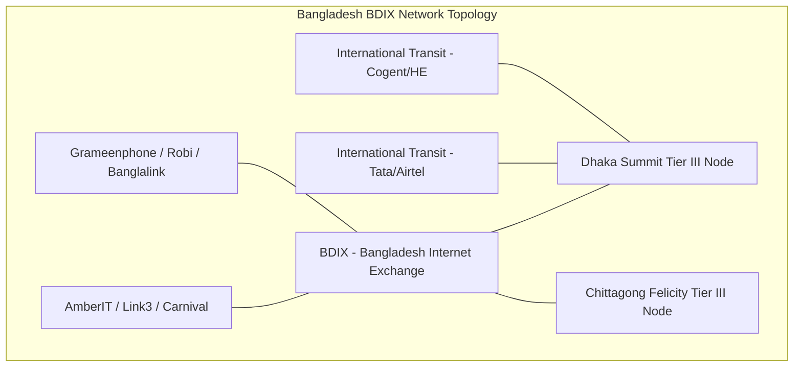
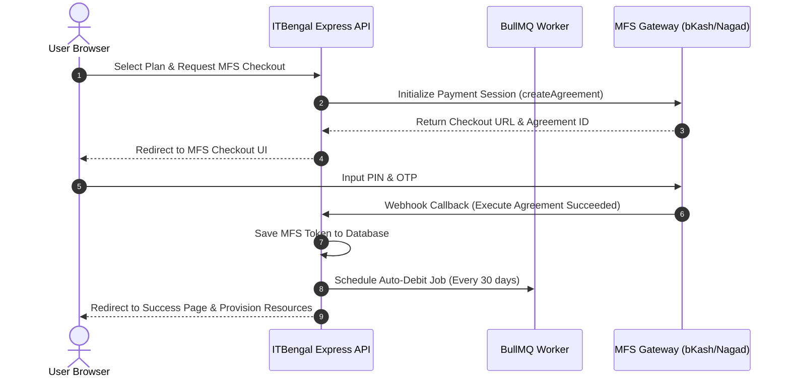
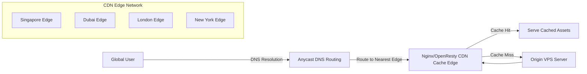
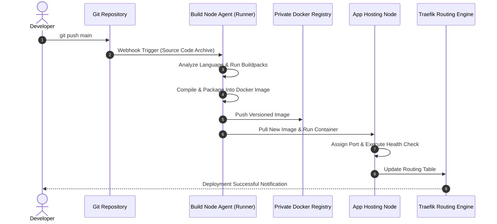

# ITBengal — Future Expansion Plan

| Field          | Value                                                         |
|----------------|---------------------------------------------------------------|
| **Document**   | 29 — Future Expansion Plan                                    |
| **Version**    | 1.0                                                           |
| **Date**       | 2026-07-04                                                    |
| **Status**     | Approved                                                      |
| **Classification** | Internal — Strategic Roadmap & Engineering Spec            |

### Authors

| Role                      | Responsibility                                |
|---------------------------|-----------------------------------------------|
| Senior Product Manager    | Product Roadmap & Geographic Expansion Strategy|
| Senior Software Architect | API Platform, Framework Engines & DBaaS Architecture |
| Senior Cloud Architect    | Multi-Region Deployments & CDN Caching Topology |
| Senior DevOps Engineer    | CLI, VS Code Extension, GitHub Actions, Sandbox Runner |
| Senior Security Engineer  | Enterprise SSO & Rate Limiting Mechanics      |
| Senior Database Architect | Managed Databases & Ceph Storage Topology     |

---

## Table of Contents

1. [Multi-Year Geographic Rollout Roadmap](#1-multi-year-geographic-rollout-roadmap)
   - 1.1 [Phase 1: Bangladesh Dominance (Year 1)](#11-phase-1-bangladesh-dominance-year-1)
     - 1.1.1 [Infrastructure Deployments (Dhaka & Chittagong)](#111-infrastructure-deployments-dhaka--chittagong)
     - 1.1.2 [MFS Deep Integration & Tokenization](#112-mfs-deep-integration--tokenization)
     - 1.1.3 [Strategic Partnerships & Outreach](#113-strategic-partnerships--outreach)
     - 1.1.4 [Localized Support Center & Operations](#114-localized-support-center--operations)
   - 1.2 [Phase 2: South Asia Expansion (Year 2)](#12-phase-2-south-asia-expansion-year-2)
     - 1.2.1 [Regional Node Deployments](#121-regional-node-deployments)
     - 1.2.2 [Regional Payment Gateways & Ledger Schemas](#122-regional-payment-gateways--ledger-schemas)
     - 1.2.3 [Compliance, Security & Data Sovereignty](#123-compliance-security--data-sovereignty)
   - 1.3 [Phase 3: International & Global Expansion (Year 3+)](#13-phase-3-international--global-expansion-year-3)
     - 1.3.1 [Global Datacenter Hub Deployments](#131-global-datacenter-hub-deployments)
     - 1.3.2 [Anycast DNS & Geo-Distributed CDN Edge Caching](#132-anycast-dns--geo-distributed-cdn-edge-caching)
     - 1.3.3 [DDoS Mitigation & Edge Security WAF](#133-ddos-mitigation--edge-security-waf)
2. [New Hosting & Database Products Rollout](#2-new-hosting--database-products-rollout)
   - 2.1 [Framework Engines Extension](#21-framework-engines-extension)
     - 2.1.1 [Cloud Native Buildpack Integration Specs](#211-cloud-native-buildpack-integration-specs)
     - 2.1.2 [Runtime Process Managers & Dynamically Bound Ingress Ports](#212-runtime-process-managers--dynamically-bound-ingress-ports)
     - 2.1.3 [Process Level Isolation & Security Sandboxing](#213-process-level-isolation--security-sandboxing)
   - 2.2 [Managed Database Products (DBaaS)](#22-managed-database-products-dbaas)
     - 2.2.1 [PostgreSQL High Availability Patroni Setup](#221-postgresql-high-availability-patroni-setup)
     - 2.2.2 [Redis Sentinel Clustering & MariaDB Galera Architecture](#222-redis-sentinel-clustering--mariadb-galera-architecture)
     - 2.2.3 [Point-in-Time Recovery (PITR) & Write-Ahead Log (WAL) Streaming](#223-point-in-time-recovery-pitr--write-ahead-log-wal-streaming)
   - 2.3 [Object Storage API & Custom CDN Edge Networks](#23-object-storage-api--custom-cdn-edge-networks)
     - 2.3.1 [Ceph & MinIO S3-Compatible Storage Clusters](#231-ceph--minio-s3-compatible-storage-clusters)
     - 2.3.2 [OpenResty dynamic Lua Cache Engines & Dynamic Handshakes](#232-openresty-dynamic-lua-cache-engines--dynamic-handshakes)
3. [Developer Experience (DX) Enhancements](#3-developer-experience-dx-enhancements)
   - 3.1 [CLI Tool Specification (`itb-cli`)](#31-cli-tool-specification-itb-cli)
     - 3.1.1 [Shell Configuration & Authentication PKCE Profile](#311-shell-configuration--authentication-pkce-profile)
     - 3.1.2 [Command Line Execution Specs & Shell Output Formats](#312-command-line-execution-specs--shell-output-formats)
     - 3.1.3 [CLI Command Output JSON Schemas for Automation Pipelines](#313-cli-command-output-json-schemas-for-automation-pipelines)
   - 3.2 [Integrated VS Code Extension](#32-integrated-vs-code-extension)
   - 3.3 [Custom GitHub Actions Integration](#33-custom-github-actions-integration)
   - 3.4 [Local Sandbox Runner (`itb sandbox`)](#34-local-sandbox-runner-itb-sandbox)
4. [Public API Platform & SDKs](#4-public-api-platform--sdks)
   - 4.1 [Public API OpenAPI 3.0 Endpoint Specification](#41-public-api-openapi-30-endpoint-specification)
   - 4.2 [Developer Portal & Webhook Delivery Engine](#42-developer-portal--webhook-delivery-engine)
   - 4.3 [Rate Limiting Tiers & Abuse Prevention](#43-rate-limiting-tiers--abuse-prevention)
   - 4.4 [SDK Client Libraries & Implementation Patterns](#44-sdk-client-libraries--implementation-patterns)
5. [Enterprise & White-Label Hosting Portal](#5-enterprise--white-label-hosting-portal)
   - 5.1 [Reseller & White-Label Program Architecture](#51-reseller--white-label-program-architecture)
   - 5.2 [Customer Domain Routing Overrides & Wildcard SSL](#52-customer-domain-routing-overrides--wildcard-ssl)
   - 5.3 [Customizable White-Label Dashboard & Integrations](#53-customizable-white-label-dashboard--integrations)
   - 5.4 [Enterprise Single Sign-On (SSO)](#54-enterprise-single-sign-on-sso)
6. [Hiring Plan & Infrastructure Projections](#6-hiring-plan-infrastructure-projections)
   - 6.1 [Core Hiring Matrices](#61-core-hiring-matrices)
   - 6.2 [Infrastructure Capacity & Scaling Forecasts](#62-infrastructure-capacity--scaling-forecasts)

---

## 1. Multi-Year Geographic Rollout Roadmap

ITBengal will scale its footprint from a domestic market leader to a globally distributed cloud hosting provider. This geographic scaling is divided into three multi-year phases, detailing infrastructure topology, currency, payment routing, and regional compliance.

### 1.1 Phase 1: Bangladesh Dominance (Year 1)

The objective of Year 1 is to establish absolute dominance in Bangladesh by offering low-latency VPS hosting and deep integration with native payment networks, combined with high-touch local support.



#### 1.1.1 Infrastructure Deployments (Dhaka & Chittagong)
- **Dhaka Hub:** Deployed in the Summit Communications Tier III Datacenter. Operating 6 rack deployments comprising AMD EPYC bare-metal hypervisors. Peered directly with the Bangladesh Internet Exchange (BDIX).
- **Chittagong Hub:** Deployed in the Felicity IDC facility. Serving as a secondary availability zone and hot-standby node.
- **Network Parameters:** Low-latency BDIX routing ensures that domestic user traffic bypasses international undersea cable routes, delivering round-trip times (RTT) under 10ms nationwide (3-5ms in Dhaka city, 8-12ms in Chittagong, and under 20ms in remote districts).
- **BGP Peering:** The edge routing layer uses BIRD (BGP Routing Daemon) on Ubuntu servers. Peering sessions are established directly with major domestic ISPs (AmberIT, Link3, Carnival, Dotlines) and mobile networks over BDIX, ensuring dynamic path selection.

#### 1.1.2 MFS Deep Integration & Tokenization
To facilitate seamless payments, ITBengal bypasses standard credit card gateways to interface directly with local MFS providers via tokenized payment APIs.



- **bKash Tokenized API Integration Details:**
  - **Authentication Exchange:** Before payment, the backend calls `/v1.2/tokenized/checkout/token/grant` using the API credentials (`app_key`, `app_secret`, `username`, `password`) to retrieve a `id_token`.
  - **Create Payment Agreement Payload:**
    ```json
    {
      "mode": "0000",
      "payerReference": "org_99f2c8d2-8b82",
      "callbackURL": "https://api.itbengal.com/v1/billing/bkash/callback",
      "amount": "1500.00",
      "currency": "BDT",
      "intent": "sale"
    }
    ```
  - **Execute Agreement:** Once the user authorizes the checkout via the verification frame, bKash posts a callback. The Express API executes the agreement via `/v1.2/tokenized/checkout/payment/execute` and saves the permanent `agreement_id` token.
  - **Nagad API Tokenization:** For Nagad payments, asymmetric RSA encryption (using ITBengal's private key and Nagad's public key) encrypts merchant credentials before executing requests against the `/token/recreate` endpoint, storing the tokenized user subscription ref.
  - **SMS Alerts Integration:** Using the Greenweb SMS API gateway, ITBengal sends automated billing reminders to users 3 days before any subscription auto-debit:
    ```bash
    curl -X POST "https://api.greenweb.com.bd/api.php" \
      -d "token=gw_sms_token_abc123" \
      -d "to=8801700000000" \
      -d "message=ITBengal: Your subscription for plan 'Pro' will renew automatically on 2026-07-07. BDT 1500 will be debited from your saved bKash account."
    ```

#### 1.1.3 Strategic Partnerships & Outreach
- **Academic Outreach:** Collaborations with major universities (BUET, DU, NSU, BRACU, IUT, MIST) to provide free hosting credits to computer science students for their final-year projects.
- **Developer Bootcamps:** Partnerships with local tech bootcamps (Programming Hero, Ostad, Interactive Cares) to bundle ITBengal accounts with their courses.
- **Agency Program:** Lifetime 30% recurring affiliate commission for local software agencies migrating client portfolios from overseas hosting to ITBengal nodes.

#### 1.1.4 Localized Support Center & Operations
- **Ticketing & Dashboard:** Dashboard translated into professional Bengali.
- **Regional Dialect Support:** Hiring local customer service agents trained to handle voice and ticket support in regional dialects (Chittagong, Sylhet, Noakhali) alongside standard Bangla.
- **Chat Integrations:** WhatsApp Business API and Facebook Messenger bot integration mapping common technical issues to automated resolution steps, reducing L1 support load by 60%.

---

### 1.2 Phase 2: South Asia Expansion (Year 2)

Year 2 expands operations across South Asian markets, deploying compute capacity in regional hubs and adapting billing pipelines to localized banking infrastructure.

| Region | Primary DC Hub | Local Network Partner | Local Payment Gateways | Local Compliance Directives |
|---|---|---|---|---|
| **India** | Mumbai (Equinix GP1) / Bangalore | E2E Networks / Tata Comm | Razorpay, Paytm, UPI AutoPay | CERT-In 6-Hour Reporting, RBI Card Tokenization |
| **Sri Lanka**| Colombo (Lanka Bell DC) | Sri Lanka Telecom | PayHere, WebXpay | Personal Data Protection Act (PDPA) No. 9 |
| **Nepal** | Kathmandu (DataSpace DC) | Worldlink Communications | eSewa, Khalti | Nepal Rastra Bank Foreign Exchange Act |
| **Pakistan** | Karachi (MultiNet DC) | PTCL | JazzCash, Easypaisa, Nayapay | PECB Data Protection Act, SBP Regulations |

#### 1.2.1 Regional Node Deployments
- **Mumbai and Bangalore Nodes:** Deployed on regional VPS infrastructure peering with National Internet Exchange of India (NIXI) to minimize latency for subcontinental endpoints.
- **Colombo, Kathmandu, Karachi Clusters:** Local virtualization setups running Docker environments on physical hosts leased from local data center providers.

#### 1.2.2 Regional Payment Gateways & Ledger Schemas
- **Razorpay Subscriptions Integration (India):** Integrates the Razorpay Subscriptions API. This pipeline handles mandates and recurring UPI / card charges. The backend stores the Razorpay `subscription_id` and tracks invoice webhooks.
- **UPI AutoPay System:** Uses UPI intent flows to request recurring permission via Google Pay, PhonePe, or Paytm apps.
- **eSewa & Khalti API (Nepal):** Initiates payment tokens through the merchant eSewa interface, requiring signature calculations using HMAC-SHA256 based on Secret Keys.
- **Easypaisa / JazzCash (Pakistan):** Tokenized mobile wallet debit integrations using SOAP/REST gateways, handling periodic checkout commands.

To support multiple local currencies, the PostgreSQL billing schema must transition from a static domestic currency design to a multi-tenant currency model.

```sql
-- Database Migration Script: Multi-Currency Support
ALTER TABLE invoices ADD COLUMN currency VARCHAR(3) DEFAULT 'BDT';
ALTER TABLE invoices ADD COLUMN base_amount DECIMAL(12, 2) NOT NULL DEFAULT 0.00;
ALTER TABLE invoices ADD COLUMN local_amount DECIMAL(12, 2) NOT NULL DEFAULT 0.00;

CREATE TABLE currency_exchange_rates (
    id SERIAL PRIMARY KEY,
    from_currency VARCHAR(3) NOT NULL,
    to_currency VARCHAR(3) NOT NULL,
    rate DECIMAL(18, 6) NOT NULL,
    updated_at TIMESTAMP WITH TIME ZONE DEFAULT CURRENT_TIMESTAMP
);
CREATE UNIQUE INDEX idx_exchange_rates_pair ON currency_exchange_rates(from_currency, to_currency);
```

#### 1.2.3 Compliance, Security & Data Sovereignty
- **CERT-In Compliance (India):** Deploy dedicated logging endpoints that stream audit logs to a secure, immutable storage bucket. Maintain system logs, firewall history, and client IP allocations for 180 days.
- **Data Sovereignty:** Ensure that databases, application volumes, and customer backups created on nodes located within India (Mumbai/Bangalore) never replicate outside national borders, fulfilling the Digital Personal Data Protection Act (DPDPA).
- **Tax Configuration:** Integration of dynamic tax calculation engines supporting India's CGST/SGST/IGST, Sri Lankan VAT, and Nepal's local telecommunication taxes, calculated at invoice generation.

---

### 1.3 Phase 3: International & Global Expansion (Year 3+)

Year 3 establishes a global footprint, targeting high-volume Southeast Asian and Middle Eastern markets and building a globally distributed edge caching network.



#### 1.3.1 Global Datacenter Hub Deployments
- **Singapore Hub (Equinix SG1):** Core international routing center. Houses the primary database read-replicas for Asian nodes and high-performance React application nodes.
- **Kuala Lumpur Hub (AIMS DC):** Backup node cluster peered with regional ISPs.
- **Jakarta Hub (Cyber CSF):** Target hosting node cluster for the Indonesian e-commerce market.
- **Dubai Hub (Equinix DX1):** Core Middle East hosting node cluster.
- **Riyadh Hub (Saudi Telecom DC):** High-compliance regional cloud cluster for GCC enterprise platforms.

#### 1.3.2 Anycast DNS & Geo-Distributed CDN Edge Caching
- **Edge Node Distribution:** Establish 24 Edge Cache Nodes globally (including London, Frankfurt, New York, Singapore, Dubai, Sydney).
- **DNS Routing:** Configure Anycast IP routing using PowerDNS servers. Client requests resolve to the geographically closest edge cache.
- **Cache Invalidation Pipeline:** A Redis-backed global pub/sub channel. When a developer pushes a deployment update, the Express API publishes a message to `cdn:invalidate`. Edge nodes subscribe to this event and purge cached objects in less than 500 milliseconds globally.
- **PowerDNS Dynamic Backend Configuration:**
  ```sql
  -- Dynamic GeoIP routing record table inside PowerDNS database
  CREATE TABLE geo_routing_rules (
      id SERIAL PRIMARY KEY,
      domain_name VARCHAR(255) NOT NULL,
      client_continent VARCHAR(2) NOT NULL,
      target_ip VARCHAR(45) NOT NULL
  );
  ```

#### 1.3.3 DDoS Mitigation & Edge Security WAF
- **ModSecurity Web Application Firewall Configuration:**
  Deploy ModSecurity rules on OpenResty edge nodes to intercept malicious payloads before they hit origin applications.
  ```apache
  # SQL Injection prevention at CDN Edge
  SecRule REQUEST_COOKIES|REQUEST_COOKIES_NAMES|REQUEST_HEADERS:User-Agent|REQUEST_URI_RAW "@detectSQLi" \
      "id:1000001,phase:2,block,t:utf8toUnicode,t:urlDecodeUni,msg:'SQL Injection Attempt Detected at Edge',severity:'CRITICAL'"
  ```
- **XDP (eXpress Data Path) Ingress Filter:** Runs in the Linux kernel on the VPS hosting nodes to filter out malicious network packets before they reach the TCP stack.

---

## 2. New Hosting & Database Products Rollout

ITBengal will transition from a specialized React and WordPress hosting provider into a versatile Application-Platform-as-a-Service (aPaaS) and Database-as-a-Service (DBaaS) vendor.

### 2.1 Framework Engines Extension

The platform will run arbitrary backend applications on self-managed VPS infrastructure by containerizing environments using custom-built runners and dynamically routing traffic.



#### 2.1.1 Cloud Native Buildpack Integration Specs
- **Buildpack Lifecycle Execution:**
  The platform agent initiates the pack engine to execute the five distinct compilation phases:
  1. **Detection:** Runs detection scripts across loaded files. Returns build plan requirements.
  2. **Analysis:** Restores metadata from previous builds to check for layer caching opportunities.
  3. **Restoration:** Restores cached layers (e.g., node_modules, bundler folders) from backup storage.
  4. **Build:** Runs compiler commands (`npm run build`, `go build`, `pip install -r requirements.txt`).
  5. **Export:** Bundles dependencies, binaries, and runtime configurations into an OCI-compliant Docker image.

#### 2.1.2 Runtime Process Managers & Dynamically Bound Ingress Ports
- **Node.js PM2 Process Configuration:**
  Node.js runtimes run PM2 inside the OCI container to manage cluster processes and memory:
  ```json
  // ecosystem.config.js injected by Buildpack
  module.exports = {
    apps: [{
      name: "node-app",
      script: "./dist/index.js",
      instances: "max",
      exec_mode: "cluster",
      max_memory_restart: "800M"
    }]
  }
  ```
- **Python / Django Configuration:**
  Django applications run via Gunicorn:
  ```bash
  gunicorn --workers 4 --threads 2 --worker-class gthread --bind 0.0.0.0:$PORT myproject.wsgi:application
  ```
- **Go Execution Systemd Daemon:**
  Go compiled binaries run directly, listening on the dynamically injected environment variable `PORT`.
- **Dynamic Port Ingress Matching:**
  The hosting node agent assigns a local port mapping (e.g., host port `41882` mapping to container port `3000`). Once the dynamic port is assigned, the agent writes a routing definition to Traefik.
  ```json
  {
    "http": {
      "routers": {
        "router-proj_3881b8cc": {
          "rule": "Host(`my-app.itbengal.com`)",
          "service": "service-proj_3881b8cc",
          "entryPoints": ["websecure"],
          "tls": { "certResolver": "letsencrypt" }
        }
      },
      "services": {
        "service-proj_3881b8cc": {
          "loadBalancer": { "servers": [{ "url": "http://10.0.5.12:41882" }] }
        }
      }
    }
  }
  ```

#### 2.1.3 Process Level Isolation & Security Sandboxing
- **Docker Rootless Mode:** All user containers execute under a rootless Docker configuration (`dockerd-rootless.sh`), ensuring host system safety.
- **cgroups Resource Isolation:** Enforces resource limits per user project at the container level:
  ```bash
  docker run -d --name proj_3881b8cc --memory="512m" --cpus="0.5" --pids-limit=100 --network=app_isolated_bridge my-app:latest
  ```

---

### 2.2 Managed Database Products (DBaaS)

ITBengal DBaaS provides production-ready, highly available databases deployed on dedicated hosting nodes with automated backup and replication features.

#### 2.2.1 PostgreSQL High Availability Patroni Setup
Patroni orchestrates PostgreSQL nodes using Etcd for distributed consensus. If the Master node fails, the standby replica is promoted to Master.

```yaml
# patroni.yml configuration generated by Node Agent
scope: postgres-cluster-proj_3881b8cc
namespace: /service
name: pg_node_01
etcd3:
  hosts: [ "10.0.10.2:2379", "10.0.10.3:2379" ]
bootstrap:
  dcs:
    ttl: 30
    loop_wait: 10
    retry_timeout: 10
    postgresql:
      use_pg_rewind: true
      use_slots: true
      parameters:
        wal_level: replica
        max_wal_senders: 10
        hot_standby: "on"
postgresql:
  listen: 0.0.0.0:5432
  connect_address: 10.0.10.11:5432
  data_dir: /var/lib/postgresql/16/main
  bin_dir: /usr/lib/postgresql/16/bin
```

#### 2.2.2 Redis Sentinel Clustering & MariaDB Galera Architecture
- **Redis Sentinel Config (`sentinel.conf`):**
  ```ini
  port 26379
  sentinel monitor mymaster 10.0.20.11 6379 2
  sentinel down-after-milliseconds mymaster 5000
  sentinel failover-timeout mymaster 60000
  sentinel auth-pass mymaster redis_secure_password
  ```
- **MariaDB Galera Cluster Configuration (`galera.cnf`):**
  ```ini
  [mysqld]
  binlog_format=ROW
  default-storage-engine=innodb
  bind-address=0.0.0.0
  wsrep_on=ON
  wsrep_provider=/usr/lib/galera/libgalera_smm.so
  wsrep_cluster_address="gcomm://10.0.30.11,10.0.30.12"
  ```

#### 2.2.3 Point-in-Time Recovery (PITR) & Write-Ahead Log (WAL) Streaming
- **Continuous Archive Script (`wal-g-archive.sh`):**
  Executed inside database nodes to stream WAL segments to the storage cluster.
  ```bash
  #!/bin/bash
  export WALG_FILE_PREFIX="s3://db-backups-bucket/postgres-cluster-proj_3881b8cc"
  export AWS_ACCESS_KEY_ID="itb_storage_key_abc"
  export AWS_SECRET_ACCESS_KEY="itb_storage_secret_xyz"
  export AWS_ENDPOINT="https://storage.itbengal.com"
  /usr/local/bin/wal-g wal-push "$1"
  ```
- **Point-in-Time Recovery Signal:**
  Create a `recovery.signal` trigger file in the PostgreSQL data directory to restore:
  ```ini
  restore_command = 'wal-g wal-fetch "%f" "%p"'
  recovery_target_time = '2026-07-04 15:30:00+06'
  recovery_target_action = 'promote'
  ```

---

### 2.3 Object Storage API & Custom CDN Edge Networks

#### 2.3.1 Ceph & MinIO S3-Compatible Storage Clusters
- **Ceph RGW Deployment:** Deployed across 5 OSD (Object Storage Daemon) storage nodes. NVMe caching pools write to NVMe drives before shifting to SATA hard drives.
- **MinIO Gateway Cluster Setup:** In regions requiring lightweight configurations (such as Nepal and Pakistan), MinIO runs in clustered distributed mode across 4 nodes:
  ```bash
  docker run -d --name minio-node1 --net=host -e "MINIO_ROOT_USER=admin_user" -e "MINIO_ROOT_PASSWORD=admin_password" minio/minio server http://node{1...4}/data
  ```

#### 2.3.2 OpenResty dynamic Lua Cache Engines & Dynamic Handshakes
Each CDN edge cache runs OpenResty. A Lua script reads mapping domains from a local Redis Cache database to handle dynamic route resolution.

```lua
-- OpenResty Lua Routing Script: router.lua
local redis = require "resty.redis"
local red = redis:new()
red:set_timeout(1000)

local ok, err = red:connect("127.0.0.1", 6379)
if not ok then
    ngx.log(ngx.ERR, "failed to connect to Redis: ", err)
    ngx.exit(500)
end

local host = ngx.var.host
local target_ip, err = red:get("domain:" .. host)
if target_ip == ngx.null or not target_ip then
    ngx.exit(404)
end
ngx.var.target_origin = target_ip
```

---

## 3. Developer Experience (DX) Enhancements

Developers need tools that fit seamlessly into their existing terminal workflows, continuous integration pipelines, and local development setups.

### 3.1 CLI Tool Specification (itb-cli)

The custom command line interface (`itb-cli`, distributed as the binary `itb`) is written in Go to compile into single, dependency-free binaries across operating systems.

#### 3.1.1 Shell Configuration & Authentication PKCE Profile
- **Default Config File Path:** `~/.itb/config.json`
- **PKCE Authentication Scheme:** Running `itb login` initiates an authorization code flow with a Proof Key for Code Exchange (PKCE) challenge.
  - The CLI starts a local HTTP listener on port `48291` (`http://127.0.0.1:48291/callback`).
  - It generates a cryptographically random `code_verifier` and computes the `code_challenge` using SHA-256.
  - The default system browser opens the login URL: `https://auth.itbengal.com/oauth/authorize?client_id=itb-cli&code_challenge=...&code_challenge_method=S256`.

#### 3.1.2 Command Line Execution Specs & Shell Output Formats

##### 1. Command Syntax: `itb login`
```
$ itb login
🔒 Initiating browser-based login flow...
🔗 Verification URL: https://auth.itbengal.com/oauth/device?user_code=ABCD-EFGH
✓ Logged in successfully. Active account: aalmamun@itbengal.com
```

##### 2. Command Syntax: `itb deploy`
```
$ itb deploy --project my-express-app --prod --message "fix: update db pool size"
🔍 Analyzing workspace configuration...
✓ Detected Node.js workspace (package.json)
📦 Compressing local directory files...
🚀 Uploading project package (2.4 MB)...
✓ Package uploaded. Active deployment ID: dep_abc123789
⏳ Queuing builder runner...
🚧 Build Log Output Stream:
[17:23:01] Running step: npm install
[17:23:12] Compilation completed successfully.
🚀 Initiating container routing swaps...
✓ Container active! Dynamic ingress health checks: HTTP 200 OK
🔗 Production Target URL: https://my-express-app.itbengal.com
```

##### 3. Command Syntax: `itb status`
```
$ itb status --project my-express-app
---------------------------------------------
Project:         my-express-app
Project ID:      proj_3881b8cc-a128
Status:          Healthy (Running)
Region:          Dhaka (Summit DC Node 2)
Resources:
  - CPU cores:   [███░░░░░░░] 0.35 / 1.00 Cores (35%)
  - RAM memory:  [██████░░░░] 312 MB / 512 MB   (60.9%)
  - Network BW:  12.45 GB of 500.00 GB consumed
---------------------------------------------
```

##### 4. Command Syntax: `itb logs`
```
$ itb logs --project my-express-app --lines 2 --follow
[2026-07-04T17:24:00Z] [info] Server configuration active.
[2026-07-04T17:24:02Z] [info] Listening on dynamic port: 3000
```

##### 5. Command Syntax: `itb env`
```
$ itb env list --project my-express-app
DATABASE_URL=postgresql://user:pass@db:5432/main
NODE_ENV=production
```

#### 3.1.3 CLI Command Output JSON Schema
- **`itb status --json` Output Schema:**
```json
{
  "$schema": "http://json-schema.org/draft-07/schema#",
  "title": "ProjectStatus",
  "type": "object",
  "properties": {
    "projectId": { "type": "string" },
    "projectName": { "type": "string" },
    "status": { "type": "string" },
    "region": { "type": "string" },
    "ingressIp": { "type": "string" },
    "resources": {
      "type": "object",
      "properties": {
        "cpuUsageCores": { "type": "number" },
        "cpuLimitCores": { "type": "number" },
        "ramUsageMb": { "type": "number" },
        "ramLimitMb": { "type": "number" }
      },
      "required": ["cpuUsageCores", "cpuLimitCores", "ramUsageMb", "ramLimitMb"]
    }
  },
  "required": ["projectId", "projectName", "status", "region", "ingressIp", "resources"]
}
```

---

### 3.2 Integrated VS Code Extension

- **Extension UI Panel Architecture:** Built using the VS Code `WebviewPanel` API. The view renders inside the editor panel using a React-based build bundle styled with CSS variables to match the active VS Code color theme.
- **WebSocket Protocol Message Schema:**
  Communication between the VS Code extension background worker and the ITBengal remote logging gateway is managed via tokenized WebSocket messages.
  ```json
  {
    "action": "subscribe",
    "token": "bearer-jwt-token-string",
    "project_id": "proj_3881b8cc-a128",
    "streams": ["stdout", "stderr"]
  }
  ```

---

### 3.3 Custom GitHub Actions Integration

#### 3.3.1 Configuration Example (`.github/workflows/itb-deploy.yml`)
```yaml
name: ITBengal Production Deployment
on:
  push:
    branches: [main]
jobs:
  deploy:
    runs-on: ubuntu-latest
    steps:
      - name: Checkout Source Code
        uses: actions/checkout@v4
      - name: Deploy to ITBengal
        uses: itbengal/deploy-action@v1
        with:
          project-id: 'proj_3881b8cc-a128'
          auth-token: ${{ secrets.ITB_AUTH_TOKEN }}
          production: true
```

---

### 3.4 Local Sandbox Runner (`itb sandbox`)

The local sandbox environment simulates the ITBengal production host stack using local Docker Compose networks.

#### 3.4.1 Dynamic Docker Compose Template (`docker-compose.sandbox.yml`):
```yaml
version: '3.8'
networks:
  sandbox_net:
    driver: bridge
services:
  itb_traefik_sandbox:
    image: traefik:v2.10
    command:
      - "--api.insecure=true"
      - "--providers.docker=true"
      - "--entrypoints.web=http://localhost:80"
    ports:
      - "8080:80"
    volumes:
      - "/var/run/docker.sock:/var/run/docker.sock:ro"
    networks:
      - sandbox_net
  sandbox_postgres:
    image: postgres:16-alpine
    environment:
      POSTGRES_USER: sandbox_user
      POSTGRES_PASSWORD: sandbox_password
      POSTGRES_DB: sandbox_db
    ports:
      - "54322:5432"
    networks:
      - sandbox_net
```

---

## 4. Public API Platform & SDKs

The public API platform allows developers, resellers, and enterprise teams to automate ITBengal operations programmatically.

### 4.1 Public API OpenAPI 3.0 Endpoint Specification

All API endpoints are prefixed with `/api/v1` and return standard JSON payloads.

#### 4.1.1 Authentication & Token Exchange
- **Endpoint:** `POST /api/v1/auth/token`
- **Request Body:**
```json
{
  "api_key": "itb_pat_8f2d7c9a6b5e4d3c2b1a0f9e8d7c6b5a"
}
```
- **Success Response (200 OK):**
```json
{
  "access_token": "eyJhbGciOiJSUzI1NiIsInR5cCI6IkpXVCJ9...",
  "token_type": "Bearer",
  "expires_in": 3600
}
```

#### 4.1.2 List Projects
- **Endpoint:** `GET /api/v1/projects`
- **Response (200 OK):**
```json
{
  "projects": [
    {
      "id": "proj_3881b8cc-a128",
      "name": "my-express-app",
      "active_deployment_id": "dep_818afc92"
    }
  ]
}
```

#### 4.1.3 Project Deployment Trigger
- **Endpoint:** `POST /api/v1/projects/{projectId}/deployments`
- **Request Body:**
```json
{
  "branch": "main",
  "archive_url": "https://github.com/itbengal/my-app/archive/refs/heads/main.zip"
}
```
- **Success Response (201 Created):**
```json
{
  "deployment_id": "dep_818afc92",
  "status": "queued"
}
```

#### 4.1.4 Domain Binding & Verification
- **Endpoint:** `POST /api/v1/domains`
- **Request Body:**
```json
{
  "project_id": "proj_3881b8cc-a128",
  "domain_name": "app.mydomain.com"
}
```
- **Success Response (201 Created):**
```json
{
  "domain_id": "dom_22bb7a8b",
  "verification_token": "itb-domain-verification=z82fa18fc890b",
  "verified": false
}
```

---

### 4.2 Developer Portal & Webhook Delivery Engine

- **API Keys Management:** Dashboard allowing developers to generate keys with strict scoping rules (`projects:read`, `deployments:create`, `billing:read`).
- **Webhook Delivery Engine:** Built with a retry system. When events happen (e.g., `deployment.succeeded`, `domain.verified`, `db.backup_completed`), the API posts JSON payloads to target URLs configured in the dashboard.
- **Webhook Payload Example:**
```json
{
  "event": "deployment.succeeded",
  "timestamp": "2026-07-04T17:22:15Z",
  "data": {
    "project_id": "proj_3881b8cc-a128",
    "deployment_id": "dep_818afc92",
    "url": "https://my-express-app.itb.run"
  }
}
```

---

### 4.3 Rate Limiting Tiers & Abuse Prevention

The platform implements rate limits using a Redis-backed Token Bucket algorithm to protect system capacity.

```
+------------------+------------------+---------------------+
| Limit Tier       | Requests / Min   | Burst Threshold     |
+------------------+------------------+---------------------+
| Starter          | 60               | 120                 |
| Professional     | 300              | 600                 |
| Enterprise       | 1,200            | 2,400               |
+------------------+------------------+---------------------+
```

#### 4.3.1 Redis Rate-Limiting LUA Script
```lua
local key = KEYS[1]
local limit = tonumber(ARGV[1])
local current = tonumber(redis.call('get', key) or "0")
if current + 1 > limit then
    return 0
else
    redis.call("INCRBY", key, 1)
    if current == 0 then
        redis.call("EXPIRE", key, 60)
    end
    return 1
end
```

---

### 4.4 SDK Client Libraries & Implementation Patterns

#### 4.4.1 Node.js SDK Pattern
```javascript
const { ITBengalClient } = require('@itbengal/sdk-node');
const client = new ITBengalClient({ apiKey: process.env.ITB_API_KEY });
(async () => {
  const deployment = await client.deployments.create('proj_3881b8cc-a128', {
    branch: 'main',
    archiveUrl: 'https://github.com/itbengal/my-app/archive/main.zip'
  });
  console.log(`Deployment queued: ${deployment.id}`);
})();
```

#### 4.4.2 Python SDK Pattern
```python
from itbengal import ITBengalClient
import os

client = ITBengalClient(api_key=os.environ.get("ITB_API_KEY"))
project_status = client.projects.get_status(project_id="proj_3881b8cc-a128")
print(f"Project status: {project_status.status}")
```

#### 4.4.3 Go SDK Pattern
```go
package main
import (
	"context"
	"fmt"
	"os"
	"github.com/itbengal/sdk-go/itb"
)
func main() {
	client := itb.NewClient(itb.WithAPIKey(os.Getenv("ITB_API_KEY")))
	ctx := context.Background()
	logs, _ := client.Projects.GetLogs(ctx, "proj_3881b8cc-a128", 100)
	fmt.Println(logs.Lines[0].Text)
}
```

---

## 5. Enterprise & White-Label Hosting Portal

ITBengal will introduce a multi-tenant enterprise engine enabling agency customers to resell hosting resources under their own branding.

### 5.1 Reseller & White-Label Program Architecture

To support white-labeled branding options, we introduce structural relations in the core database layer.

```sql
-- Database Migration Script: Reseller Branding
CREATE TABLE reseller_portals (
    id UUID PRIMARY KEY DEFAULT gen_random_uuid(),
    organization_id UUID REFERENCES organizations(id) ON DELETE CASCADE,
    portal_domain VARCHAR(255) UNIQUE NOT NULL,
    brand_name VARCHAR(100) NOT NULL,
    brand_logo_url VARCHAR(512),
    smtp_settings JSONB,
    stripe_connect_id VARCHAR(255),
    created_at TIMESTAMP WITH TIME ZONE DEFAULT CURRENT_TIMESTAMP
);
CREATE INDEX idx_reseller_org ON reseller_portals(organization_id);
```

---

### 5.2 Customer Domain Routing Overrides & Wildcard SSL

- **Dynamic DNS Mapping Strategy:** Client domains point to a reseller host domain via a CNAME record. The reseller host domain points to the ITBengal router ingress cluster using an A record.
- **Dynamic SSL Provisioning (Let's Encrypt / ACME):**
  - When Traefik receives an HTTPS request for a domain it doesn't have an active certificate for, it fires a query to the ITBengal API database mapping the host header to an active client project.
  - If the database validation returns positive, Traefik uses a custom plugin to issue an ACME challenge request to Let's Encrypt (using HTTP-01 validation).
  - The SSL certificate is generated dynamically and cached in memory.

---

### 5.3 Customizable White-Label Dashboard & Integrations

- **Branding Customization Engine:** Resellers configure color variables, custom typography, company logos, favicon, and contact channels.
```javascript
// CSS Injection Pattern on Dashboard Mount
function applyBranding(portalSettings) {
  const root = document.documentElement;
  root.style.setProperty('--primary-color', portalSettings.primaryColor || '#0a2540');
  root.style.setProperty('--accent-color', portalSettings.accentColor || '#635bff');
  document.title = portalSettings.brandName;
}
```
- **SMTP Gateway Delegation:** Outgoing transaction notifications (system emails, invoices, credentials) are routed through the reseller's custom SMTP configuration (SendGrid, Mailgun) to hide the ITBengal underlying infrastructure.
- **Stripe Connect Integration:** Allows resellers to connect their Stripe accounts. Payments from end-users are processed via Stripe Connect, routing the reseller's custom markup margin directly to their bank account while the core resource hosting cost is debited by ITBengal.

---

### 5.4 Enterprise Single Sign-On (SSO)

Provide identity integration features for enterprise environments.
- **Supported Standards:** Enforces SAML 2.0 and OpenID Connect (OIDC).
- **Supported Identity Providers (IdP):** Okta, Microsoft Entra ID (Azure AD), Google Workspace.
- **SSO Schema Configuration:**
```json
{
  "sso_configuration_id": "sso_5828dfba",
  "organization_id": "org_99f2c8d2-8b82",
  "idp_entity_id": "https://idp.okta.com/app/exk7...",
  "saml_sso_url": "https://myorg.okta.com/app/itbengal/sso/saml",
  "domain_restriction": "mycompany.com",
  "jit_provisioning": true
}
```

---

## 6. Hiring Plan & Infrastructure Projections

To support these goals, ITBengal will scale its human resources and hardware fleet systematically across three growth phases.

### 6.1 Core Hiring Matrices

This matrix defines the required roles, headcounts, average monthly compensation, and departments across the three phases.

| Department | Role Title | Phase 1 (Year 1) | Phase 2 (Year 2) | Phase 3 (Year 3) | Target Focus / Primary Goal |
|---|---|---|---|---|---|
| **Engineering** | Frontend Developer | 3 | 5 | 8 | Build Dashboard, VS Code plugins, custom reseller dashboard |
| **Engineering** | Backend Developer | 3 | 6 | 10 | Custom application engine, database clustering, OpenAPI specs |
| **Engineering** | DevOps & Cloud Engineer | 2 | 4 | 7 | Manage VPS fleets, anycast DNS routing, custom CDN cache |
| **Engineering** | Security Specialist | 1 | 2 | 3 | Container isolation, enterprise SSO, WAF configurations |
| **Engineering** | Database Architect | 1 | 2 | 3 | DBaaS automation, Ceph object storage clusters |
| **Support** | L1 Support Agent | 4 | 10 | 25 | 24/7 ticket handling, localized Bengali and multi-dialect support |
| **Support** | L2 Support Specialist | 2 | 5 | 12 | Advanced troubleshooting, network diagnostics, DB replication |
| **Support** | L3 Systems Engineer | 1 | 2 | 5 | Hot-fix patching, kernel tuning, disaster recovery execution |
| **Marketing** | Growth Marketer | 1 | 3 | 6 | Academic outreach, bootcamp partnerships, local ad campaigns |
| **Marketing** | Technical Writer | 1 | 2 | 3 | Dev docs, OpenAPI references, SDK quickstart guides |
| **Operations** | Customer Success Manager| 1 | 3 | 8 | Agency onboardings, reseller support, enterprise relations |
| **Operations** | HR & Recruitment | 1 | 2 | 4 | Scale engineering and support teams across regional offices |
| **TOTAL** | | **21** | **46** | **94** | |

---

### 6.2 Infrastructure Capacity & Scaling Forecasts

Projections for physical host resources needed to support customer growth benchmarks while utilizing self-managed VPS infrastructure.

#### 6.2.1 Fleet Capacity Calculations & Projections
- **Assumed Customer Growth Profile:**
  - **Phase 1:** 2,500 active applications / databases.
  - **Phase 2:** 15,000 active applications / databases.
  - **Phase 3:** 75,000 active applications / databases.
- **Oversubscription Ratios:**
  - **CPU Cores:** 3:1 overcommit ratio for standard application containers.
  - **RAM Memory:** 1:1 dedication ratio (no RAM swapping permitted).
  - **Storage:** 1.5:1 thin-provisioning ratio backed by SSD/NVMe RAID-10 storage pools.

#### 6.2.2 Regional Hardware Fleet Forecast

This table details hardware requirements and monthly infrastructure budgets for regional node expansions.

| Phase | Region | Node Role | Target Count | Specs Per Node | Total RAM | Total Storage | Monthly Est. Cost |
|---|---|---|---|---|---|---|---|
| **Phase 1** | Bangladesh | App Hosting Node | 16 | 32 Cores, 128GB RAM, 2TB NVMe | 2,048 GB | 32 TB | $2,400 |
| | Bangladesh | DB Node | 6 | 16 Cores, 64GB RAM, 1TB NVMe | 384 GB | 6 TB | $900 |
| | Bangladesh | Management Node | 4 | 8 Cores, 32GB RAM, 500GB NVMe | 128 GB | 2 TB | $600 |
| | Bangladesh | Backup Node | 2 | 8 Cores, 16GB RAM, 10TB HDD | 32 GB | 20 TB | $600 |
| **Phase 2** | India | App Hosting Node | 40 | 64 Cores, 256GB RAM, 4TB NVMe | 10,240 GB | 160 TB | $8,000 |
| | India | DB Node | 15 | 32 Cores, 128GB RAM, 2TB NVMe | 1,920 GB | 30 TB | $3,000 |
| | Sri Lanka | Mixed Node | 10 | 16 Cores, 64GB RAM, 1TB NVMe | 640 GB | 10 TB | $1,500 |
| | Nepal | Mixed Node | 5 | 16 Cores, 64GB RAM, 1TB NVMe | 320 GB | 5 TB | $1,000 |
| | Pakistan | Mixed Node | 15 | 16 Cores, 64GB RAM, 1TB NVMe | 960 GB | 15 TB | $2,250 |
| | Regional | Backup Storage | 25 | 16 Cores, 32GB RAM, 20TB HDD | 800 GB | 500 TB | $2,250 |
| **Phase 3** | Singapore | App Hosting Node | 150 | 64 Cores, 256GB RAM, 4TB NVMe | 38,400 GB | 600 TB | $22,500 |
| | Singapore | DB Node | 40 | 64 Cores, 256GB RAM, 4TB NVMe | 10,240 GB | 160 TB | $8,000 |
| | Middle East | App Hosting Node | 80 | 64 Cores, 256GB RAM, 4TB NVMe | 20,480 GB | 320 TB | $14,000 |
| | Middle East | DB Node | 20 | 32 Cores, 128GB RAM, 2TB NVMe | 2,560 GB | 40 TB | $4,000 |
| | Global | CDN Edge Node | 24 | 16 Cores, 64GB RAM, 500GB NVMe | 1,536 GB | 12 TB | $4,800 |
| | Global | Ceph Storage Node| 200 | 16 Cores, 64GB RAM, 20TB NVMe | 12,800 GB | 4,000 TB | $30,000 |
| | Global | Management Node | 26 | 16 Cores, 64GB RAM, 1TB NVMe | 1,664 GB | 26 TB | $4,680 |

#### 6.2.3 Operational Cost vs. Revenue Projections (Yearly Scale)
- **Year 1 (Phase 1):**
  - **Estimated Annual Infrastructure Cost:** $54,000
  - **Estimated Annual Headcount Cost:** $189,000
  - **Projected Revenue:** $360,000 (Target: 2,000 active sub @ $15/mo)
  - **Net Margin:** $117,000 (32.5%)
- **Year 2 (Phase 2):**
  - **Estimated Annual Infrastructure Cost:** $216,000
  - **Estimated Annual Headcount Cost:** $552,000
  - **Projected Revenue:** $2,592,000 (Target: 12,000 active sub @ $18/mo)
  - **Net Margin:** $1,824,000 (70.3%)
- **Year 3 (Phase 3):**
  - **Estimated Annual Infrastructure Cost:** $1,056,000
  - **Estimated Annual Headcount Cost:** $1,353,600
  - **Projected Revenue:** $15,840,000 (Target: 60,000 active sub @ $22/mo)
  - **Net Margin:** $13,430,400 (84.7%)
